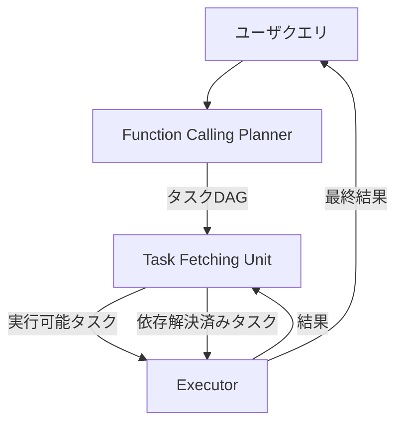

本記事は [LLMCompiler: An LLM Compiler for Parallel Function Calling](https://arxiv.org/abs/2312.04511)（arXiv:2312.04511、ICML 2024採択）の解説記事です。

## 論文概要（Abstract）

LLMCompilerは、LLMの外部関数呼び出しを効率的に並列実行するためのフレームワークである。従来のReActパターンでは関数呼び出しが逐次的に行われるため、独立した呼び出しが存在する場合でもレイテンシが積み上がっていた。著者らは古典的なコンパイラ理論からの類推に基づき、関数呼び出し間の依存関係をDAG（有向非巡回グラフ）として分析し、独立した呼び出しを並列にディスパッチする3コンポーネントアーキテクチャを提案している。論文の実験結果によると、ReActと比較してレイテンシを最大3.7倍、コストを最大6.7倍削減し、精度も最大約9%向上したと報告されている。

この記事は [Zenn記事: LangGraphステートマシンの本番設計：永続化・並列実行・動的グラフ構成](https://zenn.dev/0h_n0/articles/f76764a6501cf4) の深掘りです。

## 情報源

- **会議名**: ICML 2024（International Conference on Machine Learning）
- **arXiv ID**: 2312.04511
- **URL**: [https://arxiv.org/abs/2312.04511](https://arxiv.org/abs/2312.04511)
- **著者**: Sehoon Kim, Suhong Moon, Ryan Tabrizi, Nicholas Lee, Michael W. Mahoney, Kurt Keutzer, Amir Gholami
- **所属**: UC Berkeley, ICSI
- **カテゴリ**: cs.CL（計算言語学）

## カンファレンス情報

ICMLは機械学習分野のトップカンファレンスの1つであり、採択率は例年25%前後である。LLMCompilerはLLMエージェントのツール呼び出し最適化という実用的課題に対し、コンパイラ理論の知見を適用した点が評価されている。

## 背景と動機（Background & Motivation）

LLMを外部ツールと連携させるエージェントフレームワークとして、ReAct（Reasoning + Acting）が広く使われている。ReActでは、LLMが「思考→行動→観測」のループを繰り返し、1ステップごとに1つの関数を呼び出す。

しかし、この逐次実行にはレイテンシとコストの2つの問題がある。第一に、独立した関数呼び出し（例: 異なるAPIへの問い合わせ）が直列に実行されるため、レイテンシが不必要に積み上がる。第二に、各ステップでLLMが完全なコンテキスト（過去の思考・行動・観測すべて）を再処理するため、トークン消費が急速に増大する。

著者らは、これらの問題が古典的なコンパイラにおける命令スケジューリングの課題と構造的に等価であることに着目した。コンパイラが命令間の依存関係を分析し、独立な命令をCPUパイプラインで並列実行するのと同様に、LLMの関数呼び出し間の依存関係を分析し、独立な呼び出しを並列にディスパッチする。

## 主要な貢献（Key Contributions）

論文が示す主要な貢献は以下の3点である。

- **コンパイラ理論のLLMへの適用**: 関数呼び出しの依存関係をDAGとして明示的にモデル化し、古典的なスケジューリングアルゴリズムを適用するフレームワークを提案
- **3コンポーネントアーキテクチャ**: Planner・Task Fetching Unit・Executorの3層構造により、計画と実行を分離し並列性を最大化
- **ストリーミング統合**: Plannerの出力を逐次的にTask Fetching Unitに渡すことで、計画と実行のパイプライン化を実現

## 技術的詳細（Technical Details）

### アーキテクチャ

LLMCompilerは3つのコンポーネントで構成される。



**1. Function Calling Planner（計画器）**

Plannerは入力クエリとツール定義を受け取り、関数呼び出しの実行計画をDAGとして生成する。各タスクは以下の形式で出力される。

```
1. search("query A")
2. search("query B")
3. join(1, 2)  # タスク1,2の完了を待機
4. summarize($1, $2)  # $1, $2はタスク1,2の出力を参照
```

ここで`$i`は第$i$タスクの出力を参照するプレースホルダーである。依存関係が明示的に記述されるため、タスク1とタスク2は並列実行可能と判定できる。

**2. Task Fetching Unit（タスク取得部）**

Task Fetching Unitは、DAG内のタスクの依存関係を監視し、すべての前提タスクが完了したタスクをExecutorにディスパッチする。プレースホルダー`$i`を実際の出力値で置換する処理もここで行われる。

**3. Executor（実行器）**

Executorは受け取ったタスクを並列に実行する。独立なタスクは同時にAPIを呼び出し、すべてのタスクが完了するとjoinノードが後続の処理をトリガーする。

### DAGスケジューリングの形式化

$n$個のタスク$\{t_1, t_2, \ldots, t_n\}$に対し、依存関係を有向辺$E \subseteq \{(t_i, t_j) \mid i \neq j\}$で表す。$(t_i, t_j) \in E$は「タスク$t_j$はタスク$t_i$の完了を待つ必要がある」ことを意味する。

並列実行可能なタスク集合$P_k$は、ステップ$k$において入次数が0のタスクの集合として定義される。

$$
P_k = \{t_i \mid \text{deg}^{-}(t_i) = 0 \text{ in } G_k\}
$$

ここで$G_k$はステップ$k$時点での残余グラフである。各ステップで$P_k$内の全タスクを並列実行し、完了したタスクとその出辺をグラフから除去して次のステップに進む。

### ストリーミングパイプライン

著者らは、Plannerの出力をストリーミングでTask Fetching Unitに渡すことで、計画と実行のパイプライン化を実現している。Plannerがタスク1,2を出力した時点でそれらの実行を開始し、タスク3,4の計画と並行して処理を進められる。この方式により、全タスクの計画完了を待つ必要がなくなり、端末間レイテンシがさらに削減される。

## 実験結果（Results）

論文は3つのベンチマークで評価を行っている。

### HotpotQA（マルチホップ質問応答）

複数のWikipedia記事を横断して回答する必要があるQAタスクである。

| 手法 | 精度 | レイテンシ（相対） | コスト（相対） |
|------|------|-----------------|-------------|
| ReAct | ベースライン | 1.0x | 1.0x |
| OpenAI並列FC | ベースライン+α | 改善あり | 改善あり |
| LLMCompiler | **+約9%** | **3.7x削減** | **6.7x削減** |

### Movie Recommendation

ユーザの好みに基づいて映画を推薦するタスクで、複数のAPI呼び出し（映画検索、レビュー取得、類似作品検索）が必要である。

### ParallelQA

著者らが設計した、明示的に並列実行可能な関数呼び出しを含むベンチマークである。

論文Table 1によると、LLMCompilerはReActと比較してレイテンシを最大3.7倍、コストを最大6.7倍削減している。精度についても最大約9%の向上が報告されている。コスト削減の主因は、LLMの再呼び出し回数の削減（計画を1回で生成）とコンテキストの再処理の排除である。

## 実装のポイント（Implementation）

### LangGraphとの関連

Zenn記事で解説されているLangGraphのSend APIによる動的ファンアウトは、LLMCompilerのDAGスケジューリングと概念的に共通する部分がある。両者とも実行時に並列ワーカー数を動的に決定し、独立したタスクを同時実行する。

LLMCompilerはPlanner-Executor分離アーキテクチャを採用しているのに対し、LangGraphのSend APIは条件付きエッジから直接`Send`オブジェクトを返すことで同様の並列実行を実現する。LangGraphのアプローチはフレームワークレベルで統合されているため、チェックポイントやスーパーステップのトランザクション性といった機能を自動的に享受できる。

### 実装上の注意点

```python
from langgraph.types import Send
from langgraph.graph import StateGraph, START, END

def route_to_parallel_tools(state: dict) -> list[Send]:
    """LLMCompiler的なDAGスケジューリングを
    LangGraphのSend APIで実現する例"""
    tasks = state["planned_tasks"]
    ready_tasks = [t for t in tasks if all(
        dep in state["completed"] for dep in t["dependencies"]
    )]
    return [
        Send("execute_tool", {**state, "current_task": task})
        for task in ready_tasks
    ]
```

APIレート制限への対応も重要である。論文では言及されていないが、20ノードが同時にLLM APIを呼び出すとTPM（Tokens Per Minute）を急速に消費する。本番環境ではセマフォや指数バックオフによるスロットリングの実装が必要である。

## Production Deployment Guide

### AWS実装パターン（コスト最適化重視）

LLMCompiler的な並列関数呼び出しパターンのAWSデプロイ構成を示す。

| 規模 | 月間リクエスト | 推奨構成 | 月額コスト | 主要サービス |
|------|-------------|---------|-----------|------------|
| **Small** | ~3,000 | Serverless | $50-150 | Lambda + Step Functions + Bedrock |
| **Medium** | ~30,000 | Hybrid | $300-800 | ECS Fargate + SQS + Bedrock |
| **Large** | 300,000+ | Container | $2,000-5,000 | EKS + Karpenter + Bedrock Batch |

**Small構成の詳細** (月額$50-150):
- **Step Functions**: DAGスケジューリング、並列ブランチ管理 ($25/月)
- **Lambda**: 各ツール呼び出しを個別関数で実行 ($30/月)
- **Bedrock**: Claude 3.5 Haiku, Planner用 ($50/月)
- **DynamoDB**: タスク状態管理 ($10/月)

**コスト試算の注意事項**: 上記は2026年7月時点のAWS ap-northeast-1料金に基づく概算値です。最新料金は[AWS料金計算ツール](https://calculator.aws/)で確認してください。

### Terraformインフラコード

```hcl
resource "aws_sfn_state_machine" "llm_compiler" {
  name     = "llm-compiler-dag"
  role_arn = aws_iam_role.sfn_role.arn

  definition = jsonencode({
    StartAt = "PlanTasks"
    States = {
      PlanTasks = {
        Type     = "Task"
        Resource = aws_lambda_function.planner.arn
        Next     = "ExecuteParallel"
      }
      ExecuteParallel = {
        Type = "Parallel"
        Branches = [
          {
            StartAt = "Tool1"
            States = {
              Tool1 = { Type = "Task", Resource = aws_lambda_function.executor.arn, End = true }
            }
          },
          {
            StartAt = "Tool2"
            States = {
              Tool2 = { Type = "Task", Resource = aws_lambda_function.executor.arn, End = true }
            }
          }
        ]
        Next = "JoinResults"
      }
      JoinResults = {
        Type     = "Task"
        Resource = aws_lambda_function.joiner.arn
        End      = true
      }
    }
  })
}

resource "aws_lambda_function" "planner" {
  filename      = "planner.zip"
  function_name = "llm-compiler-planner"
  role          = aws_iam_role.lambda_role.arn
  handler       = "index.handler"
  runtime       = "python3.12"
  timeout       = 30
  memory_size   = 512

  environment {
    variables = {
      BEDROCK_MODEL_ID = "anthropic.claude-3-5-haiku-20241022-v1:0"
    }
  }
}

resource "aws_lambda_function" "executor" {
  filename      = "executor.zip"
  function_name = "llm-compiler-executor"
  role          = aws_iam_role.lambda_role.arn
  handler       = "index.handler"
  runtime       = "python3.12"
  timeout       = 60
  memory_size   = 1024
}

resource "aws_cloudwatch_metric_alarm" "parallel_cost" {
  alarm_name          = "llm-compiler-parallel-cost"
  comparison_operator = "GreaterThanThreshold"
  evaluation_periods  = 1
  metric_name         = "ExecutionsSucceeded"
  namespace           = "AWS/States"
  period              = 3600
  statistic           = "Sum"
  threshold           = 1000
  alarm_description   = "Step Functions実行数異常"
}
```

### 運用・監視設定

```python
import boto3

cloudwatch = boto3.client('cloudwatch')

cloudwatch.put_metric_alarm(
    AlarmName='parallel-execution-latency',
    ComparisonOperator='GreaterThanThreshold',
    EvaluationPeriods=2,
    MetricName='ExecutionTime',
    Namespace='AWS/States',
    Period=300,
    Statistic='p99',
    Threshold=30000,
    AlarmDescription='並列実行レイテンシP99異常'
)
```

### コスト最適化チェックリスト

- [ ] Step Functions: Standard → Express切替で低レイテンシ・低コスト
- [ ] Lambda: 並列実行数をReserved Concurrencyで制限
- [ ] Bedrock: Planner呼び出しにPrompt Caching適用
- [ ] Bedrock Batch API: 非リアルタイム処理で50%割引
- [ ] DynamoDB: TTLでタスク状態自動削除
- [ ] CloudWatch: 並列実行数・レイテンシ監視
- [ ] AWS Budgets: 月額予算設定
- [ ] Cost Anomaly Detection: 自動異常検知

## 関連研究（Related Work）

- **ReAct** (Yao et al., 2023): LLMの推論と行動を交互に実行するフレームワーク。LLMCompilerはReActの逐次実行を並列化したものと位置づけられる
- **Toolformer** (Schick et al., 2023): LLM自身がツール呼び出しのタイミングを学習する手法。LLMCompilerとは異なり、訓練時にツール使用を組み込む
- **OpenAI Parallel Function Calling**: GPT-4のネイティブ並列関数呼び出し機能。LLMCompilerはモデルに依存しないフレームワークレベルのアプローチである点で異なる

## まとめと今後の展望

LLMCompilerは、コンパイラ理論のDAGスケジューリングをLLMの関数呼び出しに適用し、レイテンシ・コスト・精度のすべてで改善を実現した。Zenn記事で解説されているLangGraphのSend APIやスーパーステップの概念と組み合わせることで、より効率的な本番エージェントの構築が可能になる。

## 参考文献

- **arXiv**: [https://arxiv.org/abs/2312.04511](https://arxiv.org/abs/2312.04511)
- **Code**: [https://github.com/SqueezeAILab/LLMCompiler](https://github.com/SqueezeAILab/LLMCompiler)
- **Related Zenn article**: [https://zenn.dev/0h_n0/articles/f76764a6501cf4](https://zenn.dev/0h_n0/articles/f76764a6501cf4)
