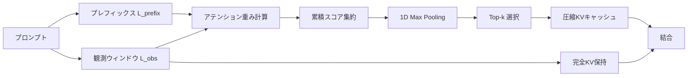

本記事は [SnapKV: LLM Knows What You are Looking for Before Generation](https://arxiv.org/abs/2404.14469)（arXiv:2404.14469、NeurIPS 2024採択）の解説記事です。

## 論文概要（Abstract）

SnapKVは、LLMのKVキャッシュサイズをファインチューニングなしで効率的に圧縮する手法である。著者らは、各アテンションヘッドが生成時にプロンプトの特定のアテンション特徴に一貫して注目するパターンを発見し、このパターンがプロンプト末尾の「観測ウィンドウ」から取得可能であることを示した。この知見に基づき、クラスタリングを用いて各ヘッドの重要なKVポジションを自動選択する。論文の報告によると、16Kトークン入力で生成速度3.6倍、メモリ効率8.2倍の向上を達成し、単一A100-80GB GPUで最大380Kコンテキストトークンの処理を可能にしている。

この記事は [Zenn記事: LLMの長いコンテキストを活かす最適解：Context Rot対策からハイブリッド設計まで](https://zenn.dev/0h_n0/articles/ba05271cd9ca43) の深掘りです。

## 情報源

- **arXiv ID**: 2404.14469
- **URL**: [https://arxiv.org/abs/2404.14469](https://arxiv.org/abs/2404.14469)
- **著者**: Yuhong Li, Yingbing Huang, Bowen Yang, Bharat Venkitesh, Acyr Locatelli et al.
- **発表年**: 2024年（NeurIPS 2024採択）
- **分野**: cs.CL（計算言語学）, cs.AI（人工知能）

## 背景と動機（Background & Motivation）

LLMの長文処理において、KVキャッシュは推論性能を左右する重要な要素である。Transformerベースのモデルでは、生成時に過去のKey-Value（KV）ペアをキャッシュすることで同一トークンの再計算を回避するが、入力系列長に比例してキャッシュサイズが線形に増大する。例えば、128Kトークンのコンテキストを持つモデルでは、KVキャッシュだけで数十GBのGPUメモリを消費し、メモリ不足やデコード速度の低下を引き起こす。

従来の対策として、H2Oのように生成フェーズで累積アテンションスコアの低いトークンを逐次的にevictする手法や、StreamingLLMのように先頭トークンと直近トークンのみを保持する手法が提案されてきた。しかし、これらは静的なポリシーに基づくため、入力の指示内容やタスクに応じた動的な適応が難しい。著者らは、プロンプトの情報を活用して生成前にKVキャッシュを圧縮する、より効果的なアプローチの必要性を指摘している。

## 主要な貢献（Key Contributions）

- **アテンションパターンの一貫性の発見**: 各アテンションヘッドが生成プロセス全体を通じて、プロンプトの特定の位置に一貫して注目するパターンを実験的に明らかにした
- **観測ウィンドウに基づくKVキャッシュ圧縮**: プロンプト末尾の少数トークン（観測ウィンドウ）のアテンション分布のみから重要なKVポジションを特定し、ファインチューニング不要でKVキャッシュを圧縮する手法を提案した
- **大規模コンテキストへのスケーリング**: 単一A100-80GB GPUで最大380Kトークンを処理可能にし、既存手法（H2O）を上回る精度を達成した

## 技術的詳細（Technical Details）

### アテンションパターンの一貫性

SnapKVの基盤となる発見は、LLMの各アテンションヘッドが生成時に注目するプロンプト位置が、生成開始前から予測可能であるという点である。著者らは、プロンプト末尾の観測ウィンドウから計算したアテンション分布と、実際の生成時のアテンション分布との重複率（Hit Rate）を測定し、層やヘッドを横断して60-90%の一貫性を確認したと報告している。

さらに、同一ドキュメントに異なる指示を与えると注目位置が変化することも示されており、静的evictionポリシーでは対応できない入力依存の圧縮の必要性を裏付けている。

### プロンプトの分割

SnapKVはプロンプトを2つの領域に分割する。

$$
L_{\text{prompt}} = L_{\text{prefix}} + L_{\text{obs}}
$$

ここで、
- $L_{\text{prompt}}$: プロンプト全体のトークン数
- $L_{\text{prefix}}$: 圧縮対象となるプレフィックス部分のトークン数
- $L_{\text{obs}}$: 観測ウィンドウのトークン数（通常16-64トークン）

観測ウィンドウはプロンプト末尾の$L_{\text{obs}}$トークンであり、タスク指示やクエリが含まれる領域である。この部分のKVペアは全て保持され、プレフィックス部分のみが圧縮対象となる。

### 投票メカニズム（Voting Mechanism）

各アテンションヘッドについて、観測ウィンドウ内の全クエリからプレフィックスの各キーへのアテンション重みを計算し、集約する。

$$
\mathbf{C} = \sum_{i=0}^{L_{\text{obs}}} \mathbf{W}_{\text{obs}}[:, i, :]
$$

ここで、
- $\mathbf{W}_{\text{obs}} \in \mathbb{R}^{N \times L_{\text{obs}} \times L_{\text{prefix}}}$: 観測ウィンドウのクエリからプレフィックスのキーへのアテンション重み行列
- $N$: アテンションヘッド数
- $\mathbf{C} \in \mathbb{R}^{N \times L_{\text{prefix}}}$: 各ヘッドにおけるプレフィックス位置ごとの累積アテンションスコア

集約したスコアから、各ヘッドで上位$k$個のプレフィックス位置を選択する。

$$
\mathbf{I} = \text{Top}_k(\mathbf{C}, k), \quad k = \lfloor p \times L_{\text{prefix}} \rfloor
$$

ここで、
- $\mathbf{I}$: 選択されたプレフィックス位置のインデックス集合
- $p$: 圧縮率（論文では$p = 0.05$、すなわち上位5%を使用）

### クラスタリングによる文脈保持

単にスコア上位のトークンだけを選択すると、文脈の断片化が起きる。例えば、重要なトークンの前後のトークンが欠落すると、induction headメカニズム（パターンコピー機能）が正常に機能しなくなる。

SnapKVでは、1Dプーリング（max pooling）を用いて隣接するトークンをクラスタリングする。具体的には、累積アテンションスコア$\mathbf{C}$に対してカーネルサイズ$K_{\text{pool}}$のmax poolingを適用した後にTop-k選択を行う。これにより、高スコアトークンの周辺コンテキストも保持される。



### Hit Rate（適中率）の定式化

投票メカニズムの有効性を評価するために、著者らはHit Rateを以下のように定義している。

まず、生成時の実際のアテンション分布$\mathbf{A}_{\text{cur}} \in \mathbb{R}^{N \times L_{\text{prefix}}}$に対して、閾値$\theta$を超える位置を重要特徴とするマスクを構築する。

$$
\mathbf{M}_{\text{threshold}} = \mathbf{1}(\mathbf{A}_{\text{cur}} > \theta)
$$

投票で選択された位置のマスクを$\mathbf{M}_{\text{vote}}$とすると、両者の重複$\mathbf{O}$は以下となる。

$$
\mathbf{O} = \mathbf{M}_{\text{threshold}} \wedge \mathbf{M}_{\text{vote}}
$$

Hit Rate $H$は、実際に重要な特徴のうち、投票で正しく選択された割合として計算される。

$$
H = \frac{\sum \mathbf{O}}{\sum \mathbf{M}_{\text{threshold}}}
$$

ここで、$\theta = 0.05$が論文で使用されている。著者らは、このHit Rateが多くの層・ヘッドで80%を超えることを報告しており、観測ウィンドウからの投票が生成時の実際のアテンションパターンを高精度に予測できることを示している。

## アルゴリズム

以下はSnapKVのKVキャッシュ圧縮アルゴリズムの擬似コードである（論文Algorithm 1に基づく）。

```python
import torch
import torch.nn.functional as F


def snap_kv_compress(
    query: torch.Tensor, key: torch.Tensor, value: torch.Tensor,
    obs_window: int = 32, max_cap: int = 1024, kernel: int = 7,
) -> tuple[torch.Tensor, torch.Tensor]:
    """SnapKVによるKVキャッシュ圧縮.

    Args:
        query: クエリ (batch, heads, seq_len, d_k)
        key: キー (batch, heads, seq_len, d_k)
        value: バリュー (batch, heads, seq_len, d_k)
        obs_window: 観測ウィンドウサイズ
        max_cap: ヘッドあたり最大保持KV数
        kernel: プーリングカーネルサイズ

    Returns:
        圧縮後の (Key, Value) タプル
    """
    seq_len = key.shape[2]
    if seq_len <= max_cap + obs_window:
        return key, value

    # プレフィックスと観測ウィンドウに分割
    pfx = seq_len - obs_window
    k_pfx, k_obs = key[:,:,:pfx,:], key[:,:,pfx:,:]
    v_pfx, v_obs = value[:,:,:pfx,:], value[:,:,pfx:,:]
    q_obs = query[:,:,pfx:,:]

    # Stage 1: 観測ウィンドウ→プレフィックスのアテンション重み集約
    d_k = query.shape[-1]
    attn = torch.softmax(
        torch.matmul(q_obs, k_pfx.transpose(-2,-1)) / (d_k**0.5), dim=-1
    )
    scores = attn.sum(dim=2)  # (batch, heads, pfx)

    # 1Dプーリングでクラスタリング → Top-k選択
    pooled = F.max_pool1d(scores, kernel, padding=kernel//2, stride=1)
    k_sel = min(max_cap, pfx)
    idx = pooled.topk(k_sel, dim=-1).indices.sort(dim=-1).values

    # Stage 2: 選択KVを収集し観測ウィンドウと結合
    idx_exp = idx.unsqueeze(-1).expand(-1, -1, -1, d_k)
    return (torch.cat([torch.gather(k_pfx, 2, idx_exp), k_obs], dim=2),
            torch.cat([torch.gather(v_pfx, 2, idx_exp), v_obs], dim=2))
```

## 実装のポイント（Implementation）

### ハイパーパラメータの選択

論文では、モデルとタスクに応じて以下の設定が使用されている。

| パラメータ | LWM-1M | LongBench | Command-R |
|-----------|--------|-----------|-----------|
| 観測ウィンドウ $L_{\text{obs}}$ | 16 | 32 | 64 |
| プーリングカーネル $K_{\text{pool}}$ | 5 | 7 | 13 |
| 最大保持数（per head） | 1024 | 1024-4096 | 1024-4096 |

観測ウィンドウサイズは、コンテキスト長が長いモデルほど大きめに設定する傾向がある。カーネルサイズについては、retrieval系タスク（Key-Value検索）ではクラスタリングの効果が顕著であり、プーリングなしでは性能が大幅に低下すると報告されている。

### 実装上の注意点

- **HuggingFace統合**: SnapKVはHuggingFace Transformersライブラリへの変更が最小限で済む設計であり、`Attention`モジュールの`forward`メソッド内でKVキャッシュ更新前に圧縮処理を挟むだけで適用可能である
- **ヘッドごとの独立選択**: 各アテンションヘッドが異なるKVポジションを選択するため、ヘッド間で圧縮後のインデックスが異なる点に注意が必要である。実装ではgather操作によるヘッドごとの個別インデックス参照が必要となる
- **プロンプトエンコーディングは未最適化**: SnapKVはプレフィル（プロンプト処理）フェーズの計算量は削減しない。圧縮はプレフィル完了後に適用され、生成フェーズのメモリとレイテンシを改善する

## Production Deployment Guide

SnapKVはLLM推論のKVキャッシュを圧縮する手法であり、長文コンテキストを扱う推論サービスに適用可能である。以下ではAWS上での実装パターンを示す。

### AWS実装パターン（コスト最適化重視）

**トラフィック量別の推奨構成**:

| 構成 | 想定トラフィック | アーキテクチャ | 月額概算 |
|------|----------------|---------------|---------|
| Small | ~100 req/日 | Lambda + Bedrock | $50-150 |
| Medium | ~1,000 req/日 | ECS Fargate + カスタムモデル | $500-1,200 |
| Large | 10,000+ req/日 | EKS + GPU Spot Instances | $3,000-8,000 |

**Small**: Lambda + Bedrock（Prompt Caching有効化）+ DynamoDB。**Medium**: ECS Fargate + vllmサーバ + SnapKVカスタムカーネル + ALB。**Large**: EKS + Karpenter + GPU Spot Instances（最大90%削減）+ Triton Inference Server。

上記は2026年7月時点のAWS東京リージョン料金に基づく概算値。実際のコストはトラフィックパターン・Spot価格変動により異なる。

### Terraformインフラコード

**Small構成（Serverless: Lambda + Bedrock + DynamoDB）**

```hcl
# SnapKV推論サービス - Small構成
terraform {
  required_version = ">= 1.9"
  required_providers {
    aws = { source = "hashicorp/aws", version = "~> 5.60" }
  }
}

provider "aws" { region = "ap-northeast-1" }

# IAMロール（最小権限: Bedrock呼び出し + DynamoDB + CloudWatch Logs）
resource "aws_iam_role" "inference_lambda" {
  name               = "snapkv-inference-lambda-role"
  assume_role_policy = jsonencode({
    Version = "2012-10-17"
    Statement = [{ Action = "sts:AssumeRole", Effect = "Allow",
                    Principal = { Service = "lambda.amazonaws.com" } }]
  })
}

resource "aws_iam_role_policy" "perms" {
  name = "snapkv-perms"
  role = aws_iam_role.inference_lambda.id
  policy = jsonencode({
    Version = "2012-10-17"
    Statement = [
      { Effect = "Allow", Action = ["bedrock:InvokeModel"],
        Resource = "arn:aws:bedrock:ap-northeast-1::foundation-model/*" },
      { Effect = "Allow", Action = ["dynamodb:GetItem","dynamodb:PutItem","dynamodb:Query"],
        Resource = aws_dynamodb_table.cache_meta.arn },
      { Effect = "Allow", Action = ["logs:CreateLogGroup","logs:CreateLogStream","logs:PutLogEvents"],
        Resource = "arn:aws:logs:ap-northeast-1:*:*" }
    ]
  })
}

resource "aws_dynamodb_table" "cache_meta" {
  name = "snapkv-cache-metadata"
  billing_mode = "PAY_PER_REQUEST"  # On-Demandでコスト最適化
  hash_key = "session_id"; range_key = "timestamp"
  attribute { name = "session_id"; type = "S" }
  attribute { name = "timestamp"; type = "N" }
  ttl { attribute_name = "expires_at"; enabled = true }
  server_side_encryption { enabled = true }
}

resource "aws_lambda_function" "inference" {
  function_name    = "snapkv-inference"
  runtime          = "python3.12"
  handler          = "handler.lambda_handler"
  role             = aws_iam_role.inference_lambda.arn
  timeout          = 300
  memory_size      = 1024
  filename         = "lambda_package.zip"
  source_code_hash = filebase64sha256("lambda_package.zip")
  environment {
    variables = { DYNAMODB_TABLE = aws_dynamodb_table.cache_meta.name,
                  MODEL_ID = "anthropic.claude-sonnet-4-20250514",
                  ENABLE_CACHING = "true" }
  }
}
```

**Large構成（Container: EKS + Karpenter + Spot）**

```hcl
module "eks" {
  source  = "terraform-aws-modules/eks/aws"
  version = "~> 20.24"
  cluster_name = "snapkv-inference"; cluster_version = "1.31"
  vpc_id = module.vpc.vpc_id; subnet_ids = module.vpc.private_subnets
  enable_cluster_creator_admin_permissions = true
}

# Karpenter NodePool（Spot優先でGPUコスト最大90%削減）
resource "kubectl_manifest" "gpu_nodepool" {
  yaml_body = yamlencode({
    apiVersion = "karpenter.sh/v1", kind = "NodePool"
    metadata = { name = "gpu-inference" }
    spec = {
      template = { spec = {
        requirements = [
          { key = "karpenter.sh/capacity-type", operator = "In", values = ["spot","on-demand"] },
          { key = "node.kubernetes.io/instance-type", operator = "In", values = ["g5.xlarge","g5.2xlarge"] }
        ]
        nodeClassRef = { name = "default" }
      }}
      limits = { cpu = "128", memory = "512Gi", "nvidia.com/gpu" = "8" }
      disruption = { consolidationPolicy = "WhenEmptyOrUnderutilized", consolidateAfter = "60s" }
    }
  })
}
```

### 運用・監視設定

**CloudWatch Logs Insights（トークン使用量分析）**:
`stats sum(token_count) as total by bin(1h)` でトークン消費の時系列傾向を監視する。

**監視コード（Python）**: CloudWatchアラーム（Bedrockトークン使用量スパイク検知、閾値500Kトークン/5分）、X-Rayトレーシング（`aws_xray_sdk`の`patch_all()`でboto3自動計装）、Cost Explorer日次レポート（サービス別コスト取得、$100/日超過でSNS通知）を設定する。

### コスト最適化チェックリスト

**アーキテクチャ選択**: トラフィック量でSmall/Medium/Large判断、長文頻度に応じてGPU vs Bedrock API選択、バースト vs 定常でスケーリング戦略決定

**リソース最適化**: GPU Spot Instances優先（最大90%削減）、Reserved Instances 1年コミット（最大72%削減）、Savings Plans検討、Lambda Power Tuningでメモリ最適化、ECS/EKSアイドル時スケールダウン、SnapKV圧縮率（max_capacity_per_head）調整でGPUメモリ節約

**LLMコスト削減**: Bedrock Batch API（50%削減）、Prompt Caching有効化（30-90%削減）、モデル選択ロジック（短文Haiku/長文Sonnet）、max_tokens制限、SnapKV圧縮でリクエスト並列数向上

**監視・アラート**: AWS Budgets（80%アラート）、CloudWatch（トークン量・レイテンシ）、Cost Anomaly Detection、日次コストレポート、GPU使用率監視

**リソース管理**: 未使用EBS/スナップショット削除、タグ戦略（Environment/Service/CostCenter）、S3ライフサイクル（90日Glacier）、開発環境夜間停止、VPCエンドポイント活用（NAT Gateway代替）

## 実験結果（Results）

### LongBenchベンチマーク

著者らはLongBenchの16データセット（6カテゴリ）で4つのモデルを評価している。以下は論文Table 1より抜粋した代表的な結果である。

| モデル | 圧縮設定 | Single-Doc QA | Multi-Doc QA | 要約 | Few-shot | Code | 平均 |
|-------|---------|--------------|-------------|------|---------|------|------|
| Mistral-7B | Full KV（ベースライン） | 26.82 | 42.77 | 26.79 | 67.19 | 55.98 | - |
| Mistral-7B | SnapKV (1024) | 26.41 | 42.05 | 26.33 | 65.81 | 55.65 | - |
| Mistral-7B | SnapKV (4096) | 26.82 | 42.32 | 26.94 | 67.13 | 55.98 | - |
| Mixtral-8x7B | Full KV | 26.81 | 38.96 | 27.39 | 67.92 | 61.24 | - |
| Mixtral-8x7B | SnapKV (4096) | 26.46 | 38.25 | 27.10 | 67.85 | 60.52 | - |

論文Table 1より、SnapKVは1024トークンへの圧縮（平均92%圧縮）でもベースラインとほぼ同等の性能を維持し、4096トークン（68%圧縮）ではさらに差が縮まることが確認されている。

### H2Oとの比較

論文の実験結果によると、Mistral-7Bにおいて、SnapKV（1024トークン）はH2O（4096トークン）を16データセット中11で上回っている。SnapKVは4分の1のキャッシュサイズでありながらH2Oを超える精度を達成したと著者らは報告している。この差は、SnapKVがプロンプトの指示内容に応じて動的に重要位置を選択できる点に起因すると考察されている。

### Needle-in-a-Haystack

LWM-Text-Chat-1Mモデルでの評価において、SnapKVはベースラインが33Kトークンでメモリ不足に陥る状況で380Kトークンまでの処理を可能にし、140Kトークンまでは100%の精度で情報を検索できたと報告されている。Command-Rモデルでは、128Kトークンのコンテキストで9.819/10（ベースライン9.866/10）と、わずか0.5%の性能低下にとどまっている（論文Figure 6より）。

### デコード速度とメモリ効率

16Kトークン入力・バッチサイズ2の条件で、ベースラインが100ms/token以上を要するのに対し、SnapKVは約40ms/tokenに短縮され、3.6倍の高速化が確認されている。メモリ効率については、ベースラインが16Kトークンで既にメモリ不足となる一方、SnapKVは131Kトークンまで処理可能であり、8.2倍の改善が報告されている（論文Figure 7より）。

## 実運用への応用（Practical Applications）

### 長文コンテキストサービス

SnapKVは、RAGシステムにおける大量の検索結果の統合や、法律文書・論文の全文要約など、長文コンテキストを必要とする推論サービスに適している。Command-Rモデルでの評価では、RAGタスクにおいてCitation F1が-1.2%、End-to-End F1が-2.1%の低下にとどまっており、実用上許容可能な範囲であると著者らは報告している。

### 並列デコードとの統合

SnapKVはMedusaなどの投機的デコード手法と組み合わせ可能であり、10Kトークンのシーケンスで標準デコード比2.2倍の高速化が報告されている。

### 制約事項

SnapKVはプレフィルフェーズの計算量は削減しない。プロンプト処理がボトルネックとなるユースケースでは効果が限定的であり、モデル本来の長文処理能力を超えた改善は期待できない。

## 関連研究（Related Work）

- **H2O（Heavy Hitter Oracle）**: Zhang et al. (2024) による手法で、生成フェーズにおいて累積アテンションスコアの低いトークンを逐次的にevictする。SnapKVとの違いは、H2Oが生成中に動的にevictionを行うのに対し、SnapKVはプロンプト処理後に一括で圧縮する点、およびSnapKVがプロンプトの指示内容に応じた動的選択を行う点にある
- **StreamingLLM**: Xiao et al. (2024) による手法で、attention sinkの発見に基づき、先頭数トークンと直近のウィンドウトークンのみを保持する。無限長のストリーミング処理が可能だが、中間のコンテキスト情報が完全に失われるため、長文理解タスクでは性能が制限される
- **KIVI**: Liu et al. (2024) による量子化ベースのKVキャッシュ圧縮手法。Key/Valueを2bitに量子化する。トークン選択とは直交するアプローチであり、SnapKVとの組み合わせが期待される

## まとめと今後の展望

SnapKVは、LLMの各アテンションヘッドがプロンプトの特定位置に一貫して注目するパターンを利用し、観測ウィンドウからの投票とクラスタリングによってKVキャッシュを効率的に圧縮する手法である。ファインチューニング不要で既存モデルに適用可能であり、92%の圧縮率でも精度低下が微小である点は実用上の大きな利点である。

今後の研究方向として、プレフィルフェーズの効率化との統合、量子化手法（KIVI等）との組み合わせ、マルチモーダルモデルへの拡張が考えられる。長文コンテキスト処理の需要が増す中で、SnapKVのようなトレーニング不要のKVキャッシュ圧縮手法は実践的な選択肢として重要性を増していく。

## 参考文献

- **arXiv**: [https://arxiv.org/abs/2404.14469](https://arxiv.org/abs/2404.14469)
- **NeurIPS 2024**: [Proceedings](https://proceedings.neurips.cc/paper_files/paper/2024/hash/28ab418242603e0f7323e54185d19bde-Abstract-Conference.html)
- **Related Zenn article**: [https://zenn.dev/0h_n0/articles/ba05271cd9ca43](https://zenn.dev/0h_n0/articles/ba05271cd9ca43)
