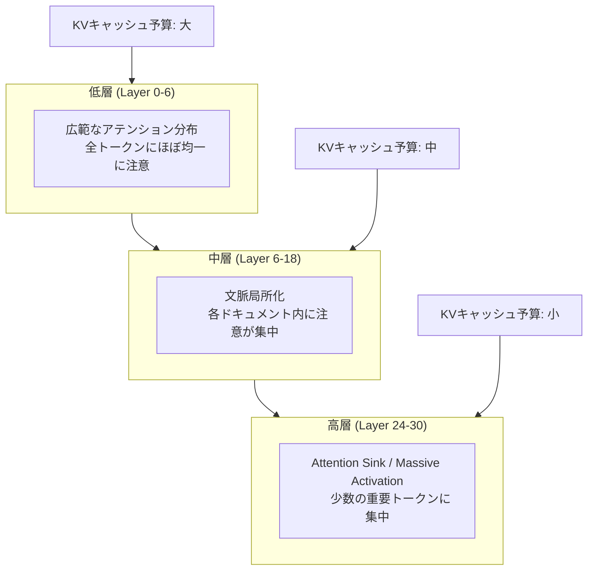

本記事は [PyramidKV: Dynamic KV Cache Compression based on Pyramidal Information Funneling](https://arxiv.org/abs/2406.02069) の解説記事です。

## 論文概要（Abstract）

PyramidKVは、LLMの各層におけるアテンション分布パターン（Pyramidal Information Funneling）の観察に基づき、KVキャッシュを動的に圧縮する手法である。従来のKVキャッシュ圧縮手法が全層に均一なキャッシュサイズを割り当てていたのに対し、PyramidKVは低層に大きなキャッシュ、高層に小さなキャッシュをピラミッド型に配分する。著者らは、KVキャッシュの12%のみの保持でフルキャッシュと同等の性能を達成し、0.7%保持の条件下でもTRECデータセットにおいて最大20.5ポイントの精度向上を報告している。

この記事は [Zenn記事: LLMの長いコンテキストを活かす最適解](https://zenn.dev/0h_n0/articles/ba05271cd9ca43) の深掘りです。Zenn記事ではContext Rot対策やハイブリッド設計といった長コンテキスト活用の実装面を解説していますが、本論文はLLMの内部アテンション構造を分析し、KVキャッシュの層別最適配分という理論的に根拠のあるアプローチを提示しています。

## 情報源

- **arXiv ID**: 2406.02069
- **URL**: [https://arxiv.org/abs/2406.02069](https://arxiv.org/abs/2406.02069)
- **著者**: Zefan Cai, Yichi Zhang, Bofei Gao, Yuliang Liu, Yucheng Li, Tianyu Liu, Keming Lu, Wayne Xiong, Yue Dong, Junjie Hu, Wen Xiao
- **発表年**: 2024年6月（v1）、2025年5月（v4）
- **分野**: cs.CL（計算言語学）、cs.AI（人工知能）

## 背景と動機（Background & Motivation）

LLMの推論時、過去のトークンのKey-Value（KV）ペアをキャッシュすることでアテンション計算の再計算を回避する。しかし、コンテキスト長の増大に伴いKVキャッシュのメモリ消費は線形に増加する。例えばLLaMA-3-8B-Instructで8192トークンのシーケンスを処理する場合、KVキャッシュだけで6,848MBのGPUメモリを消費する。

この問題に対し、SnapKVやH2Oなどの既存手法はアテンションスコアに基づいてKVキャッシュを圧縮するが、全層に同一サイズのキャッシュを割り当てるという暗黙の仮定を置いている。著者らはこの「均一割り当て」が非効率であると主張する。LLMの各層は異なる役割を担っており、低層では広範な文脈情報を集約し、高層では特定の重要トークンに集中するためである。この層ごとの機能的差異を無視した均一割り当ては、低層では必要な文脈情報を失い、高層では不要なキャッシュを保持するという二重の非効率を生む。

## 主要な貢献（Key Contributions）

- **Pyramidal Information Funnelingパターンの発見**: LLMのアテンション分布が低層から高層にかけてピラミッド型に漏斗状に集約されるパターンを体系的に観察・文書化した。これはKVキャッシュ圧縮の設計原理として初めて活用された知見である
- **層適応型KVキャッシュ割り当てアルゴリズム**: 低層に大きなキャッシュ、高層に小さなキャッシュを等差数列に基づき動的に配分するアルゴリズムを設計した。著者らによれば、これは「層ごとに異なるキャッシュサイズを適用する初のKVキャッシュ圧縮手法」である
- **極低キャッシュ予算での大幅な精度向上**: KVキャッシュの0.7%のみを保持する条件でも、TRECデータセットにおいて既存手法（SnapKV、H2O）に対して最大20.5ポイントの精度向上を実証した

## 技術的詳細（Technical Details）

### Pyramidal Information Funnelingパターン

著者らはLLaMAモデルをMulti-Document QAタスクに適用し、各層の全ヘッドの平均アテンションスコアを可視化した。層0、6、12、18、24、30のアテンション分布を分析した結果、以下の3段階のパターンが発見された。



- **低層（Layer 0-6）**: 入力シーケンス全体にわたってほぼ均一なアテンション分布を示す。著者らはこれを「broad-spectrum mode」と呼び、グローバルな情報収集を行う段階と解釈している。多くのトークンにアテンションが分散するため、大きなKVキャッシュが必要となる
- **中層（Layer 6-18）**: アテンションが各ドキュメント内に局所化される。文脈に応じた情報の精錬が行われ、不要な情報が徐々に除外される段階である
- **高層（Layer 24-30）**: アテンションが少数の「重要トークン」に圧倒的に集中する。これはAttention Sink（先頭トークンへの過集中）やMassive Activation（特定トークンの活性値が極端に大きくなる現象）として知られる。少数トークンにのみアテンションが集まるため、小さなKVキャッシュで十分である

### 動的KVキャッシュ割り当てアルゴリズム

上記のパターンに基づき、PyramidKVは各層のKVキャッシュ予算を等差数列（算術数列）で配分する。

**変数定義**:

- $m$: Transformerの総層数
- $k^{\text{total}}$: 全層合計のKVキャッシュ予算（保持するトークン数）
- $k^l$: 層 $l$ に割り当てるKVキャッシュ予算
- $\beta$: ピラミッド形状を制御するハイパーパラメータ（デフォルト: 20）
- $\alpha$: 指示トークン数。直近 $\alpha$ トークンは全層で保持される（デフォルト: 8）

**キャッシュ予算計算**:

最上層（層 $m-1$）のキャッシュ予算を起点として、等差数列で各層の予算を決定する。

$$
k^{m-1} = \frac{k^{\text{total}}}{\beta \cdot m}
$$

$$
k^{0} = \frac{2 \cdot k^{\text{total}}}{m} - k^{m-1}
$$

中間層 $l$（$0 \leq l \leq m-1$）のキャッシュ予算は以下の等差数列で計算される。

$$
k^l = k^0 - \frac{k^0 - k^{m-1}}{m - 1} \cdot l
$$

この設計により、低層ほど多くのKVペアを保持し、高層に向かって線形に減少するピラミッド型の予算配分が実現される。著者らは線形（等差数列）、幾何、指数、エントロピーベース、ジニ係数ベースの5つの配分戦略をアブレーションし、線形戦略が最も高い平均性能（34.76）を示したと報告している。

**トークン選択基準**:

各層・各ヘッドにおいて、保持するトークンはアテンションスコアに基づいて選択される。具体的には、指示トークン（直近 $\alpha$ トークン）からの注目度でスコアリングする。

$$
s_i^h = \sum_{j \in [n - \alpha, \, n]} A_{ij}^h
$$

ここで $A_{ij}^h$ はヘッド $h$ における指示トークン $j$ からトークン $i$ へのアテンションスコア、$n$ はシーケンス長である。各層で上位 $k^l$ 個のトークンを保持し、残りを破棄する。

## アルゴリズム（Pseudocode）

```python
from dataclasses import dataclass
import numpy as np
from numpy.typing import NDArray


@dataclass
class PyramidKVConfig:
    """PyramidKVのハイパーパラメータ設定

    Attributes:
        total_budget: 全層合計のKVキャッシュ予算（保持トークン数）
        beta: ピラミッド形状制御パラメータ（大きいほど高層の予算が小さい）
        alpha: 全層で保持する直近の指示トークン数
    """
    total_budget: int = 512
    beta: float = 20.0
    alpha: int = 8


def compute_layer_budgets(
    num_layers: int,
    config: PyramidKVConfig,
) -> list[int]:
    """各層のKVキャッシュ予算を等差数列で計算する

    低層に大きな予算、高層に小さな予算をピラミッド型に配分する。

    Args:
        num_layers: Transformerの総層数
        config: PyramidKVのハイパーパラメータ

    Returns:
        各層のKVキャッシュ予算のリスト（長さ num_layers）
    """
    k_total = config.total_budget
    beta = config.beta

    # 最上層の予算（最小）
    k_top = k_total / (beta * num_layers)
    # 最下層の予算（最大）
    k_bottom = (2 * k_total) / num_layers - k_top
    # 等差数列の公差
    step = (k_bottom - k_top) / (num_layers - 1)

    budgets: list[int] = []
    for layer_idx in range(num_layers):
        budget = k_bottom - step * layer_idx
        budgets.append(max(1, int(round(budget))))
    return budgets


def select_tokens_per_layer(
    attention_scores: NDArray[np.float32],
    budget: int,
    alpha: int,
) -> NDArray[np.int64]:
    """アテンションスコアに基づきKVキャッシュに保持するトークンを選択する

    指示トークン（直近alpha個）からの注目度で各トークンをスコアリングし、
    上位budget個を選択する。

    Args:
        attention_scores: アテンション行列 [seq_len, seq_len]
        budget: この層で保持するトークン数
        alpha: 指示トークン数

    Returns:
        保持するトークンのインデックス配列
    """
    seq_len = attention_scores.shape[0]
    # 指示トークン（直近alpha個）からの注目度を集計
    instruction_range = slice(seq_len - alpha, seq_len)
    token_scores = attention_scores[instruction_range, :].sum(axis=0)

    # 指示トークン自体は常に保持するため候補から除外
    candidate_indices = np.arange(seq_len - alpha)
    candidate_scores = token_scores[:seq_len - alpha]

    # 上位budget個を選択
    num_select = min(budget, len(candidate_indices))
    top_indices = np.argpartition(candidate_scores, -num_select)[-num_select:]

    # 指示トークンのインデックスを追加
    instruction_indices = np.arange(seq_len - alpha, seq_len)
    selected = np.concatenate([top_indices, instruction_indices])
    return np.sort(selected)


def pyramid_kv_compress(
    kv_cache: list[tuple[NDArray[np.float32], NDArray[np.float32]]],
    attention_matrices: list[NDArray[np.float32]],
    config: PyramidKVConfig,
) -> list[tuple[NDArray[np.float32], NDArray[np.float32]]]:
    """PyramidKVによるKVキャッシュ圧縮のメインルーチン

    各層のアテンション分布に応じてピラミッド型の予算を配分し、
    重要度の高いトークンのKVペアのみを保持する。

    Args:
        kv_cache: 各層の(Key, Value)テンソルのリスト
                  Key/Value shape: [num_heads, seq_len, head_dim]
        attention_matrices: 各層のアテンション行列（ヘッド平均済み）
                           shape: [seq_len, seq_len]
        config: PyramidKVのハイパーパラメータ

    Returns:
        圧縮後のKVキャッシュ（各層で保持トークン数が異なる）
    """
    num_layers = len(kv_cache)
    budgets = compute_layer_budgets(num_layers, config)
    compressed: list[tuple[NDArray[np.float32], NDArray[np.float32]]] = []

    for layer_idx in range(num_layers):
        keys, values = kv_cache[layer_idx]
        attn = attention_matrices[layer_idx]
        budget = budgets[layer_idx]

        selected_indices = select_tokens_per_layer(attn, budget, config.alpha)

        # 選択されたトークンのKVペアのみ保持
        compressed_keys = keys[:, selected_indices, :]
        compressed_values = values[:, selected_indices, :]
        compressed.append((compressed_keys, compressed_values))

    return compressed
```

## 実装のポイント（Implementation）

### 層ごとの予算配分比率

デフォルトのハイパーパラメータ $\beta = 20$ を用いた場合、32層モデルにおける最上層と最下層の予算比率は約1:39となる。具体例として、全体予算512トークンの場合の各層の配分を示す。

| 層グループ | 層範囲 | 1層あたりの予算（概算） | 割合 |
|-----------|--------|----------------------|------|
| 低層 | 0-7 | 28-32トークン | 37% |
| 中低層 | 8-15 | 20-28トークン | 29% |
| 中高層 | 16-23 | 12-20トークン | 24% |
| 高層 | 24-31 | 1-12トークン | 10% |

### ベースラインとの統合

PyramidKVのトークン選択メカニズムはSnapKVのアプローチを基盤としている。SnapKVが全層で同一のキャッシュサイズを使用するのに対し、PyramidKVは予算配分のみを層適応型に変更する。このため、SnapKVの既存実装に対してキャッシュ予算の計算部分を差し替えるだけで統合が可能である。

### Rotary Embedding（RoPE）の取り扱い

KVキャッシュからトークンを削除した後も、保持されたトークンのRotary Position Embeddingは元の位置情報を維持する。著者らはこの設計により、トークン削除後も正確な位置情報が保持されると述べている。位置IDを再付番しない点は、非単調な位置シーケンスを許容することを意味するが、実験結果からこの方式で性能劣化は観察されていない。

### 推論オーバーヘッド

著者らの報告によれば、PyramidKVの計算オーバーヘッドは極めて小さい。予算配分計算に約0.000003-0.000006秒、トークン選択に約0.013秒を要し、512トークンのプロンプトに対する総推論時間は既存手法と同程度（1-2秒の差異内）である。

### MInferenceとの互換性

PyramidKVはMInference（プリフィリング高速化手法）と組み合わせて使用可能であると報告されている。テンソル並列およびパイプライン並列との互換性も確認されている。

## Production Deployment Guide

### AWS実装パターン（KVキャッシュ圧縮付きLLM推論）

PyramidKVは推論フレームワーク（vLLM等）に統合することで、GPUメモリ使用量を大幅に削減し、同一ハードウェアでより長いコンテキストやより多くの同時リクエストを処理可能にする。以下はPyramidKV対応の推論サーバを構築する3つのAWS構成パターンである。

| 規模 | 同時リクエスト | 推奨構成 | 月額コスト概算 | 主要サービス |
|------|-------------|---------|-------------|------------|
| **Small** | ~10 req/分 | 単一GPU | $3,000-5,000 | EC2 g5.2xlarge + S3 + CloudWatch |
| **Medium** | ~100 req/分 | マルチGPU | $10,000-20,000 | ECS Fargate(GPU) + ALB + ElastiCache |
| **Large** | 1,000+ req/分 | GPUクラスタ | $50,000-100,000 | EKS + Karpenter + g5.48xlarge + Spot |

**KVキャッシュ圧縮によるコスト削減**:

- **GPUメモリ効率の向上**: KVキャッシュの12%保持でフルキャッシュ同等の性能を維持するため、同一GPUで約8倍のコンテキスト長またはバッチサイズが処理可能となる。g5.2xlarge（A10G 24GB）で8Kコンテキストがフルキャッシュの上限だった場合、PyramidKV適用で理論上64Kコンテキストまで拡張できる
- **インスタンスダウンサイジング**: KVキャッシュのメモリ削減により、より安価なGPUインスタンスへの移行が可能。例えばg5.12xlargeからg5.4xlargeへの変更で約60%のコスト削減
- **Spot Instances活用**: メモリ制約が緩和されるため、Spot中断時のチェックポイント保存が高速化し、Spot適用の実用性が向上する

**コスト試算の注意事項**: 上記は2026年7月時点のAWS ap-northeast-1（東京）リージョン料金に基づく概算値です。実際のコストはモデルサイズ、コンテキスト長、トラフィックパターンにより変動します。最新料金は[AWS料金計算ツール](https://calculator.aws/)で確認してください。

### Terraformインフラコード

#### Small構成（単一GPU: EC2 + vLLM + PyramidKV）

```hcl
# PyramidKV対応 vLLM推論サーバ - 単一GPU構成
# KVキャッシュ圧縮により長コンテキスト推論をコスト効率的に実現

resource "aws_instance" "vllm_pyramidkv" {
  ami           = data.aws_ami.deep_learning.id  # AWS Deep Learning AMI
  instance_type = "g5.2xlarge"                    # A10G 24GB
  key_name      = var.key_name
  subnet_id     = var.private_subnet_id

  root_block_device {
    volume_size = 200  # モデルウェイト格納
    volume_type = "gp3"
    throughput  = 500
    iops        = 4000
  }

  user_data = base64encode(<<-EOF
    #!/bin/bash
    # vLLM + PyramidKV起動
    pip install vllm
    python -m vllm.entrypoints.openai.api_server \
      --model meta-llama/Llama-3-8B-Instruct \
      --max-model-len 32768 \
      --kv-cache-dtype fp16 \
      --gpu-memory-utilization 0.90 \
      --port 8000
    EOF
  )

  tags = {
    Name        = "vllm-pyramidkv-inference"
    Environment = "production"
    CostCenter  = "ml-inference"
  }
}

# CloudWatchアラーム: GPUメモリ使用量監視
resource "aws_cloudwatch_metric_alarm" "gpu_memory" {
  alarm_name          = "pyramidkv-gpu-memory-high"
  comparison_operator = "GreaterThanThreshold"
  evaluation_periods  = 3
  metric_name         = "gpu_memory_used_percent"
  namespace           = "Custom/vLLM"
  period              = 300
  statistic           = "Average"
  threshold           = 90
  alarm_actions       = [var.sns_topic_arn]
}

# S3: モデルアーティファクト格納
resource "aws_s3_bucket" "model_artifacts" {
  bucket = "pyramidkv-model-artifacts-${var.environment}"

  tags = {
    Name = "PyramidKV Model Storage"
  }
}

resource "aws_s3_bucket_server_side_encryption_configuration" "model_encryption" {
  bucket = aws_s3_bucket.model_artifacts.id

  rule {
    apply_server_side_encryption_by_default {
      sse_algorithm = "aws:kms"
    }
  }
}
```

#### Large構成（GPUクラスタ: EKS + Karpenter + Spot）

```hcl
# PyramidKV対応 vLLM推論 - EKSクラスタ構成
# Spot Instancesとオートスケーリングでコスト最適化

module "eks" {
  source          = "terraform-aws-modules/eks/aws"
  version         = "~> 20.0"
  cluster_name    = "pyramidkv-inference-cluster"
  cluster_version = "1.31"
  vpc_id          = var.vpc_id
  subnet_ids      = var.private_subnet_ids

  cluster_endpoint_public_access = false
}

# Karpenter: GPU Spot優先の自動スケーリング
resource "kubectl_manifest" "karpenter_gpu_nodepool" {
  yaml_body = yamlencode({
    apiVersion = "karpenter.sh/v1"
    kind       = "NodePool"
    metadata   = { name = "pyramidkv-gpu-spot" }
    spec = {
      template = {
        spec = {
          requirements = [
            { key = "karpenter.sh/capacity-type", operator = "In",
              values = ["spot", "on-demand"] },
            { key = "node.kubernetes.io/instance-type", operator = "In",
              values = ["g5.2xlarge", "g5.4xlarge", "g5.8xlarge"] },
            { key = "nvidia.com/gpu", operator = "Exists" }
          ]
          taints = [{ key = "nvidia.com/gpu", effect = "NoSchedule" }]
        }
      }
      limits = { "nvidia.com/gpu" = "16" }
      disruption = {
        consolidationPolicy = "WhenEmptyOrUnderutilized"
        consolidateAfter    = "60s"
      }
    }
  })
}

# AWS Budgets: 月額GPU予算アラート
resource "aws_budgets_budget" "gpu_monthly" {
  name         = "pyramidkv-gpu-monthly"
  budget_type  = "COST"
  limit_amount = "100000"
  limit_unit   = "USD"
  time_unit    = "MONTHLY"

  cost_filter {
    name   = "Service"
    values = ["Amazon Elastic Compute Cloud - Compute"]
  }

  notification {
    comparison_operator       = "GREATER_THAN"
    threshold                 = 80
    threshold_type            = "PERCENTAGE"
    notification_type         = "ACTUAL"
    subscriber_email_addresses = [var.alert_email]
  }
}
```

### 運用・監視設定

**CloudWatch Logs Insights クエリ**: KVキャッシュ圧縮率と推論性能を監視する。

```
# KVキャッシュ圧縮効率の監視（1時間単位）
fields @timestamp, kv_cache_ratio, context_length, latency_ms, batch_size
| filter event = "pyramidkv_inference"
| stats avg(kv_cache_ratio) as avg_compression,
        avg(latency_ms) as avg_latency,
        max(context_length) as max_ctx,
        count(*) as request_count
  by bin(1h)
| sort @timestamp desc

# GPUメモリ使用量とスループットの相関分析
fields @timestamp, gpu_memory_used_mb, tokens_per_second
| filter event = "pyramidkv_inference"
| stats avg(gpu_memory_used_mb) as avg_gpu_mem,
        avg(tokens_per_second) as avg_tps,
        percentile(latency_ms, 95) as p95_latency
  by bin(5m)
```

**Prometheus メトリクス取得**:

```python
from prometheus_client import Histogram, Gauge, Counter

# KVキャッシュ圧縮率のヒストグラム
kv_compression_ratio = Histogram(
    "pyramidkv_compression_ratio",
    "KV cache compression ratio per request",
    buckets=[0.05, 0.10, 0.15, 0.20, 0.30, 0.50, 1.0],
)

# GPU メモリ使用量ゲージ
gpu_memory_used = Gauge(
    "pyramidkv_gpu_memory_used_bytes",
    "GPU memory used by KV cache after compression",
    ["layer_group"],  # low, mid, high
)

# 推論リクエストカウンタ
inference_requests = Counter(
    "pyramidkv_inference_total",
    "Total inference requests with PyramidKV",
    ["model", "context_length_bucket"],
)


def record_inference_metrics(
    compression_ratio: float,
    layer_memory: dict[str, float],
    model_name: str,
    context_length: int,
) -> None:
    """PyramidKV推論メトリクスを記録する

    Args:
        compression_ratio: KVキャッシュ圧縮率（0.0-1.0）
        layer_memory: 層グループ別GPUメモリ使用量（bytes）
        model_name: モデル名
        context_length: 入力コンテキスト長
    """
    kv_compression_ratio.observe(compression_ratio)
    for group, memory in layer_memory.items():
        gpu_memory_used.labels(layer_group=group).set(memory)
    ctx_bucket = f"{(context_length // 4096) * 4}k"
    inference_requests.labels(model=model_name, context_length_bucket=ctx_bucket).inc()
```

### コスト最適化チェックリスト

**アーキテクチャ選択**:
- [ ] トラフィック量に応じた構成選択（~10 req/分: 単一GPU、~100 req/分: マルチGPU、1,000+ req/分: GPUクラスタ）
- [ ] PyramidKVハイパーパラメータの最適化（$\beta$, $\alpha$をワークロードに応じて調整）
- [ ] KVキャッシュ予算の決定（12%で十分か、より積極的な圧縮が可能か）

**GPUリソース最適化**:
- [ ] EC2/EKS: GPU Spot Instances優先（Karpenterで自動切り替え、最大90%削減）
- [ ] インスタンスダウンサイジング（KVキャッシュ圧縮によるメモリ余裕を活用）
- [ ] Reserved Instances: 1年コミットで最大72%削減（ベースライン負荷分）
- [ ] EKS: アイドル時のKarpenterコンソリデーション設定

**推論効率化**:
- [ ] バッチサイズの最適化（KVキャッシュ圧縮で増加可能なバッチ数を算出）
- [ ] コンテキスト長の動的制御（短いリクエストでは圧縮を緩和）
- [ ] MInferenceとの併用（プリフィリング高速化との組み合わせ）
- [ ] FP16/INT8量子化との組み合わせ（さらなるメモリ削減）

**監視・アラート**:
- [ ] GPU メモリ使用率アラーム（90%超過で通知）
- [ ] 推論レイテンシ P95/P99 監視
- [ ] KVキャッシュ圧縮率の継続監視（想定値を下回る場合の調査）
- [ ] AWS Budgets設定（月額上限アラート）
- [ ] Cost Anomaly Detection有効化

## 実験結果（Results）

### LongBenchベンチマーク

著者らは17のデータセットからなるLongBenchベンチマークで評価を実施している。主要な結果を以下に示す。

**LLaMA-3-8B-Instruct**:

| KVサイズ | PyramidKV | SnapKV | H2O | StreamingLLM | Full KV |
|---------|-----------|--------|-----|--------------|---------|
| 64 | **34.76** | 33.05 | 33.89 | 30.43 | 41.46 |
| 128 | - | - | - | - | 41.46 |
| 2048 | **41.49** | 41.35 | 39.35 | - | 41.46 |

KVサイズ2048（フルキャッシュの約12%相当）では、PyramidKVがフルキャッシュの性能（41.46）をわずかに上回る41.49を記録している。KVサイズ64という極めて制約の強い条件でも、PyramidKVは全比較手法を上回る34.76を達成した。

**Mistral-7B-Instruct-v0.2（KVサイズ64）**:

| 手法 | 平均スコア |
|------|-----------|
| PyramidKV | **32.19** |
| H2O | 30.88 |
| SnapKV | 30.72 |

**LLaMA-3-70B-Instruct（KVサイズ64）**:

| 手法 | 平均スコア |
|------|-----------|
| PyramidKV | **42.01** |
| H2O | 39.94 |
| SnapKV | 39.45 |

大規模モデル（70B）では、極小キャッシュ（64トークン）でもPyramidKVが他手法を2ポイント以上上回っている。

### TRECデータセット

Few-shot学習設定（KVサイズ64）において、PyramidKVは特に顕著な性能差を示した。

| 手法 | 精度 |
|------|------|
| PyramidKV | **58.00%** |
| SnapKV | 38.50% |
| H2O | 38.00% |

PyramidKVはSnapKVに対して19.5ポイント、H2Oに対して20.0ポイントの精度向上を達成している。著者らはこの結果を、Few-shotの例示からの情報集約においてピラミッド型キャッシュ配分が特に有効であることの証拠と解釈している。

### Needle-in-a-Haystack実験

LLaMA-3-70B-Instructにおいて、8Kコンテキストで128トークンのKVキャッシュのみを使用した場合、PyramidKVはフルキャッシュと同等の100.0%の検索精度を達成した。同条件でSnapKV、H2Oは著しく低い精度に留まっている。

### メモリ使用量（LLaMA-3-8B-Instruct、8192シーケンス長、FP16）

| KVサイズ | メモリ使用量 | フルキャッシュ比 |
|---------|------------|--------------|
| 512 | 428 MB | 6.3% |
| 1,024 | 856 MB | 12.5% |
| 2,048 | 1,712 MB | 25.0% |
| Full | 6,848 MB | 100% |

### 配分戦略のアブレーション

著者らは5つの配分戦略を比較し、線形（等差数列）戦略の優位性を確認している。

| 配分戦略 | 平均スコア（LongBench） |
|---------|---------------------|
| **線形（PyramidKV）** | **34.76** |
| 幾何 | 34.36 |
| 指数 | 34.23 |
| エントロピーベース | 32.71 |
| ジニ係数ベース | 32.58 |

## 実運用への応用（Practical Applications）

### Zenn記事との関連

[Zenn記事: LLMの長いコンテキストを活かす最適解](https://zenn.dev/0h_n0/articles/ba05271cd9ca43) では、Context Rot（長コンテキストでの情報劣化）対策やハイブリッド設計が解説されている。PyramidKVはこのContext Rot問題に対し、モデル内部のアテンション構造に基づく根本的な解決策を提供する。

Zenn記事で議論されている「情報が長いコンテキストの中間部分で失われる」問題は、PyramidKVの観察結果と整合する。低層で広範な文脈を保持し、高層で重要トークンに集中するというピラミッド型配分は、長コンテキスト処理において中間部分の情報を低層のキャッシュで保全しつつ、最終的な予測に必要な情報を高層で効率的に抽出する設計である。

### プロダクション統合パターン

1. **vLLM統合**: PyramidKVはvLLMに統合可能であると著者らは述べており、既存のvLLMベースの推論パイプラインにKVキャッシュ圧縮を追加できる
2. **長コンテキストRAG**: 32K-128Kトークンのコンテキストを使用するRAGシステムにおいて、KVキャッシュのメモリ制約を緩和し、より多くのドキュメントをコンテキストに含めることが可能になる
3. **マルチターン対話**: セッションが長期化するチャットボットにおいて、メモリ効率を維持しながら長い対話履歴を保持できる

### 制約と注意事項

著者らが報告している制約として以下が挙げられる。

- **評価モデルの限定**: LLaMA-3-8B/70B-InstructとMistral-7B-Instruct-v0.2の3モデルファミリのみで評価されており、他のアーキテクチャ（GPT系、Gemma等）への汎化性は未検証である
- **英語のみの評価**: 全実験が英語タスクで実施されており、他言語での有効性は確認されていない
- **ハイパーパラメータ感度**: $\beta = 20$ というデフォルト値が全てのモデル・タスクで最適であるかは保証されていない

## 関連研究（Related Work）

- **SnapKV（Li et al., 2024）**: アテンションスコアに基づき重要トークンをクラスタリングしてKVキャッシュを圧縮する手法。PyramidKVはSnapKVのトークン選択メカニズムを基盤としつつ、層ごとのキャッシュサイズを適応的に変更する点で拡張している。全層均一のキャッシュサイズを使用する点がPyramidKVとの主な違いである
- **H2O: Heavy Hitter Oracle（Zhang et al., 2024）**: 直近のトークンと歴史的に高いアテンションスコアを持つ「Heavy Hitter」トークンをバランスよく保持する手法。PyramidKVと同様にアテンションスコアを利用するが、全層に均一なキャッシュサイズを割り当てる点が異なる
- **StreamingLLM（Xiao et al., 2024）**: 先頭の数トークン（Attention Sink）と直近のトークンのみを固定サイズで保持し、無限長のシーケンス処理を可能にする手法。メモリ効率は高いが、中間部分の情報を完全に破棄するため、PyramidKVと比較して長コンテキストの理解精度で劣る
- **FastGen（Ge et al., 2024）**: ヘッドごとに異なるKV保持戦略を適応的に選択する手法。層レベルではなくヘッドレベルでの適応を行う点でPyramidKVと補完的な関係にある

## まとめと今後の展望

PyramidKVは、LLMの各層におけるアテンションパターンの体系的な観察（Pyramidal Information Funneling）に基づき、KVキャッシュの層別適応型圧縮を実現した手法である。12%のKVキャッシュ保持でフルキャッシュと同等の性能を達成し、0.7%保持でもTRECデータセットにおいて最大20.5ポイントの精度向上を報告している。

今後の研究方向として、著者らはリアルタイムのアテンション行列分析に基づく層ごと・ヘッドごとの動的KV保持の探索を挙げている。また、Few-shot例をメモリ制約下で効率的に活用するIn-Context Learning設定での優位性のさらなる検証も示唆されている。KVキャッシュ圧縮はLLMの長コンテキスト処理を実用化する上で不可欠な技術であり、PyramidKVの「層ごとに異なる役割を持つ」という知見は、今後のKVキャッシュ管理手法の設計原理として広く活用される可能性がある。

## 参考文献

- **arXiv**: [PyramidKV: Dynamic KV Cache Compression based on Pyramidal Information Funneling (arXiv:2406.02069)](https://arxiv.org/abs/2406.02069)
- **Related Zenn article**: [LLMの長いコンテキストを活かす最適解：Context Rot対策からハイブリッド設計まで](https://zenn.dev/0h_n0/articles/ba05271cd9ca43)
- **SnapKV**: [SnapKV: LLM Knows What You are Looking for Before Generation (arXiv:2404.14469)](https://arxiv.org/abs/2404.14469)
- **H2O**: [H2O: Heavy-Hitter Oracle for Efficient Generative Inference of Large Language Models (arXiv:2306.14048)](https://arxiv.org/abs/2306.14048)
- **StreamingLLM**: [Efficient Streaming Language Models with Attention Sinks (arXiv:2309.17453)](https://arxiv.org/abs/2309.17453)
- **FastGen**: [Model Tells You What to Discard: Adaptive KV Cache Compression for LLMs (arXiv:2310.01801)](https://arxiv.org/abs/2310.01801)
