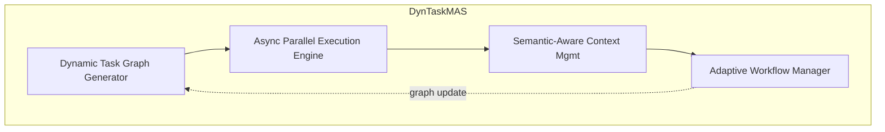

本記事は [DynTaskMAS: A Dynamic Task Graph-driven Framework for Asynchronous and Parallel LLM-based Multi-Agent Systems](https://arxiv.org/abs/2503.07675)（arXiv:2503.07675、ICAPS 2025採択）の解説記事です。

## 論文概要（Abstract）

DynTaskMASは、LLMベースのマルチエージェントシステム（MAS）において非同期かつ並列な実行を動的タスクグラフにより実現するフレームワークである。従来のMASフレームワークでは、タスク分解が静的であり、実行時のリソース利用率が低いという問題があった。著者らは、動的タスクグラフ生成器・非同期並列実行エンジン・セマンティック対応コンテキスト管理・適応的ワークフロー管理の4コンポーネントを提案し、実行時間の21-33%削減・リソース利用率の65%から88%への向上（35.4%改善）・16エージェントまでのほぼ線形なスループットスケーリングを報告している。

この記事は [Zenn記事: LangGraphステートマシンの本番設計：永続化・並列実行・動的グラフ構成](https://zenn.dev/0h_n0/articles/f76764a6501cf4) の深掘りです。

## 情報源

- **会議名**: ICAPS 2025（International Conference on Automated Planning and Scheduling、第35回）
- **arXiv ID**: 2503.07675
- **URL**: [https://arxiv.org/abs/2503.07675](https://arxiv.org/abs/2503.07675)
- **著者**: Junwei Yu, Yepeng Ding, Hiroyuki Sato
- **カテゴリ**: cs.MA（マルチエージェントシステム）, cs.AI, cs.DC（分散・並列計算）
- **投稿日**: 2025年3月10日（v2: 2025年12月2日）

## カンファレンス情報

ICAPSは自動計画・スケジューリング分野の主要国際会議であり、AIシステムの計画・実行・最適化に関する研究が発表される。DynTaskMASはマルチエージェントシステムの動的スケジューリングという、計画分野とLLMエージェント分野の交差点に位置する研究として採択されている。

## 背景と動機（Background & Motivation）

LLMベースのマルチエージェントシステムは、複雑なタスクを複数のエージェントが協調して解決する。しかし、既存フレームワークには以下の課題がある。

第一に、**静的タスク分解**の問題である。AutoGenやCrewAIなどの既存フレームワークでは、タスクの分解と実行順序が事前に固定される。実行中に新しいサブタスクが発見されても、柔軟に対応できない。

第二に、**低リソース利用率**の問題である。同期的な実行モデルでは、あるエージェントがLLM APIの応答を待っている間、他のエージェントもブロックされる。これにより、リソース利用率が65%程度にとどまる。

第三に、**コンテキスト非効率**の問題である。エージェント間の情報共有が構造化されていないため、無関係な情報がコンテキストに混入し、LLMの推論品質を低下させる。

## 主要な貢献（Key Contributions）

- **動的タスクグラフ生成器**: 実行中にタスクの依存関係を動的に更新し、新しいサブタスクを追加できるタスクグラフ構造を提案
- **非同期並列実行エンジン**: 依存関係が解決されたタスクを即座にディスパッチし、エージェントの待機時間を最小化
- **セマンティック対応コンテキスト管理**: エージェント間の情報共有をセマンティックな関連性に基づいてフィルタリング
- **適応的ワークフロー管理**: 実行中のパフォーマンスメトリクスに基づいてリソース割り当てを動的に調整

## 技術的詳細（Technical Details）

### 動的タスクグラフ

DynTaskMASのコアは**動的タスクグラフ** $G = (V, E, W)$である。

- $V$: タスクノード集合。各ノード$v_i \in V$はサブタスクを表す
- $E$: 有向辺集合。$(v_i, v_j) \in E$はタスク$v_i$が$v_j$の前提条件であることを示す
- $W$: 辺の重み。依存関係の強さを表す

静的DAGとの最大の違いは、**実行中にグラフが変化する**点にある。エージェントがサブタスクの実行結果を分析した際に新しいサブタスクが必要と判断した場合、タスクグラフに新しいノードと辺を追加できる。

$$
G_{t+1} = G_t \cup \{v_{\text{new}}, e_{\text{new}}\}
$$

この動的更新により、事前にすべてのサブタスクを予測できない複雑なタスクにも対応できる。

### 非同期並列実行エンジン

実行エンジンは、タスクグラフの依存関係を監視し、すべての前提タスクが完了したタスクを即座にエージェントにディスパッチする。

```python
async def execute_task_graph(graph: TaskGraph, agents: list[Agent]):
    """非同期並列実行エンジンの擬似コード"""
    pending = set(graph.nodes)
    completed = set()
    running = set()

    while pending or running:
        ready = {
            task for task in pending
            if all(dep in completed for dep in graph.predecessors(task))
        }

        for task in ready:
            pending.discard(task)
            running.add(task)
            agent = select_best_agent(task, agents)
            asyncio.create_task(
                run_and_callback(agent, task, completed, running, graph)
            )

        await asyncio.sleep(0.1)
```

重要な設計判断として、実行はイベント駆動で行われる。タスクの完了がコールバックをトリガーし、新たに実行可能になったタスクを即座にディスパッチする。バリア同期（すべての並列タスクの完了を待つ）を避けることで、遅いタスクが他のタスクをブロックしない。

### セマンティック対応コンテキスト管理

エージェント間の情報共有において、DynTaskMASは全コンテキストを共有するのではなく、セマンティックな関連性に基づいてフィルタリングする。

各タスクの出力に対してセマンティックスコア$\text{sim}(o_i, t_j)$を計算し、閾値$\tau$を超える出力のみを後続タスクのコンテキストに含める。

$$
\text{context}(t_j) = \{o_i \mid \text{sim}(o_i, t_j) > \tau, \; (v_i, v_j) \in E\}
$$

これにより、無関係な情報によるコンテキスト汚染を防ぎ、LLMの推論品質を維持する。

### LangGraphとの対応関係

DynTaskMASの4コンポーネントは、LangGraphの機能と以下のように対応する。

| DynTaskMAS | LangGraph |
|-----------|-----------|
| 動的タスクグラフ | Send APIによる動的ファンアウト |
| 非同期並列実行エンジン | スーパーステップ内の並列ノード実行 |
| コンテキスト管理 | 状態スキーマの3層設計（外部参照パターン） |
| ワークフロー管理 | サブグラフの選択的チェックポイント |

Zenn記事で解説されているSend APIの動的ファンアウトは、DynTaskMASの動的タスクグラフ生成器と概念的に共通する。両者とも実行時にタスク数を動的に決定し、並列実行する。



## 実験結果（Results）

### 実行時間削減

論文の実験結果によると、DynTaskMASは従来の同期実行アプローチと比較して、タスク複雑度に応じて21-33%の実行時間削減を達成している。複雑なタスクほど削減率が高い傾向が報告されている。

| タスク複雑度 | 実行時間削減率 |
|-----------|-------------|
| 低 | 21% |
| 中 | 27% |
| 高 | 33% |

### リソース利用率

リソース利用率（エージェントがアクティブに処理を行っている時間の割合）は、従来手法の65%から88%に向上した（35.4%の改善）。この改善は主に、非同期実行による待機時間の削減に起因すると著者らは説明している。

### スループットスケーリング

16エージェントまでのスケーリング実験では、ほぼ線形なスループット向上が報告されている。4倍のエージェント増加に対して3.47倍のスループット向上（線形の86.8%）を達成している。

$$
\text{Scaling Efficiency} = \frac{\text{Throughput}(4n)}{\text{Throughput}(n) \times 4} = \frac{3.47}{4} \approx 86.8\%
$$

この結果は、DynTaskMASの非同期実行モデルがエージェント数の増加に対してスケーラブルであることを示唆している。

## 実装のポイント（Implementation）

### LangGraphでの動的タスクグラフ実装

Zenn記事で解説されているSend APIを使って、DynTaskMAS的な動的タスクグラフを実装できる。

```python
from langgraph.types import Send
from langgraph.graph import StateGraph, START, END
from typing import Annotated, TypedDict
from operator import add

class DynTaskState(TypedDict):
    initial_tasks: list[dict]
    results: Annotated[list[dict], add]
    new_tasks: Annotated[list[dict], add]

def dynamic_router(state: DynTaskState) -> list[Send]:
    """DynTaskMAS的な動的タスクルーティング"""
    all_tasks = state["initial_tasks"] + state.get("new_tasks", [])
    completed_ids = {r["task_id"] for r in state.get("results", [])}
    ready_tasks = [
        t for t in all_tasks
        if t["id"] not in completed_ids
        and all(dep in completed_ids for dep in t.get("deps", []))
    ]
    return [
        Send("execute_task", {**state, "current_task": task})
        for task in ready_tasks
    ]

def execute_task(state: dict) -> dict:
    task = state["current_task"]
    result = llm.invoke(task["prompt"])
    new_subtasks = extract_new_subtasks(result.content)
    return {
        "results": [{"task_id": task["id"], "output": result.content}],
        "new_tasks": new_subtasks,
    }
```

### 非同期実行とレート制限

本番環境では、DynTaskMASの並列実行がAPIレート制限に抵触する可能性がある。Zenn記事でも言及されているように、セマフォによるスロットリングが必要である。

```python
import asyncio

MAX_CONCURRENT_LLM_CALLS = 10
semaphore = asyncio.Semaphore(MAX_CONCURRENT_LLM_CALLS)

async def rate_limited_llm_call(prompt: str) -> str:
    async with semaphore:
        return await llm.ainvoke(prompt)
```

## Production Deployment Guide

### AWS実装パターン（コスト最適化重視）

DynTaskMAS的な非同期並列エージェントのAWSデプロイ構成を示す。

| 規模 | 月間リクエスト | 推奨構成 | 月額コスト | 主要サービス |
|------|-------------|---------|-----------|------------|
| **Small** | ~3,000 | Serverless | $50-150 | Lambda + SQS + Bedrock |
| **Medium** | ~30,000 | Hybrid | $300-800 | ECS Fargate + SQS + Bedrock |
| **Large** | 300,000+ | Container | $2,000-5,000 | EKS + Karpenter + Bedrock Batch |

**Small構成の詳細** (月額$50-150):
- **Lambda**: 各エージェントを個別関数として実行 ($30/月)
- **SQS**: タスクキュー、非同期ディスパッチ ($5/月)
- **Bedrock**: Claude 3.5 Haiku ($80/月)
- **DynamoDB**: タスクグラフ状態管理 ($10/月)

**コスト試算の注意事項**: 上記は2026年7月時点のAWS ap-northeast-1料金に基づく概算値です。最新料金は[AWS料金計算ツール](https://calculator.aws/)で確認してください。

### Terraformインフラコード

```hcl
resource "aws_sqs_queue" "task_queue" {
  name                       = "dyntaskmas-task-queue"
  visibility_timeout_seconds = 120
  message_retention_seconds  = 86400

  redrive_policy = jsonencode({
    deadLetterTargetArn = aws_sqs_queue.dlq.arn
    maxReceiveCount     = 3
  })
}

resource "aws_sqs_queue" "dlq" {
  name = "dyntaskmas-dlq"
}

resource "aws_lambda_function" "agent_executor" {
  filename      = "agent.zip"
  function_name = "dyntaskmas-agent"
  role          = aws_iam_role.lambda_role.arn
  handler       = "index.handler"
  runtime       = "python3.12"
  timeout       = 120
  memory_size   = 1024
  reserved_concurrent_executions = 16

  environment {
    variables = {
      TASK_QUEUE_URL   = aws_sqs_queue.task_queue.url
      BEDROCK_MODEL_ID = "anthropic.claude-3-5-haiku-20241022-v1:0"
      MAX_PARALLEL     = "16"
    }
  }
}

resource "aws_lambda_event_source_mapping" "sqs_trigger" {
  event_source_arn                   = aws_sqs_queue.task_queue.arn
  function_name                      = aws_lambda_function.agent_executor.arn
  batch_size                         = 10
  maximum_batching_window_in_seconds = 5
}

resource "aws_cloudwatch_metric_alarm" "queue_depth" {
  alarm_name          = "dyntaskmas-queue-depth"
  comparison_operator = "GreaterThanThreshold"
  evaluation_periods  = 2
  metric_name         = "ApproximateNumberOfMessagesVisible"
  namespace           = "AWS/SQS"
  period              = 300
  statistic           = "Average"
  threshold           = 100
  alarm_description   = "タスクキュー滞留アラート"

  dimensions = {
    QueueName = aws_sqs_queue.task_queue.name
  }
}
```

### 運用・監視設定

```python
import boto3

cloudwatch = boto3.client('cloudwatch')

cloudwatch.put_metric_alarm(
    AlarmName='agent-utilization-low',
    ComparisonOperator='LessThanThreshold',
    EvaluationPeriods=3,
    MetricName='ConcurrentExecutions',
    Namespace='AWS/Lambda',
    Period=300,
    Statistic='Average',
    Threshold=4,
    AlarmDescription='エージェント利用率低下（スケールダウン検討）'
)
```

### コスト最適化チェックリスト

- [ ] Lambda: Reserved Concurrency でエージェント数制限（論文推奨: 16）
- [ ] SQS: バッチウィンドウで小粒タスクを集約
- [ ] Bedrock: Prompt Caching でコンテキスト再利用コスト削減
- [ ] Bedrock Batch API: 非リアルタイム処理で50%割引
- [ ] DynamoDB TTL: 完了タスクグラフの自動削除
- [ ] CloudWatch: キュー深度・エージェント利用率監視
- [ ] AWS Budgets: 月額予算設定
- [ ] Cost Anomaly Detection: 並列実行コスト異常検知
- [ ] Lambda Insights: メモリ・期間最適化
- [ ] X-Ray: エンドツーエンドレイテンシ可視化

## 関連研究（Related Work）

- **LLMCompiler** (Kim et al., ICML 2024): 静的DAGスケジューリングによる並列関数呼び出し。DynTaskMASは動的グラフ更新を追加している点で異なる
- **AutoGen** (Wu et al., 2023): 会話ベースのMASフレームワーク。同期的な実行モデルのためリソース利用率が低い
- **CrewAI**: ロールベースのMASフレームワーク。タスク分解が静的である

## まとめと今後の展望

DynTaskMASは動的タスクグラフと非同期並列実行により、MASの実行効率を大幅に向上させた。論文が示す35.4%のリソース利用率改善と16エージェントまでの線形スケーリングは、LangGraphのSend APIを使った並列実行パターンの設計指針として有用である。Zenn記事で解説されている動的ファンアウトとスーパーステップの概念を組み合わせることで、DynTaskMAS的な非同期並列実行を本番環境で実現できる。

## 参考文献

- **arXiv**: [https://arxiv.org/abs/2503.07675](https://arxiv.org/abs/2503.07675)
- **Related Zenn article**: [https://zenn.dev/0h_n0/articles/f76764a6501cf4](https://zenn.dev/0h_n0/articles/f76764a6501cf4)
