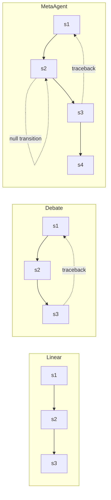

本記事は [MetaAgent: Automatically Constructing Multi-Agent Systems Based on Finite State Machines](https://arxiv.org/abs/2507.22606)（arXiv:2507.22606、ICML 2025採択）の解説記事です。

## 論文概要（Abstract）

MetaAgentは、タスク記述から有限状態マシン（FSM）に基づくマルチエージェントシステムを自動的に設計・最適化するフレームワークである。著者らは、既存のマルチエージェント構造（Linear、Decentralized Debate、Orchestrator Coordination）がいずれもFSMの特殊ケースであることを形式的に示した上で、FSMの表現力を活用した汎用的な自動設計手法を提案している。論文の実験では、自動設計されたシステムが他の自動設計手法を上回り、人手設計のシステムの97%の性能を達成したと報告されている。

この記事は [Zenn記事: LangGraphステートマシンの本番設計：永続化・並列実行・動的グラフ構成](https://zenn.dev/0h_n0/articles/f76764a6501cf4) の深掘りです。

## 情報源

- **会議名**: ICML 2025（International Conference on Machine Learning）
- **arXiv ID**: 2507.22606
- **URL**: [https://arxiv.org/abs/2507.22606](https://arxiv.org/abs/2507.22606)
- **著者**: Yaolun Zhang, Xiaogeng Liu, Chaowei Xiao
- **所属**: University of Wisconsin-Madison
- **カテゴリ**: cs.AI（人工知能）
- **投稿日**: 2025年7月30日

## カンファレンス情報

ICMLは機械学習分野における最高峰の国際会議の1つであり、採択率は通常25%前後である。MetaAgentはマルチエージェントシステムの自動設計という新しい課題に対し、有限状態マシンの形式的枠組みを適用した点で採択されている。

## 背景と動機（Background & Motivation）

LLMベースのマルチエージェントシステム（MAS）は、複雑なタスクの分業・協調に有効であるが、既存のフレームワークには2つの課題がある。

第一に、人手設計のフレームワーク（MetaGPT、AutoGen等）は特定のシナリオに最適化されており、新しいタスクへの汎化が困難である。第二に、自動設計手法（AutoAgents、ADAS等）はツール統合の欠如、外部学習データへの依存、硬直的なコミュニケーション構造という制約を持つ。

著者らは、これらの既存MAS構造がいずれも有限状態マシン（FSM）の制約付きバリエーションであることを示し、FSMの完全な表現力を活用することでこれらの制約を克服できると主張している。

## 主要な貢献（Key Contributions）

- **FSMによるMASの統一的定式化**: 既存のLinear・Debate・Orchestrator構造がFSMの特殊ケースであることを形式的に証明
- **自動設計フレームワーク**: タスク記述からFSMベースのMASを自動構築するパイプラインを提案
- **反復的状態最適化**: ペアワイズ比較による状態マージアルゴリズムでFSMを最適化

## 技術的詳細（Technical Details）

### FSMの形式的定義

MetaAgentはマルチエージェントシステムを以下のタプルで定義する。

$$
\mathcal{M} = (\Sigma, S, s_0, F, \delta)
$$

ここで、
- $\Sigma$: 入力アルファベット（タスクドメイン内の具体的なケース）
- $S$: 有限状態集合
- $s_0 \in S$: 初期状態
- $F \subseteq S$: 受理状態（最終状態）集合
- $\delta: S \times \Sigma \to S$: 状態遷移関数

各状態は以下の4コンポーネントで構成される。

| コンポーネント | 役割 |
|-------------|------|
| Agent ID | 対応するタスク解決エージェント |
| Instruction | 自然言語によるタスク仕様 |
| Condition Verifier | 出力を遷移条件に照らして評価 |
| Listeners | 状態の出力を受け取るエージェント群 |

### 既存MAS構造のFSM表現

著者らは、既存のMAS構造がFSMの表現力を部分的にしか活用していないことを示している。

**Linear構造**（MetaGPT、SPP等）: 決定的な単一遷移のみを持つFSM。$s_{i+1} = \delta(s_i, \sigma_i)$。状態トレースバック（後戻り）、null遷移（同一状態での再試行）、条件検証のいずれも持たない。

**Decentralized Debate**（LLM Debate、AgentCoder等）: 最後の状態から最初の状態へのトレースバックのみを許可するFSM。null遷移機構を持たない。

**Orchestrator Coordinated**（Magentic-One等）: 共有グローバル条件検証器を持つFSM。すべての状態が同一の検証ロジックを使用するため、状態固有の条件分岐ができない。



MetaAgentのFSMは、任意のトレースバック・null遷移・状態固有の条件検証を組み合わせることで、上記すべてのパターンを包含する。

### 自動構築パイプライン

MetaAgentの自動構築は3フェーズで行われる。

**Phase 1: エージェント設計**

Designer LLMがタスク記述を受け取り、必要最小限のエージェントアンサンブルをJSON形式で出力する。各エージェントには名前・システムプロンプト・割り当てツールが指定される。

**Phase 2: FSMアーキテクチャ設計**

タスク解決シナリオを予測し、各シナリオに対応する状態・遷移条件・状態命令を定義する。

**Phase 3: 反復的状態最適化**

著者らが提案するアルゴリズムは、すべての状態ペアを走査し、以下の3基準でマージ可否を評価する。

1. **ロール区別可能性**: 2つのエージェントの役割が十分に異なるか
2. **情報転送必要性**: 2つの状態間で情報を明示的に渡す必要があるか
3. **ツール割り当て重複**: ツールの統合が可能か

```python
def optimize_fsm(states: list[State]) -> list[State]:
    """反復的状態マージによるFSM最適化（論文Algorithm 1の擬似コード）"""
    while True:
        merged = False
        for i, si in enumerate(states):
            for j, sj in enumerate(states[i+1:], i+1):
                if llm_judge_can_merge(si, sj):
                    merged_state = merge_states(si, sj)
                    states = [s for k, s in enumerate(states) if k not in (i, j)]
                    states.append(merged_state)
                    merged = True
                    break
            if merged:
                break
        if not merged:
            break
    return states
```

マージが発生しなくなるまで反復し、最終的な最適化FSMを得る。

### デプロイ時の実行フロー

1. 初期状態$s_0$に遷移
2. 状態のエージェントがユーザクエリ+状態命令で実行
3. Condition Verifierが出力を遷移条件と照合
4. 条件一致 → 次の状態に遷移 / 不一致 → null遷移（同一状態で再試行）
5. 最大反復制限で無限ループを防止

## 実験結果（Results）

### テキストベースタスク

論文Table 1より、WritingタスクとGPQA（大学院レベルQA）の結果を示す。

| 手法 | Writing | GPQA |
|------|---------|------|
| Direct | 0.76 | 0.46 |
| Chain-of-Thought | 0.74 | 0.44 |
| LLM Debate | 0.73 | 0.54 |
| Self-Refine | 0.76 | 0.55 |
| SPP（自動設計） | 0.79 | 0.45 |
| **MetaAgent** | **0.86** | **0.60** |

MetaAgentはWritingタスクでSPPを9ポイント上回っている。

### ML Benchタスク

論文Table 2より、5つのKaggleタスクでの正規化性能スコアを示す。

| 手法 | Titanic | House | SCTP | ICR | SVPC | 平均 |
|------|---------|-------|------|-----|------|------|
| AutoGen | 0.82 | 0.88 | 0.82 | 0.71 | 0.63 | 0.77 |
| Data Interpreter（人手設計） | 0.82 | 0.91 | 0.89 | 0.91 | 0.77 | **0.86** |
| **MetaAgent** | 0.83 | 0.91 | 0.86 | 0.88 | 0.68 | 0.83 |

MetaAgentは人手設計のData Interpreterの97%（0.83/0.86）の性能を達成し、他のすべての自動設計手法を上回っている。

### ソフトウェア開発タスク

論文Table 3より、5つのソフトウェアタスクでのチェックポイント通過率を示す。

| 手法 | 2048 | Snake | Brick | Excel | Weather | 平均 |
|------|------|-------|-------|-------|---------|------|
| MetaGPT | 0.25 | 0.25 | 0.75 | 0 | 0.50 | 0.35 |
| **MetaAgent** | 0.75 | 1.0 | 0.50 | 1.0 | 1.0 | **0.85** |

MetaAgentは人手設計のベースラインを50ポイント上回っている。

### Ablation Study

論文Table 5より、各コンポーネントの影響を示す。

| 削除要素 | ML Bench | Software | 影響 |
|---------|----------|----------|------|
| ツール使用なし | - | - | -8.1%〜-13.3% |
| 最適化なし | 0.61 | 0.65 | -6.67%〜-35.3% |
| トレースバックなし | 0.72 | 0.35 | -3.33%〜-58.8% |
| 完全システム | 0.83 | 0.85 | ベースライン |

トレースバック機能の削除がソフトウェアタスクで最大58.8%の性能低下を引き起こすことが報告されている。これは、コーディングタスクでは後戻り修正が不可欠であることを示唆している。

### トークン消費量

論文Table 7より、設計+デプロイの総トークン消費量を示す。

| 手法 | 総トークン数 |
|------|------------|
| MetaGPT | 125,592 |
| AutoAgents | 114,865 |
| **MetaAgent** | **93,641** |

MetaAgentはタスクレベルの設計（ケースレベルではない）を採用しているため、設計フェーズのトークン消費が少ない。

## 実装のポイント（Implementation）

### LangGraphとの対応関係

MetaAgentのFSM構造は、LangGraphのStateGraph APIと直接的な対応関係にある。

| MetaAgent FSM | LangGraph |
|-------------|-----------|
| 状態 $S$ | ノード（`add_node`） |
| 遷移 $\delta$ | エッジ（`add_edge`、`add_conditional_edges`） |
| 初期状態 $s_0$ | `START` |
| 受理状態 $F$ | `END` |
| Null遷移 | 自己ループエッジ |
| トレースバック | 条件付きエッジによる後方遷移 |
| Condition Verifier | 条件付きエッジのルーティング関数 |

Zenn記事で解説されている「ルーティングフィールド」は、MetaAgentのCondition Verifierに相当する。プリミティブ型（`str`、`int`、`bool`）でルーティング判断を行うという設計指針は、FSMの遷移関数を効率的に実装するための実践的なガイドラインである。

```python
from langgraph.graph import StateGraph, START, END

def build_metaagent_graph(fsm_config: dict) -> StateGraph:
    """MetaAgentのFSM構成をLangGraphのStateGraphに変換"""
    builder = StateGraph(AgentState)

    for state in fsm_config["states"]:
        builder.add_node(state["id"], create_agent_node(state))

    for transition in fsm_config["transitions"]:
        if transition["type"] == "conditional":
            builder.add_conditional_edges(
                transition["from"],
                create_condition_verifier(transition["conditions"]),
                {c["label"]: c["target"] for c in transition["conditions"]}
            )
        else:
            builder.add_edge(transition["from"], transition["to"])

    return builder
```

### 本番環境での考慮事項

MetaAgentの自動設計は一度のみ実行され、設計結果（FSM構成）をデプロイに使用する。Zenn記事で解説されているPostgresSaverによるチェックポイント永続化を組み合わせることで、自動設計されたFSMの各状態遷移をチェックポイントとして保存し、障害復旧に対応できる。

## 関連研究（Related Work）

- **AutoAgents** (Chen et al., 2024): ケースレベルでエージェントを自動設計するが、汎化性に欠ける。MetaAgentはタスクレベルの設計で汎化性を確保している
- **ADAS** (Hu et al., 2024): 外部学習データに依存する自動設計手法。MetaAgentは外部データ不要
- **EvoAgent** (Yuan et al., 2024): 進化的手法によるエージェント設計。ツール統合を持たない

## まとめと今後の展望

MetaAgentは、FSMの形式的枠組みを活用してマルチエージェントシステムの自動設計を実現した。論文が示す「既存MAS構造はFSMの特殊ケース」という知見は、LangGraphのStateGraph設計において重要な理論的基盤を提供する。自動設計されたFSMがLangGraphのStateGraphに直接マッピングできることは、本番環境での実用性を高めている。

## 参考文献

- **arXiv**: [https://arxiv.org/abs/2507.22606](https://arxiv.org/abs/2507.22606)
- **Code**: [https://github.com/SaFoLab-WISC/MetaAgent](https://github.com/SaFoLab-WISC/MetaAgent)
- **Related Zenn article**: [https://zenn.dev/0h_n0/articles/f76764a6501cf4](https://zenn.dev/0h_n0/articles/f76764a6501cf4)
