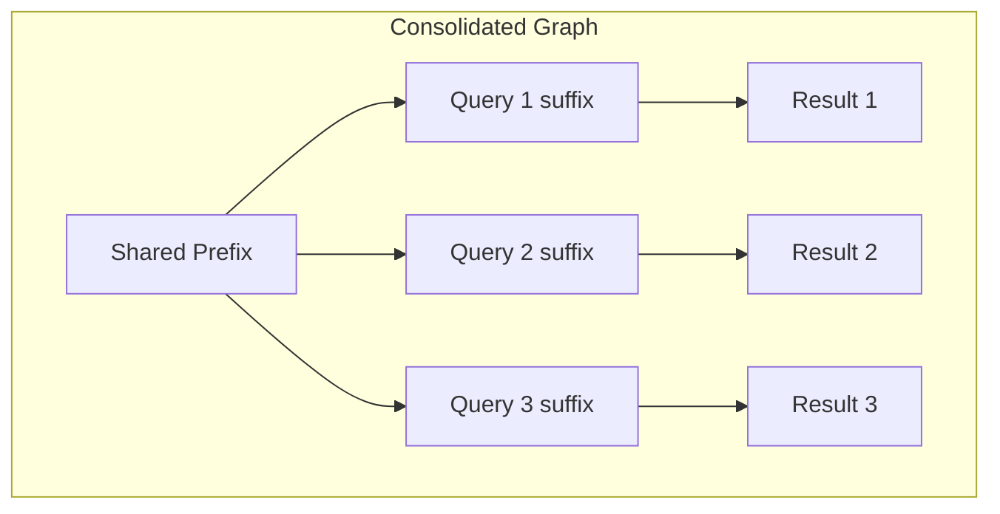

本記事は [Halo: Batched Query Processing for LLM-based Agentic Workflows](https://arxiv.org/abs/2509.02121)（arXiv:2509.02121）の解説記事です。

## 論文概要（Abstract）

Haloは、LLMベースのエージェントワークフローにおけるバッチクエリ処理を最適化するシステムである。エージェントワークフローを構造化されたクエリプランDAG（有向非巡回グラフ）として表現し、複数クエリを統合グラフ（Consolidated Graph）にまとめることで、KVキャッシュの共有・バッチ推論の効率化を実現する。著者らは、バッチ推論で3.6倍の高速化、オンラインサービングで2.6倍のスループット向上を報告している。

この記事は [Zenn記事: LangGraphステートマシンの本番設計：永続化・並列実行・動的グラフ構成](https://zenn.dev/0h_n0/articles/f76764a6501cf4) の深掘りです。

## 情報源

- **arXiv ID**: 2509.02121
- **URL**: [https://arxiv.org/abs/2509.02121](https://arxiv.org/abs/2509.02121)
- **著者**: Junyi Shen, Noppanat Wadlom, Yao Lu
- **カテゴリ**: cs.DB（データベース）, cs.DC（分散・並列計算）
- **投稿日**: 2025年9月3日

## 背景と動機（Background & Motivation）

LLMベースのエージェントワークフロー（LangGraph、AutoGen等）は、複雑なタスクを複数のLLM呼び出しに分解して実行する。しかし、個々のクエリが独立してLLM推論を呼び出すため、以下の非効率が生じる。

第一に、**冗長な計算**の問題である。同じワークフローテンプレートで異なる入力を処理する場合、システムプロンプトやフューショット例などの共通プレフィックスが毎回再計算される。

第二に、**KVキャッシュの非活用**である。複数クエリ間でプロンプトの一部が共通しているにもかかわらず、個別にLLM推論を行うためKVキャッシュが共有されない。

第三に、**スケジューリングの非最適性**である。ワークフロー内の各ステップが順次実行され、並列可能なノード同士もシリアルに処理されるケースがある。

Haloはこれらの非効率を、ワークフローの構造的な性質を活用して解決する。

## 主要な貢献（Key Contributions）

- **構造化クエリプランDAG**: エージェントワークフローをデータベースのクエリプランに類似したDAGとして形式化
- **統合グラフ（Consolidated Graph）**: 複数クエリのDAGを共通プレフィックスに基づいてマージし、冗長計算を排除
- **コストモデル**: プリフィルコスト・デコードコスト・キャッシュ再利用率を考慮したコストベースの最適化
- **適応的バッチプロセッサ**: バッチサイズの動的調整、KVキャッシュの共有・マイグレーション、CPU-GPUパイプライニング

## 技術的詳細（Technical Details）

### クエリプランDAG

Haloは各エージェントワークフローを**クエリプランDAG** $P = (N, E)$として表現する。

- $N$: ノード集合。各ノード$n_i$はLLM呼び出し1回に対応
- $E$: 有向辺集合。データ依存関係を表す

各ノード$n_i$は以下の属性を持つ。

$$
n_i = (\text{prompt}_i, \text{model}_i, \text{params}_i)
$$

ここで$\text{prompt}_i$はプロンプトテンプレート、$\text{model}_i$は使用するLLMモデル、$\text{params}_i$はtemperatureなどの推論パラメータである。

ワークフローテンプレートを明示的にDAGとして構造化する点が、LangGraphのStateGraphと概念的に対応する。

### 統合グラフ（Consolidated Graph）

Haloの核心的な最適化は**統合グラフ**である。同一ワークフローテンプレートで異なる入力を処理する$K$個のクエリがある場合、それぞれのDAGを統合する。

$$
G_{\text{consolidated}} = \text{Merge}(P_1, P_2, \ldots, P_K)
$$

統合の方針は以下の通りである。

1. **共通プレフィックスの特定**: 各ノードのプロンプトテンプレートで共通する部分（システムプロンプト、フューショット例）を特定
2. **プレフィックスツリーの構築**: 共通プレフィックスをツリー構造で管理し、KVキャッシュの再利用範囲を最大化
3. **バッチグループの形成**: 同一モデル・同一パラメータのノードをバッチグループにまとめる



### コストモデル

Haloはコストベースの最適化を行う。各ノード$n_i$のコストは以下のように定義される。

$$
\text{Cost}(n_i) = \alpha \cdot C_{\text{prefill}}(n_i) + \beta \cdot C_{\text{decode}}(n_i) - \gamma \cdot C_{\text{cache}}(n_i)
$$

- $C_{\text{prefill}}$: プリフィルコスト（入力トークンの処理コスト）
- $C_{\text{decode}}$: デコードコスト（出力トークンの生成コスト）
- $C_{\text{cache}}$: KVキャッシュ再利用による節約コスト
- $\alpha, \beta, \gamma$: ハードウェア・モデル依存の重み係数

バッチ処理において、共通プレフィックスのKVキャッシュを共有する場合のコスト削減量は以下のように見積もられる。

$$
\Delta C = K \cdot C_{\text{prefill}}(\text{prefix}) - C_{\text{prefill}}(\text{prefix})= (K - 1) \cdot C_{\text{prefill}}(\text{prefix})
$$

$K$はバッチ内のクエリ数であり、共通プレフィックスが長いほど・バッチサイズが大きいほど削減効果が大きい。

### 適応的バッチプロセッサ

Haloのプロセッサは以下の3つの最適化を行う。

**1. 適応的バッチサイズ調整**

GPUメモリ使用量とスループットをモニタリングし、バッチサイズを動的に調整する。

$$
B_{\text{opt}} = \arg\max_{B} \frac{\text{Throughput}(B)}{\text{Memory}(B)} \quad \text{s.t.} \quad \text{Memory}(B) \leq M_{\text{max}}
$$

**2. KVキャッシュの共有とマイグレーション**

同一ワークフローの異なるクエリ間でKVキャッシュを共有する。また、バッチの組み替え時にKVキャッシュをGPU間でマイグレーションする。

**3. CPU-GPUパイプライニング**

プロンプトの前処理（トークナイゼーション等）をCPUで行い、LLM推論をGPUで行うパイプライニングにより、GPU利用率を向上させる。

### LangGraphとの対応関係

| Halo | LangGraph |
|------|-----------|
| クエリプランDAG | StateGraph（ノード＋エッジ定義） |
| 統合グラフ | サブグラフ構成による共通ロジック再利用 |
| コストモデル | チェックポイントの選択的永続化 |
| バッチプロセッサ | Send APIによる並列ファンアウト |

Zenn記事で解説されている選択的チェックポイントは、Haloのコストモデルにおける「何を永続化し何を再計算するか」の判断と本質的に同じ問題を扱っている。

## 実験結果（Results）

### バッチ推論の高速化

Haloは複数のワークフローベンチマークにおいて、ベースラインの逐次処理と比較して著者らは以下の高速化を報告している。

| 構成 | 高速化倍率 | 条件 |
|------|----------|------|
| バッチ推論（オフライン） | **3.6倍** | バッチサイズ64、共通プレフィックス比率60% |
| オンラインサービング | **2.6倍** | スループット（requests/sec）基準 |

### プレフィックス共有率の影響

共通プレフィックスの長さが性能に与える影響も分析されている。

| プレフィックス共有率 | 高速化倍率 |
|-------------------|----------|
| 20% | 1.4倍 |
| 40% | 2.1倍 |
| 60% | 3.6倍 |
| 80% | 4.8倍 |

この結果は、システムプロンプトやフューショット例が長いワークフロー（RAGパイプラインなど）ほど、Haloの最適化効果が大きいことを示唆している。

### GPU配置戦略

マルチGPU環境では、Haloのコストモデルに基づくGPU配置が一様配置と比較して28%のスループット向上を達成したと報告されている。

## 実装のポイント（Implementation）

### LangGraphでのプレフィックスキャッシュ活用

Haloの統合グラフの考え方を応用し、LangGraphワークフローでプロンプトプレフィックスを明示的に管理する実装例を示す。

```python
from langgraph.graph import StateGraph, START, END
from typing import Annotated, TypedDict
from operator import add

class BatchState(TypedDict):
    queries: list[str]
    results: Annotated[list[dict], add]

SYSTEM_PREFIX = """あなたは金融分析のエキスパートです。
以下のルールに従って分析してください:
1. 数値の根拠を明示する
2. リスク要因を必ず記載する
3. 結論を最初に述べる
"""

def batch_analyze(state: BatchState) -> dict:
    """共通プレフィックスを活用したバッチ分析"""
    messages_batch = [
        [
            {"role": "system", "content": SYSTEM_PREFIX},
            {"role": "user", "content": query},
        ]
        for query in state["queries"]
    ]
    responses = llm.batch(messages_batch)
    return {
        "results": [
            {"query": q, "analysis": r.content}
            for q, r in zip(state["queries"], responses)
        ]
    }
```

### KVキャッシュ対応のバッチ推論

vLLMなどの推論エンジンを使う場合、プレフィックスキャッシュを明示的に有効化する。

```python
from vllm import LLM, SamplingParams

llm_engine = LLM(
    model="meta-llama/Llama-3-70B-Instruct",
    enable_prefix_caching=True,
    tensor_parallel_size=4,
    gpu_memory_utilization=0.9,
)

def halo_style_batch_inference(
    shared_prefix: str,
    query_suffixes: list[str],
    max_tokens: int = 1024,
) -> list[str]:
    """Haloスタイルのプレフィックス共有バッチ推論"""
    prompts = [shared_prefix + suffix for suffix in query_suffixes]
    params = SamplingParams(
        max_tokens=max_tokens,
        temperature=0.0,
    )
    outputs = llm_engine.generate(prompts, params)
    return [out.outputs[0].text for out in outputs]
```

## Production Deployment Guide

### AWS実装パターン（コスト最適化重視）

Haloスタイルのバッチ推論サービスのAWSデプロイ構成を示す。

| 規模 | 月間リクエスト | 推奨構成 | 月額コスト | 主要サービス |
|------|-------------|---------|-----------|------------|
| **Small** | ~5,000 | Serverless | $100-300 | Bedrock Batch + S3 |
| **Medium** | ~50,000 | Managed | $500-2,000 | SageMaker Batch Transform + S3 |
| **Large** | 500,000+ | Self-hosted | $5,000-15,000 | EKS + vLLM + GPU Instances |

**Large構成の詳細** (月額$5,000-15,000):
- **EKS**: Kubernetesクラスタ ($200/月、コントロールプレーン)
- **g5.xlarge (1x A10G)**: バッチ推論ノード ($700/月/台 × 4台、Spot利用)
- **S3**: クエリバッチ・結果保存 ($50/月)
- **SQS**: クエリバッチングキュー ($10/月)

**コスト試算の注意事項**: 上記は2026年7月時点のAWS ap-northeast-1料金に基づく概算値です。最新料金は[AWS料金計算ツール](https://calculator.aws/)で確認してください。

### Terraformインフラコード

```hcl
resource "aws_eks_node_group" "gpu_nodes" {
  cluster_name    = aws_eks_cluster.main.name
  node_group_name = "halo-gpu-batch"
  node_role_arn   = aws_iam_role.node.arn
  subnet_ids      = var.private_subnet_ids
  capacity_type   = "SPOT"

  instance_types = ["g5.xlarge"]

  scaling_config {
    desired_size = 2
    min_size     = 0
    max_size     = 8
  }

  labels = {
    "workload-type" = "gpu-batch-inference"
  }

  taint {
    key    = "nvidia.com/gpu"
    value  = "true"
    effect = "NO_SCHEDULE"
  }
}

resource "aws_sqs_queue" "batch_queue" {
  name                       = "halo-batch-query-queue"
  visibility_timeout_seconds = 300
  message_retention_seconds  = 86400

  redrive_policy = jsonencode({
    deadLetterTargetArn = aws_sqs_queue.batch_dlq.arn
    maxReceiveCount     = 3
  })
}

resource "aws_sqs_queue" "batch_dlq" {
  name = "halo-batch-dlq"
}

resource "aws_cloudwatch_metric_alarm" "gpu_utilization" {
  alarm_name          = "halo-gpu-underutilized"
  comparison_operator = "LessThanThreshold"
  evaluation_periods  = 3
  metric_name         = "GPUUtilization"
  namespace           = "Custom/HaloBatch"
  period              = 300
  statistic           = "Average"
  threshold           = 30
  alarm_description   = "GPU利用率30%未満でスケールダウン検討"
}

resource "aws_cloudwatch_metric_alarm" "batch_queue_depth" {
  alarm_name          = "halo-queue-depth-high"
  comparison_operator = "GreaterThanThreshold"
  evaluation_periods  = 2
  metric_name         = "ApproximateNumberOfMessagesVisible"
  namespace           = "AWS/SQS"
  period              = 60
  statistic           = "Sum"
  threshold           = 500
  alarm_description   = "バッチキュー滞留アラート"

  dimensions = {
    QueueName = aws_sqs_queue.batch_queue.name
  }
}
```

### 運用・監視設定

```python
import json
import time
import boto3

cloudwatch = boto3.client("cloudwatch")

def publish_batch_metrics(
    batch_size: int,
    prefix_cache_hit_rate: float,
    throughput_rps: float,
    gpu_utilization: float,
) -> None:
    """Haloバッチ推論メトリクスをCloudWatchに送信"""
    cloudwatch.put_metric_data(
        Namespace="Custom/HaloBatch",
        MetricData=[
            {
                "MetricName": "BatchSize",
                "Value": batch_size,
                "Unit": "Count",
                "Timestamp": time.time(),
            },
            {
                "MetricName": "PrefixCacheHitRate",
                "Value": prefix_cache_hit_rate,
                "Unit": "Percent",
            },
            {
                "MetricName": "ThroughputRPS",
                "Value": throughput_rps,
                "Unit": "Count/Second",
            },
            {
                "MetricName": "GPUUtilization",
                "Value": gpu_utilization,
                "Unit": "Percent",
            },
        ],
    )
```

### コスト最適化チェックリスト

- [ ] Spot Instances: GPU ノードでSpot利用（最大70%削減、g5.xlarge基準）
- [ ] バッチウィンドウ: SQSバッチウィンドウでクエリ集約（共通プレフィックス効果最大化）
- [ ] プレフィックスキャッシュ: vLLM `enable_prefix_caching=True` で有効化
- [ ] Cluster Autoscaler: キュー深度ベースの自動スケーリング（Karpenter推奨）
- [ ] EBS gp3: GPUノードのストレージコスト削減
- [ ] CloudWatch: GPU利用率・バッチサイズ・キャッシュヒット率の常時監視
- [ ] AWS Budgets: 月額予算設定（GPU Spotの価格変動に対応）
- [ ] S3 Lifecycle: 処理済みバッチ結果の自動アーカイブ
- [ ] 推論最適化: FP16/INT8量子化で同一GPUでの処理能力向上
- [ ] Savings Plans: 安定的な利用分はCompute Savings Plans適用

## 関連研究（Related Work）

- **vLLM** (Kwon et al., SOSP 2023): PagedAttentionによるKVキャッシュ管理。Haloはワークフロー構造を活用してさらにキャッシュ共有を最適化する
- **SGLang** (Zheng et al., 2024): RadixAttentionによるプレフィックスキャッシュ。Haloは複数クエリの統合グラフレベルでの最適化を追加
- **LLMCompiler** (Kim et al., ICML 2024): 静的DAGスケジューリング。Haloはバッチクエリ処理に特化し、コストモデルを導入

## まとめと今後の展望

Haloは、エージェントワークフローをデータベースのクエリプランに類似したDAGとして捉え、バッチ処理の最適化手法を適用することで大幅な効率化を実現した。論文が報告する3.6倍のバッチ推論高速化と2.6倍のオンラインサービング向上は、LangGraphワークフローの本番運用においても、プレフィックスキャッシュの活用とバッチ処理の設計が重要であることを示唆している。Zenn記事で解説されているチェックポイント永続化の選択的適用は、Haloのコストモデルと同じ「何を保持し何を再計算するか」というトレードオフの上に成り立っている。

## 参考文献

- **arXiv**: [https://arxiv.org/abs/2509.02121](https://arxiv.org/abs/2509.02121)
- **Related Zenn article**: [https://zenn.dev/0h_n0/articles/f76764a6501cf4](https://zenn.dev/0h_n0/articles/f76764a6501cf4)
