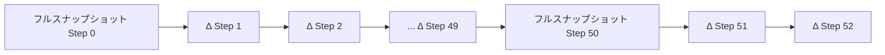

本記事は [Delta Channels: How We're Evolving our Runtime for Long-Running Agents](https://www.langchain.com/blog/delta-channels-evolving-agent-runtime)（LangChain公式ブログ、2026年5月12日公開、著者: Sydney Runkle）の解説記事です。

## ブログ概要（Summary）

LangGraph v1.2で導入されたDeltaChannelは、長時間実行エージェントのチェックポイントストレージ問題を根本的に解決する新しいチャネルプリミティブである。従来のチェックポイント方式ではノード実行のたびに状態全体をシリアライズしていたため、累積フィールド（メッセージ履歴等）を持つエージェントではストレージ消費が$O(N^2)$で増加していた。DeltaChannelは各ステップで差分（デルタ）のみを保存し、設定可能な頻度でフルスナップショットを書き込むことで、ストレージ増加を$O(N)$に抑制する。ブログでは、200ターンのマルチファイル実装エージェントで5.3GBから129MBへの約41倍の容量削減を報告している。

この記事は [Zenn記事: LangGraphステートマシンの本番設計：永続化・並列実行・動的グラフ構成](https://zenn.dev/0h_n0/articles/f76764a6501cf4) の深掘りです。

## 情報源

- **種別**: 企業テックブログ
- **URL**: [https://www.langchain.com/blog/delta-channels-evolving-agent-runtime](https://www.langchain.com/blog/delta-channels-evolving-agent-runtime)
- **組織**: LangChain
- **著者**: Sydney Runkle
- **発表日**: 2026年5月12日

## 技術的背景（Technical Background）

LangGraphのチェックポイント機構は、グラフの各ノード実行時に状態のスナップショットを保存することで、障害復旧・タイムトラベルデバッグ・Human-in-the-Loop割り込みを実現している。しかし、デフォルトのチェックポイント方式には本質的な課題があった。

ブログによると、長時間実行エージェント（コーディングエージェント等）では、メッセージ履歴やファイルコンテキストなどの累積フィールドが存在する。これらのフィールドはノード実行のたびに成長し、チェックポイント時に状態全体がシリアライズされるため、ストレージ消費が二次関数的に増加する。

$$
\text{Storage}_{\text{baseline}} = \sum_{i=1}^{N} \text{size}(S_i)
$$

ここで$S_i$はステップ$i$での状態サイズである。累積フィールドがある場合、$\text{size}(S_i) \approx O(i)$となるため、全体のストレージは$O(N^2)$に達する。ブログは「コーディングエージェントが200ターン実行した場合、従来方式では5.3GBのストレージを消費していた」と報告している。

## 実装アーキテクチャ（Architecture）

### DeltaChannelの動作原理

DeltaChannelの中核は、フルスナップショットではなく増分更新（デルタ）のみを保存するという設計である。ブログによると、`snapshot_frequency=K`パラメータにより$K$ステップごとにフルスナップショットを書き込む。

$$
\text{Storage}_{\text{delta}} \approx N \cdot \text{avg\_delta} + \frac{N}{K} \cdot \text{avg\_full} \approx O(N)
$$

ストレージ増加が線形になるため、セッション長に関係なく容量が発散しない。

ブログで示されたDeltaChannelの使用例を以下に示す。

```python
from typing import Annotated, TypedDict
from langgraph.channels.delta import DeltaChannel

def append(state: list[str], writes: list[list[str]]) -> list[str]:
    """Reducer: 既存状態にバッチ書き込みを追加"""
    return state + [item for batch in writes for item in batch]

class MyAgentState(TypedDict):
    items: Annotated[
        list[str],
        DeltaChannel(reducer=append, snapshot_frequency=50),
    ]
```

### Reducerのバッチ不変性要件

ブログが強調している最も重要な制約が**バッチ不変性（batching-invariant）**である。Reducerは以下の等式を満たす必要がある。

$$
\text{reducer}(\text{reducer}(s, [w_1, w_2]), [w_3, w_4]) = \text{reducer}(s, [w_1, w_2, w_3, w_4])
$$

従来のReducer契約は`reducer(existing: T, update: T) -> T`という2引数形式であったが、DeltaChannelでは`reducer(state: T, writes: list[T]) -> T`というバッチ形式に変更されている。

ブログは「Reducerがこの性質に違反すると、DeltaChannelの状態がフルスナップショットと乖離する。この乖離はサイレントに発生し、スナップショット境界をまたぐセッションでのみ顕在化する」と警告している。

### レジューム時の状態復元

チェックポイントからの復元時、ランタイムは最寄りのフルスナップショットまで遡り、そこからデルタを順次再生して現在の状態を再構築する。`snapshot_frequency`の値が大きいほどストレージ削減率は向上するが、レジューム時のデルタ再生レイテンシが増加する。ブログによると、Deep Agentsのデフォルトは50、一般的なLangGraphでは1000が設定されている。



## パフォーマンス最適化（Performance）

### ベンチマーク結果

ブログは2種類のワークロードでベンチマークを実施し、その結果を報告している。すべてのベンチマークはモックモデル（実際のLLM API呼び出しなし）と`InMemorySaver`を使用し、再現性を確保している。

**ワークロードA: 軽量コーディング・検索エージェント**

1ターンあたり1KB×1ファイル + 1KB×1検索結果を書き込み、10ターンごとに82KBの大きな結果を生成するワークロードである。

| ターン数 | 従来方式 | DeltaChannel | 削減率 |
|---------|---------|-------------|-------|
| 10 | 約40MB | 約6.7MB | 6倍 |
| 50 | 約500MB | 約15MB | 約33倍 |
| 100 | 約1.5GB | 約25MB | 約60倍 |
| 500 | 約4GB | 約110MB未満 | 約36倍 |

**ワークロードB: マルチファイル機能実装エージェント**

1ターンあたり8KB×2ファイル + 5KB×1検索結果を書き込み、5ターンごとに100KBの大きな結果を生成するワークロードである。

| ターン数 | 従来方式 | DeltaChannel | 削減率 |
|---------|---------|-------------|-------|
| 50 | 約1.3GB | 約40MB | 約32倍 |
| 100 | 約2.8GB | 約65MB | 約43倍 |
| 200 | 5.3GB | 129MB | 約41倍 |

ブログは「ヘビーなターンごとの状態は$O(N^2)$曲線をより急峻にする。ベースラインは200ターンで5.3GBに達する——これは現実的な午後の作業量である」と述べている。

### 理論的な削減限界

ブログによると、削減率はターン数に比例して拡大するが、理論的な上限は約$K$倍（$K$は`snapshot_frequency`）に漸近する。10ターンでは約6倍だが、200ターンで約41倍、500ターンの軽量ワークロードでは約36倍に達する。

## 運用での学び（Production Lessons）

### 移行の透過性

ブログは移行の容易さを強調している。「データ移行は不要。`DeltaChannel.from_checkpoint`が従来の状態値（`_DeltaSnapshot`でない値）を検出した場合、それをベース状態として直接使用する」と説明している。つまり、既存のスレッドはアップグレード後もそのまま動作し、最初の新しいチェックポイントから自動的にデルタ方式での保存が開始される。

LangGraphの全APIサーフェス（interrupts、time-travel、tooling）は変更なく動作する。Deep Agents v0.6では`messages`と`files`フィールドがデフォルトでデルタ対応となっている。

### snapshot_frequencyの選定指針

ブログが示す設定のトレードオフは以下の通りである。

| パラメータ | ストレージ削減 | レジューム速度 | 推奨ユースケース |
|-----------|-------------|-------------|--------------|
| `snapshot_frequency=10` | 中程度 | 高速 | 頻繁な障害復旧が必要な環境 |
| `snapshot_frequency=50` | 高い（Deep Agentsデフォルト） | 中程度 | 一般的な本番環境 |
| `snapshot_frequency=1000` | 非常に高い（LangGraphデフォルト） | 低速 | ストレージ最適化を最優先する長時間セッション |

### カスタムReducerの実装指針

ブログの内容に基づき、バッチ不変なReducerを正しく実装するためのパターンを示す。

```python
from typing import Annotated, TypedDict
from langgraph.channels.delta import DeltaChannel

def merge_scores(
    state: dict[str, float], writes: list[dict[str, float]]
) -> dict[str, float]:
    """バッチ不変なスコアマージReducer

    reducer(reducer(s, [w1, w2]), [w3]) == reducer(s, [w1, w2, w3])
    が成立することを保証する。max関数は結合的かつ冪等であるため、
    バッチ不変性を自然に満たす。
    """
    merged = {**state}
    for batch in writes:
        for key, value in batch.items():
            if key in merged:
                merged[key] = max(merged[key], value)
            else:
                merged[key] = value
    return merged

class ScoredAgentState(TypedDict):
    scores: Annotated[
        dict[str, float],
        DeltaChannel(reducer=merge_scores, snapshot_frequency=50),
    ]
    phase: str
```

## 学術研究との関連（Academic Connection）

DeltaChannelの設計は、データベース分野のWAL（Write-Ahead Log）やインクリメンタルチェックポイントの概念と密接に関連している。分散システムにおける差分ベースの状態管理（例: Apache Flinkのインクリメンタルチェックポイント）と同様のアプローチを、LLMエージェントのステートマシンに適用したものといえる。

ブログが提示した$O(N^2) \to O(N)$の計算量改善は、累積フィールドを持つステートフルシステム全般に適用可能な知見である。特に、LLMエージェントのメッセージ履歴やファイルコンテキストのように、append-onlyで成長するフィールドに対して効果が大きい。

## まとめと実践への示唆

LangChainのDelta Channelsブログは、長時間実行エージェントのチェックポイントストレージ問題に対する実用的な解決策を提示している。ブログが報告する200ターンで41倍の容量削減という結果は、本番環境でのコスト削減に直結する。

Zenn記事で解説されているDeltaChannelの設定方法（`snapshot_frequency=50`、バッチ不変Reducer）は、このブログの知見に基づいている。本番環境では、ワークロードの特性（ターンあたりの状態増分サイズ、障害復旧の頻度）に応じて`snapshot_frequency`を調整することが重要である。

## Production Deployment Guide

### AWS実装パターン（コスト最適化重視）

DeltaChannelを活用したLangGraphエージェントのAWSデプロイ構成を示す。

**トラフィック量別の推奨構成**:

| 規模 | 月間リクエスト | 推奨構成 | 月額コスト | 主要サービス |
|------|-------------|---------|-----------|------------|
| **Small** | ~3,000 (100/日) | Serverless | $50-150 | Lambda + Bedrock + DynamoDB |
| **Medium** | ~30,000 (1,000/日) | Hybrid | $300-800 | Lambda + ECS Fargate + RDS PostgreSQL |
| **Large** | 300,000+ (10,000/日) | Container | $2,000-5,000 | EKS + Karpenter + RDS PostgreSQL |

**Small構成の詳細** (月額$50-150):
- **Lambda**: 1GB RAM, 60秒タイムアウト ($20/月)
- **Bedrock**: Claude 3.5 Haiku, Prompt Caching有効 ($80/月)
- **DynamoDB**: On-Demand, チェックポイントストア ($10/月)
- **CloudWatch**: 基本監視 ($5/月)

**Medium構成の詳細** (月額$300-800):
- **ECS Fargate**: 0.5 vCPU, 1GB RAM × 2タスク ($120/月)
- **RDS PostgreSQL**: db.t4g.micro, AsyncPostgresSaver用 ($15/月)
- **Bedrock**: Claude 3.5 Sonnet ($400/月)
- **ElastiCache Redis**: cache.t3.micro ($15/月)

**コスト試算の注意事項**: 上記は2026年7月時点のAWS ap-northeast-1（東京）リージョン料金に基づく概算値です。実際のコストはトラフィックパターンにより変動します。最新料金は[AWS料金計算ツール](https://calculator.aws/)で確認してください。

### Terraformインフラコード

**Small構成 (Serverless): Lambda + Bedrock + DynamoDB**

```hcl
module "vpc" {
  source  = "terraform-aws-modules/vpc/aws"
  version = "~> 5.0"

  name = "langgraph-vpc"
  cidr = "10.0.0.0/16"
  azs  = ["ap-northeast-1a", "ap-northeast-1c"]
  private_subnets = ["10.0.1.0/24", "10.0.2.0/24"]

  enable_nat_gateway   = false
  enable_dns_hostnames = true
}

resource "aws_iam_role" "lambda_langgraph" {
  name = "lambda-langgraph-role"

  assume_role_policy = jsonencode({
    Version = "2012-10-17"
    Statement = [{
      Action    = "sts:AssumeRole"
      Effect    = "Allow"
      Principal = { Service = "lambda.amazonaws.com" }
    }]
  })
}

resource "aws_iam_role_policy" "bedrock_invoke" {
  role = aws_iam_role.lambda_langgraph.id
  policy = jsonencode({
    Version = "2012-10-17"
    Statement = [{
      Effect   = "Allow"
      Action   = ["bedrock:InvokeModel", "bedrock:InvokeModelWithResponseStream"]
      Resource = "arn:aws:bedrock:ap-northeast-1::foundation-model/anthropic.claude-3-5-haiku*"
    }]
  })
}

resource "aws_lambda_function" "langgraph_handler" {
  filename      = "lambda.zip"
  function_name = "langgraph-delta-handler"
  role          = aws_iam_role.lambda_langgraph.arn
  handler       = "index.handler"
  runtime       = "python3.12"
  timeout       = 60
  memory_size   = 1024

  environment {
    variables = {
      BEDROCK_MODEL_ID    = "anthropic.claude-3-5-haiku-20241022-v1:0"
      DYNAMODB_TABLE      = aws_dynamodb_table.checkpoints.name
      SNAPSHOT_FREQUENCY   = "50"
    }
  }
}

resource "aws_dynamodb_table" "checkpoints" {
  name         = "langgraph-checkpoints"
  billing_mode = "PAY_PER_REQUEST"
  hash_key     = "thread_id"
  range_key    = "checkpoint_id"

  attribute {
    name = "thread_id"
    type = "S"
  }
  attribute {
    name = "checkpoint_id"
    type = "S"
  }

  ttl {
    attribute_name = "expire_at"
    enabled        = true
  }
}

resource "aws_cloudwatch_metric_alarm" "lambda_cost" {
  alarm_name          = "langgraph-lambda-cost-spike"
  comparison_operator = "GreaterThanThreshold"
  evaluation_periods  = 1
  metric_name         = "Duration"
  namespace           = "AWS/Lambda"
  period              = 3600
  statistic           = "Sum"
  threshold           = 100000
  alarm_description   = "Lambda実行時間異常（コスト急増の可能性）"

  dimensions = {
    FunctionName = aws_lambda_function.langgraph_handler.function_name
  }
}
```

### 運用・監視設定

**CloudWatch Logs Insights クエリ**:
```sql
fields @timestamp, thread_id, checkpoint_size_bytes, delta_count
| stats sum(checkpoint_size_bytes) as total_storage by bin(1h)
| filter total_storage > 1073741824
```

**CloudWatch アラーム（チェックポイントサイズ監視）**:
```python
import boto3

cloudwatch = boto3.client('cloudwatch')

cloudwatch.put_metric_alarm(
    AlarmName='checkpoint-storage-spike',
    ComparisonOperator='GreaterThanThreshold',
    EvaluationPeriods=1,
    MetricName='CheckpointSizeBytes',
    Namespace='LangGraph/Checkpoints',
    Period=3600,
    Statistic='Sum',
    Threshold=5368709120,  # 5GB/時間超過でアラート
    ActionsEnabled=True,
    AlarmActions=['arn:aws:sns:ap-northeast-1:123456789:ops-alerts'],
    AlarmDescription='チェックポイントストレージ使用量異常'
)
```

### コスト最適化チェックリスト

**アーキテクチャ選択**:
- [ ] ~100 req/日 → Lambda + DynamoDB (Serverless) - $50-150/月
- [ ] ~1,000 req/日 → ECS Fargate + RDS PostgreSQL (Hybrid) - $300-800/月
- [ ] 10,000+ req/日 → EKS + RDS PostgreSQL (Container) - $2,000-5,000/月

**DeltaChannel最適化**:
- [ ] `snapshot_frequency`をワークロードに合わせて設定（デフォルト50）
- [ ] 累積フィールドにDeltaChannelを適用（messages, files）
- [ ] Reducerのバッチ不変性をテストで検証
- [ ] チェックポイント保持ポリシー設定（7日以上古いものを削除）

**LLMコスト削減**:
- [ ] Bedrock Batch API: 50%割引（非リアルタイム処理）
- [ ] Prompt Caching: 30-90%削減
- [ ] モデル選択: 開発はHaiku ($0.25/MTok)、本番はSonnet ($3/MTok)
- [ ] max_tokens設定で過剰生成防止

**監視・アラート**:
- [ ] AWS Budgets: 月額予算設定
- [ ] CloudWatch: チェックポイントサイズ監視
- [ ] Cost Anomaly Detection: 自動異常検知
- [ ] 日次コストレポート: SNS通知

**リソース管理**:
- [ ] DynamoDB TTL: 古いチェックポイント自動削除
- [ ] S3ライフサイクル: アーカイブ自動移行
- [ ] Lambda Insights: メモリ最適化分析
- [ ] 開発環境: 夜間リソース停止

## 参考文献

- **Blog URL**: [https://www.langchain.com/blog/delta-channels-evolving-agent-runtime](https://www.langchain.com/blog/delta-channels-evolving-agent-runtime)
- **LangGraph Persistence Docs**: [https://docs.langchain.com/oss/python/langgraph/persistence](https://docs.langchain.com/oss/python/langgraph/persistence)
- **Related Zenn article**: [https://zenn.dev/0h_n0/articles/f76764a6501cf4](https://zenn.dev/0h_n0/articles/f76764a6501cf4)
