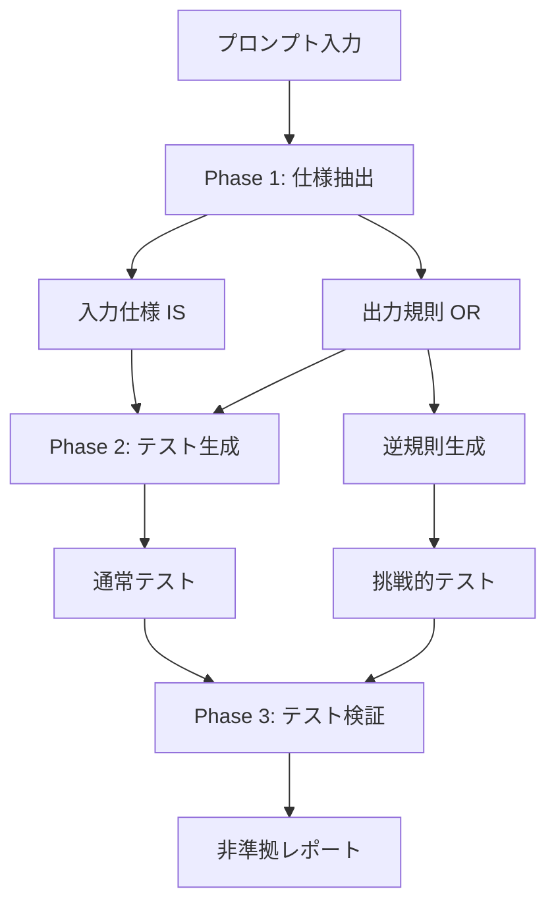

本記事は [PromptPex: Automatic Test Generation for Language Model Prompts](https://arxiv.org/abs/2503.05070) の解説記事です。

## 論文概要（Abstract）

プロンプトはLLMアプリケーションにおいて従来のソースコードに相当する役割を果たすが、その品質検証のための体系的なテスト手法は確立されていない。Sharma et al.（Microsoft Research）は、プロンプトから入力仕様（Input Specification）と出力規則（Output Rules）を自動抽出し、規則の意味的逆転（inverse rules）を用いて挑戦的なテストケースを自動生成するフレームワーク「PromptPex」を提案している。22のベンチマークプロンプトと4つのモデルでの評価において、ベースラインのLLMベーステスト生成器と比較して、一貫してより多くの非準拠（non-compliance）出力を検出した。

この記事は [Zenn記事: LLMプロンプト設計の失敗パターン7選：Before/Afterで学ぶ体系的改善手法](https://zenn.dev/0h_n0/articles/90a6baf5521a3a) の深掘りです。

## 情報源

- **arXiv ID**: 2503.05070
- **URL**: [https://arxiv.org/abs/2503.05070](https://arxiv.org/abs/2503.05070)
- **著者**: Reshabh K Sharma, Jonathan De Halleux, Shraddha Barke, Dan Grossman, Benjamin Zorn（Microsoft Research）
- **発表年**: 2025（初版2025年3月、改訂版2026年2月）
- **分野**: cs.SE, cs.AI
- **コード**: [https://github.com/microsoft/promptpex](https://github.com/microsoft/promptpex)

## 背景と動機（Background & Motivation）

LLMアプリケーションの本番運用において、プロンプトの変更が予期しない出力劣化を引き起こす「サイレント回帰」は深刻な問題である。関連Zenn記事の「失敗パターン7：エッジケース未対応によるサイレント障害」でも、正常系テストでは問題なく動作するプロンプトが、本番環境の多様な入力で誤った出力を返すケースが紹介されている。

従来のプロンプトテストには以下の課題がある。

1. **手動テスト設計のコスト**: 開発者がテストケースを手動で設計する必要があり、エッジケースの網羅が困難
2. **出力の非決定性**: LLMの出力はモデルやバージョンに依存し、テスト結果の予測が困難
3. **仕様の暗黙性**: プロンプトの「正しい振る舞い」が明文化されていないため、テストの合否基準が曖昧

著者らは、プロンプトを「入力を受け取り、出力を生成し、特定の機能を実行するソフトウェア」として扱い、ソフトウェアテストの手法をプロンプトに適用するアプローチを採用している。

## 主要な貢献（Key Contributions）

- **貢献1**: プロンプトから入力仕様（IS: Input Specification）と出力規則（OR: Output Rules）を自動抽出するアルゴリズムの提案
- **貢献2**: 出力規則の意味的逆転（inverse rules）による挑戦的テストケースの自動生成手法
- **貢献3**: 22のベンチマークプロンプト×4モデルでの定量評価によるフレームワークの有効性実証

## 技術的詳細（Technical Details）

### PromptPexのアーキテクチャ

PromptPexの処理は3つのフェーズで構成される。



#### Phase 1: 仕様抽出（Specification Extraction）

PromptPexは、GPT-5を用いてプロンプトから2種類の仕様を自動抽出する。

**入力仕様（Input Specification, IS）**: 有効な入力の制約を記述する。入力コンポーネントとその属性を識別し、エッジケースも有効な入力として扱う。

**出力規則（Output Rules, OR）**: 「具体的で、検証可能で、汎用的で、入力非依存で、独立した制約」として抽出される。計算方法の記述ではなく、出力の性質に焦点を当てる。

**具体例 — 品詞タグ付けプロンプト**:

以下のようなプロンプトが入力された場合を考える。

```
Given a sentence and a word from that sentence, output the part-of-speech 
tag for that word. Use standard tags: Noun, Verb, Adjective, Adverb, etc.
If the word is unknown, output "Unknown". If it's impossible to determine, 
output "CantAnswer". Output only the tag, nothing else.
```

PromptPexが抽出する仕様は以下の通り（論文Section記載の具体例）。

**IS（入力仕様）**:
- 入力は「文 + その文中の特定の単語」の組み合わせで構成される
- 単語は1語の制約がある

**OR（出力規則）**:
1. タグのみを出力し、追加テキストを含めない
2. 出力は指定リストの特定のタグでなければならない
3. 未知の単語には "Unknown" を返す
4. 判定不能な場合は "CantAnswer" を返す

著者らの報告によると、抽出された規則の89%（平均）がプロンプトの原文に根拠を持ち（groundedness）、仕様合致度（spec agreement）は平均96.8%であった。

#### Phase 2: テスト生成（Test Generation）

テスト生成は以下の2種類で構成される。

**通常テスト（Exhaustive Tests）**: ORの各規則に対して、その規則をテストする入力を生成する。各テストケースは対象規則と推論（reasoning）を伴う。

**挑戦的テスト（Inverse Rule Tests）**: ORの各規則を意味的に逆転させた「逆規則（inverse rules）」を生成し、その逆規則を満たそうとする入力を生成する。

**逆規則の具体例**:

| 元の規則 | 逆規則 | 生成されるテスト入力の意図 |
|---------|--------|--------------------------|
| タグのみを出力する | タグと品詞名を一緒に出力する | モデルが余分な情報を付加するか検証 |
| 指定リストのタグを使用する | 指定外のタグを出力する | モデルが規定外のラベルを生成するか検証 |
| 未知の単語には "Unknown" | 未知の単語にも何らかのタグを付与する | モデルが推測でタグ付けするか検証 |

著者らはテスト生成時にISを用いて入力の妥当性を検証し、仕様違反の入力が生成されることを防いでいる。

#### Phase 3: テスト検証（Test Validation）

生成されたテストケースは、IS（入力仕様）に基づくLLM-as-Judgeにより妥当性が検証される。著者らの報告によると、生成されたテストの妥当性はほぼ100%であった。

### アルゴリズムの形式的定義

PromptPexのテスト生成アルゴリズムは以下のように定式化できる。

プロンプト$P$から抽出された出力規則集合を$\text{OR} = \{r_1, r_2, \ldots, r_m\}$、入力仕様を$\text{IS}$とする。

通常テスト$T_{\text{normal}}$は各規則に対して生成される:

$$
T_{\text{normal}} = \bigcup_{i=1}^{m} \text{Gen}(r_i, \text{IS})
$$

逆規則テスト$T_{\text{inverse}}$は、各規則の意味的否定に対して生成される:

$$
T_{\text{inverse}} = \bigcup_{i=1}^{m} \text{Gen}(\neg r_i, \text{IS})
$$

ここで、$\text{Gen}(r, \text{IS})$は規則$r$をテストする入力をISの制約下で生成する関数、$\neg r_i$は規則$r_i$の意味的逆転を表す。

非準拠率（non-compliance rate）は以下で定義される:

$$
\text{NCR} = \frac{|\{t \in T : \text{Model}(P, t) \not\models \text{OR}\}|}{|T|}
$$

ここで、$T = T_{\text{normal}} \cup T_{\text{inverse}}$、$\text{Model}(P, t)$はプロンプト$P$とテスト入力$t$に対するモデルの出力、$\not\models \text{OR}$は出力規則に準拠しないことを表す。

### 定量評価結果

著者らは22のベンチマークプロンプトを4つのモデル（GPT-4o、Gemma2:9b、Qwen2.5:3b、Llama3.2:1b）で評価した。

**主要な発見**（論文Figure 10-12の記載値）:

1. **PromptPex vs ベースライン**: PromptPexは全モデルで一貫してベースラインLLMベーステスト生成器よりも高い非準拠率を達成した。これは、PromptPexが生成するテストがモデルの弱点をより効果的に突いていることを示す
2. **逆規則テストの効果**: 逆規則テストは全モデルでさらに高い非準拠率を示した。GPT-4oでは逆規則テストによる非準拠率の増加が最も顕著であった
3. **モデル間の差異**: より能力の高いモデル（GPT-4o）でPromptPexの優位性がより顕著であり、ベースラインがこれらのモデルの弱点を見つけるのに苦戦する一方、PromptPexは仕様ベースのアプローチにより体系的に検出できた

### 検出された非準拠出力の種類

著者らの報告による代表的な非準拠パターン:

- **プレフィックス付加**: GPT-3.5がタグの前に "Output:" を付加（仕様は余分なテキストを禁止）
- **説明の追加**: タグのみの出力を求めているのに、分類理由の説明を追加
- **フォーマット違反**: 単一回答が期待される場面で複数タグや説明テキストを出力
- **曖昧な分類**: 複数カテゴリに該当するニュース記事の分類で、プロンプトの仕様不足が露呈
- **仕様ギャップの発見**: 要素プロンプトで「値が存在しない場合のラベル」に関する規則の欠如を検出

## 実装のポイント（Implementation）

PromptPexを実務で活用する際の実装パターンを示す。

```python
from dataclasses import dataclass

@dataclass
class OutputRule:
    """プロンプトから抽出された出力規則"""
    rule_text: str
    grounded_in_prompt: bool
    inverse_rule: str | None = None

@dataclass
class TestCase:
    """生成されたテストケース"""
    input_text: str
    target_rule: OutputRule
    test_type: str  # "normal" or "inverse"
    reasoning: str
    is_valid: bool = True

def extract_output_rules(prompt: str) -> list[OutputRule]:
    """プロンプトから出力規則を抽出する

    Args:
        prompt: テスト対象のプロンプト

    Returns:
        抽出された出力規則のリスト
    """
    extraction_prompt = f"""
    Analyze the following prompt and extract concrete, checkable,
    general, input-agnostic, and independent output constraints.
    Focus on output properties, not computation methods.

    <prompt>{prompt}</prompt>

    For each rule, provide:
    1. The rule text
    2. Whether it is grounded in the original prompt
    3. A semantic inverse of the rule
    """
    # LLM呼び出し（実際の実装ではGPT-5等を使用）
    rules = call_llm(extraction_prompt)
    return [OutputRule(**r) for r in rules]

def generate_inverse_test(
    rule: OutputRule,
    input_spec: str,
) -> TestCase:
    """逆規則テストケースを生成する

    Args:
        rule: テスト対象の出力規則
        input_spec: 入力仕様

    Returns:
        挑戦的テストケース
    """
    gen_prompt = f"""
    Generate a valid input that complies with the input specification
    but is designed to challenge the following rule by testing its
    inverse: "{rule.inverse_rule}"

    Input specification: {input_spec}

    The input must be valid according to the specification.
    Provide reasoning for why this test is challenging.
    """
    result = call_llm(gen_prompt)
    return TestCase(
        input_text=result["input"],
        target_rule=rule,
        test_type="inverse",
        reasoning=result["reasoning"],
    )
```

**実務上のポイント**:

- **仕様抽出の精度**: 著者らの報告では、仕様合致度が平均96.8%であるが、複雑なプロンプトでは手動での確認と修正が推奨される
- **テストスイートの規模**: 各規則に対して通常テスト + 逆規則テストを生成するため、規則数 × 2 + α のテストケースが生成される。コストと網羅性のバランスを考慮する必要がある
- **CI/CD統合**: PromptPexを継続的インテグレーションパイプラインに組み込むことで、プロンプト変更のたびに自動的に回帰テストを実行できる。これは関連Zenn記事のPromptfooによる評価駆動改善と組み合わせて使用できる
- **モデル切り替え時のテスト**: 新しいモデルへの切り替え時に、同一のテストスイートで非準拠率を比較することで、互換性を事前に検証できる

## 実運用への応用（Practical Applications）

**プロンプトのリグレッションテスト**: プロンプトの変更（指示の追加、例題の変更、構造の再編）のたびにPromptPexで生成したテストスイートを実行し、非準拠率の変化を監視する。非準拠率が増加した場合、変更が回帰を引き起こしていることを示す。

**プロンプトの仕様不足の検出**: PromptPexが逆規則テストで仕様ギャップを発見した場合、それはプロンプト自体の改善ポイントを示す。著者らの実験では、「値が存在しない場合のラベル」に関する規則の欠如が検出された例がある。

**マルチモデル互換性テスト**: 同一プロンプトを複数のモデル（GPT-4o、Claude、Gemini等）で使用する場合、PromptPexのテストスイートで各モデルの非準拠率を比較し、モデル固有の弱点を事前に特定できる。

## 関連研究（Related Work）

- **A Taxonomy of Prompt Defects (2509.14404)**: プロンプト欠陥の分類体系であり、PromptPexは特にカテゴリ6「テスト不足（Insufficient Prompt Testing）」への具体的な対策ツールとして位置付けられる。
- **When "Better" Prompts Hurt (2601.22025)**: 評価駆動反復の重要性を実証しており、PromptPexはその評価フェーズを自動化する手段を提供する。
- **PromptBench (2312.07910)**: LLMの汎用ベンチマーキングフレームワークであり、PromptPexがプロンプト固有のテスト生成に特化している点で補完的な関係にある。

## まとめと今後の展望

著者らは、プロンプトを「テスト可能なソフトウェアアーティファクト」として扱うアプローチを確立した。特に逆規則（inverse rules）による挑戦的テスト生成は、手動では発見が困難なエッジケースを体系的に検出する手法として有用である。

このアプローチの制約として、仕様抽出にGPT-5レベルのモデルが必要であること、単一入力・非対話型タスクに限定されていること、テスト実行のコスト（モデル呼び出し回数）が挙げられる。今後の拡張として、マルチターン対話のテスト、エージェントシステムのトラジェクトリテスト、プロンプト変更時の差分テスト生成などが考えられる。

PromptPexのソースコードは[GitHub](https://github.com/microsoft/promptpex)で公開されており、実務での検証が可能である。

## 参考文献

- **arXiv**: [https://arxiv.org/abs/2503.05070](https://arxiv.org/abs/2503.05070)
- **Code**: [https://github.com/microsoft/promptpex](https://github.com/microsoft/promptpex)
- **Related Zenn article**: [https://zenn.dev/0h_n0/articles/90a6baf5521a3a](https://zenn.dev/0h_n0/articles/90a6baf5521a3a)
