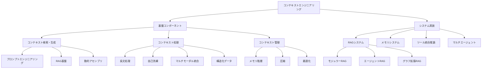
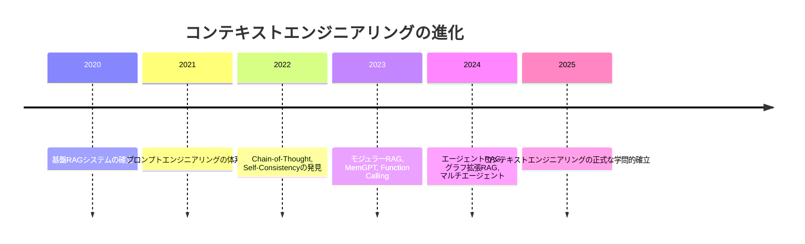

本記事は [A Survey of Context Engineering for Large Language Models](https://arxiv.org/abs/2507.13334) の解説記事です。

## 論文概要（Abstract）

Mei et al.は、コンテキストエンジニアリング（Context Engineering）をプロンプトエンジニアリングの上位概念として定式化し、LLM推論時に提供される情報ペイロード全体の体系的な最適化として位置付けた、166ページ・1,411件の引用を含む包括的サーベイである。プロンプト設計を単一のテキスト編集作業としてではなく、検索・生成・処理・管理の多層的なコンポーネントからなるシステム設計問題として再定義している。

この記事は [Zenn記事: LLMプロンプト設計の失敗パターン7選：Before/Afterで学ぶ体系的改善手法](https://zenn.dev/0h_n0/articles/90a6baf5521a3a) の深掘りです。

## 情報源

- **arXiv ID**: 2507.13334
- **URL**: [https://arxiv.org/abs/2507.13334](https://arxiv.org/abs/2507.13334)
- **著者**: Lingrui Mei, Jiayu Yao, Yuyao Ge et al.（15名）
- **発表年**: 2025（2025年7月、進行中の研究）
- **分野**: cs.CL

## 背景と動機（Background & Motivation）

Andrej Karpathyが2025年に提唱した「コンテキストエンジニアリング」の概念は、LLMをCPU、コンテキストウィンドウをRAMに見立て、**何をコンテキストに載せるか**が出力品質を決定するという考え方である。関連Zenn記事でも「プロンプトをどう書くか」から「モデルが正しく処理するために何を知る必要があるか」へのシフトとして紹介されている。

しかし、この概念の正式な学術的定義や体系的な技術マッピングは存在しなかった。著者らは、1,400本を超える関連研究を体系的に分析し、コンテキストエンジニアリングを独立した学問分野として確立する試みとしてこのサーベイを位置付けている。

## 主要な貢献（Key Contributions）

- **貢献1**: コンテキストエンジニアリングの正式な数学的定式化 — コンテキストをモジュラーな構成要素の組み合わせとしてモデル化
- **貢献2**: 基盤コンポーネント（検索・生成、処理、管理）とシステム実装（RAG、メモリ、ツール統合、マルチエージェント）の2層タクソノミーの構築
- **貢献3**: 2020年から2025年にかけてのRAGからマルチエージェントシステムへの技術進化のロードマップの提示

## 技術的詳細（Technical Details）

### コンテキストエンジニアリングの数学的定式化

著者らは、コンテキストを以下のように定式化している。

$$
C = \mathcal{A}(c_1, c_2, \ldots, c_n)
$$

ここで、
- $C$: LLMに提供される最終的なコンテキスト
- $\mathcal{A}$: オーケストレーション関数（コンポーネントの組み合わせ方を決定）
- $c_i$: 個別のコンテキストコンポーネント

著者らは6つの主要コンポーネントを定義している。

| コンポーネント | 記号 | 説明 | 具体例 |
|---------------|------|------|--------|
| システム指示 | $c_{\text{instr}}$ | モデルの振る舞いを規定する指示 | システムプロンプト、ロール定義 |
| 外部知識 | $c_{\text{know}}$ | 検索された外部情報 | RAGで取得した文書チャンク |
| ツール定義 | $c_{\text{tools}}$ | 利用可能なツールの仕様 | Function calling定義、API仕様 |
| 永続メモリ | $c_{\text{mem}}$ | 過去の対話や学習した情報 | 会話履歴、ユーザー嗜好 |
| 動的状態 | $c_{\text{state}}$ | 現在のシステム状態 | 環境変数、セッション情報 |
| ユーザークエリ | $c_{\text{query}}$ | ユーザーの入力 | 質問、指示、タスク記述 |

この定式化のポイントは、従来のプロンプトエンジニアリングが$C = \text{prompt}$（単一テキスト）として扱っていたのに対し、コンテキストエンジニアリングは**複数のモジュラーコンポーネントの動的な組み合わせ**として捉えている点にある。

さらに、コンテキスト最適化は以下の制約付き最適化問題として定式化される。

$$
C^* = \arg\max_{C} \mathbb{E}_{\tau \sim \mathcal{T}} [R(C, \tau)] \quad \text{subject to} \quad |C| \leq L_{\max}
$$

ここで、
- $C^*$: 最適なコンテキスト構成
- $\tau$: タスク分布$\mathcal{T}$からサンプリングされたタスク
- $R(C, \tau)$: コンテキスト$C$のタスク$\tau$に対する報酬（性能指標）
- $|C|$: コンテキストのトークン数
- $L_{\max}$: モデルの最大コンテキスト長

### 2層タクソノミーの構造

著者らのタクソノミーは、基盤コンポーネント（Foundation）とシステム実装（System）の2層で構成される。

### 基盤コンポーネントの詳細

#### コンテキスト検索・生成

**プロンプトベース生成**: Chain-of-Thought（CoT）の各種変形（Zero-Shot CoT、Tree of Thought、Graph of Thought）、自己一貫性（Self-Consistency）手法、自動プロンプト最適化を含む。著者らは、これらの手法がコンテキスト内の推論チェーンを動的に生成するメカニズムとして分類している。

**外部知識検索（RAG基盤）**: 著者らは、RAGをコンテキストエンジニアリングの一実装として位置付けている。検索段階（sparse/dense retrieval）、チャンキング戦略、リランキング手法を含む。著者らの報告によると、検索拡張アプローチにより、テキストナビゲーション精度の18倍の改善が達成されている（サーベイ対象論文群の報告値）。

#### コンテキスト処理

**長文処理**: FlashAttention、Ring Attentionなどの注意機構の最適化、YaRNなどの位置補間技術、StreamingLLM・InfLLMなどのストリーミング推論アプローチを体系化している。

著者らは、モデルが長文コンテキストの先頭と末尾の情報に偏って注意を向ける**U字型注意カーブ（Lost in the Middle問題）**を重要な課題として取り上げている。この現象は、関連Zenn記事の「失敗パターン2：コンテキスト配置の誤りによる情報の見落とし」の学術的な根拠である。対策として、文書を先頭に配置し指示を末尾に配置する戦略が有効であることが複数の研究で示されている。

#### コンテキスト管理

**メモリ階層**: 短期メモリ（現在の対話コンテキスト）と長期メモリ（過去の対話から学習した情報）を区別し、MemGPTやMemoryBankなどの実装を紹介している。

**コンテキスト圧縮**: トークン消費を削減しつつ応答品質を維持する技術群。著者らは、動的最適化によるコンテキスト圧縮が、リソース集約型のファインチューニングの代替手段として有効であることを報告している。

### 定量的な性能改善の報告

著者らがサーベイ対象論文群から集約した主要な性能改善を以下に示す。

| 技術カテゴリ | メトリクス | 改善値 | 出典 |
|-------------|-----------|--------|------|
| RAG検索拡張 | テキストナビゲーション精度 | 18倍改善 | サーベイ集約 |
| Few-shot学習 | BLEU-4（コード要約） | +9.90% | サーベイ集約 |
| Few-shot学習 | Exact Match（バグ修正） | +175.96% | サーベイ集約 |
| デバッグフレームワーク | 実行対応デバッグ精度 | +9.8% | サーベイ集約 |
| 特化シナリオRAG | 検索成功率 | 94% | サーベイ集約 |

### コンテキストエンジニアリングの技術進化ロードマップ

著者らは、2020年から2025年にかけての技術進化を以下のように整理している。

### 入力理解と出力生成の非対称性

著者らが特定した重要な知見として、**LLMは複雑なコンテキストの理解には優れているが、同等に洗練された長文の生成には制限がある**という非対称性がある。この発見は、今後の研究における主要な課題として位置付けられている。

この非対称性は実務的にも重要であり、「大量のコンテキストを入力すれば高品質な長文出力が得られる」という仮定が常に成立するわけではないことを意味する。コンテキストの量だけでなく、**出力に対する適切な制約と構造化**が品質向上に不可欠である。

## 実運用への応用（Practical Applications）

**コンポーネントベースのプロンプト設計**: このサーベイの定式化に基づき、プロンプトを$c_{\text{instr}}$、$c_{\text{know}}$、$c_{\text{tools}}$、$c_{\text{query}}$のモジュラーコンポーネントとして設計することで、各コンポーネントの独立した最適化とテストが可能になる。これは関連Zenn記事のXMLタグによる構造化（`<instructions>`、`<output_format>`、`<feedback>`）と直接的に対応する。

**コンテキスト予算の管理**: $|C| \leq L_{\max}$の制約下での最適化として、各コンポーネントへのトークン割り当てを明示的に管理する設計パターンが有効である。特にFew-shot例題（$c_{\text{know}}$の一形態）のトークンコストとタスク性能のトレードオフを定量的に評価することが推奨される。

**U字型注意カーブへの対策**: コンテキスト内の重要情報を先頭または末尾に配置し、中間部には背景情報やFew-shot例題を配置する構造化戦略を採用する。これは関連Zenn記事の「失敗パターン2」の改善策と整合する。

## 関連研究（Related Work）

- **A Taxonomy of Prompt Defects (2509.14404)**: プロンプト欠陥の分類体系であり、本サーベイのタクソノミーとは直交的な視点（成功パターンではなく失敗パターン）を提供する。
- **When "Better" Prompts Hurt (2601.22025)**: コンテキスト内の要素間の競合を実証しており、本サーベイのオーケストレーション関数$\mathcal{A}$の設計がいかに重要かを裏付けている。
- **Prompt engineering for structured data (2025)**: 構造化データにおけるプロンプト形式（JSON、YAML、CSV等）の比較評価であり、本サーベイの構造化コンテキスト処理に関連する。

## まとめと今後の展望

著者らは、コンテキストエンジニアリングを「単純なプロンプト設計を超え、LLMへの情報ペイロードの体系的な最適化を包括する正式な学問分野」として確立することを目指している。このサーベイは、プロンプトエンジニアリングが個別のテクニック集から、検索・処理・管理を包含するシステム設計の一部へと進化していることを示している。

関連Zenn記事が提示する7つの失敗パターンは、このサーベイの枠組みでは以下のように位置付けられる：パターン1-3はコンテキスト検索・生成の問題、パターン4は構造化コンテキスト処理の問題、パターン5はオーケストレーション関数$\mathcal{A}$の設計問題、パターン6-7はコンテキスト管理の問題として分類できる。

## 参考文献

- **arXiv**: [https://arxiv.org/abs/2507.13334](https://arxiv.org/abs/2507.13334)
- **ページ数**: 166ページ、1,411件の引用
- **Related Zenn article**: [https://zenn.dev/0h_n0/articles/90a6baf5521a3a](https://zenn.dev/0h_n0/articles/90a6baf5521a3a)
