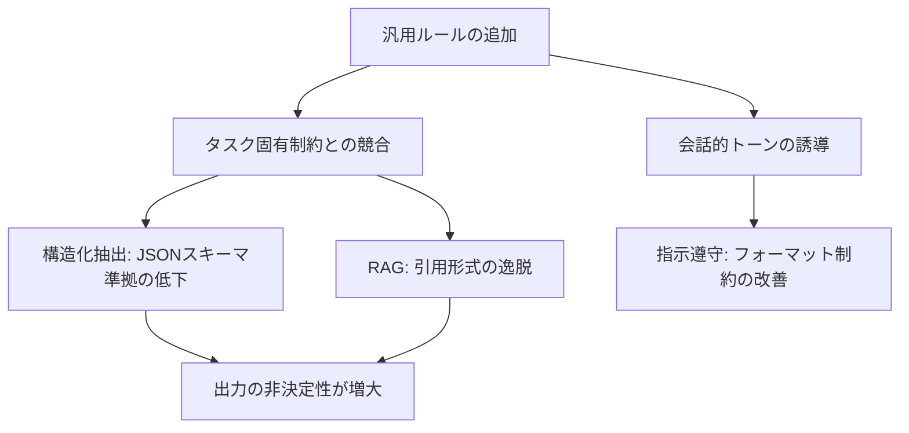

本記事は [When Generic Prompt Improvements Hurt: Evaluation-Driven Iteration for LLM Applications](https://arxiv.org/abs/2601.22025) の解説記事です。

## 論文概要（Abstract）

「プロンプトを改善すれば性能は上がる」という直感に反する現象を実証した論文である。著者Commeyは、汎用的なプロンプト改善（helpful assistantラッパーの追加や一般的なルールの適用）が、構造化抽出タスクで精度を10%低下させ、RAGの引用準拠度を13%低下させることを示した。この結果を踏まえ、タスク固有のテストスイートに基づく評価駆動反復（Evaluation-Driven Iteration）と、その実践フレームワークであるMVES（Minimum Viable Evaluation Suite）を提案している。

この記事は [Zenn記事: LLMプロンプト設計の失敗パターン7選：Before/Afterで学ぶ体系的改善手法](https://zenn.dev/0h_n0/articles/90a6baf5521a3a) の深掘りです。

## 情報源

- **arXiv ID**: 2601.22025
- **URL**: [https://arxiv.org/abs/2601.22025](https://arxiv.org/abs/2601.22025)
- **著者**: Daniel Commey
- **発表年**: 2026（初版2026年1月、改訂版2026年6月）
- **分野**: cs.CL, cs.AI, cs.IR, cs.SE

## 背景と動機（Background & Motivation）

プロンプトエンジニアリングの実務では、「ロールを追加する」「丁寧に指示する」「chain-of-thoughtを促す」といった汎用的な改善テクニックが広く共有されている。しかし著者は、これらのテクニックが**タスクを区別せずに一律に適用される**現状に疑問を呈している。

LLMの出力は確率的かつ意味的に多様であるため、従来のソフトウェアテストのような単純なパス/フェイル判定が適用しにくい。この特性が、プロンプト変更の影響を「なんとなく良くなった」という主観で判断する文化を助長している。著者は、この主観的選択バイアス（subjective selection bias）を排除するために、定量的な評価に基づく反復プロセスが必要であると主張している。

## 主要な貢献（Key Contributions）

- **貢献1**: 汎用的なプロンプト改善が構造化タスクで逆効果となる実証データの提示（抽出精度-10%、RAG準拠度-13%）
- **貢献2**: MVES（Minimum Viable Evaluation Suite）フレームワークの提案 — アプリケーションカテゴリ別の段階的評価体系
- **貢献3**: 5つのプロンプト条件を用いた制御実験による、障害メカニズムの切り分け

## 技術的詳細（Technical Details）

### 実験設計: 5つのプロンプト条件

著者は以下の5条件を設計し、汎用改善の各要素が性能に与える影響を分離している。

| 条件 | 説明 | 目的 |
|------|------|------|
| **Task-Specific** | タスク固有の制約のみ | ベースライン |
| **Generic Wrapper** | 会話的な前置き + 汎用ルールの追加 | 汎用改善の効果測定 |
| **System Message Only** | ラッパーのみ（汎用ルールなし） | ラッパー単体の影響 |
| **Generic Rules Only** | 汎用ルールのみ（ラッパーなし） | ルール単体の影響 |
| **Combined** | ラッパー + 汎用ルール | 複合効果の測定 |

### 実験環境

- **モデル**: Llama 3 8B Instruct、Qwen 2.5 7B Instruct（Ollama経由のローカル実行）
- **テストスイート**: 各30ケース（拡張版）
- **評価対象**: 構造化抽出、RAG引用準拠、指示遵守の3タスク

### 定量結果: 汎用改善が逆効果となる実証

著者が報告した主要な定量結果を以下に示す（論文Table記載値）。

**Llama 3 8B Instructでの結果:**

| タスク | メトリクス | Task-Specific | Generic Wrapper | 変化 |
|--------|-----------|---------------|-----------------|------|
| 構造化抽出 | All-pass rate | 100% | 90% | **-10%** |
| RAG引用 | Citation compliance | 93.3% | 80% | **-13.3%** |
| 指示遵守 | Constraint pass | 85% | 96% | +11% |

**Qwen 2.5 7B Instructでの結果:**

RAG引用準拠度においてさらに深刻な低下が観測された。著者は、Qwen 2.5で汎用ルールを適用した場合、30ケース中26ケースの引用準拠が9ケースまで低下した（26/30 → 9/30）ことを報告している。

### 障害メカニズムの分析

著者によるアブレーション実験の結果、以下のメカニズムが特定された。



著者は、汎用ルール（「親切に答える」「ユーザーを助ける」等）がタスク固有の制約（「JSON形式で出力する」「引用元を明記する」等）と**意味的に競合**することで、モデルが両方の制約を同時に満たそうとして出力の一貫性が低下すると分析している。

一方、指示遵守タスクでは汎用ルールが改善に寄与した。著者は、これはフォーマット制約（「箇条書きで3項目」等）が汎用的な「丁寧さ」の要求と矛盾しないためであると解釈している。

### MVES（Minimum Viable Evaluation Suite）フレームワーク

著者が提案するMVESは、アプリケーションカテゴリ別に段階的な評価体系を定義している。

#### MVES-Core（全アプリケーション共通）

- **ゴールデンセット**: 50-200ケースのバージョン管理された評価データ
- **層別化**: ユーザー意図別に分類し、約20%をエッジケースに割り当て
- **自動アサーション**: フォーマット正当性、必須フィールドの存在、禁止コンテンツの不在
- **意味メトリクス**: 非構造化出力に対する少なくとも1つの意味的評価指標
- **キャリブレーション**: 25-50例の人間によるラベル付きサブセット

#### MVES-RAG（検索ベースシステム用拡張）

- **検索品質**: Recall@k、MRR（Mean Reciprocal Rank）の測定
- **回答の忠実性**: NLIスタイルまたはLLM-as-Judgeによるgroundednessチェック
- **明示的テスト**: 正しいが根拠なしの回答、引用欠落、引用ミスマッチの検出

#### MVES-Agentic（ツール使用システム用拡張）

- **トラジェクトリ評価**: マルチステップタスクの全実行経路の検証
- **ツール別成功率**: 各ツール呼び出しの成功・失敗の統計
- **サンドボックス実行**: 高リスクアクションに対するhuman-in-the-loopレビュー

### 評価手法の比較

著者は、異なる評価手法のトレードオフを以下のように整理している（論文Table記載値）。

| 評価手法 | 人間判断との相関 | 1,000例あたりのコスト | 実行時間 |
|---------|----------------|---------------------|---------|
| 自動メトリクス | 0.40-0.60 | ~$0 | 分単位 |
| LLM-as-Judge | 0.70-0.85 | $10-50 | 時間単位 |
| 人間評価 | 1.0（基準） | >$1,000 | 日単位 |

著者は、オフライン評価（ゴールデンセット、ユニットテスト）とオンラインモニタリング（本番環境での観測）を**競合ではなく補完的**に活用することを推奨している。

## 実装のポイント（Implementation）

MVESフレームワークを実務に適用する際の実装パターンを以下に示す。

```python
from dataclasses import dataclass, field
from typing import Callable

@dataclass
class EvalCase:
    """評価ケースの定義"""
    input_text: str
    expected_properties: dict
    category: str  # "normal", "edge_case", "adversarial"
    assertions: list[Callable] = field(default_factory=list)

@dataclass
class MVESConfig:
    """MVES設定"""
    golden_set_size: int = 100  # 50-200
    edge_case_ratio: float = 0.2
    semantic_metric: str = "llm_rubric"
    calibration_size: int = 30  # 25-50

def run_mves_evaluation(
    prompt_variant: str,
    eval_cases: list[EvalCase],
    model_id: str,
) -> dict:
    """MVESに基づくプロンプト評価の実行

    Args:
        prompt_variant: 評価対象のプロンプト（v1, v2等）
        eval_cases: 評価ケースのリスト
        model_id: 使用するLLMモデルID

    Returns:
        メトリクス辞書
    """
    results = {"pass": 0, "fail": 0, "metrics": {}}

    for case in eval_cases:
        output = call_llm(model_id, prompt_variant, case.input_text)

        all_passed = True
        for assertion in case.assertions:
            if not assertion(output):
                all_passed = False
                break

        if all_passed:
            results["pass"] += 1
        else:
            results["fail"] += 1

    results["pass_rate"] = results["pass"] / len(eval_cases)
    return results
```

**実務上のポイント**:

- **1変数ルール**: プロンプト変更は1回に1つの要素のみを変更し、評価スイートで比較する。複数変更を同時に行うと、改善要因の特定が困難になる
- **ゴールデンセットの規模**: 統計的に有意な差を検出するために少なくとも20ケース以上が必要。著者は50-200ケースを推奨している
- **エッジケースの割合**: 全体の約20%をエッジケースに割り当てることで、本番環境での予期しない入力に対する堅牢性を検証できる
- **過学習の防止**: ゴールデンセットへの過学習を避けるため、別途ホールドアウトセットと本番モニタリングを維持する

## 実運用への応用（Practical Applications）

**プロンプト変更のゲーティング**: CI/CDパイプラインにMVESテストを組み込み、プロンプト変更がテストスイートを通過した場合のみデプロイを許可する。Promptfooの設定ファイル（promptfooconfig.yaml）をバージョン管理し、プロンプトテンプレートと同期して管理する。

**モデル切り替え時の回帰検出**: LLMプロバイダがモデルを更新した際（例: Claude Sonnet 4.5 → 4.6）、同一のMVESテストスイートで回帰を検出できる。著者の実験が示すように、モデルによって汎用改善の影響が大きく異なる（Llama 3とQwen 2.5で引用準拠度の低下幅が異なる）ため、モデル固有の評価が不可欠である。

**チーム間の意思決定の客観化**: 「このプロンプトのほうが良い」という主観的な議論を、MVESのメトリクスに基づく客観的な比較に置き換えることで、チーム内の意思決定を効率化できる。

## 関連研究（Related Work）

- **A Taxonomy of Prompt Defects (2509.14404)**: プロンプト欠陥の分類体系を提供しており、本論文の「汎用ルールとタスク固有制約の競合」はカテゴリ1（仕様と意図の欠陥）の「矛盾する指示」に分類される。
- **A Systematic Approach for LLM Debugging (2604.23027)**: 4フェーズデバッグフレームワークを提案しており、本論文のMVESはPhase 2（証拠収集）の具体的な実装手段として位置付けられる。
- **PromptBench (2312.07910)**: LLMの評価ライブラリであり、多様なプロンプトタイプでのモデル性能評価をサポートする。MVESよりも汎用的なベンチマーキングに焦点を当てている。

## まとめと今後の展望

著者は「プロンプト変更はタスク固有のテストスイートに対して検証されるべきであり、従来の常識に基づいて有益であると仮定すべきではない」と結論付けている。この主張は、関連Zenn記事の「失敗パターン6：主観的評価によるプロンプト品質の停滞」に対する学術的な裏付けを提供するものである。

MVESフレームワークは実務的に実装可能な粒度で設計されており、50-200ケースのゴールデンセットから始めて段階的に拡充できる点が特徴である。ただし、LLM-as-Judge評価器の信頼性の限界（人間判断との相関0.70-0.85）を考慮し、高リスクなアプリケーションでは人間評価を組み合わせる必要がある。

## 参考文献

- **arXiv**: [https://arxiv.org/abs/2601.22025](https://arxiv.org/abs/2601.22025)
- **リポジトリ**: テストスイート、プロンプトバリアント、評価ハーネス、結果ログ、再現スクリプトを含む
- **Related Zenn article**: [https://zenn.dev/0h_n0/articles/90a6baf5521a3a](https://zenn.dev/0h_n0/articles/90a6baf5521a3a)
