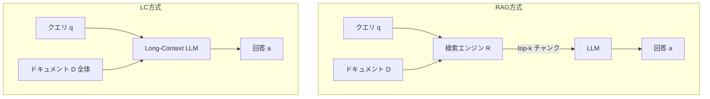
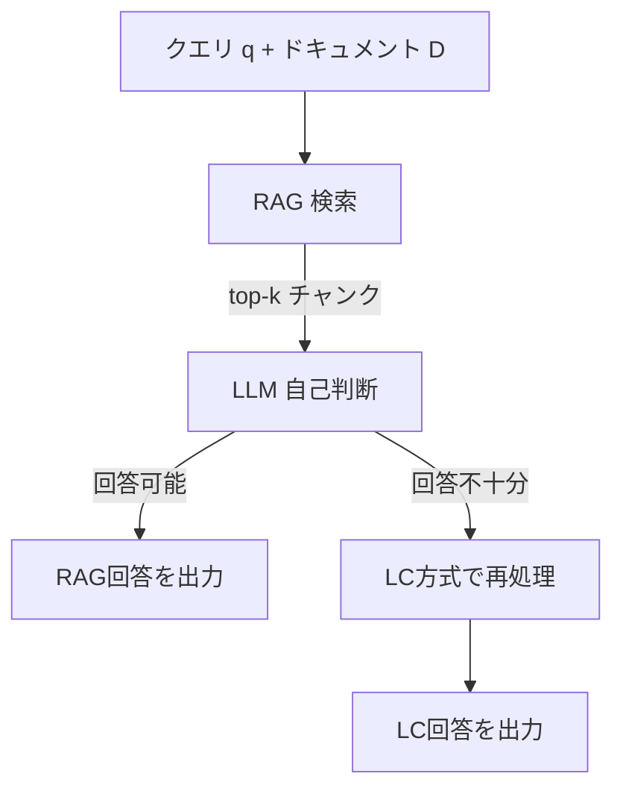

本記事は [Retrieval Augmented Generation or Long-Context LLMs? A Comprehensive Study and Hybrid Approach](https://arxiv.org/abs/2407.16833) の解説記事です。EMNLP 2024 Industry Track採択。

## 論文概要（Abstract）

RAG（Retrieval Augmented Generation）はLLMが長大なコンテキストを効率的に処理するための手法として広く使われてきた。一方、Gemini-1.5やGPT-4のような長コンテキストLLMは、RAGなしで直接長文を処理する能力を示している。著者らはこの2つのアプローチを包括的に比較し、十分なリソースがある場合はLong-Context（LC）がRAGを一貫して上回る一方、RAGのコスト優位性が際立つことを明らかにした。さらに、モデルの自己判断でクエリをRAGまたはLCにルーティングするSelf-Route手法を提案し、Gemini-1.5-Proでコスト65%削減、GPT-4Oで39%削減を達成したと報告されている。

この記事は [Zenn記事: Assistants API Thread移行実践：肥大化対策からConversations API再設計まで](https://zenn.dev/0h_n0/articles/c94e21f061ebbb) の深掘りです。

## 情報源

- **会議名**: EMNLP 2024（Industry Track）
- **年**: 2024
- **URL**: [https://arxiv.org/abs/2407.16833](https://arxiv.org/abs/2407.16833)
- **著者**: Zhuowan Li, Cheng Li, Mingyang Zhang, Qiaozhu Mei, Michael Bendersky
- **発表形式**: Industry Track

## カンファレンス情報

**EMNLP（Empirical Methods in Natural Language Processing）** は自然言語処理分野のトップカンファレンスの1つであり、ACLと並ぶ最高峰の学術会議である。Industry Trackは産業界からの実践的な知見を重視する発表枠であり、本論文はGoogle Researchからの投稿である。

## 技術的詳細（Technical Details）

### RAG vs Long-Contextの基本構造



**RAG方式**の入力コスト:

$$
C_{\text{RAG}} = (|q| + k \cdot |c|) \times P_{\text{input}} + |a| \times P_{\text{output}}
$$

ここで$|q|$はクエリのトークン数、$k$は取得チャンク数、$|c|$は各チャンクのトークン数、$P_{\text{input}}$と$P_{\text{output}}$はモデルの入出力単価、$|a|$は回答のトークン数である。

**LC方式**の入力コスト:

$$
C_{\text{LC}} = (|q| + |D|) \times P_{\text{input}} + |a| \times P_{\text{output}}
$$

ここで$|D|$はドキュメント全体のトークン数である。$|D| \gg k \cdot |c|$であるため、LC方式はRAG方式に比べて入力コストが高い。

### 比較実験の設計

著者らは以下の条件で体系的な比較を行っている。

**評価対象モデル**: Gemini-1.5-Pro、GPT-4O

**評価データセット**: 複数の長文理解ベンチマーク

**RAG構成の変数**:
- チャンクサイズ: 100, 200, 500, 1000トークン
- 取得数k: 5, 10, 20, 50
- 検索手法: BM25, Dense Retrieval, Hybrid

### 主要な比較結果

著者らの実験結果から、以下のトレードオフが報告されている。

| 観点 | RAG | Long-Context (LC) |
|------|-----|-------------------|
| 平均性能 | 低い | **高い** |
| コスト | **低い** | 高い |
| レイテンシ | **短い** | 長い |
| 検索品質依存 | 高い | なし |
| コンテキスト長依存 | なし | 高い |

**なぜLCがRAGを上回るのか**: 著者らは、RAGの検索段階で関連チャンクを見逃す（recall loss）ことが主因であると分析している。特に、複数の離散的な情報を統合する必要があるクエリ（multi-hop reasoning）では、RAGの検索漏れがLC方式に対する劣位を生む。

### Self-Route: ハイブリッド戦略

著者らが提案するSelf-Routeは、LLM自身がクエリに対してRAGで十分回答できるかを判断し、不十分な場合のみLCにフォールバックする手法である。



Self-Routeの判断基準は以下のように定式化される。

$$
\text{Route}(q, R(q, D)) = \begin{cases}
\text{RAG} & \text{if LLM judges } R(q, D) \text{ sufficient} \\
\text{LC} & \text{otherwise}
\end{cases}
$$

ここで$R(q, D)$はクエリ$q$に対するドキュメント$D$からの検索結果である。

### Self-Routeの実装

```python
from openai import OpenAI

client = OpenAI()

SELF_ROUTE_SYSTEM_PROMPT = """
あなたは質問応答システムのルーターです。
提供されたコンテキスト（検索結果）が質問に十分回答できるかを判断してください。

判断基準:
1. 質問に直接回答する情報がコンテキストに含まれているか
2. 複数の情報を統合する必要がある場合、必要な情報がすべて揃っているか
3. 文脈が欠けていて回答が不確実になる可能性はないか

回答形式: "SUFFICIENT" または "INSUFFICIENT" のいずれか1単語で回答してください。
"""


def self_route(
    query: str,
    retrieved_chunks: list[str],
    full_document: str,
    model: str = "gpt-4.1",
) -> str:
    """Self-Routeによるクエリルーティング

    Args:
        query: ユーザークエリ
        retrieved_chunks: RAG検索結果のチャンクリスト
        full_document: 元の全文ドキュメント
        model: 使用モデル

    Returns:
        回答テキスト
    """
    context = "\n---\n".join(retrieved_chunks)

    judge_response = client.responses.create(
        model=model,
        input=[
            {"role": "system", "content": SELF_ROUTE_SYSTEM_PROMPT},
            {
                "role": "user",
                "content": f"質問: {query}\n\nコンテキスト:\n{context}",
            },
        ],
        max_output_tokens=10,
    )

    judgment = judge_response.output_text.strip()

    if judgment == "SUFFICIENT":
        rag_response = client.responses.create(
            model=model,
            input=[
                {
                    "role": "user",
                    "content": f"以下のコンテキストに基づいて質問に回答してください。\n\n質問: {query}\n\nコンテキスト:\n{context}",
                },
            ],
        )
        return rag_response.output_text

    lc_response = client.responses.create(
        model=model,
        input=[
            {
                "role": "user",
                "content": f"以下のドキュメント全体を参照して質問に回答してください。\n\n質問: {query}\n\nドキュメント:\n{full_document}",
            },
        ],
    )
    return lc_response.output_text
```

### Conversations APIへの適用

Self-Routeの考え方は、OpenAI Conversations API + Compaction APIの運用に以下のように適用できる。

| Self-Routeの概念 | Conversations APIでの対応 |
|----------------|-------------------------|
| RAGルート（低コスト） | Compaction後のコンテキストで応答 |
| LCルート（高品質） | Compactionなし（全履歴参照）で応答 |
| 自己判断 | `compact_threshold`の動的制御 |
| コスト削減率 | Compaction頻度の最適化で実現 |

## 実装のポイント

**判断精度の重要性**: Self-Routeの判断が誤ると、RAGで回答すべきクエリにLCが使われ（コスト増）、またはLCが必要なクエリにRAGが使われる（品質低下）。著者らは、判断精度がコスト削減率に直接影響すると報告している。

**RAG検索品質への依存**: Self-Routeの前段でRAG検索が行われるため、検索品質が全体性能を左右する。チャンクサイズとtop-kの最適化が重要である。

**コスト計算の事前見積もり**: Self-Routeのルーティング比率（RAG:LC）が事前にわかれば、会話システム全体のトークンコストを予測できる。論文の実験では、クエリの約35-61%がRAGで処理可能と判断されている。

## 実験結果（Results）

著者らの主要な実験結果は以下の通りである。

### Self-Routeのコスト削減効果

| モデル | LC単独の性能 | Self-Routeの性能 | コスト削減率 |
|--------|------------|----------------|------------|
| Gemini-1.5-Pro | ベースライン | 同等 | **65%** |
| GPT-4O | ベースライン | 同等 | **39%** |

論文Table 5より、Self-RouteはLC単独と同等の性能を維持しつつ、Gemini-1.5-Proで65%、GPT-4Oで39%のコスト削減を達成したと著者らは報告している。

### ルーティング比率

著者らの実験では、クエリの約35-61%がRAGで十分と判断されている。残りのクエリはLC方式にルーティングされ、multi-hop reasoningや複雑な文脈理解を要するケースが多い。

### RAG構成の最適化

| チャンクサイズ | top-k | 性能 | コスト |
|-------------|-------|------|------|
| 100 | 20 | 低 | 低 |
| 500 | 10 | **中-高** | 中 |
| 1000 | 5 | 中 | 中 |

著者らの実験から、チャンクサイズ500トークン・top-k=10が性能とコストのバランスに優れるとされている。

## 実運用への応用（Practical Applications）

この研究は、OpenAI Assistants APIからConversations APIへの移行における会話コンテキスト管理に以下の示唆を提供する。

1. **Truncation StrategyとCompactionの使い分け**: Self-Routeの考え方を応用し、短い会話（10ターン以下）ではTruncation Strategy（RAGに相当する低コスト手法）、長い会話ではCompaction API（LCに相当する高品質手法）を使い分ける戦略が有効
2. **コスト予測の改善**: 会話の複雑度に基づくルーティング比率を事前に見積もることで、月間トークンコストの予測精度が向上する
3. **`compact_threshold`の動的制御**: 会話の内容に応じて`compact_threshold`を動的に変更し、単純なFAQ的会話では高い閾値（Compaction頻度低）、複雑な顧客対応では低い閾値（Compaction頻度高）とすることが有効

## 関連研究（Related Work）

- **MemGPT** (Packer et al., 2023): 階層的メモリ管理によるコンテキスト拡張。Self-RouteのRAG/LC判断は、MemGPTのページイン/ページアウト判断と構造的に類似している
- **ACON** (Kang et al., 2025): コンテキスト圧縮最適化。ACONの圧縮率制御は、Self-Routeのルーティング判断と同様にコスト-品質トレードオフを扱う
- **Self-RAG** (Asai et al., 2023): 自己反省トークンによる検索判断。Self-Routeと異なり、モデルのファインチューニングが必要

## まとめ

本論文は、RAGとLong-Context LLMの包括的比較を通じて、両者のトレードオフ（性能 vs コスト）を定量的に明らかにした。提案されたSelf-Route手法は、モデルの自己判断でRAGとLCを動的に切り替えることで、性能を維持しつつコストを39-65%削減する。この知見は、OpenAI Conversations APIにおけるCompaction閾値の設計や、会話コンテキスト管理戦略の最適化に直接応用可能である。

## 参考文献

- **Conference URL**: [https://arxiv.org/abs/2407.16833](https://arxiv.org/abs/2407.16833)
- **EMNLP 2024**: Industry Track採択
- **Related Zenn article**: [https://zenn.dev/0h_n0/articles/c94e21f061ebbb](https://zenn.dev/0h_n0/articles/c94e21f061ebbb)
