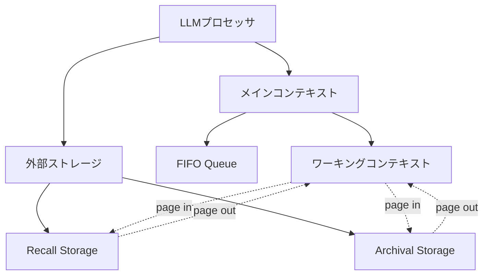

本記事は [MemGPT: Towards LLMs as Operating Systems](https://arxiv.org/abs/2310.08560) の解説記事です。

## 論文概要（Abstract）

LLMは限られたコンテキストウィンドウにより、長期会話やドキュメント解析でのユーティリティが制約される。著者らは、従来のOSにおける階層的メモリシステムからの着想を得て「仮想コンテキスト管理（virtual context management）」を提案し、MemGPT（Memory-GPT）を構築した。MemGPTは異なるメモリ階層を管理し、割り込み（interrupt）による制御フローでユーザーとの対話を維持する。

この記事は [Zenn記事: Assistants API Thread移行実践：肥大化対策からConversations API再設計まで](https://zenn.dev/0h_n0/articles/c94e21f061ebbb) の深掘りです。

## 情報源

- **arXiv ID**: 2310.08560
- **URL**: [https://arxiv.org/abs/2310.08560](https://arxiv.org/abs/2310.08560)
- **著者**: Charles Packer, Sarah Wooders, Kevin Lin, Vivian Fang, Shishir G. Patil, Ion Stoica, Joseph E. Gonzalez（UC Berkeley）
- **発表年**: 2023年（2024年2月改訂）
- **分野**: cs.AI

## 背景と動機（Background & Motivation）

2023年時点で、GPT-4のコンテキストウィンドウは8Kまたは32Kトークンに制限されていた。OpenAIのAssistants API ThreadやChatGPTのように長期会話を必要とするアプリケーションでは、会話ターンが増加するにつれて入力トークンが累積し、コンテキストウィンドウを超過する問題が生じていた。

従来の対処法として、会話履歴の単純な切り詰め（truncation）や、直近$N$件のメッセージのみを送信する方法が用いられてきた。しかし、切り詰めは過去の重要な文脈を失わせ、応答品質の低下を招く。一方でコンテキストウィンドウ全体を使い切ると、トークンコストが会話長に対して$O(n^2)$で増加する構造的な問題がある。

著者らはこの問題が、OSにおけるプロセスの仮想メモリ管理と構造的に同型であることに着目した。プロセスが物理RAMを超えるメモリを「仮想的に」利用できるのと同様に、LLMも限られたコンテキストウィンドウを超える情報を「仮想的に」参照できるシステムが必要である。

## 主要な貢献（Key Contributions）

- **貢献1**: OSの仮想メモリ管理の概念をLLMのコンテキスト管理に適用した「仮想コンテキスト管理」フレームワークの提案
- **貢献2**: メインコンテキスト（高速メモリ）と外部ストレージ（低速メモリ）間のデータ移動を自律的に制御するMemGPTシステムの設計・実装
- **貢献3**: ドキュメント解析とマルチセッション会話の2ドメインで、コンテキストウィンドウ制限を超えた情報処理能力を実証

## 技術的詳細（Technical Details）

### メモリ階層アーキテクチャ

MemGPTのメモリシステムは、OSの仮想メモリ管理を模倣した3階層で構成される。



**メインコンテキスト（Main Context）** はLLMのコンテキストウィンドウに相当し、OSにおける物理RAMに対応する。以下の3領域で構成される。

1. **システムプロンプト領域**: エージェントのペルソナ、指示、ツール定義を格納（OSのカーネル空間に相当）
2. **ワーキングコンテキスト**: エージェントが自由に読み書きできるスクラッチパッド（OSのユーザー空間のヒープに相当）
3. **FIFO Queue**: 直近の会話メッセージを先入れ先出しで保持（OSのページキャッシュに相当）

**外部ストレージ（External Storage）** はコンテキストウィンドウ外のデータを永続化する。

- **Recall Storage**: 全会話履歴のインデックス付き検索可能なストア（OSのスワップ領域に相当）
- **Archival Storage**: 大規模ドキュメントや長期記憶のベクトルDB（OSのディスクストレージに相当）

### ページングメカニズム

MemGPTのページング操作は、LLM自身が「いつ、何を」メインコンテキストに読み込む（page in）か、外部に書き出す（page out）かを判断する点が特徴的である。

FIFO Queueが溢れた場合のページアウト処理は以下のように定式化される。

$$
\text{evict}(Q, m_{\text{new}}) = \begin{cases}
Q \cup \{m_{\text{new}}\} & \text{if } |Q| < Q_{\max} \\
(Q \setminus \{m_{\text{oldest}}\}) \cup \{m_{\text{new}}\} & \text{if } |Q| \geq Q_{\max}
\end{cases}
$$

ここで、$Q$はFIFO Queue、$m_{\text{new}}$は新規メッセージ、$Q_{\max}$はキュー最大長、$m_{\text{oldest}}$は最古のメッセージである。退去された$m_{\text{oldest}}$はRecall Storageに移動する。

ページイン操作では、LLMがFunction Callingを通じて以下の検索を実行する。

```python
def conversation_search(self, query: str, page: int = 0) -> list[dict]:
    """Recall Storageから過去の会話メッセージを検索する

    Args:
        query: 検索クエリ（セマンティック検索）
        page: ページネーション用インデックス

    Returns:
        関連する過去のメッセージリスト
    """
    results = self.recall_storage.search(
        query=query,
        top_k=self.page_size,
        offset=page * self.page_size,
    )
    return results


def archival_memory_search(self, query: str, page: int = 0) -> list[dict]:
    """Archival Storageから長期記憶を検索する

    Args:
        query: 検索クエリ（ベクトル類似度検索）
        page: ページネーション用インデックス

    Returns:
        関連するアーカイブデータリスト
    """
    results = self.archival_storage.search(
        query=query,
        top_k=self.page_size,
        offset=page * self.page_size,
    )
    return results
```

### 割り込み（Interrupt）による制御フロー

MemGPTの制御フローはOSの割り込み機構を模倣している。エージェントは以下の2種類の割り込みで起動される。

1. **ユーザー割り込み**: ユーザーがメッセージを送信した際に発生
2. **システム割り込み**: タイマーやイベントトリガーにより発生（例: 一定時間経過後にエージェントが自発的に記憶を整理する）

各割り込み処理でLLMは以下の判断を行う。

- 応答メッセージの生成（`send_message`ツール）
- メモリの読み書き（`conversation_search`, `archival_memory_insert`等）
- 処理の継続（`request_heartbeat`フラグ）または終了

`request_heartbeat`はMemGPT固有の機構であり、LLMが「まだ処理を続けたい」と判断した場合にTrueを返すことで、追加のLLM呼び出しをトリガーする。これにより、1回のユーザー割り込みに対して複数のメモリ操作をチェーンできる。

### OpenAI Assistants APIとの対比

MemGPTのメモリ階層は、OpenAI Assistants APIのThread管理と以下のように対応する。

| MemGPTの概念 | Assistants APIの対応 | Conversations APIの対応 |
|-------------|---------------------|------------------------|
| メインコンテキスト | Threadの全メッセージ（Run時に送信） | Conversationのアクティブアイテム |
| FIFO Queue | Truncation Strategy（last_messages） | 直近のItems |
| ワーキングコンテキスト | Thread.metadata | Conversation.metadata |
| Recall Storage | なし（アプリケーション側で実装） | Compaction Item（暗号化圧縮） |
| Archival Storage | File Search（ベクトルストア） | 外部ベクトルDB |
| ページアウト | auto truncation | サーバーサイドCompaction |

## 実装のポイント（Implementation）

MemGPTの実装では、メモリ管理操作をFunction Calling（ツール呼び出し）として定義している点が重要である。LLMはシステムプロンプト内の指示に基づき、適切なタイミングでメモリ操作ツールを呼び出す。

**実装上の注意点**:

- **FIFO Queueサイズの設計**: モデルのコンテキストウィンドウからシステムプロンプトとワーキングコンテキストを差し引いた残りのトークン数で決定される。GPT-4（8K）では実質的に5-10メッセージ程度しか保持できない
- **Recall Storageの検索品質**: セマンティック検索の精度が全体性能のボトルネックとなる。Embeddingモデルの選択が重要
- **ハートビートの発散防止**: `request_heartbeat`の無限ループを防ぐため、最大チェーン長の制限が必要

```python
MAX_HEARTBEAT_CHAIN = 10

def agent_step(self, user_message: str | None = None) -> str:
    """エージェントの1ステップ実行

    Args:
        user_message: ユーザーからの入力（Noneの場合はシステム割り込み）

    Returns:
        ユーザーへの応答メッセージ
    """
    chain_count = 0
    response_text = None

    while chain_count < MAX_HEARTBEAT_CHAIN:
        llm_response = self.llm.call(
            messages=self.build_context(user_message if chain_count == 0 else None),
            tools=self.memory_tools,
        )

        for tool_call in llm_response.tool_calls:
            self.execute_tool(tool_call)

        if llm_response.has_send_message:
            response_text = llm_response.send_message_content

        if not llm_response.request_heartbeat:
            break

        chain_count += 1

    return response_text
```

## Production Deployment Guide

### AWS実装パターン（コスト最適化重視）

MemGPTのメモリ階層をAWS上で実現する構成を示す。

| 規模 | 月間リクエスト | 推奨構成 | 月額コスト | 主要サービス |
|------|--------------|---------|-----------|------------|
| **Small** | ~3,000 (100/日) | Serverless | $80-200 | Lambda + Bedrock + DynamoDB + OpenSearch Serverless |
| **Medium** | ~30,000 (1,000/日) | Hybrid | $500-1,200 | ECS Fargate + Bedrock + ElastiCache + OpenSearch |
| **Large** | 300,000+ (10,000/日) | Container | $3,000-8,000 | EKS + Karpenter + pgvector on RDS |

**コスト試算の注意事項**: 上記は2026年7月時点のAWS ap-northeast-1（東京）リージョン料金に基づく概算値です。Recall StorageとArchival Storageのベクトル検索コストが支配的になるため、OpenSearch Serverlessの利用量に注意が必要です。最新料金は [AWS料金計算ツール](https://calculator.aws/) で確認してください。

### Terraformインフラコード

**Small構成 (Serverless): Lambda + Bedrock + DynamoDB + OpenSearch Serverless**

```hcl
module "vpc" {
  source  = "terraform-aws-modules/vpc/aws"
  version = "~> 5.0"

  name = "memgpt-vpc"
  cidr = "10.0.0.0/16"
  azs  = ["ap-northeast-1a", "ap-northeast-1c"]
  private_subnets = ["10.0.1.0/24", "10.0.2.0/24"]

  enable_nat_gateway   = false
  enable_dns_hostnames = true
}

resource "aws_iam_role" "lambda_memgpt" {
  name = "lambda-memgpt-role"

  assume_role_policy = jsonencode({
    Version = "2012-10-17"
    Statement = [{
      Action = "sts:AssumeRole"
      Effect = "Allow"
      Principal = { Service = "lambda.amazonaws.com" }
    }]
  })
}

resource "aws_iam_role_policy" "bedrock_invoke" {
  role = aws_iam_role.lambda_memgpt.id
  policy = jsonencode({
    Version = "2012-10-17"
    Statement = [{
      Effect   = "Allow"
      Action   = ["bedrock:InvokeModel", "bedrock:InvokeModelWithResponseStream"]
      Resource = "arn:aws:bedrock:ap-northeast-1::foundation-model/anthropic.claude-3-5-haiku*"
    }]
  })
}

resource "aws_lambda_function" "memgpt_handler" {
  filename      = "lambda.zip"
  function_name = "memgpt-agent-handler"
  role          = aws_iam_role.lambda_memgpt.arn
  handler       = "index.handler"
  runtime       = "python3.12"
  timeout       = 120
  memory_size   = 1024

  environment {
    variables = {
      BEDROCK_MODEL_ID    = "anthropic.claude-3-5-haiku-20241022-v1:0"
      DYNAMODB_TABLE      = aws_dynamodb_table.recall_storage.name
      OPENSEARCH_ENDPOINT = aws_opensearchserverless_collection.archival.collection_endpoint
    }
  }
}

resource "aws_dynamodb_table" "recall_storage" {
  name         = "memgpt-recall-storage"
  billing_mode = "PAY_PER_REQUEST"
  hash_key     = "session_id"
  range_key    = "message_id"

  attribute {
    name = "session_id"
    type = "S"
  }
  attribute {
    name = "message_id"
    type = "S"
  }

  ttl {
    attribute_name = "expire_at"
    enabled        = true
  }
}

resource "aws_cloudwatch_metric_alarm" "token_cost_spike" {
  alarm_name          = "memgpt-token-cost-spike"
  comparison_operator = "GreaterThanThreshold"
  evaluation_periods  = 1
  metric_name         = "Duration"
  namespace           = "AWS/Lambda"
  period              = 3600
  statistic           = "Sum"
  threshold           = 200000
  alarm_description   = "MemGPTエージェント実行時間異常（コスト急増の可能性）"

  dimensions = {
    FunctionName = aws_lambda_function.memgpt_handler.function_name
  }
}
```

### 運用・監視設定

```sql
-- CloudWatch Logs Insights: MemGPTのメモリ操作頻度分析
fields @timestamp, tool_name, session_id
| filter tool_name IN ["conversation_search", "archival_memory_search", "archival_memory_insert"]
| stats count(*) as op_count by bin(1h), tool_name
| sort op_count desc

-- ページフォルト率（Recall Storage検索の発生頻度）
fields @timestamp, session_id, page_fault
| stats avg(page_fault) as avg_page_fault_rate by bin(5m)
| filter avg_page_fault_rate > 0.5
```

### コスト最適化チェックリスト

- [ ] ~100 req/日 → Lambda + Bedrock (Serverless) - $80-200/月
- [ ] ~1000 req/日 → ECS Fargate + Bedrock (Hybrid) - $500-1,200/月
- [ ] 10000+ req/日 → EKS + pgvector (Container) - $3,000-8,000/月
- [ ] Recall Storage: DynamoDB On-Demand（低トラフィック時に最適）
- [ ] Archival Storage: OpenSearch Serverless（自動スケーリング）
- [ ] Bedrock Batch API使用で50%削減（非リアルタイム処理）
- [ ] Prompt Caching有効化でシステムプロンプト部分30-90%削減
- [ ] FIFO Queueサイズ最適化でページフォルト率を制御
- [ ] AWS Budgets: 月額予算設定（80%で警告）
- [ ] CloudWatch: メモリ操作頻度・トークン使用量の監視
- [ ] Cost Anomaly Detection: 自動異常検知
- [ ] 日次コストレポート: SNS/Slack通知
- [ ] Archival Storageの古いデータにTTL設定
- [ ] 開発環境のOpenSearch Serverlessは夜間停止
- [ ] Lambda: メモリサイズとタイムアウトの最適化
- [ ] EC2 Spot Instances優先（EKS構成時、最大90%削減）
- [ ] Reserved Instances購入検討（1年コミットで72%削減）
- [ ] Savings Plans検討（柔軟性とコスト削減の両立）
- [ ] タグ戦略: 環境別（dev/staging/prod）でコスト可視化
- [ ] 未使用リソース削除: Trusted Advisor活用

## 実験結果（Results）

著者らは2つのドメインで評価を実施している。

### ドキュメント解析

LLMのコンテキストウィンドウ（8Kトークン）を超える長文ドキュメントの質問応答タスクで評価している。

| 手法 | F1スコア | コンテキスト使用 |
|------|---------|---------------|
| 固定バッファ（先頭のみ） | 15.2% | 8K以下 |
| 固定バッファ（末尾のみ） | 12.8% | 8K以下 |
| MemGPT | **29.4%** | 仮想的に無制限 |

論文Table 1より、MemGPTは固定バッファベースラインに対してF1スコアで約2倍の改善を達成したと報告されている。

### マルチセッション会話

複数セッションにまたがる長期対話で、過去の文脈を保持する能力を評価している。

| 手法 | Deep Memory Retrieval | Conversation Recall |
|------|----------------------|-------------------|
| GPT-4（制限なし） | 12.5% | 58.3% |
| MemGPT（GPT-3.5） | **33.3%** | **83.3%** |

論文Table 3より、MemGPT（GPT-3.5ベース）がGPT-4（コンテキスト全体を使用）を上回る記憶保持性能を示したと著者らは報告している。

## 実運用への応用（Practical Applications）

MemGPTの設計思想は、OpenAIのConversations API + Compaction APIの設計と多くの共通点を持つ。

**Conversations APIとの対応関係**:
- MemGPTのメインコンテキスト → Conversationのアクティブアイテム
- MemGPTのFIFO Queue退去 → Compaction APIによるコンテキスト圧縮
- MemGPTのRecall Storage検索 → 圧縮前アイテムの参照（Compaction Itemに暗号化保存）

**プロダクション適用時の考慮点**:
- MemGPTはツール呼び出しのオーバーヘッドがあり、レイテンシが増加する。Compaction APIはサーバーサイドで処理されるため、レイテンシ面で優位
- Archival Storageのベクトル検索コストは、会話データ量に応じてスケーリング設計が必要
- Heartbeatチェーンの長さがコストに直結するため、MAX_HEARTBEAT_CHAINの設定が予算管理上重要

## 関連研究（Related Work）

- **StreamingLLM** (Xiao et al., 2023): Attention Sinkを維持しつつスライディングウィンドウで処理する手法。MemGPTと異なり、退去されたトークンの復元はできない
- **LongMem** (Wang et al., 2023): 外部メモリモジュールをサイドネットワークとして追加する手法。MemGPTはモデル変更なしで動作する点で異なる
- **Letta** (2024-現在): MemGPTの設計を継承した本番向けエージェントフレームワーク。PostgreSQL + pgvectorでメモリを永続化し、OpenAI Responses APIとの統合をサポート

## まとめと今後の展望

MemGPTは、LLMのコンテキストウィンドウ制限をOSの仮想メモリ管理で克服する手法を提案した。その設計思想は、OpenAIがConversations APIとCompaction APIで実現しようとしている方向性と共通しており、特にメモリ階層化とコンテキスト圧縮の概念は現在のAPI設計に影響を与えている。Assistants APIのThread管理からConversations APIへの移行を検討する際、MemGPTのメモリ階層設計は有用なメンタルモデルを提供する。

## 参考文献

- **arXiv**: [https://arxiv.org/abs/2310.08560](https://arxiv.org/abs/2310.08560)
- **Code**: [https://github.com/cpacker/MemGPT](https://github.com/cpacker/MemGPT)
- **Letta (後継プロジェクト)**: [https://www.letta.com/](https://www.letta.com/)
- **Related Zenn article**: [https://zenn.dev/0h_n0/articles/c94e21f061ebbb](https://zenn.dev/0h_n0/articles/c94e21f061ebbb)
