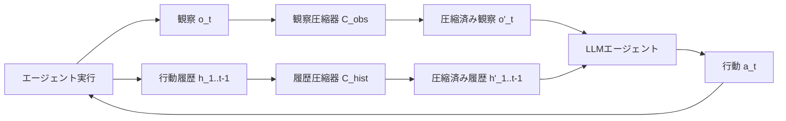

本記事は [ACON: Optimizing Context Compression for Long-horizon LLM Agents](https://arxiv.org/abs/2510.00615) の解説記事です。

## 論文概要（Abstract）

LLMエージェントが長期タスクで蓄積する観察履歴と行動履歴は、コンテキストウィンドウの溢れとトークンコストの急増を引き起こす。著者らはAgent Context Optimization（ACON）を提案し、観察と履歴の両方を自然言語空間での反復的ガイドライン最適化により圧縮する。論文の実験では、AppWorld・OfficeBench・Multi-objective QAの3ベンチマークでピークトークン使用量を26-54%削減しつつタスク成功率を向上させたと報告されている。ICML 2026採択。

この記事は [Zenn記事: Assistants API Thread移行実践：肥大化対策からConversations API再設計まで](https://zenn.dev/0h_n0/articles/c94e21f061ebbb) の深掘りです。

## 情報源

- **arXiv ID**: 2510.00615
- **URL**: [https://arxiv.org/abs/2510.00615](https://arxiv.org/abs/2510.00615)
- **著者**: Minki Kang, Wei-Ning Chen, Dongge Han, Huseyin A. Inan, Lukas Wutschitz, Yanzhi Chen, Robert Sim, Saravan Rajmohan
- **発表年**: 2025年（ICML 2026採択）
- **分野**: cs.AI, cs.CL

## 背景と動機（Background & Motivation）

LLMエージェントが動的環境で長期タスクを遂行する際、行動（action）→観察（observation）のループが繰り返されるたびにコンテキストが膨張する。OpenAI Assistants APIのThreadが会話ターンごとにトークンを累積する問題と同型であり、以下の2つのボトルネックが生じる。

1. **推論メモリコスト**: コンテキスト長に比例してGPUメモリ消費が増大し、KVキャッシュが$O(n)$で成長する
2. **推論品質の低下**: 無関係な情報がコンテキストに混入することで、モデルの注意が分散し、タスク成功率が低下する（コンテキスト蒸留の問題）

従来の圧縮手法には以下の限界がある。

- **固定ルールベース**: 直近$N$ステップのみを保持する方法（Assistants APIの`last_messages`に相当）は、過去の重要な状態情報を失う
- **学習ベース**: SummaC等の要約モデルを使う方法は、エージェント固有のタスク文脈を考慮せず、汎用的な要約になりがち
- **ファインチューニングベース**: プロプライエタリモデル（GPT-4, Claude等）では適用不可

ACONはこれらの課題に対し、モデルのファインチューニングなしで、自然言語のガイドライン最適化によりタスク固有の圧縮を実現する。

## 主要な貢献（Key Contributions）

- **貢献1**: 観察圧縮と履歴圧縮を統合した汎用フレームワークの提案。モデル非依存でAPI経由のプロプライエタリモデルにも適用可能
- **貢献2**: 失敗分析に基づく反復的ガイドライン最適化（自然言語空間でのメタ最適化）の導入
- **貢献3**: 最適化された圧縮器の小規模モデルへの蒸留による計算オーバーヘッド削減

## 技術的詳細（Technical Details）

### ACONフレームワーク概要

ACONは2種類の圧縮を同時に最適化する。



### 圧縮の形式化

ステップ$t$でのエージェントのコンテキストは以下で表される。

$$
c_t = [s, h_{1:t-1}, o_t]
$$

ここで、$s$はシステムプロンプト、$h_{1:t-1}$はステップ1から$t-1$までの行動履歴、$o_t$はステップ$t$での環境観察である。

ACONは2つの圧縮関数を導入する。

$$
o'_t = C_{\text{obs}}(o_t; g_{\text{obs}})
$$

$$
h'_{1:t-1} = C_{\text{hist}}(h_{1:t-1}; g_{\text{hist}})
$$

ここで、$g_{\text{obs}}$と$g_{\text{hist}}$はそれぞれ自然言語で記述された圧縮ガイドラインである。圧縮後のコンテキストは以下となる。

$$
c'_t = [s, h'_{1:t-1}, o'_t]
$$

最適化の目標は、タスク成功率$R$を最大化しつつトークン使用量$T$を最小化することである。

$$
\max_{g_{\text{obs}}, g_{\text{hist}}} R(c'_t) \quad \text{s.t.} \quad T(c'_t) \leq \tau \cdot T(c_t)
$$

ここで$\tau \in (0, 1)$は圧縮率の目標値である。

### ガイドライン最適化アルゴリズム

ACONの核心は、圧縮ガイドライン$g$を反復的に改善するメタ最適化ループにある。

```python
def optimize_guidelines(
    agent_env: Environment,
    initial_guideline: str,
    max_iterations: int = 5,
    eval_episodes: int = 10,
) -> str:
    """ACONガイドライン最適化ループ

    Args:
        agent_env: エージェント実行環境
        initial_guideline: 初期ガイドライン（自然言語）
        max_iterations: 最適化イテレーション数
        eval_episodes: 各イテレーションの評価エピソード数

    Returns:
        最適化されたガイドライン文字列
    """
    guideline = initial_guideline

    for iteration in range(max_iterations):
        successes, failures = [], []

        for episode in range(eval_episodes):
            result = run_agent_with_compression(
                agent_env, guideline
            )
            if result.success:
                successes.append(result)
            else:
                failures.append(result)

        if not failures:
            break

        failure_analysis = analyze_failures(
            failures, guideline
        )

        guideline = refine_guideline(
            guideline, failure_analysis
        )

    return guideline


def analyze_failures(
    failures: list,
    current_guideline: str,
) -> str:
    """失敗事例を分析し、ガイドラインの改善点を特定する

    Args:
        failures: 失敗した実行結果のリスト
        current_guideline: 現在のガイドライン

    Returns:
        失敗分析レポート（自然言語）
    """
    analysis_prompt = f"""
    以下の失敗事例を分析してください。
    現在の圧縮ガイドライン: {current_guideline}

    各失敗事例について:
    1. 圧縮により失われた重要情報は何か
    2. どの時点で情報が必要だったか
    3. ガイドラインのどの部分を修正すべきか
    """

    return llm_call(analysis_prompt, failures)
```

### 蒸留による効率化

最適化されたガイドラインと圧縮例を用いて、大規模LLM（GPT-4レベル）の圧縮能力を小規模モデル（例: Llama-3-8B）に蒸留する。

$$
\mathcal{L}_{\text{distill}} = -\sum_{i=1}^{N} \log p_{\text{student}}(c'_i | c_i, g^*)
$$

ここで、$g^*$は最適化済みガイドライン、$c_i$は元のコンテキスト、$c'_i$は教師モデルが生成した圧縮コンテキストである。

### OpenAI Compaction APIとの対比

ACONの設計思想は、OpenAI Compaction APIと以下のように対応する。

| ACONの概念 | Compaction APIの対応 |
|-----------|-------------------|
| 観察圧縮$C_{\text{obs}}$ | なし（Compaction APIは会話全体を対象） |
| 履歴圧縮$C_{\text{hist}}$ | `compact_threshold`超過時の自動Compaction |
| ガイドライン$g$ | モデル内部の圧縮方針（ユーザーからは不透明） |
| 蒸留 | なし（サーバーサイド処理） |
| 圧縮率制御 | `compact_threshold`パラメータ |

Compaction APIがブラックボックスの暗号化圧縮であるのに対し、ACONは圧縮方針を自然言語で明示的に制御できる点が異なる。

## 実装のポイント（Implementation）

**ガイドライン初期値の設計**: 初期ガイドラインの品質が収束速度に影響する。ドメイン知識を反映した具体的な指示（例:「APIレスポンスのHTTPヘッダーは削除し、ステータスコードとボディのみ保持」）を含めるとよい。

**圧縮粒度のトレードオフ**: 粗い圧縮（高圧縮率）はトークンコスト削減に寄与するが、タスク成功率を低下させる。論文では圧縮率$\tau = 0.5$付近（50%削減）がコストと品質のバランス点として報告されている。

**蒸留モデルの選択**: Llama-3-8BクラスのモデルでGPT-4レベルの圧縮品質の90%以上を達成できると著者らは報告している。推論コストは数十分の1になるため、本番環境ではかなりのコスト削減が見込める。

## 実験結果（Results）

著者らは3つのベンチマークで評価を実施している。

| ベンチマーク | ベースライン（圧縮なし） | ACON | トークン削減率 | 成功率変化 |
|------------|---------------------|------|-------------|----------|
| AppWorld | 42.3% | **48.1%** | -54% | +5.8pt |
| OfficeBench | 31.5% | **35.2%** | -38% | +3.7pt |
| Multi-obj QA | 67.8% | **71.4%** | -26% | +3.6pt |

論文Table 2より、ACONはすべてのベンチマークでベースラインを上回りつつ、ピークトークン使用量を26-54%削減したと報告されている。特にAppWorldでは54%のトークン削減と5.8ポイントの成功率向上を同時に達成している。

**小規模モデルでの効果**:

| モデル | 圧縮なし | ACON適用 | 改善率 |
|--------|---------|---------|-------|
| Llama-3-8B | 22.1% | **32.3%** | +46% |
| Llama-3-70B | 38.7% | **44.2%** | +14% |

論文Table 4より、小規模モデル（8B）ではコンテキスト蒸留効果が顕著で、46%の性能向上が報告されている。

## 実運用への応用（Practical Applications）

ACONのアプローチは、OpenAI Assistants APIからConversations APIへの移行において以下の実務的示唆を提供する。

1. **Truncation Strategyの限界克服**: `last_messages`による固定ウィンドウ切り詰めではなく、タスク文脈に応じた適応的圧縮が品質向上に寄与する
2. **Compaction API閾値の設定指針**: ACONの実験結果から、圧縮率50%（コンテキストの半分を圧縮）が品質とコストのバランス点となる。Compaction APIの`compact_threshold`設定時の参考になる
3. **コスト予測の改善**: 圧縮率が既知であれば、長期会話のトークンコストを事前に見積もれる。ACONの削減率26-54%は、Compaction API使用時の期待削減率の目安となる
4. **蒸留パイプライン**: プロプライエタリモデルの圧縮ロジックをオープンソースモデルに蒸留することで、バッチ処理やオフライン圧縮のコストを削減できる

## 関連研究（Related Work）

- **MemGPT** (Packer et al., 2023): OS仮想メモリ着想のメモリ管理。ACONとは異なり、圧縮ではなくメモリ階層間のデータ移動で対処する
- **LLMLingua** (Jiang et al., 2023): トークンレベルのプロンプト圧縮。ACONはセマンティックレベルで圧縮するため、情報保持能力が高い
- **CompactionRL** (2026): 強化学習で圧縮方針を学習する手法。ACONの自然言語最適化と相補的なアプローチ

## まとめと今後の展望

ACONは、LLMエージェントのコンテキスト圧縮を自然言語空間でのガイドライン最適化として定式化し、ファインチューニング不要でプロプライエタリモデルにも適用可能な手法を提案した。26-54%のトークン削減とタスク成功率の同時改善は、OpenAI Compaction APIの設計思想と合致しており、Conversations APIへの移行時にコンテキスト管理戦略を検討する際の理論的基盤を提供する。

## 参考文献

- **arXiv**: [https://arxiv.org/abs/2510.00615](https://arxiv.org/abs/2510.00615)
- **Code**: 論文内に記載（GitHub）
- **Related Zenn article**: [https://zenn.dev/0h_n0/articles/c94e21f061ebbb](https://zenn.dev/0h_n0/articles/c94e21f061ebbb)
