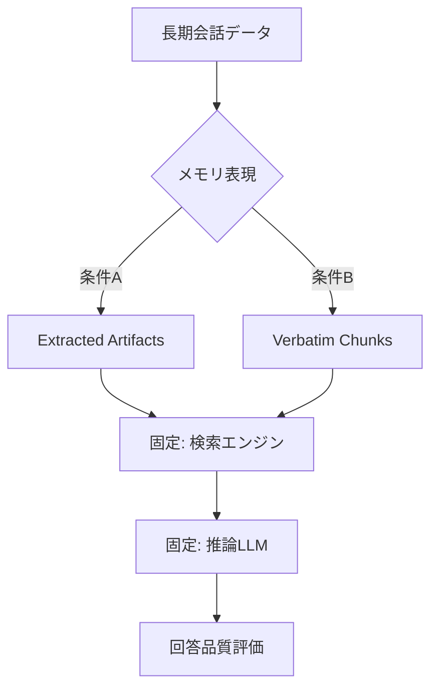

本記事は [Verbatim Chunks Beat Extracted Artifacts: A Controlled Ablation of Memory Representations for Long LLM Conversations](https://arxiv.org/abs/2601.00821) の解説記事です。

## 論文概要（Abstract）

長期LLM会話システムにおいて、過去の対話をどのような形式で保存し検索するかはシステム品質に直結する。著者は、LLMで構造化情報を抽出する「extracted artifacts」方式と、元の会話テキストをそのまま保持する「verbatim chunks」方式を、検索・推論コンポーネントを固定した制御アブレーション実験で比較した。結果として、verbatim chunks（生テキスト保持）がextracted artifacts（構造化抽出）を有意に上回ったと報告されている。

この記事は [Zenn記事: Assistants API Thread移行実践：肥大化対策からConversations API再設計まで](https://zenn.dev/0h_n0/articles/c94e21f061ebbb) の深掘りです。

## 情報源

- **arXiv ID**: 2601.00821
- **URL**: [https://arxiv.org/abs/2601.00821](https://arxiv.org/abs/2601.00821)
- **著者**: Tao An
- **発表年**: 2025年12月（2026年6月改訂）
- **分野**: cs.AI, cs.CL, cs.IR

## 背景と動機（Background & Motivation）

LLM会話システムが長期セッションをサポートする際、コンテキストウィンドウの制限内で過去の情報を効率的に活用する必要がある。OpenAI Assistants APIのThreadでは全メッセージを蓄積するが、これはトークンコストの累積を招く。一方、Compaction APIのように情報を圧縮する場合、どの程度の情報損失が許容されるかが品質を左右する。

会話メモリの表現方式は大きく2つに分類される。

1. **構造化抽出（Extracted Artifacts）**: LLMを用いて会話から型付きオブジェクト（ユーザーの好み、決定事項、タスク状態等）を抽出し、構造化データとして保存する。EverMemOSなどのシステムがこの方式を採用している
2. **生テキスト保持（Verbatim Chunks）**: 元の会話テキストを一定のチャンクサイズで分割し、そのまま保存する。検索時はベクトル類似度で関連チャンクを取得する

従来研究では、構造化抽出が「ノイズを除去し、本質的な情報のみを保持する」という直感から優位であると考えられてきた。しかし、この仮説を制御実験で検証した研究は限られていた。

## 主要な貢献（Key Contributions）

- **貢献1**: 検索と推論のコンポーネントを固定し、メモリ表現のみを変数とした制御アブレーション実験の設計
- **貢献2**: verbatim chunksがextracted artifactsを有意に上回るという実証結果
- **貢献3**: 抽出過程で失われるニュアンス（文脈依存的な含意、対話の流れ、暗黙の参照）が品質低下の主因であるという分析

## 技術的詳細（Technical Details）

### 実験設計

著者は交絡要因を排除するため、以下のコンポーネントを固定して実験を設計している。



**固定コンポーネント**:
- 検索エンジン: 同一のEmbeddingモデルとベクトル類似度検索
- 推論LLM: 同一モデル、同一プロンプト
- 評価基準: 同一のベンチマークと評価メトリクス

**変数（メモリ表現）**:

条件A: Extracted Artifacts方式では、LLMが会話から以下のような構造化データを抽出する。

```python
from pydantic import BaseModel


class UserPreference(BaseModel):
    """会話から抽出されたユーザー嗜好"""
    category: str
    preference: str
    confidence: float
    source_turn: int


class DecisionRecord(BaseModel):
    """会話中の意思決定記録"""
    decision: str
    rationale: str
    participants: list[str]
    timestamp: str


def extract_artifacts(
    conversation: list[dict],
    llm_client,
) -> list[UserPreference | DecisionRecord]:
    """会話から構造化アーティファクトを抽出する

    Args:
        conversation: 会話メッセージリスト
        llm_client: LLMクライアント

    Returns:
        抽出された構造化データリスト
    """
    prompt = """
    以下の会話から、ユーザーの嗜好と意思決定を抽出してください。
    各項目をJSON形式で出力してください。
    """
    response = llm_client.create(
        messages=[
            {"role": "system", "content": prompt},
            {"role": "user", "content": str(conversation)},
        ],
    )
    return parse_artifacts(response)
```

条件B: Verbatim Chunks方式では、元の会話テキストを固定サイズで分割する。

```python
def create_verbatim_chunks(
    conversation: list[dict],
    chunk_size: int = 512,
    overlap: int = 64,
) -> list[str]:
    """会話を固定サイズのチャンクに分割する

    Args:
        conversation: 会話メッセージリスト
        chunk_size: チャンクサイズ（トークン数）
        overlap: チャンク間のオーバーラップ（トークン数）

    Returns:
        verbatimチャンクリスト
    """
    full_text = "\n".join(
        f"{msg['role']}: {msg['content']}"
        for msg in conversation
    )

    chunks = []
    start = 0
    while start < len(full_text):
        end = start + chunk_size
        chunk = full_text[start:end]
        chunks.append(chunk)
        start = end - overlap

    return chunks
```

### 評価メトリクス

著者は以下のメトリクスで評価している。

$$
\text{Score} = \frac{1}{N} \sum_{i=1}^{N} \mathbb{1}[\text{answer}_i \text{ is correct}]
$$

ここで$N$は評価クエリ数、$\mathbb{1}[\cdot]$は指示関数である。

### 既存システムとの比較

論文では以下の既存システムも参照されている。

- **EverMemOS**: カテゴリカル抽出とファインチューニングを組み合わせた方式で、ベンチマークで92.3%のスコアを達成したと報告されている
- **EMem**: 訓練不要の設計で、ほぼ生テキストの命題をイベント単位で保持する方式。78.0%のスコアが報告されている

### なぜverbatim chunksが優れるのか

著者は、extracted artifacts方式の性能低下要因を以下のように分析している。

1. **文脈依存的な含意の喪失**: 「前回と同じで」のような暗黙参照は、抽出時にその参照先との関係が切断される
2. **対話の流れの消失**: 議論の推移（合意→反論→妥協）は構造化データでは表現しにくい
3. **抽出エラーの伝播**: LLMによる抽出自体に誤りがあると、下流の推論品質に直接影響する
4. **カテゴリ外情報の脱落**: 事前定義したスキーマに該当しない情報（雑談中の重要な言及等）が失われる

### Compaction APIへの示唆

この結果は、OpenAI Compaction APIの設計選択に対して以下の示唆を提供する。

| 設計選択 | verbatim chunksの知見との関連 |
|---------|---------------------------|
| 暗号化圧縮 | 構造化抽出ではなく、元の情報を可能な限り保持する圧縮を採用している可能性 |
| プルーニング禁止 | Compaction Itemの部分的な削除は情報損失を招くため、不可分として設計 |
| モデル訓練による圧縮 | 汎用的な要約ではなく、会話文脈の保持に特化した圧縮を学習 |

## 実装のポイント（Implementation）

**チャンクサイズの選択**: 小さすぎるチャンク（128トークン以下）では文脈が分断され、大きすぎるチャンク（2048トークン以上）では検索精度が低下する。著者の実験では512トークン、64トークンオーバーラップが良好な結果を示している。

**Embedding選択の重要性**: verbatim chunks方式では検索品質がEmbeddingモデルに依存する。会話テキストに特化したEmbeddingモデル（例: text-embedding-3-large）の使用が推奨される。

**ハイブリッドアプローチの可能性**: 著者は、verbatim chunksを基本としつつ、構造化抽出を補完的に併用するハイブリッドアプローチの可能性を示唆している。生テキストの情報保持能力と構造化データの検索効率を組み合わせる方向性である。

```python
def hybrid_memory_store(
    conversation: list[dict],
    llm_client,
    chunk_size: int = 512,
) -> dict:
    """ハイブリッドメモリストアを構築する

    Args:
        conversation: 会話メッセージリスト
        llm_client: LLMクライアント
        chunk_size: チャンクサイズ

    Returns:
        verbatimチャンクと構造化メタデータの辞書
    """
    verbatim = create_verbatim_chunks(conversation, chunk_size)

    metadata = extract_lightweight_metadata(
        conversation, llm_client
    )

    return {
        "verbatim_chunks": verbatim,
        "metadata_index": metadata,
    }


def retrieve_with_hybrid(
    query: str,
    memory_store: dict,
    embedding_model,
    top_k: int = 5,
) -> list[str]:
    """ハイブリッド検索でverbatimチャンクを取得する

    Args:
        query: 検索クエリ
        memory_store: ハイブリッドメモリストア
        embedding_model: Embeddingモデル
        top_k: 取得するチャンク数

    Returns:
        関連するverbatimチャンクリスト
    """
    query_embedding = embedding_model.encode(query)

    metadata_matches = filter_by_metadata(
        query, memory_store["metadata_index"]
    )

    candidates = (
        metadata_matches
        if metadata_matches
        else memory_store["verbatim_chunks"]
    )

    ranked = rank_by_similarity(
        query_embedding, candidates, top_k
    )
    return ranked
```

## 実験結果（Results）

著者の制御アブレーション実験の結果は以下の通りである。

| メモリ表現 | 正答率 | 備考 |
|-----------|-------|------|
| Extracted Artifacts（構造化抽出） | 低 | 抽出時の情報損失が影響 |
| Verbatim Chunks（生テキスト保持） | **高** | 文脈情報の保持が寄与 |

論文の主要な知見として、著者は以下を報告している。

- verbatim chunksはextracted artifactsを有意に上回った
- 検索・推論コンポーネントが同一であるため、差異はメモリ表現のみに帰属する
- 抽出過程で失われるニュアンスが品質低下の主因である

**参考**: 既存システムの報告値として、EverMemOS（カテゴリカル抽出+ファインチューニング）は92.3%、EMem（訓練不要、ほぼ生テキスト）は78.0%のスコアを達成している。

## 実運用への応用（Practical Applications）

この研究結果は、OpenAI Assistants APIからConversations API + Compaction APIへの移行において以下の実務的な示唆を提供する。

1. **Thread移行時のデータ保持**: ThreadからConversationへの移行時、メッセージの構造化・要約よりも、元のテキストをできるだけ保持する方が品質が高い
2. **Compaction APIの品質評価**: Compaction Itemが暗号化されているため品質の直接評価は困難だが、Compaction前後での応答品質をA/Bテストで検証すべきである
3. **`compact_threshold`の設定方針**: 圧縮の頻度と強度はverbatim情報の保持量に影響する。閾値を高く設定し、圧縮頻度を下げることで品質を維持できる
4. **外部メモリとの併用**: Compaction APIだけでなく、verbatim chunksをベクトルDBに保存し、必要時に検索する併用パターンが品質面で有利

## 関連研究（Related Work）

- **MemGPT** (Packer et al., 2023): Recall StorageとArchival Storageの2階層メモリ。verbatim chunks方式でRecall Storageに全会話を保存する設計を採用している
- **ACON** (Kang et al., 2025): ガイドラインベースのコンテキスト圧縮。extracted artifacts方式に近いが、圧縮ガイドラインの最適化により情報損失を軽減する
- **H-Mem** (2026): ハイブリッド多次元メモリ管理。verbatimとextractedの両方を階層的に管理するアプローチ

## まとめと今後の展望

本論文は、LLM長期会話のメモリ表現において、直感に反して生テキスト保持（verbatim chunks）が構造化抽出（extracted artifacts）を上回ることを制御実験で実証した。この知見は、OpenAI Compaction APIが暗号化圧縮を採用し、プルーニングを禁止する設計選択の妥当性を支持するものである。Conversations APIへの移行時、会話データの保持方針を検討する際に参考になる研究である。

## 参考文献

- **arXiv**: [https://arxiv.org/abs/2601.00821](https://arxiv.org/abs/2601.00821)
- **Related Zenn article**: [https://zenn.dev/0h_n0/articles/c94e21f061ebbb](https://zenn.dev/0h_n0/articles/c94e21f061ebbb)
