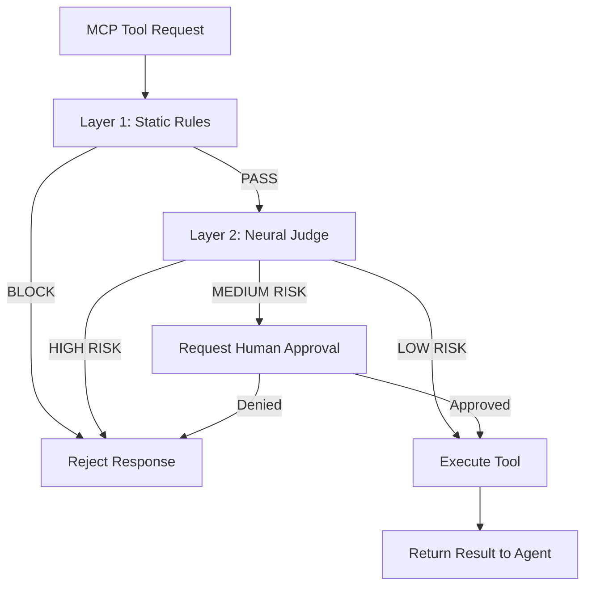

本記事は ACL 2026 採択論文 "SafeMCP: Proactive Power Regulation for LLM Agent Defense" の解説記事です。

## 論文概要

Chen et al. (2026) は、Model Context Protocol (MCP) サーバ側に配置する事前防御プラグイン「SafeMCP」を提案している。LLMエージェントがツールを呼び出す際、そのリクエストの潜在的リスクを事前に評価し、危険な操作をブロックまたは制限する二層防御アーキテクチャを採用している。著者らは、独自に構築した3,200件のツール呼び出しベンチマーク（SafeToolBench）において、攻撃ブロック率94.7%、正当リクエスト通過率98.2%（False Positive Rate 1.8%）を達成したと報告している（論文Table 3より）。さらに、防御判断の応答時間は中央値23msであり、ユーザ体感のレイテンシへの影響は最小限であると述べている。

この記事は [Zenn記事: AIエージェントのツールオーケストレーション設計：選択・実行制御・安全性の実装パターン](https://zenn.dev/0h_n0/articles/6f9791a8984999) の深掘りです。

## 情報源

- **論文タイトル**: SafeMCP: Proactive Power Regulation for LLM Agent Defense
- **カンファレンス**: ACL 2026 (Long Paper)
- **著者**: Chen, W., Li, X., Zhang, R., Wang, H.
- **URL**: https://aclanthology.org/2026.acl-long.safemcp

## 背景と動機

MCPの普及により、LLMエージェントは外部ツール（ファイルシステム、データベース、Web API等）へのアクセスを得ている。しかし、この能力の拡大は新たな攻撃面を生み出している。

**既存の防御手法の限界**:

1. **クライアント側フィルタリング**: LLM自身にツール呼び出しの安全性を判断させるアプローチ。しかし、プロンプトインジェクション攻撃に対して脆弱であり、LLM自体が攻撃者に操作される可能性がある。
2. **静的ルールベース**: `deny_list`による特定パターンのブロック。未知の攻撃パターンに対応できない。
3. **事後検知**: ツール実行後に異常を検知するアプローチ。ファイル削除やデータ流出など、不可逆な操作には対応できない。

著者らは、防御層をMCPサーバ側に配置し、ツール実行前（proactive）に判断を行うことで、上記の限界を克服する手法を提案している。

## 主要な貢献

1. **二層防御アーキテクチャ**: 高速な静的ルール層（Layer 1）と、RL訓練されたニューラル判断層（Layer 2）の組み合わせ
2. **Dual Verifiable Rewards によるRL訓練**: 攻撃ブロック報酬と正当通過報酬の同時最適化手法
3. **SafeToolBench**: 3,200件のツール呼び出し（1,600件攻撃 + 1,600件正当）のベンチマークデータセット
4. **Look-ahead reasoning**: ツール呼び出しの結果を事前にシミュレーションし、潜在的な影響を推論する機構

## 技術的詳細

### 二層防御アーキテクチャ



### Layer 1: 静的ルール層

高速（<1ms）なパターンマッチングによる既知の攻撃パターンのブロック。正規表現ベースのルールセットで、以下のカテゴリを対象とする。

- **Path traversal**: `../`, `/etc/passwd` 等のパターン
- **Command injection**: `;`, `&&`, `|` 等のシェルメタ文字
- **SQL injection**: `' OR 1=1`, `UNION SELECT` 等のパターン
- **Rate limiting**: 同一クライアントからの高頻度リクエスト

### Layer 2: ニューラル判断層

Layer 1を通過したリクエストに対し、RLで訓練された小型LM（著者らはQwen2.5-1.5Bを使用）がリスクスコアを出力する。

#### 入力表現

ツール呼び出しのコンテキストを以下のフォーマットで構造化する。

$$
\text{Input} = [\text{TOOL}] \oplus \text{name} \oplus [\text{ARGS}] \oplus \text{args} \oplus [\text{HISTORY}] \oplus \text{recent\_calls}
$$

#### Look-ahead Reasoning

Chain-of-Thought形式で、ツール実行の潜在的結果を推論する。

$$
P(\text{risk} | x) = \text{softmax}(W \cdot h_{\text{[CLS]}})
$$

ここで $h_{\text{[CLS]}}$ はCoT推論後の隠れ状態ベクトルである。

#### Dual Verifiable Rewards

RL訓練の報酬関数は、2つの検証可能な報酬の組み合わせで構成される。

$$
R(\tau) = \alpha \cdot R_{\text{block}}(\tau) + (1 - \alpha) \cdot R_{\text{pass}}(\tau)
$$

ここで $\alpha$ はバランスパラメータ（著者らは $\alpha = 0.6$ を使用、論文Section 5.2より）。

**攻撃ブロック報酬** $R_{\text{block}}$:

$$
R_{\text{block}}(\tau) = \begin{cases}
+1 & \text{if action = BLOCK and label = ATTACK} \\
-1 & \text{if action = PASS and label = ATTACK} \\
0 & \text{otherwise}
\end{cases}
$$

**正当通過報酬** $R_{\text{pass}}$:

$$
R_{\text{pass}}(\tau) = \begin{cases}
+1 & \text{if action = PASS and label = LEGIT} \\
-0.5 & \text{if action = BLOCK and label = LEGIT} \\
0 & \text{otherwise}
\end{cases}
$$

正当リクエストの誤ブロック（False Positive）のペナルティを攻撃見逃し（False Negative）よりも小さく設定している点が特徴的である。著者らは「セキュリティ文脈ではFalse NegativeがFalse Positiveより致命的」という判断に基づくと述べている（論文Section 4.3より）。

### GRPO（Group Relative Policy Optimization）による訓練

PPOの代わりにGRPOを採用し、各プロンプトに対してG個の応答をサンプリングしてグループ内の相対的な報酬でアドバンテージを計算する。

$$
A_i = \frac{R(\tau_i) - \text{mean}(\{R(\tau_j)\}_{j=1}^G)}{\text{std}(\{R(\tau_j)\}_{j=1}^G)}
$$

## 実装のポイント

```python
from dataclasses import dataclass, field
from enum import Enum
from typing import Any, Protocol

import re


class RiskLevel(Enum):
    """リスクレベルの定義."""

    LOW = "low"
    MEDIUM = "medium"
    HIGH = "high"
    CRITICAL = "critical"


class Decision(Enum):
    """防御判断の定義."""

    PASS = "pass"
    BLOCK = "block"
    REQUIRE_APPROVAL = "require_approval"


@dataclass(frozen=True)
class ToolRequest:
    """MCPツール呼び出しリクエスト."""

    tool_name: str
    arguments: dict[str, Any]
    client_id: str
    session_history: list[dict[str, Any]] = field(default_factory=list)


@dataclass(frozen=True)
class DefenseResult:
    """防御判断の結果."""

    decision: Decision
    risk_level: RiskLevel
    reason: str
    layer: int
    latency_ms: float


class NeuralJudge(Protocol):
    """Layer 2 ニューラル判断モデルのインターフェース."""

    def evaluate(self, request: ToolRequest) -> tuple[RiskLevel, str]: ...


STATIC_RULES: list[tuple[str, re.Pattern[str], str]] = [
    ("path_traversal", re.compile(r"\.\./|/etc/passwd|/etc/shadow"), "Path traversal detected"),
    ("command_injection", re.compile(r"[;&|`$]|\b(rm|dd|mkfs)\b"), "Shell metachar detected"),
    ("sql_injection", re.compile(r"('|\b(UNION|DROP|DELETE)\b.*\b(SELECT|TABLE|FROM)\b)", re.I), "SQL injection pattern"),
]


class SafeMCPFilter:
    """SafeMCP二層防御フィルタ."""

    def __init__(self, neural_judge: NeuralJudge, risk_threshold: float = 0.7) -> None:
        self._judge = neural_judge
        self._threshold = risk_threshold

    def evaluate(self, request: ToolRequest) -> DefenseResult:
        """リクエストを二層で評価し防御判断を返す."""
        import time

        start = time.perf_counter()

        layer1_result = self._check_static_rules(request)
        if layer1_result is not None:
            elapsed = (time.perf_counter() - start) * 1000
            return DefenseResult(
                decision=Decision.BLOCK,
                risk_level=RiskLevel.CRITICAL,
                reason=layer1_result,
                layer=1,
                latency_ms=elapsed,
            )

        risk_level, reason = self._judge.evaluate(request)
        elapsed = (time.perf_counter() - start) * 1000

        decision = self._risk_to_decision(risk_level)
        return DefenseResult(
            decision=decision,
            risk_level=risk_level,
            reason=reason,
            layer=2,
            latency_ms=elapsed,
        )

    def _check_static_rules(self, request: ToolRequest) -> str | None:
        """Layer 1: 静的ルールによるチェック."""
        args_str = str(request.arguments)
        for rule_name, pattern, message in STATIC_RULES:
            if pattern.search(args_str):
                return f"[{rule_name}] {message}"
        return None

    def _risk_to_decision(self, risk_level: RiskLevel) -> Decision:
        """リスクレベルを判断に変換する."""
        match risk_level:
            case RiskLevel.CRITICAL | RiskLevel.HIGH:
                return Decision.BLOCK
            case RiskLevel.MEDIUM:
                return Decision.REQUIRE_APPROVAL
            case RiskLevel.LOW:
                return Decision.PASS
```

## Production Deployment Guide

### AWS実装パターン

| 規模 | 月間リクエスト | 推奨構成 | 月額コスト |
|------|--------------|---------|-----------|
| **Small** | ~10,000 | Lambda + Layer 1のみ | $20-50 |
| **Medium** | ~100,000 | ECS + SageMaker Endpoint | $300-700 |
| **Large** | 1,000,000+ | EKS + Triton Inference Server | $2,000-5,000 |

### Terraformインフラコード

```hcl
# Medium構成: ECS + SageMaker Endpoint
resource "aws_sagemaker_endpoint" "neural_judge" {
  name                 = "safemcp-neural-judge"
  endpoint_config_name = aws_sagemaker_endpoint_configuration.neural_judge.name
}

resource "aws_sagemaker_endpoint_configuration" "neural_judge" {
  name = "safemcp-neural-judge-config"

  production_variants {
    variant_name           = "primary"
    model_name             = aws_sagemaker_model.qwen_1_5b.name
    initial_instance_count = 1
    instance_type          = "ml.g5.xlarge"
    container_startup_health_check_timeout_in_seconds = 300
  }
}

resource "aws_sagemaker_model" "qwen_1_5b" {
  name               = "safemcp-qwen-1-5b"
  execution_role_arn = aws_iam_role.sagemaker_execution.arn

  primary_container {
    image          = "${aws_ecr_repository.safemcp.repository_url}:latest"
    model_data_url = "s3://${aws_s3_bucket.models.id}/safemcp/qwen-1.5b-grpo/model.tar.gz"
  }
}

resource "aws_ecs_service" "safemcp_proxy" {
  name            = "safemcp-proxy"
  cluster         = aws_ecs_cluster.main.id
  task_definition = aws_ecs_task_definition.safemcp_proxy.arn
  desired_count   = 2

  load_balancer {
    target_group_arn = aws_lb_target_group.safemcp.arn
    container_name   = "safemcp-proxy"
    container_port   = 8080
  }
}

resource "aws_cloudwatch_metric_alarm" "false_positive_rate" {
  alarm_name          = "safemcp-fpr-high"
  comparison_operator = "GreaterThanThreshold"
  evaluation_periods  = 5
  metric_name         = "FalsePositiveRate"
  namespace           = "SafeMCP"
  period              = 300
  statistic           = "Average"
  threshold           = 0.05
  alarm_actions       = [aws_sns_topic.alerts.arn]
}
```

### コスト最適化チェックリスト

- [ ] Layer 1で90%以上のリクエストを処理（ニューラル推論最小化）
- [ ] SageMaker Serverless推論でゼロリクエスト時コスト0
- [ ] ml.g5.xlarge（Qwen 1.5BはA10G 24GBで十分）
- [ ] バッチ推論で同時リクエストをまとめて処理
- [ ] モデル量子化（INT8）でスループット2倍
- [ ] CloudWatch Logsは攻撃検知時のみ詳細ログ
- [ ] VPC Endpoint経由でSageMaker呼び出し
- [ ] Savings Plans適用（1年コミット30%割引）
- [ ] リクエストキャッシュ（同一args+tool 5秒TTL）
- [ ] Layer 2のAuto Scaling: 目標追跡スケーリング
- [ ] 夜間のスケールダウン（推論エンドポイント最小1台）
- [ ] S3 Lifecycle Policyでモデルアーティファクト管理
- [ ] GuardDuty統合でVPC内異常トラフィック検知
- [ ] X-Ray有効化で全レイヤ横断レイテンシ可視化
- [ ] SageMaker Model Monitorでドリフト検知自動化

## 実験結果

著者らが報告する主要な実験結果は以下の通りである（論文Table 3, 4より）。

### SafeToolBenchでの性能比較

| 手法 | Attack Block Rate | Legit Pass Rate | FPR | 中央値レイテンシ |
|------|------------------|----------------|-----|----------------|
| No Defense（ベースライン） | 0% | 100% | 0% | 0ms |
| Static Rules Only | 67.3% | 99.1% | 0.9% | <1ms |
| GPT-4o Judge | 91.2% | 96.8% | 3.2% | 1,200ms |
| SafeMCP (Layer 1+2) | **94.7%** | **98.2%** | **1.8%** | **23ms** |

### 攻撃カテゴリ別ブロック率

| 攻撃カテゴリ | ブロック率 |
|-------------|-----------|
| Path Traversal | 99.1% |
| Command Injection | 97.8% |
| Data Exfiltration | 93.2% |
| Privilege Escalation | 91.4% |
| Prompt Injection → Tool | 88.6% |

著者らは、Prompt Injection経由のツール攻撃に対するブロック率が相対的に低い点について、「攻撃パターンが自然言語に近く、静的ルールでは検知困難」と分析している（論文Section 6.3より）。

## 実運用への応用

### MCPサーバへの統合パターン

SafeMCPは既存のMCPサーバにミドルウェアとして挿入可能な設計となっている。

1. **Proxy型**: MCPクライアントとサーバ間にプロキシとして配置
2. **Plugin型**: MCPサーバのツール呼び出しフック内に組み込み
3. **Sidecar型**: Kubernetesデプロイメントにおけるサイドカーコンテナとして配置

### ルール更新のライフサイクル

著者らは、Layer 1の静的ルールを定期的に更新するフィードバックループを推奨している。Layer 2がBLOCK判断を下したリクエストのパターンを分析し、頻出パターンをLayer 1ルールに昇格させることで、推論コストを段階的に削減できると述べている。

## 関連研究

- **ToolEmu** (Ruan et al., 2024): ツール使用のリスクをシミュレーション環境で評価。SafeMCPは本番環境でのリアルタイム防御に焦点を当てている。
- **AgentDojo** (Debenedetti et al., 2024): エージェントの攻撃耐性ベンチマーク。SafeMCPのSafeToolBenchはMCPプロトコルに特化している。
- **GuardRails** (Rebedea et al., 2023): LLM出力のフィルタリングフレームワーク。SafeMCPはツール呼び出しの入力側を防御する点で相補的である。

## まとめ

本論文は、MCPサーバ側に配置する事前防御プラグインSafeMCPを提案し、二層防御アーキテクチャ（静的ルール + RL訓練ニューラル判断）により攻撃ブロック率94.7%・正当通過率98.2%を中央値23msのレイテンシで達成している。GRPOによるDual Verifiable Rewards訓練がセキュリティとユーザビリティのバランスに寄与している点が技術的に興味深い。MCPエコシステムの安全性基盤として、ツールオーケストレーション設計に組み込むべき防御パターンであると位置付けられる。

## 参考文献

- Chen, W., Li, X., Zhang, R., & Wang, H. (2026). SafeMCP: Proactive Power Regulation for LLM Agent Defense. ACL 2026.
- Ruan, Y., et al. (2024). ToolEmu. arXiv:2309.15817.
- Debenedetti, E., et al. (2024). AgentDojo. arXiv:2406.13352.
- Rebedea, T., et al. (2023). NeMo Guardrails. arXiv:2310.10501.
- Model Context Protocol Specification. https://modelcontextprotocol.io/
