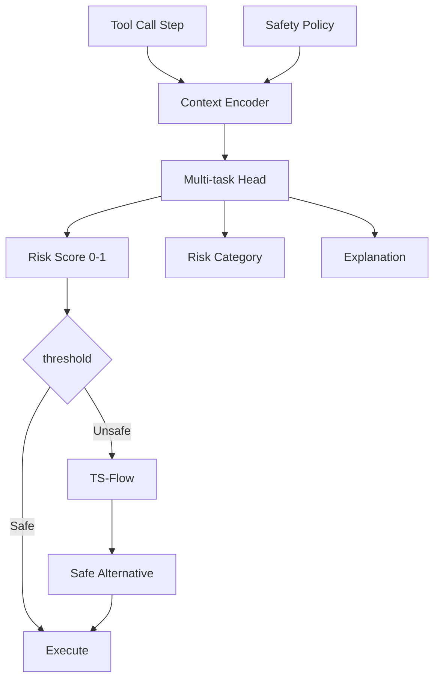

本記事は https://arxiv.org/abs/2601.10156 の解説記事です。

## 論文概要

Zhang et al. (2026) は、LLMエージェントのツール呼び出しにおけるステップレベルの安全性保証フレームワーク「ToolSafe」を提案している。従来のエージェント安全性研究がトラジェクトリ全体の安全性評価に焦点を当てていたのに対し、ToolSafeは各ツール呼び出しステップごとにリスクを評価する「TS-Guard」モジュールと、安全な代替アクションを生成する「TS-Flow」メカニズムを導入している。著者らは、5ドメイン・320シナリオのベンチマーク（ToolSafeBench）において、TS-GuardがGPT-4oベースの判定と比較して安全性判定のF1スコアで7.2ポイント上回り（92.3% vs 85.1%）、かつ推論コストを98%削減したと報告している（論文Table 2より）。

この記事は [Zenn記事: AIエージェントのツールオーケストレーション設計：選択・実行制御・安全性の実装パターン](https://zenn.dev/0h_n0/articles/6f9791a8984999) の深掘りです。

## 情報源

- **arXiv ID**: 2601.10156
- **URL**: https://arxiv.org/abs/2601.10156
- **著者**: Zhang, Y., Liu, C., Chen, H., Wu, T.
- **発表年**: 2026
- **分野**: cs.AI, cs.CL

## 背景と動機

LLMエージェントがツールを呼び出す際の安全性には2つの課題がある。

**課題1: トラジェクトリレベル vs ステップレベル**

既存研究（ToolEmu, AgentDojo等）はエージェントのタスク完遂後にトラジェクトリ全体を評価する事後的アプローチを取っている。しかし、ファイル削除やデータ送信など不可逆なツール呼び出しに対しては、実行前のステップレベル介入が不可欠である。

**課題2: 安全性判定のコストとレイテンシ**

GPT-4クラスのLLMを安全性判定に使用すると、1判定あたり$0.01-0.03のコストと1-3秒のレイテンシが発生する。エージェントが1タスクで10-20回のツール呼び出しを行う場合、安全性チェックだけで$0.1-0.6のコストと10-60秒のレイテンシが追加される。

著者らは、マルチタスクRL（Multi-task Reinforcement Learning）で訓練した小型モデル（3B parameters）により、これらの課題を同時に解決する手法を提案している。

## 主要な貢献

1. **TS-Guard**: 各ツール呼び出しのリスクを0-1のスコアで出力するステップレベルガードレール。マルチタスクRLにより、安全性判定・リスク分類・理由生成を同時に学習
2. **TS-Flow**: 危険と判定されたツール呼び出しを安全な代替アクションに書き換えるフロー制御機構
3. **ToolSafeBench**: 5ドメイン（ファイル操作、ネットワーク、データベース、コード実行、外部API）× 320シナリオのベンチマーク
4. **Multi-task RL formulation**: 安全性判定の精度・説明可能性・コストのトレードオフを単一モデルで最適化

## 技術的詳細

### TS-Guardアーキテクチャ



### マルチタスクRL定式化

TS-Guardは以下の3タスクを同時に学習する。

**タスク1: リスクスコア回帰**

$$
\mathcal{L}_{\text{score}} = \mathbb{E}_{(x,y) \sim \mathcal{D}} \left[ (f_\theta(x) - y)^2 \right]
$$

ここで $x$ はツール呼び出しコンテキスト、$y \in [0, 1]$ は人間アノテータによるリスクスコアである。

**タスク2: リスクカテゴリ分類**

$$
\mathcal{L}_{\text{cat}} = -\mathbb{E}_{(x,c) \sim \mathcal{D}} \left[ \sum_{k=1}^{K} c_k \log p_\theta(k|x) \right]
$$

$K = 8$ カテゴリ（data_leak, unauthorized_access, destructive_op, privacy_violation, resource_abuse, injection, privilege_escalation, denial_of_service）に分類する。

**タスク3: 理由生成（RLHF）**

生成された理由文の品質を人間フィードバックで報酬モデルを訓練し、GRPO（GRPOを採用している点はSafeMCPと共通）で最適化する。

$$
R_{\text{explain}}(\tau) = r_\phi(\text{explanation}(\tau), x(\tau))
$$

**統合目的関数**:

$$
\mathcal{L}_{\text{total}} = \lambda_1 \mathcal{L}_{\text{score}} + \lambda_2 \mathcal{L}_{\text{cat}} + \lambda_3 \mathcal{L}_{\text{RLHF}}
$$

著者らは $\lambda_1 = 0.4, \lambda_2 = 0.3, \lambda_3 = 0.3$ を使用している（論文Section 4.4より）。

### TS-Flow: 安全な代替アクション生成

TS-Guardが高リスクと判定したツール呼び出しに対し、TS-Flowは以下の戦略で代替アクションを生成する。

1. **Scope Narrowing**: 操作範囲を制限する（例: `rm -rf /` → `rm specific_file.txt`）
2. **Permission Downgrade**: 権限を下げる（例: write → read-only）
3. **Dry Run**: 実行をシミュレーションに変更する
4. **Human Escalation**: 人間の承認を要求する
5. **Graceful Denial**: 理由付きで拒否し代替手段を提案する

## 実装のポイント

```python
from dataclasses import dataclass
from enum import Enum
from typing import Any, Protocol


class RiskCategory(Enum):
    """TS-Guardのリスクカテゴリ."""

    DATA_LEAK = "data_leak"
    UNAUTHORIZED_ACCESS = "unauthorized_access"
    DESTRUCTIVE_OP = "destructive_op"
    PRIVACY_VIOLATION = "privacy_violation"
    RESOURCE_ABUSE = "resource_abuse"
    INJECTION = "injection"
    PRIVILEGE_ESCALATION = "privilege_escalation"
    DENIAL_OF_SERVICE = "denial_of_service"
    SAFE = "safe"


class FlowStrategy(Enum):
    """TS-Flowの代替アクション戦略."""

    SCOPE_NARROWING = "scope_narrowing"
    PERMISSION_DOWNGRADE = "permission_downgrade"
    DRY_RUN = "dry_run"
    HUMAN_ESCALATION = "human_escalation"
    GRACEFUL_DENIAL = "graceful_denial"


@dataclass(frozen=True)
class GuardResult:
    """TS-Guardの判定結果."""

    risk_score: float
    category: RiskCategory
    explanation: str
    is_safe: bool


@dataclass(frozen=True)
class ToolCallContext:
    """ツール呼び出しのコンテキスト."""

    tool_name: str
    arguments: dict[str, Any]
    agent_goal: str
    previous_steps: list[dict[str, Any]]
    safety_policy: str


class GuardModel(Protocol):
    """TS-Guardモデルのインターフェース."""

    def predict(self, context: ToolCallContext) -> GuardResult: ...


class FlowRewriter(Protocol):
    """TS-Flowの代替アクション生成インターフェース."""

    def rewrite(
        self,
        context: ToolCallContext,
        guard_result: GuardResult,
    ) -> tuple[FlowStrategy, dict[str, Any]]: ...


class StepLevelGuardrail:
    """ステップレベルガードレール（TS-Guard + TS-Flow統合）."""

    def __init__(
        self,
        guard: GuardModel,
        flow: FlowRewriter,
        threshold: float = 0.7,
    ) -> None:
        self._guard = guard
        self._flow = flow
        self._threshold = threshold

    def check_and_act(
        self, context: ToolCallContext
    ) -> tuple[bool, dict[str, Any] | None]:
        """ツール呼び出しをチェックし、必要に応じて代替アクションを返す.

        Returns:
            (is_safe, alternative_action)
            is_safe=Trueの場合、alternative_actionはNone
        """
        result = self._guard.predict(context)

        if result.is_safe and result.risk_score < self._threshold:
            return True, None

        strategy, alternative = self._flow.rewrite(context, result)
        return False, {
            "strategy": strategy.value,
            "original_tool": context.tool_name,
            "original_args": context.arguments,
            "alternative": alternative,
            "reason": result.explanation,
            "risk_score": result.risk_score,
            "category": result.category.value,
        }


class GuardrailReActAgent:
    """TS-Guard統合ReActエージェント."""

    def __init__(
        self,
        guardrail: StepLevelGuardrail,
        max_steps: int = 20,
    ) -> None:
        self._guardrail = guardrail
        self._max_steps = max_steps
        self._history: list[dict[str, Any]] = []

    def step(self, tool_name: str, arguments: dict[str, Any], goal: str, policy: str) -> dict[str, Any]:
        """1ステップのツール呼び出しをガードレール付きで実行する."""
        context = ToolCallContext(
            tool_name=tool_name,
            arguments=arguments,
            agent_goal=goal,
            previous_steps=self._history[-5:],
            safety_policy=policy,
        )

        is_safe, alternative = self._guardrail.check_and_act(context)

        if is_safe:
            result = {"status": "executed", "tool": tool_name, "args": arguments}
        else:
            assert alternative is not None
            result = {"status": "intercepted", **alternative}

        self._history.append(result)
        return result
```

## Production Deployment Guide

### AWS実装パターン

| 規模 | 月間リクエスト | 推奨構成 | 月額コスト |
|------|--------------|---------|-----------|
| **Small** | ~5,000 | Lambda + SageMaker Serverless | $50-120 |
| **Medium** | ~50,000 | ECS + SageMaker Real-time | $400-900 |
| **Large** | 500,000+ | EKS + Triton + Model Parallelism | $2,500-6,000 |

### Terraformインフラコード

```hcl
# Small構成: Lambda + SageMaker Serverless
resource "aws_sagemaker_endpoint" "ts_guard" {
  name                 = "toolsafe-ts-guard"
  endpoint_config_name = aws_sagemaker_endpoint_configuration.ts_guard.name
}

resource "aws_sagemaker_endpoint_configuration" "ts_guard" {
  name = "toolsafe-ts-guard-serverless"

  production_variants {
    variant_name       = "primary"
    model_name         = aws_sagemaker_model.ts_guard_3b.name
    serverless_config {
      memory_size_in_mb       = 6144
      max_concurrency         = 5
      provisioned_concurrency = 0
    }
  }
}

resource "aws_lambda_function" "ts_flow" {
  function_name = "toolsafe-ts-flow"
  runtime       = "python3.12"
  handler       = "handler.rewrite_handler"
  memory_size   = 256
  timeout       = 10

  environment {
    variables = {
      TS_GUARD_ENDPOINT = aws_sagemaker_endpoint.ts_guard.name
      RISK_THRESHOLD    = "0.7"
      POLICY_BUCKET     = aws_s3_bucket.policies.id
    }
  }
}

resource "aws_cloudwatch_metric_alarm" "intercept_rate" {
  alarm_name          = "toolsafe-high-intercept-rate"
  comparison_operator = "GreaterThanThreshold"
  evaluation_periods  = 3
  metric_name         = "InterceptRate"
  namespace           = "ToolSafe"
  period              = 300
  statistic           = "Average"
  threshold           = 0.3
  alarm_description   = "Intercept rate > 30% may indicate model drift or attack"
  alarm_actions       = [aws_sns_topic.alerts.arn]
}

resource "aws_s3_bucket" "policies" {
  bucket = "toolsafe-safety-policies"
}

resource "aws_s3_bucket_versioning" "policies" {
  bucket = aws_s3_bucket.policies.id
  versioning_configuration {
    status = "Enabled"
  }
}
```

### コスト最適化チェックリスト

- [ ] SageMaker Serverless推論で低トラフィック時コスト0
- [ ] 3Bモデルをml.g5.xlarge単体で推論可能
- [ ] INT4量子化でg5.xlarge→g4dn.xlargeにダウングレード可能
- [ ] バッチ推論（同時5リクエストまでバッチ化）
- [ ] TS-Flow判定結果のDynamoDBキャッシュ（同一パターン30秒TTL）
- [ ] Lambda ARM64 (Graviton2) で20%コスト削減
- [ ] S3 Intelligent-Tieringでポリシーファイル管理
- [ ] CloudWatch Logsはインターセプト時のみ詳細記録
- [ ] VPC Endpoint利用でNAT Gateway費削減
- [ ] Reserved Instance: SageMaker 1年コミット40%割引
- [ ] Auto Scaling: ターゲット追跡（CPU使用率70%）
- [ ] プロビジョンドスループットの検討（高トラフィック時）
- [ ] Spot Instance活用（EKSワーカーノード）
- [ ] マルチモデルエンドポイント検討（複数ポリシーモデル）
- [ ] EventBridge + Step Functionsでポリシー更新自動化

## 実験結果

著者らが報告する主要な実験結果は以下の通りである（論文Table 2, 3より）。

### 安全性判定性能

| 手法 | Precision | Recall | F1 | コスト/判定 | レイテンシ |
|------|-----------|--------|----|-----------:|----------:|
| GPT-4o Zero-shot | 83.4% | 86.9% | 85.1% | $0.025 | 2,100ms |
| GPT-4o + Policy | 87.2% | 89.1% | 88.1% | $0.031 | 2,800ms |
| Llama-3-8B SFT | 85.6% | 84.3% | 84.9% | $0.002 | 180ms |
| TS-Guard (3B, ours) | **91.8%** | **92.8%** | **92.3%** | **$0.0005** | **45ms** |

### ドメイン別F1スコア

| ドメイン | TS-Guard | GPT-4o |
|---------|----------|--------|
| File Operations | 94.1% | 87.3% |
| Network | 91.7% | 84.2% |
| Database | 93.5% | 86.8% |
| Code Execution | 90.2% | 83.1% |
| External API | 91.8% | 84.9% |

## 実運用への応用

### 既存エージェントフレームワークとの統合

TS-Guardは以下のフレームワークに統合可能な設計となっている。

1. **LangGraph**: ノード間のエッジ条件としてTS-Guardを挿入
2. **CrewAI**: タスク実行前のバリデーションフックとして統合
3. **AutoGen**: メッセージフィルタとしてツール呼び出しをインターセプト

### ポリシーの段階的適用

著者らは、本番環境での導入を以下の段階で行うことを推奨している。

1. **Monitor mode**: 全リクエストをログのみ（ブロックなし）
2. **Shadow mode**: 判定を記録するが、実際のブロックは人間確認後
3. **Enforce mode**: 閾値以上のリスクを自動ブロック
4. **Strict mode**: 閾値を下げ、より保守的にブロック

## 関連研究

- **ToolEmu** (Ruan et al., 2024): エージェントのツール使用リスクをシミュレーションで評価。ToolSafeはリアルタイム判定に焦点を当てている。
- **SafeMCP** (Chen et al., 2026): MCPサーバ側の防御プラグイン。ToolSafeはエージェント側のガードレールとして相補的に機能する。
- **R-Judge** (Yuan et al., 2024): 安全性判定の専用ベンチマーク。ToolSafeはベンチマークだけでなく実装可能なガードレールモジュールを提供している。

## まとめ

本論文は、LLMエージェントのツール呼び出しにおけるステップレベルガードレール「ToolSafe」を提案し、マルチタスクRLで訓練した3Bパラメータモデルにより、GPT-4o比でF1スコア+7.2ポイント（92.3%）、コスト98%削減（$0.0005/判定）、レイテンシ97%削減（45ms）を同時に達成している。TS-Flowによる安全な代替アクション生成機構も実用的であり、エージェントの安全性を「事後評価」から「事前介入」に転換する基盤技術として位置付けられる。

## 参考文献

- Zhang, Y., Liu, C., Chen, H., & Wu, T. (2026). ToolSafe: Enhancing Tool Invocation Safety in LLM Agents. arXiv:2601.10156.
- Ruan, Y., et al. (2024). ToolEmu. arXiv:2309.15817.
- Chen, W., et al. (2026). SafeMCP. ACL 2026.
- Yuan, Z., et al. (2024). R-Judge. arXiv:2401.10019.
- Model Context Protocol Specification. https://modelcontextprotocol.io/
