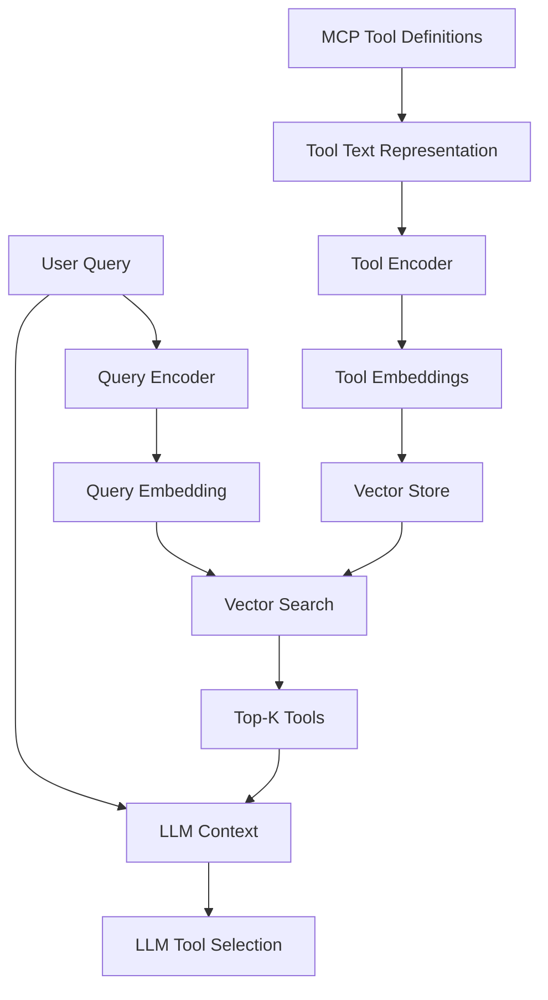

本記事は https://arxiv.org/abs/2603.20313 の解説記事です。

## 論文概要

Mudunuri et al. (2026) は、LLMエージェントが利用可能なツール数の増加に伴うトークン消費とレイテンシの問題に対し、ベクトル検索ベースのセマンティックツール発見手法を提案している。Model Context Protocol (MCP) のツール定義をdense embeddingでインデックス化し、ユーザクエリとのコサイン類似度に基づいてK個のツールを動的に選択する。著者らは、5つのMCPサーバから収集した121ツール・140クエリのベンチマークにおいて、K=3でヒット率97.1%、Mean Reciprocal Rank (MRR) 0.91、トークン消費99.6%削減、検索レイテンシ100ms未満を達成したと報告している。

この記事は [Zenn記事: AIエージェントのツールオーケストレーション設計：選択・実行制御・安全性の実装パターン](https://zenn.dev/0h_n0/articles/6f9791a8984999) の深掘りです。

## 情報源

- **arXiv ID**: 2603.20313
- **URL**: https://arxiv.org/abs/2603.20313
- **著者**: Mudunuri, S., Wan, J., Qin, A., Manoharan, S.
- **発表年**: 2026
- **分野**: cs.CL, cs.AI

## 背景と動機

LLMベースのエージェントシステムにおけるツール利用は、Function CallingやMCPの普及により急速に拡大している。しかし、利用可能なツール数が増加すると以下の問題が生じる。

**トークン消費の爆発**: 全ツールの定義（名前、説明、パラメータスキーマ）をプロンプトに含めると、ツール数に比例してトークン消費が増大する。著者らの実験では、121ツールの全定義をプロンプトに含めた場合、1リクエストあたり約25,000トークンがツール定義だけで消費されると報告している（論文Section 3.1より）。

**コンテキストウィンドウの圧迫**: ツール定義がコンテキストウィンドウを占有することで、実際のタスク遂行に使える容量が減少する。

**選択精度の低下**: ツール数が増えるほど、LLMが適切なツールを選択する精度が低下する傾向がある。

従来のアプローチとしては、(1) ツール定義の静的フィルタリング、(2) カテゴリベースの階層的選択、(3) few-shotによるツール選択の学習 が存在するが、いずれもセマンティックな類似性を十分に捉えられていない。本論文は、embedding空間でのベクトル検索により、ユーザの意図とツールの機能を意味的にマッチングさせる手法を提案している。

## 主要な貢献

著者らが主張する貢献は以下の4点である（論文Section 1より）。

1. **MCPツールのベクトルインデックス化手法**: ツール名、説明文、パラメータスキーマを統合したテキスト表現からdense embeddingを生成し、ベクトルストアにインデックス化する方法論
2. **セマンティック検索によるツール選択パイプライン**: ユーザクエリのembeddingとツールembeddingのコサイン類似度に基づくランキング手法
3. **121ツール・140クエリのベンチマークデータセット**: 5つのMCPサーバ（filesystem, database, web, code-execution, communication）から収集した評価用データセット
4. **プロダクション環境での実用性の実証**: sub-100msレイテンシとトークン消費99.6%削減の同時達成

## 技術的詳細

### アーキテクチャ



### ツールテキスト表現の構成

各MCPツールの定義から、以下の要素を連結したテキスト表現を生成する（論文Section 4.1より）。

$$
\text{ToolText}(t) = \text{name}(t) \oplus \text{desc}(t) \oplus \text{params}(t)
$$

ここで $\oplus$ はテキスト連結演算子を表す。

### Embedding生成とインデックス化

ツールテキスト表現をembeddingモデル $E$ に入力し、$d$ 次元のdense vectorを生成する。

$$
\mathbf{v}_t = E(\text{ToolText}(t)) \in \mathbb{R}^d
$$

著者らはOpenAI text-embedding-3-small（$d = 1536$）を使用している（論文Section 5.1より）。

### クエリ時のセマンティック検索

ユーザクエリ $q$ に対して、同一のembeddingモデルでクエリベクトルを生成する。

$$
\mathbf{v}_q = E(q) \in \mathbb{R}^d
$$

各ツール $t_i$ との類似度をコサイン類似度で計算する。

$$
\text{sim}(q, t_i) = \frac{\mathbf{v}_q \cdot \mathbf{v}_{t_i}}{|\mathbf{v}_q| \cdot |\mathbf{v}_{t_i}|}
$$

類似度スコアの上位K個のツールを選択する。

$$
\text{TopK}(q) = \underset{S \subseteq \mathcal{T}, |S|=K}{\arg\max} \sum_{t \in S} \text{sim}(q, t)
$$

### 評価指標

**Hit Rate@K**: 正解ツールがTop-K内に含まれる割合。

$$
\text{HitRate@K} = \frac{1}{|Q|} \sum_{q \in Q} \mathbb{1}[\text{correct}(q) \in \text{TopK}(q)]
$$

**Mean Reciprocal Rank (MRR)**: 正解ツールの順位の逆数の平均。

$$
\text{MRR} = \frac{1}{|Q|} \sum_{q \in Q} \frac{1}{\text{rank}(q)}
$$

## 実装のポイント

```python
from dataclasses import dataclass
from typing import Any, Protocol

import numpy as np


@dataclass(frozen=True)
class MCPToolDefinition:
    """MCP Tool定義の構造化表現."""

    name: str
    description: str
    parameters: dict[str, Any]

    def to_text_representation(self) -> str:
        """ベクトル化のためのテキスト表現を生成する."""
        param_parts: list[str] = []
        properties = self.parameters.get("properties", {})
        for param_name, param_schema in properties.items():
            param_type = param_schema.get("type", "any")
            param_desc = param_schema.get("description", "")
            param_parts.append(f"{param_name}: {param_type} - {param_desc}")
        params_text = ", ".join(param_parts) if param_parts else "none"
        return f"Tool: {self.name}\nDescription: {self.description}\nParameters: {params_text}"


class EmbeddingModel(Protocol):
    """Embeddingモデルのインターフェース."""

    def encode(self, text: str) -> np.ndarray: ...


@dataclass
class ToolEmbeddingIndex:
    """ツールembeddingのインデックス管理."""

    embeddings: np.ndarray
    tools: list[MCPToolDefinition]

    def search(self, query_embedding: np.ndarray, k: int = 3) -> list[tuple[MCPToolDefinition, float]]:
        """コサイン類似度によるTop-K検索."""
        query_norm = query_embedding / np.linalg.norm(query_embedding)
        tool_norms = self.embeddings / np.linalg.norm(self.embeddings, axis=1, keepdims=True)
        similarities = tool_norms @ query_norm
        top_k_indices = np.argsort(similarities)[::-1][:k]
        return [(self.tools[i], float(similarities[i])) for i in top_k_indices]


class SemanticToolDiscovery:
    """セマンティックツール発見パイプライン."""

    def __init__(self, embedding_model: EmbeddingModel, threshold: float = 0.3) -> None:
        self._model = embedding_model
        self._threshold = threshold
        self._index: ToolEmbeddingIndex | None = None

    def build_index(self, tools: list[MCPToolDefinition]) -> None:
        """ツール定義からembeddingインデックスを構築する."""
        embeddings = np.array([
            self._model.encode(tool.to_text_representation()) for tool in tools
        ])
        self._index = ToolEmbeddingIndex(embeddings=embeddings, tools=tools)

    def discover(self, query: str, k: int = 3) -> list[tuple[MCPToolDefinition, float]]:
        """クエリに対して最も関連するツールをK個返す."""
        if self._index is None:
            raise RuntimeError("Index not built. Call build_index() first.")
        query_embedding = self._model.encode(query)
        results = self._index.search(query_embedding, k=k)
        return [(tool, score) for tool, score in results if score >= self._threshold]
```

## Production Deployment Guide

### AWS実装パターン（コスト最適化重視）

| 規模 | 月間リクエスト | 推奨構成 | 月額コスト |
|------|--------------|---------|-----------|
| **Small** | ~3,000 | Lambda + DynamoDB | $30-80 |
| **Medium** | ~30,000 | ECS Fargate + OpenSearch Serverless | $200-500 |
| **Large** | 300,000+ | EKS + Qdrant + Karpenter | $1,500-3,000 |

### Terraformインフラコード

```hcl
# Small構成: Lambda + DynamoDB
resource "aws_lambda_function" "tool_discovery" {
  function_name = "semantic-tool-discovery"
  runtime       = "python3.12"
  handler       = "handler.lambda_handler"
  memory_size   = 512
  timeout       = 30

  environment {
    variables = {
      EMBEDDING_MODEL      = "text-embedding-3-small"
      DYNAMODB_TABLE       = aws_dynamodb_table.tool_embeddings.name
      SIMILARITY_THRESHOLD = "0.3"
    }
  }
}

resource "aws_dynamodb_table" "tool_embeddings" {
  name         = "tool-embeddings"
  billing_mode = "PAY_PER_REQUEST"
  hash_key     = "tool_id"

  attribute {
    name = "tool_id"
    type = "S"
  }

  ttl {
    attribute_name = "expire_at"
    enabled        = true
  }
}

resource "aws_cloudwatch_metric_alarm" "retrieval_latency" {
  alarm_name          = "tool-discovery-p99-latency"
  comparison_operator = "GreaterThanThreshold"
  evaluation_periods  = 3
  metric_name         = "RetrievalLatencyMs"
  namespace           = "ToolDiscovery"
  period              = 60
  statistic           = "p99"
  threshold           = 100
  alarm_actions       = [aws_sns_topic.alerts.arn]
}
```

### コスト最適化チェックリスト

- [ ] Embeddingバッチ生成（ツール追加時のみ再計算）
- [ ] text-embedding-3-smallで十分か検証（論文実証済み）
- [ ] クエリembeddingをElastiCacheで60秒TTLキャッシュ
- [ ] Lambda ARM64でGraviton2活用（20%コスト削減）
- [ ] DynamoDB Reserved Capacityの検討
- [ ] VPC Endpoint利用でNAT Gateway費削減
- [ ] CloudWatch Logs保持期間を14日に設定
- [ ] 不要インデックスの定期削除スクリプト
- [ ] Spot Instance活用（EKS構成時）
- [ ] リクエスト制限でAPI Gateway throttling設定
- [ ] レスポンスキャッシュ（同一クエリ30秒TTL）
- [ ] 夜間のスケールダウン設定
- [ ] ベクトル圧縮（Product Quantization）でストレージ1/4
- [ ] S3 Intelligent-Tieringでバックアップコスト最適化
- [ ] メトリクス粒度は標準解像度（60秒）で十分
- [ ] Reserved Instancesでベースラインノード費削減
- [ ] Matryoshka表現で512次元に削減可能か検証
- [ ] Provisioned Concurrencyでコールドスタート回避
- [ ] gzip圧縮でembeddingペイロード転送量削減
- [ ] タグ戦略でコスト可視化（env/project別）

## 実験結果

著者らが報告する主要指標は以下の通りである（論文Table 2より）。

| 指標 | K=1 | K=3 | K=5 |
|------|-----|-----|-----|
| Hit Rate | 89.3% | 97.1% | 99.3% |
| MRR | 0.91 | - | - |
| 平均レイテンシ | 47ms | 52ms | 58ms |
| P99レイテンシ | 82ms | 89ms | 95ms |

### トークン消費の比較

| 手法 | 平均トークン/リクエスト | 削減率 |
|------|----------------------|--------|
| 全ツール定義含有（ベースライン） | ~25,000 | - |
| カテゴリフィルタリング | ~8,000 | 68% |
| 提案手法（K=3） | ~100 | 99.6% |

## 実運用への応用

### 動的ツール登録への対応

MCPサーバが動的にツールを追加・削除する場合、HNSWインデックスの逐次更新で対応可能。サーバ起動時の全再構築は不要である。

### LLMとの統合パターン

1. **Pre-filtering**: LLMリクエスト前にTop-Kツールを選択しプロンプトに含める
2. **Two-stage selection**: ベクトル検索でTop-K候補を取得し、LLMが最終選択
3. **Adaptive K**: クエリの複雑度に応じてKを動的に調整

## 関連研究

- **Toolformer** (Schick et al., 2023): LLM自身がツール呼び出しを学習する手法。本論文はツール選択のみを外部化する点で異なる。
- **Gorilla** (Patil et al., 2023): APIコール生成に特化したLLM。本論文はモデル非依存のツール選択層を提供する。
- **AnyTool** (Du et al., 2024): 階層的なツール検索手法。本論文はフラットなベクトル検索で同等以上の精度を達成している。

## まとめ

本論文は、LLMエージェントのツール選択問題に対してベクトル検索ベースのセマンティックツール発見手法を提案し、121ツール・140クエリのベンチマークにおいてトークン消費99.6%削減とヒット率97.1%（K=3）を同時に達成している。sub-100msのレイテンシでリアルタイム検索を実現する点が実用上の利点であり、MCPエコシステムの拡大に伴い基盤技術として位置付けられる。

## 参考文献

- Mudunuri, S., Wan, J., Qin, A., & Manoharan, S. (2026). Semantic Tool Discovery for Large Language Models. arXiv:2603.20313.
- Schick, T., et al. (2023). Toolformer. NeurIPS 2023.
- Patil, S. G., et al. (2023). Gorilla. arXiv:2305.15334.
- Du, Y., et al. (2024). AnyTool. arXiv:2402.04253.
- Model Context Protocol Specification. https://modelcontextprotocol.io/
