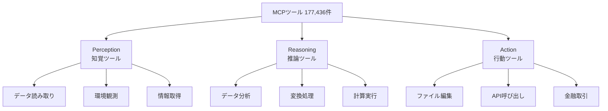
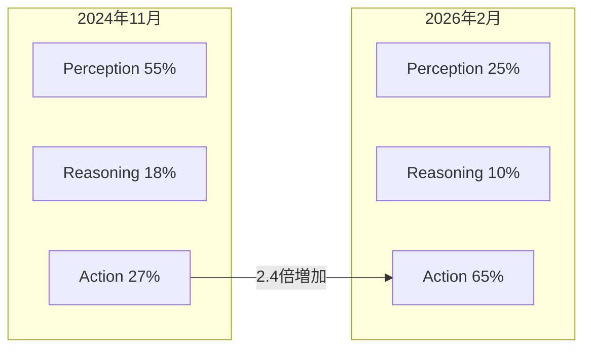

本記事は https://arxiv.org/abs/2603.23802 の解説記事です。

## 論文概要

本論文は、2024年11月から2026年2月までの16ヶ月間に公開された177,436件のModel Context Protocol（MCP）ツールを体系的に分析し、AIエージェントが実世界でどのように利用されているかを明らかにした大規模実証研究である。著者のMerlin Stein（UK AI Security Institute / University of Oxford）は、公開MCPサーバーリポジトリを継続的にモニタリングし、各ツールを機能分類・ドメインマッピング・影響度評価の3軸で分析した。その結果、ソフトウェア開発がツール作成の67%、ダウンロード数の90%を占めること、環境変更を伴うアクションツールが16ヶ月間で27%から65%に増加したことなどが明らかになった。

この記事は [Zenn記事: AIエージェントのツールオーケストレーション設計：選択・実行制御・安全性の実装パターン](https://zenn.dev/0h_n0/articles/6f9791a8984999) の深掘りです。

## 情報源

| 項目 | 詳細 |
|------|------|
| タイトル | How are AI Agents used? Evidence from 177,000 MCP tools |
| 著者 | Merlin Stein |
| 所属 | UK AI Security Institute, University of Oxford |
| arXiv ID | 2603.23802 |
| 公開日 | 2026年3月25日 |
| 分野 | cs.CY (Computers and Society) |

## 背景と動機

### AIエージェントの急速な普及と可視性の課題

2024年以降、大規模言語モデル（LLM）にツール呼び出し機能を付与した「AIエージェント」が急速に普及している。しかし、エージェントが実際にどのようなタスクに使われ、どの程度の影響力を持つ操作を行っているかについて、体系的なエビデンスはほとんど存在しなかった。

従来のAI安全性研究は、モデル自体の能力評価（ベンチマーク）やアライメント手法に集中しており、デプロイ後の実利用パターンの分析は限定的であった。著者らは、規制当局や安全性研究者がエージェントのリスクを評価するためには、「何ができるか」（capability）ではなく「何に使われているか」（usage）を把握する必要があると指摘している。

### Model Context Protocol（MCP）の登場

2024年11月にAnthropicが公開したModel Context Protocol（MCP）は、LLMとツール間のインターフェースを標準化するオープンプロトコルである。MCPの普及により、エージェントが利用可能なツールがサーバーとして公開・共有されるエコシステムが形成された。著者らは、このMCPサーバーのエコシステムが、エージェント利用の実態を観測する「窓」として機能することに着目した。

MCPツールは以下の特徴を持つ：

- 各ツールは名前（name）、説明文（description）、入力スキーマ（input schema）を公開する
- ツールはMCPサーバーとしてパッケージ化され、npmやPyPIで配布される
- ダウンロード数がツールの利用頻度の代理指標として利用可能

この透明性が、大規模な実証分析を可能にした点が本研究の出発点である。

## 主要な貢献

著者らは本論文の貢献を以下の4点にまとめている：

1. **大規模データセット構築**: 177,436件のMCPツールを収集・構造化した初の大規模データセット
2. **分類体系の確立**: ツールをperception / reasoning / actionの3カテゴリに分類する体系を提案
3. **ドメインマッピング**: O*NETデータを活用し、ツールが対応する職業タスクのドメイン分布を定量化
4. **影響度評価フレームワーク**: ツールの操作がもたらす結果の重大性（consequentiality）を段階的に評価する手法を提案

## 技術的詳細（方法論）

### データ収集パイプライン

著者らは、公開MCPサーバーリポジトリを継続的にクロールするパイプラインを構築した。対象となったソースは以下の通りである：

- GitHub上のMCPサーバーリポジトリ
- npmレジストリのMCPパッケージ
- PyPIのMCPパッケージ
- 公式MCPサーバーディレクトリ

各サーバーから抽出される情報は、ツール名、説明文、入力パラメータスキーマ、サーバーメタデータ（作成日、ダウンロード数等）である。最終的に177,436件のユニークツールが収集された。

### ツール分類体系

著者らは、各ツールの「直接的影響（direct impact）」に基づき、3カテゴリへの分類を行った：

各カテゴリの定義は以下の通りである：

| カテゴリ | 定義 | 例 |
|----------|------|-----|
| Perception | 外部環境からの情報取得・読み取り。環境を変更しない | ファイル読み取り、DB検索、Web scraping |
| Reasoning | データの分析・変換・計算。入力から出力への変換処理 | テキスト要約、コード解析、数値計算 |
| Action | 外部環境への変更を伴う操作 | ファイル書き込み、メール送信、決済実行 |

分類にはツールの説明文と入力スキーマを入力としたLLMベースの分類器が使用された。著者らは分類精度の検証として、ランダムサンプリングした500件に対する人手アノテーションとの一致率を報告している。

### ドメインマッピング手法

ツールがどの職業ドメインのタスクに対応するかを特定するため、著者らはO*NET（Occupational Information Network）のタスクデータベースを活用した。O*NETは米国労働省が管理する職業情報データベースで、約1,000職種に対して各職種の詳細なタスク記述を提供している。

マッピングの手順は以下の通りである：

1. MCPツールの説明文からタスク記述を抽出
2. O*NETタスクデータベースとの意味的類似度を計算
3. 最も類似度の高いタスク群が属する職業ドメインにマッピング
4. 職業ドメインをさらに上位のセクター（ソフトウェア開発、金融、医療等）に集約

この手法により、ツールの機能記述から職業領域への体系的な対応付けが可能となった。

### 影響度（Consequentiality）評価

著者らは、アクションツールがもたらす結果の重大性を以下の3段階で評価した：

| レベル | 定義 | 例 |
|--------|------|-----|
| Low | 容易に取り消し可能な操作 | ローカルファイル編集、テスト環境へのデプロイ |
| Medium | 取り消しにコストを要する操作 | 本番コードのコミット、メール送信 |
| High | 取り消し困難または不可能な操作 | 金融取引、本番DB操作、外部API経由の不可逆操作 |

評価にはツールの説明文に加え、入力スキーマの構造（確認パラメータの有無、金額フィールドの存在等）も考慮された。

## 実験結果

### ドメイン分布

著者らの分析により、MCPツールのドメイン分布は極めて偏在していることが明らかになった。

| ドメイン | ツール作成比率 | ダウンロード比率 |
|----------|--------------|----------------|
| ソフトウェア開発 | 67% | 90% |
| データ分析・BI | 12% | 4% |
| コンテンツ作成 | 8% | 3% |
| 金融・会計 | 5% | 1.5% |
| その他 | 8% | 1.5% |

ソフトウェア開発がツール作成の67%を占めるという結果は、現時点でのAIエージェントの主要ユースケースがコーディング支援であることを示している。さらに注目すべきは、ダウンロード数ベースでは90%に達する点である。これは、ソフトウェア開発ツールが作成されるだけでなく、実際に高頻度で利用されていることを意味する。

### ツールカテゴリの時系列変化

16ヶ月間のツールカテゴリ構成比の変化は、エージェントの「自律性の拡大」を定量的に示している。

| 期間 | Perception | Reasoning | Action |
|------|-----------|-----------|--------|
| 2024年11月 | 55% | 18% | 27% |
| 2025年5月 | 40% | 15% | 45% |
| 2025年11月 | 30% | 12% | 58% |
| 2026年2月 | 25% | 10% | 65% |

アクションツールの比率は27%から65%へと2.4倍に増加した。著者らはこの傾向について、エージェントの利用が「情報検索・分析」から「環境への直接的介入」へとシフトしていることを示唆すると報告している。

### アクションツールの影響度分布

アクションツールの影響度評価では、大半がMediumレベルであることが報告されている：

| 影響度レベル | 比率 | 主な用途 |
|-------------|------|----------|
| Low | 20% | ローカルファイル操作、テスト実行 |
| Medium | 65% | コード編集、Git操作、CI/CD |
| High | 15% | 金融取引、本番環境操作 |

著者らは、Mediumレベルの高い比率について、ソフトウェア開発におけるファイル編集やGit操作が中心であると分析している。一方で、Highレベルの15%には金融取引ツールや本番データベース操作ツールが含まれており、エージェントの不適切な動作が深刻な結果をもたらしうる領域が既に存在することを示している。

### ソフトウェア開発ドメインの詳細分析

ソフトウェア開発ドメイン内のさらなる分類では、以下の分布が報告されている：

| サブカテゴリ | 比率 |
|-------------|------|
| コード編集・生成 | 35% |
| バージョン管理（Git操作） | 20% |
| テスト実行・CI/CD | 15% |
| デバッグ・ログ分析 | 12% |
| ドキュメント生成 | 10% |
| 環境構築・デプロイ | 8% |

コード編集とバージョン管理で過半数を占めており、AIエージェントが開発者のコアワークフローに直接統合されている実態が明らかになった。

### 時系列トレンドの統計的分析

著者らは、アクションツール比率の増加トレンドについて線形回帰分析を行い、月あたり約2.4ポイントの増加率を報告している。この増加率が維持された場合、2026年末にはアクションツールが全体の75%以上に達する可能性がある。ただし著者らは、この外挿には不確実性が伴うことを注記している。

## 実運用への応用

### 規制・監視フレームワークへの示唆

本研究の最も重要な応用は、ツール層でのモニタリングがAIエージェントの規制的監視を可能にすることを実証した点にある。著者らは以下の具体的な監視アプローチを提案している：

1. **ツール登録制度**: MCPサーバーの公開時に影響度レベルの自己申告を義務付け
2. **ダウンロード数モニタリング**: High影響度ツールの利用拡大を早期検知
3. **カテゴリシフト監視**: アクションツール比率の急激な変化をアラートとして検知

### エージェント安全性設計への示唆

本研究の知見は、エージェントシステムの安全性設計に以下の示唆を与える：

- **段階的権限モデル**: ツールの影響度レベルに応じた承認フローの設計が合理的であることが実データで裏付けられた
- **ドメイン固有の安全性要件**: ソフトウェア開発ドメインの圧倒的優位は、まずこのドメインに特化した安全性基準の策定が効率的であることを示唆する
- **アクション比率の監視**: 単一システム内でのアクションツール呼び出し比率の変化は、エージェントの自律性レベルの変化を示す指標として利用可能

### MCP エコシステムにおけるガバナンス

著者らの分析は、MCPの標準化されたインターフェースが規制的監視の基盤として機能しうることを示している。具体的には：

- ツールの説明文とスキーマから自動的にリスク分類が可能
- パッケージマネージャのダウンロード統計が利用頻度の代理指標として有効
- オープンソースエコシステムの透明性が監視コストを大幅に低減

ただし著者らは、プライベートMCPサーバーや非公開ツールは本分析の対象外であり、実際のエージェント利用の全体像はさらに大きい可能性があることを注記している。

## 関連研究

### AIエージェントの能力評価

本論文以前のエージェント研究は主にベンチマーク評価に集中していた。SWE-bench（Jimenez et al., 2024）やWebArena（Zhou et al., 2024）は、エージェントの「できること」を評価するが、「実際に何に使われているか」は対象外であった。本研究はこのギャップを埋める位置づけにある。

### ツール利用の理論的分析

Schick et al.（2024）のToolformerや、Qin et al.（2024）のToolLLMなど、LLMのツール利用能力に関する研究は多数存在する。しかしこれらは能力の「付与」に焦点を当てており、実世界でのツール利用パターンの実証分析は本研究が初めてである。

### AI規制と監視

EU AI ActやUK AI Safety Instituteの活動に代表されるAI規制の議論において、「何を監視すべきか」は未解決の問題であった。本研究は、ツール層でのモニタリングが実行可能かつ有効であることを示す実証的根拠を提供している。

### MCP関連研究

MCPの技術仕様自体は2024年11月のAnthropicによる公開以降、急速にエコシステムが拡大した。しかし、MCPエコシステム全体を対象とした定量分析は本論文が初である。

## まとめ

本論文の主要な知見を整理する：

1. **ソフトウェア開発の圧倒的優位**: ツール作成の67%、利用の90%がソフトウェア開発ドメインに集中している
2. **アクションツールの急増**: 16ヶ月間で27%から65%に増加し、エージェントの自律的環境操作が拡大している
3. **中程度リスクの集中**: アクションツールの65%がMedium影響度であり、コード編集やGit操作が中心
4. **高リスクツールの存在**: 15%のHighレベルツール（金融取引等）は、エージェントの誤動作が深刻な結果をもたらしうる
5. **監視手法の実証**: ツール層でのモニタリングがエージェント利用の実態把握に有効であることが実証された

本研究の限界として、著者らは以下を挙げている：

- 公開MCPサーバーのみが対象であり、企業内部のプライベートツールは含まれない
- ダウンロード数は実際の呼び出し回数の代理指標に過ぎない
- LLMベースの分類器は完全な精度を保証しない

それでもなお、177,436件という規模のデータセットに基づく本研究は、AIエージェントの実利用パターンに関する現時点で最も包括的なエビデンスを提供している。エージェントの自律性が拡大し続ける中、ツール層での継続的な監視と、影響度に応じた規制フレームワークの構築が急務であることを、本研究は定量的に示している。

## 参考文献

- Stein, M. (2026). How are AI Agents used? Evidence from 177,000 MCP tools. arXiv:2603.23802.
- Anthropic. (2024). Model Context Protocol Specification. https://modelcontextprotocol.io/
- Jimenez, C. E., et al. (2024). SWE-bench: Can Language Models Resolve Real-World GitHub Issues? arXiv:2310.06770.
- Zhou, S., et al. (2024). WebArena: A Realistic Web Environment for Building Autonomous Agents. arXiv:2307.13854.
- Schick, T., et al. (2024). Toolformer: Language Models Can Teach Themselves to Use Tools. arXiv:2302.04761.
- Qin, Y., et al. (2024). ToolLLM: Facilitating Large Language Models to Master 16000+ Real-world APIs. arXiv:2307.16789.
- O*NET Resource Center. https://www.onetcenter.org/

---

関連するZenn記事: [AIエージェントのツールオーケストレーション設計：選択・実行制御・安全性の実装パターン](https://zenn.dev/0h_n0/articles/6f9791a8984999)
