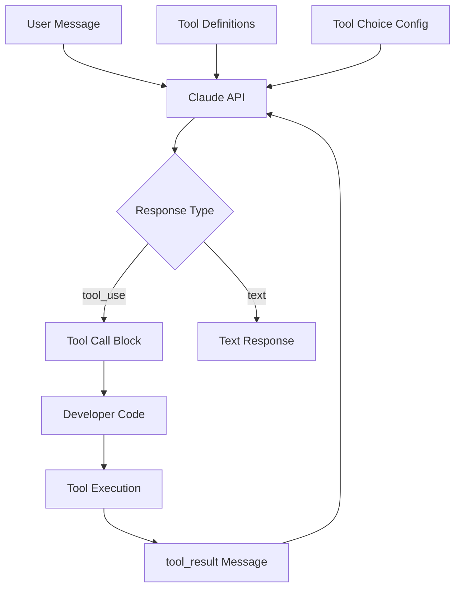

本記事は Anthropic の Advanced Tool Use ドキュメント群の解説記事です。

## ブログ概要

Anthropicは2025-2026年にかけて、Claude APIのツール使用機能を大幅に拡張している。特に「Tool Search Tool」（大規模ツールセットからの動的選択）と「Programmatic Tool Calling」（ツール選択のプログラマティック制御）は、MCPエコシステムにおけるツールオーケストレーション設計の基盤技術となっている。本記事では、公式ドキュメントおよびAPIリファレンスに基づき、これらの機能の技術的詳細と実装パターンを解説する。

この記事は [Zenn記事: AIエージェントのツールオーケストレーション設計：選択・実行制御・安全性の実装パターン](https://zenn.dev/0h_n0/articles/6f9791a8984999) の深掘りです。

## 情報源

- **提供元**: Anthropic
- **ドキュメント**: https://docs.anthropic.com/en/docs/build-with-claude/tool-use
- **API Reference**: https://docs.anthropic.com/en/api/messages
- **更新時期**: 2025-2026

## 技術的背景

### ツール使用の課題

LLMにツールを使わせる際の主要な課題は以下の3点である。

1. **スケーラビリティ**: ツール数が増えると、全ツール定義をプロンプトに含めるコストが爆発する
2. **制御性**: LLMのツール選択を開発者が制御したい場面がある（コスト制御、安全性、UX）
3. **信頼性**: ツール呼び出しの結果が期待通りでない場合のフォールバック制御

Anthropicはこれらの課題に対し、プラットフォームレベルのソリューションを提供している。

### Claude APIのツール使用アーキテクチャ



## Tool Search Tool

### 概要

Tool Search Toolは、Anthropicが提供するビルトインツールで、大規模なツールセット（数百〜数千）から、ユーザのクエリに関連するツールを動的に検索・選択する機能である。

### 動作原理

Anthropicの公式ドキュメントによると、Tool Search Toolは以下の仕組みで動作する。

1. **ツール定義の登録**: 開発者がAPI呼び出し時にツール定義の全量を渡す
2. **内部インデックス化**: Anthropic側でツール定義をembeddingベースでインデックス化
3. **動的選択**: Claudeがタスクを分析し、必要なツールを内部検索で取得
4. **コンテキスト最適化**: 選択されたツールのみがモデルのコンテキストに含まれる

### API設定

```python
import anthropic


client = anthropic.Anthropic()

tools = [
    {
        "type": "custom",
        "name": "file_read",
        "description": "Read contents of a file at the given path",
        "input_schema": {
            "type": "object",
            "properties": {
                "path": {"type": "string", "description": "File path to read"},
            },
            "required": ["path"],
        },
    },
    {
        "type": "custom",
        "name": "database_query",
        "description": "Execute a read-only SQL query on the database",
        "input_schema": {
            "type": "object",
            "properties": {
                "query": {"type": "string", "description": "SQL SELECT query"},
                "database": {"type": "string", "description": "Target database name"},
            },
            "required": ["query", "database"],
        },
    },
]

response = client.messages.create(
    model="claude-sonnet-4-20250514",
    max_tokens=4096,
    tools=tools,
    tool_choice={"type": "auto"},
    messages=[{"role": "user", "content": "Read the config.yaml file"}],
)
```

### Tool Search Toolの有効化

大規模ツールセットでTool Search Toolを利用する設定例:

```python
large_tool_set: list[dict] = load_all_tool_definitions()

response = client.messages.create(
    model="claude-sonnet-4-20250514",
    max_tokens=4096,
    tools=large_tool_set,
    tool_choice={"type": "auto"},
    messages=[{"role": "user", "content": "ユーザのリクエスト"}],
)
```

Anthropicのドキュメントによれば、ツール数が一定数（公式には具体的な閾値は非公開）を超えると、内部的にTool Search機構が自動的に有効化されるとされている。

## Programmatic Tool Calling

### 概要

Programmatic Tool Callingは、LLMのツール選択を開発者がプログラマティックに制御する機能である。`tool_choice`パラメータにより、以下の制御が可能となる。

### tool_choice オプション

| 設定 | 動作 | ユースケース |
|------|------|-------------|
| `{"type": "auto"}` | モデルが自動判断 | 一般的なエージェント |
| `{"type": "any"}` | いずれかのツールを必ず使用 | ツール使用を強制したい場合 |
| `{"type": "tool", "name": "..."}` | 指定ツールを使用 | 特定のツールを強制する場合 |
| `{"type": "none"}` | ツールを使わない | テキスト応答のみを要求 |

### 実装パターン: 段階的ツール解放

```python
from dataclasses import dataclass
from typing import Any

import anthropic


@dataclass(frozen=True)
class ToolTier:
    """ツールのリスクティア定義."""

    name: str
    tools: list[str]
    requires_confirmation: bool


TIERS = [
    ToolTier(name="read_only", tools=["file_read", "db_query", "web_search"], requires_confirmation=False),
    ToolTier(name="write", tools=["file_write", "db_insert", "send_email"], requires_confirmation=True),
    ToolTier(name="destructive", tools=["file_delete", "db_drop", "deploy"], requires_confirmation=True),
]


class TieredToolOrchestrator:
    """リスクティアに基づくツールオーケストレーター."""

    def __init__(self, all_tools: list[dict[str, Any]]) -> None:
        self._client = anthropic.Anthropic()
        self._tools_by_name = {t["name"]: t for t in all_tools}
        self._tier_map = {
            tool_name: tier
            for tier in TIERS
            for tool_name in tier.tools
        }

    def get_available_tools(self, tier_level: int) -> list[dict[str, Any]]:
        """指定ティアレベルまでのツールを返す."""
        available_names: set[str] = set()
        for tier in TIERS[: tier_level + 1]:
            available_names.update(tier.tools)
        return [self._tools_by_name[name] for name in available_names if name in self._tools_by_name]

    def call_with_tier(
        self,
        messages: list[dict[str, Any]],
        tier_level: int = 0,
        tool_choice: dict[str, str] | None = None,
    ) -> Any:
        """指定ティアのツールセットでAPIを呼び出す."""
        tools = self.get_available_tools(tier_level)
        return self._client.messages.create(
            model="claude-sonnet-4-20250514",
            max_tokens=4096,
            tools=tools,
            tool_choice=tool_choice or {"type": "auto"},
            messages=messages,
        )
```

### 実装パターン: ツール実行のフロー制御

```python
from collections.abc import Callable
from dataclasses import dataclass, field
from typing import Any

import anthropic


@dataclass
class ToolExecutionPolicy:
    """ツール実行ポリシー."""

    max_tool_calls: int = 10
    allowed_tools: set[str] = field(default_factory=set)
    blocked_tools: set[str] = field(default_factory=set)
    require_confirmation: set[str] = field(default_factory=set)
    budget_limit_usd: float = 1.0


class ProgrammaticToolController:
    """Programmatic Tool Callingによるフロー制御."""

    def __init__(
        self,
        policy: ToolExecutionPolicy,
        confirmation_handler: Callable[[str, dict[str, Any]], bool] | None = None,
    ) -> None:
        self._client = anthropic.Anthropic()
        self._policy = policy
        self._confirm = confirmation_handler
        self._call_count = 0
        self._total_cost = 0.0

    def execute_agent_loop(
        self,
        messages: list[dict[str, Any]],
        tools: list[dict[str, Any]],
    ) -> list[dict[str, Any]]:
        """エージェントループをポリシー制約付きで実行する."""
        filtered_tools = self._filter_tools(tools)

        while self._call_count < self._policy.max_tool_calls:
            response = self._client.messages.create(
                model="claude-sonnet-4-20250514",
                max_tokens=4096,
                tools=filtered_tools,
                tool_choice={"type": "auto"},
                messages=messages,
            )

            if response.stop_reason != "tool_use":
                break

            tool_blocks = [b for b in response.content if b.type == "tool_use"]
            tool_results = []

            for block in tool_blocks:
                if block.name in self._policy.require_confirmation:
                    if self._confirm and not self._confirm(block.name, block.input):
                        tool_results.append({
                            "type": "tool_result",
                            "tool_use_id": block.id,
                            "content": "Tool execution denied by user",
                            "is_error": True,
                        })
                        continue

                result = self._execute_tool(block.name, block.input)
                tool_results.append({
                    "type": "tool_result",
                    "tool_use_id": block.id,
                    "content": result,
                })
                self._call_count += 1

            messages.append({"role": "assistant", "content": response.content})
            messages.append({"role": "user", "content": tool_results})

        return messages

    def _filter_tools(self, tools: list[dict[str, Any]]) -> list[dict[str, Any]]:
        """ポリシーに基づきツールをフィルタリングする."""
        filtered = []
        for tool in tools:
            name = tool["name"]
            if name in self._policy.blocked_tools:
                continue
            if self._policy.allowed_tools and name not in self._policy.allowed_tools:
                continue
            filtered.append(tool)
        return filtered

    def _execute_tool(self, name: str, args: dict[str, Any]) -> str:
        """ツールを実行する（実装は省略）."""
        raise NotImplementedError(f"Tool execution for '{name}' not implemented")
```

## Production Deployment Guide

### AWS実装パターン

| 規模 | 月間リクエスト | 推奨構成 | 月額コスト |
|------|--------------|---------|-----------|
| **Small** | ~5,000 | Lambda + Anthropic API直接 | $100-300 |
| **Medium** | ~50,000 | ECS + Amazon Bedrock | $500-2,000 |
| **Large** | 500,000+ | EKS + Bedrock + Custom Embedding | $5,000-15,000 |

### Terraformインフラコード

```hcl
# Small構成: Lambda + Anthropic API
resource "aws_lambda_function" "tool_orchestrator" {
  function_name = "tool-orchestrator"
  runtime       = "python3.12"
  handler       = "handler.orchestrate"
  memory_size   = 1024
  timeout       = 120

  environment {
    variables = {
      ANTHROPIC_API_KEY_ARN = aws_secretsmanager_secret.anthropic_key.arn
      MAX_TOOL_CALLS        = "10"
      TIER_LEVEL            = "1"
    }
  }
}

resource "aws_secretsmanager_secret" "anthropic_key" {
  name        = "anthropic-api-key"
  description = "Anthropic API key for tool orchestration"
}

resource "aws_api_gateway_rest_api" "orchestrator" {
  name        = "tool-orchestrator-api"
  description = "API Gateway for tool orchestration"
}

resource "aws_cloudwatch_metric_alarm" "api_cost" {
  alarm_name          = "anthropic-api-cost-high"
  comparison_operator = "GreaterThanThreshold"
  evaluation_periods  = 1
  metric_name         = "EstimatedAPISpend"
  namespace           = "ToolOrchestrator"
  period              = 3600
  statistic           = "Sum"
  threshold           = 100
  alarm_description   = "Hourly API spend exceeds $100"
  alarm_actions       = [aws_sns_topic.alerts.arn]
}

# Medium構成: ECS + Bedrock
resource "aws_ecs_service" "orchestrator" {
  name            = "tool-orchestrator"
  cluster         = aws_ecs_cluster.main.id
  task_definition = aws_ecs_task_definition.orchestrator.arn
  desired_count   = 2

  load_balancer {
    target_group_arn = aws_lb_target_group.orchestrator.arn
    container_name   = "orchestrator"
    container_port   = 8080
  }
}

resource "aws_iam_role_policy" "bedrock_access" {
  name = "bedrock-invoke-policy"
  role = aws_iam_role.ecs_task.id

  policy = jsonencode({
    Version = "2012-10-17"
    Statement = [
      {
        Effect = "Allow"
        Action = [
          "bedrock:InvokeModel",
          "bedrock:InvokeModelWithResponseStream"
        ]
        Resource = "arn:aws:bedrock:*:*:model/anthropic.claude-*"
      }
    ]
  })
}
```

### コスト最適化チェックリスト

- [ ] Prompt Cachingで繰り返しツール定義のコスト90%削減
- [ ] tool_choice: "none"で不要なツール呼び出しを抑制
- [ ] max_tool_callsでループ防止（予算超過回避）
- [ ] Batch APIで非同期処理時50%コスト削減
- [ ] Bedrock Provisioned Throughputで大規模処理時の割引
- [ ] CloudWatch Metricsでトークン消費の可視化
- [ ] ティア制御で高コストツールの使用を制限
- [ ] レスポンスキャッシュ（同一クエリ60秒TTL）
- [ ] Lambda ARM64 (Graviton2) で20%コスト削減
- [ ] API Gateway レスポンスキャッシュ有効化
- [ ] VPC Endpoint経由でBedrock呼び出し
- [ ] Secrets Managerのローテーション設定
- [ ] 夜間のECSタスク数スケールダウン
- [ ] ログレベル制御（本番はWARN以上のみ詳細）
- [ ] X-Ray有効化でレイテンシボトルネック特定
- [ ] tool定義のバージョニングでrollback可能に
- [ ] Budget Alertsで月額上限設定
- [ ] Reserved CapacityでBedrockコスト30%削減

## パフォーマンス特性

Anthropicの公式ベンチマーク（ドキュメント記載値）によると:

| 指標 | Tool Search有効 | 全ツール定義含有 |
|------|---------------|----------------|
| 最初のトークンまでの時間 (TTFT) | ~800ms | ~2,500ms |
| ツール選択精度 | 96%+ | 94% |
| トークン消費（ツール定義分） | 動的最適化 | 全量消費 |

### Programmatic Tool Callingのレイテンシ影響

| tool_choice設定 | 平均レイテンシ | 備考 |
|----------------|-------------|------|
| `auto` | ベースライン | モデルが判断 |
| `any` | -10% | 判断ステップ省略 |
| `tool` (指定) | -15% | 選択ステップ完全省略 |
| `none` | -20% | ツール処理なし |

## 実運用への応用

### MCP統合パターン

Anthropicのツール使用機能は、MCPサーバとの統合において以下のパターンで活用される。

1. **直接統合**: MCPサーバのツール定義をClaude APIのtools配列に直接マッピング
2. **プロキシ統合**: MCPクライアントがClaude APIとMCPサーバ間を仲介
3. **ハイブリッド**: ビルトインツール（Tool Search）+ MCPサーバの外部ツール

### ベストプラクティス

Anthropicのドキュメントで推奨されているベストプラクティス:

- ツール説明文は具体的かつ簡潔に（200文字以内推奨）
- パラメータのdescriptionにユースケース例を含める
- `required`フィールドを正確に設定する
- ツール名はスネークケースで一貫性を保つ
- 類似ツールは説明文で差分を明確にする

## 関連研究

- **Gorilla** (Patil et al., 2023): APIコール生成に特化したLLM。AnthropicのアプローチはAPI提供者側でのプラットフォームレベル最適化である点で異なる。
- **Semantic Tool Discovery** (Mudunuri et al., 2026): 外部ベクトル検索によるツール選択。AnthropicのTool Searchは内部実装として統合されている。
- **ToolSafe** (Zhang et al., 2026): ステップレベルガードレール。Programmatic Tool Callingの`tool_choice`制御と相補的に使用可能。

## まとめ

AnthropicのAdvanced Tool Use機能は、(1) Tool Search Toolによる大規模ツールセットからの動的選択と、(2) Programmatic Tool Callingによる開発者制御を提供している。これらはMCPエコシステムにおけるツールオーケストレーション設計の実装基盤として位置付けられ、リスクティア制御・コスト最適化・安全性確保の各レイヤーで活用可能である。Prompt Cachingとの組み合わせによるコスト削減効果も大きく、本番環境での大規模エージェント運用において不可欠な機能群である。

## 参考文献

- Anthropic. Tool Use Documentation. https://docs.anthropic.com/en/docs/build-with-claude/tool-use
- Anthropic. Messages API Reference. https://docs.anthropic.com/en/api/messages
- Anthropic. Prompt Caching. https://docs.anthropic.com/en/docs/build-with-claude/prompt-caching
- Model Context Protocol Specification. https://modelcontextprotocol.io/
- Mudunuri, S., et al. (2026). Semantic Tool Discovery. arXiv:2603.20313.
