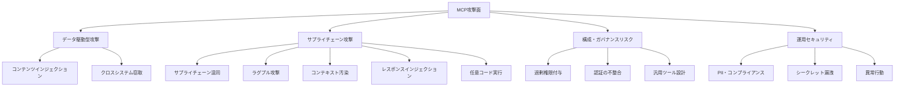
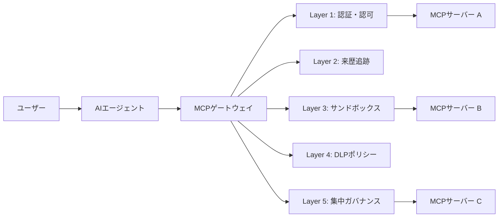
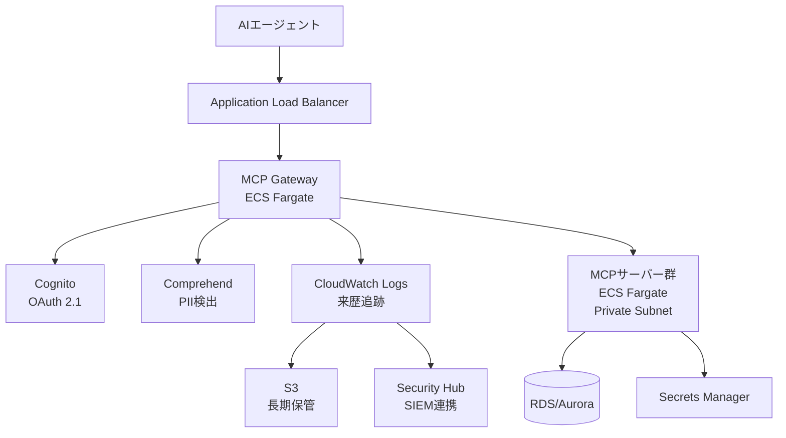

本記事は [https://arxiv.org/abs/2511.20920](https://arxiv.org/abs/2511.20920) の解説記事です。

## 論文概要

本論文は、Model Context Protocol（MCP）が従来の静的API連携から動的なユーザー駆動型エージェントシステムへと移行したことで生じるセキュリティ課題を体系的に分析した研究である。著者らは3種類の敵対者モデル（コンテンツインジェクション攻撃者、サプライチェーン攻撃者、意図せぬエージェント逸脱）を定義し、データ窃取・ツール操作・権限昇格の攻撃面を特定している。防御策として、ユーザー単位の認証・スコープ付き認可、来歴追跡、コンテナ型サンドボックス、DLPポリシー適用、集中ガバナンスの5層防御フレームワークを提案し、既存のAIガバナンス標準（NIST AI RMF、ISO/IEC 42001）がMCP固有の脅威を未カバーである点を指摘している。

この記事は [Zenn記事: MCPサーバー自作で社内データ基盤に認可制御と監査ログを実装する](https://zenn.dev/0h_n0/articles/a2fe642a5473c9) の深掘りです。

## 情報源

| 項目 | 詳細 |
|------|------|
| タイトル | Securing the Model Context Protocol (MCP): Risks, Controls, and Governance |
| 著者 | Herman Errico, Jiquan Ngiam, Shanita Sojan |
| arXiv ID | 2511.20920 |
| 公開日 | 2025年11月25日 |
| 分野 | cs.CR (Cryptography and Security) |
| URL | [https://arxiv.org/abs/2511.20920](https://arxiv.org/abs/2511.20920) |

## 背景と動機

### MCPの普及とセキュリティ課題の顕在化

MCPはAnthropicが2024年11月に公開したオープンプロトコルであり、LLMと外部ツール間のインターフェースを標準化した。MCPの登場以前、AIエージェントと外部サービスの接続は、開発者が制御する静的なAPI連携で実現されていた。この構成では、呼び出し先やデータフローが設計時に固定されるため、セキュリティ境界が明確であった。

しかしMCPの導入により、ユーザーが動的にツールを追加・発見・実行する構成へと移行した。著者らは、この移行が「従来のセキュリティモデルでは想定されていない信頼境界の曖昧化」を引き起こすと指摘している（論文Section 1より）。具体的には、Knosticの調査で1,800以上のMCPサーバーが認証なしで公開されていることが確認されており、実環境で攻撃面が拡大している現状がある。

既存のAIガバナンスフレームワーク（NIST AI RMF、ISO/IEC 42001）は、モデル自体の品質管理やリスク管理を対象としているが、MCP固有のサプライチェーン攻撃やツール操作のリスクについてはカバーしていない。本論文は、この空白を埋めるための体系的な脅威モデルと防御制御フレームワークを提案している。

## 主要な貢献

著者らの貢献は以下の3点に集約される：

1. **MCP固有の脅威モデルの体系化**: 3種類の敵対者（コンテンツインジェクション攻撃者、サプライチェーン攻撃者、意図せぬエージェント逸脱）を定義し、それぞれの攻撃能力・攻撃面・目標を明確に分類した
2. **5層＋ゲートウェイの防御フレームワーク**: 認証・認可、来歴追跡、サンドボックス、DLPポリシー、集中ガバナンスの5層防御と、それらを統合するゲートウェイアーキテクチャを提案した
3. **既存標準とのマッピング**: NIST AI RMF、ISO/IEC 27001:2022、ISO/IEC 42001:2023の各フレームワークに対する制御の対応関係を整理し、MCP固有のギャップを明示した

## 技術的詳細

### 3つの敵対者モデル

著者らは、MCPエコシステムにおける脅威を3種類の敵対者モデルで分類している（論文Section 2より）。

#### 敵対者1: コンテンツインジェクション攻撃者

エージェントへの直接アクセスを持たない外部攻撃者である。顧客サポートチケット、メール、ドキュメント、課題管理システムなどの正規データソースに悪意のある指示を埋め込む。著者らはこれを「Lethal Trifecta（致命的な三つ組）」パターンとして定式化している：

- **System A（指示源）**: ユーザー生成コンテンツ内の悪意ある指示
- **System B（データ源）**: エージェントがアクセス可能な機密データ（DWH、DB、リポジトリ）
- **System C（窃取先）**: 外部通信機能（メール、HTTPエンドポイント、クラウドストレージ）

攻撃者は単一の悪意ある指示で、エージェントを複数システムにまたがって操作し、直接アクセスできないネットワークへの橋渡しを実現する。

#### 敵対者2: サプライチェーン攻撃者

MCPサーバーの作成・配布・更新プロセスを悪用する攻撃者である。著者らは以下の攻撃パターンを報告している：

- **サプライチェーン混同**: レジストリ登録にはGitHubリポジトリまたはドメインの所有権証明のみが必要で、コードレビューやセキュリティ監査は不要（論文Section 3.2.1より）
- **ラグプル攻撃**: 信頼を獲得した後に悪意ある変更を導入する。実例として、非公式Postmark MCPサーバー（週1,500ダウンロード）がsend_email関数にBCCフィールドを追加し、全メールを攻撃者のアドレスにコピーした事例が報告されている（論文Section 3.2.2より）
- **コンテキスト汚染**: ツールの名前と説明がエージェントのベースプロンプトに自動追加される仕組みを悪用し、悪意ある指示を埋め込む
- **レスポンスインジェクション**: 正規のツール応答に攻撃指示を混入させる

#### 敵対者3: 意図せぬエージェント逸脱

エージェント自身が、バグや設定ミスではなく、目的指向の推論の結果として脅威となるケースである。著者らは以下のリスクを指摘している（論文Section 2より）：

- デバッグ中にシークレットを露出する
- コンプライアンス上の問題を認識せずにPIIを処理・送信する
- 低権限の代替手段があるにもかかわらず高権限ツールを使用する
- ツールを予期しない組み合わせで使用し、セキュリティ制御を迂回する

### 攻撃面の分析

著者らは攻撃ベクトルを4カテゴリに整理している（論文Section 3より）。



特に注目すべき定量的指摘として、著者らはGitHub公式MCPサーバーが「90以上のツールを公開し、46,000トークン以上を消費しており、delete_fileやdelete_workflow_run_logsなどの高リスク操作を含む」と報告している（論文Section 3.3.1より）。また、Snowflake公式MCPサーバーが「任意のSQLクエリを受け付けるexecute_sqlツールを公開」している点も問題視されている（論文Section 3.3.3より）。

### 5層＋ゲートウェイ防御フレームワーク

著者らが提案する防御フレームワークは以下の構造を持つ（論文Section 4より）。



#### Layer 1: 認証・認可

ユーザー単位のOAuth 2.1フローによる認証と、ロールベースアクセス制御（RBAC）によるツール単位の認可を組み合わせる。共有トークンを排除し、個別のアクセス追跡と取り消しを実現する。

#### Layer 2: 来歴追跡（Provenance Tracking）

エージェントの全行動を監査可能な形式で記録する。記録対象はユーザーID、タイムスタンプ、セッションID、元のプロンプト、エージェントの推論、ツール呼び出し（名前・パラメータ・サーバーID）、レスポンス、データソースカタログ、PII/シークレットの墨消し表現を含む。著者らはハッシュチェーンまたはMerkleツリーによる暗号学的整合性の担保を推奨している。

ハッシュチェーンの基本構造は以下のように表現できる：

$$H_i = \text{SHA-256}(H_{i-1} \| \text{event}_i \| \text{ts}_i \| \text{server\_id}_i)$$

ここで $$H_0$$ は初期シード値、$$\text{event}_i$$ は第 $$i$$ 番目の監査イベント、$$\text{ts}_i$$ はタイムスタンプ、$$\text{server\_id}_i$$ はMCPサーバーの識別子である。改竄が発生した場合、後続のハッシュ値が不整合となるため検出可能である。

#### Layer 3: コンテキスト分離とサンドボックス

MCPサーバーのコンテナ化を必須とし、以下の制約を適用する：

- デフォルトで読み取り専用ファイルシステム
- 明示的に指定されたディレクトリのみ書き込み許可
- 許可リストに基づくネットワークアクセス制限
- CPU・メモリ・ディスクのリソースクォータ
- ホストの認証情報・環境変数の非継承

#### Layer 4: インラインポリシー適用

DLP（Data Loss Prevention）をリアルタイムで適用し、PII（氏名、メールアドレス、SSN、クレジットカード番号、健康情報）やAPIキー・クラウドトークンなどの認証情報を検出・墨消し・ブロックする。

#### Layer 5: 集中セキュリティガバナンス

プライベートMCPレジストリにより、検証済みサーバーのみを公開する。検証パイプラインには自動＋手動のコードレビュー、依存関係分析（SBOM生成）、マルウェア・シークレットスキャン、セキュリティポリシー検証、コンプライアンスチェックが含まれる。

#### ゲートウェイアーキテクチャ

上記5層を統合する制御点として、MCPゲートウェイを配置する（論文Section 4.6より）。全MCPプロトコルトラフィックがゲートウェイを経由し、透過的プロキシとして下流のMCPサーバーに接続する。単一の制御面で5層全ての制御を適用できるが、追加のネットワーク・ポリシーレイヤーによるレイテンシ増加や単一障害点のリスクがトレードオフとなる。

## 実装のポイント

### スコープ付き認可の実装

著者らの提案に基づき、ユーザーロールに応じたツールアクセス制御をPythonで実装する例を示す。

```python
from dataclasses import dataclass, field
from enum import Enum
from typing import Any


class Permission(Enum):
    """MCPツールの操作権限レベル."""

    READ = "read"
    WRITE = "write"
    DELETE = "delete"
    ADMIN = "admin"


@dataclass(frozen=True)
class ToolScope:
    """MCPツールに対するスコープ定義.

    Attributes:
        tool_name: MCPツール名
        permissions: 許可される操作のセット
        resource_patterns: アクセス可能なリソースパターン
    """

    tool_name: str
    permissions: frozenset[Permission]
    resource_patterns: frozenset[str] = field(default_factory=frozenset)


@dataclass(frozen=True)
class RolePolicy:
    """ロールに紐づくポリシー定義.

    Attributes:
        role_name: ロール名
        allowed_scopes: 許可されるツールスコープのセット
        max_requests_per_minute: レート制限
    """

    role_name: str
    allowed_scopes: frozenset[ToolScope]
    max_requests_per_minute: int = 60


class ScopedAuthorizationEnforcer:
    """スコープ付き認可の適用エンジン.

    論文Section 4.1のper-user authentication with scoped authorization
    の実装例。ユーザーのロールに基づき、ツール呼び出しの可否を判定する。
    """

    def __init__(self, policies: dict[str, RolePolicy]) -> None:
        """ロール名をキーとするポリシー辞書で初期化."""
        self._policies = policies

    def authorize(
        self,
        user_role: str,
        tool_name: str,
        requested_permission: Permission,
    ) -> bool:
        """ツール呼び出しの認可判定を行う.

        Args:
            user_role: ユーザーのロール名
            tool_name: 呼び出し対象のMCPツール名
            requested_permission: 要求される操作権限

        Returns:
            認可される場合True、拒否される場合False
        """
        policy = self._policies.get(user_role)
        if policy is None:
            return False

        for scope in policy.allowed_scopes:
            if scope.tool_name == tool_name and requested_permission in scope.permissions:
                return True

        return False


# 使用例: ロール別ポリシー定義
analyst_scopes = frozenset({
    ToolScope(
        tool_name="query_database",
        permissions=frozenset({Permission.READ}),
        resource_patterns=frozenset({"analytics.*", "reports.*"}),
    ),
    ToolScope(
        tool_name="search_documents",
        permissions=frozenset({Permission.READ}),
    ),
})

engineer_scopes = analyst_scopes | frozenset({
    ToolScope(
        tool_name="query_database",
        permissions=frozenset({Permission.READ, Permission.WRITE}),
        resource_patterns=frozenset({"dev.*", "staging.*"}),
    ),
    ToolScope(
        tool_name="deploy_service",
        permissions=frozenset({Permission.WRITE}),
    ),
})

policies = {
    "analyst": RolePolicy(role_name="analyst", allowed_scopes=analyst_scopes),
    "engineer": RolePolicy(
        role_name="engineer",
        allowed_scopes=engineer_scopes,
        max_requests_per_minute=120,
    ),
}

enforcer = ScopedAuthorizationEnforcer(policies)
# analyst は query_database の READ のみ許可
assert enforcer.authorize("analyst", "query_database", Permission.READ) is True
assert enforcer.authorize("analyst", "query_database", Permission.WRITE) is False
# engineer は deploy_service の WRITE が許可
assert enforcer.authorize("engineer", "deploy_service", Permission.WRITE) is True
```

### 来歴追跡（Provenance Tracking）の実装

論文Section 4.2で提案されている来歴追跡スキーマの実装例を示す。

```python
import hashlib
import json
import time
from dataclasses import dataclass, field
from typing import Any


@dataclass
class ProvenanceRecord:
    """MCPツール呼び出しの来歴レコード.

    論文Section 4.2のprovenance tracking schemaに基づく。
    ハッシュチェーンにより改竄検出を実現する。

    Attributes:
        user_id: 認証済みユーザーID
        session_id: セッション識別子
        tool_name: 呼び出されたMCPツール名
        mcp_server_id: MCPサーバーの識別子
        parameters: ツールに渡されたパラメータ
        response_summary: レスポンスの要約（PII墨消し済み）
        timestamp: イベント発生時刻（Unix epoch）
        previous_hash: 前レコードのハッシュ値（チェーン用）
    """

    user_id: str
    session_id: str
    tool_name: str
    mcp_server_id: str
    parameters: dict[str, Any]
    response_summary: str
    timestamp: float = field(default_factory=time.time)
    previous_hash: str = ""

    def compute_hash(self) -> str:
        """レコードのSHA-256ハッシュを計算する.

        H_i = SHA-256(H_{i-1} || event_i || ts_i || server_id_i)
        の実装。

        Returns:
            16進数表記のハッシュ文字列
        """
        payload = json.dumps(
            {
                "previous_hash": self.previous_hash,
                "user_id": self.user_id,
                "session_id": self.session_id,
                "tool_name": self.tool_name,
                "mcp_server_id": self.mcp_server_id,
                "parameters": self.parameters,
                "response_summary": self.response_summary,
                "timestamp": self.timestamp,
            },
            sort_keys=True,
            ensure_ascii=False,
        )
        return hashlib.sha256(payload.encode()).hexdigest()


class ProvenanceChain:
    """ハッシュチェーンベースの来歴追跡.

    各レコードが前レコードのハッシュを含むことで、
    改竄を検出可能にする。論文Section 4.2の
    cryptographic integrity要件の実装例。
    """

    def __init__(self, initial_seed: str = "genesis") -> None:
        """初期シード値でチェーンを初期化."""
        self._records: list[ProvenanceRecord] = []
        self._current_hash = hashlib.sha256(
            initial_seed.encode()
        ).hexdigest()

    def append(self, record: ProvenanceRecord) -> str:
        """レコードをチェーンに追加する.

        Args:
            record: 追加する来歴レコード

        Returns:
            追加されたレコードのハッシュ値
        """
        record.previous_hash = self._current_hash
        new_hash = record.compute_hash()
        self._current_hash = new_hash
        self._records.append(record)
        return new_hash

    def verify_integrity(self) -> bool:
        """チェーン全体の整合性を検証する.

        Returns:
            全レコードの整合性が保たれている場合True
        """
        expected_hash = hashlib.sha256(b"genesis").hexdigest()
        for record in self._records:
            if record.previous_hash != expected_hash:
                return False
            expected_hash = record.compute_hash()
        return True

    @property
    def records(self) -> list[ProvenanceRecord]:
        """記録済みレコードのリスト."""
        return list(self._records)


# 使用例
chain = ProvenanceChain()
record = ProvenanceRecord(
    user_id="user-123",
    session_id="sess-abc",
    tool_name="query_database",
    mcp_server_id="mcp-snowflake-prod",
    parameters={"query_type": "get_revenue", "month": "2026-07"},
    response_summary="revenue data returned (3 rows, PII redacted)",
)
chain.append(record)
assert chain.verify_integrity() is True
```

## 本番デプロイガイド

### AWSにおけるMCPゲートウェイアーキテクチャ

論文Section 4.6のゲートウェイアーキテクチャをAWS上で実現するための設計パターンを示す。

#### アーキテクチャ概要



#### Terraformによるインフラ定義

MCPサーバーをコンテナ化してECS Fargateで実行し、ネットワーク分離とリソースクォータを適用する構成例を示す。

```hcl
# MCPサーバー用ECSタスク定義 - 論文Section 4.3のサンドボックス要件を反映
resource "aws_ecs_task_definition" "mcp_server" {
  family                   = "mcp-server-sandboxed"
  requires_compatibilities = ["FARGATE"]
  network_mode             = "awsvpc"
  cpu                      = 512    # リソースクォータ: 0.5 vCPU
  memory                   = 1024   # リソースクォータ: 1GB

  container_definitions = jsonencode([
    {
      name      = "mcp-server"
      image     = "${aws_ecr_repository.mcp_server.repository_url}:latest"
      essential = true

      # 読み取り専用ファイルシステム（論文Section 4.3）
      readonlyRootFilesystem = true

      # 書き込み許可ディレクトリの明示的指定
      mountPoints = [
        {
          sourceVolume  = "tmp-storage"
          containerPath = "/tmp"
          readOnly      = false
        }
      ]

      # 環境変数からの認証情報排除（論文Section 4.3）
      secrets = [
        {
          name      = "DB_CONNECTION_STRING"
          valueFrom = aws_secretsmanager_secret.db_conn.arn
        }
      ]

      logConfiguration = {
        logDriver = "awslogs"
        options = {
          "awslogs-group"  = aws_cloudwatch_log_group.mcp.name
          "awslogs-region" = var.region
        }
      }

      portMappings = [
        {
          containerPort = 8080
          protocol      = "tcp"
        }
      ]
    }
  ])

  volume {
    name = "tmp-storage"
  }
}

# ネットワーク分離 - 許可リストベースのアウトバウンド制御
resource "aws_security_group" "mcp_server" {
  name   = "mcp-server-sandbox"
  vpc_id = aws_vpc.main.id

  # インバウンド: ゲートウェイからのみ許可
  ingress {
    from_port       = 8080
    to_port         = 8080
    protocol        = "tcp"
    security_groups = [aws_security_group.mcp_gateway.id]
  }

  # アウトバウンド: 許可リストのみ（論文Section 4.3）
  egress {
    from_port   = 443
    to_port     = 443
    protocol    = "tcp"
    cidr_blocks = var.allowed_outbound_cidrs
  }
}

# MCPゲートウェイ - 5層制御の統合点（論文Section 4.6）
resource "aws_ecs_service" "mcp_gateway" {
  name            = "mcp-gateway"
  cluster         = aws_ecs_cluster.main.id
  task_definition = aws_ecs_task_definition.mcp_gateway.arn
  desired_count   = 2  # 冗長化（単一障害点の回避）
  launch_type     = "FARGATE"

  network_configuration {
    subnets         = aws_subnet.private[*].id
    security_groups = [aws_security_group.mcp_gateway.id]
  }

  load_balancer {
    target_group_arn = aws_lb_target_group.mcp_gateway.arn
    container_name   = "mcp-gateway"
    container_port   = 8080
  }
}
```

#### 監視・アラート設計

論文Section 3.4.3で要求される行動ベースラインと逸脱検出をCloudWatchで実装する。

```hcl
# 異常行動検出アラーム（論文Section 3.4.3）
resource "aws_cloudwatch_metric_alarm" "mcp_anomaly" {
  alarm_name          = "mcp-tool-call-rate-anomaly"
  comparison_operator = "GreaterThanThreshold"
  evaluation_periods  = 2
  threshold           = 0  # 異常検出バンドの超過で発火

  metric_query {
    id          = "anomaly_band"
    expression  = "ANOMALY_DETECTION_BAND(tool_calls, 2)"
    label       = "Tool Call Anomaly Band"
    return_data = true
  }

  metric_query {
    id = "tool_calls"
    metric {
      metric_name = "MCPToolCallCount"
      namespace   = "MCP/Gateway"
      period      = 300
      stat        = "Sum"
    }
  }

  alarm_actions = [aws_sns_topic.security_alerts.arn]
}

# DLP違反の監視（論文Section 4.4）
resource "aws_cloudwatch_metric_alarm" "dlp_violations" {
  alarm_name          = "mcp-dlp-violations"
  comparison_operator = "GreaterThanThreshold"
  evaluation_periods  = 1
  metric_name         = "DLPViolationCount"
  namespace           = "MCP/Gateway"
  period              = 60
  statistic           = "Sum"
  threshold           = 5

  alarm_actions = [aws_sns_topic.security_alerts.arn]
}
```

#### コストチェックリスト

| リソース | 構成 | 月額目安（USD） |
|----------|------|-----------------|
| ECS Fargate（ゲートウェイ x2） | 0.5 vCPU, 1GB, 24h稼働 | ~$30 |
| ECS Fargate（MCPサーバー x3） | 0.5 vCPU, 1GB, 24h稼働 | ~$45 |
| ALB | 1台 | ~$22 |
| CloudWatch Logs | 10GB/月取り込み | ~$5 |
| Secrets Manager | シークレット5件 | ~$2 |
| Amazon Comprehend（PII検出） | 100万ユニット/月 | ~$100 |
| S3（来歴ログ長期保管） | 50GB, Standard | ~$1.2 |
| **合計** | | **~$205/月** |

上記は最小構成の見積もりであり、トラフィック量やMCPサーバー数に応じてスケールする。Amazon Comprehendの利用量がコストの主要因となるため、PII検出の対象を絞るか、自前のパターンマッチングに置き換えることでコスト削減が可能である。

## 実験結果

### 既存フレームワークとの比較

本論文は実験評価論文ではなく、フレームワーク提案論文であるため、定量的な実験結果は含まれていない。代わりに、既存のガバナンスフレームワークとの対応関係を整理することで、提案手法のカバレッジを示している。

#### NIST AI RMFとの対応

| NIST AI RMF機能 | 本論文の対応制御 | カバレッジ |
|-----------------|-----------------|-----------|
| Govern（統治） | プライベートレジストリ、ツール許可リスト、集中認証管理、ゲートウェイ | 対応済み |
| Map（特定） | エージェント・サーバー・ツールの棚卸し、データフロー図、リスクレジスタ | 対応済み |
| Measure（測定） | インジェクション試行率、DLP違反数、異常パターン、サンドボックスカバレッジ率 | 対応済み |
| Manage（管理） | 5層防御、SIEM/SOAR連携、変更管理 | 対応済み |

#### ISO/IEC 42001:2023との対応

| ISO/IEC 42001制御 | 本論文の対応 | ギャップ |
|-------------------|-------------|---------|
| A.7.5 データ来歴 | 来歴追跡（Layer 2） | なし |
| A.4.2-4.3 AIリソース管理 | コンテナ化、リソースクォータ（Layer 3） | なし |
| A.2.2-2.3 責任あるAI開発 | インラインポリシー適用（Layer 4） | なし |
| A.8.3-8.5 外部コミュニケーション | ゲートウェイによる統合管理 | なし |
| MCP固有のサプライチェーン | プライベートレジストリ、SBOM | ISO規格では未カバー |
| 動的ツール発見のリスク | ツール許可リスト、動的発見の制御 | ISO規格では未カバー |

著者らは、既存のISO/IEC 42001はMCPサーバーのサプライチェーン攻撃（ラグプル、コンテキスト汚染）や、動的ツール発見に起因する過剰権限付与のリスクを明示的にカバーしていないと結論づけている（論文Section 5より）。

## 実運用への応用

### エンタープライズMCPデプロイメントへの適用指針

本論文の知見を実運用に適用する際の段階的アプローチを整理する。

#### Phase 1: 即時対応（1-2週間）

- **共有トークンの排除**: 組織のIDプロバイダ（Okta、Azure AD等）と連携したOAuth 2.1フローへの移行
- **ツール許可リストの導入**: 各ロールが必要とするツールのみを公開し、delete系・admin系ツールをデフォルトで非公開化
- **レート制限の設定**: ユーザー・ツール単位のAPI呼び出し上限を設定

#### Phase 2: 基盤構築（1-3ヶ月）

- **MCPゲートウェイの導入**: 全MCPトラフィックを経由させ、認証・認可・ログ記録を統合
- **来歴追跡の実装**: 全ツール呼び出しのログ記録（ユーザーID、セッションID、ツール名、パラメータ、レスポンス要約）
- **PII検出・墨消しの導入**: インプット・アウトプット双方でのDLP適用
- **プライベートレジストリの構築**: 検証済みMCPサーバーのみ利用可能とするホワイトリスト方式

#### Phase 3: 成熟化（3-6ヶ月）

- **行動ベースラインの構築**: ユーザー・ロール別の通常利用パターンの学習と逸脱検出
- **SIEM/SOAR連携**: セキュリティイベントの相関分析と自動対応
- **パラメータ化ツールへの移行**: 汎用的なexecute_sql型ツールからget_revenue_for_month(month, year)型の限定的ツールへの置き換え
- **バージョンピニング**: MCPサーバーのバージョンを固定し、更新時に再検証を必須化

#### 汎用ツール設計のリスクと対策

著者らは、Snowflake公式MCPサーバーのexecute_sqlのような汎用ツールが非決定性とエラーの温床になると指摘している。パラメータ化ツールへの移行例を示す：

```python
from dataclasses import dataclass
from typing import Any


@dataclass(frozen=True)
class ParameterizedTool:
    """パラメータ化されたMCPツール定義.

    論文Section 3.3.3の推奨に基づき、
    任意クエリではなく承認済みの操作のみを公開する。

    Attributes:
        name: ツール名
        description: ツールの説明
        approved_query: 事前承認済みSQLテンプレート
    """

    name: str
    description: str
    approved_query: str

    def execute(self, params: dict[str, Any]) -> str:
        """承認済みクエリをパラメータ付きで実行する.

        Args:
            params: SQLパラメータ（プレースホルダに対応）

        Returns:
            実行結果の文字列表現

        Note:
            実際の実装ではSQLインジェクション対策として
            パラメータバインディングを使用すること。
        """
        # 実際にはDBドライバのパラメータバインディングを使用
        return f"Executed: {self.approved_query} with {params}"


# 汎用ツール（非推奨）: execute_sql(query: str) -> Any
# パラメータ化ツール（推奨）:
safe_tools = [
    ParameterizedTool(
        name="get_monthly_revenue",
        description="指定月の売上合計を取得",
        approved_query="SELECT SUM(amount) FROM sales WHERE month = :month AND year = :year",
    ),
    ParameterizedTool(
        name="get_active_users",
        description="指定期間のアクティブユーザー数を取得",
        approved_query="SELECT COUNT(DISTINCT user_id) FROM sessions WHERE date BETWEEN :start AND :end",
    ),
]
```

## 関連研究

著者らが参照している関連研究を以下に整理する。

1. **MAESTRO（Cloud Security Alliance）**: マルチエージェントAIシステム向けの脅威モデリングフレームワーク。エージェント間の共謀リスクや監視層への攻撃など、マルチエージェント固有の脅威を分類している。本論文はMAESTROのマルチエージェント脅威分類をMCPの文脈に適用している

2. **Willison（2025）のLethal Trifecta**: プライベートデータへのアクセス＋信頼されないコンテンツへの露出＋外部通信機能の3条件が揃った場合にデータ窃取が成立するモデル。本論文はこの概念をMCPの3システム窃取パターンとして具体化している

3. **ISO/IEC DIS 27090**: AI固有のセキュリティガイダンスとして策定中の国際規格。現時点ではドラフト段階であり、MCPのような動的プロトコルへの対応は含まれていない

4. **Stein（2026）のMCPツール実証研究（arXiv:2603.23802）**: 177,436件のMCPツールを分析し、環境変更を伴うアクションツールが16ヶ月で27%から65%に増加したことを報告。本論文の脅威モデルが実態に即していることを裏付ける実証データを提供している

## まとめと今後の展望

本論文は、MCPの動的なツール接続モデルが従来のセキュリティ境界を曖昧化する問題に対し、3つの敵対者モデルと5層＋ゲートウェイの防御フレームワークを提案した。既存のNIST AI RMFやISO/IEC 42001がMCP固有の脅威（サプライチェーン攻撃、動的ツール発見による過剰権限付与）をカバーしていない点を明示し、ガバナンスの空白を指摘している。

著者らが特定した未解決の研究課題は以下の通りである：

- **検証可能なレジストリ**: 再現可能ビルド、コード署名、透明性ログによるMCPサーバーの検証基盤
- **動的システムの形式検証**: エージェントの適応的行動下でも成立するセキュリティ不変条件の確立
- **プライバシー保護エージェント操作**: 選択的コンテキスト、差分プライバシー、秘密計算の適用
- **自動セキュリティポリシー生成**: 行動ログからの最小権限ポリシーの推論

MCPエコシステムが拡大を続ける中で、セキュリティを個別のメカニズムではなく、協調する制御のシステムレベル特性として捉える本論文の視点は、実運用における設計指針として有用である。

## 参考文献

1. Errico, H., Ngiam, J., & Sojan, S. (2025). Securing the Model Context Protocol (MCP): Risks, Controls, and Governance. arXiv:2511.20920.
2. NIST. (2023). AI Risk Management Framework (AI RMF 1.0). National Institute of Standards and Technology.
3. ISO/IEC 42001:2023. Information technology — Artificial intelligence — Management system.
4. ISO/IEC 27001:2022. Information security, cybersecurity and privacy protection — Information security management systems.
5. Stein, M. (2026). How are AI Agents used? Evidence from 177,000 MCP tools. arXiv:2603.23802.
6. Cloud Security Alliance. (2025). MAESTRO: Multi-Agent Security Threat Risk and Opportunity Framework.
7. Willison, S. (2025). The Lethal Trifecta: Private data access, untrusted content exposure, and external communication.
