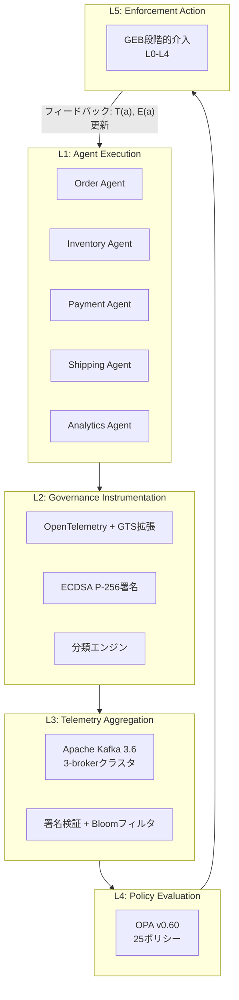
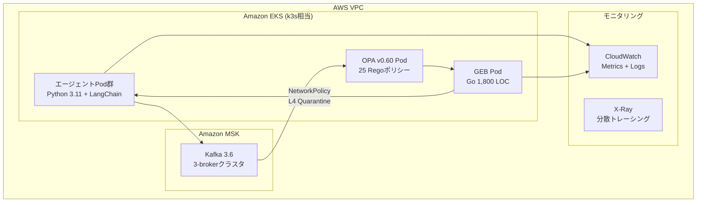

本記事は [https://arxiv.org/abs/2604.05119](https://arxiv.org/abs/2604.05119) の解説記事です。

## 論文概要

本論文は、企業向けマルチエージェントAIシステムにおける「観測はできるが介入できない（observe-but-do-not-act）」ギャップを解消するフレームワーク **GAAT（Governance-Aware Agent Telemetry）** を提案している。著者らのAnshul PathakとNishant Jainは、既存のOpenTelemetryやLangfuseがテレメトリの収集に留まり、ポリシー違反の検出・対処が事後分析に依存している現状を課題として指摘している。GAATは、OpenTelemetryを拡張したガバナンステレメトリスキーマ（GTS）、OPA互換のリアルタイム違反検出（P50=8.4ms）、5段階の段階的介入バス（GEB）、暗号学的な信頼性保証を統合し、98.3%のポリシー違反防止率を達成したと報告している。

この記事は [Zenn記事: MCPサーバー自作で社内データ基盤に認可制御と監査ログを実装する](https://zenn.dev/0h_n0/articles/a2fe642a5473c9) の深掘りです。

## 情報源

| 項目 | 詳細 |
|------|------|
| タイトル | Governance-Aware Agent Telemetry for Closed-Loop Enforcement in Multi-Agent AI Systems |
| 著者 | Anshul Pathak, Nishant Jain |
| arXiv ID | 2604.05119 |
| 公開日 | 2026年4月6日 |
| 分野 | cs.MA (Multi-Agent Systems), cs.LG (Machine Learning) |

## 背景と動機

### observe-but-do-not-actギャップ

企業のマルチエージェントAIシステムでは、1時間あたり数千件のエージェント間インタラクションが発生する（論文より）。現在のオブザーバビリティツール（OpenTelemetry v1.24、Langfuse v2.0、Datadog LLMモニタリング等）は、これらのインタラクションをトレースやスパンとして記録できるが、ポリシー違反の検出は事後分析に委ねられている。

著者らはこの状況を「observe-but-do-not-act（観測はできるが介入できない）」ギャップと呼んでいる。具体的には以下の問題が存在する。

- **事後検出の限界**: 違反がダッシュボード上で可視化されても、データ漏洩やバイアス増幅が完了した後では被害を防げない
- **単一エージェント境界の盲点**: NeMo GuardrailsやGuardAgentは個々のエージェントの入出力を検査するが、複数エージェントをまたぐデータフロー（例: EU PIIが委任チェーンを経て米国管轄のエージェントに到達）の違反を検出できない
- **バイナリ判定の限界**: 既存ツールは許可/拒否の二択であり、違反の重大度に応じた段階的対応ができない

### エンフォースメントが必要な理由

Wang et al. (2024)のマルチエージェントサーベイでは、ガバナンスが未解決課題として明示的に指摘されており、「テレメトリ統合型ガバナンスフレームワーク」の必要性が提唱されている。規制面でも、GDPR、EU AI Act、NIST AI RMFなどが、AIシステムに対するリアルタイムの監視と介入能力を要求する方向に向かっている。

著者らは、オブザーバビリティとエンフォースメントを単一のフレームワークで橋渡しすることで、この課題を解決できると主張している。

## 主要な貢献

GAATフレームワークは以下の4つのコンポーネントで構成される。

### 1. Governance Telemetry Schema (GTS)

OpenTelemetryのスパン・トレースモデルを拡張し、ガバナンス固有の属性を埋め込む。各ガバナンステレメトリイベント（GTE）は以下のタプルで定義される。

$$e = (\tau, a_s, a_r, \text{op}, \text{ctx}, \text{gov})$$

ここで、$$\text{gov} = (\text{classification}, \text{jurisdiction}, \text{sensitivity}, \text{lineage}, \text{verified})$$であり、データ分類（例: EU-PII）、管轄地域、機密度、委任チェーンの来歴（例: $$\langle \text{EU-PII}, a_1 \to a_4 \to a_5, \text{jurisdiction=US} \rangle$$）、検証状態（true/false/unknown）を記録する。

### 2. Real-Time Policy Violation Detection

OPA v0.60互換の宣言的ルール（Rego言語）を使用し、25件のポリシーをリアルタイムに評価する。検出レイテンシはP50=8.4ms、P99=23.1ms（スパン終了から違反シグナルまで）と報告されている。

ポリシー合成には並列合成セマンティクスが採用されている。

$$\pi_1 \| \pi_2 : \text{result} = (\max(a_1, a_2), \max(c_1, c_2))$$

アクションの優先順位は deny >> quarantine >> flag >> allow の順である。

### 3. Governance Enforcement Bus (GEB)

バイナリ（許可/拒否）ではなく、5段階の段階的介入を実行する。Go言語で実装され、約1,800行のコードで構成されている。

### 4. Trusted Telemetry Plane

ECDSA P-256署名、Bloomフィルタによるリプレイ防止、Merkleツリー監査ログにより、テレメトリデータの完全性と否認防止を保証する。

## 技術的詳細

### GAATアーキテクチャ

著者らは5層のリファレンスアーキテクチャを提案している。



閉ループの特徴は、エンフォースメント結果がエージェントの信頼度 $$T(a)$$ と能力セット $$E(a)$$ にフィードバックされる点にある。

### GTSスキーマの詳細

GTEの各フィールドは以下の通りである。

| フィールド | 型 | 説明 |
|-----------|-----|------|
| $$\tau$$ | $$\mathbb{R}^+$$ | タイムスタンプ |
| $$a_s$$ | $$\mathcal{A}$$ | 送信元エージェント |
| $$a_r$$ | $$\mathcal{A}$$ | 受信先エージェント |
| op | Operations | 操作種別 |
| ctx | Context | 操作コンテキスト |
| gov.classification | string | データ分類（例: EU-PII, internal-analytics） |
| gov.jurisdiction | string | 管轄地域 |
| gov.sensitivity | enum | リスクティア |
| gov.lineage | chain | 委任チェーンの来歴 |
| gov.verified | bool/unknown | 検証状態 |

さらに、違反履歴 $$H(a, t) = \{(e_i, \pi_i, t_i) \mid e_i \text{ involves } a, \pi_i(e_i) \neq \text{allow}, t_i \in [t-W, t]\}$$ がウィンドウ $$W$$ 内の非許可判定を追跡する。

### OPAポリシーの実装例（Rego）

論文では25件の宣言的ポリシーが使用されている。以下は、論文で検証された違反タイプに基づくRegoポリシーの実装例である。

```rego
package gaat.policies.data_residency

# EU PIIデータが管轄外に流出することを防止
deny[msg] {
    input.gov.classification == "EU-PII"
    input.gov.jurisdiction != "EU"

    # 委任チェーンの来歴を検査
    lineage := input.gov.lineage
    some i
    lineage.chain[i].jurisdiction != "EU"

    msg := sprintf(
        "DATA_RESIDENCY violation: EU-PII routed to %s jurisdiction via agent %s (lineage: %s)",
        [input.gov.jurisdiction, input.agent_receiver, lineage.chain[i].agent]
    )
}

# バイアス閾値の検査（disparate impact > 0.15で違反）
deny[msg] {
    input.op == "model_inference"
    input.ctx.disparate_impact > 0.15

    msg := sprintf(
        "BIAS_THRESHOLD violation: disparate impact %.3f exceeds threshold 0.15 for agent %s",
        [input.ctx.disparate_impact, input.agent_source]
    )
}

# 同意未取得の検査
deny[msg] {
    input.gov.classification == "EU-PII"
    not input.ctx.consent_verified

    msg := sprintf(
        "CONSENT_MISSING: agent %s processing EU-PII without verified consent",
        [input.agent_source]
    )
}
```

ポリシー合成では、逐次合成（$$\pi_1; \pi_2$$: denyが短絡評価）と並列合成（$$\pi_1 \| \pi_2$$: 最も厳しい結果を採用）の2つのセマンティクスが定義されている。

### GEB段階的介入

GAATの重要な設計上の特徴は、バイナリ（許可/拒否）ではなく、違反の重大度に比例した5段階の介入を行う点である。

| レベル | 名称 | 介入内容 |
|--------|------|----------|
| L0 | ALLOW | 操作を許可、介入なし |
| L1 | ALERT | 通知シグナルを生成 |
| L2 | FLAG | 監査・レビュー用にマーク |
| L3 | REDIRECT | 操作をリルート（例: 別データセンターへ転送） |
| L4 | QUARANTINE | 完全隔離: Kafkaコンシューマグループからの除外、ツールアクセストークンの無効化（$$E(a) \leftarrow \emptyset$$）、Kubernetes NetworkPolicy denyルールの適用 |

エスカレーション関数は以下のように定義されている。

$$\text{escalation}(v, H(a,t)) = \min(4, \text{base}(v) + \lfloor |H(a,t)| / k \rfloor)$$

ここで $$\text{base}(v)$$ は違反タイプごとの基本レベル、$$k$$ はエスカレーション増分あたりの違反閾値（本番環境では $$k=2$$）、$$H(a,t)$$ は違反履歴である。

さらに、サーキットブレーカー機構が実装されている。エージェントがウィンドウ $$W/4$$ 内で $$3k$$ 件の違反を超過した場合、段階的エスカレーションをバイパスし即座にL4 QUARANTINEを適用する。リセットにはオペレータによる手動レビューが必要となる。

### Trusted Telemetry Plane

暗号学的な信頼性保証として、以下のメカニズムが実装されている。

- **署名**: ECDSA P-256（SHA-256ハッシュ）、64ビットCSPRNGノンスによるイベント単位の署名
- **リプレイ防止**: Bloomフィルタ（$$10^7$$エントリ、偽陽性率0.01%、10分ウィンドウ）で99.1%検出
- **省略検出**: 離散時間隠れマルコフモデル（HMM）。8,000件の正常トレース（約40,000 GTE）を12時間かけてBaum-Welch EMアルゴリズム（20イテレーション、収束条件 $$\Delta LL < 10^{-4}$$）で学習し、92.3%の省略検出率を達成
- **改ざん証拠**: SHA-256ベースのMerkleツリー監査ログ

## 実装のポイント

### OpenTelemetryガバナンス拡張（Python）

GAATの実装スタック全体は約4,200行で構成される（Python 3.11 + LangChain、Go GEB、OPA Rego）。以下は、OpenTelemetry Python SDKを拡張してGTSガバナンス属性を埋め込む実装例である。

```python
"""OpenTelemetry GTS拡張: ガバナンス属性のインストルメンテーション"""
from __future__ import annotations

from dataclasses import dataclass, field
from enum import Enum
from typing import Literal

from opentelemetry import trace
from opentelemetry.sdk.trace import TracerProvider
from opentelemetry.sdk.trace.export import BatchSpanProcessor, ConsoleSpanExporter


class Sensitivity(str, Enum):
    """データ機密度のリスクティア分類."""

    LOW = "low"
    MEDIUM = "medium"
    HIGH = "high"
    CRITICAL = "critical"


@dataclass(frozen=True)
class GovernanceAttributes:
    """GTS準拠のガバナンス属性.

    論文のGTEタプル e=(τ, aₛ, aᵣ, op, ctx, gov) における
    gov=(classification, jurisdiction, sensitivity, lineage, verified) に対応する。
    """

    classification: str  # 例: "EU-PII", "internal-analytics"
    jurisdiction: str  # 例: "EU", "US", "JP"
    sensitivity: Sensitivity
    lineage: list[str] = field(default_factory=list)  # 委任チェーン
    verified: Literal[True, False] | None = None  # None = unknown


def create_governance_span(
    tracer: trace.Tracer,
    operation_name: str,
    source_agent: str,
    receiver_agent: str,
    gov: GovernanceAttributes,
) -> trace.Span:
    """ガバナンス属性を含むOpenTelemetryスパンを生成する.

    Args:
        tracer: OpenTelemetry Tracer
        operation_name: 操作名
        source_agent: 送信元エージェントID
        receiver_agent: 受信先エージェントID
        gov: ガバナンス属性

    Returns:
        ガバナンス属性が設定されたSpan
    """
    span = tracer.start_span(operation_name)
    # 標準OpenTelemetry属性
    span.set_attribute("gaat.agent.source", source_agent)
    span.set_attribute("gaat.agent.receiver", receiver_agent)
    # GTS拡張: ガバナンス属性
    span.set_attribute("gaat.gov.classification", gov.classification)
    span.set_attribute("gaat.gov.jurisdiction", gov.jurisdiction)
    span.set_attribute("gaat.gov.sensitivity", gov.sensitivity.value)
    span.set_attribute("gaat.gov.lineage", ",".join(gov.lineage))
    if gov.verified is not None:
        span.set_attribute("gaat.gov.verified", gov.verified)
    return span


def setup_gaat_tracer(service_name: str = "gaat-agent") -> trace.Tracer:
    """GAAT対応のTracerProviderをセットアップする."""
    provider = TracerProvider()
    processor = BatchSpanProcessor(ConsoleSpanExporter())
    provider.add_span_processor(processor)
    trace.set_tracer_provider(provider)
    return trace.get_tracer(service_name)


# 使用例
if __name__ == "__main__":
    tracer = setup_gaat_tracer()
    gov_attrs = GovernanceAttributes(
        classification="EU-PII",
        jurisdiction="EU",
        sensitivity=Sensitivity.HIGH,
        lineage=["order-agent", "payment-agent", "analytics-agent"],
        verified=True,
    )
    with create_governance_span(
        tracer, "process_payment", "order-agent", "payment-agent", gov_attrs
    ) as span:
        span.set_attribute("gaat.operation.type", "data_transfer")
```

### OPAポリシー統合（Python + Rego）

OPAサーバーとの統合により、GTEに対するリアルタイムポリシー評価を実現する。

```python
"""OPA連携: GTEに対するリアルタイムポリシー評価."""
from __future__ import annotations

import time
from dataclasses import asdict, dataclass
from typing import Any

import httpx


@dataclass
class PolicyDecision:
    """OPAポリシー評価結果."""

    allowed: bool
    violations: list[str]
    enforcement_level: int  # L0-L4
    latency_ms: float


class GAATPolicyEvaluator:
    """OPA v0.60互換のポリシー評価クライアント.

    論文のL4層（Policy Evaluation）に対応し、
    P50=8.4ms, P99=23.1msの検出レイテンシを目標とする。
    """

    def __init__(self, opa_url: str = "http://localhost:8181") -> None:
        self.opa_url = opa_url
        self.client = httpx.Client(timeout=0.2)  # 200ms SLA

    def evaluate(self, gte: dict[str, Any]) -> PolicyDecision:
        """GTEに対して全ポリシーを並列評価する.

        Args:
            gte: Governance Telemetry Event

        Returns:
            PolicyDecision with enforcement level
        """
        start = time.monotonic()
        response = self.client.post(
            f"{self.opa_url}/v1/data/gaat/policies",
            json={"input": gte},
        )
        latency_ms = (time.monotonic() - start) * 1000
        result = response.json().get("result", {})
        violations = result.get("deny", [])
        return PolicyDecision(
            allowed=len(violations) == 0,
            violations=violations,
            enforcement_level=self._compute_enforcement_level(
                violations, gte
            ),
            latency_ms=latency_ms,
        )

    def _compute_enforcement_level(
        self,
        violations: list[str],
        gte: dict[str, Any],
    ) -> int:
        """エスカレーション関数: escalation(v, H(a,t)) = min(4, base(v) + |H|/k).

        論文ではk=2（本番環境）。
        """
        if not violations:
            return 0  # L0: ALLOW
        k = 2
        base_level = self._get_base_level(violations)
        history_count = len(gte.get("violation_history", []))
        return min(4, base_level + history_count // k)

    @staticmethod
    def _get_base_level(violations: list[str]) -> int:
        """違反タイプに基づく基本レベルの決定."""
        severity_map = {
            "DATA_RESIDENCY": 2,
            "CONSENT_MISSING": 2,
            "BIAS_THRESHOLD": 1,
            "UNAUTHORIZED_ACCESS": 3,
        }
        max_level = 0
        for v in violations:
            for key, level in severity_map.items():
                if key in v:
                    max_level = max(max_level, level)
        return max_level
```

## 本番デプロイメントガイド

### AWSデプロイメントパターン

論文では、5エージェント構成で月額約180ドル、50エージェント構成で月額約720ドルのAWSコストが報告されている。以下に、論文のアーキテクチャをAWS上で実現するための構成を示す。

#### インフラストラクチャ構成



#### Terraformによるコア構成

```hcl
# Amazon MSK (Kafka 3.6クラスタ) - L3: Telemetry Aggregation
resource "aws_msk_cluster" "gaat_telemetry" {
  cluster_name           = "gaat-telemetry-bus"
  kafka_version          = "3.6.0"
  number_of_broker_nodes = 3

  broker_node_group_info {
    instance_type   = "kafka.m5.large"
    client_subnets  = var.private_subnet_ids
    security_groups = [aws_security_group.msk.id]

    storage_info {
      ebs_storage_info {
        volume_size = 100
      }
    }
  }

  encryption_info {
    encryption_in_transit {
      client_broker = "TLS"
      in_cluster    = true
    }
  }

  tags = {
    Component = "gaat-l3-aggregation"
  }
}

# OPA Pod用のEKS Deployment - L4: Policy Evaluation
resource "kubernetes_deployment" "opa_policy_engine" {
  metadata {
    name      = "gaat-opa-engine"
    namespace = "gaat-system"
  }

  spec {
    replicas = 2

    selector {
      match_labels = {
        app = "gaat-opa"
      }
    }

    template {
      metadata {
        labels = {
          app = "gaat-opa"
        }
      }

      spec {
        container {
          name  = "opa"
          image = "openpolicyagent/opa:0.60.0"
          args  = ["run", "--server", "--bundle", "/policies"]

          port {
            container_port = 8181
          }

          resources {
            requests = {
              cpu    = "500m"
              memory = "512Mi"
            }
            limits = {
              cpu    = "1000m"
              memory = "1Gi"
            }
          }

          volume_mount {
            name       = "rego-policies"
            mount_path = "/policies"
          }
        }

        volume {
          name = "rego-policies"
          config_map {
            name = "gaat-rego-policies"
          }
        }
      }
    }
  }
}

# GEB用のKubernetes NetworkPolicy - L4 Quarantine実装
resource "kubernetes_network_policy" "gaat_quarantine" {
  metadata {
    name      = "gaat-quarantine-deny-all"
    namespace = "gaat-system"
  }

  spec {
    pod_selector {
      match_labels = {
        "gaat.enforcement" = "quarantined"
      }
    }

    # L4 QUARANTINE: 全通信を遮断
    policy_types = ["Ingress", "Egress"]
  }
}
```

#### モニタリング設計

論文のスケーリング特性（Table III）に基づき、以下のメトリクスを監視する。

| メトリクス | 閾値 | アクション |
|-----------|------|----------|
| 検出レイテンシ P99 | 200ms超過 | OPAレプリカのスケールアウト |
| Kafkaコンシューマラグ | 1,000イベント超過 | ブローカー追加検討 |
| CPU使用率 | 8.9コア超過（50エージェント時） | ノード追加 |
| メモリ使用量 | 21.5GB超過（50エージェント時） | メモリ増設 |
| VPR | 95%未満 | ポリシー見直し・HMM再学習 |
| FPR | 2%超過 | リスクティア別閾値の調整 |

論文ではCPU使用量が5エージェントで4.4コア、50エージェントで8.9コアと報告されており、$$O(n) + O(1)$$のスケーリング特性を示している。レイテンシもP50が62ms（5エージェント）から131ms（50エージェント）へと線形に増加する。

#### コスト見積もり

論文の報告値に基づくAWSコスト概算は以下の通りである。

| 構成 | 月額コスト（論文報告値） | 主要コスト要因 |
|------|----------------------|--------------|
| 5エージェント | 約$180/月 | MSK 3-broker、EKS 3-node |
| 25エージェント | 約$400/月（推定） | MSKスケールアウト |
| 50エージェント | 約$720/月 | フルスケール構成 |

## 実験結果

### 評価構成

著者らは、ECサイトワークフローを模した5つのLLMベースエージェント（Order、Inventory、Payment、Shipping、Analytics）を構築した。1つのエージェントにデータレジデンシ違反を意図的に設定し、5%の違反注入率（500操作/ラン、25件の意図的違反）で10回の独立実行（合計5,000フロー）を行っている。

### 比較評価（Table I）

| システム | VPR (%) | 検出レイテンシ | FPR (%) | 特徴 |
|---------|---------|-------------|---------|------|
| GAAT | 98.3 (±0.7) | P50=8.4ms | 0.9 | 閉ループ、段階的介入 |
| NeMo Guardrails (ABG) | 78.8 | 45ms | 4.2 | エージェント境界のみ |
| Centralized Gateway | 89.4 | 340ms | 1.8 | ゲートウェイ集中型 |
| Cedar | 76.8 | 112ms | 2.5 | エンティティベース認可 |
| OTel+Dashboard | 27.1 | 15.2s | 0.0 | 事後分析のみ |

VPR（Violation Prevention Rate）は「注入された違反のうち防止できた割合」を示す。統計的検証として、全ベースラインに対するWilcoxon signed-rank検定でp<0.001が確認されている。F1スコアの95%信頼区間は[97.8%, 99.1%]、スループットは[21,203, 24,391]イベント/秒と報告されている。

OpenTelemetry+Dashboardの27.1%は、事後分析アプローチの限界を如実に示している。NeMo Guardrailsの78.8%は、単一エージェント境界での検査では複数エージェントをまたぐ違反を検出できないことに起因する。

### 本番環境評価

48時間の本番運用（12,000件の実証トレース）では99.7%のVPRを達成した。残りの0.3%（37件の違反）の内訳は以下の通りである。

- 約40%: タイミングエッジケース（エンフォースメントが完了の2ms以内）
- 約35%: 曖昧なPII分類（信頼度0.48-0.52の境界領域）
- 約25%: 不完全な来歴チェーン（エージェントタイムアウト・切り捨て）

### セキュリティ評価（Table II）

| 攻撃タイプ | 検出率 | バイパス率 | オーバーヘッド |
|-----------|--------|----------|-------------|
| 偽造（Forgery） | 98.7% | 1.3% | 12ms |
| リプレイ（Replay） | 99.1% | 0.9% | 8ms |
| 省略（Omission） | 92.3% | 7.7% | 0ms |

省略検出の7.7%のエスケープ率は、新規のエージェント行動パターン（リトライ・フォールバックシーケンス）がHMMの学習データに含まれていなかったことに起因すると報告されている。

### 違反率感度分析（Table IV）

| 違反率 | VPR (%) | 平均介入レベル |
|--------|---------|-------------|
| 0.1% | 99.92 | L1.0 |
| 1.0% | 99.71 | L1.4 |
| 5.0% | 98.24 | L2.3 |
| 7.5% | 97.15 | L2.8 |
| 10.0% | 95.83 | L3.2 |

違反率が上昇すると平均介入レベルも段階的に上がり、GAATのエスカレーション機構が設計通りに機能していることが確認できる。

## 実運用への応用

### マルチエージェントシステムのガバナンス設計

GAATの段階的介入モデルは、本番環境でのマルチエージェントシステム運用に直接適用可能である。特に以下の点が実務上の価値が高い。

**リスクティア別閾値設計**: 著者らは、初期プロトタイプで全リスクティアに単一の分類信頼度閾値を適用した結果、FPRが6%を超えたと報告している。リスクティア別に閾値を分離（高リスク: fail-closed、中リスク: redirect、低リスク: alert）することで0.9%まで低減できた。この教訓は、ガバナンスポリシーの設計において重要である。

**サーキットブレーカーパターン**: $$W/4$$ウィンドウ内で$$3k$$回の違反を超えた場合に即座にL4隔離を適用するサーキットブレーカーは、暴走エージェントへの迅速な対応を可能にする。リセットにオペレータの手動レビューを要求する設計は、自動化と人間の監視のバランスを取っている。

**OPA/Rego標準の活用**: GAATがOPA互換のRegoポリシーを採用していることで、クラウドネイティブ環境で既にOPAを使用している組織は、既存のポリシーインフラをAIガバナンスに拡張できる。

### 適用時の留意点

- **コールドスタート問題**: HMMの学習に12時間の正常運用データが必要であり、新規デプロイ時は省略検出が機能しない
- **フレームワーク依存**: 現時点の検証はLangChainのみであり、AutoGen・CrewAIへの移植は未検証
- **スケール限界**: 50エージェント超の構成は未検証であり、論文のスケーリング特性がそのまま外挿できるかは不明

## 関連研究

著者らは、GAATを以下の3つの研究領域の交差点に位置づけている。

**オブザーバビリティプラットフォーム**: OpenTelemetry v1.24（GenAI向けセマンティック規約あり）、Langfuse v2.0、Datadogは、テレメトリの収集・可視化を提供するが、エンフォースメント機能を持たない。

**ポリシーフレームワーク**: GAOP（Kulkarni 2025）はOTelコレクタにコンプライアンスを組み込むが、マルチエージェント来歴追跡と段階的介入を欠く。NeMo Guardrails v0.9.0はColang 2.0によるエージェント単位の入出力検査を提供するが、クロスエージェント委任違反を検出できない。GuardAgentは専用ガードエージェントによる推論を行うが、200-500msのLLMレイテンシが加算される。AgentSpecはDSLベースの単一エージェント軌跡検証であり、クロスエージェント協調を欠く。AWS Cedar v2.4はエンティティベースの宣言的認可を提供するが、AI固有のガバナンスセマンティクスがなく76.8%のカバレッジに留まる。

**ランタイム検証**: Leucker & Schallhart (2009)のランタイム検証基盤、Havelund & Rosu (2004)のサブミリ秒安全性監視（決定的システムを前提）、MOP（Chen & Rosu 2007）の仕様駆動ランタイム監視が基礎となっている。

## まとめ

GAATフレームワークは、マルチエージェントAIシステムにおけるオブザーバビリティとエンフォースメントの間のギャップを閉じる試みである。OpenTelemetryの拡張（GTS）、OPA互換のリアルタイムポリシー評価（P50=8.4ms）、5段階の段階的介入（GEB）、暗号学的信頼性保証の4つのコンポーネントにより、98.3%のVPRと0.9%のFPRを達成している。

特に、バイナリ（許可/拒否）ではなく段階的介入を採用した点、クロスエージェントの来歴追跡により単一エージェント境界では検出できない違反を捕捉できる点は、実用上の価値が高い。一方で、5エージェント・5,000フローという概念実証レベルの評価規模、LangChain単一フレームワークでの検証、HMMのコールドスタート問題など、実運用への適用に際しては追加の検証が必要である。

著者らは今後の方向性として、適応的ポリシー学習、カーネルレベルエンフォースメント（seccomp-BPF、eBPF）、マルチフレームワーク検証を挙げている。

## 参考文献

1. Pathak, A., & Jain, N. (2026). Governance-Aware Agent Telemetry for Closed-Loop Enforcement in Multi-Agent AI Systems. arXiv:2604.05119.
2. OpenTelemetry v1.24. Semantic Conventions for GenAI. [https://opentelemetry.io/](https://opentelemetry.io/)
3. Open Policy Agent (OPA) v0.60. [https://www.openpolicyagent.org/](https://www.openpolicyagent.org/)
4. Langfuse v2.0. Open-source LLM Tracing. [https://langfuse.com/](https://langfuse.com/)
5. NVIDIA NeMo Guardrails v0.9.0. [https://github.com/NVIDIA/NeMo-Guardrails](https://github.com/NVIDIA/NeMo-Guardrails)
6. AWS Cedar v2.4. [https://www.cedarpolicy.com/](https://www.cedarpolicy.com/)
7. Wang, L. et al. (2024). A Survey on Large Language Model based Autonomous Agents. Frontiers of Computer Science.
8. Kulkarni (2025). GAOP: Governance-Aware Observability Pipeline.
9. Leucker, M. & Schallhart, C. (2009). A brief account of runtime verification. Journal of Logic and Algebraic Programming.
10. Chen, F. & Rosu, G. (2007). MOP: An efficient and generic runtime verification framework. OOPSLA.
