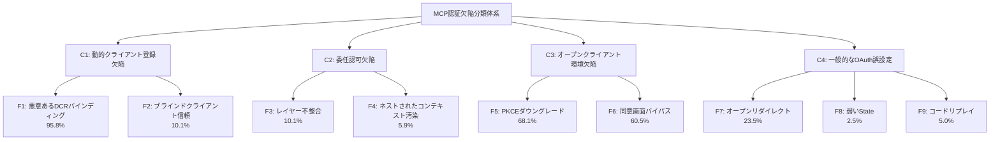
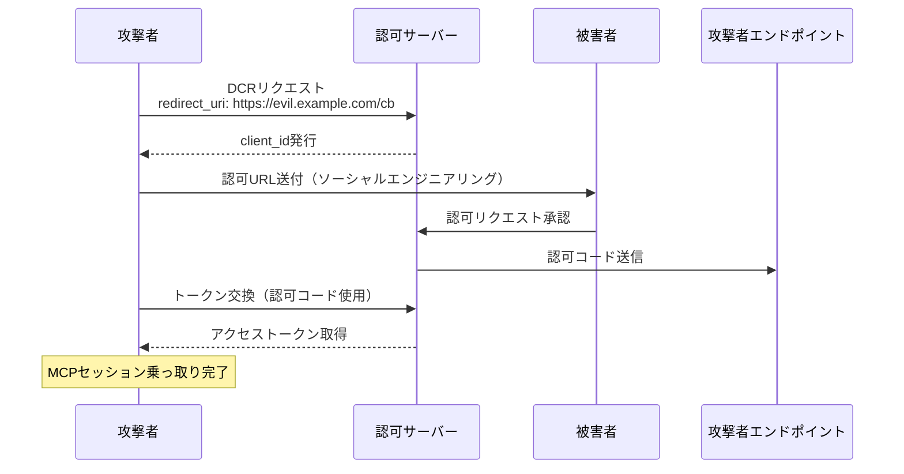
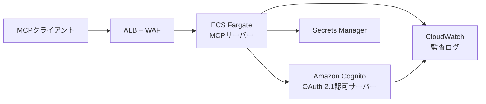

本記事は [https://arxiv.org/abs/2605.22333](https://arxiv.org/abs/2605.22333) の解説記事です。

## 論文概要

本論文は、実運用環境で稼働するリモートMCPサーバーの認証セキュリティを初めて体系的に計測した研究である。著者らは、FOFAおよびShodanを用いて7,973台のアクティブなリモートMCPサーバーを特定し、そのうち40.55%が認証なしでツールを公開していることを報告している。OAuth認証を実装する119台のサーバーを詳細にテストした結果、全サーバーに少なくとも1件の認証上の欠陥が存在し、合計325件の脆弱性が検出された。特に動的クライアント登録（DCR）の欠陥は96.6%のサーバーで確認され、責任ある脆弱性開示を通じて9件のCVEが割り当てられた。

この記事は [Zenn記事: MCPサーバー自作で社内データ基盤に認可制御と監査ログを実装する](https://zenn.dev/0h_n0/articles/a2fe642a5473c9) の深掘りです。Zenn記事ではMCPサーバーの認可制御を実装する方法を解説していますが、本論文はその前提となる「実運用MCPサーバーの認証がどの程度安全なのか」を定量的に明らかにしています。

## 情報源

| 項目 | 詳細 |
|------|------|
| タイトル | A First Measurement Study on Authentication Security in Real-World Remote MCP Servers |
| 著者 | Huijun Zhou, Xiaohan Zhang, Haozhe Zhang, Haoyang Zhang, Mi Zhang, Min Yang |
| arXiv ID | 2605.22333 |
| 公開日 | 2026年5月21日 |
| 分野 | cs.CR (Cryptography and Security) |

## 背景と動機

### MCPにおけるOAuth認証の位置づけ

Model Context Protocol（MCP）は、LLMエージェントと外部サービスを接続するオープンプロトコルとして急速に普及している。ローカル実行のMCPサーバーとは異なり、リモートMCPサーバーはインターネット経由でアクセスされるため、認証・認可メカニズムが不可欠である。MCP仕様は2025年3月のアップデートでOAuth 2.1をMUST要件として導入し、以降も段階的に仕様を強化してきた。

著者らは、MCP仕様の認証要件の進化を以下のように整理している：

- **2024年11月**: 初期リリース。認証要件なし
- **2025年3月**: OAuth 2.1を必須フレームワークとして導入。PKCE付きAuthorization Code Grantを要求。動的クライアント登録（DCR）をSHOULD推奨
- **2025年6月**: Protected Resource Metadata対応を追加。OAuth 2.0 Resource Indicatorsを必須化
- **2025年11月**: 安定版リリース。Client ID Metadata Documents（CIMD）をDCRより優先する方針に転換

### 計測研究の必要性

MCP固有のセキュリティ脅威に関する先行研究は存在するものの、その多くは理論的な脅威分類やツールポイズニング攻撃に焦点を当てており、実運用サーバーの認証実装を大規模に計測した研究は存在しなかった。著者らは、MCP固有の3つのデプロイ特性（オープンクライアント環境、動的クライアント登録、委任認可）が従来のOAuthセキュリティモデルとは異なる攻撃面を生むと指摘し、実態調査の必要性を論じている。

## 主要な貢献

著者らの貢献は以下の3点に集約される：

1. **大規模計測**: FOFA・Shodanを用いた発見パイプラインにより7,973台のアクティブなリモートMCPサーバーを特定し、認証採用状況を定量化。40.55%が認証なし、30.45%がOAuth、29.00%が静的トークン/APIキーを使用
2. **脆弱性分類体系の確立**: MCP固有の3カテゴリ（C1: DCR欠陥、C2: 委任認可欠陥、C3: オープンクライアント環境欠陥）と従来のOAuth誤設定（C4）を含む4カテゴリ9タイプの欠陥分類を構築
3. **実証と開示**: 119台のOAuth対応サーバーで325件の欠陥を検出し、責任ある開示を通じて9件のCVEを取得。機密情報漏洩やアカウント乗っ取りにつながる攻撃チェーンを実証

## 技術的詳細

### サーバー発見パイプライン

著者らは2段階のパイプラインでリモートMCPサーバーを発見・検証している。

**第1段階: 候補発見**

FOFAおよびShodanの2つのサイバーセキュリティ検索エンジンを使用し、以下のシグナルを組み合わせて候補を収集した：

- 識別子ベース: `mcp-session-id`、`mcp-version`ヘッダー、MCPホスト名
- プロトコルレベル: `tools/call`、`tools/list`、`initialize`ペイロード中の`jsonrpc`文字列
- ノイズ除去: `text/html`等の通常のフロントエンド応答を除外

重複排除後、28,715件のユニークなエンドポイントが候補として得られた。

**第2段階: アクティブ検証**

各候補に対してMCPハンドシェイクリクエストを送信し、有効なJSON-RPCレスポンスを返すサーバーのみを有効と判定した。この結果、7,973台がアクティブなリモートMCPサーバーとして確認された。100台をサンプリングした手動検証では偽陽性率1%であったと報告されている。

### 欠陥分類体系（4カテゴリ・9タイプ）

著者らが構築した欠陥分類体系を以下に示す。



各欠陥タイプの詳細は以下の通りである。

#### C1: 動的クライアント登録（DCR）欠陥

**F1 - 悪意あるDCRバインディング（95.8%）**: 認可サーバーがDCRエンドポイントを公開し、匿名のリクエスト元から任意の`redirect_uri`を受け入れる。攻撃者は自身が制御するコールバックURLを持つクライアントを登録し、正規の`client_id`を取得できる。

**F2 - ブラインドクライアント信頼（10.1%）**: 認可サーバーが提供された`client_id`を事前登録の検証なしに受け入れる。攻撃者は既知のアプリケーションIDを偽装して認可リクエストを構築できる。

#### C2: 委任認可欠陥

**F3 - レイヤー不整合（10.1%）**: 第1ホップのMCP認可ではPKCEを要求するが、上流の認可サーバーへのリクエストではPKCEが省略される。エンドツーエンドのリクエスト-トークンバインディングが破壊される。

**F4 - ネストされたコンテキスト汚染（5.9%）**: MCPサーバーが下流のルーティング状態（`redirect_uri`）を上流OAuthの`state`パラメータ内に完全性保護なしでエンコードする。攻撃者がルーティングコンテキストを改ざんし、認可コードを攻撃者のエンドポイントにリダイレクトできる。81台の委任認可サーバーのうち40台（49.4%）でネストされた`state`パラメータの使用が確認された。

#### C3: オープンクライアント環境欠陥

**F5 - PKCEダウングレード（68.1%）**: 認可サーバーが`code_challenge`なしのリクエストを受け入れるか、安全でない`plain`メソッドを許可する。OAuch（2022年）の先行研究でもPKCE対応プロバイダーの43%がダウングレードに対して脆弱であったと報告されており、MCP環境でも同様の問題が広範に存在する。

**F6 - 同意画面バイパス（60.5%）**: 認可サーバーが同意画面に`redirect_uri`を表示しない。ユーザーは認可コードがどこに送信されるかを確認できず、悪意あるリクエストを意図せず承認してしまう。

#### C4: 一般的なOAuth誤設定

**F7 - オープンリダイレクト（23.5%）**: `redirect_uri`の検証が不十分で、攻撃者ドメインへの置換が可能。15台が完全な攻撃者ドメインへの置換を許可し、13台がIPアドレスの10進数表記等のより弱い形式を受け入れた。

**F8 - 弱いState（2.5%）**: `state`パラメータの欠落、固定値、予測可能な値によりCSRF保護が無効化される。

**F9 - コードリプレイ（5.0%）**: 認可コードが初回の引き換え後も有効なまま残る。

### 攻撃フローの実証

著者らは3つのケーススタディで攻撃チェーンを実証している。以下にケーススタディ1（悪意あるDCR登録）の攻撃フローを示す。



ケーススタディ2では、委任認可における`state`パラメータ内のネストされた`redirect_uri`を改ざんする攻撃が実証されている。攻撃者は正規の認可リクエストの`state`パラメータをデコードし、内部の`redirect_uri`を攻撃者ドメインに書き換えて再エンコードする。MCPサーバーが`state`の完全性を検証しないため、認可コードが攻撃者に漏洩する。

ケーススタディ3では、オープンリダイレクト（F7）とPKCEダウングレード（F5）の組み合わせにより、アカウント乗っ取りが成立することが実証されている（CVE-2025-69898）。

### 検出フレームワーク

著者らは、受動的トラフィック検査と能動的動的プロービングを組み合わせた4段階の検出パイプラインを構築した：

1. **トラフィック識別**: Burp Suiteプラグインを用いてOAuthトラフィックを抽出し、レイヤー推論を実行
2. **ライフサイクルモデリング**: 認可リクエスト、コールバック、トークン交換を関連付け
3. **受動的評価**: PKCE一貫性、ダウングレード、`state`検証をトラフィックから判定
4. **能動的プロービング**: DCR、クライアントスプーフィング、コンテキスト汚染、リダイレクト操作、コードリプレイを実行

VSCode Copilotをクライアントとして使用し、OAuthScanを拡張したカスタムBurp Suiteプラグインで検出を自動化している。検出精度は379件のアラートから325件の真陽性（精度85.75%）、偽陰性1件（再現率99.69%）であった。

## 実装のポイント

本論文の知見に基づき、安全なMCPサーバー認証を実装する際の要点を示す。

### PKCE検証の実装（F5対策）

```python
"""PKCE検証: S256のみ許可し、plainメソッドを拒否する."""

import hashlib
import base64


def validate_pkce(
    code_verifier: str,
    code_challenge: str,
    method: str,
) -> bool:
    """PKCE code_challengeを検証する."""
    if method != "S256":
        raise ValueError(f"Only S256 allowed, got: {method}")

    digest = hashlib.sha256(code_verifier.encode("ascii")).digest()
    computed = base64.urlsafe_b64encode(digest).rstrip(b"=").decode("ascii")
    return computed == code_challenge
```

### DCR制限とredirect_uri検証（F1・F7対策）

```python
"""DCR登録時のredirect_uri許可リスト検証."""

from urllib.parse import urlparse


def validate_redirect_uri(
    redirect_uri: str,
    allowed_patterns: list[str],
) -> bool:
    """redirect_uriを許可パターンで検証する."""
    parsed = urlparse(redirect_uri)

    # HTTPS強制（localhostを除く）
    if parsed.hostname not in ("localhost", "127.0.0.1"):
        if parsed.scheme != "https":
            return False

    # 許可パターンとの完全一致
    return any(
        redirect_uri == p or redirect_uri.startswith(p + "/")
        for p in allowed_patterns
    )
```

### 委任認可のstate保護（F4対策）

`state`パラメータにルーティング情報を埋め込むのではなく、サーバーサイドでopaque tokenとマッピングを管理する。

```python
"""委任認可のstate管理: コンテキスト汚染を防止する."""

import secrets


class StateManager:
    """stateパラメータのサーバーサイド管理."""

    def __init__(self) -> None:
        self._store: dict[str, str] = {}

    def create_state(self, downstream_redirect_uri: str) -> str:
        """opaque stateトークンを生成しコンテキストを保存する."""
        token = secrets.token_urlsafe(32)
        self._store[token] = downstream_redirect_uri
        return token

    def resolve_state(self, token: str) -> str | None:
        """stateを解決し使用済みとして削除する（1回限り）."""
        return self._store.pop(token, None)
```

## 本番デプロイガイド

### AWSにおけるセキュアMCPサーバーアーキテクチャ

本論文の知見を踏まえた本番環境のAWSアーキテクチャパターンを示す。



**ALB + AWS WAF**: WAFルールで不正な`redirect_uri`パターンをフィルタリングし、F7（オープンリダイレクト）を防止する。**ECS Fargate**: コンテナイメージにクレデンシャルを含めず、Secrets Managerから実行時に取得する。**Amazon Cognito**: OAuth 2.1認可サーバーとして使用し、PKCE（S256）を強制。DCRを無効化してアプリクライアントの手動登録を強制できる。

#### Terraform構成例（Cognito）

```hcl
resource "aws_cognito_user_pool_client" "mcp_client" {
  name         = "mcp-server-client"
  user_pool_id = aws_cognito_user_pool.mcp_auth.id

  # Authorization Code Grant + PKCEのみ許可
  allowed_oauth_flows                  = ["code"]
  allowed_oauth_flows_user_pool_client = true
  allowed_oauth_scopes                 = ["openid", "profile"]

  # redirect_uriの厳格な制限（F1, F7対策）
  callback_urls = ["https://mcp.example.com/callback"]

  # トークン有効期限の短縮
  access_token_validity  = 15  # 15分
  refresh_token_validity = 1   # 1日

  token_validity_units {
    access_token  = "minutes"
    refresh_token = "days"
  }

  generate_secret = true
}
```

#### 監視項目

| 監視項目 | 対応する欠陥 | アラート閾値 |
|---------|------------|-----------|
| DCRリクエスト数/分 | F1 | 10件/分超過 |
| 未知redirect_uriへのリダイレクト | F7 | 1件/時間 |
| PKCE未使用の認可リクエスト | F5 | 全件アラート |
| 同一認可コードの複数回使用 | F9 | 全件アラート |
| state不整合の検出 | F4, F8 | 全件アラート |

#### セキュリティチェックリスト

- [ ] DCRエンドポイントの無効化、またはドメイン許可リストによる制限
- [ ] PKCEのS256メソッドのみ許可（plainメソッド拒否）
- [ ] `redirect_uri`の完全一致検証
- [ ] 同意画面での`redirect_uri`表示
- [ ] 認可コードの1回限りの使用制限
- [ ] `state`パラメータのサーバーサイド管理
- [ ] アクセストークンの短い有効期限（15分以下推奨）
- [ ] CloudWatchによる認証イベントの監査ログ記録

## 実験結果

### サーバー全体の認証採用状況

著者らが発見した7,973台のリモートMCPサーバーの認証方式の分布は以下の通りである。

| 認証方式 | サーバー数 | 割合 |
|---------|----------|------|
| 認証なし | 3,233 | 40.55% |
| OAuth | 2,428 | 30.45% |
| 静的トークン/APIキー | 2,312 | 29.00% |
| **合計** | **7,973** | **100%** |

40.55%のサーバーが認証なしでツールを公開しているという事実は、MCPエコシステムのセキュリティ成熟度がまだ初期段階にあることを示している。著者らは、認証なしのサーバーの中にCRM（顧客関係管理）ツールが含まれ、5,000件以上の企業顧客レコード（氏名、メールアドレス、電話番号、物理アドレス）が公開されている事例（CVE-2025-61510）を報告している。

### OAuth対応サーバーのデプロイ特性

119台のテスト可能なOAuthサーバーのデプロイ特性は以下の通りである。

| 特性 | サーバー数 | 割合 |
|------|----------|------|
| オープンクライアント環境 | 119 | 100% |
| 動的クライアント登録 | 119 | 100% |
| 委任認可 | 81 | 68.07% |

全サーバーがオープンクライアント環境（デスクトップアプリ、IDE、CLIツール等）で動作し、`client_secret`の安全な保護ができない状態である。また、全サーバーがDCRをサポートしており、クライアント登録フェーズが攻撃面となっている。

### カテゴリ別欠陥検出結果

| カテゴリ | 説明 | 該当サーバー数 | 割合 |
|---------|------|-------------|------|
| C1 | 動的クライアント登録欠陥 | 115 | 96.6% |
| C2 | 委任認可欠陥 | 18 | 15.1% |
| C3 | オープンクライアント環境欠陥 | 102 | 85.7% |
| C4 | 一般的なOAuth誤設定 | 34 | 28.6% |

C1（DCR欠陥）が96.6%と最も多く、著者らはこれをMCPの仕様がDCRをSHOULD推奨としていたことに起因すると分析している。C3（オープンクライアント環境欠陥）も85.7%と高く、PKCEの不徹底と同意画面の不備が広範に存在する。

### 欠陥タイプ別の詳細

| 欠陥タイプ | 説明 | 該当数 | 割合 |
|-----------|------|--------|------|
| F1 | 悪意あるDCRバインディング | 114 | 95.8% |
| F2 | ブラインドクライアント信頼 | 12 | 10.1% |
| F3 | レイヤー不整合 | 12 | 10.1% |
| F4 | ネストされたコンテキスト汚染 | 7 | 5.9% |
| F5 | PKCEダウングレード | 81 | 68.1% |
| F6 | 同意画面バイパス | 72 | 60.5% |
| F7 | オープンリダイレクト | 28 | 23.5% |
| F8 | 弱いState | 3 | 2.5% |
| F9 | コードリプレイ | 6 | 5.0% |
| **合計** | | **325** | |

F1（悪意あるDCRバインディング）が95.8%と突出して高い。著者らは、これがOAuthライブラリのデフォルト設定に起因しており、開発者がDCRを有効にするだけで脆弱な設定が生まれると指摘している。F5（PKCEダウングレード）の68.1%は、MCP仕様がPKCEをSHOULDレベルの推奨としていたことと関連している。

### 検出フレームワークの性能

| 指標 | 値 |
|------|-----|
| アラート総数 | 379 |
| 真陽性 | 325 |
| 偽陽性 | 54 |
| 偽陰性 | 1 |
| 精度 | 85.75% |
| 再現率 | 99.69% |

偽陽性54件のうち43件はリダイレクトの深層トランケーション（5ホップ制限）に起因し、11件はバックグラウンドトラフィックのノイズによるものであった。

### 割り当てられたCVE

責任ある開示を通じて以下の9件のCVEが割り当てられた：

| CVE ID | 概要 |
|--------|------|
| CVE-2025-61510 | 認証なしCRMサーバー: 5,000件以上の顧客レコード公開 |
| CVE-2025-69898 | オープンリダイレクト + PKCEダウングレードの組み合わせ |
| CVE-2026-26384 ~ CVE-2026-26390 | 悪意あるDCRバインディング関連（7件） |

## 実運用への応用

### MCPサーバー開発者への推奨事項

本論文の結果は、MCPサーバーを実運用する開発者に対して以下の具体的な対策を示唆している。

**認可サーバー側**:

1. **DCRの制限または廃止**: DCRエンドポイントを公開する場合は、`redirect_uri`の許可パターンを厳格に制限する。可能であればClient ID Metadata Documents（CIMD）に移行する
2. **PKCEのサーバーサイド強制**: `code_challenge`が存在しないリクエストを拒否し、`code_challenge_method`は`S256`のみを受け入れる
3. **同意画面の改善**: `redirect_uri`を必ず同意画面に表示し、localhostコールバックに対しては追加の警告を提示する
4. **認可コードの使い捨て**: 初回の引き換え後に即座に無効化する

**MCPサーバー（委任認可）側**:

1. **stateパラメータのサーバーサイド管理**: ルーティング情報をクライアント側の`state`パラメータに埋め込まず、サーバーサイドのopaque tokenとマッピングで管理する
2. **レイヤー間のPKCE一貫性**: 上流認可サーバーへのリクエストでもPKCEを必ず使用する

**MCP仕様策定者への提言**:

著者らは、MCP仕様の以下の変更を提言している：

- PKCEの`S256`メソッド強制をSHOULDからMUSTに引き上げ
- DCRの`redirect_uri`制限をSHOULDからMUSTに引き上げ
- CIMDの推奨レベルをMAYからRECOMMENDEDに引き上げ
- DCRを高リスクメカニズムとして明示的に分類

## 関連研究

MCPのセキュリティに関する先行研究として、Hou et al.が4種類の攻撃者タイプにまたがる16の脅威分類を提案している。Gaire et al.はMCPのセキュリティと安全性に関する知識の体系化を行った。ツール層の研究として、1,899サーバーの5.5%でツールポイズニングが確認された研究や、ツールチェーン攻撃に関する研究がある。Huang et al.はMCPデプロイにおける呼び出し元ID混乱の問題を、PrakashはAgent Identity Protocolによる検証済み委任を提案している。

OAuth全般のセキュリティ研究として、Fett et al.（2016, 2017, 2019）によるOAuth 2.0およびOpenID Connectの形式分析、Hosseyni et al.によるOAuth派生プロトコルへのaudience injection攻撃の研究がある。特にPhilippaerts（2022）のOAuchによる実証研究は、100のOAuth IdPのうち97件で脅威が未緩和であり、PKCE対応プロバイダーの43%がダウングレード攻撃に脆弱であることを報告しており、本論文のMCP環境での知見（68.1%）と対比される。

## まとめ

本論文は、実運用リモートMCPサーバーの認証セキュリティを初めて大規模に計測した研究である。7,973台のサーバーのうち40.55%が認証なしで動作し、OAuth対応サーバー119台の全てに少なくとも1件の欠陥が存在するという結果は、MCPエコシステムの認証セキュリティが重大な課題を抱えていることを示している。

特に動的クライアント登録（DCR）の96.6%という欠陥率は、MCP仕様のSHOULDレベル推奨がMUST要件として不十分であったことを裏付けている。著者らが提案する4カテゴリ9タイプの欠陥分類体系は、MCPサーバー開発者が自身の実装を監査する際の実用的なチェックリストとして機能する。

MCPサーバーを実運用する際は、DCRの制限、PKCEのS256強制、stateパラメータのサーバーサイド管理、同意画面での`redirect_uri`表示を最低限の要件として実装すべきである。

## 参考文献

1. Zhou, H., Zhang, X., Zhang, H., Zhang, H., Zhang, M., & Yang, M. (2026). A First Measurement Study on Authentication Security in Real-World Remote MCP Servers. arXiv:2605.22333
2. MCP Specification. (2024-2025). Model Context Protocol - Authentication. [https://spec.modelcontextprotocol.io/](https://spec.modelcontextprotocol.io/)
3. Philippaerts, P. (2022). OAuch: Exploring Security Compliance of the OAuth 2.0 Ecosystem. In Proceedings of the 25th International Symposium on Research in Attacks, Intrusions and Defenses (RAID '22)
4. Fett, D., Kusters, R., & Schmitz, G. (2016). A Comprehensive Formal Security Analysis of OAuth 2.0. In ACM CCS 2016
5. Hosseyni, P., et al. (2024). Audience Injection Attacks on OAuth-Derived Protocols
6. Hou, X., et al. (2025). MCP Security Threat Taxonomy
