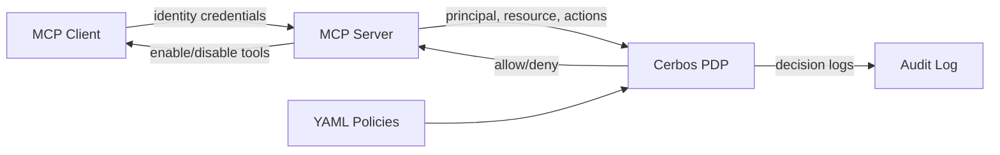
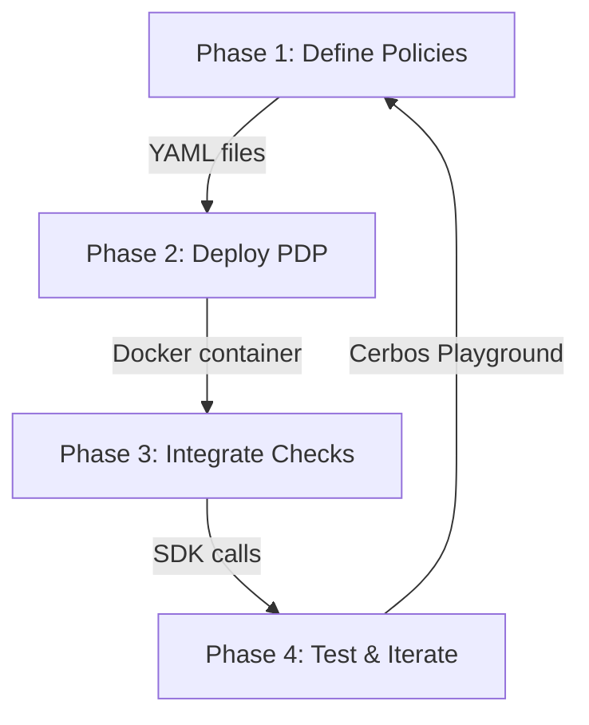

本記事は [https://www.cerbos.dev/blog/mcp-authorization](https://www.cerbos.dev/blog/mcp-authorization) の解説記事です。

## ブログ概要

CerbosはMCP（Model Context Protocol）サーバーに対するポリシーベースの認可制御を提供するオープンソースのPolicy Decision Point（PDP）である。ブログでは、MCPサーバーが急速に普及する中で発生した実際のセキュリティインシデント（Asana、Atlassian、Supabase）を紹介し、認可ロジックをアプリケーションコードから外部化する必要性を論じている。CerbosはYAML宣言的ポリシーでRBAC/ABAC/PBACを実装し、ミリ秒レイテンシでの動的ツール制御を実現する。

この記事は [Zenn記事: MCPサーバー自作で社内データ基盤に認可制御と監査ログを実装する](https://zenn.dev/0h_n0/articles/a2fe642a5473c9) の深掘りです。

## 情報源

- **種別**: 企業テックブログ
- **URL**: [https://www.cerbos.dev/blog/mcp-authorization](https://www.cerbos.dev/blog/mcp-authorization)
- **組織**: Cerbos
- **著者**: Alex Olivier
- **発表日**: 2026年2月13日

## 技術的背景

### MCPサーバーに認可が必要な理由

MCPはAIエージェントがデータベース、アプリケーション、外部リソースとインターフェースするためのプロトコルとして急速に普及している。ブログでは、MCP公開から数か月で「数千のMCPサーバー」が利用可能になり、Asana、Linear、GitHub、Notion、Atlassianなどの主要ベンダーが参入していると説明されている。

Gartnerは「2026年までに80%以上の独立系ソフトウェアベンダーがGenAI機能を企業アプリに組み込む」と予測しており、MCPの攻撃面は拡大し続けている。

### 実際のセキュリティインシデント

ブログでは以下の3つのインシデントが具体的に挙げられている。

**Asana Work Graph MCPサーバー**: UpGuardのセキュリティリサーチにより、MCPサーバー公開から1か月以内に「ユーザーが他のユーザーのデータにアクセスできるバグ」が発見された。データ漏洩に直結する脆弱性である。

**Atlassian MCPサーバー**: Cato Networksのブログによると「攻撃者が偽のサポートチケットなどの悪意ある入力を送信し、特権アクセスを取得できる脆弱性」が報告されている。インジェクション攻撃によるエスカレーションの典型例である。

**Supabase MCP**: Simon Willisonにより「致命的な三重苦（lethal trifecta）」と記述された脆弱性が報告されている。

これらのインシデントを受けて、OWASPは「MCP Top 10」セキュリティプロジェクトを立ち上げ、MCPサーバーの一般的な脆弱性の体系的な追跡を開始している。

### ハードコーディングの問題

ブログでは、認可ロジックをアプリケーションコード内にハードコーディングするアプローチの問題点として以下が挙げられている。

1. **脆弱性**: 各ツールハンドラーに分散した認可チェックは漏れやすい
2. **保守性の低下**: ポリシー変更のたびにコードの修正・再デプロイが必要
3. **監査の困難さ**: 分散した認可ロジックを横断的に検証することが困難
4. **スケーラビリティ**: ツール数の増加に伴い認可コードが指数的に複雑化する

## 実装アーキテクチャ

### Cerbos PDPアーキテクチャ

ブログでは、CerbosのPolicy Decision Point（PDP）はステートレスなサービスとして設計されていると説明されている。デプロイ方法として、Dockerコンテナ、マイクロサービス、WebAssembly版が選択可能で、開発環境ではローカル実行、本番環境ではマイクロサービスとして運用する構成が推奨されている。

APIインターフェースはgRPCとHTTPの両方をサポートし、`checkResource`メソッドで認可判定を行う。バッチ操作もサポートされており、複数アクションの一括チェックが可能である。



### 認可判定フロー

ブログでは、認可判定の流れを以下のように説明している。

1. MCPクライアントがID情報（principal）を持ってMCPサーバーに接続する
2. MCPサーバーがCerbos PDPにprincipal、resource、actionsを渡してクエリする
3. CerbosがYAMLポリシーを評価し、各アクションについてallow/deny判定を返す
4. MCPサーバーが判定結果に基づいてツールを有効化/無効化する
5. 全ての判定がaudit logに記録される

### YAML宣言的ポリシー

CerbosのポリシーはYAMLで宣言的に定義される。以下はMCPサーバーの経費管理ツールに対する認可ポリシーの例である。

```yaml
apiVersion: api.cerbos.dev/v1
resourcePolicy:
  resource: "mcp::expenses"
  version: "default"
  rules:
    # 一般ユーザー: 自分の経費のみ閲覧可能
    - actions: ["view"]
      effect: EFFECT_ALLOW
      roles:
        - user
      condition:
        match:
          expr: request.resource.attr.owner == request.principal.id

    # マネージャー: 部下の経費を閲覧・承認可能（金額制限付き）
    - actions: ["view", "approve_expense"]
      effect: EFFECT_ALLOW
      roles:
        - manager
      condition:
        match:
          all:
            of:
              - expr: request.resource.attr.department == request.principal.attr.department
              - expr: request.resource.attr.amount < 100000

    # 管理者: 全操作可能
    - actions: ["view", "approve_expense", "reject_expense", "delete_expense"]
      effect: EFFECT_ALLOW
      roles:
        - admin
```

このポリシーでは、RBAC（ロールベース: `user`, `manager`, `admin`）とABAC（属性ベース: `department`, `amount`）を組み合わせた認可ルールを宣言している。ブログでは「最小権限の原則がポリシーによって強制され、各ツールハンドラーにロジックをハードコーディングする必要がない」と説明されている。

### Python統合コード

Cerbos Python SDKを使ったMCPサーバーへの認可統合の実装例を示す。

```python
from cerbos.sdk.grpc.client import CerbosClient
from cerbos.engine.v1 import engine_pb2
from google.protobuf.struct_pb2 import Value


def check_mcp_tool_access(
    user_id: str,
    user_roles: set[str],
    user_attrs: dict[str, str],
    resource_kind: str,
    resource_id: str,
    resource_attrs: dict[str, str],
    action: str,
    cerbos_host: str = "localhost:3593",
) -> bool:
    """MCPツールアクセスの認可判定を行う

    Args:
        user_id: ユーザー識別子
        user_roles: ユーザーに割り当てられたロール集合
        user_attrs: ユーザー属性（department等）
        resource_kind: リソース種別（例: "mcp::expenses"）
        resource_id: リソース識別子
        resource_attrs: リソース属性（owner, amount等）
        action: 実行アクション（例: "approve_expense"）
        cerbos_host: Cerbos PDPのgRPCアドレス

    Returns:
        認可判定結果（True: 許可, False: 拒否）
    """
    principal = engine_pb2.Principal(
        id=user_id,
        roles=user_roles,
        attr={k: Value(string_value=v) for k, v in user_attrs.items()},
    )
    resource = engine_pb2.Resource(
        id=resource_id,
        kind=resource_kind,
        attr={k: Value(string_value=v) for k, v in resource_attrs.items()},
    )

    with CerbosClient(cerbos_host, tls_verify=False) as client:
        return client.is_allowed(action, principal, resource)
```

ブログでは「通常は数行のコード」で統合可能と述べており、MCPサーバーのツール登録時に`server.tool(...)`の有効化/無効化を制御する形で実装する。

### 4段階の実装プロセス

ブログでは以下の4段階が推奨されている。



**Phase 1: 認可ポリシーの定義** --- リソース種別（`mcp::expenses`等）、アクション、ロール別権限、属性ベース条件をYAMLで宣言する。成果物は「MCPサーバーの認可モデルを完全に記述したポリシーファイル群」となる。

**Phase 2: Cerbos PDPのデプロイ** --- 公式Dockerイメージを使い、ポリシーファイルをマウントしてサービスを起動する。

```bash
docker run --rm -p 3592:3592 -p 3593:3593 \
  -v /path/to/policies:/policies \
  ghcr.io/cerbos/cerbos:latest \
  server --set=storage.driver=disk --set=storage.disk.directory=/policies
```

**Phase 3: 認可チェックの統合** --- MCPサーバーコードの判定ポイントにCerbos SDK呼び出しを追加する。クライアント接続時にprincipal情報を取得し、各ツール呼び出し時にCerbosへクエリする。

**Phase 4: テストと反復** --- Cerbos Playgroundを使ったシミュレーションテストで、ロール別のアクセスパターンを検証する。ポリシーのライブリロードにより、サービス再起動なしで変更を反映できる。ブログでは「コード変更よりはるかに容易」と述べている。

## Production Deployment Guide

### AWS実装パターン（コスト最適化重視）

Cerbos PDPとMCPサーバーを組み合わせたAWS構成を、トラフィック量別に示す。

| 構成 | トラフィック | 月額概算 | 主要サービス |
|------|-------------|---------|-------------|
| Small | ~100 req/日 | $50-150 | Lambda + ECS (Cerbos sidecar) |
| Medium | ~1,000 req/日 | $300-800 | ECS Fargate + ALB |
| Large | 10,000+ req/日 | $2,000-5,000 | EKS + Karpenter + Spot |

**Small構成 (~100 req/日)**:
- Lambda: MCPサーバー本体、256MB RAM、$5/月
- ECS Fargate: Cerbos PDP（0.25 vCPU, 512MB）、$15/月
- S3: ポリシーファイル保存、$1/月未満
- CloudWatch Logs: 監査ログ、$5/月
- 合計: 約$50/月

**Medium構成 (~1,000 req/日)**: ECS Fargate（MCPサーバー0.5vCPU x 2 + Cerbosサイドカー）、ALB、CloudWatch。合計約$350/月。

**Large構成 (10,000+ req/日)**: EKSコントロールプレーン$74/月、EC2 Spot（m6i.xlarge x 3）$120/月、CerbosをDaemonSet配置、ALB+WAF、OpenSearch Serverless。合計約$2,500/月。

**コスト削減テクニック**: Spot Instances（最大90%削減）、Reserved Instances（最大72%削減）、Cerbosサイドカー配置（ネットワークコスト削減）、S3+Lambda通知でポリシー同期（Cerbos Hub不要）。

注: 上記は2026年7月時点のAWS ap-northeast-1（東京）リージョンの概算値。実際のコストはトラフィックパターン、バースト使用量により変動する。最新料金はAWS料金計算ツールで確認を推奨。

### Terraformインフラコード

**Small構成（ECS Fargate + Cerbos Sidecar）**:

```hcl
# Cerbos PDP + MCP Server on ECS Fargate (2026-07時点)

# --- ECS タスク定義（Cerbos sidecar構成） ---
resource "aws_ecs_task_definition" "mcp_with_cerbos" {
  family                   = "mcp-cerbos"
  network_mode             = "awsvpc"
  requires_compatibilities = ["FARGATE"]
  cpu                      = "512"   # 0.5 vCPU
  memory                   = "1024"  # 1GB
  task_role_arn            = aws_iam_role.mcp_task_role.arn
  execution_role_arn       = aws_iam_role.mcp_task_role.arn

  container_definitions = jsonencode([
    {
      name  = "mcp-server"
      image = "your-registry/mcp-server:latest"
      portMappings = [{ containerPort = 8080 }]
      environment = [
        { name = "CERBOS_HOST", value = "localhost" },
        { name = "CERBOS_PORT", value = "3593" }
      ]
    },
    {
      # Cerbos PDPをサイドカーとして同一タスク内に配置
      # localhost通信でレイテンシ最小化
      name  = "cerbos-pdp"
      image = "ghcr.io/cerbos/cerbos:latest"
      portMappings = [
        { containerPort = 3592 },  # HTTP
        { containerPort = 3593 }   # gRPC
      ]
      command = [
        "server",
        "--set=storage.driver=disk",
        "--set=storage.disk.directory=/policies"
      ]
    }
  ])
}
```

**Large構成（EKS + Karpenter Spot）**: Karpenterでspot/on-demandの混在ノードプールを構成し、Cerbos PDPをDaemonSetとして全ノードに配置する。

```hcl
# Karpenter NodePool: Spot優先でコスト最適化
resource "kubectl_manifest" "karpenter_nodepool" {
  yaml_body = yamlencode({
    apiVersion = "karpenter.sh/v1"
    kind       = "NodePool"
    metadata   = { name = "mcp-workers" }
    spec = {
      template = {
        spec = {
          requirements = [
            { key = "karpenter.sh/capacity-type", operator = "In",
              values = ["spot", "on-demand"] },
            { key = "node.kubernetes.io/instance-type", operator = "In",
              values = ["m6i.xlarge", "m6a.xlarge", "m7i.xlarge"] }
          ]
        }
      }
      limits     = { cpu = "32" }
      disruption = { consolidationPolicy = "WhenEmptyOrUnderutilized" }
    }
  })
}
```

### 運用・監視設定

**CloudWatch Logs Insights クエリ**:

```sql
-- Cerbos認可判定の拒否率推移
fields @timestamp, @message
| filter @message like /EFFECT_DENY/
| stats count(*) as deny_count by bin(1h)

-- レイテンシ分析（P95, P99）
fields @timestamp, duration_ms
| filter source = "cerbos-pdp"
| stats pct(duration_ms, 95) as p95, pct(duration_ms, 99) as p99 by bin(5m)
```

**CloudWatch アラーム設定（Python）**:

```python
import boto3


def create_cerbos_alarms(sns_topic_arn: str) -> None:
    """Cerbos PDP監視用のCloudWatchアラームを作成する"""
    cw = boto3.client("cloudwatch", region_name="ap-northeast-1")

    # 認可判定レイテンシP99が10msを超過した場合
    cw.put_metric_alarm(
        AlarmName="cerbos-pdp-latency-p99",
        Namespace="MCP/Cerbos",
        MetricName="DecisionLatencyMs",
        Statistic="p99",
        Period=300,
        EvaluationPeriods=3,
        Threshold=10.0,
        ComparisonOperator="GreaterThanThreshold",
        AlarmActions=[sns_topic_arn],
    )
```

**X-Rayトレーシング**: `aws_xray_sdk`でCerbos gRPC呼び出しを自動計装し、`@xray_recorder.capture("cerbos_check")`デコレータで認可判定のレイテンシ・判定結果をトレースする。アノテーションに`action`、`principal_id`、`decision`を記録することで、認可判定のフォレンジクス分析が可能になる。

**Cost Explorer日次レポート**: `Project=mcp-cerbos`タグでフィルタリングし、日次コストが$100/日を超過した場合にSNS通知する構成を推奨する。

### コスト最適化チェックリスト

**アーキテクチャ選択**: トラフィック量に応じた構成選択（Small: Serverless / Medium: Hybrid / Large: Container）。Cerbosをサイドカー配置しネットワークホップ削減。

**リソース最適化**: EC2 Spot Instances優先（最大90%削減）、Reserved Instances 1年コミット（最大72%削減）、Savings Plans検討、Fargateタスクサイズ最適化、KarpenterでEKSアイドル時スケールダウン。

**認可エンジンコスト削減**: Cerbosサイドカー（localhost通信でALB不要）、S3ポリシー管理（Cerbos Hub不要）、ポリシーキャッシュ（同一判定の再評価回避）、バッチチェック（複数アクションを1回のAPI呼び出しで処理）。

**監視・アラート**: AWS Budgets月次予算アラート、CloudWatchアラーム（レイテンシ・拒否率）、Cost Anomaly Detection、日次コストレポート（SNS通知）。

**リソース管理**: 未使用リソース定期棚卸し、`Project=mcp-cerbos`タグ戦略、ログ自動削除（90日保持）、開発環境夜間・週末停止。

## パフォーマンス最適化

### ミリ秒レイテンシの実現

ブログでは、Cerbosの認可判定は「通常数ミリ秒」で完了し、MCPエージェントの応答に「気づかれるほどのレイテンシは発生しない」と説明されている。各ツール呼び出し時に認可チェックを挟んでも、体感速度への影響は最小限に抑えられる。

このパフォーマンスはCerbosのステートレス設計に由来する。外部データベースへの依存がなく、ポリシー評価は全てインメモリで実行される。そのため、ネットワークI/Oがボトルネックになることがない。

### ステートレススケーリング

CerbosのPDPはステートレスであるため、水平スケーリングが容易である。具体的には以下のパターンが考えられる。

- **サイドカーパターン**: MCPサーバーの各インスタンスにCerbos PDPを同居させる。localhost通信のため、ネットワークレイテンシがゼロに近い
- **スタンドアロンパターン**: 専用のCerbosクラスタを構築し、複数のMCPサーバーから共有する。ポリシー管理が一元化される
- **WebAssemblyパターン**: MCPサーバーのプロセス内にCerbos WASMを組み込む。最もレイテンシが低い

### ポリシーホットリロード

ブログでは、Cerbosが「ライブリロード」をサポートし、ポリシー変更時にサービスの再起動が不要であると述べている。ダウンタイムなしのポリシー更新、緊急時のアクセス制限変更の即座反映が可能である。

## 運用での学び

### ポリシーバージョニングとGitOps

CerbosのポリシーはYAMLファイルであるため、Gitでのバージョン管理に適している。ブログでは「宣言的ルールの調整はコード変更よりはるかに容易」と述べており、以下のGitOpsワークフローが推奨される。

1. ポリシー変更をPull Requestとして提出
2. CI/CDパイプラインでCerbos Playgroundを使った自動テスト
3. レビュー・承認後にマージ
4. S3/コンテナボリュームへのデプロイで自動反映（ホットリロード）

この構成により、ポリシー変更の監査証跡がGitのコミット履歴として残り、コンプライアンス要件を満たしやすくなる。

### テスト戦略

ブログではCerbos Playgroundによるシミュレーションテストが推奨されている。以下のテストパターンが有効である。

- **ロール別テスト**: user, manager, adminの各ロールで期待通りのアクセス制御が動作するか
- **属性ベーステスト**: 金額制限、部門制限などの条件が正しく評価されるか
- **否定テスト**: 権限のないアクセスが確実に拒否されるか
- **境界値テスト**: 金額制限の境界値での挙動

### 監査ログの活用

ブログでは、Cerbosが「各認可チェックについて詳細な判定ログを自動記録する」と説明されている。判定ログにはprincipal、action、resource、判定結果が含まれ、セキュリティインシデント調査時の判定フォレンジクスに利用できる。

## 学術研究との関連

### RBAC/ABACの理論的基盤

CerbosのRBAC実装は、Sandhu et al.（1996）の「Role-Based Access Control Models」に基づく形式モデルに準拠している。このモデルでは、ユーザーへのロール割当（UA: User Assignment）とロールへの権限割当（PA: Permission Assignment）を分離し、最小権限の原則を実現する。

$$
\text{access}(u, p) = \exists r \in \text{Roles}: (u, r) \in UA \wedge (r, p) \in PA
$$

ここで、$u$はユーザー、$r$はロール、$p$はパーミッション、$UA$はユーザー・ロール割当関係、$PA$はロール・パーミッション割当関係である。

ABACの理論的基盤は、NIST SP 800-162（2014）の「Guide to Attribute Based Access Control (ABAC) Definition and Considerations」で定義されている。ABACでは認可判定が主体属性、リソース属性、環境属性の関数として表現される。

$$
\text{decision}(s, o, a) = f(\text{attr}(s), \text{attr}(o), \text{attr}(e), a)
$$

ここで、$s$は主体（subject）、$o$はオブジェクト（resource）、$a$はアクション、$e$は環境コンテキスト、$\text{attr}(\cdot)$は属性取得関数である。

CerbosはRBACとABACを統合したPBAC（Policy-Based Access Control）として実装しており、単純なロールチェックと複雑な属性条件の両方を同一ポリシー内で宣言的に記述できる。

OWASPの「MCP Top 10」プロジェクトは、OWASP Top 10 for LLM Applications（2023, 2025改訂）の流れを汲み、MCPサーバー固有のリスクカタログを構築している。特にLLM06（過剰な権限委譲）とLLM07（不十分なアクセス制御）がMCPの認可問題と直接関連する。

## まとめと実践への示唆

Cerbosのブログは、MCPサーバーの認可制御を「ポリシーの外部化」という設計原則で解決するアプローチを提示している。YAML宣言的ポリシーによりRBAC/ABACを統合し、ステートレスPDPでミリ秒レイテンシの判定を実現する。Zenn記事で解説した社内データ基盤のMCPサーバーに対して、認可ロジックをアプリケーションコードから分離しCerbosに委譲することで、保守性と監査可能性を向上できる。

実践への示唆として、以下の3点が挙げられる。

1. **ポリシーのコード化**: 認可ルールをYAMLとしてGit管理し、CI/CDパイプラインに組み込む
2. **サイドカー配置**: Cerbos PDPをMCPサーバーと同一タスク/Podに配置し、レイテンシを最小化する
3. **監査ログの活用**: 全認可判定を記録し、セキュリティインシデント調査とコンプライアンス対応に備える

## 参考文献

- **Blog URL**: [https://www.cerbos.dev/blog/mcp-authorization](https://www.cerbos.dev/blog/mcp-authorization)
- **Cerbos Documentation**: [https://docs.cerbos.dev/](https://docs.cerbos.dev/)
- **Cerbos Python SDK**: [https://github.com/cerbos/cerbos-sdk-python](https://github.com/cerbos/cerbos-sdk-python)
- **Sandhu et al. (1996)**: Role-Based Access Control Models, IEEE Computer, 29(2), 38-47
- **NIST SP 800-162 (2014)**: Guide to Attribute Based Access Control (ABAC) Definition and Considerations
- **OWASP Top 10 for LLM Applications**: [https://owasp.org/www-project-top-10-for-large-language-model-applications/](https://owasp.org/www-project-top-10-for-large-language-model-applications/)
- **Related Zenn article**: [https://zenn.dev/0h_n0/articles/a2fe642a5473c9](https://zenn.dev/0h_n0/articles/a2fe642a5473c9)
