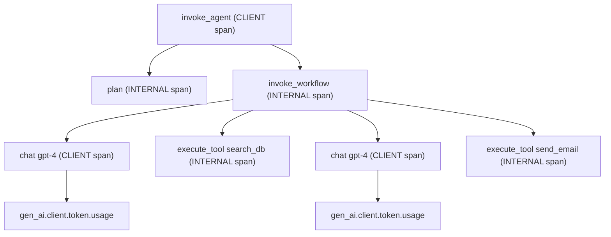

本記事は [https://opentelemetry.io/blog/2025/ai-agent-observability/](https://opentelemetry.io/blog/2025/ai-agent-observability/) の解説記事です。

## ブログ概要

OpenTelemetry GenAI SIG（Special Interest Group）は、AIエージェントの可観測性（observability）を標準化するためのセマンティック規約を策定している。ブログでは、AIエージェントを「LLMの能力、外部ツールへの接続、高レベルの推論を組み合わせて、望ましい最終目標や状態を達成するアプリケーション」と定義し、可観測性を「品質を継続的に学習・改善するためのフィードバックループ」として位置づけている。2つの標準化活動（Agent Application Semantic Convention と Agent Framework Semantic Convention）と2つの実装アプローチ（組み込み計装と外部OTelライブラリ）が解説されている。

この記事は [Zenn記事: MCPサーバー自作で社内データ基盤に認可制御と監査ログを実装する](https://zenn.dev/0h_n0/articles/a2fe642a5473c9) の深掘りです。

## 情報源

- **種別**: 公式テックブログ（CNCF Graduated Project）
- **URL**: [https://opentelemetry.io/blog/2025/ai-agent-observability/](https://opentelemetry.io/blog/2025/ai-agent-observability/)
- **組織**: OpenTelemetry / Cloud Native Computing Foundation (CNCF)
- **関連仕様**: [GenAI Semantic Conventions](https://github.com/open-telemetry/semantic-conventions-genai)

## 技術的背景

### なぜAIエージェントの可観測性が必要か

従来のアプリケーション監視では、HTTPリクエストの成功率やレスポンスタイムといった「決定論的な」メトリクスが中心であった。しかし、AIエージェントは以下の特性を持つため、従来の監視手法では不十分となる。

1. **非決定論的な実行パス**: 同一入力に対して異なるツール呼び出し順序を取りうる
2. **多段推論**: 1回のユーザリクエストが複数のLLM推論とツール実行のチェインに展開される
3. **外部依存の複雑性**: LLMプロバイダ、ツールAPI、データベースなど複数の外部システムに依存する
4. **品質の定量化困難**: 応答の「正しさ」はHTTPステータスコードでは測定できない

ブログでは、可観測性を単なるモニタリングやトラブルシューティングの手段ではなく、「品質を継続的に学習し改善するためのフィードバックループ」として捉えている。この視点は、Zenn記事で扱ったMCPサーバーの監査ログ設計とも直結する。MCPサーバーがツールの認可・実行を制御する層であるのに対し、OpenTelemetryはその実行全体を横断的に可視化する層を提供する。

### 従来監視とエージェント監視のギャップ

従来のAPM（Application Performance Monitoring）は、リクエスト単位のトレースを前提としている。しかしAIエージェントでは、1つのユーザインタラクションが以下のような複雑なトレース構造を生む。

- **エージェント呼び出し** -> **計画フェーズ** -> **LLM推論1** -> **ツール実行A** -> **LLM推論2** -> **ツール実行B** -> **最終応答**

各段階でレイテンシ、トークン消費量、エラー率が異なり、ボトルネックの特定には構造化されたスパン階層が不可欠となる。OpenTelemetryのGenAIセマンティック規約は、この構造化を標準的な方法で実現することを目指している。

## 実装アーキテクチャ

### GenAIセマンティック規約のスパン階層

OpenTelemetryのGenAIセマンティック規約（[semantic-conventions-genai](https://github.com/open-telemetry/semantic-conventions-genai)リポジトリで管理）では、エージェントの実行を以下のスパンタイプで構造化している。



### スパンタイプの定義

仕様リポジトリの`gen-ai-agent-spans.md`に基づき、主要なスパンタイプを整理する。

#### 1. Create Agent スパン (`create_agent`)

リモートエージェントサービス（AWS Bedrock Agents、OpenAI Assistants API等）でのエージェント作成を記録する。スパン種別は`CLIENT`で、スパン名は`create_agent {gen_ai.agent.name}`の形式をとる。

主要属性:

| 属性名 | 必須度 | 説明 |
|--------|--------|------|
| `gen_ai.operation.name` | Required | `create_agent` |
| `gen_ai.provider.name` | Required | プロバイダ識別子（`openai`, `aws.bedrock`等） |
| `gen_ai.agent.name` | Conditionally Required | エージェントの人間可読名 |
| `gen_ai.agent.id` | Conditionally Required | プロバイダ割当の安定ID |
| `gen_ai.agent.description` | Conditionally Required | エージェントの説明文 |
| `gen_ai.request.model` | Conditionally Required | 使用するモデル名 |

#### 2. Invoke Agent スパン (`invoke_agent`)

エージェントの呼び出しを記録する。クライアントスパン（リモートサービスへの呼び出し）と内部スパン（ローカルフレームワーク内の処理）の2種類が定義されている。

- **Client span**: OpenAI Assistants API、AWS Bedrock Agentsなどのリモートサービス呼び出し
- **Internal span**: CrewAI、LangGraph、PydanticAIなどのフレームワーク内部処理

#### 3. Invoke Workflow スパン (`invoke_workflow`)

エージェント内のワークフロー（タスクの実行単位）を記録する。ワークフローは複数のLLM推論とツール実行を含む。

#### 4. Plan スパン (`plan`)

エージェントの計画・タスク分解フェーズを記録する。エージェントがどのツールをどの順序で使うかを決定する推論ステップに対応する。

#### 5. Execute Tool スパン (`execute_tool`)

ツールの実行を記録する。MCPサーバー経由のツール呼び出しもこのスパンで記録される。

### operation.nameの全体像

仕様では以下の`gen_ai.operation.name`値が定義されている。

| 値 | 説明 |
|----|------|
| `create_agent` | エージェント作成 |
| `invoke_agent` | エージェント呼び出し |
| `invoke_workflow` | ワークフロー呼び出し |
| `plan` | 計画・タスク分解 |
| `execute_tool` | ツール実行 |
| `chat` | チャット補完 |
| `embeddings` | 埋め込み生成 |
| `retrieval` | 検索操作 |
| `text_completion` | テキスト補完 |

### メトリクス定義

仕様リポジトリの`gen-ai-metrics.md`では、以下のメトリクスが定義されている。

**クライアントメトリクス**:

| メトリクス名 | 種別 | 単位 | 説明 |
|-------------|------|------|------|
| `gen_ai.client.token.usage` | Histogram | `{token}` | 入出力トークン使用量 |
| `gen_ai.client.operation.duration` | Histogram | `s` | 操作のレイテンシ |
| `gen_ai.client.operation.time_to_first_chunk` | Histogram | `s` | 最初のチャンクまでの時間 |
| `gen_ai.client.operation.time_per_output_chunk` | Histogram | `s` | 出力チャンクあたりの時間 |

**エージェントメトリクス**:

| メトリクス名 | 種別 | 単位 | 説明 |
|-------------|------|------|------|
| `gen_ai.invoke_agent.duration` | Histogram | `s` | エージェント呼び出し全体のレイテンシ |
| `gen_ai.invoke_agent.inference_calls` | Histogram | `{call}` | 推論呼び出し回数 |
| `gen_ai.invoke_agent.tool_calls` | Histogram | `{call}` | ツール呼び出し回数 |
| `gen_ai.execute_tool.duration` | Histogram | `s` | ツール実行のレイテンシ |

**ワークフローメトリクス**:

| メトリクス名 | 種別 | 単位 | 説明 |
|-------------|------|------|------|
| `gen_ai.workflow.duration` | Histogram | `s` | ワークフロー全体のレイテンシ |

### 2つの標準化活動

ブログでは、GenAI可観測性プロジェクトが2つの標準化を進めていると説明されている。

1. **Agent Application Semantic Convention**（確定済み）: GoogleのAIエージェントホワイトペーパーに基づき、エージェントアプリケーションの可観測性を標準化する。Issue #1732で管理されている。
2. **Agent Framework Semantic Convention**（開発中）: IBM Bee AI、IBM wxFlow、CrewAI、AutoGen、Semantic Kernel、LangGraph、PydanticAIなどのフレームワーク固有の計装を標準化する。Issue #1530で管理されている。

### 2つの実装アプローチ

ブログでは、計装の実装方法として2つのアプローチが紹介されている。

#### アプローチ1: 組み込み計装（Baked-in Instrumentation）

フレームワーク自体にOpenTelemetry計装を組み込む方式。CrewAIなどがこの方式を採用している。

**利点**: フレームワーク開発者による保守、導入の簡便さ
**欠点**: フレームワークの肥大化、OTelバージョンのロックインリスク

#### アプローチ2: 外部OTelライブラリ（External OpenTelemetry Libraries）

フレームワークとは別パッケージとして計装ライブラリを提供する方式。Traceloop、Langtrace等が代表的な実装である。

**利点**: フレームワークとの疎結合、独立したバージョニング
**欠点**: フレームワーク内部APIへの依存、互換性維持のコスト

### Python実装例: OTel計装によるエージェントトレーシング

以下は、OpenTelemetryの仕様に準拠したAIエージェントの計装実装例である。

```python
from opentelemetry import trace, metrics
from opentelemetry.sdk.trace import TracerProvider
from opentelemetry.sdk.trace.export import BatchSpanProcessor
from opentelemetry.exporter.otlp.proto.grpc.trace_exporter import OTLPSpanExporter
from opentelemetry.sdk.metrics import MeterProvider
from opentelemetry.sdk.metrics.export import PeriodicExportingMetricReader
from opentelemetry.exporter.otlp.proto.grpc.metric_exporter import OTLPMetricExporter
from opentelemetry.semconv._incubating.attributes.gen_ai_attributes import (
    GEN_AI_OPERATION_NAME,
    GEN_AI_AGENT_NAME,
    GEN_AI_REQUEST_MODEL,
    GEN_AI_RESPONSE_MODEL,
    GEN_AI_TOKEN_TYPE,
)


def setup_otel() -> tuple[trace.Tracer, metrics.Meter]:
    """OpenTelemetry TracerとMeterを初期化する。

    Returns:
        Tracer と Meter のタプル
    """
    # Tracer設定
    tracer_provider = TracerProvider()
    span_exporter = OTLPSpanExporter(endpoint="http://localhost:4317")
    tracer_provider.add_span_processor(BatchSpanProcessor(span_exporter))
    trace.set_tracer_provider(tracer_provider)

    # Meter設定
    metric_reader = PeriodicExportingMetricReader(
        OTLPMetricExporter(endpoint="http://localhost:4317"),
        export_interval_millis=10000,
    )
    meter_provider = MeterProvider(metric_readers=[metric_reader])
    metrics.set_meter_provider(meter_provider)

    tracer = trace.get_tracer("ai.agent.demo", "0.1.0")
    meter = metrics.get_meter("ai.agent.demo", "0.1.0")
    return tracer, meter
```

```python
import time
from opentelemetry import trace


def invoke_agent(
    tracer: trace.Tracer,
    token_histogram: metrics.Histogram,
    duration_histogram: metrics.Histogram,
    agent_name: str,
    user_query: str,
    model: str = "gpt-4",
) -> str:
    """GenAIセマンティック規約に準拠したエージェント呼び出し。

    Args:
        tracer: OpenTelemetry Tracer
        token_histogram: トークン使用量メトリクス
        duration_histogram: レイテンシメトリクス
        agent_name: エージェント名
        user_query: ユーザクエリ
        model: 使用モデル名

    Returns:
        エージェントの応答テキスト
    """
    start_time = time.monotonic()

    # invoke_agent スパン（仕様準拠のスパン名形式）
    with tracer.start_as_current_span(
        f"invoke_agent {agent_name}",
        kind=trace.SpanKind.INTERNAL,
        attributes={
            GEN_AI_OPERATION_NAME: "invoke_agent",
            GEN_AI_AGENT_NAME: agent_name,
            GEN_AI_REQUEST_MODEL: model,
            "gen_ai.provider.name": "openai",
        },
    ) as agent_span:

        # plan スパン
        with tracer.start_as_current_span(
            "plan",
            kind=trace.SpanKind.INTERNAL,
            attributes={GEN_AI_OPERATION_NAME: "plan"},
        ):
            tools_to_use = _plan_tool_selection(user_query)

        # invoke_workflow スパン
        with tracer.start_as_current_span(
            "invoke_workflow main",
            kind=trace.SpanKind.INTERNAL,
            attributes={GEN_AI_OPERATION_NAME: "invoke_workflow"},
        ) as workflow_span:
            result = ""

            for tool_name in tools_to_use:
                # execute_tool スパン
                with tracer.start_as_current_span(
                    f"execute_tool {tool_name}",
                    kind=trace.SpanKind.INTERNAL,
                    attributes={
                        GEN_AI_OPERATION_NAME: "execute_tool",
                        "gen_ai.tool.name": tool_name,
                    },
                ):
                    tool_result = _execute_tool(tool_name, user_query)

            # chat スパン（LLM推論）
            with tracer.start_as_current_span(
                f"chat {model}",
                kind=trace.SpanKind.CLIENT,
                attributes={
                    GEN_AI_OPERATION_NAME: "chat",
                    GEN_AI_REQUEST_MODEL: model,
                    "gen_ai.provider.name": "openai",
                },
            ) as chat_span:
                result, usage = _call_llm(model, user_query, tool_result)

                chat_span.set_attribute(
                    GEN_AI_RESPONSE_MODEL, usage["response_model"]
                )

                # トークン使用量メトリクス記録
                token_histogram.record(
                    usage["input_tokens"],
                    attributes={
                        GEN_AI_OPERATION_NAME: "chat",
                        GEN_AI_TOKEN_TYPE: "input",
                        GEN_AI_REQUEST_MODEL: model,
                        "gen_ai.provider.name": "openai",
                    },
                )
                token_histogram.record(
                    usage["output_tokens"],
                    attributes={
                        GEN_AI_OPERATION_NAME: "chat",
                        GEN_AI_TOKEN_TYPE: "output",
                        GEN_AI_REQUEST_MODEL: model,
                        "gen_ai.provider.name": "openai",
                    },
                )

    # エージェント全体のレイテンシ記録
    elapsed = time.monotonic() - start_time
    duration_histogram.record(
        elapsed,
        attributes={
            GEN_AI_OPERATION_NAME: "invoke_agent",
            GEN_AI_AGENT_NAME: agent_name,
            "gen_ai.provider.name": "openai",
        },
    )

    return result


def _plan_tool_selection(query: str) -> list[str]:
    """クエリに基づいてツール選択を計画する（簡略化）。"""
    return ["search_db", "send_email"]


def _execute_tool(tool_name: str, query: str) -> str:
    """ツールを実行する（簡略化）。"""
    return f"Result from {tool_name}"


def _call_llm(
    model: str, query: str, context: str
) -> tuple[str, dict[str, int | str]]:
    """LLMを呼び出す（簡略化）。"""
    return "Agent response", {
        "input_tokens": 150,
        "output_tokens": 80,
        "response_model": "gpt-4-0613",
    }
```

メトリクスの定義部分は以下のようになる。

```python
def create_genai_metrics(
    meter: metrics.Meter,
) -> tuple[metrics.Histogram, metrics.Histogram]:
    """GenAIセマンティック規約に準拠したメトリクスを定義する。

    Args:
        meter: OpenTelemetry Meter

    Returns:
        (token_usage_histogram, operation_duration_histogram)
    """
    token_histogram = meter.create_histogram(
        name="gen_ai.client.token.usage",
        description="Number of input and output tokens used",
        unit="{token}",
    )

    duration_histogram = meter.create_histogram(
        name="gen_ai.client.operation.duration",
        description="GenAI operation duration",
        unit="s",
    )

    return token_histogram, duration_histogram
```

## Production Deployment Guide

### AWS実装パターン（コスト最適化重視）

AIエージェントの可観測性基盤をAWS上に構築する場合、OTel Collectorによるテレメトリ収集・転送が中心となる。以下にトラフィック量別の推奨構成を示す。

**トラフィック量別推奨構成**:

| 構成 | トラフィック | 月額概算 | 主要サービス |
|------|------------|---------|-------------|
| Small | ~100 req/日 | $80-200 | Lambda + ADOT Collector (Sidecar) + CloudWatch |
| Medium | ~1,000 req/日 | $400-1,000 | ECS Fargate + ADOT Collector + Managed Grafana |
| Large | 10,000+ req/日 | $2,500-6,000 | EKS + OTel Collector DaemonSet + Grafana Cloud |

**Small構成（~100 req/日、月額$80-200）**:
- AWS Lambda（エージェント実行）: $5-15/月
- ADOT Lambda Layer（計装）: 追加コストなし
- CloudWatch Logs + X-Ray: $30-80/月
- Bedrock API（LLMコスト別）: $40-100/月

**Medium構成（~1,000 req/日、月額$400-1,000）**:
- ECS Fargate（エージェント + OTel Collector sidecar）: $150-300/月
- Amazon Managed Grafana: $9/月（エディタ1名）
- Amazon Managed Prometheus: $50-150/月
- CloudWatch Logs: $50-100/月
- Bedrock API: $150-400/月

**Large構成（10,000+ req/日、月額$2,500-6,000）**:
- EKS（エージェント Pod + OTel Collector DaemonSet）: $500-1,200/月
- Karpenter + Spot Instances: Spot活用で最大60%削減
- Grafana Cloud（Pro）: $299/月
- S3（テレメトリ長期保存）: $50-100/月
- Bedrock API: $1,000-3,000/月

**コスト削減テクニック**:
- Spot Instances活用: EKSワーカーノードで最大90%削減
- Reserved Instances: OTel Collector専用ノードで最大72%削減
- Bedrock Batch API使用: 非リアルタイム推論で50%削減
- テレメトリサンプリング: Tail-based samplingで保存コスト70%削減

**コスト試算の注意事項**: 上記は2026年7月時点のAWS ap-northeast-1（東京）リージョン料金に基づく概算値である。実際のコストはトラフィックパターン、リージョン、バースト使用量により変動する。最新料金は[AWS料金計算ツール](https://calculator.aws/)で確認することを推奨する。

### Terraformインフラコード

#### Small構成（Serverless + ADOT）

```hcl
# OTel Collector付きLambdaによるAIエージェント可観測性基盤
# コスト目安: ~$80-200/月（東京リージョン、2026年7月時点）

terraform {
  required_version = ">= 1.12"
  required_providers {
    aws = {
      source  = "hashicorp/aws"
      version = "~> 5.80"
    }
  }
}

provider "aws" {
  region = "ap-northeast-1"
}

# --- IAMロール（最小権限） ---
resource "aws_iam_role" "agent_lambda" {
  name = "ai-agent-otel-lambda-role"
  assume_role_policy = jsonencode({
    Version = "2012-10-17"
    Statement = [{
      Action = "sts:AssumeRole"
      Effect = "Allow"
      Principal = { Service = "lambda.amazonaws.com" }
    }]
  })
}

resource "aws_iam_role_policy" "agent_lambda" {
  name = "ai-agent-otel-lambda-policy"
  role = aws_iam_role.agent_lambda.id
  policy = jsonencode({
    Version = "2012-10-17"
    Statement = [
      {
        Effect = "Allow"
        Action = [
          "logs:CreateLogGroup",
          "logs:CreateLogStream",
          "logs:PutLogEvents",
        ]
        Resource = "arn:aws:logs:ap-northeast-1:*:*"
      },
      {
        Effect = "Allow"
        Action = [
          "xray:PutTraceSegments",
          "xray:PutTelemetryRecords",
        ]
        Resource = "*"
      },
      {
        Effect   = "Allow"
        Action   = ["bedrock:InvokeModel"]
        Resource = "arn:aws:bedrock:ap-northeast-1::foundation-model/*"
      },
      {
        Effect   = "Allow"
        Action   = ["dynamodb:GetItem", "dynamodb:PutItem", "dynamodb:Query"]
        Resource = aws_dynamodb_table.agent_traces.arn
      },
    ]
  })
}

# --- ADOT Lambda Layer（OTel計装） ---
resource "aws_lambda_function" "ai_agent" {
  function_name = "ai-agent-with-otel"
  runtime       = "python3.13"
  handler       = "agent.handler"
  role          = aws_iam_role.agent_lambda.arn
  memory_size   = 512
  timeout       = 120
  filename      = "lambda_package.zip"

  layers = [
    # AWS Distro for OpenTelemetry (ADOT) Lambda Layer
    "arn:aws:lambda:ap-northeast-1:901920570463:layer:aws-otel-python-amd64-ver-1-29-0:1"
  ]

  environment {
    variables = {
      AWS_LAMBDA_EXEC_WRAPPER            = "/opt/otel-instrument"
      OPENTELEMETRY_COLLECTOR_CONFIG_FILE = "/var/task/collector.yaml"
      OTEL_SERVICE_NAME                   = "ai-agent"
      OTEL_RESOURCE_ATTRIBUTES           = "gen_ai.provider.name=aws.bedrock"
    }
  }

  tracing_config {
    mode = "Active"
  }
}

# --- DynamoDB（トレースメタデータ保存） ---
resource "aws_dynamodb_table" "agent_traces" {
  name         = "ai-agent-traces"
  billing_mode = "PAY_PER_REQUEST" # On-Demandでコスト最適化
  hash_key     = "trace_id"
  range_key    = "timestamp"

  attribute {
    name = "trace_id"
    type = "S"
  }
  attribute {
    name = "timestamp"
    type = "N"
  }

  server_side_encryption {
    enabled = true # KMS暗号化
  }

  point_in_time_recovery {
    enabled = true
  }
}

# --- CloudWatchアラーム（コスト監視） ---
resource "aws_cloudwatch_metric_alarm" "lambda_duration" {
  alarm_name          = "ai-agent-lambda-duration-high"
  comparison_operator = "GreaterThanThreshold"
  evaluation_periods  = 3
  metric_name         = "Duration"
  namespace           = "AWS/Lambda"
  period              = 300
  statistic           = "p95"
  threshold           = 90000 # 90秒
  alarm_description   = "AI agent Lambda P95 latency exceeds 90s"
  dimensions = {
    FunctionName = aws_lambda_function.ai_agent.function_name
  }
}
```

#### Large構成（EKS + OTel Collector DaemonSet）

```hcl
# EKS + OTel Collector DaemonSetによるAIエージェント可観測性基盤
# コスト目安: ~$2,500-6,000/月（東京リージョン、2026年7月時点）

module "eks" {
  source  = "terraform-aws-modules/eks/aws"
  version = "~> 20.31"

  cluster_name    = "ai-agent-cluster"
  cluster_version = "1.32"

  vpc_id     = module.vpc.vpc_id
  subnet_ids = module.vpc.private_subnets

  # Karpenter用IRSA
  enable_irsa = true

  cluster_addons = {
    aws-otel-collector = {
      most_recent = true
    }
  }
}

# --- Karpenter Provisioner（Spot優先） ---
resource "kubectl_manifest" "karpenter_nodepool" {
  yaml_body = yamlencode({
    apiVersion = "karpenter.sh/v1"
    kind       = "NodePool"
    metadata   = { name = "ai-agent-pool" }
    spec = {
      template = {
        spec = {
          requirements = [
            {
              key      = "karpenter.sh/capacity-type"
              operator = "In"
              values   = ["spot", "on-demand"]
            },
            {
              key      = "node.kubernetes.io/instance-type"
              operator = "In"
              values   = ["m7i.xlarge", "m7i.2xlarge", "m6i.xlarge"]
            },
          ]
          nodeClassRef = {
            group = "karpenter.k8s.aws"
            kind  = "EC2NodeClass"
            name  = "default"
          }
        }
      }
      limits   = { cpu = "100", memory = "400Gi" }
      disruption = {
        consolidationPolicy = "WhenEmptyOrUnderutilized"
        consolidateAfter    = "30s"
      }
    }
  })
}

# --- OTel Collector ConfigMap ---
resource "kubernetes_config_map" "otel_collector" {
  metadata {
    name      = "otel-collector-config"
    namespace = "observability"
  }

  data = {
    "config.yaml" = yamlencode({
      receivers = {
        otlp = {
          protocols = {
            grpc = { endpoint = "0.0.0.0:4317" }
            http = { endpoint = "0.0.0.0:4318" }
          }
        }
      }
      processors = {
        batch = {
          timeout       = "5s"
          send_batch_size = 512
        }
        # Tail-based samplingでコスト削減
        tail_sampling = {
          decision_wait = "10s"
          policies = [
            { name = "errors", type = "status_code", status_code = { status_codes = ["ERROR"] } },
            { name = "slow", type = "latency", latency = { threshold_ms = 5000 } },
            { name = "sample-rest", type = "probabilistic", probabilistic = { sampling_percentage = 10 } },
          ]
        }
      }
      exporters = {
        otlphttp = {
          endpoint = "https://grafana-cloud-endpoint"
          headers  = { Authorization = "Basic $${GRAFANA_API_KEY}" }
        }
        awsxray = {}
      }
      service = {
        pipelines = {
          traces = {
            receivers  = ["otlp"]
            processors = ["tail_sampling", "batch"]
            exporters  = ["otlphttp", "awsxray"]
          }
          metrics = {
            receivers  = ["otlp"]
            processors = ["batch"]
            exporters  = ["otlphttp"]
          }
        }
      }
    })
  }
}

# --- AWS Budgets（予算アラート） ---
resource "aws_budgets_budget" "agent_monthly" {
  name         = "ai-agent-monthly-budget"
  budget_type  = "COST"
  limit_amount = "5000"
  limit_unit   = "USD"
  time_unit    = "MONTHLY"

  notification {
    comparison_operator       = "GREATER_THAN"
    threshold                 = 80
    threshold_type            = "PERCENTAGE"
    notification_type         = "ACTUAL"
    subscriber_email_addresses = ["ops-team@example.com"]
  }
}
```

### 運用・監視設定

**CloudWatch Logs Insightsクエリ（コスト異常検知）**:

```
# 1時間あたりのトークン使用量スパイク検知
fields @timestamp, @message
| filter @message like /gen_ai.client.token.usage/
| stats sum(token_count) as total_tokens by bin(1h) as hour
| sort hour desc
| limit 24
```

**CloudWatch Logs Insightsクエリ（レイテンシ分析）**:

```
# エージェント呼び出しのP95/P99レイテンシ
fields @timestamp, duration_ms, agent_name
| filter operation_name = "invoke_agent"
| stats percentile(duration_ms, 95) as p95,
        percentile(duration_ms, 99) as p99,
        avg(duration_ms) as avg_ms
        by agent_name
```

**X-Rayトレーシング設定（Python）**:

```python
import boto3
from aws_xray_sdk.core import xray_recorder, patch_all


def setup_xray_tracing() -> None:
    """X-Rayトレーシングを設定する（boto3自動計装）。"""
    xray_recorder.configure(
        service="ai-agent-service",
        sampling=False,  # OTel Collector側でサンプリング
    )
    patch_all()  # boto3, requests等を自動計装


def record_agent_annotation(
    agent_name: str, model: str, token_count: int
) -> None:
    """X-Rayアノテーションとメタデータを記録する。

    Args:
        agent_name: エージェント名
        model: 使用モデル名
        token_count: トークン使用量
    """
    segment = xray_recorder.current_subsegment()
    if segment:
        segment.put_annotation("agent_name", agent_name)
        segment.put_annotation("model", model)
        segment.put_metadata("token_count", token_count, "gen_ai")
```

**Cost Explorer自動レポート（Python）**:

```python
import boto3
import json
from datetime import datetime, timedelta


def get_daily_ai_cost_report() -> dict[str, float]:
    """Bedrock/Lambda/EKSの日次コストレポートを取得する。

    Returns:
        サービス別コストの辞書
    """
    client = boto3.client("ce", region_name="ap-northeast-1")
    end_date = datetime.now().strftime("%Y-%m-%d")
    start_date = (datetime.now() - timedelta(days=1)).strftime("%Y-%m-%d")

    response = client.get_cost_and_usage(
        TimePeriod={"Start": start_date, "End": end_date},
        Granularity="DAILY",
        Metrics=["UnblendedCost"],
        Filter={
            "Or": [
                {"Dimensions": {"Key": "SERVICE", "Values": ["Amazon Bedrock"]}},
                {"Dimensions": {"Key": "SERVICE", "Values": ["AWS Lambda"]}},
                {"Dimensions": {"Key": "SERVICE", "Values": ["Amazon Elastic Kubernetes Service"]}},
            ]
        },
        GroupBy=[{"Type": "DIMENSION", "Key": "SERVICE"}],
    )

    costs: dict[str, float] = {}
    for group in response["ResultsByTime"][0]["Groups"]:
        service = group["Keys"][0]
        amount = float(group["Metrics"]["UnblendedCost"]["Amount"])
        costs[service] = amount

    total = sum(costs.values())
    if total > 100:
        _send_sns_alert(
            f"AI Agent daily cost alert: ${total:.2f} exceeds $100 threshold"
        )

    return costs


def _send_sns_alert(message: str) -> None:
    """SNS通知を送信する。"""
    sns = boto3.client("sns", region_name="ap-northeast-1")
    sns.publish(
        TopicArn="arn:aws:sns:ap-northeast-1:123456789012:ai-agent-alerts",
        Message=message,
        Subject="AI Agent Cost Alert",
    )
```

### コスト最適化チェックリスト

**アーキテクチャ選択**:
- [ ] トラフィック量に応じた構成選択（~100: Serverless / ~1,000: Hybrid / 10,000+: Container）
- [ ] OTel Collector配置方式の選択（Sidecar vs DaemonSet vs Gateway）
- [ ] テレメトリ保存先の選択（CloudWatch / Managed Prometheus / Grafana Cloud）

**リソース最適化**:
- [ ] EC2: Spot Instances優先（OTel Collectorノード含む）
- [ ] Reserved Instances: 常時稼働ノードには1年コミット適用
- [ ] Savings Plans: Fargate/Lambdaに対するCompute Savings Plans検討
- [ ] Lambda: メモリサイズをPower Tuningで最適化
- [ ] ECS/EKS: Karpenterによるアイドル時自動スケールダウン

**LLMコスト削減**:
- [ ] Bedrock Batch API使用（非リアルタイム処理で50%削減）
- [ ] Prompt Caching有効化（繰り返しプロンプトで30-90%削減）
- [ ] モデル選択ロジック（タスク複雑度に応じてClaude Haiku/Sonnet/Opus使い分け）
- [ ] トークン数制限（max_tokens設定で出力コスト制御）

**監視・アラート**:
- [ ] AWS Budgets設定（月額予算の80%到達で通知）
- [ ] CloudWatchアラーム（Lambda実行時間、Bedrockトークン使用量）
- [ ] Cost Anomaly Detection有効化（機械学習ベースの異常検知）
- [ ] 日次コストレポート自動生成（Cost Explorer API + SNS通知）

**リソース管理**:
- [ ] 未使用リソース定期削除（未使用Lambda、停止中ECSタスク）
- [ ] タグ戦略（`project:ai-agent`, `env:prod/staging`で分類）
- [ ] ライフサイクルポリシー（S3テレメトリデータの90日後Glacier移行）
- [ ] 開発環境夜間停止（EKSノード、Fargate タスクのスケジュール停止）
- [ ] テレメトリデータ保持期間設定（CloudWatch Logs 30日、長期はS3）

## パフォーマンス最適化

### サンプリング戦略

AIエージェントのトレースは、複数のスパンから構成されるため、全トレースを保存するとストレージコストが膨大になる。OTel Collectorのtail-based samplingプロセッサを用いて、以下の戦略を適用する。

1. **エラートレースの全数収集**: `status_code = ERROR`のトレースは100%保存する。エージェントの障害分析に不可欠である。
2. **高レイテンシトレースの全数収集**: 5秒以上のトレースを100%保存し、ボトルネック分析に活用する。
3. **正常トレースの確率的サンプリング**: 残りのトレースは10%のみ保存し、ストレージコストを削減する。

この戦略により、正常系のストレージコストを約90%削減しつつ、障害時の調査に必要なデータは確実に保持できる。

### バッチ処理とエクスポート最適化

OTel Collectorのbatchプロセッサは、スパンをバッファリングしてバッチ送信することで、エクスポータへのネットワーク呼び出し回数を削減する。推奨設定は以下の通りである。

- `timeout`: 5秒（バッファ滞留の最大時間）
- `send_batch_size`: 512（バッチあたりのスパン数）
- `send_batch_max_size`: 1024（バッチサイズの上限）

`gen_ai.client.token.usage`メトリクスは入力トークンと出力トークンを別々に記録するため、属性`gen_ai.token.type`（`input` / `output`）で区別する。Histogramの明示的バケット境界は`[1, 4, 16, 64, 256, 1024, 4096, 16384, 65536, 262144, 1048576, 4194304, 16777216, 67108864]`が仕様で推奨されている。

## 運用での学び

### 業界での採用パターン

ブログでは、AIエージェント可観測性の標準化に向けて、複数のオブザーバビリティプラットフォームが対応を進めていると述べられている。

**Braintrust**: 2026年Q1から、OpenTelemetry形式でのテレメトリ取り込みに対応した。GenAIセマンティック規約に準拠したスパンとメトリクスを受信し、AIエージェントの評価ダッシュボードを提供している。

**Arize Phoenix**: オープンソースのML可観測性ツールとして、OpenTelemetryネイティブのテレメトリ収集をサポートしている。LLMトレースの可視化やプロンプトのA/Bテスト機能を提供している。

**Langfuse**: OTelインジェスション（取り込み）に対応し、既存のOTel計装からテレメトリを受け取る機能を提供している。

**Grafana Cloud AI Plugin**: Grafana Cloudに統合されたAIモニタリングプラグインで、GenAIセマンティック規約に準拠したダッシュボードを自動生成する。

### 標準化がもたらす価値

OpenTelemetryの標準化により、以下のメリットが生まれている。

1. **ベンダーロックイン回避**: テレメトリのエクスポート先を変更するだけで、バックエンドを切り替え可能
2. **計装の再利用**: 一度書いた計装コードが、どのバックエンドでも動作する
3. **フレームワーク横断の比較**: CrewAI、LangGraph、AutoGenなど異なるフレームワークのエージェントを同一メトリクスで比較可能

ただし、セマンティック規約はDevelopmentステータスであり、属性名や構造が今後変更される可能性がある点には注意が必要である。

## 学術研究との関連

AIエージェントの可観測性は、以下の学術研究領域と接続している。

**分散トレーシング理論**: Sigelman et al. (2010) によるDapper論文は、分散システムのトレーシングの基礎を築いた。OpenTelemetryのスパンモデルはこの研究の延長線上にあり、GenAIセマンティック規約はAIエージェント固有のスパン構造をこのモデルに統合している。

**LLM評価フレームワーク**: Zheng et al. (2023) のMT-Benchに代表されるLLM評価研究は、モデルの出力品質を定量化する手法を提案している。OpenTelemetryのメトリクスは、レイテンシやトークン消費量といった「運用品質」を測定するものであり、出力品質の評価と組み合わせることで、包括的なAIエージェントの品質管理が可能になる。

**AIエージェントアーキテクチャ**: Googleの「Agents」ホワイトペーパー（Kaggle公開）は、本セマンティック規約のAgent Application部分の理論的基盤となっている。エージェントの推論・計画・ツール使用のサイクルを形式化し、各フェーズの可観測性要件を定義している。

## まとめと実践への示唆

OpenTelemetry GenAI SIGによるAIエージェント可観測性の標準化は、以下の点でAIエージェント開発の実務に直接的な影響を与える。

1. **計装の標準化**: `invoke_agent`、`execute_tool`、`chat`などの操作名と属性名が標準化されることで、チーム間・組織間での可観測性データの共有が容易になる
2. **ツール選択の指針**: 組み込み計装と外部ライブラリの2つのアプローチが明確化されたことで、フレームワーク選定時の判断基準が得られる
3. **メトリクス設計の基盤**: `gen_ai.invoke_agent.duration`や`gen_ai.invoke_agent.tool_calls`といったエージェント固有のメトリクスが定義されたことで、SLO設定やアラート設計の出発点が提供される

Zenn記事で解説したMCPサーバーの監査ログ実装においても、OpenTelemetryのセマンティック規約に準拠した計装を採用することで、MCPツール呼び出しのトレーシングを業界標準の形式で記録・分析できるようになる。

今後は、Agent Framework Semantic Conventionの確定と、より多くのフレームワークでのネイティブ対応が進むことで、AIエージェントの可観測性エコシステムがさらに成熟していくと考えられる。

## 参考文献

- **Blog URL**: [https://opentelemetry.io/blog/2025/ai-agent-observability/](https://opentelemetry.io/blog/2025/ai-agent-observability/)
- **GenAI Semantic Conventions Repository**: [https://github.com/open-telemetry/semantic-conventions-genai](https://github.com/open-telemetry/semantic-conventions-genai)
- **Agent Application Semantic Convention (Issue #1732)**: [https://github.com/open-telemetry/semantic-conventions-genai/issues/1732](https://github.com/open-telemetry/semantic-conventions-genai/issues/1732)
- **Agent Framework Semantic Convention (Issue #1530)**: [https://github.com/open-telemetry/semantic-conventions-genai/issues/1530](https://github.com/open-telemetry/semantic-conventions-genai/issues/1530)
- **Google Agents Whitepaper**: [https://www.kaggle.com/whitepaper-agents](https://www.kaggle.com/whitepaper-agents)
- **Dapper (Sigelman et al., 2010)**: [https://research.google/pubs/pub36356/](https://research.google/pubs/pub36356/)
- **Related Zenn article**: [https://zenn.dev/0h_n0/articles/a2fe642a5473c9](https://zenn.dev/0h_n0/articles/a2fe642a5473c9)
