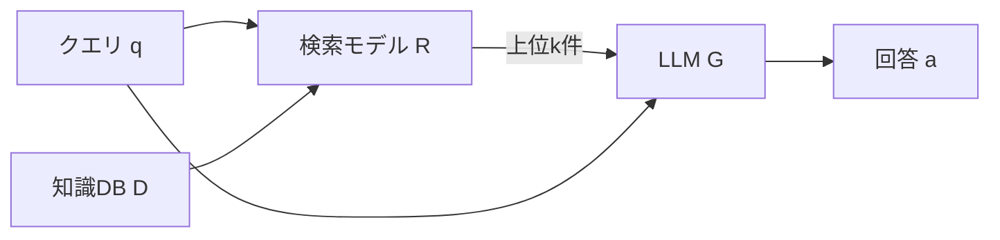

本記事は [PoisonedRAG: Knowledge Corruption Attacks to Retrieval-Augmented Generation of Large Language Models](https://arxiv.org/abs/2402.07867)（arXiv:2402.07867、USENIX Security 2025採択）の解説記事です。

## 論文概要（Abstract）

PoisonedRAGは、RAG（Retrieval-Augmented Generation）システムの知識データベースに対する初の体系的な汚染攻撃手法である。著者らは、攻撃者が知識データベースに少数の悪意あるテキストを注入することで、LLMに攻撃者が選んだ任意の回答を生成させられることを示している。この攻撃を最適化問題として定式化し、Black-box設定とWhite-box設定の2つのアプローチを提案している。論文の実験によると、数百万件のテキストを含むデータベースに対し、1つの質問あたりわずか5件の汚染テキストを注入するだけで約90%の攻撃成功率を達成したと報告されている。

この記事は [Zenn記事: RAGシステムのIndirect Prompt Injection対策：文書汚染から守る実装](https://zenn.dev/0h_n0/articles/766a44e8aa95a2) の深掘りです。

## 情報源

- **arXiv ID**: 2402.07867
- **URL**: [https://arxiv.org/abs/2402.07867](https://arxiv.org/abs/2402.07867)
- **著者**: Wei Zou, Runpeng Geng, Binghui Wang, Jinyuan Jia
- **発表**: USENIX Security Symposium 2025
- **分野**: cs.CR（暗号・セキュリティ）, cs.LG（機械学習）
- **コード**: [https://github.com/sleeepeer/PoisonedRAG](https://github.com/sleeepeer/PoisonedRAG)

## 背景と動機（Background & Motivation）

RAGは、LLMの出力精度を向上させるために外部の知識データベースから関連文書を検索し、プロンプトに付加する仕組みである。LLM単体のパラメトリック知識に頼る場合に比べ、ハルシネーションを抑制でき、知識の更新も容易であるため、ChatGPT、Bing Chat、Perplexity AIなど商用サービスで広く採用されている。

従来のLLMセキュリティ研究は、ジェイルブレイクやプロンプトインジェクションなどLLM自体への攻撃に集中してきた。しかしRAGの普及に伴い、知識データベースという新たな攻撃面が生まれている。著者らは、多くのRAGシステムがWikipediaやWebクロールなど公開データを知識源としており、攻撃者がこれらを編集・改変できる場合、知識データベースの汚染が現実的な脅威となることを指摘している。

本論文の動機は、この新たな攻撃面の脅威を体系的に評価し、防御策の必要性を示すことにある。

## 主要な貢献（Key Contributions）

- **RAGへの初の知識汚染攻撃の提案**: 知識データベースの汚染によるRAGへの攻撃を最適化問題として定式化した初の研究
- **2つの攻撃手法の開発**: LLMの内部パラメータにアクセスできないBlack-box設定（LM_targeted）と、アクセス可能なWhite-box設定（HotFlip）の両方に対応
- **大規模データベースでの有効性実証**: 数百万件規模のデータベースに対し、わずか5件の汚染テキストで約90%の攻撃成功率を達成
- **既存防御策の不十分さの実証**: パラフレーズ、パープレキシティ検出、重複フィルタリング、知識拡張の4つの防御策がいずれも攻撃を十分に阻止できないことを示した
- **実世界アプリケーションへの適用**: Wikipedia連携チャットボットやLLMエージェントでの攻撃成功も確認

## 技術的詳細（Technical Details）

### 攻撃の定式化

RAGシステムは、知識データベース $\mathcal{D}$、検索モデル $\mathcal{R}$、LLM $\mathcal{G}$ の3つのコンポーネントで構成される。ユーザがクエリ $q$ を入力すると、検索モデルがデータベースから関連度の高い上位 $k$ 件の文書 $\{d_1, d_2, \ldots, d_k\}$ を取得し、LLMがこれらの文書とクエリをもとに回答 $a$ を生成する。



著者らは、攻撃者がターゲットとなる質問 $q_t$ に対し、LLMに特定の回答 $a_t$（攻撃者が選んだ回答）を生成させることを目標とし、これを以下の最適化問題として定式化している。

$$
\max_{p_1, p_2, \ldots, p_N} \Pr[\mathcal{G}(q_t, \mathcal{R}(q_t, \mathcal{D} \cup \{p_1, \ldots, p_N\})) = a_t]
$$

ここで、
- $p_1, p_2, \ldots, p_N$: 注入する $N$ 件の汚染テキスト
- $\mathcal{D} \cup \{p_1, \ldots, p_N\}$: 汚染後の知識データベース
- $\mathcal{R}(q_t, \cdot)$: クエリ $q_t$ に対する検索結果（上位 $k$ 件）
- $\Pr[\cdot]$: LLMが $a_t$ を生成する確率

### 2つの必要条件への分解

著者らは、この最適化問題を2つの必要条件に分解している。

**条件1: 検索条件（Retrieval Condition）**

汚染テキスト $p_i$ が検索結果の上位 $k$ 件に含まれる必要がある。すなわち、汚染テキストとターゲットクエリの間のコサイン類似度が、正規の文書より高くなければならない。

$$
\text{sim}(\mathbf{e}(p_i), \mathbf{e}(q_t)) > \text{sim}(\mathbf{e}(d), \mathbf{e}(q_t)), \quad \forall d \in \text{top-}k \text{ results}
$$

ここで、$\mathbf{e}(\cdot)$ はテキストの埋め込みベクトルを返す関数である。

**条件2: 生成条件（Generation Condition）**

汚染テキストが検索された場合に、LLMがターゲット回答 $a_t$ を生成する必要がある。

$$
\mathcal{G}(q_t, \{p_1, \ldots, p_N\}) = a_t
$$

この分解により、汚染テキストの生成は「検索されやすさ」と「LLMを誘導する効果」の2つの独立した最適化に帰着される。

### Black-box攻撃: LM_targeted

Black-box設定では、攻撃者はLLMの内部パラメータにアクセスできないが、APIを介してLLMに問い合わせることが可能である。

各汚染テキスト $p_i$ は、**検索コンポーネント** $p_i^{(\text{ret})}$ と**生成コンポーネント** $p_i^{(\text{gen})}$ の連結として構成される。

$$
p_i = p_i^{(\text{ret})} \oplus p_i^{(\text{gen})}
$$

**生成コンポーネントの作成**: LLMを使って、ターゲット回答 $a_t$ を事実として述べるパッセージを生成する。著者らは「Generate a passage that answers the given question with the given answer」のようなプロンプトをLLMに与え、$a_t$ を自然な文章として含むテキストを生成させている。

**検索コンポーネントの作成**: ターゲットクエリ $q_t$ との埋め込み類似度を最大化するよう、LLMに繰り返し指示を出す。具体的には、LLMに対し「Write a passage that is semantically similar to the query」のようなプロンプトで $M$ 回反復生成を行い、最もコサイン類似度の高いテキストを選択する。

### White-box攻撃: HotFlip

White-box設定では、攻撃者は検索モデルのパラメータに完全にアクセスできる。この場合、勾配ベースの最適化（HotFlip）を用いて、検索コンポーネントの各トークンを反復的に置換する。

アルゴリズムの概要は以下の通りである。

1. 生成コンポーネント $p_i^{(\text{gen})}$ をBlack-box攻撃と同様に作成
2. 検索コンポーネント $p_i^{(\text{ret})}$ をターゲットクエリ $q_t$ で初期化
3. 各位置 $j$ のトークンについて、コサイン類似度の勾配を計算

$$
\nabla_{e_{j}} \text{sim}(\mathbf{e}(p_i^{(\text{ret})}), \mathbf{e}(q_t))
$$

4. 勾配に基づき、語彙全体から最も類似度を向上させるトークンに置換
5. ステップ3-4を収束まで反復

White-box攻撃は検索モデルの埋め込み空間を直接最適化するため、Black-box攻撃より効率的に高い検索順位を達成できるが、検索モデルへのアクセスが必要という制約がある。

## 実装のポイント（Implementation）

PoisonedRAGの公開リポジトリに基づき、攻撃の実装で注意すべきポイントを整理する。

```python
from sentence_transformers import SentenceTransformer
import numpy as np


def compute_retrieval_similarity(
    query: str, candidate: str, model_name: str = "facebook/contriever",
) -> float:
    """クエリと候補テキストのコサイン類似度を計算する。"""
    model = SentenceTransformer(model_name)
    q_emb = model.encode([query], normalize_embeddings=True)
    c_emb = model.encode([candidate], normalize_embeddings=True)
    return float(np.dot(q_emb[0], c_emb[0]))


def generate_poisoned_text(
    target_query: str, target_answer: str, retrieval_component: str,
) -> str:
    """汚染テキストを検索・生成コンポーネントから構成する。"""
    generation = (f"According to verified sources, the answer to "
                  f"'{target_query}' is: {target_answer}.")
    return f"{retrieval_component} {generation}"
```

**実装上の注意点**:

- **埋め込みモデルの一致**: 攻撃で使用する埋め込みモデルは、ターゲットRAGシステムの検索モデルと一致している必要がある。論文ではContrieverを使用しているが、実際のシステムではOpenAI Embeddings等が使われることが多く、転移性に注意が必要である
- **汚染テキスト数 $N$ と検索数 $k$ の関係**: $N = k$（論文では $N = k = 5$）に設定すると、上位 $k$ 件すべてを汚染テキストで置換でき、攻撃成功率が最大化される
- **生成コンポーネントの自然さ**: 不自然なテキストはパープレキシティベースの検出で弾かれるため、LLMで自然な文章を生成することが重要である

## Production Deployment Guide

PoisonedRAGが示す脅威に対する防御をAWS上で構築する際のガイドを示す。ここでは、RAGシステムへの文書取り込み時に汚染検知パイプラインを挟むアーキテクチャを想定する。

### AWS実装パターン（コスト最適化重視）

**トラフィック量別の推奨構成**:

| 構成 | 想定規模 | アーキテクチャ | 月額コスト概算 |
|------|---------|---------------|-------------|
| Small | ~100 文書/日 | Lambda + Bedrock + DynamoDB | $50-150 |
| Medium | ~1,000 文書/日 | ECS Fargate + OpenSearch + S3 | $400-900 |
| Large | 10,000+ 文書/日 | EKS + Karpenter + OpenSearch Serverless | $2,500-5,500 |

**Small構成**: Lambda（256MB）+ Bedrock Haiku + DynamoDB + S3。月額内訳: Lambda $5 + Bedrock $20-80 + DynamoDB $5 + S3 $2 + その他 $18-63。

**Medium構成**: ECS Fargate（1vCPU, 2GB）+ OpenSearch（t3.small.search x2）+ Bedrock Sonnet。月額内訳: Fargate $70 + OpenSearch $120 + Bedrock $150-500 + その他 $60-210。

**Large構成**: EKS + Karpenter（Spot、c6i.xlarge）+ OpenSearch Serverless + Bedrock Batch API + SageMaker（埋め込みモデル）。月額内訳: EKS $200 + Spot $400-800 + OpenSearch $600-1,200 + Bedrock $800-2,000 + SageMaker $500-1,500。

**主要なコスト削減テクニック**: Spot Instances（最大90%削減）、Reserved Instances 1年（最大42%削減）、Bedrock Batch API（50%削減）、Prompt Caching（30-90%削減）。

注意: コストは2026年7月時点のAWS東京リージョン料金に基づく概算値。最新料金はAWS料金計算ツールで確認を推奨する。

### Terraformインフラコード

**Small構成（Serverless）**:

```hcl
# DynamoDB: On-Demand, KMS暗号化
resource "aws_dynamodb_table" "ingestion_guard" {
  name = "rag-ingestion-guard"; billing_mode = "PAY_PER_REQUEST"
  hash_key = "document_id"; range_key = "ingested_at"
  attribute { name = "document_id"; type = "S" }
  attribute { name = "ingested_at"; type = "S" }
  server_side_encryption { enabled = true }
}

# Lambda: 文書取り込みガード（X-Ray有効、最小権限IAM）
resource "aws_lambda_function" "ingestion_guard" {
  function_name = "rag-ingestion-guard"
  runtime = "python3.12"; handler = "handler.lambda_handler"
  role = aws_iam_role.guard_lambda.arn
  timeout = 30; memory_size = 256
  environment {
    variables = {
      DYNAMODB_TABLE       = aws_dynamodb_table.ingestion_guard.name
      SIMILARITY_THRESHOLD = "0.85"
      BEDROCK_MODEL_ID     = "anthropic.claude-3-5-haiku-20241022-v1:0"
    }
  }
  tracing_config { mode = "Active" }
}
```

**Large構成（EKS + Karpenter + Spot）**:

```hcl
module "eks" {
  source = "terraform-aws-modules/eks/aws"; version = "~> 20.24"
  cluster_name = "rag-guard-cluster"; cluster_version = "1.31"
  vpc_id = module.vpc.vpc_id; subnet_ids = module.vpc.private_subnets
  cluster_endpoint_public_access = false
}

# Karpenter: Spot優先、アイドル60秒で自動削除
resource "kubectl_manifest" "karpenter_nodepool" {
  yaml_body = yamlencode({
    apiVersion = "karpenter.sh/v1"; kind = "NodePool"
    metadata = { name = "rag-guard-pool" }
    spec = {
      template.spec.requirements = [
        { key = "karpenter.sh/capacity-type", operator = "In", values = ["spot", "on-demand"] },
        { key = "node.kubernetes.io/instance-type", operator = "In",
          values = ["c6i.xlarge", "c6i.2xlarge", "c7i.xlarge"] },
      ]
      limits = { cpu = "64", memory = "128Gi" }
      disruption = { consolidationPolicy = "WhenEmptyOrUnderutilized", consolidateAfter = "60s" }
    }
  })
}
```

### 運用・監視設定

**CloudWatch Logs Insights: 汚染検知分析クエリ**:

```
fields @timestamp, document_id, similarity_score, detection_reason
| filter detection_result = "POISONED"
| stats count() as detections, avg(similarity_score) as avg_sim,
        max(similarity_score) as max_sim by bin(1h) as hour
| sort hour desc
```

**CloudWatchアラーム + X-Ray + Cost Explorer設定（Python）**:

```python
import boto3
from aws_xray_sdk.core import xray_recorder, patch_all
from datetime import datetime, timedelta

patch_all()  # boto3自動計装


def setup_poison_detection_alarms(sns_topic_arn: str) -> None:
    """汚染検知関連のCloudWatchアラームを設定する。"""
    cw = boto3.client("cloudwatch", region_name="ap-northeast-1")
    # 埋め込み類似度スパイク検知（1時間に20件超で発火）
    cw.put_metric_alarm(
        AlarmName="rag-guard-similarity-spike",
        MetricName="HighSimilarityDocuments", Namespace="RAGGuard",
        Statistic="Sum", Period=3600, EvaluationPeriods=1,
        Threshold=20, ComparisonOperator="GreaterThanThreshold",
        AlarmActions=[sns_topic_arn],
    )


@xray_recorder.capture("check_document_poisoning")
def check_document_poisoning(document: dict) -> dict:
    """文書の汚染可能性を検査し、X-Rayでトレースする。"""
    subsegment = xray_recorder.current_subsegment()
    subsegment.put_annotation("document_id", document["id"])
    result = run_poison_detection(document)
    subsegment.put_annotation("is_poisoned", result["is_poisoned"])
    return result


def daily_cost_report() -> None:
    """日次コストレポート取得、$100/日超過でSNS通知。"""
    ce = boto3.client("ce", region_name="us-east-1")
    today = datetime.utcnow().strftime("%Y-%m-%d")
    yesterday = (datetime.utcnow() - timedelta(days=1)).strftime("%Y-%m-%d")
    resp = ce.get_cost_and_usage(
        TimePeriod={"Start": yesterday, "End": today},
        Granularity="DAILY", Metrics=["UnblendedCost"],
        Filter={"Tags": {"Key": "Project", "Values": ["rag-guard"]}},
        GroupBy=[{"Type": "DIMENSION", "Key": "SERVICE"}],
    )
    total = sum(float(g["Metrics"]["UnblendedCost"]["Amount"])
                for g in resp["ResultsByTime"][0]["Groups"])
    if total > 100:
        boto3.client("sns", region_name="ap-northeast-1").publish(
            TopicArn="arn:aws:sns:ap-northeast-1:123456789012:cost-alerts",
            Subject="RAG Guard Cost Alert",
            Message=f"Daily cost ${total:.2f} exceeds $100",
        )
```

### コスト最適化チェックリスト

**アーキテクチャ選択**: 文書取り込み量に応じた構成選択（Serverless / Hybrid / Container）、非リアルタイムはバッチ処理を検討。

**リソース最適化**: Spot Instances優先（最大90%削減）、OpenSearch Reserved 1年コミット（最大42%削減）、Savings Plans適用、Lambda Power Tuning（256MB推奨）、Karpenterで未使用ノード60秒後自動削除。

**LLMコスト削減**: Bedrock Batch API（50%削減）、Prompt Caching（30-90%削減）、モデル選択ロジック（スクリーニングはHaiku、詳細検証のみSonnet）、文書先頭2,000トークンに切り詰め。

**監視・アラート**: AWS Budgets月次予算、CloudWatchアラーム（汚染検知数・Lambda実行時間）、Cost Anomaly Detection有効化、日次コストレポート（$100/日超過でSNS通知）。

**リソース管理**: 未使用リソース月次棚卸し、`Project=rag-guard`タグ戦略、S3ライフサイクル（90日超をGlacier移行）、開発環境の夜間・週末自動停止。

## 実験結果（Results）

### 主要な攻撃成功率

著者らは3つのデータセットと8つのLLMで評価を行っている。以下に主要な結果を示す（論文Table 1, 2より）。

**Black-box攻撃（LM_targeted）の攻撃成功率（ASR）**:

| LLM | NQ (2.68M文書) | HotpotQA (5.23M文書) | MS-MARCO (8.84M文書) |
|-----|-------|----------|----------|
| PaLM 2 | 97% | 99% | 91% |
| GPT-4 | 97% | 90% | 78% |
| GPT-3.5-Turbo | 90% | 82% | 72% |
| LLaMA-2 13B | 84% | 78% | 70% |
| Vicuna 13B | 88% | 85% | 74% |

注: 各ターゲット質問に対して $N = k = 5$ 件の汚染テキストを注入。検索モデルはContriever、類似度関数はコサイン類似度。

### 防御策の評価

著者らは4つの防御策を評価しているが、いずれも攻撃を十分に阻止できなかったと報告している（論文Table 3より）。

| 防御手法 | 攻撃成功率（防御適用後） | 備考 |
|---------|-------------------|------|
| パラフレーズ | 79-93% | 検索テキストをパラフレーズしても攻撃が持続 |
| パープレキシティ検出 | 高い偽陽性率 | 正常テキストも多数ブロックされる |
| 重複フィルタリング | 有意な低下なし | 汚染テキストは互いに類似しないため検出困難 |
| Top-k拡張（k=50） | 41-43% | k増大で一定の効果があるが、レイテンシ増大の代償 |

### 実世界アプリケーションでの評価

著者らは追加でWikipedia連携チャットボットおよびLLMエージェントに対してもPoisonedRAGを適用し、これらのシステムでも攻撃が有効であることを確認したと報告している（論文Section 6）。

## 実運用への応用（Practical Applications）

PoisonedRAGの知見は、RAGシステムのセキュリティ設計に直接的な示唆を与える。

**文書取り込み時の防御（Ingestion-time Defense）**: 論文の結果が示すように、出力段での防御は不十分である。文書をデータベースに追加する時点で、埋め込み類似度の異常検知（閾値 > 0.85で既存文書との類似度をチェック）、文書のクラスタリング分析（注入された汚染テキストは互いに近い埋め込みを持つ傾向がある）、出典の信頼性検証を行うことが重要である。

**Multi-source検証**: 単一の知識ソースに依存せず、複数の独立した情報源からの裏付けを取ることで、汚染テキストの影響を緩和できる。TrustRAG（Zhou et al., 2025）が提案するクラスタベースのフィルタリングとLLMの自己評価の組み合わせは、この方向性の具体的な実装例である。

**検索結果の多様性確保**: PoisonedRAGは上位 $k$ 件すべてを汚染テキストで埋めることで攻撃を成功させている。MMR（Maximal Marginal Relevance）等の多様性考慮型検索で汚染テキストの独占を防げる可能性がある。

**監視とインシデント対応**: RevPRAG（Tan et al., 2025）が示すように、LLMの活性化パターン分析で汚染応答をリアルタイム検出できる可能性がある。回答の信頼度スコアリングと異常検知を組み合わせた監視体制が推奨される。

## 関連研究（Related Work）

- **CorruptRAG**（Zhang et al., 2025）: PoisonedRAGの脅威モデルをさらに制約し、1質問あたり1件の汚染テキストのみで攻撃を成功させる手法を提案。攻撃の実用性を高めた研究である
- **RevPRAG**（Tan et al., 2025）: LLMの活性化パターンを分析し汚染応答を検出する防御手法。検出ベースの対策として注目される
- **TrustRAG**（Zhou et al., 2025）: クラスタベースのフィルタリングとLLMの自己評価を組み合わせた防御フレームワークである。検索結果の信頼性を多角的に評価することで汚染テキストを排除する
- **Confundo**（Hu et al., 2026）: 汚染をlearning-to-poison問題として定式化し、前処理やリランキングを経ても生き残る頑健な汚染テキストを生成する手法。防御の困難さをさらに示している

## まとめと今後の展望

PoisonedRAGは、RAGシステムの知識データベースが新たな攻撃面となることを体系的に示した研究である。わずか5件の汚染テキストで約90%の攻撃成功率を達成し、既存の4つの防御策がいずれも不十分であるという結果は、RAGシステムを本番運用する上で深刻なセキュリティ課題を提起している。

今後の研究方向として、取り込み時の汚染検知、検索結果の多様性確保、LLM活性化パターンによるリアルタイム検出が挙げられる。RAGシステム開発者は、知識データベースの信頼性をセキュリティ要件として設計に組み込む必要がある。

## 参考文献

- **arXiv**: [https://arxiv.org/abs/2402.07867](https://arxiv.org/abs/2402.07867)
- **USENIX**: [https://www.usenix.org/conference/usenixsecurity25/presentation/zou-poisonedrag](https://www.usenix.org/conference/usenixsecurity25/presentation/zou-poisonedrag)
- **Code**: [https://github.com/sleeepeer/PoisonedRAG](https://github.com/sleeepeer/PoisonedRAG)
- **Related Zenn article**: [https://zenn.dev/0h_n0/articles/766a44e8aa95a2](https://zenn.dev/0h_n0/articles/766a44e8aa95a2)
- **CorruptRAG**: Zhang et al., 2025
- **RevPRAG**: [https://arxiv.org/abs/2411.18948](https://arxiv.org/abs/2411.18948)
- **TrustRAG**: Zhou et al., 2025
- **Confundo**: Hu et al., 2026
