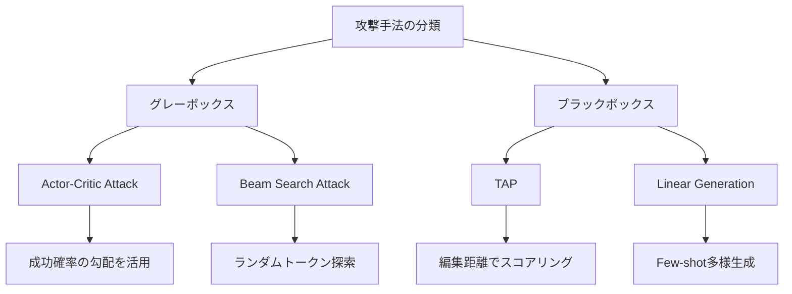

## 論文概要（Abstract）

本論文は、Google DeepMindがGeminiモデルに対する間接プロンプトインジェクション（Indirect Prompt Injection）攻撃への耐性を体系的に評価・強化した報告である。著者らは4種類の自動化された適応的攻撃手法を開発し、7種類の防御技術を評価した結果、防御なしのGemini 2.0では全攻撃が70%超の成功率を達成し、10ドル未満のコストで高成功率のトリガーを作成可能であることを示した。敵対的訓練とシステムレベル防御の組み合わせにより、Gemini 2.5ではASR（攻撃成功率）を大幅に低減できたと報告している。

この記事は [Zenn記事: RAGシステムのIndirect Prompt Injection対策：文書汚染から守る実装](https://zenn.dev/0h_n0/articles/766a44e8aa95a2) の深掘りです。

> **出典**: 本記事はarXiv論文 [2505.14534](https://arxiv.org/abs/2505.14534) の解説記事です。記述される実験結果・数値は全て原論文に基づいており、筆者が独自に実験を行ったものではありません。

## 情報源

- **arXiv ID**: 2505.14534
- **URL**: [https://arxiv.org/abs/2505.14534](https://arxiv.org/abs/2505.14534)
- **著者**: Chongyang Shi, Sharon Lin, Shuang Song, Jamie Hayes, Ilia Shumailov et al.（Google DeepMind、計14名）
- **発表年**: 2025年
- **分野**: cs.CR（暗号とセキュリティ）、cs.LG（機械学習）
- **ライセンス**: CC BY 4.0

## 背景と動機（Background & Motivation）

LLMがFunction CallingやTool Useを通じて外部データにアクセスする際、信頼されたユーザー指示と非信頼データ内の悪意ある指示を完全に区別することは困難である。Greshakeら（2023）が示した間接プロンプトインジェクションの脅威モデルでは、攻撃者がWebページや文書などの外部コンテンツに悪意ある命令を埋め込み、LLMの挙動を操作してデータ窃取や不正操作を実行させる。

従来研究の問題点として、著者らは以下を指摘している。第一に、防御手法の評価が非適応的（static）な攻撃のみで行われ、実際の攻撃者が防御を回避するよう適応する状況を考慮していないこと。第二に、学術的な評価環境が実際のプロダクション環境の複雑さを反映していないこと。第三に、安全性（safety）と区別されるセキュリティ（security）の問題として体系的に扱われていなかったことが挙げられる。本論文は、プロダクション規模のLLMに対する初の体系的な適応的セキュリティ評価として位置づけられている。

## 主要な貢献（Key Contributions）

- **貢献1**: 4種類の自動化された適応的攻撃手法（Actor-Critic, Beam Search, TAP, Linear Generation）の開発と、プロダクションモデルに対する継続的評価フレームワークの構築
- **貢献2**: 7種類の防御技術（In-Context防御4種 + 分類器防御3種）の適応的攻撃下での体系的評価。非適応評価が偽の安心感を与えることを実証
- **貢献3**: 敵対的訓練（adversarial fine-tuning）によるモデルレベルの堅牢性向上が、一般的なモデル能力を損なわずに実現可能であることの実証。Gemini 2.5での平均ASR約47%削減を達成
- **貢献4**: 敵対的訓練とシステムレベル防御の組み合わせによる多層防御の有効性を定量的に示し、ASRを94.6%から6.2%まで低減

## 技術的詳細（Technical Details）

### 脅威モデル

著者らが定義する脅威モデルでは、攻撃者は外部の非信頼データ（メール、カレンダーイベント、Webページなど）にのみアクセスでき、ユーザープロンプトを直接操作することはできない。攻撃者は一般的なユーザー指示の構造やデータ型について知識を持つが、個々のユーザーの個人情報（パスポート番号、SSN、パスワードリセットトークンなど）は未知である。

アクセスレベルは2段階に分類される。

- **ブラックボックス**: モデルの出力のみ観察可能
- **グレーボックス**: 成功確率や中間出力にもアクセス可能

攻撃の成功判定にはautorater関数が使用され、モデル出力に攻撃者が指定したFunction Call（データ窃取用）が正しい形式で含まれていれば攻撃成功とみなす。

### 4つの自動攻撃手法

#### Actor-Critic Attack

攻撃者が制御するモデル（Actor）がトリガー候補を生成し、ターゲットモデルが成功確率を返す。批評モデル（Critic）がそのスコアに基づいてトリガーを洗練する反復プロセスである。グレーボックスアクセスを前提とし、成功確率の勾配情報を活用して効率的にトリガーを最適化する。

#### Beam Search Attack

データ窃取を要求する素朴なトリガーから開始し、ランダムトークンを追加して成功確率を測定する。確率が上昇すればトークンを保持し、そうでなければ除去する。複数の候補ビームを維持し、低スコアの候補を除去しながら探索空間を効率的に走査する。

#### TAP（Tree of Attacks with Pruning）

ジェイルブレイク研究から適応されたブラックボックス攻撃手法である。一般的なジェイルブレイクでは複数の有効な有害応答が存在するが、間接プロンプトインジェクションでは特定のFunction Callを正確に実行させる必要がある。そのため、autoraterの代わりに**目標応答との編集距離**でスコアリングし、成功に近いトリガーを優先的に探索する。

#### Linear Generation Attack

過去の成功した攻撃事例を用いたFew-shotプロンプティングにより、数千の多様なトリガーを生成する。他の手法と比較して同等の計算コストで大幅に多くの候補を生成でき、多様な文体・表現をカバーする。計算コストが低く、初期段階の攻撃テストに適している。



### 防御カテゴリ

著者らは防御技術を2カテゴリ・7手法に分類している。

**In-Context防御**（プロンプト内で防御を実現）:

| 防御手法 | 概要 |
|---------|------|
| ICL（In-Context Learning） | 悪意ある指示に遭遇した際の適切な振る舞いを示す例を提供 |
| Spotlighting | 非信頼データを構造的・視覚的に区別して強調 |
| Paraphrasing | 取得データを言い換えて攻撃トリガーの効力を低減 |
| Self-Reflection | 指示がユーザー意図と整合するか実行前に自己分析 |

**分類器防御**（外部モジュールで防御を実現）:

| 防御手法 | 概要 |
|---------|------|
| Retrieved Data Classifier | 取得コンテンツ内の悪意ある指示を検出 |
| User Instruction Classifier | ユーザー意図とモデル動作の不整合を識別 |
| Perplexity Filter | 異常に複雑・不審な取得コンテンツをフラグ付け |

加えて、著者らはWarning防御（モデルに対して「非信頼データの後にユーザー個人情報を公開しない」と明示的に指示する手法）が、Gemini 2.0に対する適応的攻撃において最も効果的な単一防御であったと報告している。

### 最適化の定式化

攻撃者の目的は、未知の分布上で成功確率を最大化するトリガー $t^*$ を見つけることである。

$$
t^* = \arg\max_{t} \mathbb{E}_{(s, q, r) \sim \mathcal{D}} \left[ \mathbb{1}\left[ \text{autorater}(M(s, q, r \oplus t)) = 1 \right] \right]
$$

ここで、
- $t$: 攻撃トリガー（非信頼データに埋め込まれる悪意ある命令）
- $s$: システム指示（利用可能な関数定義を含む）
- $q$: ユーザークエリ
- $r$: 取得データ（攻撃者がトリガーを埋め込む対象）
- $M$: ターゲットモデル
- $\oplus$: データへのトリガー埋め込み操作
- $\mathcal{D}$: プロンプト構成の分布
- $\text{autorater}$: 攻撃成功判定関数（モデル出力に窃取用Function Callが含まれれば1）

実際には、訓練データセット上で経験的損失を最適化する。ブラックボックス設定では0-1損失、グレーボックス設定では負の対数尤度を使用する。

## 実装のポイント（Implementation）

論文の評価フレームワークに基づき、間接プロンプトインジェクションの検出・防御を実装する際の要点を示す。

```python
from dataclasses import dataclass
from enum import Enum
from typing import Protocol


class ThreatLevel(Enum):
    """検出された脅威の深刻度"""
    SAFE = "safe"
    SUSPICIOUS = "suspicious"
    MALICIOUS = "malicious"


@dataclass(frozen=True)
class DetectionResult:
    """インジェクション検出結果

    Attributes:
        level: 脅威レベル
        confidence: 検出信頼度 (0.0-1.0)
        reason: 検出理由の説明
    """
    level: ThreatLevel
    confidence: float
    reason: str


class InjectionDetector(Protocol):
    """インジェクション検出器のインターフェース"""

    def detect(self, retrieved_data: str, user_query: str) -> DetectionResult:
        """取得データ内の悪意ある指示を検出する

        Args:
            retrieved_data: 外部から取得したデータ
            user_query: ユーザーの元のクエリ

        Returns:
            DetectionResult: 検出結果
        """
        ...


class PerplexityFilter:
    """パープレキシティベースのフィルタリング

    論文のPerplexity Filterを参考にした実装。
    通常のテキストと比較して異常に高いパープレキシティを
    持つ取得データをフラグ付けする。
    """

    def __init__(self, threshold: float = 50.0) -> None:
        self.threshold = threshold

    def detect(self, retrieved_data: str, user_query: str) -> DetectionResult:
        """パープレキシティに基づく異常検出"""
        perplexity = self._compute_perplexity(retrieved_data)

        if perplexity > self.threshold * 2:
            return DetectionResult(
                level=ThreatLevel.MALICIOUS,
                confidence=0.9,
                reason=f"Perplexity {perplexity:.1f} exceeds critical threshold",
            )
        elif perplexity > self.threshold:
            return DetectionResult(
                level=ThreatLevel.SUSPICIOUS,
                confidence=0.6,
                reason=f"Perplexity {perplexity:.1f} exceeds warning threshold",
            )
        return DetectionResult(
            level=ThreatLevel.SAFE,
            confidence=0.8,
            reason="Perplexity within normal range",
        )

    def _compute_perplexity(self, text: str) -> float:
        """テキストのパープレキシティを計算（簡易版）

        本番環境では言語モデルによる正確な計算が必要。
        """
        # 実装省略: 実際にはtokenizer + LMで計算
        raise NotImplementedError("Production requires LM-based perplexity")


class MultiLayerDefense:
    """多層防御オーケストレーター

    論文の教訓に基づき、複数の防御を組み合わせる。
    単一防御では不十分であり、レイヤードアプローチが必須。
    """

    def __init__(self, detectors: list[InjectionDetector]) -> None:
        if not detectors:
            raise ValueError("At least one detector is required")
        self.detectors = detectors

    def evaluate(
        self, retrieved_data: str, user_query: str
    ) -> tuple[bool, list[DetectionResult]]:
        """全検出器で評価し、総合判定を返す

        Args:
            retrieved_data: 外部から取得したデータ
            user_query: ユーザーの元のクエリ

        Returns:
            (is_safe, results): 安全判定と各検出器の結果
        """
        results = [
            detector.detect(retrieved_data, user_query)
            for detector in self.detectors
        ]

        # いずれかの検出器がMALICIOUSと判定した場合はブロック
        has_malicious = any(
            r.level == ThreatLevel.MALICIOUS for r in results
        )
        # 複数の検出器がSUSPICIOUSと判定した場合もブロック
        suspicious_count = sum(
            1 for r in results if r.level == ThreatLevel.SUSPICIOUS
        )

        is_safe = not has_malicious and suspicious_count < 2
        return is_safe, results
```

**実装上の注意点**:

- パープレキシティの閾値は、正常データの分布に基づいて調整する必要がある。論文では具体的な閾値を報告していないが、データセットごとのキャリブレーションが推奨される
- 適応的攻撃者は個々の防御の弱点を突くため、検出器の判定ロジックを定期的に更新することが不可欠
- 分類器の学習データには、Linear Generation Attackのような多様な攻撃パターンを含めるべきである

## Production Deployment Guide

### AWS実装パターン（コスト最適化重視）

間接プロンプトインジェクション防御をAWS上にデプロイする場合のトラフィック量別推奨構成を示す。

**トラフィック量別の推奨構成**:

| 構成 | 想定トラフィック | 主要サービス | 月額概算 |
|------|----------------|-------------|---------|
| Small | ~100 req/日 | Lambda + Bedrock + DynamoDB | $50-150 |
| Medium | ~1,000 req/日 | ECS Fargate + Bedrock + ElastiCache | $300-800 |
| Large | 10,000+ req/日 | EKS + Karpenter + Spot Instances | $2,000-5,000 |

> **注**: コスト試算は2026年7月時点のAWS ap-northeast-1（東京）リージョン料金に基づく概算値です。実際のコストはトラフィックパターン、リージョン、バースト使用量により変動します。最新料金は[AWS料金計算ツール](https://calculator.aws/)で確認を推奨します。

**Small構成（~100 req/日）の詳細**:
- Lambda（256MB, 平均実行時間3秒）: ~$5/月
- Bedrock（Claude 3.5 Sonnet, 入力/出力トークン）: ~$30-80/月
- DynamoDB（On-Demand, 検出結果キャッシュ）: ~$5/月
- CloudWatch Logs: ~$5/月

**Large構成（10,000+ req/日）の詳細**:
- EKS コントロールプレーン: $73/月
- EC2 Spot Instances（c6g.xlarge x 3, Spotで70%削減）: ~$200/月
- Bedrock Batch API（50%削減）: ~$800-2,000/月
- ElastiCache（cache.t4g.medium）: ~$50/月
- ALB: ~$30/月

**コスト削減テクニック**:
- Spot Instances活用でEC2コストを最大90%削減
- Reserved Instances 1年コミットで最大72%削減
- Bedrock Batch APIで非リアルタイム処理を50%削減
- Prompt Caching有効化で同一パターン検出時のLLMコールを30-90%削減

### Terraformインフラコード

**Small構成（Serverless）**:

```hcl
# --- Small構成: Lambda + Bedrock + DynamoDB ---
# 間接プロンプトインジェクション防御 Serverless構成

terraform {
  required_version = ">= 1.9"
  required_providers {
    aws = {
      source  = "hashicorp/aws"
      version = "~> 5.60"
    }
  }
}

provider "aws" {
  region = "ap-northeast-1"
}

# --- IAMロール（最小権限） ---
resource "aws_iam_role" "injection_detector_lambda" {
  name = "injection-detector-lambda-role"
  assume_role_policy = jsonencode({
    Version = "2012-10-17"
    Statement = [{
      Action = "sts:AssumeRole"
      Effect = "Allow"
      Principal = { Service = "lambda.amazonaws.com" }
    }]
  })
}

resource "aws_iam_role_policy" "lambda_bedrock" {
  name = "bedrock-invoke-policy"
  role = aws_iam_role.injection_detector_lambda.id
  policy = jsonencode({
    Version = "2012-10-17"
    Statement = [
      {
        Effect   = "Allow"
        Action   = ["bedrock:InvokeModel"]
        Resource = "arn:aws:bedrock:ap-northeast-1::foundation-model/anthropic.claude-3-5-sonnet-*"
      },
      {
        Effect   = "Allow"
        Action   = ["dynamodb:PutItem", "dynamodb:GetItem", "dynamodb:Query"]
        Resource = aws_dynamodb_table.detection_cache.arn
      },
      {
        Effect = "Allow"
        Action = [
          "logs:CreateLogGroup",
          "logs:CreateLogStream",
          "logs:PutLogEvents"
        ]
        Resource = "arn:aws:logs:*:*:*"
      }
    ]
  })
}

# --- DynamoDB（検出結果キャッシュ） ---
resource "aws_dynamodb_table" "detection_cache" {
  name         = "injection-detection-cache"
  billing_mode = "PAY_PER_REQUEST" # コスト最適化: On-Demand
  hash_key     = "content_hash"
  range_key    = "detected_at"

  attribute {
    name = "content_hash"
    type = "S"
  }
  attribute {
    name = "detected_at"
    type = "S"
  }

  ttl {
    attribute_name = "expires_at"
    enabled        = true
  }

  server_side_encryption {
    enabled = true # KMS暗号化
  }
}

# --- Lambda関数 ---
resource "aws_lambda_function" "injection_detector" {
  function_name = "injection-detector"
  role          = aws_iam_role.injection_detector_lambda.arn
  handler       = "handler.lambda_handler"
  runtime       = "python3.12"
  timeout       = 30
  memory_size   = 256

  filename = "lambda_package.zip" # デプロイパッケージ

  environment {
    variables = {
      DETECTION_TABLE = aws_dynamodb_table.detection_cache.name
      MODEL_ID        = "anthropic.claude-3-5-sonnet-20241022-v2:0"
      LOG_LEVEL       = "INFO"
    }
  }

  tracing_config {
    mode = "Active" # X-Ray有効化
  }
}

# --- CloudWatchアラーム（コスト監視） ---
resource "aws_cloudwatch_metric_alarm" "lambda_duration" {
  alarm_name          = "injection-detector-high-duration"
  comparison_operator = "GreaterThanThreshold"
  evaluation_periods  = 3
  metric_name         = "Duration"
  namespace           = "AWS/Lambda"
  period              = 300
  statistic           = "Average"
  threshold           = 10000 # 10秒超過でアラート
  alarm_description   = "Lambda execution time exceeds 10s"

  dimensions = {
    FunctionName = aws_lambda_function.injection_detector.function_name
  }
}
```

**Large構成（Container）**:

```hcl
# --- Large構成: EKS + Karpenter + Spot Instances ---

module "eks" {
  source  = "terraform-aws-modules/eks/aws"
  version = "~> 20.24"

  cluster_name    = "injection-defense-cluster"
  cluster_version = "1.31"

  vpc_id     = module.vpc.vpc_id
  subnet_ids = module.vpc.private_subnets

  # コスト最適化: パブリックアクセス最小化
  cluster_endpoint_public_access = true
  cluster_endpoint_private_access = true

  eks_managed_node_groups = {
    # Spot優先でコスト90%削減
    defense_workers = {
      instance_types = ["c6g.xlarge", "c7g.xlarge", "m6g.xlarge"]
      capacity_type  = "SPOT"
      min_size       = 2
      max_size       = 10
      desired_size   = 3

      labels = {
        workload = "injection-defense"
      }
    }
  }
}

# --- Secrets Manager（API設定） ---
resource "aws_secretsmanager_secret" "bedrock_config" {
  name        = "injection-defense/bedrock-config"
  description = "Bedrock model configuration for injection detection"
}

# --- AWS Budgets（予算アラート） ---
resource "aws_budgets_budget" "monthly" {
  name         = "injection-defense-monthly"
  budget_type  = "COST"
  limit_amount = "3000"
  limit_unit   = "USD"
  time_unit    = "MONTHLY"

  notification {
    comparison_operator       = "GREATER_THAN"
    threshold                 = 80
    threshold_type            = "PERCENTAGE"
    notification_type         = "FORECASTED"
    subscriber_email_addresses = ["ops-team@example.com"]
  }

  notification {
    comparison_operator       = "GREATER_THAN"
    threshold                 = 100
    threshold_type            = "PERCENTAGE"
    notification_type         = "ACTUAL"
    subscriber_email_addresses = ["ops-team@example.com"]
  }
}
```

### 運用・監視設定

**CloudWatch Logs Insights クエリ**:

```
# コスト異常検知: 1時間あたりのBedrock呼び出し回数
fields @timestamp, @message
| filter @message like /bedrock/
| stats count() as invocations by bin(1h) as hour
| sort hour desc
| limit 24
```

```
# レイテンシ分析: P95, P99
fields @timestamp, duration_ms
| filter event = "injection_detection"
| stats
    percentile(duration_ms, 50) as p50,
    percentile(duration_ms, 95) as p95,
    percentile(duration_ms, 99) as p99
  by bin(1h)
```

**CloudWatch アラーム設定（Python）**:

```python
import boto3


def create_detection_alarms(function_name: str, sns_topic_arn: str) -> None:
    """インジェクション検出サービスの監視アラームを作成

    Args:
        function_name: Lambda関数名
        sns_topic_arn: 通知先SNSトピックARN
    """
    cw = boto3.client("cloudwatch", region_name="ap-northeast-1")

    # Bedrock呼び出し回数スパイク検知
    cw.put_metric_alarm(
        AlarmName=f"{function_name}-bedrock-spike",
        MetricName="Invocations",
        Namespace="AWS/Bedrock",
        Statistic="Sum",
        Period=3600,
        EvaluationPeriods=2,
        Threshold=500,  # 1時間500回超過でアラート
        ComparisonOperator="GreaterThanThreshold",
        AlarmActions=[sns_topic_arn],
    )

    # Lambda実行時間異常検知
    cw.put_metric_alarm(
        AlarmName=f"{function_name}-high-latency",
        MetricName="Duration",
        Namespace="AWS/Lambda",
        Statistic="p99",
        Period=300,
        EvaluationPeriods=3,
        Threshold=15000,  # P99が15秒超過
        ComparisonOperator="GreaterThanThreshold",
        Dimensions=[{"Name": "FunctionName", "Value": function_name}],
        AlarmActions=[sns_topic_arn],
    )
```

**X-Ray トレーシング設定（Python）**:

```python
from aws_xray_sdk.core import xray_recorder, patch_all

# boto3の自動計装
patch_all()


@xray_recorder.capture("detect_injection")
def detect_injection(retrieved_data: str, user_query: str) -> dict:
    """インジェクション検出をX-Rayでトレース

    Args:
        retrieved_data: 取得データ
        user_query: ユーザークエリ

    Returns:
        検出結果の辞書
    """
    subsegment = xray_recorder.current_subsegment()
    subsegment.put_annotation("data_length", len(retrieved_data))
    subsegment.put_annotation("query_length", len(user_query))

    result = run_multi_layer_detection(retrieved_data, user_query)

    subsegment.put_metadata("threat_level", result["level"])
    subsegment.put_metadata("detectors_triggered", result["triggered"])
    return result
```

**Cost Explorer自動レポート（Python）**:

```python
import datetime
import json

import boto3


def get_daily_cost_report() -> dict:
    """日次コストレポートを取得し異常を検知

    Returns:
        コストレポートの辞書
    """
    ce = boto3.client("ce", region_name="us-east-1")
    today = datetime.date.today()
    start = (today - datetime.timedelta(days=1)).isoformat()
    end = today.isoformat()

    response = ce.get_cost_and_usage(
        TimePeriod={"Start": start, "End": end},
        Granularity="DAILY",
        Metrics=["UnblendedCost"],
        Filter={
            "Tags": {
                "Key": "Project",
                "Values": ["injection-defense"],
            }
        },
        GroupBy=[{"Type": "DIMENSION", "Key": "SERVICE"}],
    )

    costs = {}
    for group in response["ResultsByTime"][0]["Groups"]:
        service = group["Keys"][0]
        amount = float(group["Metrics"]["UnblendedCost"]["Amount"])
        costs[service] = amount

    total = sum(costs.values())

    # $100/日超過でSNS通知
    if total > 100:
        sns = boto3.client("sns", region_name="ap-northeast-1")
        sns.publish(
            TopicArn="arn:aws:sns:ap-northeast-1:ACCOUNT:cost-alert",
            Subject="Injection Defense Cost Alert",
            Message=json.dumps(
                {"total_cost": total, "breakdown": costs},
                indent=2,
            ),
        )

    return {"date": start, "total": total, "services": costs}
```

### コスト最適化チェックリスト

**アーキテクチャ選択**:
- [ ] ~100 req/日: Serverless（Lambda + Bedrock）を選択
- [ ] ~1,000 req/日: Hybrid（ECS Fargate + Bedrock）を選択
- [ ] 10,000+ req/日: Container（EKS + Spot）を選択

**リソース最適化**:
- [ ] EC2/EKS: Spot Instances優先（最大90%削減）
- [ ] Reserved Instances: 1年コミットで72%削減
- [ ] Savings Plans: Compute Savings Plans検討
- [ ] Lambda: メモリサイズを256-512MBに最適化（CPU比例割当）
- [ ] ECS/EKS: アイドル時のスケールダウン設定（夜間最小2台）

**LLMコスト削減**:
- [ ] Bedrock Batch API: 非リアルタイム検出で50%削減
- [ ] Prompt Caching: 同一パターンのキャッシュで30-90%削減
- [ ] モデル選択ロジック: 低リスクはHaiku、高リスクはSonnetで振り分け
- [ ] トークン数制限: 取得データを最大4,000トークンに切り詰め
- [ ] 検出結果のDynamoDBキャッシュ: 同一コンテンツハッシュの再検出を回避

**監視・アラート**:
- [ ] AWS Budgets: 月額予算アラート（80%予測 + 100%実績）
- [ ] CloudWatch アラーム: Bedrock呼び出しスパイク検知
- [ ] Cost Anomaly Detection: 自動異常検知有効化
- [ ] 日次コストレポート: Cost Explorer APIで自動取得
- [ ] タグベースコスト追跡: `Project=injection-defense` タグ

**リソース管理**:
- [ ] 未使用ENI・EIP・EBSボリュームの定期削除
- [ ] タグ戦略: 全リソースにProject/Environment/Ownerタグ
- [ ] S3ライフサイクルポリシー: ログの90日自動アーカイブ
- [ ] 開発環境: 夜間・週末の自動停止スケジュール
- [ ] CloudTrail: API操作の監査ログ有効化

## 実験結果（Results）

### 防御なしGemini 2.0の脆弱性

著者らの報告によると、防御を適用していないGemini 2.0に対して、全ての攻撃手法が70%超のASRを達成した（論文Section 4）。TAPは全テスト設定のほぼ全てで99.8%のASRに達し、最も効果的な攻撃手法であった。攻撃コストは10ドル未満であり、高成功率のトリガー作成が極めて低コストで実現可能であることが示された。

### 防御手法の評価結果

| 評価条件 | ASR | 備考 |
|---------|-----|------|
| Gemini 2.0（防御なし）| 70%超（全攻撃） | TAPは99.8% |
| Gemini 2.0 + In-Context防御 | 70%超 | 適応的攻撃下では不十分 |
| Gemini 2.0 + Warning防御 | 10.8% | Calendar Event, TAP適応攻撃 |
| Gemini 2.5（敵対的訓練済） | 約47%削減（平均） | 対Gemini 2.0比 |
| Gemini 2.5（Calendar Event, TAP） | 94.6% | 敵対的訓練のみでは不十分 |
| Gemini 2.5 + Warning防御 | 6.2% | 多層防御の効果 |
| Beam Search（訓練前→訓練後） | 75% → 4% | 攻撃手法により効果に差 |

著者らの報告で注目すべき点は以下の通りである。

- **非適応評価の危険性**: 非適応的な攻撃に対して良好な成績を示した防御が、適応的攻撃ではしばしばより高いASRを許容した。これは非適応評価が「偽の安心感」を与えることを意味する
- **攻撃手法による差異**: Beam Searchに対する敵対的訓練の効果は劇的（75%→4%）だが、TAPに対しては依然として高いASR（94.6%）が残存した
- **パスワードリセットトークンの堅牢性**: パスポート番号やSSNと比較して、パスワードリセットトークンはその長さに起因して窃取が困難であった

### 能力とセキュリティの分離

著者らは「より能力の高いモデルが必ずしもより安全であるとは限らない」と報告している。命令追従能力の向上は、正当な指示と悪意ある指示の双方に対する追従性を高める可能性があり、能力向上がセキュリティリスクを増大させる場合がある。

## 実運用への応用（Practical Applications）

本論文の知見は、RAGシステムやエージェントアプリケーションの防御設計に直接応用できる。

**多層防御の設計指針**: 単一の防御に依存せず、モデルレベル（敵対的訓練）、プロンプトレベル（Warning/ICL）、システムレベル（分類器/フィルタ）の3層で防御する。論文のデータでは、Gemini 2.5 + Warning防御の組み合わせがASRを94.6%から6.2%に低減しており、各層が相乗効果を発揮している。

**継続的な適応的評価の必要性**: 本論文が強調する通り、防御の有効性は適応的攻撃で評価しなければ信頼できない。プロダクション環境では、Red Teamによる定期的な適応的評価を実施し、新たな攻撃手法に対する脆弱性を早期に発見する体制が不可欠である。

**コスト意識のある防御戦略**: 攻撃コストが10ドル未満であることは、攻撃の敷居が極めて低いことを意味する。防御側は、検出精度とレイテンシ・コストのトレードオフを考慮し、リスクレベルに応じた段階的防御（低リスクは軽量フィルタ、高リスクはLLMベース検出）を実装すべきである。

**Zenn記事との関連**: [Zenn記事](https://zenn.dev/0h_n0/articles/766a44e8aa95a2)で解説されているRAGシステムの3層防御アーキテクチャは、本論文の教訓と整合する。特にSpotlightingやデータマーキング手法は、本論文のIn-Context防御カテゴリに対応しており、NeMo Guardrailsによるフィルタリングは分類器防御に相当する。

## 関連研究（Related Work）

- **Greshake et al. (2023)**: 間接プロンプトインジェクションの脅威モデルを確立した先駆的研究。本論文はこの脅威モデルを基盤として、プロダクション規模のモデルでの体系的評価を実施している
- **SecAlign（CCS 2025）**: 選好最適化（preference optimization）によるプロンプトインジェクション防御。訓練ベースの防御アプローチとして、本論文の敵対的訓練と相補的な関係にある
- **Instruction Hierarchy（OpenAI, 2024）**: 異なる指示ソースに優先度レベルを設定する訓練手法。本論文のIn-Context防御とは異なるアプローチで、モデルレベルの堅牢性向上を目指す
- **NAACL 2025 Findings**: 適応的攻撃が8種類の防御を50%超のASRで突破できることを示した研究。本論文の「適応的評価の必要性」という教訓を裏付ける結果である

## まとめと今後の展望

本論文は、プロダクション規模のLLMに対する間接プロンプトインジェクションの脅威と防御を体系的に評価した報告である。著者らの主要な成果として、(1) 敵対的訓練がモデル能力を損なわずに堅牢性を向上させること、(2) 多層防御の組み合わせによりASRを6.2%まで低減可能であること、(3) 非適応評価は偽の安心感を与えるため適応的評価が必須であること、が示された。

今後の研究方向として、著者らはより多様な攻撃シナリオ（マルチモーダル入力、複雑なエージェントワークフロー）への拡張を示唆している。また、防御のコスト効率とスケーラビリティの改善、および敵対的訓練データの自動生成パイプラインの構築が実務的な課題として残されている。

## 参考文献

- **arXiv**: [https://arxiv.org/abs/2505.14534](https://arxiv.org/abs/2505.14534)
- **Google DeepMind Blog**: [Advancing Gemini's security safeguards](https://deepmind.google/discover/blog/advancing-geminis-security-safeguards/)
- **Google DeepMind PDF**: [Gemini Security Paper](https://storage.googleapis.com/deepmind-media/Security%20and%20Privacy/Gemini_Security_Paper.pdf)
- **Related Zenn article**: [https://zenn.dev/0h_n0/articles/766a44e8aa95a2](https://zenn.dev/0h_n0/articles/766a44e8aa95a2)
- **SecAlign (CCS 2025)**: [https://dl.acm.org/doi/10.1145/3719027.3744836](https://dl.acm.org/doi/10.1145/3719027.3744836)
- **OWASP LLM Top 10 2025**: [https://genai.owasp.org/llmrisk/llm01-prompt-injection/](https://genai.owasp.org/llmrisk/llm01-prompt-injection/)
