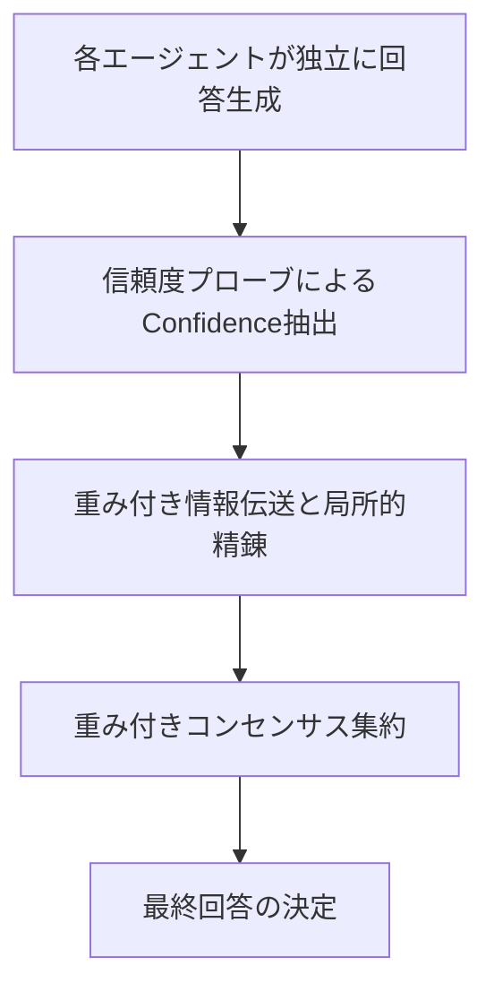
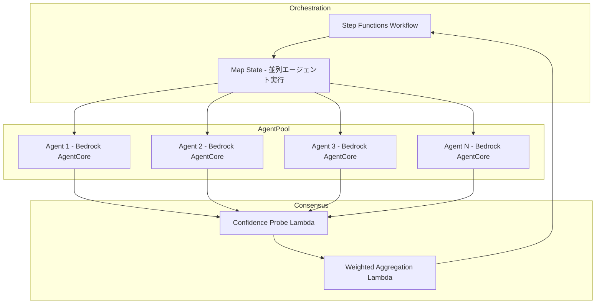

> **この記事はAIによって生成されました。** 内容の正確性には配慮していますが、最新情報は原論文をご確認ください。

## 論文概要

本記事では、Zheng らによる論文「Rethinking the Reliability of Multi-agent System: A Perspective from Byzantine Fault Tolerance」（AAAI 2026 採択）を解説する。この研究は、LLMベースエージェントがマルチエージェントシステム（MAS）において従来型エージェントよりも誤情報に対して高い懐疑性を示すことを実験的に明らかにし、その特性を活用したCP-WBFT（Confidence Probe-based Weighted Byzantine Fault Tolerant）コンセンサス機構を提案している。7ノード中6ノードがビザンチン障害（85.7%の障害率）という極端な条件下でも、完全グラフトポロジーにおいて100%の精度を達成したと報告されている。

**出典**: [arXiv:2511.10400](https://arxiv.org/abs/2511.10400) (Zheng, L., Chen, J., Yin, Q., Zhang, J., Zeng, X., & Tian, Y., 2025)

**関連Zenn記事**: [Bedrock AgentCore×Step Functionsで業務エージェントの耐障害ワークフローを設計する](https://zenn.dev/0h_n0/articles/5165b29d849e3f) -- Step FunctionsのMapステート並列実行における障害分離パターンを扱っており、本論文のBFTアプローチと相補的な関係にある。

## 情報源

| 項目 | 内容 |
|------|------|
| タイトル | Rethinking the Reliability of Multi-agent System: A Perspective from Byzantine Fault Tolerance |
| 著者 | Lifan Zheng, Jiawei Chen, Qinghong Yin, Jingyuan Zhang, Xinyi Zeng, Yu Tian |
| 公開日 | 2025年11月13日（改訂: 2025年12月16日） |
| カテゴリ | cs.MA (Multiagent Systems) |
| 採択 | AAAI 2026 |
| URL | [https://arxiv.org/abs/2511.10400](https://arxiv.org/abs/2511.10400) |

## 背景と動機

### ビザンチン障害耐性（BFT）の基礎

分散システムにおけるビザンチン障害とは、ノードが任意の（悪意ある可能性のある）振る舞いをする障害モデルである。クラッシュ障害（ノードが単純に停止する）と異なり、ビザンチン障害ではノードが誤った情報を送信したり、異なるノードに矛盾するメッセージを送信したりする可能性がある。

古典的なPBFT（Practical Byzantine Fault Tolerance、Castro & Liskov, 1999）では、システム全体で$n$個のノードがあり、そのうち$f$個がビザンチン障害ノードであるとき、合意を達成するために以下の条件が必要となる。

$$n \geq 3f + 1$$

この条件は、任意の$2f+1$ノードのクォーラムにおいて、少なくとも$f+1$個の正常ノードが含まれることを保証する。つまり、PBFTは全ノードの1/3未満が障害である場合にのみ正常に機能する。

### マルチエージェントシステムの信頼性課題

LLMベースのマルチエージェントシステムでは、各エージェントがLLMを用いて推論・意思決定を行う。しかし、LLMはハルシネーション（幻覚）、プロンプトインジェクション、モデルの能力差などにより、誤った出力を生成する可能性がある。このような状況では、一部のエージェントが「ビザンチンノード」として振る舞う可能性があり、システム全体の信頼性を損なう。

従来のBFTプロトコルは、エージェントの振る舞いを決定論的と仮定し、意味的な理解能力を考慮していない。著者らは、LLMの持つ内省的・弁別的能力がBFTに新たな可能性をもたらすという仮説のもと、本研究を行っている。

## 主要な貢献

著者らは以下の貢献を報告している。

- **LLMエージェントの懐疑性の発見**: LLMベースエージェントが誤情報の処理において従来型エージェントよりも高い懐疑性を示すことを実験的に確認
- **CP-WBFTコンセンサス機構の提案**: LLMの信頼度プローブに基づく重み付きBFTコンセンサスアルゴリズムを設計
- **2つの信頼度抽出手法**: プロンプトレベル（PCP）と隠れ層レベル（HCP）の2種類の信頼度プローブを提案
- **極端な障害条件での有効性**: 85.7%（7ノード中6ノード）の障害率、さらには93.3%（15ノード中14ノード）の障害率でも機能することを実証
- **多様なトポロジーへの対応**: 完全グラフ、スター、ツリー、チェーン、ランダムグラフ、レイヤードグラフの6種類のネットワーク構造で評価

## 技術的詳細

### CP-WBFTアルゴリズムの全体像

CP-WBFTは、従来のPBFTを拡張し、各エージェントの信頼度に基づいて情報伝送を重み付けするコンセンサス機構である。以下の3段階で動作する。



### 信頼度プローブ（Confidence Probe）

著者らは2種類の信頼度抽出手法を提案している。

#### 1. プロンプトレベル信頼度プローブ（PCP）

エージェントに回答と同時に信頼度を自己申告させる手法である。信頼度抽出は以下の式で定義される。

$$C_{\text{PCP}}(x) = \text{parse}(A(x \oplus p_{\text{conf}}))$$

ここで、$x$は入力、$p_{\text{conf}}$は信頼度校正プロンプト、$A$はエージェントの応答関数、$\text{parse}$は応答から信頼度スコアを抽出する関数である。出力は「Answer: [回答], Confidence: [0.00-1.00]」の形式に標準化される。

PCPの利点は、APIアクセスのみで実行できるため、GPT-4oなどのクローズドモデルにも適用可能である点にある。

#### 2. 隠れ層信頼度プローブ（HCP）

モデルの内部表現（隠れ層の活性化パターン）から信頼度を推定する手法である。以下の手順で動作する。

**ステップ1: 隠れ状態の抽出と平均プーリング**

回答トークン集合$T_a$に対して、第$l$層の隠れ状態をプーリングする。

$$h_p^{(l)} = \frac{1}{|T_a|} \sum_{t \in T_a} h_t^{(l)}$$

ここで、$h_t^{(l)}$は第$l$層におけるトークン$t$の隠れ状態ベクトルである。

**ステップ2: 次元削減と分類**

PCAで256次元に削減し、z-score正規化を行った後、ロジスティック回帰で正解確率を推定する。

$$C_{\text{HCP}}(x, y) = \sigma(w^T \text{PCA}(h_p^{(l)}) + b)$$

ここで、$\sigma$はシグモイド関数、$w$と$b$はロジスティック回帰の重みとバイアスである。

著者らの実験では、LLaMA3-8Bの第16層（GSM8Kタスク）および第17層（XSTestタスク）が最適層として報告されている。また、プーリングによる特徴集約が、クエリ末尾トークンや回答末尾トークンのみを用いる方法よりも高い精度を示した（LLaMA3 GSM8K: プーリング84.31% vs 回答末尾73.01% vs クエリ末尾61.71%）。

### 重み付きコンセンサス集約

各エージェントから回答と信頼度が得られた後、以下の手順で最終回答を決定する。

**局所的精錬（Local Refinement）**: 隣接エージェント$j$の信頼度$C_j(x)$が自身の信頼度$C_i(x)$より高い場合、エージェント$i$はエージェント$j$の回答を採用する。

**重み付き集約**: 同じ回答$r$を持つエージェント集合$A_r$に対して、以下の式で最終回答を選定する。

$$R = \arg\max_r \left[ \frac{1}{|A_r|} \sum_{i \in A_r} C_i^{\text{final}}(x),\; |A_r| \right]$$

平均信頼度が最も高い回答グループが選択され、同点の場合は支持者数$|A_r|$で決定する。従来のPBFTが単純な多数決（$2f+1$のクォーラム）を用いるのに対し、CP-WBFTは信頼度による重み付き超多数決を採用している点が本質的な違いである。

## 実装のポイント

CP-WBFTを実装する際の主要な設計判断について述べる。

### PCP vs HCPの選択基準

| 観点 | PCP | HCP |
|------|-----|-----|
| モデルアクセス | APIのみで可 | 内部状態へのアクセスが必要 |
| 適用モデル | GPT-4o等クローズドモデル | LLaMA等オープンモデル |
| 信頼度精度 | 自己申告のため校正誤差あり | 内部表現に基づくため高精度 |
| 計算コスト | 低（追加推論不要） | 中（隠れ状態抽出+PCA+分類） |
| 事前学習 | 不要 | ロジスティック回帰の学習が必要 |

著者らの実験では、HCPがPCPを一貫して上回る性能を示している。特に障害率が高い条件では、自己申告の信頼度（PCP）はビザンチンエージェントに操作される可能性があるが、HCPは内部表現から客観的に信頼度を推定するため、操作に対してより頑健である。

### トポロジーの影響

完全グラフトポロジーでは、全エージェントが互いに直接通信できるため、正常エージェントが全情報にアクセスでき、最も高い耐障害性を示す。一方、チェーントポロジーでは情報伝搬が線形であるため、ビザンチンノードが途中に位置すると情報が遮断され、性能が低下する。実用的なシステム設計においては、通信コストと耐障害性のトレードオフを考慮してトポロジーを選択する必要がある。

## Production Deployment Guide

### マルチエージェントBFTシステムのAWS実装

CP-WBFTの概念をAWS上のマルチエージェントシステムに適用する場合のアーキテクチャについて、Step FunctionsとBedrock AgentCoreを中心に解説する。関連Zenn記事で扱われているMapステート並列実行パターンと組み合わせることで、耐障害性の高いエージェントワークフローを構築できる。

### アーキテクチャ概要



### Step 1: エージェント並列実行（Mapステート）

Step FunctionsのMapステートを使用して、複数のBedrock AgentCoreインスタンスを並列に実行する。Mapステートの障害分離特性により、1つのエージェントが失敗しても他のエージェントの実行には影響しない。

```json
{
  "Type": "Map",
  "ItemsPath": "$.agentConfigs",
  "MaxConcurrency": 7,
  "ToleratedFailurePercentage": 85,
  "ItemProcessor": {
    "ProcessorConfig": {
      "Mode": "INLINE"
    },
    "StartAt": "InvokeAgent",
    "States": {
      "InvokeAgent": {
        "Type": "Task",
        "Resource": "arn:aws:states:::bedrock-agentcore:invokeHarness",
        "Parameters": {
          "HarnessIdentifier.$": "$.harnessId",
          "Input.$": "$.prompt"
        },
        "ResultSelector": {
          "agentId.$": "$.AgentId",
          "response.$": "$.Output",
          "latencyMs.$": "$.ResponseMetadata.LatencyMs"
        },
        "Catch": [
          {
            "ErrorEquals": ["States.ALL"],
            "ResultPath": "$.error",
            "Next": "MarkAsFailed"
          }
        ],
        "End": true
      },
      "MarkAsFailed": {
        "Type": "Pass",
        "Result": {
          "status": "BYZANTINE",
          "confidence": 0.0
        },
        "End": true
      }
    }
  },
  "Next": "ConfidenceProbe"
}
```

ここで `ToleratedFailurePercentage: 85` は、CP-WBFTが85.7%の障害率まで耐えられるという論文の知見に基づいた設定である。従来のPBFT的アプローチでは33%が上限であったが、信頼度ベースの重み付けにより、このしきい値を引き上げることが可能となる。

### Step 2: 信頼度プローブの実装（PCP方式）

本番環境ではBedrock AgentCoreのAPIアクセスを前提とするため、PCP方式の信頼度抽出が実用的である。Lambda関数で各エージェントの回答に対して信頼度を付与する。

```python
import json
import re
from typing import TypedDict

import boto3


class AgentResponse(TypedDict):
    agent_id: str
    response: str
    confidence: float


class ConfidenceResult(TypedDict):
    agent_id: str
    response: str
    confidence: float
    is_valid: bool


bedrock = boto3.client("bedrock-runtime")

CONFIDENCE_PROMPT_TEMPLATE = """以下の回答の正確性を0.00から1.00の範囲で評価してください。

質問: {question}
回答: {response}

以下の形式で出力してください:
Confidence: [0.00-1.00]
Reasoning: [簡潔な理由]"""


def extract_confidence(text: str) -> float:
    """レスポンステキストから信頼度スコアを抽出する。

    Args:
        text: LLMからのレスポンス全文

    Returns:
        0.0-1.0の信頼度スコア。抽出失敗時は0.5を返す。
    """
    match = re.search(r"Confidence:\s*([\d.]+)", text)
    if match:
        score = float(match.group(1))
        return max(0.0, min(1.0, score))
    return 0.5  # フォールバック


def probe_confidence(
    agent_response: AgentResponse,
    question: str,
    model_id: str = "anthropic.claude-sonnet-4-20250514",
) -> ConfidenceResult:
    """単一エージェントの回答に対して信頼度プローブを実行する。

    Args:
        agent_response: エージェントの回答情報
        question: 元の質問テキスト
        model_id: 信頼度評価に使用するモデルID

    Returns:
        信頼度スコアが付与されたConfidenceResult
    """
    prompt = CONFIDENCE_PROMPT_TEMPLATE.format(
        question=question,
        response=agent_response["response"],
    )

    response = bedrock.invoke_model(
        modelId=model_id,
        body=json.dumps({
            "anthropic_version": "bedrock-2023-05-31",
            "max_tokens": 256,
            "messages": [{"role": "user", "content": prompt}],
            "temperature": 0.0,
        }),
    )

    result_text = json.loads(response["body"].read())["content"][0]["text"]
    confidence = extract_confidence(result_text)

    return ConfidenceResult(
        agent_id=agent_response["agent_id"],
        response=agent_response["response"],
        confidence=confidence,
        is_valid=confidence > 0.0,
    )
```

信頼度プローブには、タスク実行エージェントとは異なるモデルを使用することが望ましい。同一モデルを使用すると、同じバイアスが信頼度評価にも反映される可能性がある。

### Step 3: 重み付きコンセンサス集約

論文のコンセンサス集約式をLambda関数として実装する。

```python
from collections import defaultdict
from typing import TypedDict


class ConsensusInput(TypedDict):
    response: str
    confidence: float
    agent_id: str


class ConsensusResult(TypedDict):
    final_response: str
    avg_confidence: float
    supporter_count: int
    total_agents: int
    dissenting_agents: list[str]


def weighted_consensus(
    results: list[ConsensusInput],
    similarity_threshold: float = 0.9,
) -> ConsensusResult:
    """CP-WBFTの重み付きコンセンサス集約を実行する。

    論文の式: R = argmax_r [mean(C_i for i in A_r), |A_r|]
    平均信頼度が最大の回答グループを選択し、
    同点の場合は支持者数で決定する。

    Args:
        results: 各エージェントの回答と信頼度のリスト
        similarity_threshold: 回答の類似度しきい値

    Returns:
        コンセンサス結果
    """
    # 回答ごとにグループ化
    groups: dict[str, list[ConsensusInput]] = defaultdict(list)
    for r in results:
        if r["confidence"] > 0.0:
            groups[r["response"]].append(r)

    if not groups:
        return ConsensusResult(
            final_response="NO_CONSENSUS",
            avg_confidence=0.0,
            supporter_count=0,
            total_agents=len(results),
            dissenting_agents=[r["agent_id"] for r in results],
        )

    # 各グループの平均信頼度を計算し、最大のグループを選択
    best_response = ""
    best_avg_conf = -1.0
    best_count = 0

    for response, members in groups.items():
        avg_conf = sum(m["confidence"] for m in members) / len(members)
        count = len(members)

        # 平均信頼度 > 現在の最大、または同点なら支持者数で判定
        if (avg_conf > best_avg_conf) or (
            avg_conf == best_avg_conf and count > best_count
        ):
            best_response = response
            best_avg_conf = avg_conf
            best_count = count

    supporter_ids = {
        r["agent_id"]
        for r in results
        if r["response"] == best_response
    }
    dissenting = [
        r["agent_id"] for r in results if r["agent_id"] not in supporter_ids
    ]

    return ConsensusResult(
        final_response=best_response,
        avg_confidence=best_avg_conf,
        supporter_count=best_count,
        total_agents=len(results),
        dissenting_agents=dissenting,
    )
```

### Step 4: ワークフロー全体の構成

Step Functionsのステートマシン定義として、上記のコンポーネントを統合する。

```json
{
  "Comment": "CP-WBFT Multi-Agent Consensus Workflow",
  "StartAt": "PrepareAgentConfigs",
  "States": {
    "PrepareAgentConfigs": {
      "Type": "Pass",
      "Parameters": {
        "question.$": "$.question",
        "agentConfigs.$": "States.ArrayRange(1, $.agentCount, 1)"
      },
      "Next": "ParallelAgentExecution"
    },
    "ParallelAgentExecution": {
      "Type": "Map",
      "Comment": "各エージェントを並列実行（障害分離あり）",
      "Next": "ConfidenceProbe"
    },
    "ConfidenceProbe": {
      "Type": "Task",
      "Resource": "arn:aws:lambda:ap-northeast-1:ACCOUNT:function:confidence-probe",
      "Next": "WeightedConsensus"
    },
    "WeightedConsensus": {
      "Type": "Task",
      "Resource": "arn:aws:lambda:ap-northeast-1:ACCOUNT:function:weighted-consensus",
      "Next": "EvaluateConsensus"
    },
    "EvaluateConsensus": {
      "Type": "Choice",
      "Choices": [
        {
          "Variable": "$.avg_confidence",
          "NumericGreaterThanEquals": 0.7,
          "Next": "ReturnResult"
        },
        {
          "Variable": "$.final_response",
          "StringEquals": "NO_CONSENSUS",
          "Next": "FallbackToHuman"
        }
      ],
      "Default": "RetryWithMoreAgents"
    },
    "RetryWithMoreAgents": {
      "Type": "Task",
      "Comment": "信頼度が低い場合、エージェント数を増やして再試行",
      "Resource": "arn:aws:lambda:ap-northeast-1:ACCOUNT:function:scale-agents",
      "Next": "ParallelAgentExecution"
    },
    "FallbackToHuman": {
      "Type": "Task",
      "Comment": "コンセンサス不成立時は人間にエスカレーション",
      "Resource": "arn:aws:states:::sns:publish",
      "Parameters": {
        "TopicArn": "arn:aws:sns:ap-northeast-1:ACCOUNT:human-review",
        "Message.$": "States.Format('Consensus failed. Question: {}', $.question)"
      },
      "End": true
    },
    "ReturnResult": {
      "Type": "Succeed"
    }
  }
}
```

### 運用上の考慮事項

**コスト最適化**: CP-WBFTでは各回答に対して追加の信頼度プローブ呼び出しが発生する。エージェント数$n$に対して、少なくとも$n$回の追加LLM呼び出しが必要となる。Bedrock AgentCoreのInvokeHarness APIコストとLambdaの実行時間を勘案し、エージェント数は必要最小限に抑えることが望ましい。論文の結果から、完全グラフトポロジーでは7ノード（正常1 + ビザンチン6）でも機能するため、3-5ノードから開始し、信頼度が低い場合に動的にスケールアウトする戦略が実用的である。

**レイテンシ管理**: Mapステートの並列実行により、エージェント実行自体は並列化できる。しかし、信頼度プローブと集約はシーケンシャルに実行されるため、全体のレイテンシは以下の構造となる。

$$T_{\text{total}} = T_{\text{agent}}^{\text{max}} + T_{\text{probe}} + T_{\text{aggregate}}$$

ここで$T_{\text{agent}}^{\text{max}}$は最も遅いエージェントの実行時間（Mapステートの並列実行による）である。Step FunctionsのTimeoutSecondsパラメータで個別エージェントのタイムアウトを設定し、応答しないエージェントをビザンチンノードとして扱うことで、全体のレイテンシを制御できる。

**監視とオブザーバビリティ**: 各ラウンドの信頼度分布、コンセンサス到達率、ビザンチン判定されたエージェントの割合をCloudWatch Metricsに記録する。信頼度が継続的に低いエージェントは、モデルの劣化やプロンプトの問題を示唆している可能性がある。

## 実験結果

### 実験設定

著者らは以下の条件で評価を行っている。

- **データセット**: GSM8K（数学的推論）10問、XSTest（安全性評価）10問、CommonsenseQA（常識推論）10問
- **モデル構成（PCP）**: 正常エージェントにGPT-4o-mini、ビザンチンエージェントにGPT-3.5-turbo
- **モデル構成（HCP）**: 正常エージェントにLLaMA3.1-8B-Instruct、ビザンチンエージェントにLLaMA3-8B-Instruct
- **トポロジー**: 完全グラフ、スター（中心悪意/葉悪意）、ツリー、チェーン、ランダムグラフ、レイヤードグラフの6種類

### 主要な結果（7ノード中6ノードがビザンチン = 85.7%障害率）

| トポロジー | GSM8K (HCP) FAA | XSTest (HCP) FAA | BFTI |
|------------|-----------------|-------------------|------|
| 完全グラフ | 100% | 100% | +85.71% |
| スター（葉悪意） | 100% | 100% | +85.71% |
| ツリー | -- | 57.14% | +42.86% |
| チェーン | 42.86% | -- | +28.57% |

ここでFAA（Final Agent Accuracy）は最終的なエージェント精度、BFTI（Byzantine Fault Tolerance Improvement）はFAAからIAA（Initial Agent Accuracy）を引いた改善幅である。

さらに、15ノード中14ノードがビザンチン（93.3%障害率）という極端な条件の完全グラフでは、IAA 6.67%からFAA 100%への改善（BFTI +93.33%）が報告されている。これは、たった1つの正常エージェントの信頼度が十分に高ければ、そのエージェントの回答がコンセンサスとして採用されることを示している。

### HCPの特徴抽出比較

隠れ層からの特徴抽出方法として3種類が比較されている。

| 手法 | LLaMA3 GSM8K | LLaMA3 XSTest |
|------|-------------|---------------|
| プーリング（全回答トークン平均） | 84.31% | 92.86% |
| 回答末尾トークン | 73.01% | 76.19% |
| クエリ末尾トークン | 61.71% | 80.95% |

全回答トークンの平均プーリングが一貫して優れた性能を示しており、単一トークンの隠れ状態よりも回答全体の表現を捉えることの重要性を示唆している。

## 実運用への応用

### Step Functions Mapステートとの関連

関連Zenn記事で扱われているStep FunctionsのMapステート並列実行パターンは、CP-WBFTの「並列エージェント実行+コンセンサス」というアーキテクチャと自然に対応する。Mapステートの `ToleratedFailurePercentage` パラメータにより、一部のエージェントが失敗してもワークフロー全体を継続できる。この障害分離機能は、ビザンチンノードの存在を前提とするCP-WBFTの設計思想と合致している。

### 適用が期待される業務シナリオ

- **金融取引の判断**: 複数のLLMエージェントが独立にリスク評価を行い、信頼度ベースのコンセンサスで最終判断を下す
- **医療画像診断の支援**: 複数のAIモデルの診断結果を、信頼度で重み付けして統合する
- **コンテンツモデレーション**: 安全性評価を複数エージェントで並列実行し、ビザンチン的な誤判定（過剰なブロックや見逃し）を抑制する

ただし、本論文の実験は10問程度の小規模データセットで行われている点に留意が必要である。大規模な本番ワークロードへの適用にあたっては、信頼度プローブの校正精度やレイテンシ・コストのトレードオフについて追加の検証が求められる。

## 関連研究

著者らは、本研究を分散システムのBFT理論とLLMベースMASの信頼性研究の交差点に位置づけている。従来のPBFT（Castro & Liskov, 1999）やRaft等のコンセンサスアルゴリズムはエージェントの振る舞いを決定論的と仮定するのに対し、本研究はLLMの確率的な出力特性を積極的に活用する点で差別化されている。2025年以降、マルチエージェントシステムのセキュリティと信頼性に関する研究が活発化しており（arXiv:2605.09076等）、本論文はその基礎的な枠組みを提供するものとして位置づけられる。

## まとめ

本論文は、LLMベースエージェントの内省的能力を活用したCP-WBFTコンセンサス機構を提案し、従来のBFTの限界（$n \geq 3f + 1$、すなわち障害率33%未満）を超える85.7%-93.3%の障害率への耐性を実験的に示した。AWS Step FunctionsのMapステートと組み合わせることで、本番環境でのマルチエージェント耐障害ワークフローへの適用が期待される。一方で、小規模データセットでの評価である点や、PCP方式における自己申告信頼度の操作可能性など、実運用に向けた課題も残されている。

## 参考文献

1. Zheng, L., Chen, J., Yin, Q., Zhang, J., Zeng, X., & Tian, Y. (2025). "Rethinking the Reliability of Multi-agent System: A Perspective from Byzantine Fault Tolerance." arXiv:2511.10400. [https://arxiv.org/abs/2511.10400](https://arxiv.org/abs/2511.10400)
2. Castro, M., & Liskov, B. (1999). "Practical Byzantine Fault Tolerance." OSDI 1999.
3. AAAI 2026 Proceedings. [https://ojs.aaai.org/index.php/AAAI/article/view/40806](https://ojs.aaai.org/index.php/AAAI/article/view/40806)
4. AWS Step Functions - Bedrock AgentCore Integration. [https://docs.aws.amazon.com/step-functions/latest/dg/connect-bedrockagentcore.html](https://docs.aws.amazon.com/step-functions/latest/dg/connect-bedrockagentcore.html)
5. Amazon Bedrock AgentCore Overview. [https://docs.aws.amazon.com/bedrock-agentcore/latest/devguide/what-is-bedrock-agentcore.html](https://docs.aws.amazon.com/bedrock-agentcore/latest/devguide/what-is-bedrock-agentcore.html)
