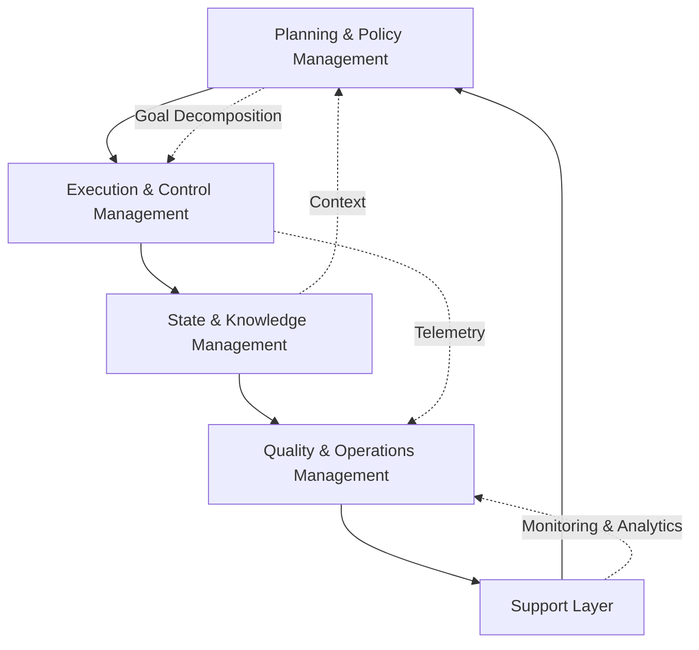

## 論文概要（Abstract）

本論文は、マルチエージェントシステムのオーケストレーションに関する統一アーキテクチャフレームワークを提示する。計画・ポリシー適用・状態管理・品質運用を統合したオーケストレーション層を定義し、2つの補完的通信プロトコル -- Model Context Protocol（MCP）とAgent2Agent Protocol（A2A）-- の技術的詳細を体系化している。著者らは、これらのプロトコルがスケーラブルで監査可能なエージェント間推論の相互運用基盤を構成すると主張しており、概念的アーキテクチャからエンタープライズ規模の実装設計原則への橋渡しを行っている。

この記事は [Zenn記事: Bedrock AgentCore×Step Functionsで業務エージェントの耐障害ワークフローを設計する](https://zenn.dev/0h_n0/articles/5165b29d849e3f) の深掘りです。

## 情報源

- **arXiv ID**: 2601.13671
- **URL**: [https://arxiv.org/abs/2601.13671](https://arxiv.org/abs/2601.13671)
- **著者**: Apoorva Adimulam, Rajesh Gupta, Sumit Kumar
- **発表日**: 2026年1月20日
- **分野**: cs.MA（Multiagent Systems）, cs.AI（Artificial Intelligence）

## 背景と動機（Background & Motivation）

単一のLLMエージェントでは対処しきれない複雑なタスクが増加する中、複数の自律エージェントが協調して目標を達成するマルチエージェントシステム（MAS）への関心が高まっている。しかし、分散エージェントを実運用で動かすには、計画の分解、エージェント間の通信標準化、状態の一貫性維持、ガバナンス適用など、多くの課題が残されている。

特に問題となるのは、エージェントが外部ツールにアクセスする方法と、エージェント同士が協調する方法の2つが標準化されていない点である。著者らは、MCPが前者を、A2Aが後者をそれぞれ担い、この2つのプロトコルを組み合わせることで、分散エージェントネットワーク全体の一貫性・透明性・説明責任を維持できると論じている。

エンタープライズ環境では、金融規制への準拠、医療データの監査可能性、顧客対応の品質保証など、自律性と制御のバランスが求められる。本論文は、この要件に応える設計原則を体系的に整理することを目的としている。

## 主要な貢献（Key Contributions）

- **統一アーキテクチャフレームワーク**: 計画・ポリシー適用・実行制御・状態/知識管理・品質運用の5つのコンポーネントを統合したオーケストレーション層を定義し、エンタープライズ実装に適した一貫した設計に統合
- **Model Context Protocol（MCP）の技術的体系化**: エージェントが外部ツール・コンテキストデータにアクセスする方法を標準化するクライアント-サーバー型プロトコルの設計を詳述。セッション管理、スキーマ一貫性、アクセス制御を統合
- **Agent2Agent Protocol（A2A）の技術的体系化**: エージェント間のピア協調・交渉・委譲を統治するプロトコルの設計を詳述。暗号署名によるメッセージ完全性、ロールベースルーティング、最小権限ポリシーを統合
- **ガバナンスと可観測性の設計**: オーケストレーションロジック・ガバナンスフレームワーク・可観測性メカニズムによるシステム一貫性・透明性・説明責任の維持方法を提示
- **エンタープライズ事例の分析**: BFSI（銀行・金融・証券・保険）、ソフトウェアエンジニアリング、カスタマーサービスの3領域での導入事例を分析

## 技術的詳細（Technical Details）

### オーケストレーション層の5コンポーネント構造

著者らが提示するオーケストレーション層は、マルチエージェントシステムの「コントロールプレーン」として機能し、自律コンポーネントを目標指向の一貫した集団に変換する。この層は以下の5つの統合コンポーネントで構成される。



**1. Planning & Policy Management（計画・ポリシー管理）**: 高レベルの目標を構造化された実行計画に変換する。計画ユニットはゴール分解エンジンとして機能し、タスクの順序と割り当てを決定する。ポリシーユニットはドメイン制約とガバナンス制約を実行計画に埋め込む。著者らは、金融機関の信用リスク・不正検知ワークフローを例に挙げ、ローン申請が「データ抽出 → リスク評価 → コンプライアンス審査 → 不正スクリーニング」のサブタスクに分解され、各ステップにポリシー制約が適用される過程を説明している。

**2. Execution & Control Management（実行・制御管理）**: 実行ユニットがタスクの円滑な運用とテレメトリ収集を管理し、制御ユニットがリメディエーション、並行処理、依存関係管理、タスク優先順位付け、リソース割当を担当する。ワークフローの状態遷移は「初期化 → 実行 → 検証 → 完了」の4フェーズで管理される。

**3. State & Knowledge Management（状態・知識管理）**: 状態ユニットはチェックポイント、ワークフロー進捗、エージェント状態、アクティビティログを管理する。知識ユニットは外部データソースを通じてコンテキスト情報やドメイン固有情報を管理する。著者らは、運用状態と知識状態の分離がモジュール性、コンテキスト一貫性、システム一貫性を保持すると述べている。

**4. Quality & Operations Management（品質・運用管理）**: 集約された出力を定義済みスキーマに対して検証し、レイテンシ、スループット、成功率などのメトリクスを監視する。異常検知によりドリフトを識別し、新コンポーネントの制御されたデプロイとテスト（サンドボックス）を支援する。

**5. Support Layer（支援層）**: 監視エージェント（判断レイテンシ追跡、リスクモデルドリフト検知）、分析エージェント（承認率パターン評価、コンプライアンス異常検出）、データエージェント（データセットの鮮度・正確性維持）の3種類のメタレベルエージェントで構成される。

### MCP（Model Context Protocol）の設計

MCPはクライアント-サーバー型の通信モデルを採用し、エージェント（クライアント）と外部システム（サーバー）の間の標準化された通信を確立する。

主要な設計要素は以下の通りである。

- **セッション管理**: ステートレスとステートフルの両方の交換をサポートし、マルチステップワークフロー全体でのコンテキスト継続性を実現する
- **スキーマ一貫性**: 定義されたインターフェースを通じてスキーマの一貫性を強制する
- **アクセス制御と監査**: プロトコルレベルでアクセス制御と監査可能性メカニズムが埋め込まれている
- **オーケストレーション連携**: 計画・制御ユニットがタスクを実行可能なツール呼び出しに変換し、実行データがオーケストレーションメモリにフィードバックされる

著者らは、MCPが「高レベルのオーケストレーション計画と低レベルのツール実行」を接続し、すべての呼び出しポイントでポリシーアラインメントを強制する運用ブリッジとして機能すると説明している。拡張として、ScaleMCP（エージェント間でツールインベントリを動的に同期）やAgentMaster（MCPとA2Aを統合したマルチモーダル協調）が紹介されている。

### A2A（Agent2Agent Protocol）の設計

A2Aは、MCPのツールアクセスに特化した設計を補完し、エージェント同士の標準化された通信を統治する。

- **通信モデル**: ピア指向で、直接通信またはオーケストレータを介した仲介通信をサポートする。各メッセージは構造化メタデータと標準化ペイロードを持つ
- **セキュリティ制御**: メッセージ完全性のための暗号署名、ポリシー準拠のためのロールベースルーティング、最小権限ポリシーを全交換で強制
- **動的タスク管理**: 著者らは「タスク依存関係は動的に管理され、エージェントは集中的介入なしに相互依存関係を解決できる」と述べている

エージェントタイプごとのA2A利用パターンとして、Workerエージェント（サブタスク委譲・中間結果共有）、Serviceエージェント（診断情報・回復状態の通信）、Supportエージェント（テレメトリ・パフォーマンスインサイトのブロードキャスト）が定義されている。

## 実装のポイント（Implementation）

本論文はサーベイ/フレームワーク論文であり、具体的なコード実装は提示していないが、エンタープライズ実装に向けた設計原則を以下のように整理できる。

**エージェントタイプの設計**: Worker、Service、Supportの3層にエージェントを分類し、それぞれの責務を明確に分離する。Workerエージェントはステートレス（独立リクエスト処理）とステートフル（ワークフロー進捗追跡）の2種類があり、用途に応じて選択する。

**状態管理の分離**: 運用状態（チェックポイント、ワークフロー進捗）と知識状態（ドメイン情報、外部コンテキスト）を分離することで、モジュール性を維持する。これはマイクロサービスアーキテクチャにおけるCQRS（Command Query Responsibility Segregation）パターンと類似の設計思想である。

**ガバナンスの組み込み**: ガバナンスは後付けではなく、計画段階からポリシーユニットを通じて実行計画に埋め込む。制御ユニットが実行時にポリシーを強制し、品質ユニットが出力を検証する三段構えの設計が推奨されている。

**回復メカニズム**: Serviceエージェントがチェックポイント復元を行い、Healingエージェントが失敗した抽出の再実行やワークフロー状態のリセットを担当する。この自己修復の階層化が、エンタープライズ環境での可用性を支える。

## Production Deployment Guide

本論文のオーケストレーションフレームワークをAWS上で実装する場合のパターンを示す。Zenn記事で解説されているBedrock AgentCore + Step Functionsの構成を基盤とし、論文のアーキテクチャ原則を適用する。

### AWS実装パターン（コスト最適化重視）

論文の5コンポーネント構造をAWSサービスにマッピングする。

| 論文コンポーネント | AWSサービス | 役割 |
|---|---|---|
| Planning & Policy | Step Functions + Lambda | ゴール分解とポリシー埋込 |
| Execution & Control | AgentCore InvokeHarness | エージェント推論実行 |
| State & Knowledge | DynamoDB + S3 | チェックポイント・コンテキスト |
| Quality & Operations | CloudWatch + EventBridge | 検証・メトリクス・異常検知 |
| Support Layer | CloudWatch Logs Insights + X-Ray | 監視・分析・トレーシング |

**トラフィック量別の推奨構成**:

- **Small（~100 req/日）**: Step Functions Standard + AgentCore + DynamoDB On-Demand。月額 $80-200。Step Functions遷移課金が中心。DynamODBはOn-Demandモードで低トラフィック時のコスト最小化
- **Medium（~1,000 req/日）**: Step Functions Standard + AgentCore + DynamoDB Provisioned + ElastiCache。月額 $500-1,200。エージェント間のコンテキスト共有にElastiCacheを追加し、DynamoDBの読み取りコストを削減
- **Large（10,000+ req/日）**: Step Functions Express（短時間タスク）+ Standard（長時間タスク）のハイブリッド + ECS Fargate（前後処理）+ DynamoDB DAX。月額 $3,000-8,000。前後処理をFargateに移してLambda同時実行上限を回避

**コスト試算の注意事項**: 上記は2026年7月時点のAWS us-east-1リージョン料金に基づく概算値である。AgentCore InvokeHarnessの課金はBedrockモデルのトークン消費が支配的であり、実際のコストはプロンプト長・推論ターン数・使用モデルにより大きく変動する。最新料金はAWS料金計算ツールで確認することを推奨する。

### Terraformインフラコード

**Small構成（Serverless）: Step Functions + AgentCore + DynamoDB**

```hcl
# --- VPC基盤（NAT Gateway不使用でコスト削減） ---
resource "aws_vpc" "main" {
  cidr_block           = "10.0.0.0/16"
  enable_dns_hostnames = true
  tags = { Name = "multi-agent-orchestration" }
}

resource "aws_subnet" "private" {
  count             = 2
  vpc_id            = aws_vpc.main.id
  cidr_block        = cidrsubnet(aws_vpc.main.cidr_block, 8, count.index)
  availability_zone = data.aws_availability_zones.available.names[count.index]
  tags = { Name = "private-${count.index}" }
}

# VPCエンドポイント（NAT Gateway不要でBedrock/DynamoDBアクセス）
resource "aws_vpc_endpoint" "bedrock" {
  vpc_id              = aws_vpc.main.id
  service_name        = "com.amazonaws.${var.region}.bedrock-runtime"
  vpc_endpoint_type   = "Interface"
  subnet_ids          = aws_subnet.private[*].id
  private_dns_enabled = true
}

resource "aws_vpc_endpoint" "dynamodb" {
  vpc_id       = aws_vpc.main.id
  service_name = "com.amazonaws.${var.region}.dynamodb"
}

# --- IAMロール（最小権限原則） ---
resource "aws_iam_role" "sfn_execution" {
  name = "multi-agent-sfn-role"
  assume_role_policy = jsonencode({
    Version = "2012-10-17"
    Statement = [{
      Action = "sts:AssumeRole"
      Effect = "Allow"
      Principal = { Service = "states.amazonaws.com" }
    }]
  })
}

resource "aws_iam_role_policy" "sfn_agentcore" {
  name = "invoke-agentcore"
  role = aws_iam_role.sfn_execution.id
  policy = jsonencode({
    Version = "2012-10-17"
    Statement = [
      {
        Effect   = "Allow"
        Action   = ["bedrock:InvokeHarness"]
        Resource = "arn:aws:bedrock-agentcore:${var.region}:${data.aws_caller_identity.current.account_id}:harness/*"
      },
      {
        Effect   = "Allow"
        Action   = ["dynamodb:PutItem", "dynamodb:GetItem", "dynamodb:UpdateItem"]
        Resource = aws_dynamodb_table.agent_state.arn
      }
    ]
  })
}

# --- DynamoDB: エージェント状態・チェックポイント管理 ---
resource "aws_dynamodb_table" "agent_state" {
  name         = "agent-orchestration-state"
  billing_mode = "PAY_PER_REQUEST"  # On-Demand: 低トラフィック時コスト最小化
  hash_key     = "SessionId"
  range_key    = "StepName"

  attribute {
    name = "SessionId"
    type = "S"
  }
  attribute {
    name = "StepName"
    type = "S"
  }

  ttl {
    attribute_name = "ExpiresAt"
    enabled        = true
  }

  point_in_time_recovery { enabled = true }
  server_side_encryption  { enabled = true }

  tags = { Component = "state-knowledge-management" }
}

# --- CloudWatch: 品質・運用管理 ---
resource "aws_cloudwatch_metric_alarm" "sfn_failure_rate" {
  alarm_name          = "multi-agent-failure-rate"
  comparison_operator = "GreaterThanOrEqualToThreshold"
  evaluation_periods  = 1
  metric_name         = "ExecutionsFailed"
  namespace           = "AWS/States"
  period              = 300
  statistic           = "Sum"
  threshold           = 3
  alarm_description   = "3件以上の実行失敗で通知"
  alarm_actions       = [aws_sns_topic.alerts.arn]
  dimensions = {
    StateMachineArn = aws_sfn_state_machine.orchestrator.arn
  }
}
```

**Large構成（Container）: ECS Fargate + Step Functions + DynamoDB DAX**

```hcl
# --- ECS Fargate: 前後処理コンテナ ---
resource "aws_ecs_cluster" "agents" {
  name = "multi-agent-cluster"
  setting {
    name  = "containerInsights"
    value = "enabled"  # X-Rayトレーシング統合
  }
}

resource "aws_ecs_service" "preprocessor" {
  name            = "agent-preprocessor"
  cluster         = aws_ecs_cluster.agents.id
  task_definition = aws_ecs_task_definition.preprocessor.arn
  desired_count   = 2
  launch_type     = "FARGATE"
  # Spot Fargate: 最大70%のコスト削減
  capacity_provider_strategy {
    capacity_provider = "FARGATE_SPOT"
    weight            = 3  # 75% Spot
  }
  capacity_provider_strategy {
    capacity_provider = "FARGATE"
    weight            = 1  # 25% On-Demand（可用性確保）
  }
}

# --- DynamoDB DAX: 高スループット時の読取キャッシュ ---
resource "aws_dax_cluster" "agent_cache" {
  cluster_name       = "agent-state-cache"
  iam_role_arn       = aws_iam_role.dax_role.arn
  node_type          = "dax.t3.small"  # 開始サイズ、負荷に応じてスケールアップ
  replication_factor = 2
  subnet_group_name  = aws_dax_subnet_group.main.name

  server_side_encryption { enabled = true }
}

# --- AWS Budgets: コスト予算アラート ---
resource "aws_budgets_budget" "monthly" {
  name         = "multi-agent-monthly"
  budget_type  = "COST"
  limit_amount = "5000"
  limit_unit   = "USD"
  time_unit    = "MONTHLY"

  notification {
    comparison_operator       = "GREATER_THAN"
    threshold                 = 80
    threshold_type            = "PERCENTAGE"
    notification_type         = "ACTUAL"
    subscriber_sns_topic_arns = [aws_sns_topic.alerts.arn]
  }
}
```

### 運用・監視設定

**CloudWatch Logs Insights: オーケストレーション分析クエリ**

```
# エージェント別の成功率・平均レイテンシ
fields @timestamp, @message
| filter @message like /InvokeHarness/
| stats count() as total,
        sum(case when status = "SUCCEEDED" then 1 else 0 end) as succeeded,
        avg(duration_ms) as avg_latency_ms,
        pct(duration_ms, 95) as p95_latency_ms
  by harness_name
| sort avg_latency_ms desc

# トークン消費量の時間推移（コスト異常検知）
fields @timestamp, input_tokens, output_tokens
| filter @message like /TokenUsage/
| stats sum(input_tokens) as total_input,
        sum(output_tokens) as total_output,
        sum(input_tokens + output_tokens) as total_tokens
  by bin(1h)
| sort @timestamp desc
```

**CloudWatch アラーム設定（Python boto3）**

```python
import boto3

cloudwatch = boto3.client("cloudwatch")

def create_orchestration_alarms(state_machine_arn: str, sns_topic_arn: str) -> None:
    """マルチエージェントオーケストレーション用アラームを作成する。

    Args:
        state_machine_arn: Step Functions ステートマシンのARN
        sns_topic_arn: 通知先SNSトピックのARN
    """
    # スロットリング検知: 10回/分超過で通知
    cloudwatch.put_metric_alarm(
        AlarmName="agent-throttling-spike",
        MetricName="ExecutionThrottled",
        Namespace="AWS/States",
        Statistic="Sum",
        Period=60,
        EvaluationPeriods=1,
        Threshold=10,
        ComparisonOperator="GreaterThanThreshold",
        AlarmActions=[sns_topic_arn],
        Dimensions=[
            {"Name": "StateMachineArn", "Value": state_machine_arn},
        ],
    )

    # 実行時間異常検知: P99が10分超過で通知
    cloudwatch.put_metric_alarm(
        AlarmName="agent-latency-p99",
        MetricName="ExecutionTime",
        Namespace="AWS/States",
        ExtendedStatistic="p99",
        Period=300,
        EvaluationPeriods=2,
        Threshold=600000,  # 10分 = 600,000ms
        ComparisonOperator="GreaterThanThreshold",
        AlarmActions=[sns_topic_arn],
        Dimensions=[
            {"Name": "StateMachineArn", "Value": state_machine_arn},
        ],
    )
```

**X-Rayトレーシング設定（Python boto3）**

```python
from aws_xray_sdk.core import xray_recorder, patch_all

# boto3の自動計装
patch_all()

@xray_recorder.capture("orchestrate_agents")
def orchestrate_agents(session_id: str, task: str) -> dict:
    """マルチエージェントオーケストレーションの1ステップを実行する。

    Args:
        session_id: セッション識別子
        task: 実行するタスクの記述

    Returns:
        エージェント実行結果
    """
    subsegment = xray_recorder.current_subsegment()
    subsegment.put_annotation("session_id", session_id)
    subsegment.put_annotation("agent_type", "worker")
    subsegment.put_metadata("task_input", task, "orchestration")

    # Step Functions実行はX-Rayが自動トレース
    result = sfn_client.start_execution(
        stateMachineArn=STATE_MACHINE_ARN,
        input=json.dumps({"sessionId": session_id, "task": task}),
    )
    return result
```

**Cost Explorer日次レポート（Python boto3）**

```python
import boto3
from datetime import date, timedelta

ce = boto3.client("ce")
sns = boto3.client("sns")

def daily_cost_report(sns_topic_arn: str, threshold_usd: float = 100.0) -> None:
    """日次コストレポートを取得し、閾値超過時にSNS通知する。

    Args:
        sns_topic_arn: 通知先SNSトピックのARN
        threshold_usd: 通知閾値（USD/日）
    """
    today = date.today()
    yesterday = today - timedelta(days=1)

    response = ce.get_cost_and_usage(
        TimePeriod={"Start": str(yesterday), "End": str(today)},
        Granularity="DAILY",
        Metrics=["UnblendedCost"],
        GroupBy=[{"Type": "DIMENSION", "Key": "SERVICE"}],
    )

    total = 0.0
    breakdown = []
    for group in response["ResultsByTime"][0]["Groups"]:
        service = group["Keys"][0]
        cost = float(group["Metrics"]["UnblendedCost"]["Amount"])
        if cost > 0.01:
            breakdown.append(f"  {service}: ${cost:.2f}")
            total += cost

    if total > threshold_usd:
        message = f"Daily cost alert: ${total:.2f} (threshold: ${threshold_usd})\n"
        message += "\n".join(breakdown)
        sns.publish(TopicArn=sns_topic_arn, Subject="Cost Alert", Message=message)
```

### コスト最適化チェックリスト

**アーキテクチャ選択**:
- [ ] トラフィック量に応じた構成選択（Small: Serverless / Medium: Hybrid / Large: Container）
- [ ] Step Functions Standard vs Expressの適切な使い分け（15分超タスクはStandard必須）
- [ ] AgentCore InvokeHarnessのMaxIterationsを必要最小限に設定

**リソース最適化**:
- [ ] ECS Fargate Spot活用（前後処理に適用、最大70%削減）
- [ ] DynamoDB On-Demandモード（低トラフィック時）/ Provisioned + Auto Scaling（高トラフィック時）
- [ ] DynamoDB DAXによる読取キャッシュ（高スループット時）
- [ ] VPCエンドポイントによるNAT Gateway不要化（月額$32-45/AZ削減）
- [ ] Lambda Power Tuningによるメモリサイズ最適化

**LLMコスト削減**:
- [ ] Bedrock Batch APIの活用（非リアルタイム処理で50%削減）
- [ ] Prompt Caching有効化（繰返しシステムプロンプトで30-90%削減）
- [ ] タスク複雑度に応じたモデル選択ロジック（簡易タスクはHaiku、複雑タスクはSonnet）
- [ ] MaxIterations・TimeoutSecondsの最適化（過剰なトークン消費の抑制）

**監視・アラート**:
- [ ] AWS Budgets月次予算アラート設定
- [ ] CloudWatch ExecutionsFailed/ExecutionThrottled アラーム設定
- [ ] Cost Anomaly Detection有効化
- [ ] 日次コストレポートの自動配信
- [ ] トークン消費量の時間別トレンド監視

**リソース管理**:
- [ ] DynamoDB TTLによる古いセッションデータの自動削除
- [ ] CloudWatch Logsの保持期間設定（30日推奨）
- [ ] コストタグ戦略（Component, Environment, Team）
- [ ] 開発環境のStep Functions実行スケジュール制限
- [ ] 未使用VPCエンドポイントの定期棚卸し

## 実運用への応用（Practical Applications）

本論文のオーケストレーションフレームワークと、Zenn記事で解説されているBedrock AgentCore + Step Functionsの構成は、相互に補完する関係にある。

Zenn記事では、Step Functionsを「オーケストレーション基盤」として位置づけ、InvokeHarnessタスクのRetry/Catch構成、Sagaパターンの補償トランザクション、Map ステートによる並列実行 + Graceful Degradationを具体的なASL定義で示している。これは本論文のExecution & Control Managementコンポーネントの実装例と捉えることができる。

特に、論文が定義するServiceエージェント（診断・修復・回復を担当）の概念は、Zenn記事における補償処理Lambda（reset-request-status、revoke-approval）と対応する。また、論文のState & Knowledge Managementにおけるチェックポイント管理は、Zenn記事のRuntimeSessionIdによるセッション継続と同じ設計意図に基づいている。

一方で、Zenn記事がAWSの具体的なサービス統合に特化しているのに対し、本論文はMCP・A2Aプロトコルによるエージェント間通信の標準化や、ガバナンスフレームワークの体系的な設計を提供しており、クラウドベンダーに依存しない抽象的な設計指針として活用できる。

## 関連研究（Related Work）

著者らは、関連するフレームワークとして以下を挙げている。

- **ScaleMCP**: MCPを拡張し、エージェント間でツールインベントリを動的に同期するプロトコル。本論文のMCP設計を補完する位置づけにある
- **AgentMaster**（arXiv: 2507.21105）: MCPとA2Aを統合し、マルチモーダル協調と情報検索を実現するフレームワーク。本論文が定義するプロトコル層の実装例として参照されている
- **PwC Agent OS / Accenture Trusted Agent Huddle**: エンタープライズ向けのマルチエージェント協調プラットフォーム。本論文のガバナンスフレームワークの商用実装として分析されている
- **LangChain / AutoGen / IBM Watsonx Orchestrate / Google Agent Development Kit**: オープンソースおよび商用のエージェントオーケストレーションフレームワーク群

## まとめと今後の展望

本論文は、マルチエージェントシステムのオーケストレーションについて、計画・ポリシー・実行・状態管理・品質運用を統合した5コンポーネント構造と、MCP・A2Aの2つの補完的プロトコルによる通信基盤を体系化している。

エンタープライズ導入事例として、BFSI領域では95%以上の精度でのアプリケーション解析や承認プロセスの20倍高速化、ソフトウェアエンジニアリングでは開発時間の50%削減、カスタマーサービスでは解決時間の60-90%短縮が報告されている。ただし、これらの数値は個別事例に基づくものであり、汎化可能性については追加の検証が必要である。

今後の研究方向として、MCP・A2Aプロトコルの正式な標準化、ガバナンスフレームワークの規制対応（金融・医療・製造業ごとのドメイン固有ポリシー）、およびエージェント間の信頼性評価メカニズムの確立が挙げられる。

## 参考文献

- **arXiv**: [https://arxiv.org/abs/2601.13671](https://arxiv.org/abs/2601.13671)
- **AgentMaster (arXiv: 2507.21105)**: [https://arxiv.org/abs/2507.21105](https://arxiv.org/abs/2507.21105)
- **Related Zenn article**: [https://zenn.dev/0h_n0/articles/5165b29d849e3f](https://zenn.dev/0h_n0/articles/5165b29d849e3f)
- **AWS Step Functions AgentCore Integration**: [https://docs.aws.amazon.com/step-functions/latest/dg/connect-bedrockagentcore.html](https://docs.aws.amazon.com/step-functions/latest/dg/connect-bedrockagentcore.html)
