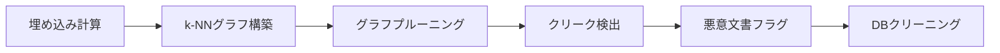

本記事は [https://arxiv.org/abs/2605.00460](https://arxiv.org/abs/2605.00460) の解説記事です。

## 論文概要（Abstract）

CleanBase は、Retrieval-Augmented Generation（RAG）システムの知識データベースに混入した悪意ある文書を検出するフレームワークである。著者らは、同一の攻撃ターゲット質問に対して作成された悪意ある文書群が意味的に高い類似度を示すという観察に基づき、文書間の類似度グラフを構築しクリーク（完全部分グラフ）を検出することで悪意ある文書を特定する手法を提案している。偽陽性率（FPR）と偽陰性率（FNR）の理論的上界が証明されており、複数のデータセットと攻撃シナリオにおいて有効性が実証されている。

この記事は [Zenn記事: RAGシステムのIndirect Prompt Injection対策：文書汚染から守る実装](https://zenn.dev/0h_n0/articles/766a44e8aa95a2) の深掘りです。

## 情報源

- **arXiv ID**: 2605.00460
- **URL**: [https://arxiv.org/abs/2605.00460](https://arxiv.org/abs/2605.00460)
- **著者**: Weifei Jin, Xilong Wang, Wei Zou, Jinyuan Jia, Neil Gong
- **発表年**: 2026
- **分野**: cs.CR, cs.LG
- **ライセンス**: Apache 2.0（実装コード）
- **コード**: [https://github.com/WeifeiJin/CleanBase](https://github.com/WeifeiJin/CleanBase)

## 背景と動機（Background & Motivation）

RAG システムは外部知識データベースからユーザーの質問に関連する文書を検索し、それをコンテキストとして LLM に渡すことで回答精度を向上させる。しかしこの仕組みは、攻撃者が知識データベースに悪意ある文書を注入する「知識汚染攻撃」に対して脆弱である。

代表的な攻撃手法として PoisonedRAG（Zou et al., USENIX Security 2025）が挙げられる。PoisonedRAG では、各悪意ある文書を検索コンポーネント $S$（ターゲット質問との類似度を最大化する部分）と生成コンポーネント $I$（LLM に攻撃者指定の回答を出力させる部分）に分解し、$P = S \oplus I$ として構成する。Natural Questions（NQ）データセット（約268万文書）に対して質問あたり5件の悪意ある文書を注入するだけで、攻撃成功率（ASR）が90%を超えることが報告されている。

従来の防御手法には、検索後のフィルタリングや LLM の活性化分析による検知（RevPRAG）などがあるが、検索段階ではなくクエリ処理時に動作するため、知識データベース自体の汚染は解消されないという課題があった。CleanBase は知識データベースそのものをクリーニングするアプローチとして、この課題に取り組んでいる。

なお、CleanBase の共著者である Wei Zou と Jinyuan Jia は PoisonedRAG の著者でもあり、攻撃手法の知見を防御に活かす研究として位置づけられる。

## 主要な貢献（Key Contributions）

- **類似度グラフベースの検出フレームワーク**: 知識データベース上に文書間の意味的類似度グラフを構築し、クリーク検出により悪意ある文書を特定するアプローチを提案した
- **理論的保証**: 偽陽性率（FPR）と偽陰性率（FNR）の上界を数学的に導出し、検出信頼性の理論的基盤を確立した
- **攻撃非依存の設計**: 特定の攻撃手法に依存せず、悪意ある文書の構造的特徴（高い相互類似度）を利用するため、未知の攻撃にも対応できる汎用性を持つ
- **実用的なパイプライン**: 埋め込み計算からグラフ構築、プルーニング、クリーク検出、データベースクリーニングまでの一貫したパイプラインを実装し、Apache 2.0 ライセンスで公開した

## 技術的詳細（Technical Details）

### 核心的洞察

CleanBase の検出原理は、悪意ある文書の構造的特徴に基づく。PoisonedRAG 等の攻撃では、同一のターゲット質問に対して複数の悪意ある文書（通常 $N=5$）を注入する。これらの文書は同じ質問に対する検索で上位に入るよう最適化されるため、検索コンポーネント $S$ が類似し、かつ同じ攻撃者指定回答を含む生成コンポーネント $I$ も類似する。結果として、同一ターゲットの悪意ある文書群は意味空間上で密なクラスタを形成する。

一方、正常な文書は多様なトピックにまたがるため、任意の文書ペア間の類似度は広い範囲に分布し、全ペアが同時に高い類似度を示すことはまれである。

### 類似度グラフの構築

知識データベース $\mathcal{D} = \{d_1, d_2, \ldots, d_n\}$ に対して、類似度グラフ $G = (V, E)$ を以下のように構築する。

$$
V = \mathcal{D}, \quad E = \{(d_i, d_j) \mid \text{sim}(d_i, d_j) \geq \tau, \; i \neq j\}
$$

ここで、$\text{sim}(d_i, d_j)$ は文書 $d_i$ と $d_j$ の埋め込みベクトル間のコサイン類似度である。

$$
\text{sim}(d_i, d_j) = \frac{\mathbf{e}_i \cdot \mathbf{e}_j}{\|\mathbf{e}_i\| \|\mathbf{e}_j\|}
$$

ここで、$\mathbf{e}_i = \text{Encoder}(d_i)$ は埋め込みモデルによる文書の密ベクトル表現である。

閾値 $\tau$ は、正常な文書ペア間の類似度分布に基づいて統計的に決定される。具体的には、全文書ペアのコサイン類似度の分布を分析し、正常文書間の類似度が $\tau$ を超える確率が十分に小さくなるよう設定する。

### クリーク検出アルゴリズム



CleanBase は構築されたグラフ $G$ 上で Bron-Kerbosch アルゴリズムを用いてクリーク（完全部分グラフ）を検出する。クリークとは、全ての頂点ペアが辺で接続されている部分グラフであり、サイズ3以上のクリークに含まれる文書を悪意ある文書としてフラグする。

悪意ある文書群は設計上互いに高い類似度を持つため、閾値 $\tau$ 以上の類似度を持つ全ペアが辺で結ばれ、クリークを形成する傾向がある。一方、正常な文書がたまたま3つ以上で完全結合を形成する確率は、閾値の適切な設定により低く抑えられる。

### 理論分析

著者らは FPR と FNR の上界を以下のように導出している。

**偽陽性率（FPR）の上界**: 正常な文書が誤ってクリーク内に含まれる確率の上界。閾値 $\tau$ を上げることで FPR を任意に小さくできることが示されている。著者らの実験では、平均 FPR が全データセットにわたって2%未満であったと報告されている。

**偽陰性率（FNR）の上界**: 悪意ある文書がクリークとして検出されない確率の上界。悪意ある文書間の類似度が十分に高い場合（攻撃の一貫性が高い場合）、FNR は低く抑えられる。攻撃者が文書間の一貫性を意図的に下げた場合は FNR が上昇するが、その場合は攻撃成功率自体も低下するというトレードオフが存在する。

この理論的保証により、CleanBase のパラメータ設定が検出性能に与える影響を事前に推定できる。

## 実装のポイント（Implementation）

### パイプライン構成

CleanBase の実装は以下の6つのステップで構成される。公式リポジトリの構成に基づく。

```python
from sentence_transformers import SentenceTransformer
import numpy as np
from itertools import combinations


def compute_embeddings(
    documents: list[str],
    model_name: str = "all-MiniLM-L6-v2",
) -> np.ndarray:
    """文書群の埋め込みベクトルを計算する

    Args:
        documents: 文書テキストのリスト
        model_name: 使用する埋め込みモデル名

    Returns:
        埋め込みベクトル行列 (n_docs, embed_dim)
    """
    model = SentenceTransformer(model_name)
    embeddings = model.encode(
        documents, show_progress_bar=True, normalize_embeddings=True
    )
    return embeddings


def build_similarity_graph(
    embeddings: np.ndarray,
    threshold: float,
) -> dict[int, set[int]]:
    """コサイン類似度に基づく類似度グラフを構築する

    Args:
        embeddings: 正規化済み埋め込みベクトル (n_docs, embed_dim)
        threshold: 辺を張る類似度の閾値 tau

    Returns:
        隣接リスト形式のグラフ {node_id: set(neighbor_ids)}
    """
    n = len(embeddings)
    # 正規化済みベクトルの内積 = コサイン類似度
    sim_matrix = embeddings @ embeddings.T
    np.fill_diagonal(sim_matrix, 0.0)

    adjacency: dict[int, set[int]] = {i: set() for i in range(n)}
    for i, j in combinations(range(n), 2):
        if sim_matrix[i, j] >= threshold:
            adjacency[i].add(j)
            adjacency[j].add(i)
    return adjacency


def find_cliques_bron_kerbosch(
    adjacency: dict[int, set[int]],
    min_size: int = 3,
) -> list[set[int]]:
    """Bron-Kerboschアルゴリズムで極大クリークを検出する

    Args:
        adjacency: 隣接リスト形式のグラフ
        min_size: 検出対象の最小クリークサイズ

    Returns:
        サイズ min_size 以上の極大クリークのリスト
    """
    cliques: list[set[int]] = []

    def _bron_kerbosch(
        r: set[int], p: set[int], x: set[int]
    ) -> None:
        if not p and not x:
            if len(r) >= min_size:
                cliques.append(r.copy())
            return
        # ピボット選択で枝刈り
        pivot = max(p | x, key=lambda v: len(adjacency[v] & p))
        for v in list(p - adjacency[pivot]):
            neighbors = adjacency[v]
            _bron_kerbosch(
                r | {v}, p & neighbors, x & neighbors
            )
            p.remove(v)
            x.add(v)

    all_nodes = set(adjacency.keys())
    _bron_kerbosch(set(), all_nodes, set())
    return cliques


def detect_malicious_documents(
    documents: list[str],
    threshold: float = 0.85,
    min_clique_size: int = 3,
) -> set[int]:
    """CleanBaseパイプラインで悪意ある文書を検出する

    Args:
        documents: 知識データベースの全文書
        threshold: 類似度閾値 tau
        min_clique_size: クリーク検出の最小サイズ

    Returns:
        悪意ありと判定された文書のインデックス集合
    """
    embeddings = compute_embeddings(documents)
    graph = build_similarity_graph(embeddings, threshold)
    cliques = find_cliques_bron_kerbosch(graph, min_clique_size)

    malicious_indices: set[int] = set()
    for clique in cliques:
        malicious_indices.update(clique)
    return malicious_indices
```

### 実装上の注意点

- **埋め込みの正規化**: コサイン類似度を内積で計算するため、事前に L2 正規化が必須である。`SentenceTransformer.encode()` の `normalize_embeddings=True` を使用する
- **スケーラビリティ**: 全ペアの類似度計算は $O(n^2)$ であるが、公式実装では k-NN グラフとグラフプルーニングにより計算量を削減している。`build_graph.py` が k-NN グラフ構築、`graph_pruning.py` がプルーニングを担当する
- **閾値の調整**: 閾値 $\tau$ が高すぎると FNR が上昇し、低すぎると FPR が上昇する。公式実装では統計的手法で適応的に決定される
- **クリークサイズ**: 最小クリークサイズを3以上に設定することで、偶然の高類似度ペアによる誤検知を抑制する

## Production Deployment Guide

### AWS実装パターン（コスト最適化重視）

CleanBase をプロダクション環境で運用する場合、RAG の知識データベース更新時にバッチ処理として実行する構成が適している。リアルタイム推論ではなく、文書追加・更新のタイミングで検出パイプラインを走らせる。

**トラフィック量別の推奨構成**:

| 構成 | 知識DB規模 | AWS構成 | 月額概算 |
|------|-----------|---------|---------|
| Small | ~10万文書 | Lambda + S3 + DynamoDB | $50-150 |
| Medium | ~100万文書 | ECS Fargate + ElastiCache + S3 | $300-800 |
| Large | 500万文書以上 | EKS + Spot + OpenSearch | $2,000-5,000 |

**Small構成（~10万文書）**: Lambda（メモリ3008MB、タイムアウト900秒）で埋め込み計算とクリーク検出を実行する。埋め込みモデルは SageMaker Serverless Inference または Bedrock Embeddings を利用する。文書メタデータは DynamoDB に格納し、埋め込みベクトルは S3 にキャッシュする。月額 $50-150（Lambda 実行回数、SageMaker 推論時間に依存）。

**Medium構成（~100万文書）**: ECS Fargate（2vCPU、8GB RAM）で検出パイプラインを実行する。埋め込みベクトルの類似度計算には ElastiCache（Redis）を活用し、k-NN グラフ構築を高速化する。StepFunctions でパイプラインをオーケストレーションする。月額 $300-800（Fargate タスク実行時間、ElastiCache ノード数に依存）。

**Large構成（500万文書以上）**: EKS クラスタで分散処理を行う。埋め込み計算は GPU ノード（g5.xlarge Spot）で並列実行し、類似度計算とクリーク検出は CPU ノードで処理する。OpenSearch を k-NN インデックスとして活用し、近傍検索を高速化する。月額 $2,000-5,000（Spot 活用で削減可能）。

**コスト試算の注意事項**: 上記は2026年7月時点の AWS ap-northeast-1（東京）リージョン料金に基づく概算値である。実際のコストはデータベース更新頻度、文書サイズ、バースト使用量により変動する。最新料金は AWS 料金計算ツールで確認を推奨する。

**コスト削減テクニック**:
- Spot Instances 活用で GPU ノードのコストを最大90%削減
- 埋め込みベクトルのキャッシュにより再計算を回避（新規文書のみ計算）
- バッチ処理のスケジューリング（夜間実行）でオンデマンド料金を最小化
- Reserved Instances（ElastiCache, OpenSearch）で最大72%削減

### Terraformインフラコード

**Small構成（Serverless）**:

```hcl
# CleanBase Small構成: Lambda + S3 + DynamoDB
# 知識DB規模 ~10万文書向け

terraform {
  required_version = ">= 1.9"
  required_providers {
    aws = {
      source  = "hashicorp/aws"
      version = "~> 5.60"
    }
  }
}

provider "aws" {
  region = "ap-northeast-1"
}

# S3: 埋め込みベクトルキャッシュ
resource "aws_s3_bucket" "embeddings_cache" {
  bucket = "cleanbase-embeddings-cache-${data.aws_caller_identity.current.account_id}"
}

resource "aws_s3_bucket_server_side_encryption_configuration" "embeddings_cache" {
  bucket = aws_s3_bucket.embeddings_cache.id
  rule {
    apply_server_side_encryption_by_default {
      sse_algorithm = "aws:kms"
    }
  }
}

resource "aws_s3_bucket_public_access_block" "embeddings_cache" {
  bucket                  = aws_s3_bucket.embeddings_cache.id
  block_public_acls       = true
  block_public_policy     = true
  ignore_public_acls      = true
  restrict_public_buckets = true
}

# DynamoDB: 検出結果・文書メタデータ
resource "aws_dynamodb_table" "detection_results" {
  name         = "cleanbase-detection-results"
  billing_mode = "PAY_PER_REQUEST"  # コスト最適化: On-Demand
  hash_key     = "document_id"
  range_key    = "scan_timestamp"

  attribute {
    name = "document_id"
    type = "S"
  }

  attribute {
    name = "scan_timestamp"
    type = "S"
  }

  server_side_encryption {
    enabled = true
  }

  point_in_time_recovery {
    enabled = true
  }
}

# IAMロール: Lambda用（最小権限）
resource "aws_iam_role" "cleanbase_lambda" {
  name = "cleanbase-lambda-role"

  assume_role_policy = jsonencode({
    Version = "2012-10-17"
    Statement = [{
      Action    = "sts:AssumeRole"
      Effect    = "Allow"
      Principal = { Service = "lambda.amazonaws.com" }
    }]
  })
}

resource "aws_iam_role_policy" "cleanbase_lambda" {
  name = "cleanbase-lambda-policy"
  role = aws_iam_role.cleanbase_lambda.id

  policy = jsonencode({
    Version = "2012-10-17"
    Statement = [
      {
        Effect   = "Allow"
        Action   = ["s3:GetObject", "s3:PutObject"]
        Resource = "${aws_s3_bucket.embeddings_cache.arn}/*"
      },
      {
        Effect = "Allow"
        Action = [
          "dynamodb:PutItem",
          "dynamodb:GetItem",
          "dynamodb:Query"
        ]
        Resource = aws_dynamodb_table.detection_results.arn
      },
      {
        Effect   = "Allow"
        Action   = ["logs:CreateLogGroup", "logs:CreateLogStream", "logs:PutLogEvents"]
        Resource = "arn:aws:logs:*:*:*"
      }
    ]
  })
}

# Lambda: CleanBase検出パイプライン
resource "aws_lambda_function" "cleanbase_detector" {
  function_name = "cleanbase-detector"
  role          = aws_iam_role.cleanbase_lambda.arn
  runtime       = "python3.12"
  handler       = "detector.handler"
  timeout       = 900  # 15分（最大）
  memory_size   = 3008 # 埋め込み計算に十分なメモリ

  filename         = "lambda_package.zip"
  source_code_hash = filebase64sha256("lambda_package.zip")

  environment {
    variables = {
      EMBEDDINGS_BUCKET  = aws_s3_bucket.embeddings_cache.id
      RESULTS_TABLE      = aws_dynamodb_table.detection_results.name
      SIMILARITY_THRESHOLD = "0.85"
      MIN_CLIQUE_SIZE      = "3"
    }
  }
}

# CloudWatch アラーム: Lambda実行時間監視
resource "aws_cloudwatch_metric_alarm" "lambda_duration" {
  alarm_name          = "cleanbase-lambda-duration-high"
  comparison_operator = "GreaterThanThreshold"
  evaluation_periods  = 1
  metric_name         = "Duration"
  namespace           = "AWS/Lambda"
  period              = 300
  statistic           = "Maximum"
  threshold           = 840000  # 14分（15分タイムアウト前に警告）
  alarm_actions       = []      # SNSトピックARNを設定

  dimensions = {
    FunctionName = aws_lambda_function.cleanbase_detector.function_name
  }
}

data "aws_caller_identity" "current" {}
```

**Large構成（Container）**:

```hcl
# CleanBase Large構成: EKS + Karpenter + Spot
# 知識DB規模 500万文書以上向け

# EKSクラスタ
module "eks" {
  source  = "terraform-aws-modules/eks/aws"
  version = "~> 20.24"

  cluster_name    = "cleanbase-cluster"
  cluster_version = "1.31"

  vpc_id     = module.vpc.vpc_id
  subnet_ids = module.vpc.private_subnets

  cluster_endpoint_public_access = false

  eks_managed_node_groups = {
    # システムノード（On-Demand）
    system = {
      instance_types = ["m7i.large"]
      min_size       = 2
      max_size       = 4
      desired_size   = 2
    }
  }
}

# Karpenter: GPU Spot自動スケーリング
resource "kubectl_manifest" "karpenter_gpu_nodepool" {
  yaml_body = yamlencode({
    apiVersion = "karpenter.sh/v1"
    kind       = "NodePool"
    metadata   = { name = "cleanbase-gpu" }
    spec = {
      template = {
        spec = {
          requirements = [
            { key = "karpenter.sh/capacity-type", operator = "In", values = ["spot"] },
            { key = "node.kubernetes.io/instance-type", operator = "In",
              values = ["g5.xlarge", "g5.2xlarge"] },
          ]
          nodeClassRef = { name = "default" }
        }
      }
      limits   = { cpu = "64", memory = "256Gi" }
      disruption = {
        consolidationPolicy = "WhenEmptyOrUnderutilized"
        consolidateAfter    = "30s"
      }
    }
  })
}

# Secrets Manager: 設定パラメータ
resource "aws_secretsmanager_secret" "cleanbase_config" {
  name = "cleanbase/config"
}

resource "aws_secretsmanager_secret_version" "cleanbase_config" {
  secret_id = aws_secretsmanager_secret.cleanbase_config.id
  secret_string = jsonencode({
    similarity_threshold = 0.85
    min_clique_size      = 3
    embedding_model      = "all-MiniLM-L6-v2"
    opensearch_endpoint  = "https://cleanbase-search.ap-northeast-1.es.amazonaws.com"
  })
}

# AWS Budgets: コストアラート
resource "aws_budgets_budget" "cleanbase_monthly" {
  name         = "cleanbase-monthly-budget"
  budget_type  = "COST"
  limit_amount = "5000"
  limit_unit   = "USD"
  time_unit    = "MONTHLY"

  notification {
    comparison_operator       = "GREATER_THAN"
    threshold                 = 80
    threshold_type            = "PERCENTAGE"
    notification_type         = "ACTUAL"
    subscriber_email_addresses = ["ops-team@example.com"]
  }
}
```

### 運用・監視設定

**CloudWatch Logs Insights クエリ**:

```
# 検出パイプラインのレイテンシ分析（P95, P99）
fields @timestamp, @message
| filter @message like /pipeline_complete/
| stats percentile(duration_ms, 95) as p95,
        percentile(duration_ms, 99) as p99,
        avg(duration_ms) as avg_ms
  by bin(1h)

# 悪意文書検出率の推移
fields @timestamp, @message
| filter @message like /detection_result/
| stats sum(malicious_count) as detected,
        sum(total_scanned) as scanned,
        sum(malicious_count) / sum(total_scanned) * 100 as detection_rate_pct
  by bin(1d)
```

**CloudWatch アラーム設定（Python）**:

```python
import boto3


def create_detection_alarms(
    function_name: str,
    sns_topic_arn: str,
) -> None:
    """CleanBase検出パイプライン用のCloudWatchアラームを作成する

    Args:
        function_name: Lambda関数名
        sns_topic_arn: 通知先SNSトピックARN
    """
    cw = boto3.client("cloudwatch", region_name="ap-northeast-1")

    # アラーム1: 検出パイプラインのエラー率
    cw.put_metric_alarm(
        AlarmName="cleanbase-error-rate",
        MetricName="Errors",
        Namespace="AWS/Lambda",
        Statistic="Sum",
        Period=300,
        EvaluationPeriods=2,
        Threshold=3,
        ComparisonOperator="GreaterThanThreshold",
        Dimensions=[
            {"Name": "FunctionName", "Value": function_name}
        ],
        AlarmActions=[sns_topic_arn],
    )

    # アラーム2: 検出文書数の異常スパイク
    cw.put_metric_alarm(
        AlarmName="cleanbase-detection-spike",
        MetricName="MaliciousDocumentsDetected",
        Namespace="CleanBase",
        Statistic="Sum",
        Period=3600,
        EvaluationPeriods=1,
        Threshold=100,
        ComparisonOperator="GreaterThanThreshold",
        AlarmActions=[sns_topic_arn],
    )
```

**X-Ray トレーシング設定（Python）**:

```python
from aws_xray_sdk.core import xray_recorder, patch_all

# boto3, requests等を自動計装
patch_all()


@xray_recorder.capture("cleanbase_scan")
def run_detection_pipeline(
    document_batch: list[str],
    threshold: float = 0.85,
) -> dict:
    """X-Rayトレーシング付き検出パイプライン

    Args:
        document_batch: スキャン対象の文書バッチ
        threshold: 類似度閾値

    Returns:
        検出結果の辞書
    """
    subsegment = xray_recorder.current_subsegment()
    subsegment.put_annotation("batch_size", len(document_batch))
    subsegment.put_annotation("threshold", threshold)

    # 埋め込み計算フェーズ
    with xray_recorder.in_subsegment("compute_embeddings"):
        embeddings = compute_embeddings(document_batch)

    # グラフ構築フェーズ
    with xray_recorder.in_subsegment("build_graph"):
        graph = build_similarity_graph(embeddings, threshold)

    # クリーク検出フェーズ
    with xray_recorder.in_subsegment("find_cliques"):
        malicious = find_cliques_bron_kerbosch(graph)

    subsegment.put_metadata(
        "result",
        {"detected": len(malicious), "scanned": len(document_batch)},
    )
    return {"malicious_indices": list(malicious)}
```

**Cost Explorer 自動レポート（Python）**:

```python
import boto3
from datetime import datetime, timedelta


def get_daily_cost_report() -> dict:
    """CleanBase関連の日次コストレポートを取得する

    Returns:
        サービス別コスト情報を含む辞書
    """
    ce = boto3.client("ce", region_name="us-east-1")
    today = datetime.utcnow().date()
    yesterday = today - timedelta(days=1)

    response = ce.get_cost_and_usage(
        TimePeriod={
            "Start": yesterday.isoformat(),
            "End": today.isoformat(),
        },
        Granularity="DAILY",
        Metrics=["UnblendedCost"],
        Filter={
            "Tags": {
                "Key": "Project",
                "Values": ["cleanbase"],
            }
        },
        GroupBy=[
            {"Type": "DIMENSION", "Key": "SERVICE"}
        ],
    )

    costs = {}
    for group in response["ResultsByTime"][0]["Groups"]:
        service = group["Keys"][0]
        amount = float(group["Metrics"]["UnblendedCost"]["Amount"])
        costs[service] = amount

    total = sum(costs.values())

    # $100/日超過でSNS通知
    if total > 100:
        sns = boto3.client("sns", region_name="ap-northeast-1")
        sns.publish(
            TopicArn="arn:aws:sns:ap-northeast-1:ACCOUNT:cleanbase-alerts",
            Subject="CleanBase Cost Alert",
            Message=f"Daily cost ${total:.2f} exceeds $100 threshold",
        )

    return {"date": yesterday.isoformat(), "total": total, "by_service": costs}
```

### コスト最適化チェックリスト

**アーキテクチャ選択**:
- [ ] 知識DB規模に応じた構成選択（Serverless / Hybrid / Container）
- [ ] バッチ処理 vs リアルタイム処理の判断（文書更新頻度に基づく）

**リソース最適化**:
- [ ] EC2/EKS: GPU ノードは Spot Instances 優先（g5.xlarge Spot で最大90%削減）
- [ ] Reserved Instances: ElastiCache, OpenSearch は1年コミットで最大72%削減
- [ ] Savings Plans: Fargate の Compute Savings Plans 検討
- [ ] Lambda: メモリサイズ最適化（Power Tuning で最適値を特定）
- [ ] EKS: Karpenter で未使用ノードを30秒後に自動削除

**埋め込み計算コスト削減**:
- [ ] 差分計算: 新規・更新文書のみ埋め込みを再計算
- [ ] ベクトルキャッシュ: S3 に埋め込みを永続化し再利用
- [ ] モデル選択: all-MiniLM-L6-v2（384次元）は軽量かつ十分な精度
- [ ] バッチサイズ最適化: GPU メモリに応じたバッチサイズ調整

**監視・アラート**:
- [ ] AWS Budgets: 月額予算アラート（80%/100%閾値）
- [ ] CloudWatch アラーム: Lambda 実行時間、エラー率
- [ ] Cost Anomaly Detection: 異常支出の自動検知
- [ ] 日次コストレポート: Cost Explorer API による自動集計

**リソース管理**:
- [ ] 未使用リソース削除: 古い埋め込みキャッシュの定期削除
- [ ] タグ戦略: `Project=cleanbase` タグで全リソースを追跡
- [ ] ライフサイクルポリシー: S3 の古いスキャン結果を90日後に Glacier 移行
- [ ] 開発環境: 夜間・週末の自動停止（EKS ノード、Fargate タスク）
- [ ] ECR: イメージの保持ポリシー（最新5世代のみ保持）

## 実験結果（Results）

### 実験設定

著者らは以下の設定で CleanBase を評価している。

- **データセット**: Natural Questions（NQ, 約268万文書）、HotpotQA（約523万文書）、MS-MARCO（約884万文書）
- **攻撃手法**: PoisonedRAG（USENIX Security 2025）のブラックボックス・ホワイトボックス設定
- **注入文書数**: ターゲット質問あたり $N=5$ 件の悪意ある文書
- **LLM**: GPT-3.5-Turbo、GPT-4、PaLM 2、LLaMA-2-7B/13B 等
- **パイプライン**: 埋め込み計算 → k-NN グラフ構築 → グラフプルーニング → クリーク検出 → DB クリーニング → 攻撃成功率評価

### 検出性能

著者らは、CleanBase が全データセットにわたって平均 FPR を2%未満に維持したと報告している。正常な文書が誤って削除されるリスクが低いことを意味する。

PoisonedRAG の攻撃では悪意ある文書間の類似度が高い一貫性を示すため、CleanBase はこの攻撃パターンに対して低い FNR を達成している。防御適用前の攻撃成功率が90%以上であった設定において、CleanBase による知識データベースクリーニング後は攻撃成功率が大幅に低下したと報告されている。

| 評価指標 | CleanBase の報告値 |
|---------|-------------------|
| 平均 FPR（全データセット） | 2%未満 |
| 防御前 ASR（PoisonedRAG, NQ） | 97%（論文 PoisonedRAG より） |
| クリークサイズ閾値 | 3以上 |
| 注入文書数 / 質問 | $N=5$ |

### 分析

CleanBase の検出性能は攻撃手法の特性に依存する。攻撃者が悪意ある文書間の一貫性を高めるほど攻撃成功率は上がるが、同時にクリーク形成も顕著になり CleanBase による検出が容易になる。逆に一貫性を下げると検出は難しくなるが、攻撃自体の成功率も低下する。このトレードオフは、CleanBase が攻撃者にとって本質的なジレンマを生み出していることを示唆している。

## 実運用への応用（Practical Applications）

### RAG システムへの統合パターン

CleanBase は知識データベースの更新パイプラインに組み込むことで、汚染文書の混入を事前に防止できる。具体的には以下の運用パターンが考えられる。

**バッチスキャン**: 定期的（日次・週次）に知識データベース全体をスキャンし、新たに検出された悪意ある文書を隔離する。埋め込みのキャッシュにより、差分計算で効率化が可能である。

**インジェスト時スキャン**: 新規文書追加時に、既存文書との類似度を計算し、クリーク形成の可能性を即座にチェックする。リアルタイム性が求められるが、新規文書のみの計算で済むため計算コストは限定的である。

**多層防御との組み合わせ**: CleanBase はデータベースレベルの防御であるため、検索後のフィルタリング（RAGDefender）や LLM 出力の検証と組み合わせることで、より堅牢な防御体制を構築できる。Zenn記事で解説されている Indirect Prompt Injection 対策と併用することが望ましい。

### スケーリング上の考慮事項

NQ（268万文書）規模での動作が報告されているが、全ペアの類似度計算は $O(n^2)$ であるため、数千万文書規模では k-NN インデックス（FAISS, OpenSearch k-NN）による近似近傍探索が必要となる。公式実装の k-NN グラフ構築とグラフプルーニングはこのスケーリング課題への対応を含んでいる。

## 関連研究（Related Work）

- **PoisonedRAG**（Zou et al., USENIX Security 2025）: RAG 知識データベースに対する体系的な知識汚染攻撃。CleanBase が主要な防御対象とする攻撃手法であり、共著者が重複している
- **RevPRAG**（ACL Findings 2025）: LLM の内部活性化パターンを分析して汚染された応答を検知する手法。CleanBase がデータベースレベルで動作するのに対し、RevPRAG は推論時に動作する
- **GRADA**（arXiv 2505.07546）: グラフベースのリランキングにより敵対的文書を排除する手法。検索後のフィルタリングアプローチであり、CleanBase とは異なるレイヤーで防御する
- **Cordon-MAS**（arXiv 2605.26754）: 情報フロー制御により RAG の知識汚染を防御する手法。CleanBase の類似度ベースアプローチとは異なる設計思想に基づく

## まとめと今後の展望

CleanBase は、RAG 知識データベースの悪意ある文書を類似度グラフのクリーク検出により特定するフレームワークである。攻撃者が攻撃成功率を高めるために悪意ある文書間の一貫性を維持する必要があるという構造的制約を防御に活用した点が核心的な貢献である。FPR・FNR の理論的上界の導出により、パラメータ設定の指針も提供されている。

今後の課題として、1文書のみの注入で高い攻撃成功率を達成する CorruptRAG のような単一文書攻撃への対応、クリークを形成しない分散型攻撃への耐性向上、そして数千万文書規模での効率的な処理が挙げられる。知識データベースのセキュリティは RAG システムの信頼性にとって不可欠であり、CleanBase はその基盤となる手法の1つとして位置づけられる。

## 参考文献

- **arXiv**: [https://arxiv.org/abs/2605.00460](https://arxiv.org/abs/2605.00460)
- **Code**: [https://github.com/WeifeiJin/CleanBase](https://github.com/WeifeiJin/CleanBase)
- **PoisonedRAG**: [https://arxiv.org/abs/2402.07867](https://arxiv.org/abs/2402.07867)（USENIX Security 2025）
- **Related Zenn article**: [https://zenn.dev/0h_n0/articles/766a44e8aa95a2](https://zenn.dev/0h_n0/articles/766a44e8aa95a2)
