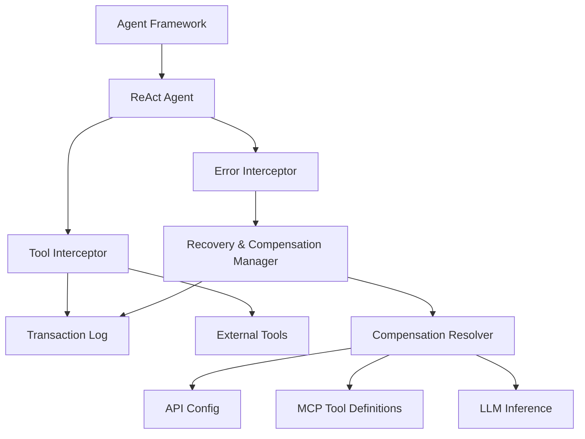

本記事は [https://arxiv.org/abs/2605.03409](https://arxiv.org/abs/2605.03409) の解説記事です。

## 論文概要（Abstract）

Robust Agent Compensation（RAC）は、AIエージェントフレームワークに対するアーキテクチャ拡張として設計されたログベースのリカバリシステムである。エージェントのコードを変更することなく、ツール実行の副作用を追跡し、障害発生時に補償アクションを自動実行することで「信頼性のある実行（reliable executions）」を実現する。著者らは、tau-bench および REALM-Bench ベンチマークにおいて、既存の LLM ベースリカバリ手法と比較してレイテンシおよびトークン効率で 1.5-8 倍の改善を報告している。

この記事は [Zenn記事: Bedrock AgentCore×Step Functionsで業務エージェントの耐障害ワークフローを設計する](https://zenn.dev/0h_n0/articles/5165b29d849e3f) の深掘りです。

## 情報源

- **arXiv ID**: 2605.03409
- **URL**: [https://arxiv.org/abs/2605.03409](https://arxiv.org/abs/2605.03409)
- **著者**: Srinath Perera, Kaviru Hapuarachchi, Frank Leymann, Rania Khalaf
- **発表年**: 2026（ACM Conference on AI and Agentic Systems, ACM CAIS 2026 採択）
- **分野**: cs.AI
- **ライセンス**: CC BY 4.0

## 背景と動機（Background & Motivation）

AIエージェントが業務自動化で実用される場面が増える中、エージェントが外部システムに対して行う操作の「副作用管理」が深刻な課題となっている。たとえば旅行予約エージェントがフライトとホテルの予約に成功した後、レンタカーの予約で障害が発生した場合、すでに確定したフライトとホテルの予約がそのまま残り、ユーザーには不要な課金が発生する。

従来のデータベーストランザクション（ACID）はこうした長時間実行ワークフローには適用しにくい。Garcia-Molina と Salem（1987）が提唱した Saga パターンは、長時間トランザクションを小さな補償可能な単位に分割するアプローチだが、AIエージェントの実行パスは ReAct ループにより動的に決定されるため、従来の Saga 実装をそのまま適用することは困難である。

既存のリカバリ手法には大きく2つの方向がある。1つは ReAct エージェント自身に自然言語推論でリカバリさせる方法（LG: Vanilla ReAct）、もう1つは SagaLLM のように実行前にLLMで補償計画を生成する方法である。しかし前者はモデルの推論品質に依存し信頼性が低く、後者は全ての障害シナリオを事前に計画するため膨大なトークンとレイテンシを消費する。RAC はこの2つのアプローチの限界を、決定論的なログベース補償で克服しようとする研究である。

## 主要な貢献（Key Contributions）

- **アーキテクチャ非依存の補償機構**: LangGraph、LangChain、Semantic Kernel、LlamaIndex、Haystack、OpenAI Agents SDK、AutoGen、Griptape など、既存のエージェントフレームワークにコード変更なしで統合可能な安全機構を設計した
- **決定論的リカバリ**: LLMに補償判断を委ねるのではなく、Transaction Log と補償ペア解決の3層ルックアップにより、決定論的に補償アクションを実行するアルゴリズムを提案した
- **MCP拡張による補償ペア定義**: Model Context Protocol（MCP）のツールスキーマに `x-compensation-tool` アノテーションを追加し、ツール開発者が一度定義すれば全てのアプリケーションで補償ペアが利用可能になる仕組みを導入した
- **ベンチマーク評価**: tau-bench（Airline / Retail / Telecom の3ドメイン）と REALM-Bench で、SagaLLM 等の既存手法と比較してレイテンシ 1.5-8 倍、トークン効率で大幅な改善を実証した

## 技術的詳細（Technical Details）

### RACアーキテクチャの5つのコンポーネント

RAC は以下の5つのコンポーネントで構成される。



1. **Tool Interceptor**: 全てのツール実行イベント（開始・完了・エラー）を Transaction Log に記録するインターセプタ。ツール呼び出しの前後に介入し、実行メタデータを永続化する
2. **Error Interceptor**: エージェントプラットフォームからのエラーを検知する。エラーコードによる検知に加え、ユーザー定義プロンプトによるセマンティックエラーの検知もサポートする
3. **Recovery and Compensation Manager（RCManager）**: リカバリロジックの中核。3段階の逐次戦略を実装する（後述）
4. **Transaction Log**: 各ツール呼び出しのレコードを保持する永続ログ。レコードには、ツール名、パラメータ、実行ステータス（PENDING / COMPLETED / FAILED / COMPENSATED）、結果データまたはエラーメッセージが含まれる
5. **Compensation Resolver**: 補償ペアを3層のルックアップで解決する。(1) エージェントフレームワークの API 設定、(2) MCP ツール定義の `x-compensation-tool` アノテーション、(3) LLM による推論の順に探索する

### RCManager の3段階リカバリ戦略

RCManager はエラー検知時に以下の3段階で逐次リカバリを試みる（論文 Algorithm 2 に対応）。

**第1段階 -- リトライ**: エラーコードからトランジェントエラー（一時障害）と判定された場合、指数バックオフでリトライを実行する。

**第2段階 -- 代替ツール実行**: リトライで解決しない場合、LLM に代替ツールの提案を依頼し、類似の結果を達成できる別のツールを実行する。

**第3段階 -- 完全ロールバック**: 代替ツールでも解決しない場合、Transaction Log を参照して全ての完了済みアクションに対する補償を LIFO（後入れ先出し）順で実行する。

### 補償アクション決定アルゴリズム

補償の実行順序は依存関係を考慮して決定される（論文 Algorithm 3 に対応）。

```python
def execute_compensation(transaction_log: list[Record]) -> None:
    """Transaction Logに基づく補償実行アルゴリズム

    Args:
        transaction_log: COMPLETED状態のツール実行レコードのリスト
    """
    # Step 1: 実行グラフの構築
    g_execution = build_execution_graph(transaction_log)

    # Step 2: トポロジカルソートで逆依存順を取得
    # 依存先より先に依存元を補償する（LIFO）
    sorted_records = topological_sort(g_execution)
    sorted_records.reverse()

    # Step 3-5: 各レコードに対して補償を実行
    for record in sorted_records:
        # 3層ルックアップで補償アクションを解決
        compensator = get_compensator(record.action)
        # ルックアップ順序:
        #   1. API Config（フレームワーク設定）
        #   2. MCP Tool Definitions（x-compensation-tool）
        #   3. LLM Inference（フォールバック）

        if compensator is None:
            # 補償が見つからない場合、副作用なしと仮定
            continue

        # ツール出力から補償パラメータを抽出
        params = extract_params(
            compensator, record.result, record.params
        )

        # 補償アクションの実行
        execute_tool(compensator, params)
        record.status = "COMPENSATED"
```

ここで重要なのは、補償ペアが見つからないツールについては「副作用なし」と仮定する点である。著者らはこれを制約として明示しており、副作用があるにもかかわらず補償アクションが定義されていないツールには、RAC も他の補償ソリューションも対応できないと述べている。

### Sagaパターンの適用

RAC は Garcia-Molina & Salem（1987）の Saga パターンを AIエージェントに適用したものと位置づけられる。従来の Saga パターンとの主な差異は以下の通りである。

| 観点 | 従来のSaga | RAC |
|------|-----------|-----|
| 実行パス | 事前に確定 | ReActループにより動的に決定 |
| 補償順序 | 静的に定義 | Transaction Logから実行時に構築 |
| 補償ペア解決 | 開発者が事前定義 | 3層ルックアップ（Config / MCP / LLM） |
| エラー分類 | アプリケーション固有 | エラーコード + セマンティック検知 |

従来の Saga ではワークフローの各ステップと補償アクションが事前に対応づけられるが、ReAct エージェントでは実行パスが LLM の推論により動的に決まるため、実行時にTransaction Logからグラフを再構築する必要がある。

### LLMベース手法との本質的差異

RAC と SagaLLM の最も本質的な違いは、「いつ補償計画を生成するか」にある。SagaLLM は実行前に LLM で全ての障害シナリオに対する補償コードを生成する。一方、RAC は実行時に実際に発生した障害に対してのみ補償を実行する。

著者らはこの違いを次のように表現している。RAC は「実行時に発生した条件に対してのみ計画すればよく、計画時にすべての可能なエラーに対処する必要がない」ため、トークン消費とレイテンシを大幅に削減できる。

### エージェントコンテキストの更新

リカバリ完了後、RAC はエージェントのコンテキストにリカバリレポートを追加する（論文 Algorithm 1 の `updateContext(report_recovery)`）。これにより、下流の ReAct ループは「何が起きて、何が補償されたか」を把握した上で次のアクションを決定できる。

## 実装のポイント（Implementation）

### フレームワークへの統合方法

RAC は各フレームワークの拡張ポイント（ライフサイクルフック）を利用して統合する。LangGraph の場合、ツール呼び出しの pre/post フックにインターセプタを登録する形で実装される。フックを持たないフレームワークでは、Python デコレータによるラッピングが代替手段として用意されている。

```python
from rac import rac_interceptor

@rac_interceptor
def book_flight(
    destination: str,
    date: str,
    passenger_name: str
) -> dict:
    """フライト予約ツール

    Args:
        destination: 目的地空港コード
        date: 搭乗日（YYYY-MM-DD）
        passenger_name: 乗客名

    Returns:
        予約確認情報を含む辞書
    """
    # 元のツールロジック（変更不要）
    return api_client.book(destination, date, passenger_name)
```

### MCP による補償ペア定義

MCP ツールスキーマに `x-compensation-tool` アノテーションを追加することで、ツール開発者が補償ペアを一度定義すれば、全てのアプリケーションで自動的に利用可能になる。

```json
{
  "name": "book_flight",
  "description": "Book a flight for a passenger",
  "x-compensation-tool": "cancel_flight",
  "inputSchema": {
    "type": "object",
    "properties": {
      "destination": { "type": "string" },
      "date": { "type": "string" },
      "passenger_name": { "type": "string" }
    }
  }
}
```

### Transaction Log の設計

Transaction Log の各レコードは、ツール名・パラメータ・ステータス・結果データを保持する。ステータス遷移は PENDING -> COMPLETED（正常時）または PENDING -> FAILED（異常時）、補償実行後は COMPENSATED に更新される。実行順序はレコードの挿入順で暗黙的に保持され、依存関係は `buildExecutionGraph` で実行時に再構築される。

## Production Deployment Guide

RAC の補償パターンを AWS 上の AI エージェントワークフローに統合するための実装ガイドを示す。

### AWS実装パターン（コスト最適化重視）

RAC のログベース補償を AWS サービスで実現する場合、Transaction Log には DynamoDB、補償ロジックには Lambda または Step Functions の Catch/Retry 機構を活用する構成が適している。

**トラフィック量別の推奨構成**:

| 構成 | 規模 | サービス構成 | 月額概算 |
|------|------|-------------|---------|
| Small | ~100 req/日 | Lambda + DynamoDB (On-Demand) + SQS (DLQ) + CloudWatch | $50-150 |
| Medium | ~1,000 req/日 | Step Functions + Lambda + DynamoDB (Provisioned) + SQS + SNS | $300-800 |
| Large | 10,000+ req/日 | ECS Fargate + DynamoDB (DAX) + Kinesis + Step Functions Express | $2,000-5,000 |

注: 上記は2026年7月時点の AWS ap-northeast-1（東京）リージョン料金に基づく概算値。実際のコストはトラフィックパターン、Bedrock のモデル選択、バースト使用量により変動する。最新料金は AWS Pricing Calculator で確認を推奨する。

**コスト削減テクニック**:
- Bedrock Batch API 使用で推論コスト 50% 削減（非リアルタイム処理向け）
- Prompt Caching 有効化で繰り返しプロンプトのコスト 30-90% 削減
- DynamoDB On-Demand モードで低トラフィック時のプロビジョニング過剰を回避
- Step Functions Standard Workflow のステート遷移数を最小化（リトライ上限の適正化）

### Terraformインフラコード

**Small構成（Serverless）: Lambda + DynamoDB + SQS**

```hcl
# RAC Transaction Log 用 DynamoDB テーブル
resource "aws_dynamodb_table" "rac_transaction_log" {
  name         = "rac-transaction-log"
  billing_mode = "PAY_PER_REQUEST"
  hash_key     = "session_id"
  range_key    = "record_id"

  attribute {
    name = "session_id"
    type = "S"
  }

  attribute {
    name = "record_id"
    type = "S"
  }

  # ステータス別クエリ用 GSI
  global_secondary_index {
    name            = "status-index"
    hash_key        = "session_id"
    range_key       = "record_id"
    projection_type = "ALL"
  }

  # 30日後に自動削除（コスト最適化）
  ttl {
    attribute_name = "ttl"
    enabled        = true
  }

  server_side_encryption {
    enabled = true
  }

  tags = {
    Project = "rac-agent"
    Env     = "production"
  }
}

# 補償失敗時の DLQ
resource "aws_sqs_queue" "rac_compensation_dlq" {
  name                       = "rac-compensation-dlq"
  message_retention_seconds  = 1209600  # 14日
  visibility_timeout_seconds = 300
  sqs_managed_sse_enabled    = true
}

# RAC Interceptor Lambda 用 IAM ロール（最小権限）
resource "aws_iam_role" "rac_lambda_role" {
  name = "rac-lambda-execution-role"

  assume_role_policy = jsonencode({
    Version = "2012-10-17"
    Statement = [{
      Action = "sts:AssumeRole"
      Effect = "Allow"
      Principal = { Service = "lambda.amazonaws.com" }
    }]
  })
}

resource "aws_iam_role_policy" "rac_lambda_policy" {
  name = "rac-lambda-policy"
  role = aws_iam_role.rac_lambda_role.id

  policy = jsonencode({
    Version = "2012-10-17"
    Statement = [
      {
        Effect = "Allow"
        Action = [
          "dynamodb:PutItem",
          "dynamodb:UpdateItem",
          "dynamodb:Query",
          "dynamodb:GetItem"
        ]
        Resource = [
          aws_dynamodb_table.rac_transaction_log.arn,
          "${aws_dynamodb_table.rac_transaction_log.arn}/index/*"
        ]
      },
      {
        Effect = "Allow"
        Action = [
          "bedrock:InvokeModel",
          "bedrock-agentcore:InvokeHarness"
        ]
        Resource = "*"
      },
      {
        Effect   = "Allow"
        Action   = ["sqs:SendMessage"]
        Resource = aws_sqs_queue.rac_compensation_dlq.arn
      },
      {
        Effect = "Allow"
        Action = [
          "logs:CreateLogGroup",
          "logs:CreateLogStream",
          "logs:PutLogEvents"
        ]
        Resource = "arn:aws:logs:*:*:*"
      }
    ]
  })
}

# RAC Interceptor Lambda
resource "aws_lambda_function" "rac_interceptor" {
  function_name = "rac-tool-interceptor"
  runtime       = "python3.12"
  handler       = "interceptor.handler"
  role          = aws_iam_role.rac_lambda_role.arn
  timeout       = 300
  memory_size   = 512

  filename         = "lambda/rac_interceptor.zip"
  source_code_hash = filebase64sha256("lambda/rac_interceptor.zip")

  environment {
    variables = {
      TRANSACTION_LOG_TABLE = aws_dynamodb_table.rac_transaction_log.name
      DLQ_URL               = aws_sqs_queue.rac_compensation_dlq.url
      LOG_LEVEL             = "INFO"
    }
  }

  tracing_config {
    mode = "Active"  # X-Ray トレーシング有効化
  }
}

# CloudWatch アラーム: 補償失敗検知
resource "aws_cloudwatch_metric_alarm" "compensation_failures" {
  alarm_name          = "rac-compensation-failures"
  comparison_operator = "GreaterThanThreshold"
  evaluation_periods  = 1
  metric_name         = "ApproximateNumberOfMessagesVisible"
  namespace           = "AWS/SQS"
  period              = 300
  statistic           = "Sum"
  threshold           = 0
  alarm_description   = "RAC compensation DLQ has messages"

  dimensions = {
    QueueName = aws_sqs_queue.rac_compensation_dlq.name
  }

  alarm_actions = [aws_sns_topic.rac_alerts.arn]
}

resource "aws_sns_topic" "rac_alerts" {
  name              = "rac-compensation-alerts"
  kms_master_key_id = "alias/aws/sns"
}
```

**Large構成（Container）: ECS Fargate + DAX**

```hcl
# ECS クラスタ（RAC マネージャー用）
resource "aws_ecs_cluster" "rac_cluster" {
  name = "rac-manager-cluster"

  setting {
    name  = "containerInsights"
    value = "enabled"
  }
}

# Fargate タスク定義
resource "aws_ecs_task_definition" "rac_manager" {
  family                   = "rac-compensation-manager"
  network_mode             = "awsvpc"
  requires_compatibilities = ["FARGATE"]
  cpu                      = "1024"   # 1 vCPU
  memory                   = "2048"   # 2 GB
  execution_role_arn       = aws_iam_role.rac_ecs_execution.arn
  task_role_arn            = aws_iam_role.rac_ecs_task.arn

  container_definitions = jsonencode([{
    name  = "rac-manager"
    image = "${aws_ecr_repository.rac.repository_url}:latest"
    portMappings = [{
      containerPort = 8080
      protocol      = "tcp"
    }]
    environment = [
      { name = "TRANSACTION_LOG_TABLE", value = aws_dynamodb_table.rac_transaction_log.name },
      { name = "DAX_ENDPOINT", value = aws_dax_cluster.rac_cache.cluster_address }
    ]
    logConfiguration = {
      logDriver = "awslogs"
      options = {
        "awslogs-group"         = "/ecs/rac-manager"
        "awslogs-region"        = "ap-northeast-1"
        "awslogs-stream-prefix" = "rac"
      }
    }
  }])
}

# DAX クラスタ（DynamoDB アクセラレータ）
resource "aws_dax_cluster" "rac_cache" {
  cluster_name       = "rac-log-cache"
  node_type          = "dax.t3.small"
  replication_factor = 2  # マルチAZ
  iam_role_arn       = aws_iam_role.rac_dax.arn

  server_side_encryption {
    enabled = true
  }
}

# Auto Scaling 設定
resource "aws_appautoscaling_target" "rac_scaling" {
  max_capacity       = 10
  min_capacity       = 2
  resource_id        = "service/${aws_ecs_cluster.rac_cluster.name}/${aws_ecs_service.rac_manager.name}"
  scalable_dimension = "ecs:service:DesiredCount"
  service_namespace  = "ecs"
}

resource "aws_appautoscaling_policy" "rac_cpu_scaling" {
  name               = "rac-cpu-scaling"
  policy_type        = "TargetTrackingScaling"
  resource_id        = aws_appautoscaling_target.rac_scaling.resource_id
  scalable_dimension = aws_appautoscaling_target.rac_scaling.scalable_dimension
  service_namespace  = aws_appautoscaling_target.rac_scaling.service_namespace

  target_tracking_scaling_policy_configuration {
    predefined_metric_specification {
      predefined_metric_type = "ECSServiceAverageCPUUtilization"
    }
    target_value       = 60.0
    scale_in_cooldown  = 300
    scale_out_cooldown = 60
  }
}
```

### 運用・監視設定

**CloudWatch Logs Insights クエリ -- 補償イベント分析**:

```
# 1時間あたりの補償実行回数とレイテンシ
fields @timestamp, session_id, action, compensation_action, duration_ms
| filter event = "COMPENSATION_EXECUTED"
| stats count() as compensation_count,
        avg(duration_ms) as avg_latency,
        max(duration_ms) as p100_latency
  by bin(1h) as hour
| sort hour desc
```

**CloudWatch アラーム設定（Python boto3）**:

```python
import boto3

def setup_rac_alarms(sns_topic_arn: str) -> None:
    """RAC監視用CloudWatchアラームを設定する

    Args:
        sns_topic_arn: 通知先SNSトピックのARN
    """
    cw = boto3.client("cloudwatch")

    # 補償失敗率アラーム
    cw.put_metric_alarm(
        AlarmName="rac-compensation-failure-rate",
        MetricName="CompensationFailures",
        Namespace="RAC/Agent",
        Statistic="Sum",
        Period=300,
        EvaluationPeriods=2,
        Threshold=5,
        ComparisonOperator="GreaterThanThreshold",
        AlarmActions=[sns_topic_arn],
        AlarmDescription="RAC compensation failure rate exceeded threshold",
    )

    # Transaction Log 書き込みレイテンシ
    cw.put_metric_alarm(
        AlarmName="rac-log-write-latency",
        MetricName="LogWriteLatency",
        Namespace="RAC/Agent",
        Statistic="p99",
        Period=60,
        EvaluationPeriods=3,
        Threshold=500,  # 500ms
        ComparisonOperator="GreaterThanThreshold",
        AlarmActions=[sns_topic_arn],
        AlarmDescription="Transaction Log write latency p99 exceeded 500ms",
    )
```

**X-Ray トレーシング設定**:

```python
from aws_xray_sdk.core import xray_recorder, patch_all
import boto3

# boto3 自動計装
patch_all()

def trace_compensation(
    session_id: str,
    action: str,
    compensation_action: str
) -> None:
    """補償実行をX-Rayでトレースする

    Args:
        session_id: エージェントセッションID
        action: 元のツールアクション名
        compensation_action: 補償アクション名
    """
    subsegment = xray_recorder.begin_subsegment("rac_compensation")
    subsegment.put_annotation("session_id", session_id)
    subsegment.put_annotation("original_action", action)
    subsegment.put_annotation("compensation_action", compensation_action)
    subsegment.put_metadata("rac", {
        "recovery_strategy": "full_rollback",
        "log_entries_processed": 0,  # 実行時に更新
    })
    xray_recorder.end_subsegment()
```

**Cost Explorer 日次レポート**:

```python
import boto3
from datetime import date, timedelta

def get_daily_rac_cost() -> dict[str, float]:
    """RAC関連サービスの日次コストを取得する

    Returns:
        サービス別コスト辞書
    """
    ce = boto3.client("ce")
    today = date.today()
    yesterday = today - timedelta(days=1)

    response = ce.get_cost_and_usage(
        TimePeriod={
            "Start": yesterday.isoformat(),
            "End": today.isoformat(),
        },
        Granularity="DAILY",
        Metrics=["UnblendedCost"],
        Filter={
            "Tags": {
                "Key": "Project",
                "Values": ["rac-agent"],
            }
        },
        GroupBy=[{"Type": "DIMENSION", "Key": "SERVICE"}],
    )

    costs: dict[str, float] = {}
    for group in response["ResultsByTime"][0]["Groups"]:
        service = group["Keys"][0]
        amount = float(group["Metrics"]["UnblendedCost"]["Amount"])
        costs[service] = amount

    # $100/日超過で通知
    total = sum(costs.values())
    if total > 100.0:
        sns = boto3.client("sns")
        sns.publish(
            TopicArn="arn:aws:sns:ap-northeast-1:123456789012:rac-cost-alerts",
            Subject="RAC Daily Cost Alert",
            Message=f"RAC daily cost: ${total:.2f} (threshold: $100)",
        )

    return costs
```

### コスト最適化チェックリスト

**アーキテクチャ選択**:
- [ ] トラフィック量に応じた構成を選択（Small: Serverless / Medium: Hybrid / Large: Container）
- [ ] Step Functions は Standard Workflow を使用（Express は 5分制限で AgentCore 非対応）

**リソース最適化**:
- [ ] DynamoDB On-Demand モード（低トラフィック時のコスト削減）
- [ ] Lambda メモリサイズ最適化（Power Tuning で測定）
- [ ] ECS Fargate Spot 活用で最大 70% 削減
- [ ] DAX 導入は読み取り比率が高い場合のみ（書き込み主体なら不要）
- [ ] Transaction Log の TTL 設定（30日で自動削除）

**LLMコスト削減**:
- [ ] Bedrock Prompt Caching 有効化（補償ペア解決の LLM フォールバック時）
- [ ] 補償ペアを MCP / API Config で事前定義し LLM フォールバックを最小化
- [ ] Bedrock Batch API 使用（非リアルタイム補償処理向け）
- [ ] MaxIterations を必要最小限に設定（デフォルト 75 は過剰）

**監視・アラート**:
- [ ] AWS Budgets で月次予算アラート設定
- [ ] CloudWatch アラーム: DLQ 深度 > 0 で即時通知
- [ ] CloudWatch アラーム: 補償失敗率の監視
- [ ] Cost Anomaly Detection 有効化
- [ ] 日次コストレポートの自動取得

**リソース管理**:
- [ ] 未使用 DynamoDB テーブルの削除
- [ ] タグ戦略の統一（Project / Env / Owner）
- [ ] CloudWatch Logs の保持期間設定（90日）
- [ ] 開発環境の ECS タスク夜間停止
- [ ] ECR イメージのライフサイクルポリシー（直近 10 イメージのみ保持）

## 実験結果（Results）

### tau-bench の結果

tau-bench は Airline / Retail / Telecom の3ドメインでエージェントの成功率と完了率を評価するベンチマークである。論文 Table 1 より、主要な結果を以下に示す。

| ドメイン | 手法 | 成功率 (%) | 実行時間 (s) | トークン数 |
|---------|------|-----------|-------------|----------|
| Airline | LG (Vanilla ReAct) | 82 | 52 | 48k |
| Airline | SagaLLM | 97 | 76 | 80k |
| Airline | RAC | 97 | 50 | 77k |
| Retail | LG (Vanilla ReAct) | 90 | 28 | 49k |
| Retail | SagaLLM | 98 | 65 | 71k |
| Retail | RAC | 100 | 22 | 66k |
| Telecom | LG (Vanilla ReAct) | 45 | 16 | 49k |
| Telecom | SagaLLM | 100 | 32 | 100k |
| Telecom | RAC | 99 | 58 | 176k |

Retail ドメインでは、RAC が成功率 100% を達成しつつ、SagaLLM（65秒）に対して 22秒と約 3 倍のレイテンシ効率を示している。Airline ドメインでも RAC は SagaLLM と同等の成功率 97% を維持しながら、レイテンシを 76秒から 50秒に削減している。一方、Telecom ドメインでは RAC のトークン消費が 176k と他の手法より大きい。著者らはこのドメインの複雑性（多段の依存関係を持つ補償チェーン）が原因と分析している。

### REALM-Bench の結果

REALM-Bench はより複雑な障害シナリオを含むベンチマークである。論文 Table 2 より、RAC と SagaLLM の効率差が顕著な問題を抜粋する。

| 問題 | RAC 成功率 | RAC トークン | RAC レイテンシ | SagaLLM トークン | SagaLLM レイテンシ |
|------|----------|------------|-------------|----------------|-----------------|
| P5 | 3/3 | 10k | 15s | 250k | 646s |
| P6 | 3/3 | 9k | 15s | 238k | 579s |
| P9 | 3/3 | 9k | 14s | 52k | 106s |

P5 では、RAC は SagaLLM と比較してトークン数で約 25 倍、レイテンシで約 43 倍の効率を達成している。P6 では SagaLLM が 137 件の不要な補償を実行したのに対し、RAC は必要最小限の補償のみを実行した。

### 動的障害テスト

論文 Table 3 では、実行中に障害を動的に注入するテストの結果が報告されている。

| 問題 | LG | LG(PE) | SagaLLM | RAC |
|------|-----|--------|---------|-----|
| P12 (一時障害) | 0/3 | 3/3 | 1/3 | 3/3 |
| P13 (永続障害) | 0/3 | 0/3 | 2/3 | 3/3 |
| P14 (全体ロールバック) | 0/3 | 0/3 | 1/3 | 2/3 |

P12（一時障害）では RAC が 9秒で処理を完了したのに対し、SagaLLM は 72秒を要しており、約 8 倍のレイテンシ効率が報告されている。P13 では SagaLLM が「34k件の不要な補償を実行し、20倍の時間を消費した」と著者らは報告している。

### 高推論能力モデルのアブレーション

論文 Table 4 では、Gemini-flash（低推論コスト）と GPT-5（高推論コスト）での比較実験が報告されている。興味深いことに、高推論能力モデルが必ずしも性能向上に寄与しない結果が示されている。SagaLLM + GPT-5 の組み合わせでは、P8 で「約100万トークン、タスクあたり約18分」を消費したと報告されており、計画ベースアプローチにおける高推論モデルのコスト爆発リスクが浮き彫りになっている。

## 実運用への応用（Practical Applications）

### Zenn記事のSagaパターンセクションとの関連

関連する Zenn 記事では、AWS Step Functions の Catch/Retry 機構と AgentCore InvokeHarness を組み合わせた Saga パターンの実装を解説している。RAC 論文の知見をこの実装と対比すると、以下の関係が見える。

**Step Functions の Catch ステートと RAC の Error Interceptor**: Zenn 記事では ASL の `Catch` でエラー種別ごとに補償ステートへ分岐する設計を示している。これは RAC の Error Interceptor + RCManager の3段階リカバリと対応関係にある。ただし、Step Functions の Catch は宣言的な定義で済むのに対し、RAC のアプローチは Transaction Log からの動的グラフ構築を行う点がより汎用的である。

**補償アクションの実装方針**: Zenn 記事では「補償処理は確定的な API 呼び出しであるため Lambda で実装する」という設計判断を示している。これは RAC の設計思想と合致する。RAC も補償アクションを決定論的に実行し、LLM に頼らない点が SagaLLM との差別化要因である。

**MCP の `x-compensation-tool` と Step Functions の組み合わせ**: RAC の MCP 拡張を AgentCore の MCP ツール定義に適用すれば、Step Functions ワークフロー内で呼び出されるエージェントツールの補償ペアを統一的に管理できる可能性がある。

## 関連研究（Related Work）

- **SagaLLM**（Chang & Geng, 2025）: LLM で事前に実行計画と補償スタックを生成するアプローチ。RAC の主要比較対象であり、計画時の網羅性と引き換えにトークン消費とレイテンシが大きくなる傾向がある
- **Garcia-Molina & Salem（1987）**: Saga パターンの原論文。長時間トランザクションを補償可能な小単位に分割する概念を提唱した。RAC はこの概念を動的実行パスを持つ AI エージェントに適用している
- **Leymann & Roller（1999）**: ワークフローシステムにおける補償ベースリカバリの体系化。RAC の Transaction Log 設計はこの系譜に位置する
- **Helland（2016）**: スケーラブルシステムではトランザクションは機能せず、補償が必要であると主張した論考。RAC の動機づけの一部となっている

## まとめと今後の展望

RAC は、AI エージェントフレームワークにアーキテクチャ非依存の補償機構を追加し、ログベースの決定論的リカバリにより LLM ベース手法と比較して大幅な効率改善を達成した。MCP の `x-compensation-tool` 拡張によるエコシステム全体での補償ペア共有は、エージェントの信頼性を業界標準として底上げするアプローチとして注目に値する。

著者らが制約として挙げている「補償アクションが定義されていないツールには対応できない」点と、「スコープ限定のロールバック（全体ではなく部分的な補償）」の未対応は、今後の研究課題として重要である。また、計画ベース（SagaLLM）と動的補償（RAC）のハイブリッドアプローチの探索も、著者ら自身が今後の方向として示している。

## 参考文献

- **arXiv**: [https://arxiv.org/abs/2605.03409](https://arxiv.org/abs/2605.03409)
- **Related Zenn article**: [https://zenn.dev/0h_n0/articles/5165b29d849e3f](https://zenn.dev/0h_n0/articles/5165b29d849e3f)
- Garcia-Molina, H., & Salem, K. (1987). Sagas. ACM SIGMOD Record.
- Leymann, F., & Roller, D. (1999). Production Workflow: Concepts and Techniques. Prentice Hall.
- Chang, L., & Geng, J. (2025). SagaLLM. arXiv.
- Helland, P. (2016). Standing on Distributed Shoulders of Giants. arXiv.
- Yao, S., et al. (2023). ReAct: Synergizing Reasoning and Acting in Language Models. ICLR 2023.
