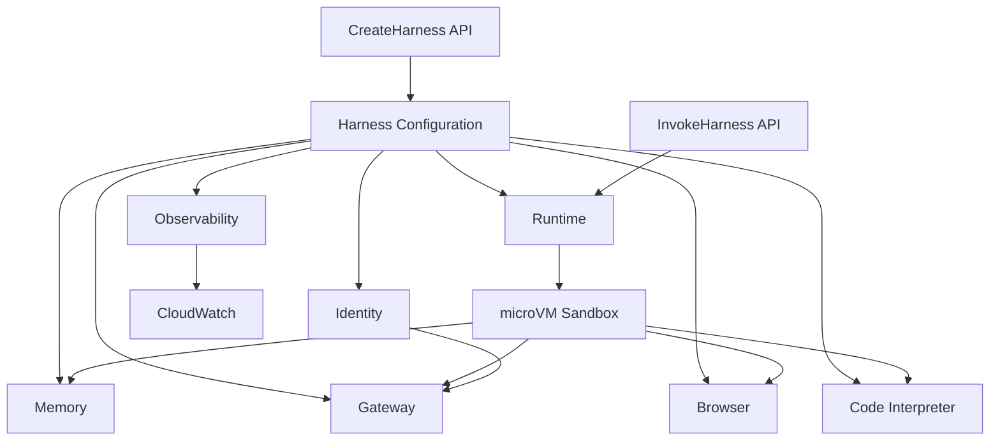

## ブログ概要（Summary）

本記事は [Amazon Bedrock AgentCore harness is now generally available: Go from idea to production-grade agent in minutes](https://aws.amazon.com/blogs/machine-learning/amazon-bedrock-agentcore-harness-is-now-generally-available-go-from-idea-to-production-grade-agent-in-minutes/) の解説記事です。

2026年6月18日にGA（一般提供）となったAmazon Bedrock AgentCore harnessは、AIエージェントの本番運用に必要な7つの基盤プリミティブ（Runtime, Memory, Gateway, Browser, Code Interpreter, Identity, Observability）を、`CreateHarness`と`InvokeHarness`の2つのAPIに統合したマネージドサービスである。従来、エージェント基盤の構築には個別のインフラ管理が必要だったが、harnessは宣言的な構成ファイルだけでプロダクショングレードのエージェントを立ち上げられる点が特徴である。本記事では、そのアーキテクチャ設計、Step Functions連携、バージョニングによる耐障害性、料金体系を技術的に掘り下げる。

この記事は [Zenn記事: Bedrock AgentCore×Step Functionsで業務エージェントの耐障害ワークフローを設計する](https://zenn.dev/0h_n0/articles/5165b29d849e3f) の深掘りです。

## 情報源

- **種別**: 企業テックブログ（AWS Machine Learning Blog）
- **URL**: [https://aws.amazon.com/blogs/machine-learning/amazon-bedrock-agentcore-harness-is-now-generally-available-go-from-idea-to-production-grade-agent-in-minutes/](https://aws.amazon.com/blogs/machine-learning/amazon-bedrock-agentcore-harness-is-now-generally-available-go-from-idea-to-production-grade-agent-in-minutes/)
- **組織**: Amazon Web Services（著者: Kosti Vasilakakis, Alexander Richey, Evandro Franco, Vivek Dalal）
- **発表日**: 2026年6月18日

## 技術的背景（Technical Background）

AIエージェントを本番環境で稼働させるには、モデル推論だけでなく、ツール呼び出しの認証管理、会話状態の永続化、コード実行のサンドボックス化、マルチモデル切替、可観測性の確保といった横断的関心事を個別に構築・統合する必要がある。従来のアプローチでは、LangChainやLlamaIndexなどのフレームワークでオーケストレーション層を構築し、その上にECS/EKSでランタイムを用意し、DynamoDBやRedisでセッション管理を行い、CloudWatchで監視を設定するという多層構成が必要だった。

この構成には2つの根本的な課題がある。第一に、各層の整合性管理が運用負荷を増大させる。たとえばメモリストアのスキーマ変更がオーケストレーション層のシリアライズ処理に影響を及ぼすといった結合が生じやすい。第二に、エージェントのバージョン管理が困難である。モデル、プロンプト、ツール構成、メモリ設定が個別のリソースに分散しているため、ある時点の構成を再現するにはインフラ全体のスナップショットが必要となる。AgentCore harnessは、これらの課題に対して「構成駆動（Config-as-Agent）」というアプローチで応答する設計になっている。

## 実装アーキテクチャ（Architecture）

### 7プリミティブの統合設計

AgentCore harnessの中核設計は、エージェント実行に必要な機能を7つのプリミティブとして分離し、2つのAPIインターフェースで統合する構造にある。以下にブログで報告されている各プリミティブの役割を整理する。



| プリミティブ | 役割 | 課金単位（AWS公式より） |
|-------------|------|----------------------|
| **Runtime** | サンドボックス化されたmicroVM実行環境。ファイルシステム・シェルアクセスを提供 | $0.0895/vCPU-hour, $0.00945/GB-hour |
| **Memory** | セマンティック検索・要約によるセッション横断の会話記憶 | $0.25/1,000 short-term events |
| **Gateway** | ツール認証・クレデンシャルブローカリング。OpenAPI/MCP/Lambda対応 | $0.005/1,000 invocations |
| **Browser** | フルブラウザサンドボックス（クリック、ナビゲーション、スクリーンショット） | Runtime同一課金モデル |
| **Code Interpreter** | サンドボックス化されたPython/Node.js実行環境 | Runtime同一課金モデル |
| **Identity** | APIキー・トークンのボールト管理。モデルからの直接参照を防止 | $0.010/1,000 requests |
| **Observability** | CloudWatchへの統合トレーシング。プリミティブ横断のスパン可視化 | CloudWatch標準料金 |

### 2 APIモデル: CreateHarness / InvokeHarness

ブログの著者らは、harnessの設計哲学を「すべての設定をCreateHarnessで宣言し、InvokeHarnessで実行する」2段階モデルとして報告している。

`CreateHarness`では、モデルプロバイダ（Bedrock, OpenAI, Gemini, LiteLLM）、ツール構成、スキル、メモリ戦略、カスタム環境（ECRコンテナ）、ファイルシステム（マネージドセッションストレージ/EFS/S3）を宣言的に指定する。以下はブログに示されたCreateHarnessの最小構成例である。

```python
control.create_harness(
    harnessName="MyAgent",
    executionRoleArn="arn:aws:iam::123456789012:role/MyAgentRole"
)
```

`InvokeHarness`では、上記のデフォルト設定を呼び出し単位でオーバーライドできる。著者らは「セッション中にモデルプロバイダを切り替えてもコンテキストが維持される」と報告しており、たとえば計画フェーズにClaude Opus、コード生成にGPT系列、要約にGeminiを使い分けるユースケースが想定されている。

```python
data.invoke_harness(
    harnessArn=harness["harnessArn"],
    runtimeSessionId=session_id,  # 最小33文字
    messages=[{"role": "user", "content": [{"text": "..."}]}]
)
```

### microVM分離とセッションモデル

各セッションは独立したmicroVM上で実行される。ブログによれば、セッション間のファイルシステムは完全に分離されており、あるセッションの書き込みが別セッションに影響を与えることはない。また、`InvokeAgentRuntimeCommand` APIにより、モデル推論を経由せずにgit clone/commit/pushなどの決定論的操作を直接ランタイムに送信できる設計になっている。

### バージョニングとNamed Endpoints

耐障害設計の要となるのがバージョニング機構である。ブログの報告によれば、`UpdateHarness`を実行するたびに不変バージョンが生成され、モデル、システムプロンプト、ツール構成、メモリ設定、スキル、環境、実行制限の全設定がスナップショットとして記録される。

Named Endpoints（`DEFAULT`, `PROD`, `STAGING`等）は特定バージョンに固定され、明示的な昇格操作がない限り自動更新されない。これにより、開発中のDEFAULTエンドポイントが最新バージョンを追従する一方、PRODエンドポイントは検証済みバージョンに固定されるという運用が可能になる。

```bash
# PRODをV2に固定
aws bedrock-agentcore create-harness-endpoint \
  --harness-id my-harness-xxx \
  --endpoint-name PROD \
  --harness-version 2

# V5に昇格
aws bedrock-agentcore update-harness-endpoint \
  --harness-id my-harness-xxx \
  --endpoint-name PROD \
  --harness-version 5
```

ロールバックは即時であり、エンドポイントを以前のバージョンに再設定するだけで完了する。この設計はコンテナイメージのタグ管理に近く、インフラエンジニアにとって馴染みのあるパターンである。

### Step Functions統合

Step FunctionsとのAgentCore連携は、ワークフロー内にAIエージェントの推論ステップを組み込むための統合である。AWS公式ドキュメントによれば、以下の特性を持つ。

**サポートされるパターン**: Request Responseのみ。`.sync`（ジョブ完了待機）および`.waitForTaskToken`（コールバック待機）は非対応である。

**レスポンス構造**: マルチターン会話の最終アシスタントメッセージのみが返却される。ツール使用ブロックや推論ブロックはレスポンスから除外され、テキストコンテンツのみが含まれる。トークン使用量（InputTokens, OutputTokens, TotalTokens）は全ターンの集計値として返される。

**タイムアウト**: Task stateの最大実行時間は15分（900秒）である。`TimeoutSeconds`にこれを超える値を設定しても15分で打ち切られる。ただしTask stateがタイムアウトしてもharness自体は独自のタイムアウトまで実行を継続するため、予期しないコストが発生する可能性がある。

以下はStep Functions ASL定義の例である（AWS公式ドキュメントより）。

```json
{
  "Type": "Task",
  "Resource": "arn:aws:states:::bedrockagentcore:invokeHarness",
  "Arguments": {
    "HarnessArn": "arn:aws:bedrock-agentcore:us-east-1:123456789012:harness/my-agent-harness",
    "RuntimeSessionId": "",
    "Messages": [
      {
        "Content": [{ "Text": "" }],
        "Role": "user"
      }
    ],
    "Model": {
      "BedrockModelConfig": {
        "Temperature": 0.7,
        "ModelId": "global.anthropic.claude-sonnet-4-6"
      }
    },
    "MaxIterations": 75,
    "TimeoutSeconds": 600
  },
  "Retry": [
    {
      "ErrorEquals": ["BedrockAgentCore.ThrottlingException"],
      "IntervalSeconds": 2,
      "MaxAttempts": 3,
      "BackoffRate": 2.0
    }
  ],
  "Catch": [
    {
      "ErrorEquals": ["States.ALL"],
      "Next": "HandleError"
    }
  ],
  "End": true
}
```

注意点として、Step Functionsリソース URIでは`bedrockagentcore`（ハイフンなし）、AgentCore リソースARNでは`bedrock-agentcore`（ハイフンあり）と表記が異なる。

### ツール構成: Tools as Config

harnessのツール構成は宣言的であり、コードを書かずにJSON/YAML設定のみでツールを組み込める。ブログで報告されているツールタイプは以下の通りである。

| ツールタイプ | 概要 |
|------------|------|
| `agentcore_gateway` | Gateway ARNを参照。OpenAPI, Smithy, Lambda, MCPターゲットを公開 |
| `remote_mcp` | MCP（Model Context Protocol）サーバーへの直接接続 |
| `agentcore_browser` | ブラウザサンドボックス。1行の宣言で有効化 |
| `agentcore_code_interpreter` | Python/Nodeサンドボックス。1行の宣言で有効化 |
| `inline_function` | Human-in-the-loopツール。ストリームイベントとしてスキーマを送出 |
| `shell`, `file_operations` | 組み込み。宣言不要で自動的に利用可能 |

### メモリシステム

ブログの報告によれば、メモリは3つのモードで構成可能である。

1. **マネージドメモリ**: `CreateHarness`でメモリ設定を省略した場合のデフォルト。`SEMANTIC`（セマンティック検索）と`SUMMARIZATION`（要約）の2戦略が自動プロビジョニングされ、30日間のイベント有効期限が設定される。
2. **Bring Your Own Memory**: 既存のAgentCore Memoryリソースを ARNで参照する方式。
3. **ステートレス**: `"memory": {"disabled": {}}` でメモリを完全に無効化。

マネージドメモリでは`actorId`のネームスペーステンプレートによりマルチテナント分離が実現され、harness削除時に`deleteManagedMemory`フラグでメモリの連鎖削除が可能である。

### スキルフレームワーク

ブログの著者らは、スキルを「オンデマンドでロードされる専門知識パッケージ」として位置づけている。メタデータはセッション開始時にマテリアライズされ、タスクが要求した場合にのみフルコンテンツがコンテキストにロードされる遅延読み込み戦略が採用されている。

```json
"skills": [
  {"awsSkills": {}},
  {"git": {"uri": "https://github.com/anthropics/skills", "path": "document-skills/xlsx"}},
  {"s3": {"uri": "s3://my-bucket/skills/team-sops/"}},
  {"path": "local/skill/location"}
]
```

AWS公式スキルバンドルは`"awsSkills": {}`の1行で有効化でき、SDK使用法、IaC、IAM、CloudWatch、Bedrock、データベース操作などを包括する。パスグロブによるスコーピング（例: `"paths": ["core-skills/*"]"`）も可能である。

## Production Deployment Guide

AgentCore harnessは構成駆動型であるため、従来のコンテナベースのデプロイとは異なるアプローチが必要である。以下に、トラフィック規模別のAWS実装パターンを示す。

### AWS実装パターン（コスト最適化重視）

AgentCore harnessのランタイムは従量課金（アクティブCPU消費のみ課金）であるため、コスト構造はリクエストパターンに大きく依存する。以下の構成はAWS公式ブログおよび料金ページ（2026年7月時点）の情報に基づく概算である。実際のコストはリージョン、トラフィックパターン、モデル選択により変動するため、最新料金はAWS料金計算ツールで確認を推奨する。

| 規模 | 構成 | 月額概算 | 主要コンポーネント |
|------|------|---------|------------------|
| **Small** (~100 req/日) | Harness + Step Functions (Express) | $80-200 | Harness Runtime, Bedrock推論, Step Functions, DynamoDB |
| **Medium** (~1,000 req/日) | Harness + Step Functions (Standard) + 複数harness | $400-1,200 | 複数Harness, Gateway, Memory, Step Functions, S3 |
| **Large** (10,000+ req/日) | Harness + Step Functions + EFS + カスタムECR環境 | $3,000-8,000 | カスタムRuntime, Gateway, Memory, EFS, CloudWatch |

**Small構成の内訳**（~100 req/日、Claude Sonnet使用時）:
- Harness Runtime: エージェント推論1回あたり平均30秒のアクティブCPU消費と仮定すると、1 vCPU x 30s x 100 req = 0.83 vCPU-hour/日。月額約$2.2
- Bedrock推論（Claude Sonnet）: 入力1,000トークン + 出力500トークン/回 x 100 req/日。月額約$30-80（モデル料金依存）
- Step Functions Express: 100回/日 x 30日 = 3,000遷移。月額$0.15未満
- DynamoDB On-Demand: セッションメタデータ保存。月額$1-5
- Memory: 100 events/日 x 30日 = 3,000 events。月額$0.75

**Large構成の内訳**（10,000+ req/日）:
- Harness Runtime: 10,000 req x 60s平均 = 約167 vCPU-hour/日。月額約$450
- Gateway: 10,000 invocations/日。月額約$1.5
- Memory: 300,000 events/月 + 長期記録。月額約$100-300
- EFS: 共有参照データ用。月額$30-100
- カスタムECR環境: ECR保存料金 + ビルドパイプライン。月額$10-50
- Bedrock推論: 主要コスト。Claude Sonnet使用で月額$2,000-5,000+

**コスト削減テクニック**:
- **モデル選択ロジック**: 分類タスクにはHaiku/Nova Micro、推論にはSonnet、複雑な計画にのみOpusを使用する階層化戦略で推論コストを30-60%削減可能
- **Prompt Caching有効化**: Bedrockのプロンプトキャッシュ機能により、システムプロンプトやツール定義の繰り返し入力トークンを30-90%削減
- **Batch API利用**: リアルタイム性が不要なタスク（レポート生成、分析等）にはBedrock Batch APIで50%削減
- **メモリ有効期限の最適化**: デフォルト30日を用途に応じて短縮し、長期ストレージコストを抑制

### Terraformインフラコード

#### Small構成（Serverless: Harness + Step Functions）

```hcl
# AgentCore Harness + Step Functions Small構成
# 2026年7月時点のTerraform AWS Provider >= 5.60

terraform {
  required_providers {
    aws = {
      source  = "hashicorp/aws"
      version = ">= 5.60"
    }
  }
}

provider "aws" {
  region = "us-east-1"
}

# --- IAM: Harness実行ロール（最小権限） ---
resource "aws_iam_role" "harness_execution" {
  name = "agentcore-harness-execution"
  assume_role_policy = jsonencode({
    Version = "2012-10-17"
    Statement = [{
      Effect    = "Allow"
      Principal = { Service = "bedrock-agentcore.amazonaws.com" }
      Action    = "sts:AssumeRole"
    }]
  })
}

resource "aws_iam_role_policy" "harness_bedrock" {
  name = "bedrock-invoke"
  role = aws_iam_role.harness_execution.id
  policy = jsonencode({
    Version = "2012-10-17"
    Statement = [{
      Effect   = "Allow"
      Action   = ["bedrock:InvokeModel", "bedrock:InvokeModelWithResponseStream"]
      Resource = "arn:aws:bedrock:us-east-1::foundation-model/anthropic.claude-sonnet-4-6-*"
    }]
  })
}

# --- IAM: Step Functions実行ロール ---
resource "aws_iam_role" "sfn_execution" {
  name = "sfn-agentcore-execution"
  assume_role_policy = jsonencode({
    Version = "2012-10-17"
    Statement = [{
      Effect    = "Allow"
      Principal = { Service = "states.amazonaws.com" }
      Action    = "sts:AssumeRole"
    }]
  })
}

resource "aws_iam_role_policy" "sfn_invoke_harness" {
  name = "invoke-harness"
  role = aws_iam_role.sfn_execution.id
  policy = jsonencode({
    Version = "2012-10-17"
    Statement = [{
      Effect = "Allow"
      Action = [
        "bedrock-agentcore:InvokeHarness",
        "bedrock-agentcore:InvokeAgentRuntime"
      ]
      Resource = "arn:aws:bedrock-agentcore:us-east-1:*:harness/*"
    }]
  })
}

# --- DynamoDB: セッションメタデータ ---
resource "aws_dynamodb_table" "sessions" {
  name         = "agentcore-sessions"
  billing_mode = "PAY_PER_REQUEST"  # On-Demand: コスト最適化
  hash_key     = "session_id"

  attribute {
    name = "session_id"
    type = "S"
  }

  # KMS暗号化
  server_side_encryption {
    enabled = true
  }

  # TTL: 7日でセッション自動削除
  ttl {
    attribute_name = "expires_at"
    enabled        = true
  }
}

# --- CloudWatch: コスト監視アラーム ---
resource "aws_cloudwatch_metric_alarm" "daily_cost" {
  alarm_name          = "agentcore-daily-cost-spike"
  comparison_operator = "GreaterThanThreshold"
  evaluation_periods  = 1
  metric_name         = "EstimatedCharges"
  namespace           = "AWS/Billing"
  period              = 86400
  statistic           = "Maximum"
  threshold           = 50  # $50/日を超えたらアラート
  alarm_actions       = []  # SNS ARNを設定
}

# --- AWS Budgets: 月次予算 ---
resource "aws_budgets_budget" "monthly" {
  name         = "agentcore-monthly"
  budget_type  = "COST"
  limit_amount = "200"
  limit_unit   = "USD"
  time_unit    = "MONTHLY"

  notification {
    comparison_operator       = "GREATER_THAN"
    threshold                 = 80
    threshold_type            = "PERCENTAGE"
    notification_type         = "ACTUAL"
  }
}
```

#### Large構成（カスタムECR環境 + EFS + 複数Harness）

```hcl
# Large構成: カスタム環境 + EFS共有ストレージ
# VPC内デプロイ（EFS/S3 Filesアクセスポイント利用時に必須）

# --- VPC基盤 ---
resource "aws_vpc" "agentcore" {
  cidr_block           = "10.0.0.0/16"
  enable_dns_hostnames = true
  enable_dns_support   = true
}

resource "aws_subnet" "private" {
  count             = 2
  vpc_id            = aws_vpc.agentcore.id
  cidr_block        = cidrsubnet(aws_vpc.agentcore.cidr_block, 8, count.index)
  availability_zone = data.aws_availability_zones.available.names[count.index]
}

data "aws_availability_zones" "available" {
  state = "available"
}

# --- EFS: 共有参照データ（クロスセッション永続化） ---
resource "aws_efs_file_system" "shared" {
  encrypted  = true
  kms_key_id = aws_kms_key.agentcore.arn

  lifecycle_policy {
    transition_to_ia = "AFTER_30_DAYS"  # コスト最適化: 30日後にIA移行
  }
}

resource "aws_efs_mount_target" "private" {
  count           = 2
  file_system_id  = aws_efs_file_system.shared.id
  subnet_id       = aws_subnet.private[count.index].id
  security_groups = [aws_security_group.efs.id]
}

resource "aws_security_group" "efs" {
  vpc_id = aws_vpc.agentcore.id
  ingress {
    from_port   = 2049
    to_port     = 2049
    protocol    = "tcp"
    cidr_blocks = [aws_vpc.agentcore.cidr_block]
  }
}

# --- KMS: 暗号化キー ---
resource "aws_kms_key" "agentcore" {
  description             = "AgentCore encryption key"
  deletion_window_in_days = 7
  enable_key_rotation     = true
}

# --- ECR: カスタム環境イメージ ---
resource "aws_ecr_repository" "agent_env" {
  name                 = "agentcore-custom-env"
  image_tag_mutability = "IMMUTABLE"  # バージョン管理のため不変タグ

  image_scanning_configuration {
    scan_on_push = true
  }

  encryption_configuration {
    encryption_type = "KMS"
    kms_key         = aws_kms_key.agentcore.arn
  }
}

# --- ECRライフサイクルポリシー: 古いイメージ自動削除 ---
resource "aws_ecr_lifecycle_policy" "cleanup" {
  repository = aws_ecr_repository.agent_env.name
  policy = jsonencode({
    rules = [{
      rulePriority = 1
      description  = "Keep last 10 images"
      selection = {
        tagStatus   = "any"
        countType   = "imageCountMoreThan"
        countNumber = 10
      }
      action = { type = "expire" }
    }]
  })
}

# --- Secrets Manager: API設定 ---
resource "aws_secretsmanager_secret" "agent_config" {
  name       = "agentcore/agent-config"
  kms_key_id = aws_kms_key.agentcore.arn
}

# --- CloudWatch: 包括的監視 ---
resource "aws_cloudwatch_log_group" "agentcore" {
  name              = "/aws/agentcore/harness"
  retention_in_days = 30  # コスト最適化: 30日保持
  kms_key_id        = aws_kms_key.agentcore.arn
}

# --- AWS Budgets: Large構成向け予算 ---
resource "aws_budgets_budget" "large_monthly" {
  name         = "agentcore-large-monthly"
  budget_type  = "COST"
  limit_amount = "8000"
  limit_unit   = "USD"
  time_unit    = "MONTHLY"

  notification {
    comparison_operator       = "GREATER_THAN"
    threshold                 = 50
    threshold_type            = "PERCENTAGE"
    notification_type         = "FORECASTED"
  }

  notification {
    comparison_operator       = "GREATER_THAN"
    threshold                 = 80
    threshold_type            = "PERCENTAGE"
    notification_type         = "ACTUAL"
  }
}
```

### 運用・監視設定

AgentCore harnessはCloudWatch GenAI Observabilityと統合されており、「Harnesses」タブからセッション単位でトレースを追跡できる。以下に主要な監視設定を示す。

**CloudWatch Logs Insights: コスト異常検知**

```
# 1時間あたりのトークン使用量スパイク検知
fields @timestamp, @message
| filter @message like /TotalTokens/
| stats sum(TotalTokens) as total_tokens by bin(1h)
| sort total_tokens desc
| limit 24
```

**CloudWatch Logs Insights: レイテンシ分析**

```
# エージェント応答レイテンシのP95/P99
fields @timestamp, LatencyMs
| filter ispresent(LatencyMs)
| stats avg(LatencyMs) as avg_latency,
        pct(LatencyMs, 95) as p95,
        pct(LatencyMs, 99) as p99
  by bin(1h)
```

**CloudWatch アラーム設定（Python boto3）**

```python
import boto3

cloudwatch = boto3.client("cloudwatch")

# トークン使用量スパイク検知
cloudwatch.put_metric_alarm(
    AlarmName="AgentCore-TokenSpike",
    Namespace="AWS/BedrockAgentCore",
    MetricName="TotalTokens",
    Statistic="Sum",
    Period=3600,
    EvaluationPeriods=1,
    Threshold=500000,  # 1時間あたり50万トークンで警告
    ComparisonOperator="GreaterThanThreshold",
    AlarmActions=["arn:aws:sns:us-east-1:123456789012:agentcore-alerts"],
)
```

**X-Ray トレーシング設定（Python boto3）**

```python
from aws_xray_sdk.core import xray_recorder, patch_all

# boto3の自動計装
patch_all()

@xray_recorder.capture("invoke_harness")
def invoke_agent(harness_arn: str, message: str, session_id: str) -> dict:
    """AgentCore harnessを呼び出し、X-Rayトレースを記録する"""
    client = boto3.client("bedrock-agentcore-runtime")

    # アノテーション: フィルタリング用
    xray_recorder.current_subsegment().put_annotation("harness_id", harness_arn.split("/")[-1])
    xray_recorder.current_subsegment().put_annotation("session_id", session_id)

    response = client.invoke_harness(
        harnessArn=harness_arn,
        runtimeSessionId=session_id,
        messages=[{"role": "user", "content": [{"text": message}]}],
    )

    # メタデータ: デバッグ用
    xray_recorder.current_subsegment().put_metadata("token_usage", response.get("usage", {}))

    return response
```

**Cost Explorer 日次レポート（Python boto3）**

```python
import boto3
from datetime import datetime, timedelta

ce = boto3.client("ce")
sns = boto3.client("sns")

def daily_cost_report() -> None:
    """日次コストレポートを取得し、閾値超過時にSNS通知する"""
    today = datetime.utcnow().strftime("%Y-%m-%d")
    yesterday = (datetime.utcnow() - timedelta(days=1)).strftime("%Y-%m-%d")

    response = ce.get_cost_and_usage(
        TimePeriod={"Start": yesterday, "End": today},
        Granularity="DAILY",
        Metrics=["UnblendedCost"],
        Filter={
            "Dimensions": {
                "Key": "SERVICE",
                "Values": [
                    "Amazon Bedrock",
                    "Amazon Bedrock AgentCore",
                    "AWS Step Functions",
                ]
            }
        },
        GroupBy=[{"Type": "DIMENSION", "Key": "SERVICE"}],
    )

    total = sum(
        float(g["Metrics"]["UnblendedCost"]["Amount"])
        for r in response["ResultsByTime"]
        for g in r["Groups"]
    )

    if total > 100:  # $100/日超過で通知
        sns.publish(
            TopicArn="arn:aws:sns:us-east-1:123456789012:agentcore-alerts",
            Subject=f"AgentCore Daily Cost Alert: ${total:.2f}",
            Message=f"AgentCore関連の日次コストが${total:.2f}に達しました。",
        )
```

### コスト最適化チェックリスト

**アーキテクチャ選択**:
- [ ] トラフィック量に応じた構成選定（Small: 単一Harness / Medium: 複数Harness / Large: カスタム環境）
- [ ] Step Functions Express vs Standard の適切な選択（Express: 短時間・高頻度、Standard: 長時間・監査必要）

**リソース最適化**:
- [ ] Harness Runtime: アクティブ消費モデルを理解（アイドル時は課金なし）
- [ ] メモリ有効期限: デフォルト30日を用途に応じて短縮
- [ ] EFS Infrequent Access: 30日未アクセスデータの自動IA移行設定
- [ ] ECRライフサイクルポリシー: 古いイメージの自動削除（直近10イメージ保持等）
- [ ] CloudWatchログ保持期間: 30日に設定（デフォルトの無期限を回避）

**LLMコスト削減**:
- [ ] モデル階層化: タスク複雑度に応じてHaiku/Sonnet/Opusを使い分け
- [ ] Prompt Caching有効化: システムプロンプト・ツール定義の繰り返しトークン削減
- [ ] Batch API利用: 非リアルタイムタスクに適用
- [ ] `MaxIterations`制限: エージェントの無限ループ防止（推奨: 10-75）
- [ ] トークン数制限: `maxTokens`パラメータでレスポンス長を制御

**監視・アラート**:
- [ ] AWS Budgets: 月次予算アラート（50%予測・80%実績で通知）
- [ ] CloudWatch アラーム: トークンスパイク・レイテンシ異常検知
- [ ] Cost Anomaly Detection: 自動異常検知の有効化
- [ ] 日次コストレポート: Cost Explorer APIによる自動集計・SNS通知
- [ ] CloudWatch GenAI Observability: Harnessesタブでのセッション追跡

**リソース管理**:
- [ ] Named Endpoints: PROD/STAGING分離による安全なデプロイ
- [ ] 未使用harnessの定期的な棚卸し・削除
- [ ] タグ戦略: `Environment`, `CostCenter`, `Team`タグの統一付与
- [ ] ECRイメージスキャン: push時の自動脆弱性スキャン有効化
- [ ] 開発環境のharness: 夜間・週末の`MaxIterations=1`制限による意図しない実行の抑止

## パフォーマンス最適化（Performance）

AgentCore harnessのパフォーマンス特性は、従来のコンテナ型デプロイとは根本的に異なる。ブログの報告によれば、Runtimeはアクティブ消費モデルを採用しており、エージェントがモデルI/OやツールI/Oを待機している間はCPU課金が発生しない。これは、エージェントワークロードが「大半の時間をI/O待ちに費やす」という特性に最適化された課金モデルである。

パフォーマンス最適化の観点では、以下のポイントが重要である。

**ツール呼び出しの並列化**: Gateway経由のツール呼び出しは、エージェントフレームワーク側で並列実行を指示できる。独立した複数ツールの逐次呼び出しを避けることで、ラウンドトリップを削減できる。

**スキルの遅延ロード**: スキルのメタデータのみがセッション開始時にロードされ、フルコンテンツはタスク要求時にオンデマンドで取得される。大量のスキルを登録しても初期化コストが線形に増加しない設計となっている。

**カスタム環境の活用**: ECRコンテナイメージにリポジトリやツールチェーンを事前インストールしておくことで、セッション内でのダウンロード・インストール時間を削減できる。ただし、イメージサイズの増大はコールドスタート時間に影響する可能性がある。

## 運用での学び（Production Lessons）

ブログから読み取れる運用上の重要な注意事項を整理する。

**Step Functionsタイムアウトの非対称性**: Task stateが15分でタイムアウトしても、harness自体は独自のタイムアウトまで実行を継続する。これにより「Step Functionsはエラーを返したが、harnessはバックグラウンドで稼働し続けてコストが発生する」という状況が起こりうる。ブログの著者らは「harness設定のタイムアウトが15分を超えないようにすること」を推奨している。

**バージョンのロールバック戦略**: Named Endpointsを活用したBlue/Greenデプロイが実質的に可能である。PRODエンドポイントを新バージョンに昇格させ、問題が発生した場合は即座に前バージョンに戻す運用が、インフラ変更なしで実現できる。ただし、メモリに蓄積されたセッションデータはバージョン間で共有されるため、スキーマ互換性を維持する必要がある。

**DEFAULTエンドポイントの挙動**: DEFAULTエンドポイントは`UpdateHarness`のたびに自動的に最新バージョンに追従する。開発環境でDEFAULTを使用している場合、意図しない構成変更がテスト中のワークフローに影響を与える可能性がある。本番ワークフローでは常にNamed Endpointsを使用すべきである。

**セッション分離の保証**: microVMによるセッション分離は、マルチテナント環境でのデータ漏洩リスクを軽減する。ただし、EFSやS3 Filesを共有ストレージとして使用する場合は、アクセスポイント単位での権限設計が別途必要である。

## 学術研究との関連（Academic Connection）

AgentCore harnessのアーキテクチャは、エージェントシステムの研究で議論されてきた複数の課題に対する実装解を提供している。microVMによるセッション分離はFirecrackerの技術を基盤としており、AWS Lambdaで実績のあるサンドボックス技術のエージェント領域への応用とみなせる。メモリシステムにおけるセマンティック検索と要約の組み合わせは、長期記憶の効率的な管理に関するRetrieval-Augmented Generationの知見と関連する。また、Named Endpointsによるバージョン管理は、MLOpsにおけるモデルレジストリのパターンをエージェント構成全体に拡張したものとして位置づけられる。

## まとめと実践への示唆

AgentCore harnessは、AIエージェントの本番運用に必要な横断的関心事を7つのプリミティブに分離し、2つのAPIで統合するマネージドサービスである。構成駆動の設計により、インフラ管理の負荷を削減しつつ、バージョニング・Named Endpoints・microVM分離による耐障害性を実現している。Step Functions連携により、既存のワークフローにエージェント推論ステップを組み込むことが可能である。実践においては、Task stateの15分タイムアウト制限、Request Responseパターンのみのサポート、DEFAULTエンドポイントの自動追従挙動に注意が必要である。

## 参考文献

- **Blog URL**: [Amazon Bedrock AgentCore harness is now generally available](https://aws.amazon.com/blogs/machine-learning/amazon-bedrock-agentcore-harness-is-now-generally-available-go-from-idea-to-production-grade-agent-in-minutes/)
- **AgentCore Pricing**: [Amazon Bedrock AgentCore Pricing](https://aws.amazon.com/bedrock/agentcore/pricing/)
- **Step Functions Integration**: [Invoke Amazon Bedrock AgentCore harness with Step Functions](https://docs.aws.amazon.com/step-functions/latest/dg/connect-bedrockagentcore.html)
- **AgentCore Documentation**: [AgentCore harness Developer Guide](https://docs.aws.amazon.com/bedrock-agentcore/latest/devguide/harness.html)
- **Step Functions AgentCore Announcement**: [AWS Step Functions adds AgentCore-powered agentic reasoning step](https://aws.amazon.com/about-aws/whats-new/2026/06/aws-step-functions-agentcore/)
- **Related Zenn article**: [Bedrock AgentCore×Step Functionsで業務エージェントの耐障害ワークフローを設計する](https://zenn.dev/0h_n0/articles/5165b29d849e3f)
