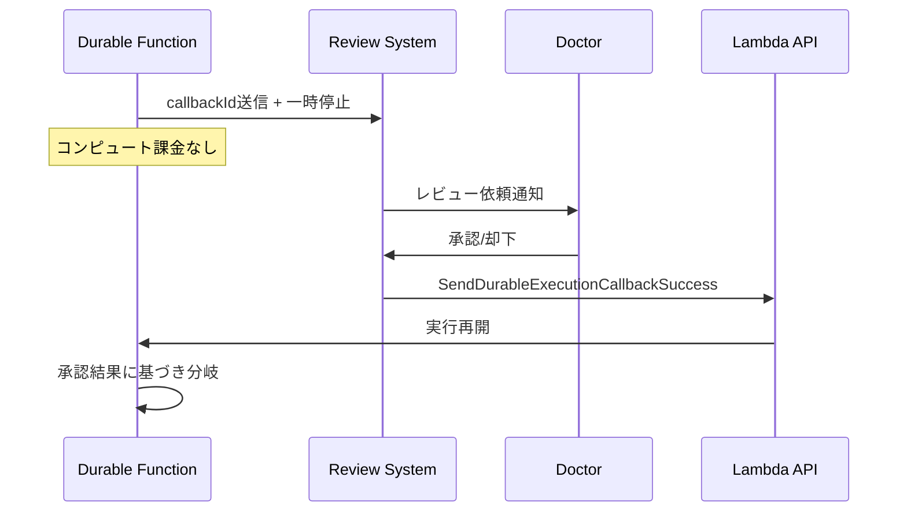

## ブログ概要

AWS Compute Blogの本記事では、Lambda durable functionsを用いて耐障害性を備えたマルチエージェントAIワークフローを構築する手法が解説されている。具体的には、医療事前承認パイプラインを題材に、6段階の逐次処理（臨床データ抽出、医学的必要性評価、保険者基準検証、正当性生成、医師レビュー、保険者提出）をチェックポイント&リプレイ、コールバック、ポーリングの3パターンで障害耐性を持たせる実装が示されている。

**出典**: [Building fault-tolerant multi-agent AI workflows with AWS Lambda durable functions](https://aws.amazon.com/blogs/compute/building-fault-tolerant-multi-agent-ai-workflows-with-aws-lambda-durable-functions/) (2026年6月29日公開、著者: Satish Kamat, Ben Freiberg, Reetesh Surjani)

この記事は [Zenn記事: Bedrock AgentCore x Step Functionsで業務エージェントの耐障害ワークフローを設計する](https://zenn.dev/0h_n0/articles/5165b29d849e3f) の深掘りです。Zenn記事ではStep Functionsのオーケストレーションを軸にAgentCore harnessとの統合を扱っていますが、本記事ではLambda durable functionsによる「関数内オーケストレーション」というもう一つの選択肢を掘り下げます。

## 情報源

- **種別**: 企業テックブログ（AWS Compute Blog）
- **URL**: [https://aws.amazon.com/blogs/compute/building-fault-tolerant-multi-agent-ai-workflows-with-aws-lambda-durable-functions/](https://aws.amazon.com/blogs/compute/building-fault-tolerant-multi-agent-ai-workflows-with-aws-lambda-durable-functions/)
- **組織**: Amazon Web Services / Compute Blog
- **著者**: Satish Kamat, Ben Freiberg, Reetesh Surjani
- **発表日**: 2026年6月29日

## 技術的背景

### マルチエージェントAIワークフローにおける障害の課題

マルチエージェントAIワークフローでは、複数のLLMエージェントが逐次的または並列的に処理を実行する。各エージェントはモデル推論、ツール実行、外部API呼び出しを伴うため、従来のHTTPリクエスト処理とは異なる障害パターンが発生する。

具体的な障害パターンとして、以下が挙げられる。

| 障害パターン | 例 | 従来のWeb処理との違い |
|-------------|---|---------------------|
| 推論ステップの部分障害 | 6段階パイプラインの4段階目で失敗 | 1-3段階目の推論トークンコストが無駄になる |
| 長時間の外部待機 | 人間のレビュー承認に数日かかる | コンピュート課金が継続する |
| 外部システムのポーリング | 保険者の審査結果が非同期で返る | ポーリング間隔の設計が必要 |
| 冪等性の欠如 | リトライ時に重複した保険申請が送信される | 金銭的・法的リスクが発生する |

従来のLambda関数では最大15分のタイムアウト制約があり、人間のレビュー待ちやポーリングを含むワークフローを単一関数内で実現することが困難だった。Step Functionsによるオーケストレーションが一般的な解決策であったが、2025年12月にGAとなったLambda durable functionsにより、コード内にチェックポイントとリプレイの仕組みを直接埋め込む選択肢が加わった。

### Lambda Durable Functionsの位置づけ

Lambda durable functionsは、Azure Durable FunctionsやTemporal、Cadenceといったワークフローエンジンが先行して実装していたdurable executionパターンをAWS Lambda上で実現するものである。AWS公式ドキュメントによると、durable executionは最大1年間実行可能であり、チェックポイントにより進行状況を追跡し、障害時にはリプレイによって完了済みの作業をスキップしつつ自動復旧する。SDKはJavaScript/TypeScript、Python、Javaで利用可能であり、2026年中頃までに約31のAWSリージョンに展開されている。

Step Functionsとの使い分けについて、AWS公式ドキュメントでは以下のように整理されている。durable functionsはLambda内で実行され、標準的なプログラミング言語でワークフローを定義する。一方、Step FunctionsはスタンドアロンサービスとしてグラフベースのDSLまたはビジュアルデザイナーでワークフローを定義する。ビジネスロジックと密結合したワークフローにはdurable functions、220以上のAWSサービスとのネイティブ統合が必要な場合にはStep Functionsが適するとされている。

## 実装アーキテクチャ

ブログでは、耐障害AIワークフローを実現する3つのdurable operationパターンが解説されている。

### パターン1: チェックポイント&リプレイ（context.step）

`context.step()`は個々のエージェント呼び出しをチェックポイントする基本操作である。各ステップの実行結果は永続化され、障害発生時のリプレイではこの保存済み結果が使用される。

```python
@durable_execution
def handler(event: dict, context: DurableContext) -> dict:
    # 各ステップはチェックポイントされる
    clinical_data = context.step(extract_clinical_agent(event["patient_id"]))
    necessity = context.step(medical_necessity_agent(clinical_data))
    criteria = context.step(payer_criteria_agent(event["payer_id"], necessity))
    justification = context.step(justification_agent(
        clinical_data, necessity, criteria))
```

著者らによると、このパターンの要点は「障害発生時にLambdaが関数を再実行し、完了済みのdurable operationをスキップする」ことにある。たとえば4段階目の`justification_agent`が失敗した場合、リプレイでは1-3段階目は再実行されず保存済みの結果が返される。これにより、推論トークンの再消費が回避される。

**決定性の要件**: リプレイ時にはコードが先頭から再実行されるため、durable operation外のコードは決定的（deterministic）でなければならない。乱数生成や現在時刻の取得をstep外で行うと、リプレイ時に異なる値が生成されて不整合が発生する。

### パターン2: コールバック（context.wait_for_callback）

`context.wait_for_callback()`は、外部システムからのシグナルを待って実行を一時停止するパターンである。ブログでは、医師のレビュー承認を待つHuman-in-the-Loopフローが例示されている。

```python
def submit_for_review(cb_id, ctx):
    send_to_review_system(cb_id, justification)

approval = context.wait_for_callback(
    submitter=submit_for_review,
    config=WaitForCallbackConfig(timeout=Duration.from_days(7)),
    name="physician_review",
)

if not approval.get("approved"):
    return {"status": "REJECTED", "reason": approval.get("reason")}
```

このパターンのフローは以下のように動作する。



著者らが強調しているのは、一時停止中にはコンピュート課金が発生しない点である。人間のレビューに数日を要するケースでも、コスト効率を維持できる。外部システムは`SendDurableExecutionCallbackSuccess`または`SendDurableExecutionCallbackFailure` APIを呼び出して実行を再開する。

### パターン3: ポーリング（context.wait_for_condition）

`context.wait_for_condition()`は、外部システムの状態を定期的にチェックし、条件が満たされるまで待機するパターンである。ブログでは保険者の審査結果ポーリングが例示されている。

```python
decision = context.wait_for_condition(
    check=lambda state, ctx: {
        **state,
        "status": get_payer_status(state["submission_id"])
    },
    config=WaitForConditionConfig(
        initial_state={
            "submission_id": submission["id"],
            "status": "PENDING"
        },
        wait_strategy=create_wait_strategy(WaitStrategyConfig(
            should_continue_polling=lambda state: state["status"] == "PENDING",
            max_attempts=48,
            initial_delay=Duration.from_seconds(30),
            max_delay=Duration.from_seconds(300),
            backoff_rate=2.0,
        ))
    ),
    name="payer_adjudication",
)
```

設定可能なパラメータは以下の通りである。

| パラメータ | 説明 | 上記例での値 |
|-----------|------|------------|
| `initial_delay` | 最初のポーリング間隔 | 30秒 |
| `max_delay` | 最大ポーリング間隔 | 300秒（5分） |
| `backoff_rate` | 指数バックオフ倍率 | 2.0 |
| `max_attempts` | 最大ポーリング回数 | 48回 |

コールバックパターンと同様に、ポーリング待機中もコンピュート課金は発生しない。`max_attempts`を超過した場合はタイムアウトエラーが発生し、手動レビューキューや補償処理への遷移が可能となる。

## Production Deployment Guide

### AWS実装パターン（コスト最適化重視）

Lambda durable functionsを使ったマルチエージェントAIワークフローのAWS構成を、トラフィック量別に示す。

**トラフィック量別の推奨構成**:

| 構成 | トラフィック | 主要サービス | 月額概算 |
|------|------------|-------------|---------|
| Small | ~100 req/日 | Lambda (durable) + Bedrock + DynamoDB | $80-200 |
| Medium | ~1,000 req/日 | Lambda (durable) + Bedrock + DynamoDB + SQS | $400-1,200 |
| Large | 10,000+ req/日 | Lambda (durable) + Bedrock (PT) + DynamoDB + SQS + ElastiCache | $3,000-8,000 |

**注意**: 上記コストはAWS ap-northeast-1（東京）リージョンの2026年7月時点の概算値であり、Bedrockモデル使用量（トークン数）により大幅に変動する。最新料金はAWS料金計算ツールで確認を推奨する。

**Small構成の詳細** (~100 req/日):
- Lambda durable function: メモリ512MB、durable execution timeout 24h、関数タイムアウト15分
- Amazon Bedrock: Claude Sonnet系モデル、On-Demand pricing
- DynamoDB: On-Demandモード（ステート管理用）
- CloudWatch: ログ、メトリクス、アラーム
- 月額内訳: Lambda $5-15 + Bedrock $50-150（トークン依存）+ DynamoDB $5-10 + CloudWatch $10-20

**Medium構成の追加要素** (~1,000 req/日):
- SQS: DLQとして障害メッセージのトリアージに使用
- EventBridge: durable execution状態変更イベントの通知
- SNS: 補償処理実行時のアラート通知
- Bedrock Provisioned Throughput: スロットリング回避のために検討

**Large構成の追加要素** (10,000+ req/日):
- Bedrock Provisioned Throughput: スロットリング回避に必須
- ElastiCache (Redis): セッション情報のキャッシュ、冪等性キーの管理
- X-Ray: 分散トレーシングによるエージェント推論のボトルネック特定
- Cost Anomaly Detection: トークン使用量の異常検知

**コスト削減テクニック**:
- Bedrock Batch APIを非リアルタイム処理に使用することで50%削減
- Prompt Cachingにより繰り返しのシステムプロンプト課金を30-90%削減
- durable functionの待機中はコンピュート課金なし（コールバック/ポーリングパターンの活用）
- `MaxIterations`をユースケースごとに最適化し、不要なツール実行ループを削減

### Terraformインフラコード

**Small構成（Serverless）**:

```hcl
# Lambda Durable Function + Bedrock + DynamoDB 構成
# 前提: terraform >= 1.9, aws provider >= 5.60

terraform {
  required_version = ">= 1.9"
  required_providers {
    aws = {
      source  = "hashicorp/aws"
      version = ">= 5.60"
    }
  }
}

provider "aws" {
  region = "ap-northeast-1"
}

# --- IAM Role for Lambda Durable Function ---
resource "aws_iam_role" "durable_fn_role" {
  name = "multi-agent-durable-fn-role"
  assume_role_policy = jsonencode({
    Version = "2012-10-17"
    Statement = [{
      Action = "sts:AssumeRole"
      Effect = "Allow"
      Principal = { Service = "lambda.amazonaws.com" }
    }]
  })
}

resource "aws_iam_role_policy" "durable_fn_policy" {
  name = "multi-agent-durable-fn-policy"
  role = aws_iam_role.durable_fn_role.id
  policy = jsonencode({
    Version = "2012-10-17"
    Statement = [
      {
        # Bedrock InvokeModel (最小権限: 使用モデルのみ)
        Effect   = "Allow"
        Action   = ["bedrock:InvokeModel", "bedrock:InvokeModelWithResponseStream"]
        Resource = "arn:aws:bedrock:ap-northeast-1::foundation-model/anthropic.claude-sonnet-*"
      },
      {
        # DynamoDB (ステート管理テーブルのみ)
        Effect = "Allow"
        Action = [
          "dynamodb:GetItem", "dynamodb:PutItem",
          "dynamodb:UpdateItem", "dynamodb:DeleteItem", "dynamodb:Query"
        ]
        Resource = aws_dynamodb_table.agent_state.arn
      },
      {
        # CloudWatch Logs
        Effect   = "Allow"
        Action   = ["logs:CreateLogGroup", "logs:CreateLogStream", "logs:PutLogEvents"]
        Resource = "arn:aws:logs:ap-northeast-1:*:*"
      },
      {
        # Durable Execution callback API
        Effect   = "Allow"
        Action   = ["lambda:SendDurableExecutionCallbackSuccess", "lambda:SendDurableExecutionCallbackFailure"]
        Resource = "*"
      }
    ]
  })
}

# --- Lambda Durable Function ---
resource "aws_lambda_function" "multi_agent_workflow" {
  function_name = "multi-agent-durable-workflow"
  role          = aws_iam_role.durable_fn_role.arn
  runtime       = "python3.13"
  handler       = "handler.handler"
  filename      = "lambda.zip"
  timeout       = 900  # 15分 (Lambda関数タイムアウト)
  memory_size   = 512

  environment {
    variables = {
      DYNAMODB_TABLE = aws_dynamodb_table.agent_state.name
      MODEL_ID       = "anthropic.claude-sonnet-4-20250514"
      LOG_LEVEL      = "INFO"
    }
  }

  tracing_config {
    mode = "Active"  # X-Ray有効化
  }
}

# Durable execution設定 (execution timeout は別途AWS CLIで設定)
# aws lambda update-function-configuration \
#   --function-name multi-agent-durable-workflow \
#   --durable-config '{"ExecutionTimeout": 86400, "RetentionPeriodInDays": 14}'

# --- DynamoDB (ステート管理) ---
resource "aws_dynamodb_table" "agent_state" {
  name         = "multi-agent-state"
  billing_mode = "PAY_PER_REQUEST"  # On-Demand (コスト最適化)
  hash_key     = "execution_id"
  range_key    = "step_name"

  attribute {
    name = "execution_id"
    type = "S"
  }
  attribute {
    name = "step_name"
    type = "S"
  }

  ttl {
    attribute_name = "ttl"
    enabled        = true
  }

  server_side_encryption {
    enabled = true  # KMS暗号化
  }
}

# --- SQS Dead Letter Queue ---
resource "aws_sqs_queue" "agent_dlq" {
  name                       = "multi-agent-dlq"
  message_retention_seconds  = 1209600  # 14日
  sqs_managed_sse_enabled    = true
}

# --- CloudWatch Alarm (障害検知) ---
resource "aws_cloudwatch_metric_alarm" "durable_execution_failed" {
  alarm_name          = "multi-agent-durable-execution-failed"
  comparison_operator = "GreaterThanOrEqualToThreshold"
  evaluation_periods  = 1
  metric_name         = "DurableExecutionFailed"
  namespace           = "AWS/Lambda"
  period              = 300
  statistic           = "Sum"
  threshold           = 3
  alarm_description   = "Durable execution failure count >= 3 in 5 minutes"

  dimensions = {
    FunctionName = aws_lambda_function.multi_agent_workflow.function_name
  }
}
```

**Large構成（高スループット対応）の追加要素**:

```hcl
# --- ElastiCache (冪等性キー管理) ---
resource "aws_elasticache_cluster" "idempotency_cache" {
  cluster_id           = "agent-idempotency"
  engine               = "redis"
  node_type            = "cache.t4g.micro"  # コスト最適化
  num_cache_nodes      = 1
  parameter_group_name = "default.redis7"
  port                 = 6379
  security_group_ids   = [aws_security_group.cache_sg.id]
}

# --- AWS Budgets (コストアラート) ---
resource "aws_budgets_budget" "agent_monthly" {
  name         = "multi-agent-monthly-budget"
  budget_type  = "COST"
  limit_amount = "5000"
  limit_unit   = "USD"
  time_unit    = "MONTHLY"

  notification {
    comparison_operator       = "GREATER_THAN"
    threshold                 = 80
    threshold_type            = "PERCENTAGE"
    notification_type         = "ACTUAL"
    subscriber_email_addresses = ["ops-team@example.com"]
  }
}
```

### 運用・監視設定

**CloudWatch Logs Insightsクエリ（Durable Execution分析）**:

```
# Durable execution の実行時間分布（P50/P95/P99）
fields @timestamp, @duration
| filter @message like /DurableExecution/
| stats avg(@duration) as avg_ms,
        pct(@duration, 50) as p50_ms,
        pct(@duration, 95) as p95_ms,
        pct(@duration, 99) as p99_ms
  by bin(1h)

# 失敗ステップの頻度分析
fields @timestamp, step_name, error_type
| filter level = "ERROR" and @message like /step.*failed/
| stats count(*) as failure_count by step_name, error_type
| sort failure_count desc
```

**CloudWatchアラーム設定（Python boto3）**:

```python
import boto3

cloudwatch = boto3.client("cloudwatch")

def create_durable_execution_alarms(function_name: str, sns_topic_arn: str) -> None:
    """Durable execution向けCloudWatchアラームを作成する。

    Args:
        function_name: Lambda関数名
        sns_topic_arn: アラート通知先SNSトピックARN
    """
    # Durable execution失敗アラーム
    cloudwatch.put_metric_alarm(
        AlarmName=f"{function_name}-durable-execution-failed",
        MetricName="DurableExecutionFailed",
        Namespace="AWS/Lambda",
        Statistic="Sum",
        Period=300,
        EvaluationPeriods=1,
        Threshold=3,
        ComparisonOperator="GreaterThanOrEqualToThreshold",
        Dimensions=[{"Name": "FunctionName", "Value": function_name}],
        AlarmActions=[sns_topic_arn],
    )

    # Durable execution duration異常検知
    cloudwatch.put_metric_alarm(
        AlarmName=f"{function_name}-durable-execution-duration",
        MetricName="DurableExecutionDuration",
        Namespace="AWS/Lambda",
        Statistic="p99",
        Period=300,
        EvaluationPeriods=2,
        Threshold=600000,  # 10分 (ミリ秒)
        ComparisonOperator="GreaterThanThreshold",
        Dimensions=[{"Name": "FunctionName", "Value": function_name}],
        AlarmActions=[sns_topic_arn],
    )
```

**EventBridge連携（Durable Execution状態変更）**:

ブログで言及されているように、durable executionの状態変更（`RUNNING`, `SUCCEEDED`, `FAILED`, `TIMED_OUT`）はEventBridgeイベントとして発行される。これを活用して下流ワークフローの起動やSlack通知を実装できる。

```python
import boto3

events = boto3.client("events")

def create_durable_execution_event_rule(function_name: str, target_arn: str) -> None:
    """Durable execution状態変更のEventBridgeルールを作成する。

    Args:
        function_name: 監視対象のLambda関数名
        target_arn: イベント送信先のARN (Lambda/SNS/SQS等)
    """
    events.put_rule(
        Name=f"{function_name}-durable-state-change",
        EventPattern="""{
            "source": ["aws.lambda"],
            "detail-type": ["Lambda Durable Execution State Change"],
            "detail": {
                "functionName": ["%s"],
                "status": ["FAILED", "TIMED_OUT"]
            }
        }""" % function_name,
        State="ENABLED",
    )
```

**X-Rayトレーシング設定**:

ブログではAWS X-Rayによる分散トレーシングが推奨されている。durable execution全体を一つのトレースとして可視化し、どのエージェントステップがボトルネックかを特定できる。

```python
from aws_xray_sdk.core import xray_recorder, patch_all

# boto3の自動計装
patch_all()

@xray_recorder.capture("agent_step")
def invoke_agent_with_tracing(agent_name: str, payload: dict) -> dict:
    """X-Rayアノテーション付きでエージェントを呼び出す。

    Args:
        agent_name: エージェント名
        payload: エージェントへの入力

    Returns:
        エージェントの実行結果
    """
    subsegment = xray_recorder.current_subsegment()
    subsegment.put_annotation("agent_name", agent_name)
    subsegment.put_metadata("input_tokens", len(str(payload)))

    result = call_bedrock_agent(agent_name, payload)

    subsegment.put_metadata("output_tokens", result.get("token_count", 0))
    return result
```

### コスト最適化チェックリスト

**アーキテクチャ選択**:
- [ ] トラフィック量に応じた構成を選択（Small/Medium/Large）
- [ ] Lambda durable functionsとStep Functionsの使い分けを検討（ビジネスロジック密結合ならdurable functions、サービス間連携ならStep Functions）
- [ ] Standard Workflowの必要性を確認（durable functionsは最大1年実行可能、Express Workflowの5分制約なし）

**リソース最適化**:
- [ ] Lambda関数メモリサイズを最適化（512MB-1024MBが推論呼び出しに適切）
- [ ] `MaxIterations`をユースケースごとに設定（デフォルト75は過剰な場合が多い）
- [ ] durable execution timeoutを業務要件に合わせて設定（デフォルト24h）
- [ ] DynamoDB On-Demandモードでアイドル時のコストを最小化
- [ ] CloudWatch Logsの保持期間を適切に設定（14日-30日）

**LLMコスト削減**:
- [ ] Bedrock Batch APIを非リアルタイム処理に使用（50%削減）
- [ ] Prompt Cachingを有効化（繰り返しのシステムプロンプトで30-90%削減）
- [ ] 選択的リプレイによるトークン再消費の回避（durable functionsの標準機能）
- [ ] モデル選択ロジック（軽量タスクにはHaiku、複雑なタスクにはSonnet/Opus）
- [ ] 入力トークン数の制限（不要なコンテキストの除去）

**監視・アラート**:
- [ ] AWS Budgets設定（月額予算アラート: 80%/100%閾値）
- [ ] CloudWatchアラーム（DurableExecutionFailed, DurableExecutionDuration）
- [ ] Cost Anomaly Detection有効化（トークン使用量の急増検知）
- [ ] EventBridgeルール（FAILED/TIMED_OUT状態の即時通知）
- [ ] 日次コストレポート（Bedrock/Lambda別のコスト内訳）

**リソース管理**:
- [ ] DynamoDB TTLによる古いステートデータの自動削除
- [ ] durable execution retention periodを適切に設定（デフォルト14日、最大90日）
- [ ] SQS DLQのメッセージ保持期間を設定（14日推奨）
- [ ] 開発環境のdurable execution timeoutを短縮（テスト効率化）
- [ ] タグ戦略によるコスト配分（Environment, Team, Workflowタグ）

## パフォーマンス最適化

### 選択的リプレイによるトークンコスト削減

Lambda durable functionsの最大の利点の一つが、選択的リプレイによるトークンコストの削減である。ブログでは以下のように説明されている。

6段階のエージェントパイプラインで4段階目が失敗した場合を考える。

| ステップ | リプレイなし（全再実行） | 選択的リプレイ |
|---------|----------------------|-------------|
| Agent 1: 臨床データ抽出 | 再実行（トークン消費） | スキップ（保存結果を使用） |
| Agent 2: 医学的必要性評価 | 再実行（トークン消費） | スキップ（保存結果を使用） |
| Agent 3: 保険者基準検証 | 再実行（トークン消費） | スキップ（保存結果を使用） |
| Agent 4: 正当性生成 | 再実行（トークン消費） | 再実行（トークン消費） |

著者らによると、この仕組みにより「時間、コスト、トークン消費」の3つを同時に節約できる。たとえば各エージェントが平均2,000入力トークン + 500出力トークンを消費する場合、全再実行では合計10,000トークンを再消費するが、選択的リプレイでは失敗した4段階目の2,500トークンのみで済む。

### リプレイ対応のロギング

ブログでは、SDKの`context.logger`がリプレイ中の重複ログ出力を自動的に抑制することが言及されている。通常の`print()`や`logging.info()`を使用すると、リプレイの度にログが重複出力され、CloudWatch Logsのコストが不必要に増加する。durable function内のロギングには必ず`context.logger`を使用すべきである。

### CloudWatchメトリクスによるパフォーマンス監視

ブログでは以下のCloudWatchメトリクスが紹介されている。

- `ApproximateRunningDurableExecutions`: 現在実行中のdurable execution数
- `DurableExecutionDuration`: durable executionの完了までの時間
- `DurableExecutionFailed`: 失敗したdurable executionの数

これらのメトリクスを組み合わせることで、エージェントパイプラインのボトルネック特定やキャパシティプランニングが可能となる。

## 運用での学び

### 冪等性設計（clientRequestToken）

マルチエージェントワークフローでは、リトライ時に同一操作が重複実行されるリスクがある。ブログでは`clientRequestToken`による冪等性保証パターンが紹介されている。

```python
@durable_step
def make_idempotency_key(ctx: StepContext) -> str:
    return str(uuid.uuid4())

idempotency_key = context.step(make_idempotency_key(), name="idempotency-key")
submission = context.step(submit_authorization(justification, idempotency_key))
```

ここで重要なのは、冪等性キーの生成自体をdurable stepとしてチェックポイントしている点である。これにより、リプレイ時にも同一のキーが使用され、外部APIへの重複リクエストが防止される。`uuid.uuid4()`をstep外で呼び出すと、リプレイの度に異なるキーが生成され、冪等性が破壊される。

### エラーハンドリングの3パターン

ブログでは、障害の種類に応じた3つのハンドリングパターンが示されている。

**1. エージェントステップ障害**: チェックポイント済みステップをスキップしてリトライする。完了済みのエージェント呼び出しは再実行されないため、トークンコストと時間の両方を節約できる。

**2. 拒否（Rejection）**: コールバックが`approved: false`を返した場合、ワークフローはREJECTED状態となり、後続の処理（保険者への提出等）をスキップする。これはビジネスロジックとしての正常な分岐であり、エラーではない。

**3. タイムアウト**: `waitForCondition()`で設定した`max_attempts`を超過した場合にタイムアウトエラーが発生する。著者らによると、タイムアウト後は手動レビューキューへの遷移や補償処理の実行が適切とされている。

### Saga補償パターンとの統合

ブログではSaga-style compensationsへの対応が言及されている。Zenn記事で詳述されているStep FunctionsのCatch/Parallel構成によるSagaパターンと比較すると、Lambda durable functions内でのSaga実装はコードベースで制御できるため、補償ロジックの条件分岐がプログラム言語の表現力をそのまま活用できる利点がある。一方で、Step FunctionsのASL定義のように宣言的な可視化は難しくなるトレードオフがある。

## 学術研究との関連

Lambda durable functionsが実装しているチェックポイント&リプレイのパターンは、分散システムにおけるdurable execution（永続実行）の系譜に位置づけられる。Garcia-MolinaとSalemが1987年にACM SIGMOD Recordで発表した論文「Sagas」では、長時間トランザクションを小さなサブトランザクションの列と補償トランザクションの組み合わせで管理するモデルが提案された。ブログで言及されているSaga-style compensationsは、この1987年の理論的基盤を現代のサーバーレスAIワークフローに適用したものと位置づけられる。

また、Temporalが実装しているdeterministic replayパターン（ワークフローの履歴をログに記録し、障害後に決定的に再実行する）は、Lambda durable functionsのチェックポイント&リプレイ機構と同じ理論的基盤を共有している。Lambda durable functionsはこのパターンをAWSのサーバーレスインフラ上でマネージドサービスとして提供することで、運用負荷を軽減している点が実務上の差異となる。

## まとめと実践への示唆

Lambda durable functionsは、マルチエージェントAIワークフローに対して「関数内オーケストレーション」という選択肢を提供する。本ブログから得られる主要な知見を整理する。

- チェックポイント&リプレイによる選択的再実行で、障害時のトークンコストを大幅に削減できる。完了済みエージェントの再実行をスキップすることで、リトライコストは失敗ステップ分のみに限定される
- コールバック/ポーリングパターンでの待機中にはコンピュート課金が発生しないため、Human-in-the-Loopや外部システム連携を含む長時間ワークフローでもコスト効率を維持できる
- 冪等性キーの生成をdurable stepとしてチェックポイントすることで、リトライ時の重複操作を防止する設計が示されている

Zenn記事で扱ったStep Functions + AgentCoreのアプローチが「サービス間オーケストレーション」に適するのに対し、Lambda durable functionsはビジネスロジックと密結合した逐次パイプラインに適している。両者は排他的ではなく、大規模ワークフロー全体のオーケストレーションにはStep Functions、個々のエージェントパイプライン内の障害制御と状態管理にはdurable functionsを適用する、という組み合わせが実践的な指針となる。

## 参考文献

- **Blog URL**: [Building fault-tolerant multi-agent AI workflows with AWS Lambda durable functions](https://aws.amazon.com/blogs/compute/building-fault-tolerant-multi-agent-ai-workflows-with-aws-lambda-durable-functions/)
- **AWS Documentation**: [Lambda durable functions](https://docs.aws.amazon.com/lambda/latest/dg/durable-functions.html)
- **AWS Documentation**: [Basic concepts - Durable Execution SDK](https://docs.aws.amazon.com/lambda/latest/dg/durable-basic-concepts.html)
- **Saga Pattern (original)**: Garcia-Molina, H. and Salem, K. "Sagas." ACM SIGMOD Record, 16(3), 249-259, 1987.
- **Related Zenn article**: [Bedrock AgentCore x Step Functionsで業務エージェントの耐障害ワークフローを設計する](https://zenn.dev/0h_n0/articles/5165b29d849e3f)
