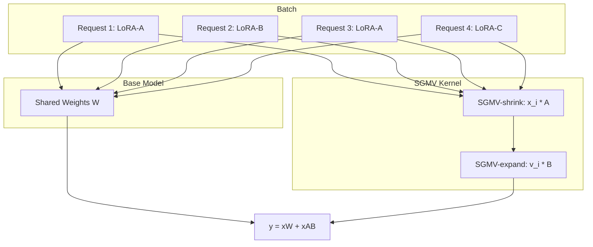

本記事は [Punica: Multi-Tenant LoRA Serving](https://arxiv.org/abs/2310.18547) の解説記事です。

## 論文概要（Abstract）

Punica は、共有GPUクラスタ上で複数の異なるLoRA（Low-Rank Adaptation）モデルを同時にサービングするためのシステムである。著者らが提案する SGMV（Segmented Gather Matrix-Vector Multiplication）カーネルにより、異なるLoRAモデルへのリクエストをバッチ化してGPU上で並列実行できる。これにより、GPUは事前学習済みモデルの重みを1コピーのみ保持しながら複数のLoRAモデルを提供でき、メモリと計算の両面でGPU効率を向上させる。著者らは、既存のLLMサービングシステムと比較して12倍のスループットを達成しつつ、トークンあたりの追加レイテンシはわずか2msであると報告している。

この記事は [Zenn記事: vLLM Multi-LoRAで複数タスク特化モデルを1台のGPUに集約するルーティング設計](https://zenn.dev/0h_n0/articles/a21229e9c893f0) の深掘りです。

## 情報源

- **arXiv ID**: 2310.18547
- **URL**: [https://arxiv.org/abs/2310.18547](https://arxiv.org/abs/2310.18547)
- **著者**: Lequn Chen, Zihao Ye, Yongji Wu, Danyang Zhuo, Luis Ceze, Arvind Krishnamurthy
- **所属**: University of Washington, Duke University
- **発表**: MLSys 2024（Proceedings of Machine Learning and Systems, Vol. 6, pp. 1-13）
- **分野**: cs.DC, cs.LG
- **実装**: [https://github.com/punica-ai/punica](https://github.com/punica-ai/punica)（Python 58.5%, CUDA 24.8%, C++ 14.7%）

## 背景と動機（Background & Motivation）

LoRA（Low-Rank Adaptation）は、大規模言語モデル（LLM）を特定ドメインに適応させる手法として広く普及している。LoRAはベースモデルの重みを凍結し、低ランク行列のペア $A \in \mathbb{R}^{h_1 \times r}$, $B \in \mathbb{R}^{r \times h_2}$ のみをファインチューニングする。ランク $r$ は通常16程度であり、追加パラメータはベースモデルの0.1%-1%に過ぎない。

実運用では、異なるテナント（顧客・タスク）ごとに個別のLoRAアダプタを作成し、1つのGPUクラスタで複数のLoRAモデルを同時にサービングする需要がある。しかし従来のサービングシステムでは、以下の課題が存在した。

| 課題 | 詳細 |
|------|------|
| **メモリ非効率** | モデルごとにベースモデルの重みをGPU上に複製する必要があり、GPU容量を浪費 |
| **バッチ化の困難** | 異なるLoRAモデルへのリクエストを同一バッチで処理できず、GPU利用率が低下 |
| **コールドスタート** | 新しいLoRAモデルのロードに秒単位の時間がかかり、レイテンシが増大 |

Punica はこれらの課題を、SGMVカーネルの設計と動的スケジューリングにより解決する。

## 主要な貢献（Key Contributions）

- **SGMVカーネル**: 異なるLoRAモデルへのリクエストを単一のGPUカーネル呼び出しでバッチ処理するCUDAカーネルを設計。Tensor Coresを活用し、バッチサイズに応じてスループットをスケールさせる
- **ベースモデル共有アーキテクチャ**: GPU上に事前学習済みモデルの重みを1コピーのみ保持し、LoRAアダプタを動的にロード・アンロードする仕組みを実現。LoRAモデルのロード時間はわずか約2msである
- **マルチGPUスケジューラ**: リクエストのルーティングとマイグレーションを行うクラスタレベルのスケジューラを設計。ワーキングセットの大きいGPUへリクエストを集約し、GPU利用率を最大化する

## 技術的詳細（Technical Details）

### LoRAの数学的定式化

LoRAファインチューニングでは、事前学習済みモデルの重み行列 $W \in \mathbb{R}^{h_1 \times h_2}$ に対して、低ランク行列 $A \in \mathbb{R}^{h_1 \times r}$, $B \in \mathbb{R}^{r \times h_2}$ を学習する。推論時の出力は以下のように計算される。

$$
y = x(W + AB) = xW + xAB
$$

ここで、
- $x \in \mathbb{R}^{1 \times h_1}$: 入力特徴ベクトル
- $W$: 凍結されたベースモデルの重み
- $A$, $B$: LoRAアダプタの低ランク行列
- $r$: LoRAランク（典型的には $r = 16$、$h_1 = h_2 = 4096$ に対して非常に小さい）

重要な点は、$xW$ の計算はすべてのLoRAモデルで共通であり、$xAB$ のみがモデルごとに異なることである。Punicaはこの分離を活用し、$xW$ は通常のバッチ行列積で計算し、$xAB$ の部分をSGMVカーネルで効率的にバッチ処理する。

### SGMVカーネルの設計

SGMVは、バッチ内の各リクエストが異なるLoRAモデルに対応する場合でも、単一のカーネル呼び出しで全リクエストのLoRA演算を実行するCUDAカーネルである。

バッチ内に $n$ 個のリクエストがあり、各リクエスト $i$ がLoRAモデル $\ell_i$ に対応するとする。SGMVは以下を計算する。

$$
y_i = x_i A_{\ell_i} B_{\ell_i}, \quad i = 1, \ldots, n
$$

この計算は2つのステージに分解される。

**ステージ1: SGMV-shrink（次元削減）**

$$
\bar{v}_i = x_i A_{\ell_i}, \quad \bar{v}_i \in \mathbb{R}^{1 \times r}
$$

高次元の入力 $x_i \in \mathbb{R}^{1 \times h_1}$ を低ランク空間 $\mathbb{R}^r$ に射影する。入力次元 $h_1$ が大きいため、Split-K戦略を採用し、入力特徴次元をスレッドブロック間で分割する。各スレッドブロックが部分和を計算し、グリッド同期による cross-threadblock reduction で最終結果を得る。

**ステージ2: SGMV-expand（次元拡張）**

$$
y_i = \bar{v}_i B_{\ell_i}, \quad y_i \in \mathbb{R}^{1 \times h_2}
$$

低ランクベクトル $\bar{v}_i$ を出力次元 $h_2$ に拡張する。出力次元で分割し、異なるスレッドブロックに割り当てる。



### Operational Intensity の最適化

SGMVカーネルの設計で重要なのは、同一LoRAモデルへのリクエストをグループ化することでTensor Coresの利用効率を高める点である。同一モデルへのリクエストが $k$ 個ある場合、行列-ベクトル積（MV）を行列-行列積（MM）に変換でき、operational intensity が向上する。

著者らの Roofline 分析（論文 Figure 7）によると、同一モデルのリクエストが増えるほどTensor Cores の計算バウンドに近づき、GPUの演算能力を十分に活用できると報告されている。

### スケジューリングアルゴリズム

Punica のスケジューラは、マルチGPUクラスタ全体でリクエストを効率的にルーティングする。

**新規リクエストのルーティング**:

1. 現在のワーキングセット（バッチサイズ）が最大のGPUを選択
2. 制約条件: (a) 最大バッチサイズ（32）に達していない、(b) KvCacheメモリが十分にある
3. 複数候補がある場合、最大GPU UUIDを選択（決定論的動作のため）
4. すべてのGPUが満杯の場合、キューイング（FCFS）

**リクエストマイグレーション**:

スケジューラは定期的にリクエストをGPU間で移動し、ワークロードを集約する。マイグレーションは以下の手順で行われる。

1. ソースGPUでリクエストをキャンセル（KvCacheを解放）
2. デスティネーションGPUでリクエストを再追加（元のプロンプト＋生成済みトークンでprefillを再計算）

著者らはKvCacheの転送ではなく再計算を選択しており、その理由として実装の簡潔さを挙げている。

### LoRAアダプタの動的ロード

LoRAアダプタのGPUメモリへのロードは、非同期のPCIe host-to-device メモリコピーで行われる。

- **レイヤー単位のロード時間**: 約50マイクロ秒/レイヤー
- **モデル全体のロード時間**: 約2ミリ秒

GPUが他のバッチを処理している間にバックグラウンドで非同期コピーが進行するため、実質的なコールドスタートペナルティはほぼ無視できる。

## 実装のポイント（Implementation Guide）

### SGMVカーネルの概念的な実装

以下は、SGMVカーネルの概念を示すPyTorch擬似コードである。実際のCUDA実装ではTensor Coresを使用した最適化が施されている。

```python
from typing import Optional
import torch


def sgmv_shrink(
    inputs: torch.Tensor,
    lora_a_weights: dict[int, torch.Tensor],
    request_to_lora: list[int],
    lora_rank: int = 16,
) -> torch.Tensor:
    """SGMV-shrink: 高次元入力を低ランク空間に射影する。

    Args:
        inputs: 入力テンソル (batch_size, hidden_dim)
        lora_a_weights: LoRAモデルID -> A行列 (hidden_dim, rank) のマッピング
        request_to_lora: 各リクエストが対応するLoRAモデルID
        lora_rank: LoRAランク

    Returns:
        低ランク射影結果 (batch_size, rank)
    """
    batch_size = inputs.shape[0]
    output = torch.zeros(batch_size, lora_rank, device=inputs.device)

    # 同一LoRAモデルのリクエストをグループ化してバッチ行列積に変換
    lora_groups: dict[int, list[int]] = {}
    for idx, lora_id in enumerate(request_to_lora):
        lora_groups.setdefault(lora_id, []).append(idx)

    for lora_id, indices in lora_groups.items():
        batch_indices = torch.tensor(indices, device=inputs.device)
        grouped_input = inputs[batch_indices]  # (group_size, hidden_dim)
        a_weight = lora_a_weights[lora_id]     # (hidden_dim, rank)
        output[batch_indices] = grouped_input @ a_weight

    return output


def sgmv_expand(
    low_rank_inputs: torch.Tensor,
    lora_b_weights: dict[int, torch.Tensor],
    request_to_lora: list[int],
    output_dim: int,
) -> torch.Tensor:
    """SGMV-expand: 低ランクベクトルを出力次元に拡張する。

    Args:
        low_rank_inputs: 低ランク入力 (batch_size, rank)
        lora_b_weights: LoRAモデルID -> B行列 (rank, output_dim) のマッピング
        request_to_lora: 各リクエストが対応するLoRAモデルID
        output_dim: 出力次元

    Returns:
        拡張された出力 (batch_size, output_dim)
    """
    batch_size = low_rank_inputs.shape[0]
    output = torch.zeros(batch_size, output_dim, device=low_rank_inputs.device)

    lora_groups: dict[int, list[int]] = {}
    for idx, lora_id in enumerate(request_to_lora):
        lora_groups.setdefault(lora_id, []).append(idx)

    for lora_id, indices in lora_groups.items():
        batch_indices = torch.tensor(indices, device=low_rank_inputs.device)
        grouped_input = low_rank_inputs[batch_indices]
        b_weight = lora_b_weights[lora_id]
        output[batch_indices] = grouped_input @ b_weight

    return output
```

### メモリ管理のポイント

Multi-Tenant LoRAサービングでは、以下のメモリ管理が重要である。

1. **ベースモデルの重みは1コピーのみ**: Llama-2 7Bの場合、FP16で約14GBのGPUメモリを占有する。これを複数コピー持つと、A100 80GBでも数モデルしかサーブできない
2. **LoRAアダプタの動的管理**: ランク16のLoRAアダプタはベースモデルの0.1%程度（数十MB）であり、オンデマンドでGPUメモリにロード/アンロード可能
3. **KvCacheの効率的管理**: vLLMのPagedAttentionと同様に、KvCacheをページ単位で管理し、フラグメンテーションを抑制する

## Production Deployment Guide

### AWS実装パターン（コスト最適化重視）

以下は2026年7月時点のAWS ap-northeast-1リージョン料金に基づく概算値です。実際のコストはトラフィックパターン、リージョン、バースト使用量により変動します。最新料金はAWS料金計算ツールで確認を推奨します。

Punica/vLLM Multi-LoRAサービングをAWS上で構築する場合のトラフィック量別推奨構成は以下の通りである。

| 規模 | 月間リクエスト | 推奨構成 | 月額コスト |
|------|--------------|---------|-----------|
| **Small** | ~3,000 | SageMaker Serverless + 単一LoRA | $50-150 |
| **Medium** | ~30,000 | ECS Fargate (GPU) + vLLM Multi-LoRA | $300-800 |
| **Large** | 300,000+ | EKS + GPU Spot Instances + vLLM Multi-LoRA | $2,000-5,000 |

**Small構成**: SageMaker Serverless Inferenceで単一のLoRAモデルをサーブする。リクエスト頻度が低いため、Multi-Tenantの恩恵は限定的。SageMaker Serverless は推論リクエストがない間はコストが発生しないため、バースト的なワークロードに適している。

**Medium構成**: ECS Fargate上でvLLM Multi-LoRAコンテナを稼働させる。g5.xlarge（NVIDIA A10G 24GB）インスタンスで7Bクラスのモデルに対して4-8個のLoRAアダプタを同時サーブ可能。Fargateのスケーリングポリシーでリクエスト量に応じた自動スケーリングを実現する。月額内訳: g5.xlarge On-Demand $320/月 + ECS管理費 $30/月 + データ転送 $20-50/月。

**Large構成**: EKS上でKarpenter + GPU Spot Instancesを活用する。g5.2xlarge以上のインスタンスでTensor Parallelism対応の大規模モデル（13B-70B）をサーブ。Spot Instancesにより最大70%のコスト削減が見込める。月額内訳: g5.2xlarge Spot $600-900/月 x 2-4台 + EKS管理費 $73/月 + ALB $30/月 + データ転送 $100-200/月。

**コスト削減テクニック**:
- GPU Spot Instancesで最大70%削減（g5系はSpot中断率が低い）
- Reserved Instances（1年コミット）で最大40%削減
- vLLMのContinuous Batchingでスループットを最大化し、必要GPU台数を削減
- LoRAアダプタの共有ベースモデル設計により、モデルあたりのGPUメモリを90%以上削減

### Terraformインフラコード

**Small構成（SageMaker Serverless）**:

```hcl
# SageMaker Serverless推論エンドポイント（Multi-LoRA Small構成）
resource "aws_iam_role" "sagemaker_execution" {
  name = "punica-sagemaker-execution-role"

  assume_role_policy = jsonencode({
    Version = "2012-10-17"
    Statement = [{
      Action = "sts:AssumeRole"
      Effect = "Allow"
      Principal = { Service = "sagemaker.amazonaws.com" }
    }]
  })
}

resource "aws_iam_role_policy_attachment" "sagemaker_full" {
  role       = aws_iam_role.sagemaker_execution.name
  policy_arn = "arn:aws:iam::aws:policy/AmazonSageMakerFullAccess"
}

resource "aws_sagemaker_model" "vllm_lora" {
  name               = "vllm-multi-lora"
  execution_role_arn = aws_iam_role.sagemaker_execution.arn

  primary_container {
    # vLLM公式コンテナイメージ
    image          = "763104351884.dkr.ecr.ap-northeast-1.amazonaws.com/pytorch-inference:2.3.0-gpu-py311-cu121-ubuntu22.04-sagemaker"
    model_data_url = "s3://${aws_s3_bucket.model_artifacts.id}/vllm-lora-model.tar.gz"
    environment = {
      VLLM_MODEL_NAME     = "meta-llama/Llama-2-7b-hf"
      VLLM_ENABLE_LORA    = "true"
      VLLM_MAX_LORA_RANK  = "16"
    }
  }
}

resource "aws_sagemaker_endpoint_configuration" "serverless" {
  name = "vllm-lora-serverless"

  production_variants {
    variant_name           = "primary"
    model_name             = aws_sagemaker_model.vllm_lora.name
    serverless_config {
      memory_size_in_mb = 6144   # 6GB
      max_concurrency   = 5
    }
  }
}

# CloudWatchアラーム（コスト監視）
resource "aws_cloudwatch_metric_alarm" "invocation_cost" {
  alarm_name          = "punica-high-invocation-count"
  comparison_operator = "GreaterThanThreshold"
  evaluation_periods  = 1
  metric_name         = "Invocations"
  namespace           = "AWS/SageMaker"
  period              = 3600
  statistic           = "Sum"
  threshold           = 500
  alarm_actions       = [aws_sns_topic.alerts.arn]
  dimensions = {
    EndpointName = aws_sagemaker_endpoint.serverless.name
  }
}
```

**Large構成（EKS + Karpenter + GPU Spot）**:

```hcl
# EKSクラスタ（Multi-LoRA Large構成）
module "eks" {
  source  = "terraform-aws-modules/eks/aws"
  version = "~> 20.0"

  cluster_name    = "punica-multi-lora"
  cluster_version = "1.31"

  vpc_id     = module.vpc.vpc_id
  subnet_ids = module.vpc.private_subnets

  # Karpenterノード用IAMロール
  enable_cluster_creator_admin_permissions = true
}

# Karpenter Provisioner（Spot優先・GPU対応）
resource "kubectl_manifest" "karpenter_nodepool" {
  yaml_body = yamlencode({
    apiVersion = "karpenter.sh/v1"
    kind       = "NodePool"
    metadata   = { name = "gpu-lora-serving" }
    spec = {
      template = {
        spec = {
          requirements = [
            { key = "karpenter.sh/capacity-type", operator = "In", values = ["spot", "on-demand"] },
            { key = "node.kubernetes.io/instance-type", operator = "In",
              values = ["g5.xlarge", "g5.2xlarge", "g5.4xlarge"] },
          ]
          nodeClassRef = { name = "default" }
        }
      }
      limits   = { cpu = "64", "nvidia.com/gpu" = "8" }
      disruption = {
        consolidationPolicy = "WhenEmptyOrUnderutilized"
        consolidateAfter    = "30s"
      }
    }
  })
}

# Secrets Manager（モデル設定）
resource "aws_secretsmanager_secret" "lora_config" {
  name        = "punica/lora-adapter-config"
  description = "LoRAアダプタ設定（S3パス、ランク等）"
  kms_key_id  = aws_kms_key.secrets.arn
}

# AWS Budgets（予算アラート）
resource "aws_budgets_budget" "gpu_monthly" {
  name         = "punica-gpu-monthly-budget"
  budget_type  = "COST"
  limit_amount = "5000"
  limit_unit   = "USD"
  time_unit    = "MONTHLY"

  notification {
    comparison_operator       = "GREATER_THAN"
    threshold                 = 80
    threshold_type            = "PERCENTAGE"
    notification_type         = "ACTUAL"
    subscriber_email_addresses = ["ops-team@example.com"]
  }
}
```

### 運用・監視設定

**CloudWatch Logs Insights クエリ**（vLLMリクエスト分析）:

```
# LoRAモデル別のリクエスト分布とレイテンシ分析
fields @timestamp, lora_model_id, latency_ms, tokens_generated
| filter @message like /request_complete/
| stats count() as request_count,
        avg(latency_ms) as avg_latency,
        pct(latency_ms, 95) as p95_latency,
        pct(latency_ms, 99) as p99_latency,
        sum(tokens_generated) as total_tokens
  by lora_model_id
| sort request_count desc
```

**CloudWatch アラーム設定（Python）**:

```python
import boto3
from typing import Any


def create_gpu_utilization_alarm(
    endpoint_name: str,
    threshold: float = 90.0,
    sns_topic_arn: str = "",
) -> dict[str, Any]:
    """GPU使用率の異常検知アラームを作成する。

    Args:
        endpoint_name: SageMakerエンドポイント名またはEKSサービス名
        threshold: アラーム閾値（%）
        sns_topic_arn: 通知先SNSトピックARN

    Returns:
        作成されたアラームの情報
    """
    client = boto3.client("cloudwatch", region_name="ap-northeast-1")
    response = client.put_metric_alarm(
        AlarmName=f"punica-gpu-util-{endpoint_name}",
        MetricName="GPUUtilization",
        Namespace="Custom/Punica",
        Statistic="Average",
        Period=300,
        EvaluationPeriods=3,
        Threshold=threshold,
        ComparisonOperator="GreaterThanThreshold",
        AlarmActions=[sns_topic_arn],
    )
    return response
```

**X-Ray トレーシング設定（Python）**:

```python
from aws_xray_sdk.core import xray_recorder, patch_all
from aws_xray_sdk.core.models.subsegment import Subsegment


# boto3自動計装
patch_all()


def trace_lora_inference(
    model_id: str,
    input_tokens: int,
    output_tokens: int,
) -> None:
    """LoRA推論リクエストのX-Rayトレースを記録する。

    Args:
        model_id: LoRAモデルID
        input_tokens: 入力トークン数
        output_tokens: 出力トークン数
    """
    subsegment: Subsegment = xray_recorder.begin_subsegment("lora_inference")
    subsegment.put_annotation("lora_model_id", model_id)
    subsegment.put_metadata("input_tokens", input_tokens)
    subsegment.put_metadata("output_tokens", output_tokens)
    xray_recorder.end_subsegment()
```

**Cost Explorer 日次レポート（Python）**:

```python
import boto3
from datetime import datetime, timedelta
from typing import Any


def get_daily_gpu_cost(days_back: int = 1) -> dict[str, Any]:
    """GPU関連サービスの日次コストを取得する。

    Args:
        days_back: 何日前のデータを取得するか

    Returns:
        サービス別コスト情報
    """
    client = boto3.client("ce", region_name="us-east-1")
    end_date = datetime.utcnow().strftime("%Y-%m-%d")
    start_date = (datetime.utcnow() - timedelta(days=days_back)).strftime("%Y-%m-%d")

    response = client.get_cost_and_usage(
        TimePeriod={"Start": start_date, "End": end_date},
        Granularity="DAILY",
        Metrics=["BlendedCost"],
        Filter={
            "Or": [
                {"Dimensions": {"Key": "SERVICE", "Values": ["Amazon Elastic Kubernetes Service"]}},
                {"Dimensions": {"Key": "SERVICE", "Values": ["Amazon EC2 Container Service"]}},
                {"Dimensions": {"Key": "SERVICE", "Values": ["Amazon SageMaker"]}},
            ]
        },
        GroupBy=[{"Type": "DIMENSION", "Key": "SERVICE"}],
    )
    return response
```

### コスト最適化チェックリスト

**アーキテクチャ選択**:
- [ ] トラフィック量に基づき適切な構成を選択（Small: Serverless / Medium: Fargate / Large: EKS）
- [ ] Multi-LoRA対応でベースモデル共有によるGPUメモリ効率を確認

**リソース最適化**:
- [ ] GPU Spot Instances優先（g5系は中断率が低い）
- [ ] Reserved Instances: 安定ワークロードに1年コミットで40%削減
- [ ] Savings Plans: コンピュート全体での割引検討
- [ ] GPUインスタンスサイズ最適化（モデルサイズに応じたg5.xlarge/2xlarge選択）
- [ ] Karpenter consolidation設定でアイドルノードを自動削除

**LLMコスト削減**:
- [ ] vLLM Continuous Batchingでスループット最大化
- [ ] LoRAアダプタの動的ロード/アンロードでGPUメモリを節約
- [ ] 不要なLoRAアダプタの自動退避（LRUポリシー）
- [ ] KvCacheのメモリ効率管理（PagedAttention）
- [ ] 量子化（GPTQ/AWQ）でGPUメモリ使用量を50%削減

**監視・アラート**:
- [ ] AWS Budgets: GPU月額上限アラート設定
- [ ] CloudWatch: GPU使用率・メモリ使用率のアラーム
- [ ] Cost Anomaly Detection: 異常コスト検知の有効化
- [ ] 日次コストレポート: Cost Explorer API による自動取得

**リソース管理**:
- [ ] 未使用GPUインスタンスの自動停止
- [ ] タグ戦略: チーム/プロジェクト/環境タグでコスト配分
- [ ] EBSボリュームのライフサイクルポリシー
- [ ] 開発環境の夜間・週末自動停止
- [ ] モデルアーティファクト（S3）のIntelligent-Tiering設定

## 実験結果（Results）

### シングルGPU性能

著者らは NVIDIA A100 80GB GPU 上で Llama-2 モデルファミリを用いた評価を行っている（論文 Table 1 相当）。ワークロードにはShareGPTデータセットの実際のプロンプト/レスポンス長分布が使用された。

| モデル | Punica (tok/s) | vLLM (distinct, tok/s) | 高速化倍率 |
|--------|---------------|----------------------|-----------|
| Llama-2 7B | 1,044 | ~150 | 約7x |
| Llama-2 13B | 693 | ~80 | 約8.7x |
| Llama-2 70B (8GPU TP) | 441-446 | 21-25 | 約18-21x |

ここで「distinct」は各リクエストが異なるLoRAモデルに向けられたワークロードを指す。Punicaでは、ワークロードの分布パターン（Identical, Skewed, Uniform, Distinct）によらずほぼ一定のスループットを維持できると報告されている。一方、vLLMの従来方式では、モデル数が増えるとバッチ効率が低下し、スループットが大幅に劣化する。

### SGMVカーネルのマイクロベンチマーク

SGMVカーネル単体のレイテンシは、ワークロード分布に応じて37-116マイクロ秒であると報告されている。バッチサイズ1から64へ増加した際のLoRAオペレータのレイテンシ増加は以下の通りである。

- **Identical（同一モデル）**: ほぼ無視できる増加
- **Distinct（全て異なるモデル）**: 約215%の増加

この結果は、同一モデルへのリクエストが多いほどTensor Coresの利用効率が高まり、バッチ化の効果が大きくなることを示している。

### クラスタ展開（16 GPU）

16台のA100 GPU（2ノード x 8GPU）でのクラスタ展開では、スケジューラがリクエストを集約することでGPU利用率を最大化しつつ、アクティブなGPUは最大バッチサイズ32で稼働すると報告されている。

## 実運用への応用（Practical Applications）

### vLLMとの関係

Punicaが提案したSGMVカーネルは、現在のvLLM Multi-LoRAサポートの基盤技術となっている。vLLMはPunicaのSGMVカーネルを統合し、`--enable-lora` フラグで複数LoRAモデルの同時サーブを実現している。Zenn記事で解説されているvLLM Multi-LoRAのルーティング設計は、Punicaのアーキテクチャを直接的に活用したものである。

### プロダクション視点

Punicaのアーキテクチャは以下のプロダクションシナリオに適している。

- **マルチテナントSaaS**: 顧客ごとにファインチューニングしたLoRAモデルを1台のGPUで同時サーブし、インフラコストを顧客数で按分できる
- **A/Bテスト**: 複数のLoRAバリアントを同一GPU上で提供し、リアルタイムで性能比較が可能
- **タスクルーティング**: Zenn記事で解説されているように、入力テキストに応じて最適なLoRAモデルにルーティングする設計パターンに直接適用できる

LoRAアダプタのロード時間が約2msであるため、コールドスタートの問題がほぼ解消され、オンデマンドでのモデル切り替えが実用的になる。

## 関連研究（Related Work）

- **S-LoRA** (Sheng et al., 2023): Punicaと並行して開発されたMulti-LoRAサービングシステム。S-LoRAはPunicaのSGMVカーネルを採用しつつ、統合メモリプール管理とTensor Parallel対応のアダプタ分散戦略を追加している。MBGMM/MBGMVカーネルによるprefill/decode別の最適化も特徴的である
- **LoRAX** (Predibase): オープンソースのMulti-LoRAサービングフレームワーク。Punica/S-LoRAの概念を発展させ、HuggingFace Hub上の任意のLoRAアダプタを動的にロードする機能を提供する
- **vLLM Multi-LoRA**: vLLMプロジェクトがPunica/S-LoRAのカーネル技術を統合し、`--enable-lora` フラグで容易にMulti-LoRAサービングを実現。プロダクション環境での採用が最も進んでいる

## まとめと今後の展望

Punica は、SGMVカーネルという新しいCUDAカーネル設計により、複数のLoRAモデルを単一のGPU上で効率的にサービングする手法を確立した。ベースモデルの重みを1コピーのみ保持しつつ12倍のスループット向上を達成したことは、マルチテナントLLMサービングの実用化に大きく貢献している。

Punicaの技術はS-LoRAやvLLMに統合され、現在のLLMサービングエコシステムの基盤となっている。今後は、MoE（Mixture of Experts）モデルへの拡張や、QLoRA等の量子化手法との組み合わせによるさらなるメモリ効率の向上、ForkKV等のKvCache共有手法との統合が研究の方向性として考えられる。

## 参考文献

- **arXiv**: [https://arxiv.org/abs/2310.18547](https://arxiv.org/abs/2310.18547)
- **MLSys 2024**: [https://proceedings.mlsys.org/paper_files/paper/2024/file/054de805fcceb78a201f5e9d53c85908-Paper-Conference.pdf](https://proceedings.mlsys.org/paper_files/paper/2024/file/054de805fcceb78a201f5e9d53c85908-Paper-Conference.pdf)
- **Code**: [https://github.com/punica-ai/punica](https://github.com/punica-ai/punica)
- **Related Zenn article**: [https://zenn.dev/0h_n0/articles/a21229e9c893f0](https://zenn.dev/0h_n0/articles/a21229e9c893f0)
