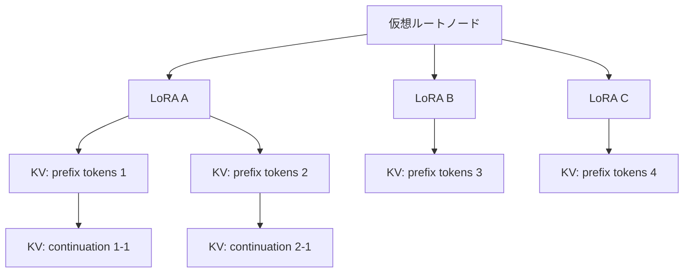

本記事は [arXiv:2505.03756](https://arxiv.org/abs/2505.03756) の解説記事です。

## 論文概要（Abstract）

FASTLIBRA は、Multi-LoRA LLM サービングにおけるキャッシュ管理を最適化するシステムである。著者らは、既存の Multi-LoRA 推論システムが LoRA アダプタと KV キャッシュの使用依存関係を無視しており、無効な KV キャッシュが HBM の最大 48.1% を占める問題を指摘している。FASTLIBRA は依存関係認識キャッシュマネージャと性能駆動キャッシュスワッパーの 2 コンポーネントで構成され、vLLM 比で TTFT（Time-To-First-Token）を平均 63.4% 削減、TPOT（Time-Per-Output-Token）を 40.1% 削減、ピークスループットを 1.7 倍に向上させたと報告されている。

この記事は [Zenn記事: vLLM Multi-LoRAで複数タスク特化モデルを1台のGPUに集約するルーティング設計](https://zenn.dev/0h_n0/articles/a21229e9c893f0) の深掘りです。

## 情報源

- **arXiv ID**: 2505.03756
- **URL**: [https://arxiv.org/abs/2505.03756](https://arxiv.org/abs/2505.03756)
- **著者**: Hang Zhang, Jiuchen Shi, Yixiao Wang, Quan Chen, Yizhou Shan, Minyi Guo
- **投稿日**: 2025年4月19日
- **分野**: cs.AR, cs.AI, cs.LG, cs.PF
- **実装規模**: vLLM 拡張として 8324 行の Python + 1644 行の C++ コード

## 背景と動機（Background & Motivation）

Multi-LoRA サービングでは、1 つのベースモデル上に多数の LoRA アダプタをロードし、リクエストごとに異なるアダプタを切り替えて推論を行う。この構成において、LoRA アダプタと KV キャッシュの両方をアクセラレータの HBM（High Bandwidth Memory）にキャッシュすることが推論性能に直結する。

### 既存システムの課題

vLLM をはじめとする既存の Multi-LoRA 推論システムには、以下の構造的問題がある。

| 課題 | 詳細 |
|------|------|
| **静的 HBM パーティション** | vLLM は HBM を LoRA 領域と KV キャッシュ領域に静的に分割する。LoRA 数やリクエストパターンの変動に追従できない |
| **依存関係の無視** | LoRA がスワップアウトされても、その LoRA に紐づく KV キャッシュが HBM に残留する。著者らの計測では、vLLM において無効な KV キャッシュが全 KV キャッシュの最大 48.1% を占める |
| **受動的スワップ** | 新しいリクエスト到着時にのみスワップが発生し、HBM のアイドル時間を活用した事前ロードが行われない |

S-LoRA は LoRA のページング管理を導入したが、KV キャッシュとの連携が不十分であり、同様の無効キャッシュ問題を抱えている。

## 主要な貢献（Key Contributions）

- **依存関係認識キャッシュマネージャ**: LoRA と KV キャッシュの使用依存関係をツリー構造で管理する統一キャッシュプールを設計。無効 KV キャッシュ比率を 48.1% からほぼ 0% に削減した
- **統一コストモデル**: LoRA の多様性報酬、再利用確率、時間減衰を統合した評価関数により、スワップイン/アウトの優先度を定量的に決定する
- **性能駆動キャッシュスワッパー**: 100ms 間隔で HBM 使用状況を監視し、ヒステリシス付き閾値（上限 95%/下限 70%）でプロアクティブなスワップを実行する

## 技術的詳細（Technical Details）

### 依存関係ツリーの構造

FASTLIBRA は LoRA と KV キャッシュの依存関係をトライ木（trie tree）で管理する。ツリーは 3 層構造をとる。



- **第 0 層（仮想ルート）**: 独立した LoRA サブツリーを統一的に管理するための仮想ノード
- **第 1 層（LoRA ノード）**: 各 LoRA アダプタを表現する。LoRA ID をキーとする
- **第 2 層以降（KV キャッシュノード）**: トークン列をキーとする KV キャッシュ。同じ LoRA の下でプレフィックスを共有するリクエストはサブツリーを形成する

リクエスト到着時、必要な LoRA と KV キャッシュのマッチングは DFS（深さ優先探索）で行われる。ノードのマッチングと更新は 1ms 未満で完了すると報告されている。

### スワップ操作の方向性制約

依存関係の整合性を維持するため、スワップ操作には方向性制約が課される。

- **スワップアウト**: リーフノードからのみ実行。親ノード（LoRA）が HBM に残っている状態で子ノード（KV キャッシュ）を退避する。これにより LoRA が退避された後にその KV キャッシュだけが残る「孤立 KV キャッシュ」の発生を防止する
- **スワップイン**: ルートノードからのみ実行。LoRA を先にロードし、その後に関連する KV キャッシュをロードする。LoRA がない状態で KV キャッシュのみが HBM に存在する事態を回避する

### 統一コストモデル

スワップの優先度は統一コストモデルで評価される。各キャッシュノード $i$ の評価値は以下で定義される。

$$
\text{Eval}_i = \text{LoRA\_Eval}_i \times \text{Retain\_Eval}_i
$$

#### LoRA 報酬係数

$$
\text{LoRA\_Eval}_i = \max\left(1, \frac{\text{Low\_lora}}{\text{Now\_LoRA}}\right)
$$

ここで、
- $\text{Now\_LoRA}$: 現在 HBM にロードされている LoRA の数
- $\text{Low\_lora}$: 期待される必要 LoRA 数

$\text{Low\_lora}$ は以下のように計算される。

$$
\text{Low\_lora} = \sum_{i} \left(1 - (1 - \text{prob}_i)^{BS}\right)
$$

$BS$ はバッチサイズ、$\text{prob}_i$ は各 LoRA の訪問頻度確率である。この式は「バッチ内で少なくとも 1 回呼ばれる確率」の期待値を集約したもので、直近のバッチにおける LoRA 多様性の需要を推定する。$\text{Now\_LoRA} < \text{Low\_lora}$ のとき報酬係数が 1 を超え、LoRA のスワップインが促進される。

#### 保持評価値

$$
\text{Retain\_Eval}_i = \text{cost}_i \times \text{prob}_i \times \left(1 - \sigma(t_i)\right)
$$

ここで、
- $\text{cost}_i$: ノード $i$ の転送レイテンシ（PCIe 帯域幅から算出）
- $\text{prob}_i$: 依存関係ツリーから得られる訪問頻度確率
- $\sigma(t_i)$: 時間減衰関数（LSTM のフォーゲットゲートに類似したシグモイド関数）
- $t_i$: 最終使用時刻からの経過時間

$\text{cost}_i$ が大きいノード（転送コストが高い）は保持優先度が高く、$t_i$ が大きいノード（長時間未使用）は保持優先度が低くなる。

### 性能駆動キャッシュスワッパー

スワッパーは 100ms 間隔で HBM の使用状況を監視し、以下のロジックで動作する。

1. **HBM 使用率 > 95%（上限閾値）**: リーフノードを $\text{Eval}_i$ の昇順でソートし、評価値が低いノードからスワップアウトする
2. **HBM 使用率 < 70%（下限閾値）**: メインメモリ上のルートノードを $\text{Eval}_i$ の降順でソートし、評価値が高いノードからスワップインする
3. **70% -- 95%**: スワップ操作を行わない

上限と下限に 25 ポイントのギャップを設けるヒステリシス設計により、閾値付近での頻繁なスワップイン/アウトの往復（ping-pong swapping）を防止している。

### 非同期スワップの実装

スワッパーは PyTorch の Stream ライブラリを使用し、推論計算とデータ転送をオーバーラップさせる。推論が NPU で実行されている間に、バックグラウンドで PCIe 経由のスワップ転送を並行して行うことで、スワップ操作による推論レイテンシへの影響を最小化している。

## 実装のポイント（Implementation）

### vLLM への統合アーキテクチャ

FASTLIBRA は vLLM のコードベースを拡張する形で実装されている。主要な変更点は以下の通りである。

- **統一キャッシュプール**: vLLM の静的 HBM パーティションを廃止し、LoRA と KV キャッシュを同一のメモリプールで管理する。これにより動的なメモリ割り当てが可能になる
- **依存関係トラッカー**: トライ木によるリアルタイムの依存関係追跡。ノードの挿入・削除・マッチングは 1ms 未満で完了する
- **バックグラウンドスワッパースレッド**: 100ms のポーリング間隔で HBM 状態を監視する独立スレッド。推論パイプラインとは非同期に動作する

### LoRA ホットスワップの考慮事項

Multi-LoRA 環境では、LoRA の切り替え頻度がシナリオによって大きく異なる。著者らのテストでは、チャットボットシナリオ（LoRA 変動率が低い）と多言語翻訳シナリオ（LoRA 変動率が高い）で性能特性が異なることが確認されている。翻訳シナリオでは LoRA の切り替えが頻繁に発生するため、LoRA 報酬係数による多様性の確保がより重要になる。

```python
from dataclasses import dataclass
from typing import Optional
import math


@dataclass
class CacheNode:
    """依存関係ツリーのノード。

    Attributes:
        node_id: ノードの一意識別子
        node_type: "lora" または "kv_cache"
        size_bytes: HBM 上のサイズ（バイト）
        last_access_time: 最終アクセスのタイムスタンプ
        visit_prob: 訪問頻度確率
        parent: 親ノードへの参照
    """
    node_id: str
    node_type: str  # "lora" | "kv_cache"
    size_bytes: int
    last_access_time: float
    visit_prob: float
    parent: Optional["CacheNode"] = None

    @property
    def transfer_cost(self) -> float:
        """PCIe Gen4.0 x16 帯域幅に基づく転送コスト（ms）。

        Returns:
            推定転送レイテンシ（ミリ秒）
        """
        pcie_bandwidth_bytes_per_ms = 31.5e6  # ~31.5 GB/s
        return self.size_bytes / pcie_bandwidth_bytes_per_ms

    def retain_eval(self, current_time: float) -> float:
        """保持評価値を計算する。

        Args:
            current_time: 現在のタイムスタンプ

        Returns:
            保持評価スコア
        """
        t_i = current_time - self.last_access_time
        time_decay = 1.0 - 1.0 / (1.0 + math.exp(-t_i))
        return self.transfer_cost * self.visit_prob * time_decay


def compute_lora_reward(
    now_lora: int,
    lora_probs: list[float],
    batch_size: int,
) -> float:
    """LoRA 報酬係数を計算する。

    Args:
        now_lora: 現在 HBM にロードされている LoRA 数
        lora_probs: 各 LoRA の訪問頻度確率のリスト
        batch_size: 現在のバッチサイズ

    Returns:
        LoRA 報酬係数（1.0 以上）
    """
    low_lora = sum(
        1.0 - (1.0 - p) ** batch_size for p in lora_probs
    )
    return max(1.0, low_lora / now_lora) if now_lora > 0 else 1.0
```

## Production Deployment Guide

### AWS 実装パターン（コスト最適化重視）

FASTLIBRA の統一キャッシュ管理は、Multi-LoRA 推論サーバのメモリ効率を改善するため、GPU インスタンスのサイジングとコスト最適化に直接影響する。以下にトラフィック量別の推奨構成を示す。

| 構成 | トラフィック | インスタンス | GPU/HBM | 月額概算 |
|------|------------|-------------|---------|---------|
| Small | ~100 req/日 | g5.xlarge × 1 | A10G 24GB | $800-1,200 |
| Medium | ~1,000 req/日 | g5.2xlarge × 2 | A10G 24GB × 2 | $2,500-4,000 |
| Large | 10,000+ req/日 | p4d.24xlarge × 1 | A100 40GB × 8 | $15,000-25,000 |

**注意**: 上記コスト試算は 2026 年 7 月時点の AWS ap-northeast-1（東京）リージョンのオンデマンド料金に基づく概算値である。実際のコストはトラフィックパターン、リージョン、バースト使用量により変動する。最新料金は [AWS 料金計算ツール](https://calculator.aws/) で確認を推奨する。

**コスト削減テクニック**:
- **Spot Instances**: g5 インスタンスは Spot 利用で最大 70-90% 削減。ただし推論サーバはステートフルなため、中断時の LoRA/KV キャッシュ再構築コストを考慮する必要がある
- **Reserved Instances**: 1 年コミットで最大 40% 削減、3 年で最大 60% 削減
- **Savings Plans**: Compute Savings Plans で柔軟にコスト削減（最大 66% 削減）
- **HBM 効率化**: FASTLIBRA の統一キャッシュプールにより、同等の LoRA 数をより小さい HBM のインスタンスで処理可能。g5.xlarge（24GB HBM）で vLLM の g5.2xlarge（24GB HBM）相当の性能を期待できる

### Terraform インフラコード

#### Small 構成（単一 GPU インスタンス）

```hcl
# Small: Single GPU instance with vLLM + FastLibra
# 月額概算: $800-1,200（オンデマンド）、$200-400（Spot）

terraform {
  required_version = ">= 1.5"
  required_providers {
    aws = {
      source  = "hashicorp/aws"
      version = "~> 5.0"
    }
  }
}

provider "aws" {
  region = "ap-northeast-1"
}

# VPC（NAT Gateway 不使用でコスト削減）
resource "aws_vpc" "inference" {
  cidr_block           = "10.0.0.0/16"
  enable_dns_hostnames = true
  tags = { Name = "fastlibra-inference-vpc" }
}

resource "aws_subnet" "public" {
  vpc_id                  = aws_vpc.inference.id
  cidr_block              = "10.0.1.0/24"
  availability_zone       = "ap-northeast-1a"
  map_public_ip_on_launch = true
  tags = { Name = "fastlibra-public-subnet" }
}

resource "aws_internet_gateway" "main" {
  vpc_id = aws_vpc.inference.id
}

resource "aws_route_table" "public" {
  vpc_id = aws_vpc.inference.id
  route {
    cidr_block = "0.0.0.0/0"
    gateway_id = aws_internet_gateway.main.id
  }
}

resource "aws_route_table_association" "public" {
  subnet_id      = aws_subnet.public.id
  route_table_id = aws_route_table.public.id
}

# IAM Role（最小権限）
resource "aws_iam_role" "inference" {
  name = "fastlibra-inference-role"
  assume_role_policy = jsonencode({
    Version = "2012-10-17"
    Statement = [{
      Action = "sts:AssumeRole"
      Effect = "Allow"
      Principal = { Service = "ec2.amazonaws.com" }
    }]
  })
}

resource "aws_iam_role_policy" "s3_model_access" {
  name = "s3-model-read"
  role = aws_iam_role.inference.id
  policy = jsonencode({
    Version = "2012-10-17"
    Statement = [{
      Effect   = "Allow"
      Action   = ["s3:GetObject", "s3:ListBucket"]
      Resource = [
        "arn:aws:s3:::fastlibra-models",
        "arn:aws:s3:::fastlibra-models/*"
      ]
    }]
  })
}

resource "aws_iam_instance_profile" "inference" {
  name = "fastlibra-inference-profile"
  role = aws_iam_role.inference.name
}

# GPU Instance（Spot 優先）
resource "aws_spot_instance_request" "inference" {
  ami                    = "ami-0abcdef1234567890" # Deep Learning AMI
  instance_type          = "g5.xlarge"             # A10G 24GB HBM
  iam_instance_profile   = aws_iam_instance_profile.inference.name
  subnet_id              = aws_subnet.public.id
  vpc_security_group_ids = [aws_security_group.inference.id]
  spot_type              = "persistent"
  wait_for_fulfillment   = true

  root_block_device {
    volume_size = 200  # モデル + LoRA アダプタ格納
    volume_type = "gp3"
    encrypted   = true
  }

  tags = {
    Name        = "fastlibra-inference"
    Environment = "production"
    CostCenter  = "ml-inference"
  }
}

# Security Group（最小アクセス）
resource "aws_security_group" "inference" {
  name_prefix = "fastlibra-sg-"
  vpc_id      = aws_vpc.inference.id

  ingress {
    from_port   = 8000
    to_port     = 8000
    protocol    = "tcp"
    cidr_blocks = ["10.0.0.0/16"]  # VPC 内のみ
    description = "vLLM API endpoint"
  }

  egress {
    from_port   = 0
    to_port     = 0
    protocol    = "-1"
    cidr_blocks = ["0.0.0.0/0"]
  }
}

# CloudWatch アラーム（GPU 使用率監視）
resource "aws_cloudwatch_metric_alarm" "gpu_utilization" {
  alarm_name          = "fastlibra-gpu-high-utilization"
  comparison_operator = "GreaterThanThreshold"
  evaluation_periods  = 3
  metric_name         = "GPUUtilization"
  namespace           = "Custom/FastLibra"
  period              = 300
  statistic           = "Average"
  threshold           = 90
  alarm_description   = "GPU utilization exceeds 90% for 15 minutes"
}
```

#### Large 構成（EKS + Karpenter）

```hcl
# Large: EKS + Karpenter with Spot GPU Instances
# 月額概算: $15,000-25,000（オンデマンド）、$5,000-10,000（Spot 混合）

module "eks" {
  source  = "terraform-aws-modules/eks/aws"
  version = "~> 20.0"

  cluster_name    = "fastlibra-cluster"
  cluster_version = "1.31"
  vpc_id          = aws_vpc.inference.id
  subnet_ids      = [aws_subnet.public.id]

  cluster_endpoint_public_access = false  # プライベートアクセスのみ

  eks_managed_node_groups = {
    system = {
      instance_types = ["m5.large"]
      min_size       = 2
      max_size       = 3
      desired_size   = 2
    }
  }
}

# Karpenter Provisioner（Spot GPU 優先）
resource "kubectl_manifest" "karpenter_provisioner" {
  yaml_body = yamlencode({
    apiVersion = "karpenter.sh/v1beta1"
    kind       = "NodePool"
    metadata   = { name = "gpu-inference" }
    spec = {
      template = {
        spec = {
          requirements = [
            { key = "node.kubernetes.io/instance-type", operator = "In",
              values = ["g5.2xlarge", "g5.4xlarge", "p4d.24xlarge"] },
            { key = "karpenter.sh/capacity-type", operator = "In",
              values = ["spot", "on-demand"] },
            { key = "topology.kubernetes.io/zone", operator = "In",
              values = ["ap-northeast-1a", "ap-northeast-1c"] }
          ]
          nodeClassRef = { name = "default" }
        }
      }
      limits   = { cpu = "256", "nvidia.com/gpu" = "16" }
      disruption = {
        consolidationPolicy = "WhenUnderutilized"
        expireAfter         = "720h"
      }
    }
  })
}

# Secrets Manager（モデル設定）
resource "aws_secretsmanager_secret" "model_config" {
  name       = "fastlibra/model-config"
  kms_key_id = aws_kms_key.inference.arn
}

# KMS 暗号化キー
resource "aws_kms_key" "inference" {
  description         = "FastLibra inference encryption key"
  enable_key_rotation = true
}

# AWS Budgets（予算アラート）
resource "aws_budgets_budget" "monthly" {
  name         = "fastlibra-monthly-budget"
  budget_type  = "COST"
  limit_amount = "20000"
  limit_unit   = "USD"
  time_unit    = "MONTHLY"

  notification {
    comparison_operator       = "GREATER_THAN"
    threshold                 = 80
    threshold_type            = "PERCENTAGE"
    notification_type         = "ACTUAL"
    subscriber_email_addresses = ["ml-team@example.com"]
  }
}
```

### 運用・監視設定

#### CloudWatch Logs Insights クエリ

```
# HBM 使用率のトレンド分析（1 時間単位）
fields @timestamp, hbm_usage_percent, swap_in_count, swap_out_count
| stats avg(hbm_usage_percent) as avg_hbm,
        max(hbm_usage_percent) as peak_hbm,
        sum(swap_in_count) as total_swap_in,
        sum(swap_out_count) as total_swap_out
  by bin(1h)
| sort @timestamp desc

# KV キャッシュヒット率の監視
fields @timestamp, kv_cache_hits, kv_cache_misses
| stats sum(kv_cache_hits) as hits,
        sum(kv_cache_misses) as misses,
        sum(kv_cache_hits) / (sum(kv_cache_hits) + sum(kv_cache_misses)) * 100 as hit_rate
  by bin(5m)
| filter hit_rate < 50
```

#### CloudWatch アラーム設定（Python）

```python
import boto3


def create_fastlibra_alarms(instance_id: str, sns_topic_arn: str) -> None:
    """FASTLIBRA 推論サーバの監視アラームを作成する。

    Args:
        instance_id: EC2 インスタンス ID
        sns_topic_arn: 通知先の SNS トピック ARN
    """
    cw = boto3.client("cloudwatch", region_name="ap-northeast-1")

    # TTFT スパイク検知
    cw.put_metric_alarm(
        AlarmName=f"fastlibra-ttft-spike-{instance_id}",
        MetricName="TTFT_P95_ms",
        Namespace="Custom/FastLibra",
        Statistic="p95",
        Period=300,
        EvaluationPeriods=2,
        Threshold=500.0,
        ComparisonOperator="GreaterThanThreshold",
        AlarmActions=[sns_topic_arn],
        Dimensions=[{"Name": "InstanceId", "Value": instance_id}],
    )

    # HBM 使用率アラーム
    cw.put_metric_alarm(
        AlarmName=f"fastlibra-hbm-critical-{instance_id}",
        MetricName="HBMUsagePercent",
        Namespace="Custom/FastLibra",
        Statistic="Average",
        Period=60,
        EvaluationPeriods=5,
        Threshold=98.0,
        ComparisonOperator="GreaterThanThreshold",
        AlarmActions=[sns_topic_arn],
        Dimensions=[{"Name": "InstanceId", "Value": instance_id}],
    )
```

#### X-Ray トレーシング設定

```python
from aws_xray_sdk.core import xray_recorder, patch_all

# boto3 自動計装
patch_all()


@xray_recorder.capture("inference_request")
def handle_inference(request_id: str, lora_id: str) -> dict:
    """推論リクエストをトレーシング付きで処理する。

    Args:
        request_id: リクエスト識別子
        lora_id: 使用する LoRA アダプタの ID

    Returns:
        推論結果を含む辞書
    """
    subsegment = xray_recorder.current_subsegment()
    subsegment.put_annotation("lora_id", lora_id)
    subsegment.put_metadata("request_id", request_id)
    # ... inference logic ...
    return {"status": "ok"}
```

#### Cost Explorer 自動レポート（Python）

```python
import boto3
from datetime import datetime, timedelta


def get_daily_inference_cost() -> dict:
    """直近 1 日の推論インフラコストを取得する。

    Returns:
        サービス別コスト内訳の辞書
    """
    ce = boto3.client("ce", region_name="us-east-1")
    end = datetime.utcnow().strftime("%Y-%m-%d")
    start = (datetime.utcnow() - timedelta(days=1)).strftime("%Y-%m-%d")

    response = ce.get_cost_and_usage(
        TimePeriod={"Start": start, "End": end},
        Granularity="DAILY",
        Metrics=["UnblendedCost"],
        Filter={
            "Tags": {
                "Key": "CostCenter",
                "Values": ["ml-inference"],
            }
        },
        GroupBy=[{"Type": "DIMENSION", "Key": "SERVICE"}],
    )

    costs = {}
    for group in response["ResultsByTime"][0]["Groups"]:
        service = group["Keys"][0]
        amount = float(group["Metrics"]["UnblendedCost"]["Amount"])
        costs[service] = amount

    total = sum(costs.values())
    if total > 100.0:
        sns = boto3.client("sns", region_name="ap-northeast-1")
        sns.publish(
            TopicArn="arn:aws:sns:ap-northeast-1:123456789012:cost-alert",
            Subject="FastLibra Daily Cost Alert",
            Message=f"Daily cost ${total:.2f} exceeds $100 threshold",
        )

    return costs
```

### コスト最適化チェックリスト

**アーキテクチャ選択**:
- [ ] トラフィック量に応じた構成選択（Small: 単一 GPU / Medium: マルチ GPU / Large: EKS クラスタ）
- [ ] FASTLIBRA の HBM 効率化により、1 ランク下のインスタンスで同等性能を検証

**リソース最適化**:
- [ ] EC2 GPU: Spot Instances 優先（g5 系で 70-90% 削減）
- [ ] Reserved Instances: 1 年コミットで 40% 削減
- [ ] Savings Plans: Compute Savings Plans で柔軟にコスト削減
- [ ] EKS: Karpenter で未使用ノードを自動スケールダウン
- [ ] S3: モデルアーティファクトにライフサイクルポリシー設定

**推論コスト削減**:
- [ ] FASTLIBRA の統一キャッシュプールで HBM 使用効率を最大化
- [ ] KV キャッシュヒット率の監視と閾値アラート設定
- [ ] LoRA アダプタの S3 からの事前ダウンロードでコールドスタート削減
- [ ] バッチ推論でスループット最大化（FASTLIBRA のピークスループット 1.7 倍を活用）

**監視・アラート**:
- [ ] AWS Budgets で月次予算アラート設定
- [ ] CloudWatch で TTFT/TPOT/HBM 使用率のカスタムメトリクス
- [ ] Cost Anomaly Detection 有効化
- [ ] 日次コストレポートの自動取得と SNS 通知

**リソース管理**:
- [ ] 未使用 GPU インスタンスの自動停止（夜間・休日）
- [ ] タグ戦略の統一（CostCenter, Environment, Service）
- [ ] EBS スナップショットのライフサイクルポリシー
- [ ] CloudWatch Logs の保持期間設定（30 日）
- [ ] 開発環境の夜間自動停止スケジュール

## 実験結果（Results）

著者らは Llama-7B/13B/34B をベースモデルとし、4 基の NPU（各 256 TFLOPS FP16、64GB HBM）上で評価を行っている。LoRA ランクは 32 および 64、アダプタ数は 20/50/100 で実験を実施している。

### アプリケーションシナリオ別の性能比較

| シナリオ | 指標 | vLLM | S-LoRA | FASTLIBRA | vLLM 比改善 |
|---------|------|------|--------|-----------|-----------|
| チャットボット | TTFT | 基準 | - | - | 60.3% 削減 |
| 多言語翻訳 | TTFT | 基準 | - | - | 68.9% 削減 |
| パーソナルエージェント | TTFT | 基準 | - | - | 60.8% 削減 |
| 全シナリオ平均 | TTFT | 基準 | - | - | **63.4% 削減** |
| 全シナリオ平均 | TPOT | 基準 | - | - | **40.1% 削減** |
| 全シナリオ平均 | スループット | 基準 | - | - | **1.7 倍** |

（論文 Table 3, Figure 9 より）

多言語翻訳シナリオで最大の TTFT 改善（68.9%）が得られた理由として、著者らは LoRA の変動率が高い状況で依存関係認識キャッシュ管理の効果がより顕著に現れると分析している。

### キャッシュ効率の改善

| 指標 | vLLM | S-LoRA | FASTLIBRA |
|------|------|--------|-----------|
| 無効 KV キャッシュ比率 | 48.1% | - | ほぼ 0% |
| KV キャッシュヒット率 | 基準 | - | 1.3 倍 |
| HBM 使用効率 | 基準 | - | 1.2 倍 |

（論文 Figure 10 より）

### アブレーションスタディ

著者らは各コンポーネントの寄与を分離するため、以下のアブレーション実験を行っている。

- **FASTLIBRA-WOM**（依存関係管理なし）: 無効 KV キャッシュ比率が 48.6% に戻り、TTFT 改善が大幅に低下
- **FASTLIBRA-WOS**（スワッパーなし）: プロアクティブなスワップがないため、リクエスト到着時のスワップレイテンシが増加

これらの結果は、依存関係認識キャッシュマネージャと性能駆動スワッパーの両方が性能改善に不可欠であることを示している。

## 実運用への応用（Practical Applications）

### 大規模 Multi-LoRA 環境（1000+ LoRA）への対応

著者らは 1000-2000 個の LoRA アダプタを使用したスケーラビリティ実験も報告している。大規模環境では以下の特性が確認されている。

- **安定した性能**: LoRA 数が 1000 を超えても TTFT/TPOT の性能劣化は緩やかである
- **HBM 効率の重要性**: LoRA 数が増えるほど HBM の効率的利用が重要になり、FASTLIBRA の統一キャッシュ管理の優位性が拡大する
- **トライ木のスケーラビリティ**: ノードのマッチング・更新が 1ms 未満で完了するため、LoRA 数の増加による管理オーバーヘッドは限定的である

### Zenn 記事との関連

[Zenn記事](https://zenn.dev/0h_n0/articles/a21229e9c893f0) で解説されている vLLM Multi-LoRA のルーティング設計において、FASTLIBRA のキャッシュ管理は以下の点で実装を補完する。

- **ルーティング後のキャッシュ効率**: リクエストが特定の LoRA にルーティングされた後、FASTLIBRA が LoRA と KV キャッシュの依存関係を維持し、不要なスワップを削減する
- **動的ワークロード対応**: ルーティングパターンが時間帯によって変動する場合、統一コストモデルが訪問頻度と時間減衰に基づいてキャッシュを適応的に管理する
- **マルチテナント環境**: 複数のテナントが異なる LoRA を使用する環境で、HBM の公平かつ効率的な配分を実現する

## 関連研究（Related Work）

- **S-LoRA**（Sheng et al., 2023）: LoRA のページング管理と専用 CUDA カーネルを導入したが、KV キャッシュとの依存関係管理は実装されていない。FASTLIBRA は S-LoRA 比で TTFT を 50.1% 削減している
- **Punica**（Chen et al., 2024）: 複数 LoRA の統合バッチ処理を可能にする SGMV（Segmented Gather Matrix-Vector）カーネルを提案。計算カーネルの効率化に焦点を当てており、キャッシュ管理は対象外である
- **InfiniLoRA**: 不均一メモリ環境での LoRA 管理を扱うが、KV キャッシュとの統合的なキャッシュ管理は行っていない

## まとめと今後の展望

FASTLIBRA は、Multi-LoRA LLM サービングにおける LoRA と KV キャッシュの依存関係を初めて体系的に管理したシステムである。依存関係認識ツリー構造と統一コストモデルにより、vLLM 比で TTFT 63.4% 削減、ピークスループット 1.7 倍という改善を達成したと報告されている。大規模（1000-2000 LoRA）環境でも安定した動作が確認されており、マルチテナント推論基盤の実用的な選択肢として注目される。今後の課題として、GPU クラスタ間での分散キャッシュ管理や、異なるアクセラレータ（GPU/NPU 混在）環境への拡張が考えられる。

## 参考文献

- **arXiv**: [https://arxiv.org/abs/2505.03756](https://arxiv.org/abs/2505.03756)
- **Related Zenn article**: [https://zenn.dev/0h_n0/articles/a21229e9c893f0](https://zenn.dev/0h_n0/articles/a21229e9c893f0)
- **S-LoRA**: Sheng et al., "S-LoRA: Serving Thousands of Concurrent LoRA Adapters," 2023
- **Punica**: Chen et al., "Punica: Multi-Tenant LoRA Serving," 2024
- **vLLM**: Kwon et al., "Efficient Memory Management for Large Language Model Serving with PagedAttention," SOSP 2023
