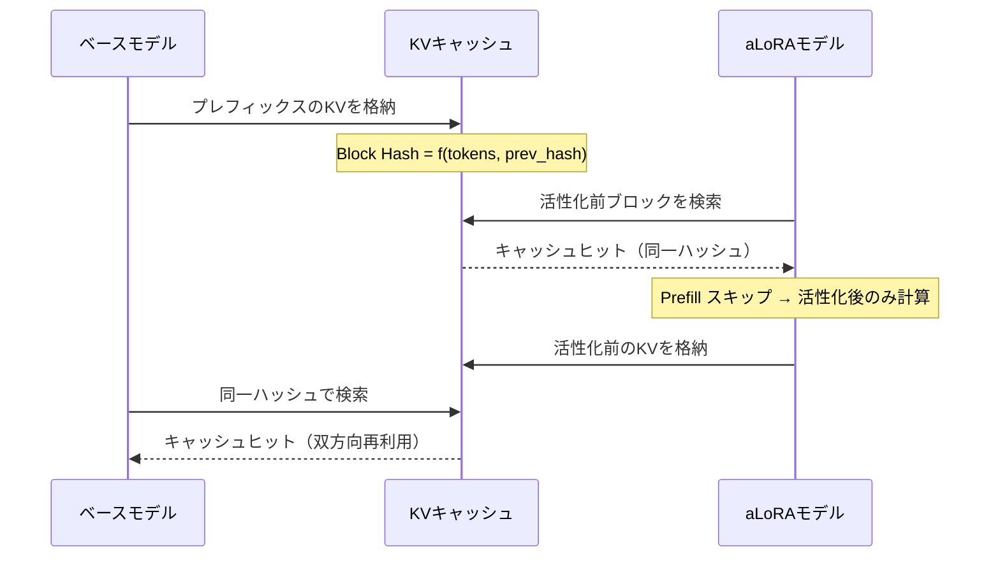
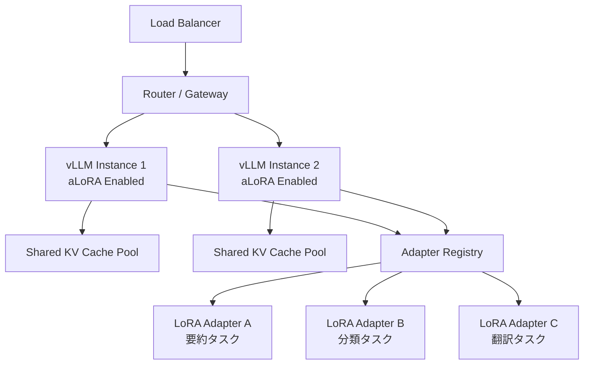

本記事は [arXiv:2512.17910](https://arxiv.org/abs/2512.17910) の解説記事です。

## 論文概要（Abstract）

現代の LLM システムはマルチターンパイプラインにおいて複数のタスク特化アダプタを切り替えて利用するが、既存のサービングフレームワークではアダプタ切り替え時に KV テンソルの再計算が発生し、大きなオーバーヘッドとなっている。著者らは Activated LoRA（aLoRA）を提案し、ベースモデルとアダプタモデル間での cross-model prefix cache reuse を実現する初の LLM サービングエンジンを構築した。vLLM を拡張し、base-aligned block hashing と activation-aware masking を導入することで、既存の最適化との互換性を維持しつつ最大58倍の end-to-end レイテンシ削減と100倍以上の TTFT 改善を達成したと報告されている。

この記事は [Zenn記事: vLLM Multi-LoRAで複数タスク特化モデルを1台のGPUに集約するルーティング設計](https://zenn.dev/0h_n0/articles/a21229e9c893f0) の深掘りです。

## 情報源

- **arXiv ID**: 2512.17910
- **URL**: [https://arxiv.org/abs/2512.17910](https://arxiv.org/abs/2512.17910)
- **著者**: Allison Li, Kristjan Greenewald, Thomas Parnell, Navid Azizan
- **投稿日**: 2025年11月26日
- **分野**: cs.DC, cs.AI, cs.LG

## 背景と動機（Background & Motivation）

LLM を本番環境で運用する際、単一のベースモデルに複数の LoRA アダプタを載せ替えてタスクごとに応答を生成するマルチアダプタパイプラインが一般化している。たとえば、ユーザーの入力をベースモデルで前処理し、タスク特化アダプタで応答を生成し、再びベースモデルで後処理を行うようなマルチターン構成である。

### 既存手法の問題

標準的な LoRA サービングでは、ベースモデルとアダプタモデルの KV キャッシュは完全に分離されている。アダプタモデルは全レイヤーの全トークンに対してアダプタの差分重み $\Delta W = BA$ を適用するため、生成される KV テンソルがベースモデルとは異なり、キャッシュの再利用が原理的に不可能である。

| 問題 | 影響 |
|------|------|
| **KV キャッシュ非共有** | アダプタ切り替えのたびに全プレフィックスの KV テンソルを再計算 |
| **キャッシュヒット率 0%** | 標準 LoRA ではベース-アダプタ間でキャッシュが一切共有されない |
| **Prefill コスト増大** | プロンプト長に比例して再計算コストが膨張する |
| **マルチターンの非効率** | ベース→アダプタ→ベースのパイプラインで各段階でキャッシュが無駄になる |

この問題は、プロンプト長が長くなるほど、またモデルサイズが大きくなるほど深刻化する。65,536トークンのプロンプトを Mistral Large 2（123B）で処理する場合、prefill だけで数十秒を要する可能性がある。

## 主要な貢献（Key Contributions）

- **Activated LoRA（aLoRA）**: トークンレベルの活性化制御により、事前定義された invocation sequence 以降のトークンにのみアダプタを適用する。活性化前のトークンではベースモデルと同一の KV テンソルが生成されるため、キャッシュの cross-model 再利用が可能となる
- **Cross-Model Prefix Cache Reuse**: ベースモデルとアダプタモデルの間で KV キャッシュブロックを双方向に共有する仕組み。base-aligned block hashing により、活性化前ブロックのハッシュ空間をベースモデルと統一する
- **vLLM 統合実装**: 既存の automatic prefix caching、chunked prefill、torch.compile と完全に互換性を持つ形で vLLM を拡張し、プロダクショングレードの推論エンジンとして cross-model cache reuse を初めて実現した

## 技術的詳細（Technical Details）

### Activated LoRA（aLoRA）の仕組み

標準的な LoRA では、全トークンに対してアダプタの差分重みが適用される。aLoRA の核心的なアイデアは、アダプタの適用を特定のトークン位置以降に限定することである。

具体的には、入力シーケンスに事前定義された「invocation sequence」（活性化トリガーとなるトークン列）を配置し、そのトークン位置を境界としてアダプタの適用開始位置を決定する。invocation sequence 以前のトークンに対する Query、Key、Value の計算は以下のようになる。

$$Q = X_{\text{before}} \cdot W^Q, \quad K = X_{\text{before}} \cdot W^K, \quad V = X_{\text{before}} \cdot W^V$$

invocation sequence 以降のトークンに対しては、LoRA の差分重みが加算される。

$$Q = X_{\text{after}} \cdot (W^Q + \Delta Q), \quad K = X_{\text{after}} \cdot (W^K + \Delta K), \quad V = X_{\text{after}} \cdot (W^V + \Delta V)$$

ここで $\Delta Q = B_Q A_Q$、$\Delta K = B_K A_K$、$\Delta V = B_V A_V$ であり、$B \in \mathbb{R}^{M \times r}$、$A \in \mathbb{R}^{r \times N}$、$r \ll \min(M, N)$ である。

この設計により、活性化前のトークンの K, V はベースモデルが生成するものと完全に一致するため、KV キャッシュの再利用が原理的に可能となる。

### Cross-Model Prefix Cache Reuse

aLoRA の特性を活用し、ベースモデルとアダプタモデルの間で KV キャッシュを双方向に共有する。



この双方向の再利用は、マルチターンパイプライン（ベース → アダプタ → ベース）で特に効果的である。各段階でプレフィックス部分の KV テンソルを再計算する必要がなくなるため、パイプライン全体のレイテンシが大幅に削減される。

### Base-Aligned Block Hashing

vLLM の automatic prefix caching では、KV キャッシュブロックを以下の3要素からなるハッシュで識別する。

1. ブロック内のトークン列
2. 先行ブロックのハッシュ値
3. アダプタ ID やキャッシュソルト等の追加識別子

標準的な LoRA サービングでは、アダプタ ID がハッシュに含まれるため、同一のトークン列であってもベースモデルとアダプタモデルでは異なるハッシュが生成される。

aLoRA では、活性化前のブロックについてはアダプタ ID をハッシュ計算から除外する。これにより、活性化前ブロックのハッシュがベースモデルと同一となり、キャッシュの cross-model ルックアップが成立する。

$$h_i = \begin{cases} \text{hash}(\text{tokens}_i, h_{i-1}) & \text{if block } i < \text{activation block} \\ \text{hash}(\text{tokens}_i, h_{i-1}, \text{adapter\_id}) & \text{if block } i \geq \text{activation block} \end{cases}$$

### Activation-Aware Masking

バッチ推論では、同一バッチ内に活性化前のトークンと活性化後のトークンが混在する可能性がある。aLoRA はトークン単位の動的マスクを用いて、アダプタの適用を制御する。

$$\text{output} = \text{base\_output} \times \text{mask} + \text{adapted\_output} \times (1 - \text{mask})$$

ここで mask は活性化前のトークン位置では 1、活性化後のトークン位置では 0 となる静的テンソルである。このマスクは PyTorch のコンテキストマネージャを通じてモデルの forward pass に伝播される。活性化シーケンスの位置情報は各 forward pass の前にメタデータとして準備され、マスクが構築される。

## 実装のポイント（Implementation Guide）

### vLLM 拡張の構成

著者らの実装は vLLM の以下のコンポーネントを拡張している。

1. **ブロックハッシュセマンティクスの変更**: aLoRA リクエストの活性化前ブロックでは、アダプタ ID をハッシュ計算から除外するように automatic prefix caching を修正
2. **モデル実行パスへのマスク統合**: 各 forward pass の前に活性化シーケンスの位置を解析し、マスクテンソルを構築。PyTorch のコンテキストマネージャ経由でモデルに注入
3. **メタデータ準備**: スケジューリング段階でリクエストの invocation tokens フィールドを解析し、活性化位置を記録

### PyTorch グラフ互換性

aLoRA の実装は `torch.compile` と互換性を維持している。マスクテンソルは静的な形状を持つため、動的形状によるグラフの再コンパイルは発生しない。また、chunked prefill との組み合わせにより、長いプレフィックスを分割して処理する際にも活性化マスクが正しく適用される。

### アダプタ構成

aLoRA アダプタの構成には、標準的な LoRA の設定に加えて invocation sequence（活性化トリガーとなるトークン列）の定義が必要となる。このトークン列はアダプタごとに固定で、プロンプトテンプレートの一部として設計される。

## Production Deployment Guide

### アーキテクチャ概要

aLoRA を本番環境に導入する際の全体構成を以下に示す。



### vLLM サーバー起動設定

aLoRA 対応の vLLM サーバーを起動する際の設定例を以下に示す。

```python
from dataclasses import dataclass, field


@dataclass
class ALoRAServingConfig:
    """aLoRA 対応 vLLM サーバーの起動設定。

    Attributes:
        model: ベースモデルのパスまたは HuggingFace ID
        tensor_parallel_size: テンソル並列数（GPU 数）
        max_loras: 同時ロード可能な LoRA アダプタの最大数
        enable_prefix_caching: automatic prefix caching の有効化
        enable_chunked_prefill: chunked prefill の有効化
        max_model_len: 最大シーケンス長
        gpu_memory_utilization: GPU メモリ利用率
        block_size: KV キャッシュブロックサイズ（トークン数）
        max_num_seqs: 同時処理可能なシーケンス数
    """
    model: str = "ibm-granite/granite-3.2-8b-instruct"
    tensor_parallel_size: int = 1
    max_loras: int = 8
    enable_prefix_caching: bool = True
    enable_chunked_prefill: bool = True
    max_model_len: int = 65536
    gpu_memory_utilization: float = 0.90
    block_size: int = 16
    max_num_seqs: int = 256


# モデルサイズ別の推奨構成
MODEL_CONFIGS: dict[str, ALoRAServingConfig] = {
    "granite-8b": ALoRAServingConfig(
        model="ibm-granite/granite-3.2-8b-instruct",
        tensor_parallel_size=1,
        max_loras=8,
        max_model_len=65536,
    ),
    "llama-70b": ALoRAServingConfig(
        model="meta-llama/Llama-3.3-70B-Instruct",
        tensor_parallel_size=4,
        max_loras=4,
        max_model_len=65536,
        gpu_memory_utilization=0.92,
    ),
    "mistral-123b": ALoRAServingConfig(
        model="mistralai/Mistral-Large-Instruct-2411",
        tensor_parallel_size=8,
        max_loras=2,
        max_model_len=65536,
        gpu_memory_utilization=0.92,
        max_num_seqs=128,
    ),
}
```

### マルチアダプタパイプラインの実装

マルチターンパイプライン（ベース → アダプタ → ベース）でのリクエスト構築例を示す。

```python
from dataclasses import dataclass
from typing import Optional
import hashlib


@dataclass
class ALoRARequest:
    """aLoRA リクエストの構造。

    Attributes:
        prompt: 入力プロンプト
        adapter_name: 使用する LoRA アダプタの名前（None の場合ベースモデル）
        invocation_sequence: アダプタ活性化トリガーとなるトークン列
        max_tokens: 生成する最大トークン数
        temperature: サンプリング温度
    """
    prompt: str
    adapter_name: Optional[str] = None
    invocation_sequence: Optional[str] = None
    max_tokens: int = 256
    temperature: float = 0.0


def build_multi_turn_pipeline(
    user_input: str,
    task_adapter: str,
    invocation_seq: str = "<|adapter_start|>",
) -> list[ALoRARequest]:
    """マルチターンパイプラインのリクエスト列を構築する。

    ベースモデルで前処理 → アダプタで本処理 → ベースモデルで後処理
    の3段パイプラインを構築する。各段階で前段の KV キャッシュを
    cross-model で再利用できるため、prefill コストが削減される。

    Args:
        user_input: ユーザーの入力テキスト
        task_adapter: 使用するタスク特化アダプタの名前
        invocation_seq: アダプタ活性化トリガー文字列

    Returns:
        3段パイプラインの ALoRARequest リスト
    """
    # Stage 1: ベースモデルによる前処理（入力解析・分類）
    stage1 = ALoRARequest(
        prompt=f"Analyze the following input and extract key entities:\n{user_input}",
        adapter_name=None,
        max_tokens=128,
    )

    # Stage 2: aLoRA アダプタによる本処理
    # invocation_sequence 以前のプレフィックスは Stage 1 の
    # KV キャッシュを再利用する
    stage2 = ALoRARequest(
        prompt=f"Analyze the following input and extract key entities:\n{user_input}{invocation_seq}",
        adapter_name=task_adapter,
        invocation_sequence=invocation_seq,
        max_tokens=512,
    )

    # Stage 3: ベースモデルによる後処理（品質チェック・整形）
    # aLoRA の活性化前ブロックの KV キャッシュを再利用
    stage3 = ALoRARequest(
        prompt=f"Analyze the following input and extract key entities:\n{user_input}",
        adapter_name=None,
        max_tokens=256,
    )

    return [stage1, stage2, stage3]
```

### キャッシュヒット率モニタリング

aLoRA の効果を継続的に監視するためのメトリクス収集パターンを以下に示す。

```python
from dataclasses import dataclass, field
from typing import Optional
import time


@dataclass
class CacheMetrics:
    """KV キャッシュの利用状況メトリクス。

    Attributes:
        total_blocks_requested: 要求された KV キャッシュブロック総数
        cache_hits: キャッシュヒット数
        cross_model_hits: cross-model キャッシュヒット数
        prefill_time_ms: Prefill に要した時間（ミリ秒）
        ttft_ms: Time-to-First-Token（ミリ秒）
    """
    total_blocks_requested: int = 0
    cache_hits: int = 0
    cross_model_hits: int = 0
    prefill_time_ms: float = 0.0
    ttft_ms: float = 0.0

    @property
    def hit_rate(self) -> float:
        """キャッシュヒット率を返す。"""
        if self.total_blocks_requested == 0:
            return 0.0
        return self.cache_hits / self.total_blocks_requested

    @property
    def cross_model_hit_rate(self) -> float:
        """cross-model キャッシュヒット率を返す。"""
        if self.cache_hits == 0:
            return 0.0
        return self.cross_model_hits / self.cache_hits


@dataclass
class CacheMonitor:
    """KV キャッシュの利用状況をモニタリングする。

    aLoRA 導入前後の比較や、アダプタごとの
    キャッシュ効率を追跡する。

    Attributes:
        window_size: メトリクスの集計ウィンドウサイズ
        alert_threshold: キャッシュヒット率の警告閾値
    """
    window_size: int = 1000
    alert_threshold: float = 0.5
    _metrics: list[CacheMetrics] = field(default_factory=list)

    def record(self, metrics: CacheMetrics) -> None:
        """メトリクスを記録する。

        Args:
            metrics: 記録するキャッシュメトリクス
        """
        self._metrics.append(metrics)
        if len(self._metrics) > self.window_size:
            self._metrics = self._metrics[-self.window_size:]

    def get_aggregate(self) -> dict[str, float]:
        """集計メトリクスを返す。

        Returns:
            平均キャッシュヒット率、平均 TTFT 等の集計値
        """
        if not self._metrics:
            return {"hit_rate": 0.0, "avg_ttft_ms": 0.0}

        total_hits = sum(m.cache_hits for m in self._metrics)
        total_requested = sum(m.total_blocks_requested for m in self._metrics)
        avg_ttft = sum(m.ttft_ms for m in self._metrics) / len(self._metrics)

        return {
            "hit_rate": total_hits / total_requested if total_requested > 0 else 0.0,
            "avg_ttft_ms": avg_ttft,
            "cross_model_hit_rate": (
                sum(m.cross_model_hits for m in self._metrics) / total_hits
                if total_hits > 0
                else 0.0
            ),
            "sample_count": len(self._metrics),
        }
```

### 運用上の注意点

aLoRA を本番環境で運用する際に留意すべき点を以下にまとめる。

**Invocation Sequence の設計**: invocation sequence はアダプタごとに固定のトークン列であり、プロンプトテンプレートの一部として慎重に設計する必要がある。短すぎると偶発的な活性化のリスクがあり、長すぎるとキャッシュ再利用可能な領域が狭くなる。

**メモリ管理**: cross-model cache reuse により、同一の KV キャッシュブロックが複数のリクエストから参照される。ブロックの参照カウント管理が正しく行われないと、使用中のブロックが解放されるリスクがある。vLLM の eviction ポリシーとの整合性を検証する必要がある。

**アダプタのホットスワップ**: aLoRA は動的なアダプタ切り替えをサポートするが、アダプタの重みをGPU メモリにロードするコストは依然として存在する。`max_loras` パラメータでメモリに保持するアダプタ数を制御し、頻繁に使用するアダプタが evict されないよう調整する。

## 実験結果（Experimental Results）

### 評価環境

著者らは3つのモデルサイズで評価を行っている。

| モデル | パラメータ数 | GPU 構成 | 最大 KV キャッシュトークン |
|--------|-------------|----------|--------------------------|
| Granite 3.2 | 8B | 1x H100 (80GB) | 351,104 |
| Llama 3.3 | 70B | 4x H100 (320GB) | 407,984 |
| Mistral Large 2 | 123B | 8x H100 (640GB) | 912,688 |

### レイテンシ削減

マルチターンパイプライン（ベース → アダプタ → ベース）の評価において、著者らは以下の改善を報告している。

| メトリクス | 改善倍率 | 備考 |
|-----------|---------|------|
| End-to-end レイテンシ | 最大 58x | プロンプト長・モデルサイズに依存 |
| Time-to-First-Token（TTFT） | 100x 以上 | キャッシュヒット時のプレフィックス再利用 |
| Prefill 時間 | 最大 45x | キャッシュされたブロックの再計算が不要 |
| Decode 時間 | 最大 21x | KV キャッシュの効率的な利用 |

これらの改善はモデルサイズとシーケンス長が大きいほど顕著であり、リクエストライフサイクルの全段階にわたって効果が現れると報告されている。

### キャッシュヒット率

aLoRA の最も特徴的な結果はキャッシュヒット率の改善である。

| 手法 | キャッシュヒット率（1024トークン） |
|------|----------------------------------|
| 標準 LoRA | 0% |
| aLoRA | 84% |

標準 LoRA ではベースモデルとアダプタモデルの KV キャッシュが完全に分離されているため、マルチターンパイプラインにおけるキャッシュヒット率は 0% となる。一方 aLoRA では、活性化前のプレフィックス部分のキャッシュが再利用されるため、プロンプト長 1024 トークンの場合にキャッシュヒット率 84% を達成したと著者らは報告している。

### プロンプト長による影響

評価はプロンプト長 256 から 65,536 トークンの範囲で行われている。プロンプト長が長くなるほど aLoRA の効果は顕著になる。これは、長いプレフィックスほど再計算コストが高く、キャッシュ再利用による削減効果が大きいためである。

## 実運用への応用（Practical Applications）

### マルチタスクサービング

単一の GPU サーバー上で複数のタスク特化アダプタを効率的に切り替えるシナリオでは、aLoRA により各リクエスト間でプレフィックス部分の KV キャッシュを共有できる。要約、分類、翻訳など異なるタスクのアダプタが同一のベースモデルプレフィックスを共有することで、GPU メモリの利用効率が向上する。

### エージェントパイプライン

LLM エージェントがツール呼び出しの前後でベースモデルとアダプタモデルを交互に使用するパイプラインでは、aLoRA の cross-model cache reuse が特に効果的である。各ターンで蓄積されるコンテキストの KV キャッシュを再利用できるため、ターン数が増えるほどレイテンシの改善効果が累積する。

### バッチ推論の最適化

同一プロンプトテンプレートを共有する複数リクエストのバッチ推論では、テンプレート部分の KV キャッシュがリクエスト間で共有される。aLoRA により、異なるアダプタを使用するリクエスト間でもテンプレート部分のキャッシュが共有可能となり、スループットが改善される。

## 関連研究（Related Work）

**Punica**: GPU カーネルレベルでの LoRA バッチ処理を効率化する手法であり、複数の LoRA アダプタを単一のバッチ内で効率的に処理する SGMV（Segmented Gather Matrix-Vector）カーネルを提案している。aLoRA は Punica のバッチ効率化とは直交する観点から、KV キャッシュ再利用による prefill コストの削減に焦点を当てている。

**S-LoRA**: 大量の LoRA アダプタを単一 GPU 上で効率的にサービングするための統合ページングメモリ管理システムを提案している。アダプタの重みをホストメモリに退避させ、オンデマンドで GPU に転送するアプローチを採る。aLoRA はメモリ管理ではなくキャッシュ再利用に注力しており、S-LoRA のメモリ管理と組み合わせて使用できる可能性がある。

**ForkKV**: マルチターン対話における KV キャッシュの効率化を目的とした手法であり、共有プレフィックスの KV キャッシュをフォークして分岐させるアプローチを採る。aLoRA は cross-model（ベース-アダプタ間）のキャッシュ再利用という異なる次元の問題を扱っている。

## まとめ

Activated LoRA（aLoRA）は、トークンレベルの活性化制御という比較的シンプルなアイデアにより、マルチアダプタ LLM サービングの根本的な非効率性を解消する手法である。活性化前のトークンではベースモデルと同一の KV テンソルが生成されるという性質を利用し、base-aligned block hashing と activation-aware masking により cross-model prefix cache reuse を実現している。最大 58 倍の end-to-end レイテンシ削減、100 倍以上の TTFT 改善という結果は、特にマルチターン・マルチアダプタパイプラインが一般化しつつある現在の LLM 運用において実用的な意義が大きい。vLLM の既存最適化との完全な互換性を維持している点も、本番環境への導入障壁を低くしている。

## 参考文献

- Li, A., Greenewald, K., Parnell, T., & Azizan, N. (2025). Efficient Multi-Adapter LLM Serving via Cross-Model KV-Cache Reuse with Activated LoRA. arXiv:2512.17910. [https://arxiv.org/abs/2512.17910](https://arxiv.org/abs/2512.17910)
- Hu, E. J., et al. (2021). LoRA: Low-Rank Adaptation of Large Language Models. arXiv:2106.09685. [https://arxiv.org/abs/2106.09685](https://arxiv.org/abs/2106.09685)
- Kwon, W., et al. (2023). Efficient Memory Management for Large Language Model Serving with PagedAttention. SOSP 2023. [https://arxiv.org/abs/2309.06180](https://arxiv.org/abs/2309.06180)
- Chen, L., et al. (2024). Punica: Multi-Tenant LoRA Serving. MLSys 2024. [https://arxiv.org/abs/2310.18547](https://arxiv.org/abs/2310.18547)
- Sheng, Y., et al. (2024). S-LoRA: Serving Thousands of Concurrent LoRA Adapters. MLSys 2024. [https://arxiv.org/abs/2311.03285](https://arxiv.org/abs/2311.03285)
