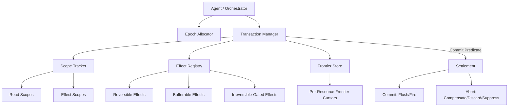
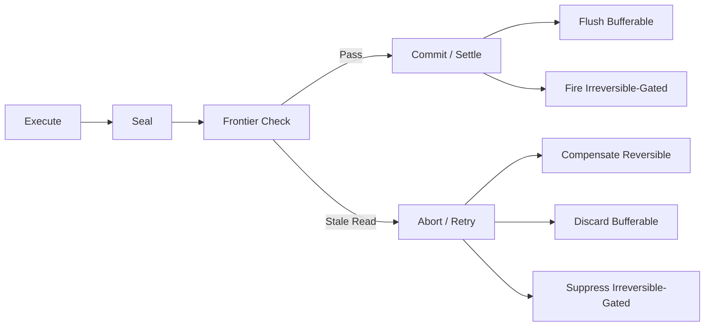

本記事は [arXiv:2602.14849](https://arxiv.org/abs/2602.14849) の解説記事です。

## 論文概要（Abstract）

Atomixは、LLMエージェントのツール呼び出しに対してProgress-Awareトランザクションモデルを導入するランタイムフレームワークである。エージェントが並列実行・投機的分岐・並行リソースアクセスを行う際に発生する副作用の残存、書き込み競合、不可逆操作の漏洩を、エポックベースのフロンティア順序付けと効果分類によって統一的に管理する。著者らは、約2,000行のPythonプロトタイプ実装で、tau-benchにおいて故障確率0.30で57%のタスク成功率（Sagaは7%）、4エージェント並行時にゼロの不変条件違反、メール送信テストでゼロの不可逆効果リークを報告している。

この記事は [Zenn記事: LangGraph×Sagaパターンで実装するAIワークフローの補償トランザクション設計](https://zenn.dev/0h_n0/articles/2456f07d38fc2e) の深掘りです。

## 情報源

- **arXiv ID**: 2602.14849
- **URL**: [https://arxiv.org/abs/2602.14849](https://arxiv.org/abs/2602.14849)
- **著者**: Bardia Mohammadi, Nearchos Potamitis, Lars Klein, Akhil Arora, Laurent Bindschaedler
- **発表年**: 2026（v1: 2026年2月、v2: 2026年5月）
- **分野**: cs.LG, cs.AI, cs.DC, cs.MA
- **ライセンス**: arXiv.org perpetual, non-exclusive license

## 背景と動機（Background & Motivation）

LLMエージェントが外部ツールを呼び出して実世界のタスクを遂行するパラダイムが普及する中、単一エージェントの逐次実行を超えた並列化・並行化の需要が急速に高まっている。複数のプランを投機的に並列探索するアーキテクチャや、複数エージェントが共有リソースに対して同時に操作を行うマルチエージェントシステムが実用化されつつある。

しかし、こうした並列・並行実行環境では、データベーストランザクションにおいて数十年前から研究されてきた問題が、エージェント特有の形で再出現する。著者らは以下の3つの課題を特定している。

**Speculation（投機的実行の副作用残存）**: エージェントが複数のプランを並列に試行し、最良の結果を採用する際、不採用ブランチで実行されたツール呼び出しの副作用がそのまま残存する。たとえば旅行予約エージェントが複数の候補を並行予約した場合、不採用候補の予約がキャンセルされない。

**Contention（並行書き込みの競合）**: 複数のエージェントが同一リソースに対してインターリーブされた書き込みを行うことで、データの整合性が失われる。在庫管理で2エージェントが同時に最後の1個を確保しようとする典型的なLost Update問題がエージェント環境でも発生する。

**Irreversibility（不可逆操作の制御不能）**: メール送信、決済処理、APIウェブフックなど、一度実行すると取り消しできない操作が存在する。従来のSagaパターンやCheckpoint-Replayでは、これらの操作がコミット確定前に外部化されてしまい、アボート後にも効果が残留する。

Garcia-Molina & Salem（1987）のSagaパターンは長時間トランザクションの補償を提供するが、補償自体が失敗するケースやそもそも補償不可能な操作には対応できない。Try-Confirm-Cancel（TCC）は各ツールに3フェーズの実装を要求し、統合コストが高い。Write-Ahead Logging（WAL）はリプレイ時に不可逆操作を再実行してしまう。Atomixはこれらの古典的手法の限界を、エージェントのツール境界に特化したトランザクションモデルで統合的に解決することを目指す。

## 主要な貢献（Key Contributions）

- **Progress-Awareトランザクションモデル**: Naiadの進捗追跡セマンティクスをエージェントのツール呼び出しに適用し、実行・シール・フロンティアチェック・セトルメントの4フェーズに分離する新しいトランザクションモデルを提案した。これにより、「どの効果を一緒にセトルすべきか」と「いつ先行する競合作業が完了したか」を分離して管理できる
- **Effect Taxonomy（効果分類体系）**: ツールの副作用をReversible、Reversible-with-Cost、Bufferable、Irreversible-Gatedの4クラスに分類し、各クラスに応じた外部化タイミングとアボート時処理を規定した。これにより同一トランザクション内で異なる可逆性レベルの操作を統一的に扱える
- **軽量アダプタ統合**: 各ツールにつき平均17行のアダプタコードで統合可能な設計を実現した。TCC（50行/ツール）やMutex+WAL+Rollback（30行/ツール）と比較して統合コストが低い
- **包括的な実験評価**: tau-bench retail、WebArena、OSWorldの3ベンチマークで、故障回復・競合分離・不可逆効果ゲーティングの3軸を独立に評価し、既存の7つのベースラインに対する優位性を実証した

## 技術的詳細（Technical Details）

### Progress-Awareトランザクションモデル

Atomixのランタイムは5つのオブジェクトで構成される。



#### 1. Epochs（エポック）

エポックは、Naiad（Murray et al., 2013）の進捗追跡セマンティクスに着想を得た単調増加の論理タイムスタンプである。オーケストレータがエポックアロケータから取得し、各ツール呼び出しに割り当てる。エポックは作業の論理的順序を定義し、後述するフロンティアとの比較によりコミット可否を判定する基盤となる。

#### 2. Scopes（スコープ）

スコープは、トランザクションがアクセスするリソースの識別子を記録する。読み取りスコープ（Read Scope）と効果スコープ（Effect Scope）の2種類がある。たとえば在庫管理ツールへの呼び出しでは、読み取ったSKUが読み取りスコープに、更新したSKUが効果スコープに記録される。アダプタは実行前に保守的な`may-touch`スコープを宣言し、実行後に実際のスコープに洗練することもできる。

#### 3. Effects（効果）

効果は、ツール呼び出しの副作用を記述する構造体であり、以下の4要素で構成される。

- **リソーススコープ**: この効果が影響するリソースの識別子
- **冪等キー**: 重複実行を防止するための一意識別子（単一プロセス内での重複排除に使用）
- **効果クラス**: 後述する4分類のいずれか
- **ハンドラ**: 効果クラスに応じた補償ハンドラまたはリリースハンドラ

#### 4. Frontiers（フロンティア）

フロンティアは、各リソースに対する単調増加のカーソルである。オーケストレータは、あるリソース$r$に対するフロンティア$\text{frontier}(r)$を値$e$に進行させるが、これはリソース$r$に触れるコミットエポック$e$未満のすべてのトランザクションがファイナライズ（コミットまたはアボート）された場合にのみ行われる。

#### 5. Transactions（トランザクション）

トランザクションは、一緒にセトルすべき読み取りスコープと効果のグループである。トランザクションの粒度は統合レイヤーが選択する（ツール単位、ステップ単位、タスク全体など）。

### コミット述語（Commit Predicate）

トランザクション$T$のコミット判定は以下の述語で定式化される。

$$
T \text{ commits} \iff \forall r \in \mathcal{R}(T): \text{frontier}(r) \geq e(T)
$$

ここで、
- $\mathcal{R}(T)$: トランザクション$T$の読み取りスコープと効果スコープの和集合
- $e(T)$: トランザクション$T$内で記録された読み取り・効果の最大エポック
- $\text{frontier}(r)$: リソース$r$に対するフロンティアの現在値

この述語の意味は、トランザクション$T$が触れたすべてのリソースについて、$T$より前のエポックの作業がすべて完了していることを保証するというものである。厳密には、エポック$e$のトランザクションはエポック$e$未満のピアにのみ依存するため、循環依存が構造的に排除される。

さらに、各リソース$r$は単調増加のバージョンカウンタを管理する。`RegisterRead`は観測時のバージョンを記録し、コミット前に`ReadIsStale`でバージョンが進行していないかを検証する。Stale Read検出時にはトランザクションをアボートし、最新状態でリトライする。

### Effect Taxonomy（効果分類体系）

Atomixは、ツールの副作用を外部化タイミングと可逆性の2軸で4クラスに分類する。

| クラス | 可逆性 | 実行タイミング | 外部化 | セトルメント |
|--------|--------|--------------|--------|-------------|
| Reversible | あり | 即時（Eager） | 呼び出し時 | アボート時に補償 |
| Reversible-with-Cost | あり（返金可能） | 即時（Eager） | 呼び出し時 | アボート時に補償（コスト発生） |
| Bufferable | N/A（遅延のため不要） | 遅延（Deferred） | コミット時 | フラッシュまたは破棄 |
| Irreversible-Gated | なし | ゲート付き | コミット時のみ | コミット時に発火、アボート時に抑制 |

**Reversible**: データベースの更新やファイルの作成など、補償操作によって元に戻せる効果。即時実行され、アボート時に補償ハンドラが呼ばれる。

**Reversible-with-Cost**: 航空券のキャンセルなど、補償は可能だがキャンセル料が発生する効果。Reversibleと同じくEager実行だが、アボート時のコストを意思決定に反映できる。

**Bufferable**: メール送信やメッセージ通知など、コミット確定まで遅延可能な効果。アダプタが効果をバッファに蓄積し、コミット時にフラッシュ、アボート時に破棄する。外部には一切の影響が及ばないため、最も安全なクラスである。

**Irreversible-Gated**: 決済の確定やウェブフック発火など、一度実行すると取り消しできず、かつバッファリングもできない効果。アダプタのゲートがコミット述語の成立まで実行を保留し、コミット時にのみ発火、アボート時には抑制する。

```python
from dataclasses import dataclass
from enum import Enum
from typing import Callable, Optional

class EffectClass(Enum):
    """Atomixの効果分類

    各ツール呼び出しの副作用を分類し、
    外部化タイミングとアボート時処理を決定する。
    """
    REVERSIBLE = "reversible"
    REVERSIBLE_WITH_COST = "reversible_with_cost"
    BUFFERABLE = "bufferable"
    IRREVERSIBLE_GATED = "irreversible_gated"

@dataclass(frozen=True)
class Effect:
    """ツール呼び出しの副作用を記述する構造体

    Args:
        resource_scope: 影響を受けるリソースの識別子
        idempotency_key: 重複実行防止のための一意キー
        effect_class: 効果の分類（4クラス）
        compensate: アボート時の補償ハンドラ（Reversible系のみ）
        release: コミット時の発火ハンドラ（Gated系のみ）
    """
    resource_scope: str
    idempotency_key: str
    effect_class: EffectClass
    compensate: Optional[Callable[[], None]] = None
    release: Optional[Callable[[], None]] = None
```

### トランザクションのライフサイクル

トランザクションは以下の4フェーズを経てセトルされる。



1. **Execute**: ツール呼び出しを実行し、エポック・スコープ・効果を記録する。Reversible効果は即時外部化、Bufferable効果はバッファに蓄積、Irreversible-Gated効果はゲートで保留
2. **Seal**: トランザクションの全ツール呼び出しが完了した時点でシールし、追加の読み取り・効果の記録を禁止する
3. **Frontier Check**: コミット述語 $\forall r \in \mathcal{R}(T): \text{frontier}(r) \geq e(T)$ を評価する。同時にStale Read検出を行い、読み取り時点からバージョンが進行していないかを検証する
4. **Settle**: コミット述語成立かつStale Readなしの場合にコミット。Bufferable効果のフラッシュとIrreversible-Gated効果の発火を実行する。述語不成立またはStale Read検出時にはアボートし、Reversible効果の補償、Bufferable効果の破棄、Irreversible-Gated効果の抑制を行う

## 実装のポイント（Implementation）

Atomixのプロトタイプは約2,000行のPythonで実装されており、単一プロセスで動作する。以下に実装上の重要な設計判断を整理する。

**アダプタの軽量性**: 各ツールのAtomix統合に必要なアダプタコードは平均17行である。アダプタはスコープ抽出器、効果ビルダー、効果クラス指定、オプションのハンドラを宣言するだけでよい。TCC（50行/ツール）やMutex+WAL+Rollback（30行/ツール）と比較して統合コストが低い。

**冪等キーによる重複排除**: 単一プロセス内で冪等キーを管理し、同一効果の二重実行を防止する。分散環境への拡張ではシャードされたフロンティアストアとコンセンサスプロトコルが必要になるが、現在の実装では単一プロセスの範囲で正確性を保証している。

**保守的スコープ宣言**: アダプタは実行前に`may-touch`スコープを保守的に宣言する。これにより、フロンティアの進行がツール実行完了を待たずに安全に管理できる。実行後にスコープを洗練することで、過度な直列化を回避する。

**Stale Read検出のアルゴリズム**: Algorithm A.3として定義されている。各リソースは単調増加のバージョンカウンタを持ち、コミット済み書き込みでインクリメントされる。`RegisterRead`は観測時のバージョンを保存し、`ReadIsStale`はコミット前にバージョンが進行していないかを検証する。

**ランタイムオーバーヘッド**: Atomixのラッパー処理はマイクロ秒レベルであり、ツール呼び出し自体のレイテンシ（通常ミリ秒〜秒オーダー）に対して無視できるレベルである。

## Production Deployment Guide

### AWS実装パターン（コスト最適化重視）

Atomixのトランザクションランタイムをプロダクション環境にデプロイする際のAWS構成を、トラフィック量別に示す。

**トラフィック量別の推奨構成**:

| 構成 | トラフィック | サービス構成 | 月額概算 |
|------|-------------|-------------|---------|
| Small | ~100 req/日 | Lambda + DynamoDB + SQS | $50-150 |
| Medium | ~1,000 req/日 | ECS Fargate + ElastiCache + SQS | $300-800 |
| Large | 10,000+ req/日 | EKS + Karpenter + Spot + ElastiCache | $2,000-5,000 |

**Small構成の詳細**: Lambda関数でエージェントオーケストレータとAtomixランタイムを同一プロセスで実行する。フロンティアストアにDynamoDB On-Demandを使用し、Bufferable効果のバッファにSQSを利用する。Irreversible-Gated効果のゲート判定はDynamoDBのConditionExpressionで原子的に実行する。Lambda 1024MB、タイムアウト300秒で月額$50-150。

**Medium構成の詳細**: ECS Fargate（0.5 vCPU、1GB RAM）でAtomixランタイムを常駐させる。フロンティアストアにElastiCache（Redis）を使用し、低レイテンシのフロンティア更新を実現する。Fargateタスク数は2-4で可用性を確保。月額$300-800。

**Large構成の詳細**: EKS上でKarpenter Provisioner（Spot優先）を使用し、エージェント数に応じた自動スケーリングを行う。フロンティアストアはElastiCache Cluster Mode、効果バッファはSQS FIFO。Spot Instancesで最大90%のコスト削減が可能。月額$2,000-5,000。

**コスト試算の注意事項**: 上記は2026年7月時点のAWS ap-northeast-1（東京）リージョン料金に基づく概算値である。実際のコストはトラフィックパターン、LLM API呼び出し頻度、ツール実行時間により変動する。最新料金はAWS料金計算ツールでの確認を推奨する。

### Terraformインフラコード

**Small構成（Serverless）**:

```hcl
# Atomix Transaction Runtime - Small (Serverless)
# Lambda + DynamoDB + SQS

# --- フロンティアストア (DynamoDB) ---
resource "aws_dynamodb_table" "atomix_frontiers" {
  name         = "atomix-frontiers"
  billing_mode = "PAY_PER_REQUEST"  # On-Demand でコスト最適化
  hash_key     = "resource_id"

  attribute {
    name = "resource_id"
    type = "S"
  }

  server_side_encryption {
    enabled = true  # KMS暗号化
  }

  tags = {
    Project = "atomix-runtime"
    Env     = "production"
  }
}

# --- 効果バッファ (SQS) ---
resource "aws_sqs_queue" "atomix_effect_buffer" {
  name                       = "atomix-effect-buffer.fifo"
  fifo_queue                 = true
  content_based_deduplication = true  # 冪等キーによる重複排除
  visibility_timeout_seconds = 300
  message_retention_seconds  = 86400

  tags = {
    Project = "atomix-runtime"
  }
}

# --- Lambda関数 (Atomixランタイム) ---
resource "aws_lambda_function" "atomix_orchestrator" {
  function_name = "atomix-orchestrator"
  runtime       = "python3.12"
  handler       = "main.handler"
  memory_size   = 1024  # トランザクション管理に十分なメモリ
  timeout       = 300
  filename      = "lambda.zip"

  environment {
    variables = {
      FRONTIER_TABLE  = aws_dynamodb_table.atomix_frontiers.name
      EFFECT_QUEUE    = aws_sqs_queue.atomix_effect_buffer.url
      LOG_LEVEL       = "INFO"
    }
  }

  tracing_config {
    mode = "Active"  # X-Ray トレーシング
  }

  tags = {
    Project = "atomix-runtime"
  }
}

# --- IAMロール (最小権限) ---
resource "aws_iam_role_policy" "atomix_lambda_policy" {
  name = "atomix-lambda-policy"
  role = aws_iam_role.atomix_lambda_role.id

  policy = jsonencode({
    Version = "2012-10-17"
    Statement = [
      {
        Effect = "Allow"
        Action = [
          "dynamodb:GetItem",
          "dynamodb:PutItem",
          "dynamodb:UpdateItem"
        ]
        Resource = aws_dynamodb_table.atomix_frontiers.arn
      },
      {
        Effect = "Allow"
        Action = [
          "sqs:SendMessage",
          "sqs:ReceiveMessage",
          "sqs:DeleteMessage"
        ]
        Resource = aws_sqs_queue.atomix_effect_buffer.arn
      }
    ]
  })
}
```

**Large構成（Container）**:

```hcl
# Atomix Transaction Runtime - Large (EKS + Spot)

# --- EKSクラスタ ---
module "eks" {
  source          = "terraform-aws-modules/eks/aws"
  version         = "20.31.0"
  cluster_name    = "atomix-cluster"
  cluster_version = "1.31"

  vpc_id     = module.vpc.vpc_id
  subnet_ids = module.vpc.private_subnets

  cluster_endpoint_public_access = false  # プライベートアクセスのみ

  tags = {
    Project = "atomix-runtime"
  }
}

# --- Karpenter Provisioner (Spot優先) ---
resource "kubectl_manifest" "karpenter_nodepool" {
  yaml_body = yamlencode({
    apiVersion = "karpenter.sh/v1"
    kind       = "NodePool"
    metadata   = { name = "atomix-agents" }
    spec = {
      template = {
        spec = {
          requirements = [
            { key = "karpenter.sh/capacity-type", operator = "In", values = ["spot", "on-demand"] },
            { key = "node.kubernetes.io/instance-type", operator = "In",
              values = ["m7i.large", "m7i.xlarge", "m6i.large", "m6i.xlarge"] }
          ]
        }
      }
      limits   = { cpu = "64", memory = "128Gi" }
      disruption = {
        consolidationPolicy = "WhenEmptyOrUnderutilized"
        consolidateAfter    = "30s"
      }
    }
  })
}

# --- ElastiCache (フロンティアストア) ---
resource "aws_elasticache_replication_group" "atomix_frontiers" {
  replication_group_id = "atomix-frontiers"
  description          = "Frontier store for Atomix runtime"
  engine               = "redis"
  engine_version       = "7.1"
  node_type            = "cache.r7g.large"
  num_cache_clusters   = 2  # Multi-AZ

  at_rest_encryption_enabled = true
  transit_encryption_enabled = true

  tags = {
    Project = "atomix-runtime"
  }
}

# --- AWS Budgets (予算アラート) ---
resource "aws_budgets_budget" "atomix_monthly" {
  name         = "atomix-monthly-budget"
  budget_type  = "COST"
  limit_amount = "5000"
  limit_unit   = "USD"
  time_unit    = "MONTHLY"

  notification {
    comparison_operator       = "GREATER_THAN"
    threshold                 = 80
    threshold_type            = "PERCENTAGE"
    notification_type         = "ACTUAL"
    subscriber_email_addresses = ["ops@example.com"]
  }
}
```

### 運用・監視設定

**CloudWatch Logs Insights クエリ**（トランザクション異常検知）:

```
# コミット失敗率の時間推移
fields @timestamp, @message
| filter event = "transaction_settled"
| stats count(*) as total,
        sum(case when outcome = "abort" then 1 else 0 end) as aborts,
        sum(case when outcome = "abort" then 1 else 0 end) * 100.0 / count(*) as abort_rate
| by bin(1h) as hour
| sort hour desc
```

**CloudWatchアラーム設定（Python）**:

```python
import boto3

def setup_atomix_alarms(sns_topic_arn: str) -> None:
    """Atomixランタイムの監視アラームを設定する

    Args:
        sns_topic_arn: 通知先SNSトピックのARN
    """
    cw = boto3.client("cloudwatch")

    # アボート率スパイク検知
    cw.put_metric_alarm(
        AlarmName="atomix-high-abort-rate",
        MetricName="TransactionAbortRate",
        Namespace="Atomix/Runtime",
        Statistic="Average",
        Period=300,
        EvaluationPeriods=3,
        Threshold=30.0,  # 30%超過で警告
        ComparisonOperator="GreaterThanThreshold",
        AlarmActions=[sns_topic_arn],
    )

    # フロンティア停滞検知（ハングエージェント対策）
    cw.put_metric_alarm(
        AlarmName="atomix-frontier-stall",
        MetricName="FrontierAdvancementLatency",
        Namespace="Atomix/Runtime",
        Statistic="Maximum",
        Period=60,
        EvaluationPeriods=5,
        Threshold=120000,  # 2分間フロンティア停滞で警告
        ComparisonOperator="GreaterThanThreshold",
        AlarmActions=[sns_topic_arn],
    )
```

**X-Ray トレーシング設定（Python）**:

```python
from aws_xray_sdk.core import xray_recorder, patch_all

patch_all()  # boto3自動計装

@xray_recorder.capture("atomix_commit_check")
def check_commit_predicate(transaction_id: str) -> bool:
    """コミット述語のトレーシング付き評価

    Args:
        transaction_id: 評価対象トランザクションID

    Returns:
        コミット可否
    """
    subsegment = xray_recorder.current_subsegment()
    subsegment.put_annotation("tx_id", transaction_id)
    subsegment.put_metadata("scopes", get_scopes(transaction_id))
    # ... コミット述語評価ロジック
    return result
```

**Cost Explorer自動レポート（Python）**:

```python
import boto3
from datetime import date, timedelta

def daily_cost_report() -> dict[str, float]:
    """日次コストレポートを取得し閾値超過時にSNS通知

    Returns:
        サービス別コストの辞書
    """
    ce = boto3.client("ce")
    today = date.today()
    response = ce.get_cost_and_usage(
        TimePeriod={
            "Start": (today - timedelta(days=1)).isoformat(),
            "End": today.isoformat(),
        },
        Granularity="DAILY",
        Metrics=["BlendedCost"],
        GroupBy=[{"Type": "DIMENSION", "Key": "SERVICE"}],
    )
    costs = {
        g["Keys"][0]: float(g["Metrics"]["BlendedCost"]["Amount"])
        for g in response["ResultsByTime"][0]["Groups"]
    }
    total = sum(costs.values())
    if total > 100:  # $100/日超過でSNS通知
        sns = boto3.client("sns")
        sns.publish(
            TopicArn="arn:aws:sns:ap-northeast-1:ACCOUNT:atomix-alerts",
            Subject=f"Atomix daily cost alert: ${total:.2f}",
            Message=str(costs),
        )
    return costs
```

### コスト最適化チェックリスト

**アーキテクチャ選択**:
- [ ] トラフィック量に応じた構成を選択（~100 req/日: Serverless、~1,000: Hybrid、10,000+: Container）
- [ ] フロンティアストアの選択（DynamoDB On-Demand vs ElastiCache）

**リソース最適化**:
- [ ] EC2/EKS: Spot Instances優先（Karpenter `spot,on-demand`順序）
- [ ] Reserved Instances: 1年コミットで最大72%削減
- [ ] Savings Plans: Compute Savings Plans検討
- [ ] Lambda: メモリサイズの最適化（Power Tuning実施）
- [ ] ECS/EKS: アイドル時のスケールダウン（Karpenter consolidation）
- [ ] ElastiCache: ノードタイプの適正化（Graviton3 r7gシリーズ推奨）

**LLMコスト削減**:
- [ ] Bedrock Batch API使用（非リアルタイム処理で50%削減）
- [ ] Prompt Caching有効化（30-90%削減）
- [ ] モデル選択ロジック（簡易タスクはHaiku、複雑タスクはSonnet/Opus）
- [ ] トークン数制限（max_tokensの適正設定）
- [ ] ツール呼び出し結果のキャッシュ（同一スコープの読み取り重複排除）

**監視・アラート**:
- [ ] AWS Budgets設定（月次予算アラート）
- [ ] CloudWatch アラーム（アボート率、フロンティア停滞）
- [ ] Cost Anomaly Detection有効化
- [ ] 日次コストレポート自動送信
- [ ] X-Rayトレーシングでトランザクション性能可視化

**リソース管理**:
- [ ] 未使用リソース削除（定期棚卸し）
- [ ] タグ戦略（Project/Env/Ownerタグの徹底）
- [ ] DynamoDBのTTL設定（古いフロンティアデータの自動削除）
- [ ] ログのライフサイクルポリシー（S3 Glacier移行）
- [ ] 開発環境の夜間停止（EKSノード0台スケールダウン）

## 実験結果（Results）

著者らは、Atomix（Tx-Full）を7つのベースラインと比較評価している。ベースラインはNo-Tx（制御なし）、Saga-Compensation、Checkpoint-Replay、Per-Call-Lock、Workflow-Lock、OCC-Revalidate、TCC-Confirm、Mutex+WAL+Rollbackである。

### RQ1: 故障回復（Fault Recovery）

tau-bench retail（GPT-4.1、max_steps=30、N=30タスク）において、故障注入確率$f_p = 0.30$でTx-Fullは57%のクリーンタスク成功率を達成したと報告されている。Saga-Compensationは7%、No-Txは0%に低下した。Checkpoint-Replayは53%で統計的に同等（$p = 1.0$）だが、後続のRQ3テストで不可逆効果に対する脆弱性が明らかになっている。故障注入は5クラス（F1: 実行前、F2: 効果後/リターン前、F3: 補償中、F4: 重複配信、F5: タイムアウト）をBernoulli確率$f_p$で適用している。

### RQ2: フロンティアゲート分離（Frontier-Gated Isolation）

4エージェントが共有注文リソースに対して並行操作を行うテストで、Tx-Fullは100回のスケジュールトレースにわたりゼロの不変条件違反を記録した（95%信頼区間の上限: 3.7%以下）。Workflow-Lockも安全性は同等だが、競合下で平均112.3msの待機時間が発生した。Per-Call-Lockは4.91件/実行、No-Txは4.97件/実行の不変条件違反を記録した。OCC-Revalidateは安全だが、4エージェント時に100実行あたり3,000件のコミット拒否が発生し、スループットが低下した。

### RQ3: 不可逆効果ゲーティング（Irreversible-Effect Gating）

実際のSMTP/ウェブフックシンクを使用した500回の有効送信と500回の無効送信のテストで、Tx-Fullは0/500のリークを達成した（95%信頼区間: [0, 0.74%]）。Saga-Compensationは400/500（80%）のリーク、Checkpoint-Replayは200/500（40%）のリークを記録した。TCC-ConfirmとMutex+WAL+Rollbackもゼロリークだが、統合コストが高い。全ベースラインが500/500の正当な送信を正しく処理していることが陽性対照で確認されている。

### RQ5: 複合ストレステスト

4エージェント、2つの競合注文、読み取り→プラン→書き込み→確認のワークフローを組み合わせた複合テストで、Tx-Fullは$f_p = 0.10$で84%、$f_p = 0.30$で65%のrun-clean率を達成し、Pareto最適であると報告されている。待機時間ゼロ（ベースラインオーバーヘッド10.1ms）、拒否コミットゼロを実現している。同等の安全性を持つベースライン（OCC、Mutex-Workflow、TCC-Confirm）は二次的コスト（待機時間、拒否、統合複雑性）を支払っている。

### ベンチマーク横断検証

tau-bench retail以外に、WebArena（GPT-5、reasoning_effort=medium）およびOSWorld（Claude Sonnet 4）でも検証が行われており、Atomixの安全性保証がベンチマーク横断的に維持されることが報告されている。

## 実運用への応用（Practical Applications）

Atomixのトランザクションモデルは、Zenn記事で解説されているLangGraph×Sagaパターンの設計を大幅に拡張する視点を提供する。

**Sagaパターンとの違い**: 関連Zenn記事ではSagaパターンによる補償トランザクション設計を扱っているが、Atomixは補償が不可能な操作（Irreversible-Gated）や遅延可能な操作（Bufferable）を分類体系に組み込むことで、Sagaの「すべての操作に補償を定義する」という前提を緩和している。実務では、メール送信やSlack通知など補償不可能な操作が多く存在するため、この分類体系は重要な設計指針となる。

**マルチエージェントECサイト**: 商品推薦、在庫管理、決済処理を別エージェントが担当するECシステムでは、在庫の二重確保（Contention）と決済の二重実行（Irreversibility）が実課題となる。AtomixのフロンティアベースのスコープトラッキングとIrreversible-Gatedクラスの組み合わせにより、これらを統一的に管理できる。

**RAGパイプラインの並列実行**: 複数の検索戦略を投機的に並列実行するRAGシステムでは、不採用ブランチがベクトルDBに書き込んだ中間結果の残存が問題になる。AtomixのReversible効果とフロンティア順序付けにより、不採用ブランチの副作用を確実にロールバックできる。

**オーバーヘッドの実用性**: ランタイムオーバーヘッドがマイクロ秒レベルであることは、ツール呼び出し（通常ミリ秒〜秒）やLLM推論（秒オーダー）が支配的なエージェントワークフローにおいて、トランザクション管理のコストが無視できることを意味する。

## 関連研究（Related Work）

- **Sagas（Garcia-Molina & Salem, 1987）**: 長時間トランザクションの補償パターンの原型。Atomixは補償不可能な操作への対応と、フロンティアベースの進捗追跡を追加した
- **Try-Confirm-Cancel（Pardon & Pautasso, 2014）**: 各操作に3フェーズの実装を要求する。Atomixは効果分類により3フェーズが必要なのはIrreversible-Gatedクラスのみに限定し、統合コストを削減した
- **Write-Ahead Logging（Mohan et al., 1992, ARIES）**: 障害回復の古典的手法。リプレイ時に不可逆操作を再実行する問題をAtomixは効果分類で解決した
- **Naiad / Watermarks（Murray et al., 2013; Flink）**: ストリーム処理の進捗追跡メカニズム。Atomixはこのセマンティクスをエージェントのツール境界に適用した
- **Calvin / Deterministic Scheduling（Thomson et al., 2012）**: 順序付きトランザクション。Atomixはエポックベースの順序付けで類似の保証を提供しつつ、効果分類による柔軟性を追加した
- **Escrow Locks（O'Neil, 1986）**: 部分ロック機構。Atomixのスコープ管理はEscrow Locksの概念を拡張している

## まとめと今後の展望

Atomixは、LLMエージェントのツール呼び出しにProgress-Awareトランザクションモデルを導入し、投機的実行の副作用残存、並行書き込みの競合、不可逆操作のリークという3つの課題を統一的に解決するフレームワークである。約2,000行のPython実装と平均17行/ツールのアダプタで、マイクロ秒レベルのオーバーヘッドで安全性保証を提供する点が特徴である。

著者らが認めている制約として、現在の実装が単一プロセスに限定されている点、複数の不可逆操作間のアトミックな外部化がツールレイヤーの上では不可能である点、アダプタのメタデータ正確性が信頼基盤の一部である点が挙げられる。今後の研究方向として、シャードされたフロンティアストアとコンセンサスプロトコルによる分散デプロイメント、アダプタメタデータのリンター/ファザー、ハングエージェント検出機構の実装が挙げられている。

エージェントワークフローの信頼性がプロダクション環境で不可欠となる中、データベーストランザクションの知見をエージェント固有の問題に適応させるAtomixのアプローチは、Sagaパターンを超えた次世代の障害耐性設計の指針となりうる。

## 参考文献

- **arXiv**: [https://arxiv.org/abs/2602.14849](https://arxiv.org/abs/2602.14849)
- **Related Zenn article**: [https://zenn.dev/0h_n0/articles/2456f07d38fc2e](https://zenn.dev/0h_n0/articles/2456f07d38fc2e)
- Garcia-Molina, H., & Salem, K. (1987). Sagas. ACM SIGMOD Record, 16(3), 249-259.
- Murray, D. G., McSherry, F., Isaacs, R., Isard, M., Barham, P., & Abadi, M. (2013). Naiad: A Timely Dataflow System. SOSP 2013.
- Pardon, G., & Pautasso, C. (2014). Towards Distributed Atomic Transactions over RESTful Services. REST: Advanced Research Topics and Practical Applications.
- Mohan, C., Haderle, D., Lindsay, B., Pirahesh, H., & Schwarz, P. (1992). ARIES: A Transaction Recovery Method. ACM TODS, 17(1).
- Thomson, A., Diamond, T., Weng, S.-C., Ren, K., Shao, P., & Abadi, D. J. (2012). Calvin: Fast Distributed Transactions for Partitioned Database Systems. SIGMOD 2012.
