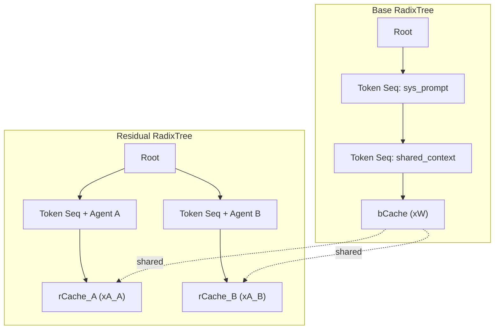

本記事は [arXiv:2604.06370](https://arxiv.org/abs/2604.06370) の解説記事です。

## 論文概要（Abstract）

ForkKV は、複数の LoRA アダプタを搭載したエージェントを単一の LLM 基盤モデル上で効率的にサービングするためのシステムである。著者らは、OS のプロセスフォークにおける Copy-on-Write（CoW）の原理を KV キャッシュ管理に適用し、KV キャッシュを共有可能な Base Cache（bCache）とアダプタ固有の Residual Cache（rCache）に分離する手法を提案している。SGLang v0.5.6 上に約 3K 行の Python と Triton カーネルで実装され、エージェントあたりのメモリを最大 12.7 倍削減し、ReAct ワークフローで最大 3.04 倍のスループット向上を達成したと報告されている。

この記事は [Zenn記事: vLLM Multi-LoRAで複数タスク特化モデルを1台のGPUに集約するルーティング設計](https://zenn.dev/0h_n0/articles/a21229e9c893f0) の深掘りです。

## 情報源

- **arXiv ID**: 2604.06370
- **URL**: [https://arxiv.org/abs/2604.06370](https://arxiv.org/abs/2604.06370)
- **著者**: Shao Wang, Rui Ren, Lin Gui
- **投稿日**: 2026年4月7日
- **分野**: cs.DC（分散・並列・クラスタコンピューティング）, cs.LG（機械学習）
- **実装規模**: 約3K行 Python + Triton カーネル（SGLang v0.5.6 ベース）

## 背景と動機（Background & Motivation）

LLM ベースのエージェントシステムでは、タスクごとに特化した LoRA アダプタを切り替えて使用する Multi-LoRA サービングが一般的になりつつある。しかし、従来の KV キャッシュ管理には根本的な問題がある。

LoRA アダプタは元のモデルの重み $W$ に対して低ランク行列 $A_i B_i$ を加算する。つまり、同一の入力トークン列 $x$ に対しても、アダプタごとに異なる KV キャッシュが生成される。

$$Y_i = xW + xA_i B_i$$

この性質により、複数のエージェントが同一のシステムプロンプトやコンテキストを共有していても、従来の prefix caching ではキャッシュを共有できない。例えば、16 エージェントが 32K トークンのコンテキストを持つ場合、各エージェントが独立に KV キャッシュを保持する必要があり、Llama3-8B（rank=16）で約 64GB のメモリが必要となる。エージェント数の増加に伴い、この冗長なメモリ消費がスループットのボトルネックとなり、decode バッチサイズの縮小を引き起こす。

## 主要な貢献（Key Contributions）

- **Copy-on-Write KV キャッシュ管理**: KV キャッシュを Base Cache（bCache: $xW$）と Residual Cache（rCache: $xA_i$）に分離し、bCache を全エージェントで共有する CoW 方式を提案。メモリ消費を $M_R = 1/N + r/n$ に圧縮する
- **DualRadixTree**: 共有 bCache 用の Base RadixTree（トークンシーケンスで索引）とアダプタ固有の rCache 用の Residual RadixTree（トークン + エージェント ID で索引）を独立に管理するデータ構造を設計。独立した LRU 退避ポリシーにより部分キャッシュヒットも活用可能にした
- **ResidualAttention Kernel**: 分離された KV キャッシュから on-chip SRAM 上で直接 Key を再構成し、行列結合律を活用して高コストな投影演算を最小化する 3 段階の Triton カーネルを実装した

## 技術的詳細（Technical Details）

### Copy-on-Write KV キャッシュ分離

ForkKV の中核は、LoRA の加算構造を利用した KV キャッシュの分離にある。通常の LoRA 適用後の出力は以下のように表現される。

$$Y_i = xW + xA_i B_i$$

ここで $x \in \mathbb{R}^{s \times d}$ は入力（$s$: シーケンス長、$d$: 入力次元）、$W \in \mathbb{R}^{d \times n}$ はベースモデルの重み（$n$: 出力次元）、$A_i \in \mathbb{R}^{d \times r}$, $B_i \in \mathbb{R}^{r \times n}$ は LoRA アダプタ $i$ の低ランク行列（$r$: LoRA ランク）である。

ForkKV はこれを2つのキャッシュに分離する。

- **bCache** = $xW$: ベースモデルの投影結果。全アダプタで共通であり共有可能
- **rCache** = $xA_i$: LoRA の低ランク投影結果。アダプタ固有だが次元が $r \ll n$ と小さい

元の KV キャッシュは以下のように完全に復元できる。

$$Y_i = \text{bCache} + \text{rCache}_i \times B_i$$

#### メモリ消費比率

$N$ 個のエージェントが並行動作する場合の、分離方式と従来方式のメモリ消費比率 $M_R$ は以下で与えられる（論文 Equation 3）。

$$M_R = \frac{sn + N \cdot sr}{N \cdot sn} = \frac{1}{N} + \frac{r}{n}$$

ここで $sn$ は共有 bCache のサイズ、$sr$ は各エージェントの rCache のサイズである。$N$ が十分大きい場合、$M_R \approx r/n$ となる。具体的には $r = 16$, $n = 1024$ のとき $M_R \approx 1.56\%$ であり、エージェントあたりのメモリを大幅に削減できる。

著者らは、16 エージェントが 32K コンテキストを持つ Llama3-8B の例で、従来方式の約 64GB に対して ForkKV では約 5GB（共有 bCache 1 つ + 16 個の rCache）に削減され、11.8 倍のメモリ効率改善を達成したと報告している。

### DualRadixTree

ForkKV は、分離された 2 種類のキャッシュを効率的に管理するため、DualRadixTree と呼ばれるデータ構造を導入している。



- **Base RadixTree**: トークンシーケンスのみをキーとして bCache を索引する。全エージェントが共有するため、同一プロンプトに対するキャッシュヒット率が飛躍的に向上する
- **Residual RadixTree**: トークンシーケンスとエージェント ID の組をキーとして rCache を索引する。アダプタ固有の差分のみを管理する

2 つの RadixTree は独立した LRU 退避ポリシーを持つ。bCache が退避されても rCache が残存している場合、ベース投影のみを再計算して rCache を再利用する「部分キャッシュヒット」が可能である。新しいエージェントのフォーク時には、bCache への参照カウントを増加させ、rCache のみを新規に CoW アロケーションする。

### ResidualAttention Kernel（3段階アルゴリズム）

分離された KV キャッシュを用いた Attention 計算は、単純に実装すると bCache と rCache の結合に伴う中間テンソルの具現化が必要となり、メモリ帯域のボトルネックを引き起こす。ForkKV は以下の 3 段階アルゴリズムでこれを回避する。

**Stage 1: On-the-Fly Key 再構成（Deferred RoPE）**

bCache と rCache をブロック単位で on-chip SRAM にストリーミングし、Key を再構成する。

$$K_{\text{lora}} = K_{\text{res}} \cdot B_k$$

$$K = K_{\text{base}} + K_{\text{lora}}$$

ここで重要なのは Deferred RoPE（遅延位置エンコーディング）である。rCache は次元が $r$ であり、通常の RoPE を直接適用できない。そのため、キャッシュ格納時には RoPE を適用せず、Attention 計算時に Key を再構成した後に RoPE を適用する。

**Stage 2: Base/Residual Attention 分離計算（Online Softmax）**

Base と Residual の Attention スコアを分離して計算し、Online Softmax により数値安定性を保つ。ブロックごとに running statistics（最大値 $m$ と正規化係数 $l$）を更新し、最終的な Attention 出力を得る。

$$\text{Attn}(Q, K, V) = \text{softmax}\left(\frac{QK^T}{\sqrt{d_k}}\right) V$$

**Stage 3: 行列結合律による効率的融合**

Value の再構成について、行列結合律を活用して高コスト演算を最小化する。

$$\sum \text{sm}(QK^T) V = \sum \text{sm}(QK^T) V_{\text{base}} + \left(\sum \text{sm}(QK^T) V_{\text{res}}\right) \cdot B_v$$

$V_{\text{res}} \cdot B_v$ の投影（$r \times n$ の行列乗算）は各ブロック内で実行する代わりに、カーネル終了時に 1 回のみ実行すればよい。これにより $V_{\text{res}}$ の低ランク次元 $r$ での蓄積を内部ループで行い、高次元 $n$ への投影を最後に 1 回だけ行うことで、計算量を大幅に削減している。

## 実装のポイント（Implementation）

### SGLang 統合と Triton カーネル

ForkKV は SGLang v0.5.6 をベースに実装されている。主な変更点は以下の通りである。

- **LoRA 置換モジュール**: 線形投影レイヤーを ForkKV 対応のカスタムモジュールに置換し、bCache と rCache を分離して格納する
- **DualRadixTree**: SGLang ネイティブの RadixCache を拡張し、Base と Residual の 2 つの RadixTree を管理する
- **Triton カーネル**: Prefill フェーズと Decode フェーズで別々のカーネルバージョンを用意。Prefill は長いシーケンスに対するバッチ処理を最適化し、Decode は単一トークン生成に特化したメモリアクセスパターンを採用している

### Deferred RoPE の実装

通常の推論パイプラインでは、Key の生成直後に RoPE を適用してからキャッシュに格納する。しかし ForkKV では rCache の次元が $r$（例: 16）であり、bCache の次元 $n$（例: 1024）と異なるため、同一の RoPE を直接適用できない。

そこで ForkKV は RoPE の適用を Attention カーネル内に遅延させる。Stage 1 で $K_{\text{base}} + K_{\text{res}} \cdot B_k$ により次元 $n$ の完全な Key を再構成した後に RoPE を適用する。この設計により、キャッシュ格納のオーバーヘッドを増やすことなく、正確な位置エンコーディングを実現している。

## Production Deployment Guide

### AWS 実装パターン（コスト最適化重視）

ForkKV は GPU 上での Multi-LoRA サービングに特化したシステムであり、デプロイ時には GPU インスタンスの選定とメモリ管理が重要となる。以下にトラフィック量別の推奨構成を示す。

**トラフィック量別の推奨構成**:

| 規模 | 構成 | 月額概算 | 用途 |
|------|------|----------|------|
| Small (~100 req/日) | EC2 g5.xlarge (L4) + SGLang | $700-1,200 | 開発・検証環境 |
| Medium (~1,000 req/日) | EC2 g5.2xlarge x2 + ALB | $2,500-4,000 | 本番小規模 |
| Large (10,000+ req/日) | EKS + g5.12xlarge Spot + Karpenter | $8,000-15,000 | 本番大規模 |

**コスト削減テクニック**:
- Spot Instances 活用で最大 90% 削減（g5 インスタンスの Spot 可用性は比較的高い）
- Reserved Instances 1年契約で最大 40% 削減
- ForkKV の CoW メモリ削減により、同一 GPU でより多くのエージェントを収容可能（従来比 12.7 倍）
- decode バッチサイズ 12.0 倍増加によるスループット向上で、必要 GPU 数を削減

注: 上記は記事生成時点の AWS ap-northeast-1（東京）リージョン料金に基づく概算値である。実際のコストはトラフィックパターン、リージョン、バースト使用量により変動する。最新料金は AWS 料金計算ツールで確認を推奨する。

### Terraform インフラコード

#### Small 構成（単一 GPU インスタンス）

```hcl
# ForkKV SGLang サーバー on EC2 GPU
# Small構成: 開発・検証向け

terraform {
  required_version = ">= 1.5"
  required_providers {
    aws = {
      source  = "hashicorp/aws"
      version = "~> 5.0"
    }
  }
}

provider "aws" {
  region = "ap-northeast-1"
}

# VPC と基盤ネットワーク
module "vpc" {
  source  = "terraform-aws-modules/vpc/aws"
  version = "~> 5.0"

  name = "forkkv-vpc"
  cidr = "10.0.0.0/16"

  azs             = ["ap-northeast-1a", "ap-northeast-1c"]
  private_subnets = ["10.0.1.0/24", "10.0.2.0/24"]
  public_subnets  = ["10.0.101.0/24", "10.0.102.0/24"]

  enable_nat_gateway = true
  single_nat_gateway = true
}

# IAM ロール（最小権限）
resource "aws_iam_role" "forkkv_server" {
  name = "forkkv-server-role"

  assume_role_policy = jsonencode({
    Version = "2012-10-17"
    Statement = [{
      Action = "sts:AssumeRole"
      Effect = "Allow"
      Principal = { Service = "ec2.amazonaws.com" }
    }]
  })
}

resource "aws_iam_role_policy_attachment" "ssm" {
  role       = aws_iam_role.forkkv_server.name
  policy_arn = "arn:aws:iam::aws:policy/AmazonSSMManagedInstanceCore"
}

resource "aws_iam_instance_profile" "forkkv" {
  name = "forkkv-instance-profile"
  role = aws_iam_role.forkkv_server.name
}

# セキュリティグループ
resource "aws_security_group" "forkkv" {
  name_prefix = "forkkv-"
  vpc_id      = module.vpc.vpc_id

  ingress {
    from_port   = 30000
    to_port     = 30000
    protocol    = "tcp"
    cidr_blocks = [module.vpc.vpc_cidr_block]
    description = "SGLang API"
  }

  egress {
    from_port   = 0
    to_port     = 0
    protocol    = "-1"
    cidr_blocks = ["0.0.0.0/0"]
  }
}

# GPU インスタンス
resource "aws_instance" "forkkv_server" {
  ami                    = data.aws_ami.deep_learning.id
  instance_type          = "g5.xlarge"
  iam_instance_profile   = aws_iam_instance_profile.forkkv.name
  subnet_id              = module.vpc.private_subnets[0]
  vpc_security_group_ids = [aws_security_group.forkkv.id]

  root_block_device {
    volume_size = 200
    volume_type = "gp3"
    throughput  = 250
  }

  user_data = <<-EOF
    #!/bin/bash
    pip install "sglang[all]==0.5.6"
    # ForkKV パッチ適用（リポジトリから）
    git clone https://github.com/forkkv/forkkv.git /opt/forkkv
    cd /opt/forkkv && pip install -e .
    # SGLang サーバー起動（ForkKV 有効化）
    python -m sglang.launch_server \
      --model-path meta-llama/Llama-3-8B \
      --enable-forkkv \
      --max-loras 16 \
      --port 30000
  EOF

  tags = { Name = "forkkv-server" }
}

data "aws_ami" "deep_learning" {
  most_recent = true
  owners      = ["amazon"]

  filter {
    name   = "name"
    values = ["Deep Learning AMI GPU PyTorch *-Ubuntu-20.04-*"]
  }
}

# CloudWatch アラーム
resource "aws_cloudwatch_metric_alarm" "gpu_utilization" {
  alarm_name          = "forkkv-gpu-utilization-low"
  comparison_operator = "LessThanThreshold"
  evaluation_periods  = 3
  metric_name         = "GPUUtilization"
  namespace           = "ForkKV"
  period              = 300
  statistic           = "Average"
  threshold           = 20
  alarm_description   = "GPU utilization below 20% for 15 minutes"
}
```

#### Large 構成（EKS + Karpenter + Spot）

```hcl
# ForkKV on EKS with Karpenter
# Large構成: 本番大規模向け

module "eks" {
  source  = "terraform-aws-modules/eks/aws"
  version = "~> 20.0"

  cluster_name    = "forkkv-cluster"
  cluster_version = "1.31"

  vpc_id     = module.vpc.vpc_id
  subnet_ids = module.vpc.private_subnets

  cluster_addons = {
    coredns    = { most_recent = true }
    kube-proxy = { most_recent = true }
    vpc-cni    = { most_recent = true }
  }

  eks_managed_node_groups = {
    system = {
      instance_types = ["m5.large"]
      min_size       = 2
      max_size       = 4
      desired_size   = 2
    }
  }
}

# Karpenter NodePool（Spot 優先 GPU ノード）
resource "kubectl_manifest" "gpu_nodepool" {
  yaml_body = yamlencode({
    apiVersion = "karpenter.sh/v1"
    kind       = "NodePool"
    metadata   = { name = "forkkv-gpu" }
    spec = {
      template = {
        spec = {
          requirements = [
            { key = "node.kubernetes.io/instance-type", operator = "In", values = ["g5.12xlarge", "g5.4xlarge"] },
            { key = "karpenter.sh/capacity-type", operator = "In", values = ["spot", "on-demand"] },
            { key = "topology.kubernetes.io/zone", operator = "In", values = ["ap-northeast-1a", "ap-northeast-1c"] }
          ]
          nodeClassRef = { name = "gpu-node-class" }
        }
      }
      limits   = { cpu = "128", "nvidia.com/gpu" = "16" }
      disruption = {
        consolidationPolicy = "WhenEmptyOrUnderutilized"
        consolidateAfter    = "60s"
      }
    }
  })
}

# Secrets Manager でモデルアクセスキー管理
resource "aws_secretsmanager_secret" "hf_token" {
  name = "forkkv/huggingface-token"
}

# Cost Explorer アラート
resource "aws_budgets_budget" "forkkv_monthly" {
  name         = "forkkv-monthly-budget"
  budget_type  = "COST"
  limit_amount = "15000"
  limit_unit   = "USD"
  time_unit    = "MONTHLY"

  notification {
    comparison_operator       = "GREATER_THAN"
    threshold                 = 80
    threshold_type            = "PERCENTAGE"
    notification_type         = "ACTUAL"
    subscriber_email_addresses = ["ops@example.com"]
  }
}
```

### 運用・監視設定

**CloudWatch Logs Insights クエリ例**:

```
# ForkKV キャッシュヒット率の監視
fields @timestamp, @message
| filter @message like /cache_hit/
| stats count(*) as total,
        sum(case when cache_type = 'base_hit' then 1 else 0 end) as base_hits,
        sum(case when cache_type = 'residual_hit' then 1 else 0 end) as residual_hits
| eval hit_rate = (base_hits + residual_hits) / total * 100
```

**主要監視メトリクス**:

| メトリクス | 閾値 | アラーム条件 |
|-----------|------|------------|
| GPU メモリ使用率 | > 90% | 5分間持続でアラート |
| bCache ヒット率 | < 50% | 15分間の平均 |
| rCache 退避頻度 | > 100/min | 即時アラート |
| Decode バッチサイズ | < 期待値の50% | 10分間持続 |

### コスト最適化チェックリスト

- **アーキテクチャ選択**: トラフィック量に応じて単一 GPU / マルチ GPU / EKS を選定
- **ForkKV 活用**: CoW メモリ削減により GPU あたりのエージェント収容数を最大化し、必要インスタンス数を削減
- **Spot 優先**: g5 インスタンスの Spot 可用性を活用。Karpenter の consolidation で未使用ノードを自動回収
- **モデルサイズ最適化**: rank=16 で十分な品質が得られることを検証し、不要な大 rank を避ける
- **監視・アラート**: GPU メモリ使用率、キャッシュヒット率、バッチサイズを常時監視。Cost Anomaly Detection を有効化

## 実験結果（Results）

### スループット比較

著者らは ReAct ワークフロー（逐次的なツール呼び出し）と MapReduce ワークフロー（並列実行 + 集約）の 2 つのエージェントパターンで評価を行っている。

**ReAct ワークフロー スループット**（論文 Table より）:

| モデル | データセット | ForkKV 改善倍率 |
|--------|------------|----------------|
| Llama3-8B | LooGLE | 1.25-2.50x |
| Qwen2.5-14B | LooGLE | 最大 3.04x |
| Llama3-8B | NarrativeQA | 1.40-2.20x |
| Llama3-8B | APIGen | 1.30-2.80x |

**MapReduce ワークフロー スループット**:

| モデル | データセット | ForkKV 改善倍率 |
|--------|------------|----------------|
| 各モデル | 各データセット | 1.68-2.60x |

### メモリ効率

| 指標 | 従来方式 | ForkKV | 改善率 |
|------|---------|--------|--------|
| エージェントあたりメモリ | 4GB/agent | 0.31GB/agent | 12.7x 削減 |
| キャッシュヒット率 | 基準 | 6.93x | 6.93x 向上 |
| Decode バッチサイズ | 基準 | 12.0x | 12.0x 増加 |

### 生成品質への影響

著者らは ForkKV による近似がモデル出力の品質に与える影響を F1 スコアで評価している。

| モデル | データセット | 品質劣化（F1ポイント） |
|--------|------------|---------------------|
| Llama3-8B | APIGen | -1.60 |
| Llama3-8B | LooGLE | -0.42 |
| 全体平均 | - | -0.71 |

入力状態の類似性は全レイヤーにわたって 99.4% 以上を維持しており、完全な再利用（full reuse）ベースラインでの 21.0% の精度損失と比較して、ForkKV の分離・再構成方式が品質を効果的に保持していることが示されている。

## 実運用への応用（Practical Applications）

ForkKV の技術は、Zenn 記事で解説した vLLM Multi-LoRA ルーティング設計と直接的に関連する。vLLM で複数の LoRA アダプタを単一 GPU に集約する場合、エージェント数の増加に伴う KV キャッシュのメモリ圧迫が最大の課題となる。ForkKV の CoW 方式を適用することで、同一 GPU 上により多くのアダプタを同時にロードし、decode バッチサイズを維持できる。

実運用での適用シナリオとしては以下が考えられる。

- **カスタマーサポート**: 商品カテゴリ別の特化アダプタ（10-20 種類）を 1 台の GPU でサービング。共有システムプロンプトの bCache 共有により、応答レイテンシを維持しながらコストを削減
- **コード生成エージェント**: 言語別の LoRA アダプタを持つコーディングアシスタント。MapReduce パターンで複数ファイルの並列生成時に 1.68-2.60 倍のスループット向上が期待できる
- **マルチテナント SaaS**: テナントごとにファインチューニングしたアダプタを提供。ForkKV によりテナント数のスケーリングに伴うコスト増加を $r/n$ に抑制

## 関連研究（Related Work）

- **S-LoRA**（Sheng et al., 2023）: Multi-LoRA サービングの初期研究であり、複数アダプタの同時管理を実現した。ただし KV キャッシュをモノリシックに扱うため、共有コンテキストのキャッシュ共有は行われない
- **Punica**（Chen et al., 2024）: アダプタ間のバッチ処理を効率化するカスタム CUDA カーネルを提案した先駆的研究。ForkKV はこの方向を発展させつつ、KV キャッシュの構造的分離という新たなアプローチを取っている
- **LRAgent**（Jeon et al., 2026）: ForkKV と独立に、Multi-LoRA エージェント向けの KV キャッシュ分離を提案した同時期の研究。品質劣化が無視できるレベルであることを同様に報告している

## まとめと今後の展望

ForkKV は、OS の Copy-on-Write 原理を KV キャッシュ管理に適用するという明快なアイデアにより、Multi-LoRA エージェントサービングのメモリ効率を根本的に改善した。$M_R = 1/N + r/n$ という理論的なメモリ圧縮比は、エージェント数の増加に対してほぼ定数の追加コストでスケールすることを示している。ResidualAttention Kernel の 3 段階アルゴリズムは、分離に伴う計算オーバーヘッドを行列結合律の活用により最小化しており、実用的なスループット向上を実現している。

今後の研究方向としては、Mixture-of-Experts（MoE）モデルへの拡張、複数 GPU にまたがる分散 KV キャッシュ管理、およびアダプタの動的ロード/アンロードとの統合が考えられる。

## 参考文献

- **arXiv**: [https://arxiv.org/abs/2604.06370](https://arxiv.org/abs/2604.06370)
- **Related Zenn article**: [https://zenn.dev/0h_n0/articles/a21229e9c893f0](https://zenn.dev/0h_n0/articles/a21229e9c893f0)
