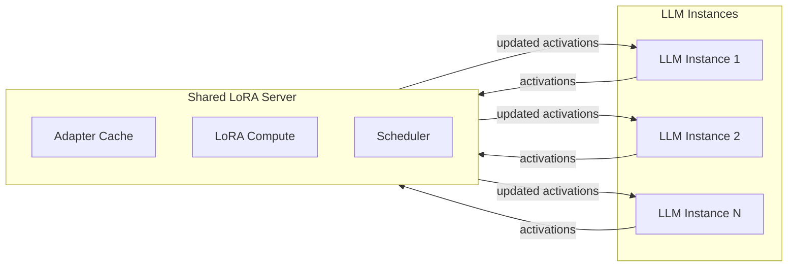
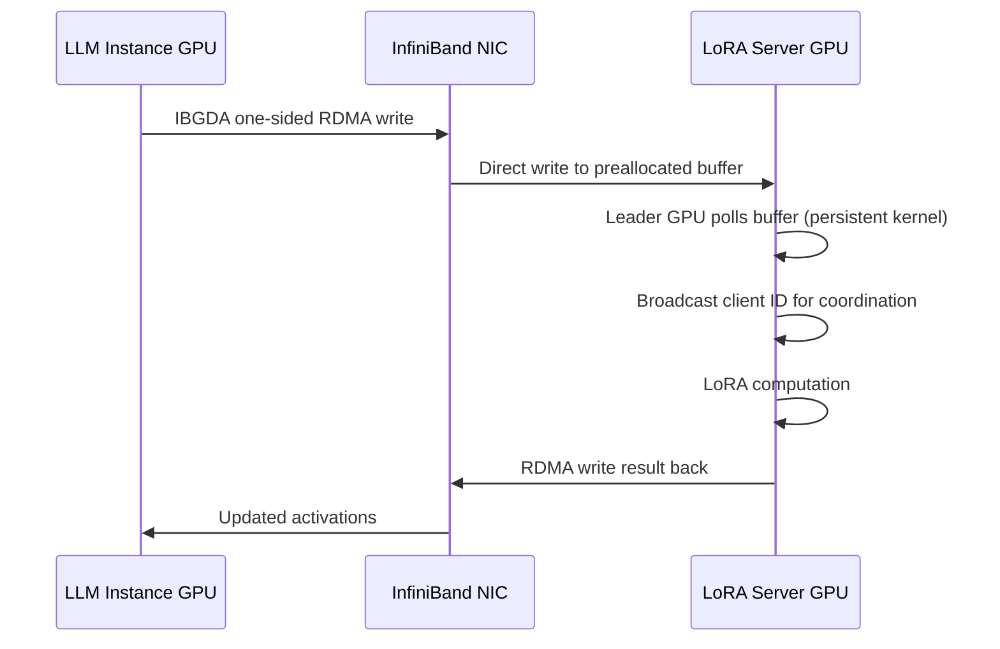

本記事は [arXiv:2604.07173](https://arxiv.org/abs/2604.07173) の解説記事です。

## 論文概要（Abstract）

InfiniLoRA は、LoRA（Low-Rank Adaptation）の実行をベースモデルの推論から分離する disaggregated serving アーキテクチャを提案するシステムである。著者らは、Mixture-of-Experts（MoE）モデルにおいて LoRA アダプタのメモリコストが急増し、既存の coupled 方式ではスケーラビリティとテイルレイテンシの両面で限界があると指摘している。InfiniLoRA は共有 LoRA Server に並列実行戦略、SLO 駆動のリソースプロビジョニング、GPU-Initiated 通信、ハードウェア特化カーネルを統合することで、S-LoRA 比で平均 3.05 倍のサービス可能リクエストレートと 54.0% の SLO 達成率改善を報告している。

この記事は [Zenn記事: vLLM Multi-LoRAで複数タスク特化モデルを1台のGPUに集約するルーティング設計](https://zenn.dev/0h_n0/articles/a21229e9c893f0) の深掘りです。

## 情報源

- **arXiv ID**: 2604.07173
- **URL**: [https://arxiv.org/abs/2604.07173](https://arxiv.org/abs/2604.07173)
- **著者**: Hongyu Chen, Letian Ruan, Zilin Xu, Yuchen Li, Xinyu Chen, Jingwen Leng, Bingsheng He, Minyi Guo, Shixuan Sun
- **投稿日**: 2026年4月8日
- **分野**: cs.DC（Distributed, Parallel, and Cluster Computing）
- **実験環境**: 4ノードクラスタ、各4x NVIDIA Hopper GPU（96GB）、400 Gb/s InfiniBand

## 背景と動機（Background & Motivation）

Multi-LoRA サービングは、単一のベースモデル上に複数の LoRA アダプタを動的にロードし、マルチテナント・マルチタスクの推論を効率化する手法として広く利用されている。しかし、MoE アーキテクチャの台頭により、この手法のスケーラビリティに深刻な課題が生じている。

### MoE モデルにおける LoRA メモリ爆発

従来の Dense モデルでは LoRA アダプタのメモリ消費は数十 MB 程度に収まるが、MoE モデルでは Expert ごとに LoRA パラメータが必要となるため、メモリコストが Expert 数に比例して増大する。たとえば Mixtral-8x7B では Expert が 8 つあるため、Dense モデルの約 8 倍のアダプタメモリが必要となる。

### 既存手法の限界

| 手法 | 課題 |
|------|------|
| **S-LoRA** | アダプタを LLM GPU メモリにキャッシュ。MoE ではメモリ不足でスワップ頻度が増大し、テイルレイテンシが悪化 |
| **Punica** | バッチ内異種アダプタを BGMV カーネルで統合。メモリ配置は最適化されていない |
| **vLLM Multi-LoRA** | 単一インスタンス内でのアダプタ管理。スケールアウト時のリソース効率が低い |

著者らは、既存の coupled 方式（LLM インスタンスがアダプタも保持する設計）では、(1) GPU メモリの争奪、(2) スワップによるテイルレイテンシ膨張、(3) MoE 対応時のスケーラビリティ欠如という 3 つの本質的問題があると主張している。

## 主要な貢献（Key Contributions）

1. **Disaggregated LoRA Serving Architecture**: LoRA 実行をベースモデル推論から分離し、共有 LoRA Server が複数の LLM インスタンスにサービスを提供する設計を提案。アダプタのキャッシュとコンピュートを独立にスケールさせることを可能にした
2. **SLO 駆動プロビジョニング**: Poisson 分布ベースの確率モデルと Immediate Admissibility Rate（IAR）を定義し、TTFT SLO を満たすために必要な最小キャッシュ容量とサーバ台数を自動決定するアルゴリズムを設計した
3. **Critical-Path 最適化**: GPU-Initiated 通信（Push-Based Protocol）とハードウェア特化 LoRA カーネル（wgmma, TMA, warp specialization）により、分離に伴う通信オーバーヘッドを最小化した

## 技術的詳細（Technical Details）

### 分離アーキテクチャ

InfiniLoRA のアーキテクチャでは、LLM インスタンスはベースモデルの推論のみを行い、LoRA 計算に必要なアクティベーションを共有 LoRA Server に転送する。LoRA Server はアダプタの計算を実行し、更新されたアクティベーションを LLM インスタンスに返す。



この分離により、以下の利点が得られると著者らは主張している。

- **独立スケーリング**: LLM インスタンスの追加なしにアダプタキャッシュ容量を増やせる
- **メモリ効率**: LLM GPU から LoRA メモリ負荷を排除し、KV キャッシュに回せる
- **共有キャッシュ**: 複数の LLM インスタンス間でアダプタを共有し、重複保持を排除する

### 4つの並列実行戦略

著者らは LoRA アダプタの集合を3次元テンソルとして抽象化している。テンソルの次元は adapters ($n$)、layers ($l$)、experts ($e$) であり、この抽象化の上に4つの並列戦略を定義している。

| 戦略 | 分割次元 | 通信量 | 同期スコープ | 適するケース |
|------|---------|--------|-------------|-------------|
| **Data Parallel (DP)** | バッチ | $b \cdot k / (p \cdot m)$ | $m$ 台全体 | 少数アダプタ・大バッチ |
| **Pipeline Parallel (PP)** | レイヤー | $b \cdot k / p$ | 隣接1台 | 通信帯域制約が厳しい場合 |
| **Expert Parallel (EP)** | Expert | $b \cdot k / \max(p, m)$ | $m$ 台全体 | Expert 数がサーバ台数以上 |
| **Hybrid (EPx-PPy)** | Expert + レイヤー | $b \cdot k / \max(p, x)$ | $x$ 台 | 大規模構成 |

ここで、$b$ はバッチサイズ、$k$ は top-k Expert 数、$p$ は LLM インスタンスの GPU 数、$m$ は LoRA Server の GPU 数である。

### SLO 駆動リソースプロビジョニング

InfiniLoRA は TTFT（Time To First Token）SLO を Immediate Admissibility Rate（IAR）として定式化する。リクエストが「即座に受理可能（immediately admissible）」とは、対象アダプタがキャッシュに存在するか、空きスロットに即座にロード可能な状態を指す。

各アダプタ $i$ のアクセス頻度を Poisson 分布でモデル化する。グローバルバッチサイズ $L_B$ に対し、アダプタ $i$ の期待アクセス回数は以下で定義される。

$$\lambda_i = L_B \cdot p_i$$

ここで $p_i$ はアダプタ $i$ の呼び出し確率である。

キャッシュ容量 $M$ スロットに対し、アダプタ $i$ が常駐する確率 $q_i$ は、閾値 $\tau^*$ を超えるアクセスが観測される確率として定義される。

$$q_i = \Pr[\text{Poisson}(\lambda_i) > \tau^*] = 1 - \sum_{k=0}^{\tau^*} \frac{\lambda_i^k \cdot e^{-\lambda_i}}{k!}$$

キャッシュ容量制約は以下で表される。

$$\sum_{i=1}^{N} q_i = M$$

IAR は次のように定式化される。

$$\text{IAR}(M) = \sum_{i=1}^{N} p_i \left[ q_i + (1 - q_i) \cdot P_{\text{free}}(i) \right]$$

ここで $P_{\text{free}}(i)$ は、アダプタ $i$ がキャッシュにないときに空きスロットが存在する確率であり、動的計画法で計算される。

最適なキャッシュ容量 $M^*$ は、目標 IAR $\alpha$（たとえば 0.95）を満たす最小値として求められる。

$$M^* = \min\{M \in [N] \mid \text{IAR}(M) \geq \alpha\}$$

閾値 $\tau^*$ は二分探索で効率的に探索される。

### GPU-Initiated 通信（Push-Based Protocol）

分離アーキテクチャでは LLM インスタンスと LoRA Server 間の通信がクリティカルパスとなる。著者らは従来の Pull-Based（サーバがクライアントから読み取る）ではなく、Push-Based Protocol を採用している。



Push-Based Protocol では、クライアント GPU が IBGDA（InfiniBand GPUDirect Async）を使用して片側 RDMA ライトにより、アクティベーションをサーバの事前確保バッファに直接書き込む。サーバ側のリーダー GPU はパーシステントカーネルでバッファをポーリングし、到着を検知するとクライアント ID をブロードキャストして協調を開始する。

著者らの評価によれば、典型的な 4 MB のペイロードサイズにおいて、Push-Based は Pull-Based に対して 2.63 倍の低レイテンシを達成している（論文 Section 5.3 より）。

### TPOT 制約とレイヤーパイプライン

Decode フェーズでの TPOT（Time Per Output Token）SLO は、1レイヤーあたりの通信・計算時間で制約される。

$$T_{\text{recv}} + T_{\text{comp}} + T_{\text{send}} \leq \text{SLO}_{\text{FFN}}$$

スループットの観点では、パイプライン実行により以下を満たす必要がある。

$$\max(T_{\text{recv}}, T_{\text{comp}}, T_{\text{send}}) \cdot L \leq \text{SLO}_{\text{Layer}}$$

ここで $L$ はモデルのレイヤー数である。

## 実装のポイント（Implementation Details）

### ハードウェア特化 LoRA カーネル

著者らは NVIDIA Hopper アーキテクチャの機能を活用した高性能 LoRA カーネルを実装している。

- **wgmma（Warpgroup Matrix Multiply-Accumulate）**: Hopper の Tensor Core を直接利用した行列演算命令。BGMV/SGMV カーネルの内部ループを高速化
- **TMA（Tensor Memory Accelerator）**: 非同期メモリコピーのハードウェアユニット。多次元テンソルのグローバルメモリから共有メモリへの効率的な転送を行い、計算と通信をオーバーラップさせる
- **Warp Specialization**: ワープを Producer（メモリフェッチ担当）と Consumer（計算担当）に分離し、パイプラインを形成。レジスタの動的再割り当てにより使用率を向上
- **Swapping-AB 変換**: SGMV（Shrink-Grouped Matrix-Vector）カーネルにおいて、アライメント制約を満たすために行列 A と B の役割を入れ替える最適化

### Layer-wise LoRA Loading

MoE モデルでは全アダプタを一度にロードするとメモリが不足するため、InfiniLoRA は Layer-wise Loading を採用している。各レイヤーの LoRA パラメータを必要なタイミングでオンデマンドにロードし、前のレイヤーの計算と次のレイヤーのロードをパイプライン化する。

## Production Deployment Guide

### システム構成

InfiniLoRA のプロダクション環境構成を以下に示す。論文の実験環境（4ノード、16 GPU）を参考に、AWS 上でのデプロイメント構成を設計する。

#### AWS 構成表

| コンポーネント | リソース | 台数 | 用途 |
|-------------|---------|------|------|
| **LLM Instances** | p5.48xlarge (8x H100 80GB) | 2 | ベースモデル推論 |
| **LoRA Server** | p5.48xlarge (8x H100 80GB) | 1 | LoRA 計算・キャッシュ |
| **Router** | c7g.2xlarge | 2 | リクエストルーティング・ロードバランシング |
| **Metadata Store** | r7g.xlarge (ElastiCache Redis) | 1 | アダプタメタデータ・ルーティングテーブル |
| **Storage** | S3 + EFS | - | アダプタパラメータの永続化 |
| **Networking** | EFA (Elastic Fabric Adapter) | 全ノード | GPU 間 RDMA 通信 |

#### ネットワーク要件

論文の実験では 400 Gb/s InfiniBand を使用している。AWS 上では EFA（Elastic Fabric Adapter）が同等の機能を提供する。p5 インスタンスは 3200 Gbps の EFA 帯域幅をサポートしており、InfiniLoRA の Push-Based Protocol に十分な帯域を確保できる。

### Terraform 構成

```hcl
# InfiniLoRA クラスタの基本構成
# Provider & VPC は既存のものを参照

resource "aws_placement_group" "infinilora" {
  name     = "infinilora-cluster"
  strategy = "cluster"  # RDMA レイテンシ最小化のためクラスタ配置
}

# LLM Instance (ベースモデル推論用)
resource "aws_instance" "llm_instance" {
  count         = 2
  ami           = var.deep_learning_ami_id  # NVIDIA Driver + CUDA pre-installed
  instance_type = "p5.48xlarge"

  placement_group = aws_placement_group.infinilora.id

  network_interface {
    device_index         = 0
    network_interface_id = aws_network_interface.llm_efa[count.index].id
  }

  root_block_device {
    volume_size = 500
    volume_type = "gp3"
    throughput  = 1000
    iops        = 16000
  }

  tags = {
    Name = "infinilora-llm-${count.index}"
    Role = "llm-instance"
  }
}

# LoRA Server (アダプタ計算・キャッシュ用)
resource "aws_instance" "lora_server" {
  count         = 1
  ami           = var.deep_learning_ami_id
  instance_type = "p5.48xlarge"

  placement_group = aws_placement_group.infinilora.id

  network_interface {
    device_index         = 0
    network_interface_id = aws_network_interface.lora_efa[count.index].id
  }

  root_block_device {
    volume_size = 1000  # アダプタキャッシュ用に大容量
    volume_type = "gp3"
    throughput  = 1000
    iops        = 16000
  }

  tags = {
    Name = "infinilora-lora-server-${count.index}"
    Role = "lora-server"
  }
}

# EFA Network Interface (RDMA 通信用)
resource "aws_network_interface" "llm_efa" {
  count           = 2
  subnet_id       = var.private_subnet_id
  security_groups = [aws_security_group.infinilora.id]

  interface_type = "efa"
}

resource "aws_network_interface" "lora_efa" {
  count           = 1
  subnet_id       = var.private_subnet_id
  security_groups = [aws_security_group.infinilora.id]

  interface_type = "efa"
}

# Security Group
resource "aws_security_group" "infinilora" {
  name_prefix = "infinilora-"
  vpc_id      = var.vpc_id

  # クラスタ内通信 (RDMA + gRPC)
  ingress {
    from_port = 0
    to_port   = 65535
    protocol  = "tcp"
    self      = true
  }

  ingress {
    from_port = 0
    to_port   = 65535
    protocol  = "udp"
    self      = true
  }

  egress {
    from_port   = 0
    to_port     = 0
    protocol    = "-1"
    cidr_blocks = ["0.0.0.0/0"]
  }
}

# S3 Bucket (アダプタパラメータ永続化)
resource "aws_s3_bucket" "lora_adapters" {
  bucket = "infinilora-adapters-${var.environment}"
}

resource "aws_s3_bucket_versioning" "lora_adapters" {
  bucket = aws_s3_bucket.lora_adapters.id
  versioning_configuration {
    status = "Enabled"
  }
}
```

### 監視設定

InfiniLoRA のプロダクション運用では、以下のメトリクスを監視する必要がある。

#### CloudWatch + Prometheus メトリクス

```yaml
# prometheus-rules.yaml
groups:
  - name: infinilora_slo
    rules:
      # IAR (Immediate Admissibility Rate) の監視
      - record: infinilora:iar:ratio
        expr: |
          sum(rate(infinilora_cache_hit_total[5m])) /
          sum(rate(infinilora_request_total[5m]))

      # TTFT SLO 違反アラート
      - alert: TTFTSLOViolation
        expr: |
          histogram_quantile(0.95,
            rate(infinilora_ttft_seconds_bucket[5m])
          ) > 0.25
        for: 2m
        labels:
          severity: critical
        annotations:
          summary: "P95 TTFT exceeds 0.25s SLO"
          description: >
            P95 TTFT is {{ $value }}s, exceeding the 0.25s SLO threshold.

      # TPOT SLO 違反アラート
      - alert: TPOTSLOViolation
        expr: |
          avg(rate(infinilora_tpot_seconds_sum[5m]) /
              rate(infinilora_tpot_seconds_count[5m])
          ) > 0.1
        for: 2m
        labels:
          severity: critical
        annotations:
          summary: "Average TPOT exceeds 0.1s SLO"

      # LoRA Server GPU メモリ使用率
      - alert: LoRAServerMemoryHigh
        expr: |
          infinilora_lora_server_gpu_memory_used_bytes /
          infinilora_lora_server_gpu_memory_total_bytes > 0.90
        for: 5m
        labels:
          severity: warning
        annotations:
          summary: "LoRA Server GPU memory usage above 90%"

      # アダプタキャッシュヒット率
      - alert: CacheHitRateLow
        expr: infinilora:iar:ratio < 0.90
        for: 5m
        labels:
          severity: warning
        annotations:
          summary: "Adapter cache hit rate below 90%"

      # Push-Based 通信レイテンシ
      - alert: RDMALatencyHigh
        expr: |
          histogram_quantile(0.99,
            rate(infinilora_rdma_latency_seconds_bucket[5m])
          ) > 0.001
        for: 2m
        labels:
          severity: warning
        annotations:
          summary: "P99 RDMA communication latency exceeds 1ms"
```

#### Grafana ダッシュボード構成

| パネル | メトリクス | 閾値 |
|--------|----------|------|
| **TTFT P95** | `histogram_quantile(0.95, infinilora_ttft_seconds_bucket)` | < 0.25s |
| **TPOT Average** | `avg(infinilora_tpot_seconds)` | < 0.1s |
| **IAR** | `infinilora:iar:ratio` | > 0.95 |
| **Serviceable Request Rate** | `rate(infinilora_request_served_total[1m])` | - |
| **Cache Hit Rate** | `infinilora_cache_hit / infinilora_cache_access` | > 0.90 |
| **GPU Utilization (LLM)** | `nvidia_gpu_utilization{role="llm"}` | 70-90% |
| **GPU Utilization (LoRA)** | `nvidia_gpu_utilization{role="lora-server"}` | 50-80% |
| **RDMA Throughput** | `rate(infinilora_rdma_bytes_total[1m])` | - |

### コスト最適化チェックリスト

- [ ] **Spot Instance 活用**: LLM Instance は Spot 不可（推論中断不可）だが、開発・テスト環境の LoRA Server は Spot Instance で 60-70% コスト削減が可能
- [ ] **Reserved Instance / Savings Plans**: p5 インスタンスの 1 年 RI で約 40% 割引
- [ ] **アダプタの S3 階層化**: アクセス頻度の低いアダプタは S3 Intelligent-Tiering に配置し、ホットアダプタのみ EBS/GPU メモリにキャッシュ
- [ ] **Auto Scaling**: LLM Instance 数をリクエストレートに応じてスケール。LoRA Server は IAR メトリクスでスケール判断
- [ ] **GPU 共有**: 小規模ワークロードでは MIG（Multi-Instance GPU）で 1 GPU を複数 LoRA Server に分割
- [ ] **リージョン選択**: p5 インスタンスの在庫状況は us-east-1, us-west-2 が安定。EFA 対応も確認
- [ ] **ネットワーク転送料金**: 同一 AZ 内のクラスタ配置で AZ 間転送料金を回避
- [ ] **Capacity Reservation**: GPU インスタンスの確保にはオンデマンドキャパシティ予約を検討

## 実験結果（Experimental Results）

### 実験環境

著者らは 4 ノードクラスタ（各 4x NVIDIA Hopper GPU、96 GB）、96 CPU コア、2 TB ホストメモリ、400 Gb/s InfiniBand NIC、900 GB/s NVLink（ノード内）の環境で評価を行っている。評価対象モデルは Mixtral-8x7B、Qwen3-30B、DBRX 等の 5 つの MoE モデルである。

### S-LoRA との比較

| 指標 | InfiniLoRA | S-LoRA | 改善率 |
|------|-----------|--------|--------|
| サービス可能リクエストレート | - | - | **平均 3.05 倍** |
| SLO 達成率 | - | - | **54.0% 改善** |
| スループット | - | - | **平均 7.3% 向上** |
| DBRX スループット | - | - | **最大 24.7% 向上** |

S-LoRA w/ Less LoRA 構成（アダプタ数を削減した設定）との比較では、サービス可能リクエストレートで 4.56 倍、SLO 達成率で 60.6% の改善が報告されている。

### Ablation Study

Mixtral-8x7B、25 req/s の設定における Ablation Study では、以下の結果が報告されている（論文 Section 6 より）。

- **Naive Disaggregation のみ**: P95 TTFT が 0.78s から 0.99s に増加（分離のオーバーヘッド）
- **InfiniLoRA フル構成**: P95 TTFT を 11 倍削減、TPOT を 30% 削減し、SLO 達成率 100% を達成

この結果は、単純な分離だけでは性能が劣化し、SLO 駆動プロビジョニングと通信最適化の組み合わせが不可欠であることを示している。

### SLO 設定

著者らが使用した SLO 設定は以下の通りである。

- **P95 TTFT SLO**: 0.25 秒
- **Average TPOT SLO**: 0.1 秒
- **Target IAR**: 0.95

### スケーラビリティ

LLM インスタンスを 6 台にスケールした場合、TPOT はベースラインから 10.5% の増加に留まり、0.1 秒の SLO 内に収まっている。著者らは、キャッシュ容量の飽和がスケーリングの主要なボトルネックであると指摘している。

## 実運用への応用（Practical Applications）

InfiniLoRA の分離アーキテクチャは以下のユースケースで特に有効であると考えられる。

1. **マルチテナント SaaS**: 各テナント固有の LoRA アダプタを共有インフラ上で効率的に提供。テナント追加時もベースモデルインスタンスを増やさずにアダプタキャッシュのみ拡張可能
2. **MoE モデルのプロダクションサービング**: DBRX や Mixtral のような MoE モデルで多数のアダプタを同時にサービングする場面で、メモリ効率とレイテンシ SLO の両立が可能
3. **A/B テスト・段階的ロールアウト**: 複数バージョンのアダプタを同時にサービングし、トラフィックの一部を新アダプタに振り分ける運用が、共有 LoRA Server のキャッシュ管理で容易になる

ただし、EFA/InfiniBand 相当の高帯域ネットワークが前提であり、一般的なイーサネット環境ではレイテンシ要件を満たせない可能性がある点に留意が必要である。

## 関連研究（Related Work）

- **Punica** (Chen et al., 2024): バッチ内の異種 LoRA アダプタを効率的に処理する BGMV カーネルを提案。InfiniLoRA はこれを SGMV に拡張し、Hopper 向けに最適化している
- **S-LoRA** (Sheng et al., 2024): Unified Paging と カスタム CUDA カーネルによる Multi-LoRA サービングを提案。InfiniLoRA の主要なベースラインであり、coupled 方式の限界を示す比較対象となっている
- **vLLM** (Kwon et al., 2023): PagedAttention による効率的な LLM サービング。Multi-LoRA 対応を含むが、分離アーキテクチャは採用していない
- **dLoRA** (Shen et al., 2024): LoRA アダプタの動的マージ・アンマージにより、バッチ内の異種アダプタを効率化。InfiniLoRA とは異なるアプローチで coupled 方式の改善を試みている

## まとめ

InfiniLoRA は、LoRA 実行をベースモデル推論から分離するという設計判断により、MoE モデルにおける Multi-LoRA サービングのスケーラビリティ課題に対して体系的な解決策を提示している。SLO 駆動のリソースプロビジョニング、Push-Based RDMA 通信、Hopper 特化カーネルの 3 つの最適化を組み合わせることで、S-LoRA 比で平均 3.05 倍のサービス可能リクエストレートと 54.0% の SLO 達成率改善を達成している。高帯域ネットワーク（InfiniBand/EFA）が前提となるが、マルチテナント SaaS や MoE モデルのプロダクションサービングにおいて、分離アーキテクチャは有望なスケーリング手法であると言える。

## 参考文献

- [InfiniLoRA: Disaggregated Multi-LoRA Serving for Large Language Models](https://arxiv.org/abs/2604.07173) - Hongyu Chen et al., 2026
- [S-LoRA: Serving Thousands of Concurrent LoRA Adapters](https://arxiv.org/abs/2311.03285) - Ying Sheng et al., 2023
- [Punica: Multi-Tenant LoRA Serving](https://arxiv.org/abs/2310.18547) - Lequn Chen et al., 2023
- [vLLM: Efficient Memory Management for Large Language Model Serving with PagedAttention](https://arxiv.org/abs/2309.06180) - Woosuk Kwon et al., 2023
- [dLoRA: Dynamically Orchestrating Requests and Adapters for LoRA LLM Serving](https://arxiv.org/abs/2401.02031) - Bingyang Wu et al., 2024
- [Zenn記事: vLLM Multi-LoRAで複数タスク特化モデルを1台のGPUに集約するルーティング設計](https://zenn.dev/0h_n0/articles/a21229e9c893f0)
