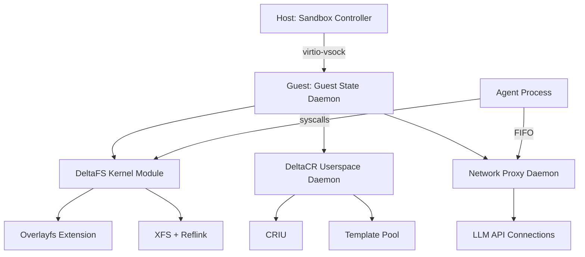
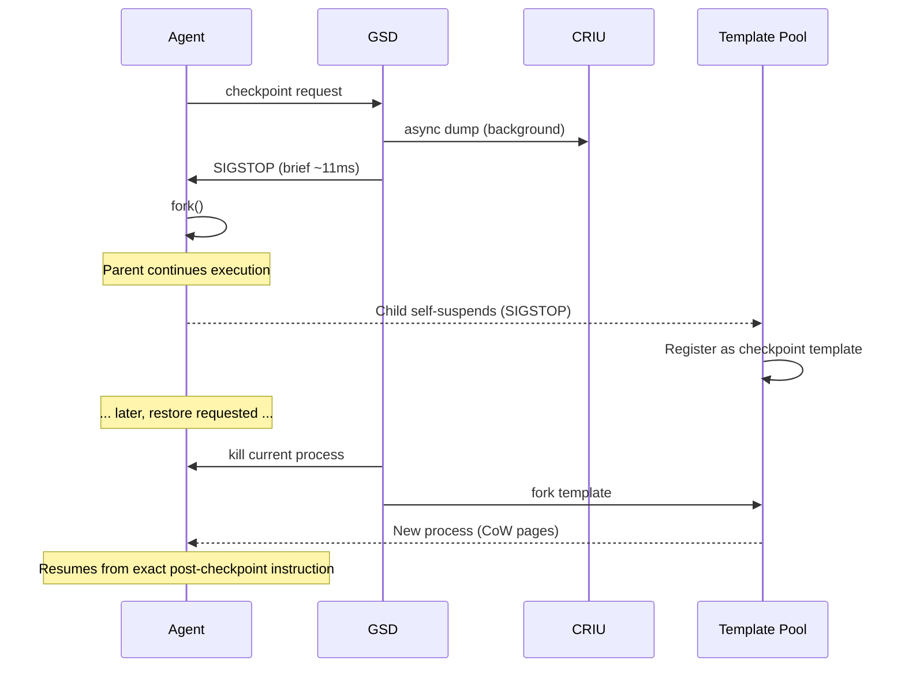
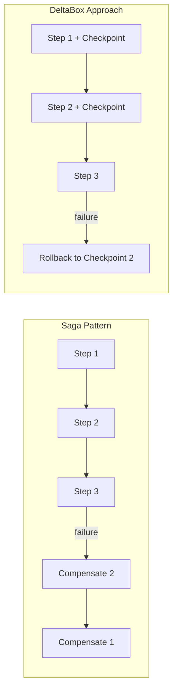

本記事は [arXiv:2605.22781](https://arxiv.org/abs/2605.22781) の解説記事です。

## 論文概要（Abstract）

DeltaBox は、LLM パワードの AI エージェント向けに設計された OS レベルのサンドボックスシステムであり、ミリ秒スケールのチェックポイント/ロールバックを実現する。著者らは、連続するサンドボックス状態の差分が極めて小さいという観察に基づき、完全な状態複製ではなくデルタベースのアプローチを採用している。DeltaFS（動的オーバーレイファイルシステム）と DeltaCR（差分ベースプロセス復元）の2つのサブシステムにより、チェックポイントレイテンシ約10.83ms、ロールバックレイテンシ約1.86ms を達成し、SWE-bench の MCTS ワークロードにおいて状態管理オーバーヘッドを従来の23-48%から1-2%に削減したと報告されている。

この記事は [Zenn記事: LangGraph×Sagaパターンで実装するAIワークフローの補償トランザクション設計](https://zenn.dev/0h_n0/articles/2456f07d38fc2e) の深掘りです。

## 情報源

- **arXiv ID**: 2605.22781
- **URL**: [https://arxiv.org/abs/2605.22781](https://arxiv.org/abs/2605.22781)
- **著者**: Yunpeng Dong, Jingkai He, Shiqi Liu, Yuze Hou, Dong Du, Zhonghu Xu, Si Yu, Baochuan Yang, Yubin Xia, Haibo Chen
- **投稿日**: 2026年5月21日（v2: 2026年6月8日）
- **分野**: cs.OS, cs.AI
- **実装規模**: DeltaFS 約565行（C言語、Linux 6.8 overlayfs拡張）、DeltaCR 約1200行（Python、CRIU統合）

## 背景と動機（Background & Motivation）

LLM パワードの AI エージェントは、テスト時の木探索（MCTS: Monte Carlo Tree Search）や強化学習ベースの自律実行において、頻繁な状態のスナップショットとロールバックを必要とする。たとえばコーディングエージェントが `rm`、`pip install`、`sed` などのコマンドを実行すると、これらの副作用は OS のファイルシステムに永続化され、LLM の履歴編集だけでは元に戻すことができない。

この問題には2つの管理すべき状態次元がある。

1. **永続的ファイルシステム状態**: 作業ディレクトリ内の数十万のファイル（ソースコード、依存パッケージ、設定ファイル等）
2. **一時的プロセスメモリ状態**: エージェントのインメモリコンテキスト、オープンファイルディスクリプタ、ヒープ上のオブジェクト

### 既存手法の限界

著者らは、既存のサンドボックスソリューションが以下の点で不十分であると指摘している。

| 手法 | 課題 |
|------|------|
| **Git / Docker commit** | ファイルシステムのみ保存。プロセスメモリが失われ、再実行が必要 |
| **Btrfs / ZFS スナップショット** | ファイルシステムのスナップショットのみ。プロセス状態と結合していない |
| **Firecracker VM スナップショット** | ブロックデバイスを除外。カーネルやデーモンの不要なページまで含む |
| **E2B サンドボックス** | pause/snapshot で約4秒/GiB RAM。クリティカルパス上での使用に耐えない |

### 核心的洞察

著者らの核心的洞察は「連続するチェックポイントは高度に類似している」という観察である。エージェントの各ステップでは、新しいファイルが少数追加されるか、少数のメモリページが変更されるだけである。この性質を利用して、完全な状態複製ではなく差分のみを保存するデルタベースのアプローチが合理的となる。

## 主要な貢献（Key Contributions）

- **DeltaFS**: Linux overlayfs を拡張し、アンマウントなしでオーバーレイレイヤーの動的切り替えを可能にするカスタム ioctl を実装。XFS reflink との組み合わせにより、書き込み増幅をファイルサイズではなく変更サイズに比例させた
- **DeltaCR**: テンプレートフォーク方式による高速リストアを実現。CRIU（Checkpoint/Restore In Userspace）の非同期ダンプとフォークベースのテンプレートプールを組み合わせ、リストアレイテンシを1.34ms（高速パス）に削減した
- **StateManager 結合プロトコル**: ファイルシステム状態とプロセスメモリ状態の整合性を保証する結合メカニズムを設計した
- **SWE-bench 評価**: MCTS ワークロードにおいて E2B 比でリストアが約480倍高速（1.86ms vs 899.7ms）、状態管理オーバーヘッドを1-2%に削減したと報告されている

## 技術的詳細（Technical Details）

### システムアーキテクチャ全体像

DeltaBox は、ホスト側の Sandbox Controller とゲスト側の Guest State Daemon（GSD）から構成される。Firecracker microVM 上で動作し、ホスト-ゲスト間通信には virtio-vsock を使用する。



### DeltaFS: 動的オーバーレイファイルシステム

DeltaFS は Linux overlayfs を約565行の C コードで拡張したカーネルモジュールである。標準の overlayfs はマウント後のレイヤー変更を許可しないが、DeltaFS はカスタム ioctl によりアンマウントなしのレイヤー切り替え（Hot-Switch）を実現する。

#### レイヤード構造

DeltaFS は2層のストレージアーキテクチャを採用する。

- **Layer 1（XFS ベースストレージ）**: reflink（ブロックレベル copy-on-write）を有効化した XFS ファイルシステム
- **Layer 2（DeltaFS オーバーレイ）**: overlayfs を拡張し、ランタイムでのレイヤー切り替えを可能にしたファイルシステム

チェックポイント時には以下の操作が行われる。

1. 現在の書き込み可能レイヤーを読み取り専用にリネーム
2. 新しい書き込み可能レイヤーを挿入
3. カスタム ioctl でレイヤースタックを原子的に更新

この操作のレイテンシは約0.07ms であると報告されている。

#### Hot-Switch メカニズム

Hot-Switch の安全性は、以下の仕組みで保証される。

- **チェックポイント世代カウンタ（`checkpoint_gen`）**: ファイルシステム全体で管理され、レイヤー切り替えごとにインクリメントされる
- **RCU（Read-Copy-Update）**: 古いレイヤー配列は2回のチェックポイント後に RCU で解放される。これにより、進行中の読み取り操作を保護する
- **遅延 inode 解決**: チェックポイント前にオープンされたファイルは、書き込み時に世代カウンタを参照して新しいレイヤースタックに対して再解決される

#### XFS Reflink による書き込み増幅の抑制

従来の ext4 や reflink なしの XFS では、copy-up 操作時にファイル全体が複製される。DeltaFS は XFS の reflink 機能を活用し、変更されたブロック（4KB 単位）のみを物理的にコピーする。

$$W_{\text{amplification}} = O(\text{changed\_blocks}) \quad \text{(reflink)}$$

$$W_{\text{amplification}} = O(\text{file\_size}) \quad \text{(ext4 / XFS without reflink)}$$

著者らの実験では、128-256KB のファイル編集において、reflink ありの場合の物理 I/O は約26KB であるのに対し、reflink なしでは約141KB に達すると報告されている。

### DeltaCR: 差分ベースプロセス復元

DeltaCR はプロセスメモリ状態のチェックポイント/リストアを担当するユーザー空間デーモンである。高速パス（テンプレートフォーク）と低速パス（CRIU Lazy-Pages）の二重戦略を採用する。

#### 高速パス: テンプレートフォーク

高速パスの動作原理は以下の通りである。



1. チェックポイント要求時、CRIU ダンプをバックグラウンドスレッドで非同期に開始する
2. エージェントプロセスを一時停止（SIGSTOP、約11ms）し、`fork()` で凍結テンプレートを作成する
3. フォークされた子プロセスは自身を SIGSTOP で停止し、テンプレートプールに登録される
4. 親プロセス（エージェント）は即座に実行を再開する
5. リストア時は、テンプレートを `fork()` するだけで新プロセスが生成される

`fork()` はページテーブルのみを複製し、物理メモリは copy-on-write で共有されるため、リストアのレイテンシは約1.34ms に抑えられる。

#### 低速パス: CRIU Lazy-Pages

テンプレートプールから該当エントリが退避されている場合、CRIU のイメージを使ったリストアにフォールバックする。

1. CRIU がプロセスを再構築し、VMA（Virtual Memory Area）を `userfaultfd` で登録する
2. エージェントがページにアクセスすると、オンデマンドでページが復元される
3. バックグラウンドの async-warm スレッドがホットゾーンページを事前にプリフェッチする

低速パスのリストアレイテンシは約9.29ms であると報告されている。

#### テンプレートプール管理

テンプレートプールは $N_{tpl}$ 個の上限を持ち、以下のポリシーで管理される。

- **木探索（MCTS）ワークロード**: 到達可能性を考慮した GC（Garbage Collection）ルール。UCT（Upper Confidence bound applied to Trees）が選択する可能性のあるノードと終端候補を優先的に保持する
- **非木探索ワークロード**: 単純な LRU（Least Recently Used）ポリシー

退避されたテンプレートの CRIU イメージは tmpfs 上に保持されるため、正確性に影響はなく、レイテンシのみが増加する。

#### Network Proxy Daemon（NPD）

NPD は LLM API との HTTP/2 接続を保持する独立プロセスである。エージェントとは固定サイズ FIFO トークン（`PIPE_BUF` 以下のアトミック書き込み）で通信する。

NPD を分離する理由は以下の通りである。

- `fork()` でライブネットワークスレッドを含むプロセスを複製すると、デッドロックやソケット状態の不整合が発生する
- NPD を CRIU ダンプとテンプレートフォークの対象外にすることで、これらの問題を回避する
- リストア後のエージェントは再接続なしに通信を再開できる

### StateManager 結合プロトコル

DeltaBox の正しさの鍵は「保存される状態は常に整合した（ファイルシステム, メモリ）ペアである」という不変条件にある。

#### チェックポイントシーケンス

1. エージェントが StateManager にチェックポイントを要求する
2. GSD が CRIU ダンプをバックグラウンドスレッドに投入する（非ブロッキング）
3. DeltaFS ioctl が現在の書き込み可能レイヤーを原子的に読み取り専用に降格し、新しい書き込み可能レイヤーを挿入する
4. CRIU 完了後、フォーク要求がエージェントの制御 FIFO に書き込まれる
5. エージェントが静止点（進行中のシステムコールがない時点）でフォークを実行する
6. StateManager が `{ID, CRIU パス, レイヤー構成, テンプレート PID}` を記録する

#### リストアシーケンス

1. 探索戦略が過去のチェックポイントへのリストアを要求する
2. GSD が現在のエージェントプロセスを終了する
3. DeltaFS ioctl がオーバーレイスタックを対象構成に切り替える
4. DeltaCR がテンプレートをフォーク（高速パス）または CRIU でリストア（低速パス）する
5. エージェントがチェックポイント直後の命令から実行を再開する

#### 障害処理

CRIU ダンプが失敗した場合、StateManager はファイルシステムの ioctl もロールバックし、不整合な半端状態の発生を防止する。

## 実装のポイント（Implementation Guide）

### LangGraph との統合

DeltaBox は LangGraph の `BaseCheckpointSaver` アダプタを通じて、既存のエージェントフレームワークと透過的に統合できる。以下に統合パターンの概念実装を示す。

```python
from typing import Any, Optional
from dataclasses import dataclass, field
from langgraph.checkpoint.base import BaseCheckpointSaver


@dataclass
class DeltaBoxConfig:
    """DeltaBox サンドボックスへの接続設定。

    Attributes:
        vsock_cid: virtio-vsock のコンテキスト ID
        vsock_port: GSD が待ち受けるポート番号
        template_pool_size: テンプレートプールの上限数
        enable_lightweight_checkpoint: 軽量チェックポイントの有効化
    """
    vsock_cid: int = 3
    vsock_port: int = 9001
    template_pool_size: int = 16
    enable_lightweight_checkpoint: bool = True


@dataclass
class CheckpointRecord:
    """チェックポイントのメタデータレコード。

    Attributes:
        checkpoint_id: 一意なチェックポイント識別子
        criu_image_path: CRIU イメージの保存パス
        overlay_config: DeltaFS レイヤー構成情報
        template_pid: テンプレートプロセスの PID（存在する場合）
        parent_id: 親チェックポイントの ID（木探索用）
    """
    checkpoint_id: str
    criu_image_path: str
    overlay_config: dict[str, Any] = field(default_factory=dict)
    template_pid: Optional[int] = None
    parent_id: Optional[str] = None


class DeltaBoxCheckpointSaver(BaseCheckpointSaver):
    """DeltaBox の OS レベル C/R を LangGraph に統合するアダプタ。

    LangGraph のグラフ状態保存と OS レベルのチェックポイントを
    結合し、ファイルシステムとプロセスメモリの両方を含む
    完全な状態スナップショットを提供する。

    Usage:
        config = DeltaBoxConfig(template_pool_size=32)
        saver = DeltaBoxCheckpointSaver(config)
        graph = StateGraph(...).compile(checkpointer=saver)
    """

    def __init__(self, config: DeltaBoxConfig) -> None:
        super().__init__()
        self.config = config
        self._records: dict[str, CheckpointRecord] = {}

    def put(
        self,
        config: dict[str, Any],
        checkpoint: dict[str, Any],
        metadata: dict[str, Any],
    ) -> dict[str, Any]:
        """グラフ状態保存時に OS レベルチェックポイントも取得する。

        Args:
            config: LangGraph の実行設定
            checkpoint: グラフの状態データ
            metadata: チェックポイントのメタデータ

        Returns:
            更新された設定（チェックポイント ID を含む）
        """
        checkpoint_id = checkpoint["id"]
        parent_id = config.get("configurable", {}).get("parent_checkpoint_id")

        # OS レベルのチェックポイントを GSD に要求
        record = self._request_checkpoint(checkpoint_id, parent_id)
        self._records[checkpoint_id] = record

        return {
            **config,
            "configurable": {
                **config.get("configurable", {}),
                "checkpoint_id": checkpoint_id,
            },
        }

    def _request_checkpoint(
        self, checkpoint_id: str, parent_id: Optional[str]
    ) -> CheckpointRecord:
        """GSD に対して vsock 経由でチェックポイントを要求する。

        実際の実装では virtio-vsock を通じて GSD と通信し、
        DeltaFS ioctl + CRIU dump + fork stash のシーケンスを実行する。

        Args:
            checkpoint_id: チェックポイントの識別子
            parent_id: 親チェックポイントの ID

        Returns:
            生成された CheckpointRecord
        """
        # GSD との通信プロトコル（概念実装）
        # 実際には vsock 経由で以下のシーケンスが実行される:
        # 1. CRIU dump を非同期で開始
        # 2. DeltaFS ioctl でレイヤーを切り替え
        # 3. fork() でテンプレートを作成
        return CheckpointRecord(
            checkpoint_id=checkpoint_id,
            criu_image_path=f"/tmp/criu/{checkpoint_id}",
            parent_id=parent_id,
        )
```

### テスト隔離パターン（Value-Time Isolation）

DeltaBox は、テスト実行の副作用を完全に隔離する Value-Time パターンを提供する。エージェントがテストを実行する際に生成される `__pycache__`、一時ファイル等の副作用を、ロールバックにより除去する。

```python
from typing import Any
from dataclasses import dataclass


@dataclass
class TestResult:
    """テスト実行結果を副作用なしで取得するためのデータクラス。

    Attributes:
        test_name: 実行したテストの名称
        passed: テストの合否
        output: テストの標準出力
        side_effects_rolled_back: 副作用がロールバックされたかどうか
    """
    test_name: str
    passed: bool
    output: str
    side_effects_rolled_back: bool = True


def execute_test_with_isolation(
    sandbox: Any,
    test_command: str,
    checkpoint_id: str,
) -> TestResult:
    """チェックポイント/ロールバックによるテスト隔離実行。

    テスト実行前にチェックポイントを取得し、テスト実行後に
    ロールバックすることで、副作用のない結果取得を実現する。
    結果はロールバック前に抽出され、復元後のエージェントに注入される。

    Args:
        sandbox: DeltaBox サンドボックスインスタンス
        test_command: 実行するテストコマンド
        checkpoint_id: リストア先のチェックポイント ID

    Returns:
        副作用を除去した状態でのテスト結果

    Note:
        この関数は DeltaBox 論文の Value-Time パターンの
        概念実装であり、実際のサンドボックス API に依存する。
    """
    # 1. テスト実行前のチェックポイント
    pre_test_id = sandbox.checkpoint(parent=checkpoint_id)

    # 2. テスト実行（副作用が発生する）
    result = sandbox.execute(test_command)

    # 3. 結果を観測（ロールバック前に取得）
    test_output = sandbox.read_stdout()
    test_passed = result.exit_code == 0

    # 4. 無条件ロールバック（副作用を除去）
    sandbox.restore(pre_test_id)

    # 5. 結果をエージェントに注入（副作用なしの実行を模倣）
    return TestResult(
        test_name=test_command,
        passed=test_passed,
        output=test_output,
        side_effects_rolled_back=True,
    )
```

### 適応型軽量チェックポイント

著者らは、全てのエージェントアクションがチェックポイントを必要としないことを観察している。読み取り専用や冪等な操作（例: `cat`、`ls`、`grep` の実行）では、CRIU ダンプと ioctl を省略する軽量チェックポイントが適用される。実験では約62%のイベントが軽量パスにルーティングされ、ストレージフットプリントの削減に寄与したと報告されている。

## 実験結果（Experimental Results）

### MCTS 探索スループット（SWE-bench）

著者らは SWE-bench 上の MCTS ワークロードで、24のトラジェクトリ（4つのアーキタイプグループ）を用いて評価を行っている。

#### イベントあたりのレイテンシ比較

| 手法 | チェックポイント (ms) | リストア (ms) | 特徴 |
|------|----------------------|--------------|------|
| replay+cp | 347.0 | 27,694 | コールドリプレイ再構築 |
| FC-Diff+dm | 622.3 | 3,429 | VM 差分チェーンマージ |
| CRIU+cp | 590.0 | 811.4 | ファイル全コピー + CRIU |
| E2B (diff) | 524.4 | 899.7 | VM インクリメンタルスナップショット |
| **DeltaBox** | **10.83** | **1.86** | **デルタベース C/R** |

DeltaBox のリストアレイテンシは E2B 比で約480倍、replay+cp 比で約15,000倍の高速化を達成している。

#### ワークロード分類

評価に使用された24のトラジェクトリは以下の4グループに分類される。

- **Django**（4件）: 大規模プロセス（28.4GB）、ファットメモリフットプリント
- **SymPy**（4件）: 読み取り中心の探索パターン
- **Scientific**（10件）: NumPy 系ライブラリ（Astropy、Matplotlib、scikit-learn、Xarray）
- **Tools/small repos**（6件）: 軽量リポジトリ（pylint、requests、pytest）

#### エンドツーエンドオーバーヘッド

LLM 推論 + アクション実行時間に対する正規化オーバーヘッドとして以下が報告されている。

- **DeltaBox**: 1.01-1.02倍（1-2%の状態管理オーバーヘッド）
- **E2B (diff)**: 1.30-1.93倍（23-48%の状態管理オーバーヘッド）

### RL 訓練のファンアウト性能

強化学習訓練での並列エージェント展開において、フォークレイテンシのスケーリングが評価されている。

| 並列数 N | p50 (ms) | p99 (ms) | フォーク/秒 |
|---------|----------|----------|------------|
| 1 | 0.57 | 0.61 | 1,419 |
| 4 | 0.78 | 1.31 | 999 |
| 16 | 1.67 | 4.67 | 519 |
| 64 | 5.47 | 14.74 | 165 |

並列数に対してサブリニアな増加を示し、p99 は p50 の約3倍に抑えられている。各子プロセスの RSS は約11MB であり、集約メモリは書き込みワーキングセットに対してのみ増加する。

#### GPU 利用率（Qwen2.5-7B、LoRA-r16、4 GPU）

| 手法 | N=16 GPU 利用率 | N=64 GPU 利用率 |
|------|----------------|----------------|
| DeltaBox | 95% | 97% |
| CubeSandbox | 77% | 80% |
| E2B | 29% | 36% |

DeltaBox の高速 C/R により、GPU がほぼ飽和状態で利用されている。非同期訓練における staleness（古い勾配の使用度合い）も、DeltaBox は0.81-1.67 と他手法（CubeSandbox: 1.25-2.25、E2B: 5.04-6.13）を大幅に下回ると報告されている。

### コンポーネント別レイテンシ内訳

#### チェックポイントフェーズ

| 操作 | レイテンシ | 備考 |
|------|----------|------|
| CRIU ダンプ | 非同期 | LLM 推論中にバックグラウンドで実行 |
| Overlay ioctl | 0.07ms | レイヤー切り替え |
| Fork stash | 8.87ms | ページテーブルコピー |
| **エージェント体感ブロッキング** | **0ms** | チェックポイントは隠蔽される |

#### リストアフェーズ（高速パス）

| 操作 | レイテンシ | 備考 |
|------|----------|------|
| Overlay ioctl | 0.19ms | レイヤースタック復元 |
| Fork template | 1.34ms | ページテーブルコピー |
| Page-warm | 非同期 | バックグラウンドで CoW フォールト吸収 |
| **エージェント体感ブロッキング** | **1.86ms** | 高速パス合計 |

低速パス（テンプレート退避時）のリストアレイテンシは約9.29ms である。

### 書き込み増幅の評価

XFS reflink の効果として、以下が報告されている。

- **小さなファイル（1-8KB）**: XFS メタデータ効率により物理 I/O が削減される（132KB → 26KB）
- **大きなファイル（128-256KB）**: reflink のブロック共有により、変更ブロックのみが書き込まれる
- **ext4 / XFS（reflink なし）**: ファイルサイズに比例した線形の書き込み増幅

### ストレージ効率

- 適応型軽量チェックポイントにより約62%のイベントが軽量パスにルーティングされる
- 到達可能性を考慮した GC により、SWE-bench 9インスタンスで CRIU ダンプストレージが46-63%削減される

## 実運用への応用（Production Deployment Guide）

### Saga パターンとの関連

[Zenn記事](https://zenn.dev/0h_n0/articles/2456f07d38fc2e) で解説した Saga パターンの補償トランザクションは、各ステップの失敗時に補償アクションを実行して一貫性を回復する設計パターンである。DeltaBox はこのパターンの実行基盤として以下の点で直接的に関連する。

#### OS レベルの補償としてのロールバック

Saga パターンでは、各ステップに対応する補償アクションを明示的に定義する必要がある。DeltaBox のチェックポイント/ロールバックは、補償アクションの代替として機能する。



Saga パターンでは補償ロジックを個別に実装する必要があるが、DeltaBox ではチェックポイントへのロールバックにより、OS 状態を含む完全な巻き戻しが自動的に行われる。ただし、外部 API 呼び出し等のネットワーク副作用はロールバック対象外であるため、Saga パターンの補償アクションが引き続き必要となる場面がある。

#### 木探索ベースエージェントでの応用

LATS（Language Agent Tree Search）等の木探索エージェントでは、探索木のバックトラックが本質的にロールバック操作である。DeltaBox の高速ロールバック（1.86ms）により、以下が実現される。

- **時間制約内でのより多くのブランチ探索**: E2B の899.7ms に対して約480倍高速なロールバックにより、同一時間内で探索可能なブランチ数が大幅に増加する
- **RL 訓練での高並列ファンアウト**: N=64 並列でも p99 レイテンシ 14.74ms、GPU 利用率97%を維持する
- **副作用の完全な隔離**: テスト実行やパッケージインストールの副作用が他のブランチに漏洩しない

### デプロイメント構成

本番環境での DeltaBox デプロイメントでは、以下の構成が想定される。

```python
from typing import Any, Optional
from dataclasses import dataclass, field


@dataclass
class DeltaBoxDeploymentConfig:
    """DeltaBox の本番デプロイメント設定。

    Attributes:
        firecracker_config: Firecracker microVM の設定
        deltafs_config: DeltaFS カーネルモジュールの設定
        deltacr_config: DeltaCR デーモンの設定
        template_pool_config: テンプレートプール管理の設定
    """
    firecracker_config: dict[str, Any] = field(default_factory=lambda: {
        "kernel": "linux-6.8-deltafs",  # DeltaFS 統合カーネル
        "rootfs": "agent-sandbox.ext4",
        "vcpu_count": 2,
        "mem_size_mib": 512,
    })
    deltafs_config: dict[str, Any] = field(default_factory=lambda: {
        "base_filesystem": "xfs",
        "reflink_enabled": True,
        "overlay_layers_max": 256,
        "lightweight_checkpoint_ratio": 0.6,
    })
    deltacr_config: dict[str, Any] = field(default_factory=lambda: {
        "criu_dump_path": "/tmp/criu",
        "async_warm_enabled": True,
        "sigstop_timeout_ms": 50,
    })
    template_pool_config: dict[str, Any] = field(default_factory=lambda: {
        "max_templates": 32,
        "eviction_policy": "reachability_aware",
        "gc_interval_seconds": 30,
    })


@dataclass
class SandboxMetrics:
    """サンドボックスのパフォーマンスメトリクス。

    Attributes:
        checkpoint_latency_ms: チェックポイントレイテンシ
        restore_latency_ms: リストアレイテンシ
        template_hit_rate: テンプレートプールのヒット率
        lightweight_checkpoint_ratio: 軽量チェックポイントの割合
        storage_usage_mb: ストレージ使用量
    """
    checkpoint_latency_ms: float
    restore_latency_ms: float
    template_hit_rate: float
    lightweight_checkpoint_ratio: float
    storage_usage_mb: float


def estimate_gpu_utilization(
    n_parallel: int,
    t_gen_ms: float,
    t_train_ms: float,
    t_restore_ms: float = 1.86,
) -> float:
    """DeltaBox を使用した場合の GPU 利用率を推定する。

    並列エージェント数と各フェーズのレイテンシから、
    GPU が実際に計算に使用される時間の割合を推定する。

    Args:
        n_parallel: 並列エージェント数
        t_gen_ms: LLM 推論のバッチ処理時間 (ms)
        t_train_ms: 学習の forward+backward 時間 (ms)
        t_restore_ms: リストアレイテンシ (ms)、デフォルト 1.86ms

    Returns:
        推定 GPU 利用率（0.0 - 1.0）
    """
    gpu_time = t_gen_ms + t_train_ms
    total_time = gpu_time + (t_restore_ms * n_parallel)
    return gpu_time / total_time
```

### 設計要件のまとめ

DeltaBox が満たす設計要件は以下の通りである。

| 要件 | 説明 | 達成状況 |
|------|------|---------|
| R1: ミリ秒結合 C/R | ファイルシステムとメモリの結合チェックポイント/リストア | 10.83ms / 1.86ms |
| R2: 変更比例の書き込み増幅 | 書き込み量が変更量に比例 | XFS reflink で 4KB 粒度 |
| R3: O(1) 任意ロールバック | 任意のチェックポイントへの定数時間ロールバック | オーバーレイレイヤー切り替え |
| R4: エージェント透過性 | 最小限のコード変更で統合可能 | LangGraph アダプタ提供 |

## 関連研究（Related Work）

### エージェントサンドボックス

E2B、Daytona、ZeroBoot 等の既存サンドボックスは、隔離性とスタートアップ時間を重視しているが、ミリ秒レベルの木内ロールバック機能を欠いている。DeltaBox はこれらと異なり、探索木のブランチ間でのチェックポイント/ロールバックに特化した設計となっている。

### 並行研究: Crab

Crab はセマンティクスを考慮したチェックポイント粒度を提案する並行研究であり、DeltaBox の OS レベル最適化と相補的な関係にある。Crab がアプリケーション層でのチェックポイントタイミングを最適化するのに対し、DeltaBox はチェックポイント/リストア操作自体の高速化に焦点を当てている。

### サーバーレスシステム

TrEnv-X、FaaSnap 等のサーバーレスシステムは、コールドスタートの最適化と呼び出し間のインスタンス再利用を目的としている。これらのシステムの単位は関数呼び出しであり、DeltaBox が対象とする探索木のブランチとは異なるスケールで動作する。

### チェックポイント基盤技術

CRIU（Checkpoint/Restore In Userspace）と DMTCP（Distributed MultiThreaded Checkpointing）は、プロセスレベルのチェックポイント基盤技術である。DeltaBox はこれらの技術を統合し、エージェントワークロードに特化した最適化を施している。Btrfs / ZFS のスナップショット機能はファイルシステムレベルの差分管理を提供するが、プロセスメモリとの結合が欠如している。

## 制限事項（Limitations）

- **ネットワーク I/O のロールバック非対応**: 外部 API 呼び出し等のネットワーク副作用はロールバック対象外である。Saga パターンの補償アクションとの組み合わせが必要となる
- **シングルスレッドエージェント前提**: テンプレートフォークはメインループの単一スレッドからのみ実行される
- **メモリフットプリントのスケーリング**: フォーク時のページテーブルコピーはエージェント RSS に比例して増加する（async-warm で緩和）
- **カスタムカーネル要件**: 変更された overlayfs がゲストカーネルモジュールとして必要であり、メインラインカーネルには統合されていない

## まとめ

DeltaBox は「連続するチェックポイントは高度に類似している」という核心的洞察に基づき、OS レベルでのデルタベースチェックポイント/ロールバックを実現するシステムである。DeltaFS と DeltaCR の2つのサブシステムにより、チェックポイント10.83ms（エージェント体感0ms）、リストア1.86ms（高速パス）を達成し、SWE-bench MCTS ワークロードにおける状態管理オーバーヘッドを1-2%に削減したと報告されている。

Saga パターンの観点では、DeltaBox は OS 状態の補償を高速ロールバックで代替できる基盤技術として位置付けられる。ネットワーク副作用を伴わないローカル操作の補償には DeltaBox を、外部システムへの副作用には Saga パターンの明示的補償アクションを使い分けるハイブリッドアプローチが実用的であると考えられる。

## 参考文献

1. Dong, Y., He, J., Liu, S., Hou, Y., Du, D., Xu, Z., Yu, S., Yang, B., Xia, Y., & Chen, H. (2026). DeltaBox: Scaling Stateful AI Agents with Millisecond-Level Sandbox Checkpoint/Rollback. arXiv:2605.22781.
2. Garcia-Molina, H., & Salem, K. (1987). Sagas. ACM SIGMOD Record, 16(3), 249-259.
3. Zhou, A., et al. (2024). Language Agent Tree Search Unifies Reasoning, Acting, and Planning in Language Models. ICML 2024.
4. Jimenez, C. E., et al. (2024). SWE-bench: Can Language Models Resolve Real-World GitHub Issues? ICLR 2024.
5. CRIU Project. Checkpoint/Restore In Userspace. [https://criu.org/](https://criu.org/)
6. E2B. Code Interpreter SDK. [https://e2b.dev/](https://e2b.dev/)
