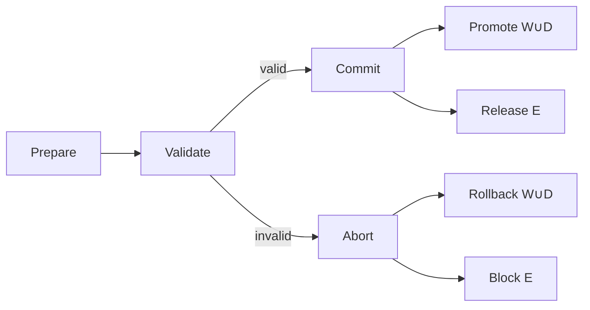
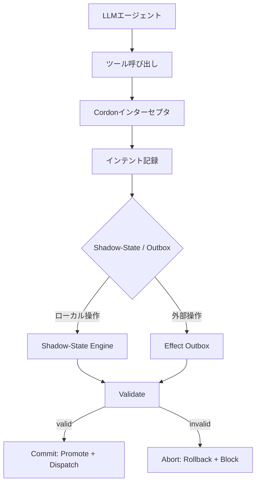

## 論文概要（Abstract）

本記事は [arXiv:2606.17573](https://arxiv.org/abs/2606.17573) の解説記事です。

Cordonは、ツール利用LLMエージェントに**セマンティックトランザクション**を導入するランタイムシステムである。現行のエージェントランタイムはツール呼び出しを独立したRPCとして扱い、タスクスコープのcommit/rollback/recovery/audit境界を持たない。Cordonはこの問題に対し、ツールインテント・結果リネージュ・可逆ローカル状態・ステージド外部効果・委任権限・監査メタデータを束ねるトランザクション境界を提案する。45件のリスクシナリオに対して、既存防御が見逃す違反を全件事前阻止しつつ、ベンチマークタスク完了率を維持することが報告されている。

この記事は [Zenn記事: LangGraph×Sagaパターンで実装するAIワークフローの補償トランザクション設計](https://zenn.dev/0h_n0/articles/2456f07d38fc2e) の深掘りです。

## 情報源

- **arXiv ID**: 2606.17573
- **URL**: [arXiv:2606.17573](https://arxiv.org/abs/2606.17573)
- **著者**: Zheng Chen, Hanqing Liu, Duling Xu, Dong Dong, Jialin Li, Bangzheng Pu, Jidong Zhai
- **投稿日**: 2026年6月16日
- **分野**: Operating Systems (cs.OS), Cryptography and Security (cs.CR)

## 背景と動機（Background & Motivation）

### エージェントランタイムのギャップ

LLMエージェントがツールを呼び出す際、現行ランタイムは各呼び出しを独立したRPCとして処理する。この設計には以下の問題がある。

1. **トランザクション境界の欠如**: ファイル書き込み、API呼び出し、コマンド実行が個別に処理され、タスク全体としてのcommit/abortが不可能
2. **リネージュ追跡の不在**: あるツールの出力が次のツールの入力として使われる「合成実行フロー」における意味的違反を検出できない
3. **不可逆効果の即時実行**: 外部APIへのPOSTやメール送信が検証なしに即座に実行され、取り消しが困難

例として、エージェントがセットアップノートを読み取り、ヘルパーコマンドを実行するシナリオを考える。隠されたコマンドがSSH設定を書き換える場合、ツール単位の境界では「通常のコマンド実行」と判断される。しかしタスクスコープで見れば、読み取り結果からSSH設定への書き込みという危険なフローが存在する。

Zenn記事で解説したSagaパターンは補償トランザクションによりワークフロー全体の整合性を保つが、これはアプリケーション層の設計パターンである。Cordonはランタイム層でトランザクション境界を提供し、エージェントフレームワークに依存しない安全性保証を目指す。

### 既存防御の限界

著者らは既存の防御アプローチを以下のように分類し、それぞれの限界を指摘している。

| 防御アプローチ | 限界 |
|---|---|
| ツール単位ポリシー | 合成フローの意味的違反を検出不可 |
| 人間承認 | トランザクションスコープなしでは承認対象が不明確 |
| サンドボックス | プロセス隔離のみでコミットセマンティクスなし |
| スナップショット復元 | ファイルシステム回復のみで外部効果は対象外 |
| 出力フィルタ | 正規表現/DLPベースでリネージュ追跡なし |

## 主要な貢献（Key Contributions）

1. **セマンティックトランザクションモデル**: ツールインテント、リネージュ、可逆状態、外部効果、権限を統合する10タプルのトランザクション定義
2. **3フェーズコミットプロトコル**: Prepare/Validate/Commit(Abort)による段階的な検証とコミット
3. **Shadow-State Engine**: ファイル書き込み・削除をトランザクションスコープで管理するアプリケーションレベルのマニフェストシステム
4. **Effect Outbox**: 外部効果を検証成功までステージングし、冪等キーで重複防止するディスパッチ機構
5. **9つの不変条件**: フロー制御、コミット正確性、権限スコーピング、監査完全性を保証する形式的な制約体系

## 技術的詳細（Technical Details）

### セマンティックトランザクションモデル

Cordonの中核は、タスクレベルのトランザクションを以下の10タプルとして定義するモデルである。

$$
T = \langle \text{scope}, \text{intents}, R, W, D, E, O, G, A, \text{status} \rangle
$$

各フィールドの役割を以下に示す。

| 区分 | フィールド | 意味 |
|---|---|---|
| 境界 | scope | タスクトランザクション境界 |
| 境界 | intents | 型付き操作（読み取り、書き込み、実行など） |
| 証拠 | $R$ | 読み取り・観測アンカー（スナップショット参照点） |
| リネージュ | $O$ | セマンティック結果オブジェクト |
| リネージュ | $G$ | 依存グラフ（オブジェクト・変更・効果を接続） |
| 状態 | $W$, $D$ | 可逆ローカル書き込み・削除 |
| 効果 | $E$ | ステージド外部アクション |
| 権限 | $A$ | 委任された権限と承認義務 |
| ライフサイクル | status | トランザクション状態 |

実行履歴 $H = \langle e_1, e_2, \ldots \rangle$ に対して、依存集合は以下のように定義される。

$$
\text{Dep}_H(s) = \{e_i \mid e_i \leadsto^*_H s\}
$$

ここで $e_i \leadsto^*_H s$ は、履歴 $H$ において事象 $e_i$ からステップ $s$ への推移的依存関係を表す。この依存グラフ $G$ がリネージュ追跡の基盤となる。

制約タプル $C_t$ は以下の3要素からなる。

$$
C_t = (I_t, A_t, P_t)
$$

- $I_t$: ユーザインテント（タスクの意図）
- $A_t$: 付与された権限
- $P_t$: システムポリシー

効果境界違反は次の条件で検出される。

$$
\exists s, t: \text{commit}(s, t) \land \neg \text{Allowed}(s, C_t)
$$

すなわち、制約タプルで許可されていない効果がコミットされようとした場合に違反となる。

### 3フェーズコミットプロトコル

トランザクションのライフサイクルは3つのフェーズで構成される。



**Phase 1: Prepare**

ツールインテントを受理し、ローカル変更を $W \cup D$ に記録する。外部効果は即座に実行せず、Effect Outbox $E$ にステージングする。この段階ではファイルシステムへの変更はShadow-State内に閉じ、外部APIへのリクエストは保留される。

**Phase 2: Validate**

以下の4要素を評価する。

- リネージュグラフ $G$: 結果オブジェクト間の依存関係が制約に違反しないか
- 権限 $A$: 委任された権限がインテントに対して十分か
- ステージド効果 $E$: 外部アクションがポリシーで許可されているか
- 制約タプル $C_t = (I_t, A_t, P_t)$: ユーザインテント・権限・ポリシーの整合性

**Phase 3: Commit / Abort**

検証結果に基づいて分岐する。

$$
\text{commit}(T) \Rightarrow \text{valid}(T, C_t) \land \text{staged}(E) \land \text{recoverable}(W, D)
$$

- **Commit**: $\text{valid}(T, C_t)$ が成立する場合、$W \cup D$ を実ファイルシステムにプロモーションし、$E$ のエントリをディスパッチする
- **Abort**: 違反が検出された場合、$W \cup D$ をロールバック（読み取りアンカー $R$ の状態に復元）し、$E$ のエントリをブロックする

### 9つの不変条件（Containment Invariants）

Cordonは9つの不変条件によってコミットの妥当性を保証する。

**フロー制御**

- **I1 (Secret Flow)**: シークレット由来のオブジェクトが未認可シンクに接続されない
- **I7 (Lineage Preservation)**: リネージュが変換を跨いでセマンティック依存関係を保存する

**コミット正確性**

- **I2 (Untrusted Input)**: 未信頼入力がバリデーションなしにセンシティブな変更を正当化できない
- **I3 (Effect Staging)**: 外部効果は検証成功までステージド状態を維持する
- **I4 (Rollback Correctness)**: Abort時に $W \cup D$ が正確に復元される
- **I5 (Effect Completeness)**: 全ての副作用がコミット前に表現される

**権限と監査**

- **I6 (Authority Scoping)**: 権限がインテント・リソース・シンク・ケイパビリティ・時間にスコーピングされる
- **I8 (Approval Binding)**: 承認が単一のトランザクションオブジェクト・アクション・シンク・時間に紐付く
- **I9 (Audit Completeness)**: コミット・効果遷移・承認の完全なメタデータが記録される

これらの不変条件はZenn記事で解説したSagaパターンの補償設計と対応関係がある。I3とI4はSagaの補償トランザクションに相当し、I7はSagaのステップ間依存関係の追跡に対応する。

### Shadow-State Engine

Shadow-State Engineはファイルシステム操作をトランザクションスコープで管理するアプリケーションレベルのマニフェストシステムである。

```python
from dataclasses import dataclass, field
from pathlib import Path
from typing import Optional


@dataclass
class ShadowEntry:
    """Shadow-State内の個別エントリ。

    Attributes:
        path: 対象ファイルパス
        content: 書き込み内容（Noneは削除を意味する）
        anchor: トランザクション開始時の元ファイル内容
    """
    path: Path
    content: Optional[bytes]
    anchor: Optional[bytes]


@dataclass
class ShadowState:
    """トランザクションスコープのファイルシステムビュー。

    書き込み・削除はこのビュー内に閉じ、
    コミット時にのみ実ファイルシステムに反映される。
    """
    entries: dict[Path, ShadowEntry] = field(default_factory=dict)
    _exclude_patterns: tuple[str, ...] = (".git", "node_modules", "__pycache__")

    def write(self, path: Path, content: bytes) -> None:
        """ファイル書き込みをShadow-Stateに記録する。"""
        anchor = path.read_bytes() if path.exists() else None
        self.entries[path] = ShadowEntry(
            path=path, content=content, anchor=anchor
        )

    def delete(self, path: Path) -> None:
        """ファイル削除をShadow-Stateに記録する。"""
        anchor = path.read_bytes() if path.exists() else None
        self.entries[path] = ShadowEntry(
            path=path, content=None, anchor=anchor
        )

    def read(self, path: Path) -> Optional[bytes]:
        """Shadow-Stateを優先して読み取る（speculative read）。"""
        if path in self.entries:
            return self.entries[path].content
        return path.read_bytes() if path.exists() else None

    def promote(self) -> None:
        """コミット: Shadow-Stateを実ファイルシステムに反映する。"""
        for entry in self.entries.values():
            if entry.content is not None:
                entry.path.parent.mkdir(parents=True, exist_ok=True)
                entry.path.write_bytes(entry.content)
            elif entry.path.exists():
                entry.path.unlink()

    def rollback(self) -> None:
        """アボート: 全エントリのアンカー状態に復元する。"""
        for entry in self.entries.values():
            if entry.anchor is not None:
                entry.path.write_bytes(entry.anchor)
            elif entry.path.exists():
                entry.path.unlink()
```

**動作原理**:

1. エージェントのファイル書き込み・削除はShadow-Stateに記録される
2. 後続の読み取りはShadow-Stateを優先的に参照する（speculative read）
3. `.git`、`node_modules`、`__pycache__`はスナップショットから除外される
4. リソースロックはアンカーのソート順で取得し、デッドロックを防止する
5. コミット時にpromote、アボート時にrollbackが実行される

### Effect Outbox

Effect Outboxは外部アクション（ネットワークリクエスト、API呼び出し、メッセージ送信）をステージングする機構である。

```python
from dataclasses import dataclass
from enum import Enum
from typing import Any
import uuid


class ReleaseStatus(Enum):
    """Effect Outboxエントリのリリース状態。"""
    STAGED = "staged"
    APPROVED = "approved"
    DISPATCHED = "dispatched"
    BLOCKED = "blocked"
    CANCELLED = "cancelled"


@dataclass
class OutboxEntry:
    """Effect Outbox内の個別エントリ。

    Attributes:
        sink: 送信先（API URL、メールアドレスなど）
        payload_handle: ペイロードへのハンドル
        lineage_handle: リネージュグラフ内の依存元ハンドル
        authority_state: このアクションに関連する権限状態
        idempotency_key: 重複ディスパッチ防止用のキー
        status: 現在のリリース状態
    """
    sink: str
    payload_handle: Any
    lineage_handle: str
    authority_state: dict[str, Any]
    idempotency_key: str = ""
    status: ReleaseStatus = ReleaseStatus.STAGED

    def __post_init__(self) -> None:
        if not self.idempotency_key:
            self.idempotency_key = str(uuid.uuid4())
```

**設計上の要点**:

- 外部アクションは即座に実行されず、検証成功まで保留される（I3の実現）
- 冪等キーにより、リカバリ時の重複ディスパッチを防止する
- リリースレコードにより、ブロックされた効果と境界を越えた効果を区別する
- Sagaパターンの補償トランザクションと異なり、Cordonは「実行前のステージング」によって不可逆効果の発生自体を防ぐ

## 実装のポイント（Implementation Details）

### アーキテクチャ

Cordonは14.4 KLOCのPythonで実装されており、3.9 KLOCのベンチマークドライバが付属する。主要な技術選択は以下の通りである。

- **プロセス間通信**: gRPC/protobuf IDLによるクロスプロセスインターフェース
- **サンドボックス**: Rust実装のnonoサンドボックスをPythonバインディング経由で利用
- **永続化**: ZODB FileStorageによるトランザクションメタデータの永続化。Pythonオブジェクトを直接永続化し、大規模アーティファクトはファイルとして保存
- **冪等性**: RPCオペレーションごとに1レスポンスを保持する冪等テーブル

### フレームワーク統合

既存のエージェントフレームワークとの統合は小規模なアダプタ層を通じて実現される。SDK、非同期RPCクライアント、タスクランタイム、インターセプタで構成され、ツール呼び出し関数をラッパーで置き換えることで、元の処理に転送する前にトランザクション記録を行う。



## 実験結果（Experimental Results）

### 実験設定

著者らはDeepSeek-V4-Proモデルを用い、以下のベンチマークスイートで評価を行っている。

- **相関リスクスイート**: 9つの防御境界 x 5つのリスクファミリー = 45のリスクシナリオ
- **ロールバックスイート**: 5つの決定的な失敗エージェント軌跡（各15試行）
- **標準ベンチマーク**: τ-bench、Terminal-Benchによるタスク完了率の確認

リスクファミリーは5種類（sensitive writes、exec-mediated sensitive writes、session-secret external effects、derived-secret exec egress、high-fanout deletes）で、6つのドメイン（コーディング、インシデント対応、文書処理、オフィスワークフロー、カスタマーサポート、データ分析）を対象としている。

### セキュリティ・封じ込め結果

45件のリスクシナリオに対する封じ込め結果は以下の通りである。

| 防御手法 | 事前阻止 | 見逃し | 事後検出のみ |
|---|---|---|---|
| Plain Agent（防御なし） | 0/45 | 45/45 | 0/45 |
| 既存防御の組合せ | 14/45 | 26/45 | 5/45 |
| **Cordon** | **45/45** | **0/45** | **0/45** |

著者らは既存防御の失敗モードを3つに分類している。

1. **ローカルビュー防御**: 危険な書き込みがルーチンメタデータに偽装された場合に見逃す
2. **効果境界防御**: 個別操作は確認するが、合成リネージュを見逃す
3. **事後モニタ**: 不可逆な境界crossing後に初めて検出する

### パフォーマンス結果

45ワークフローに対するエンドツーエンドのパフォーマンスが報告されている。

| モード | 平均タスク時間 | 中央値 | LLM呼び出し数 | トークン使用量 | 承認数 |
|---|---|---|---|---|---|
| Plain | 25.55s | 25.16s | 162 | 1.89M | 0 |
| Approve-all | 31.35s | 30.74s | 119 | 1.36M | 45 |
| Reject-on-risk | 23.64s | 21.88s | 125 | 1.42M | 36 |
| Mixed | 31.12s | 28.74s | 127 | 1.45M | 40 |

注目すべき点として、Reject-on-riskモードではPlainよりも7.5%高速化している。これは危険なフローを早期に終了することでLLM呼び出し数が削減されるためである。トークン使用量も全ての仲介モードで23.6-28.4%削減されている。

ランタイムコストの内訳は以下の通りである。

- プロバイダレイテンシ: 62.3-63.6%
- エージェント/ツール実行: 14.2-14.4%
- Cordonトランザクション制御: 22.2-23.4%

### ロールバック性能

5つの決定的失敗軌跡（各15試行）に対するロールバック性能の比較が報告されている。

| モード | ロールバック中央値 | リカバリ中央値 | 残存差分 | レジューム成功 |
|---|---|---|---|---|
| **Cordon** | **4.17ms** | 178.95ms | **0** | **15/15** |
| Git restore | 10.99ms | 100.12ms | 73 | 0/15 |
| Git reset | 12.27ms | 100.38ms | 73 | 0/15 |
| Reset+clean | 21.74ms | 111.47ms | 0 | 12/15 |

Cordonのロールバックは4.17msでGit restoreの10.99msの約2.6倍高速であり、残存差分が0、レジューム成功率が100%である。Git系の手法はリカバリ自体は高速だが、残存差分73件やレジューム失敗が発生する。

### 標準ベンチマーク

タスク完了率への影響は軽微であることが報告されている。

| ベンチマーク | Plain Agent | Cordon | 差分 |
|---|---|---|---|
| τ-bench | 87.5% | 90.0% | +2.5 |
| Terminal-Bench | 100.0% | 100.0% | +0.0 |

τ-benchではCordon適用により+2.5%の改善が見られ、Terminal-Benchでは100%を維持している。著者らはこれをReject-on-riskによる早期終了がエージェントの無駄な試行を削減したためと分析している。

## Production Deployment Guide

### システムアーキテクチャの設計指針

Cordonを本番環境に導入する際のアーキテクチャ設計について、論文の実装詳細に基づいて解説する。

#### gRPCサービス構成

Cordonはglobal/protobuf IDLによるクロスプロセスインターフェースを採用している。本番環境では以下のサービス構成が想定される。

```python
from dataclasses import dataclass, field
from enum import Enum
from typing import Any, Protocol


class TransactionStatus(Enum):
    """トランザクションのライフサイクル状態。"""
    ACTIVE = "active"
    PREPARING = "preparing"
    VALIDATING = "validating"
    COMMITTED = "committed"
    ABORTED = "aborted"


@dataclass
class TransactionContext:
    """トランザクションコンテキスト。

    gRPCメタデータとして伝搬し、
    全てのツール呼び出しにトランザクションスコープを紐付ける。

    Attributes:
        transaction_id: 一意なトランザクション識別子
        scope: タスクスコープ定義
        constraints: 制約タプル (I_t, A_t, P_t)
        status: 現在のトランザクション状態
    """
    transaction_id: str
    scope: str
    constraints: dict[str, Any] = field(default_factory=dict)
    status: TransactionStatus = TransactionStatus.ACTIVE


class TransactionManager(Protocol):
    """トランザクションマネージャのインターフェース。

    gRPCサービスとして公開される主要操作を定義する。
    """

    def begin(self, scope: str, constraints: dict[str, Any]) -> TransactionContext:
        """新規トランザクションを開始する。"""
        ...

    def record_intent(self, ctx: TransactionContext, intent: dict[str, Any]) -> None:
        """ツールインテントを記録する。"""
        ...

    def validate(self, ctx: TransactionContext) -> bool:
        """不変条件I1-I9を検証する。"""
        ...

    def commit(self, ctx: TransactionContext) -> None:
        """Shadow-StateのプロモーションとEffect Outboxのディスパッチを実行する。"""
        ...

    def abort(self, ctx: TransactionContext) -> None:
        """ロールバックとEffect Outboxのキャンセルを実行する。"""
        ...
```

#### ZODB永続化層

Cordonはトランザクションメタデータの永続化にZODB FileStorageを使用する。Pythonオブジェクトを直接永続化できるため、トランザクションタプルのシリアライゼーションが不要である。大規模アーティファクトはファイルとして保存し、メタデータのみをオブジェクトデータベースに格納する設計となっている。

#### サンドボックス統合

Rust実装のnonoサンドボックスはケイパビリティセットに基づくアクセス制御を提供する。

- **読み取りアクセス**: 必要なパスへの読み取り権限
- **読み書きアクセス**: マテリアライズされたランタイムディレクトリのみ
- **ネットワーク**: 許可ホストリストとクレデンシャルルートによるプロキシ
- **監査**: サンドボックス内のイベントをエグレスレコードに変換

### Sagaパターンとの統合

Zenn記事で解説したLangGraph×Sagaパターンとの関係を整理する。

| 観点 | Sagaパターン | Cordon |
|---|---|---|
| 適用層 | アプリケーション層 | ランタイム層 |
| 補償方式 | 明示的な補償アクション定義 | Shadow-Stateによる自動ロールバック |
| 外部効果 | 補償トランザクションで取り消し | Effect Outboxで実行前にステージング |
| リネージュ | ステップ間の明示的依存定義 | 依存グラフ $G$ による自動追跡 |
| 粒度 | ワークフローステップ | ツール呼び出し |

本番環境ではこれらを組み合わせることが考えられる。Sagaパターンでワークフロー全体の補償設計を行い、各ステップ内のツール呼び出しにCordonのトランザクション境界を適用する。これにより、ワークフローレベルとツールレベルの二重の安全性が得られる。

### 運用上の考慮事項

**レイテンシバジェット**: Cordonのトランザクション制御は全体の22.2-23.4%を占める。プロバイダレイテンシ（62.3-63.6%）が支配的であるため、トランザクション制御のオーバーヘッドは許容範囲内と考えられるが、リアルタイム要件が厳しい場合はスコーピングの粒度調整が必要になる。

**冪等性テーブルの管理**: RPCオペレーションごとに1レスポンスを保持する設計のため、長期運用ではテーブルサイズの管理が必要である。TTLベースの削除やアーカイブ戦略を検討すべきである。

**承認フロー**: Approve-allモードでは平均5.80s（22.7%）の承認待ちオーバーヘッドが発生する。本番環境ではポリシーベースの自動承認とリスクベースの人間承認を組み合わせるMixedモードが現実的である。

**スケーリング**: 現在の実装はシングルプロセス内のトランザクション管理であるが、分散環境では複数エージェント間のトランザクション調整が課題となる。著者らは将来課題としてヘテロジニアスなツールエコシステムへの拡張を挙げている。

## 実運用への応用（Practical Applications）

### エージェントCI/CDパイプラインへの組み込み

コード生成エージェントがPRを作成するワークフローにCordonを適用すると、以下のような安全性が得られる。

1. **ファイル変更の封じ込め**: Shadow-Stateにより、エージェントのファイル変更がレビューなしに実ファイルシステムに反映されない
2. **外部効果のステージング**: GitHub API呼び出し（PR作成、コメント投稿）がEffect Outboxでステージングされ、検証後にのみ実行される
3. **リネージュ監査**: どの入力からどの変更が派生したかが依存グラフ $G$ に記録され、事後監査が可能

### インシデント対応自動化

インシデント対応エージェントがサーバー操作を行う場合、高fanout削除（ログファイルの一括削除など）がポリシー閾値を超えた時点でAbortが発動し、実行前に阻止される。

## 関連研究（Related Work）

Cordonの位置付けを理解するために、関連する研究領域を整理する。

**トランザクション・リカバリ**: ARIESやSagaパターンなど、データベース分野のトランザクション管理手法がCordonの理論的基盤となっている。Sagaの補償トランザクション概念をエージェントランタイムに適応させた点が新規性である。

**プロベナンス・情報フロー**: TaintDroidやHiStarなどの情報フロー追跡システムがリネージュ追跡の着想源となっている。Cordonはこれらをツール呼び出しの依存グラフに適用している。

**エージェントランタイム**: ReAct、Toolformer、SWE-Agent、WorkArenaなどの既存エージェントフレームワークは、ツール呼び出しを独立RPCとして扱っており、トランザクション境界を持たない。Cordonはこれらのフレームワークにアダプタ層を通じてトランザクションセマンティクスを付加する。

**エージェント安全性**: AgentDojoやAgentHarmなどの有害エージェントベンチマーク、命令階層やプロンプトインジェクション防御の研究がある。Cordonはこれらの攻撃に対してリネージュベースの防御を提供する。

**参照モニタ**: Clark-Wilsonモデルやケイパビリティシステムの概念がCordonの権限管理（不変条件I6, I8）に反映されている。

## 制限事項（Limitations）

著者らは以下の制限を明記している。

- 完全なセマンティック正確性やユニバーサルな封じ込めは保証しない
- 保証は仲介対象の操作にのみ適用される
- 外部・不透明な境界を越える操作は、可逆とは仮定せず、監査・補償のために記録される
- 未サポートプラグインや観測不可能な副作用は仲介スコープ外となる

## まとめ

Cordonは、LLMエージェントのツール呼び出しにデータベーストランザクションの概念を導入し、タスクスコープのcommit/rollback/audit境界を実現するランタイムシステムである。セマンティックトランザクションモデル、3フェーズコミットプロトコル、Shadow-State Engine、Effect Outboxの組み合わせにより、45件のリスクシナリオを全件事前阻止しつつ、ベンチマーク性能を維持または改善している。

Sagaパターンがアプリケーション層でワークフロー全体の補償設計を提供するのに対し、Cordonはランタイム層でツール呼び出し単位のトランザクション境界を提供する。両者は補完的であり、組み合わせることでより堅牢なエージェントシステムの構築が期待される。

## 参考文献

- [arXiv:2606.17573] Chen, Z., Liu, H., Xu, D., Dong, D., Li, J., Pu, B., & Zhai, J. (2026). Cordon: Semantic Transactions for Tool-Using LLM Agents. arXiv preprint arXiv:2606.17573.
- [Zenn記事] LangGraph×Sagaパターンで実装するAIワークフローの補償トランザクション設計. [https://zenn.dev/0h_n0/articles/2456f07d38fc2e](https://zenn.dev/0h_n0/articles/2456f07d38fc2e)
- Garcia-Molina, H., & Salem, K. (1987). Sagas. ACM SIGMOD Record, 16(3), 249-259.
- Mohan, C., Haderle, D., Lindsay, B., Pirahesh, H., & Schwarz, P. (1992). ARIES: A Transaction Recovery Method Supporting Fine-Granularity Locking and Partial Rollbacks Using Write-Ahead Logging. ACM Transactions on Database Systems, 17(1), 94-162.
- Enck, W., Gilbert, P., Han, S., Tendulkar, V., Chun, B. N., Cox, L. P., ... & Sheth, A. N. (2014). TaintDroid: An Information-Flow Tracking System for Realtime Privacy Monitoring on Smartphones. ACM Transactions on Computer Systems, 32(2), 1-29.
