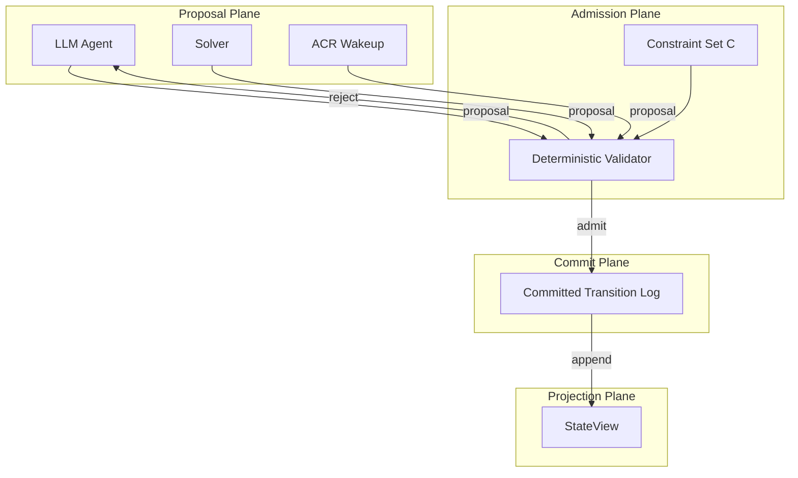

本記事は [arXiv:2607.00269](https://arxiv.org/abs/2607.00269) の解説記事です。

## 論文概要（Abstract）

Mnemosyne は、LLM が生成するワークフローアクションを「信頼されていない提案（untrusted proposal）」として扱い、宣言的な制約セットに対する決定論的承認を経なければコミットできないようにする Agentic Transaction Processing（ATP）モデルとそのランタイムである。著者らは、従来のトランザクション処理が信頼されたアプリケーションを前提としている点を課題として指摘し、LLM エージェントのように能力が不確実な提案者に対しても正しさを保証する新たな形式モデルを提案している。4つの安全性定理が証明されており、ベンチマーク実験では ATP 導入により不正コミットが 0 件に抑えられ、オーバーヘッドは 6% 未満であったと報告されている。

この記事は [Zenn記事: LangGraph×Sagaパターンで実装するAIワークフローの補償トランザクション設計](https://zenn.dev/0h_n0/articles/2456f07d38fc2e) の深掘りです。

## 情報源

- **arXiv ID**: 2607.00269
- **URL**: [https://arxiv.org/abs/2607.00269](https://arxiv.org/abs/2607.00269)
- **著者**: Edward Y. Chang, Longling Geng, Emily J. Chang（Stanford University, QuadriumAI）
- **投稿日**: 2026年6月30日（v2: 2026年7月5日）
- **分野**: cs.AI
- **キーワード**: Agentic Transaction Processing, LLM workflow validation, compensating transactions, deterministic admission

## 背景と動機（Background & Motivation）

LLM エージェントが自律的にワークフローを構成・実行するシステムが増加している。たとえば旅行予約エージェントがフライト予約、ホテル手配、決済を一連のステップとして実行するケースや、コード生成エージェントがビルド・テスト・デプロイを自動化するケースが典型である。

しかし、LLM が生成するアクションには以下の問題が存在する。

1. **構文的に正しくても意味的に不正**: たとえばフォーマット上有効な予約リクエストだが、既に満席の便を指定している
2. **陳腐化（staleness）**: 生成時点では有効だったが、実行時点では状態が変化している
3. **矛盾（contradiction）**: 複数のアクションが互いに整合しない制約を持つ
4. **証拠破壊（evidence destruction）**: 障害時の修復において、元の障害原因を示すログや状態を上書きしてしまう

従来のトランザクション処理（ACID、Saga パターン等）は、アプリケーションが信頼されたプログラマによって書かれた決定論的なコードであることを前提としている。しかし、LLM エージェントは確率的であり、能力が不確実であるため、この前提が成り立たない。

Saga パターンでは各ステップに補償トランザクションを定義して部分的な障害からの回復を実現するが、補償トランザクション自体も LLM が生成する場合、補償が新たな不整合を引き起こすリスクがある。著者らはこの問題を「提案者の能力に依存しない正しさの保証」として定式化し、ATP モデルを提案している。

## 主要な貢献（Key Contributions）

- **ATP（Agentic Transaction Processing）モデルの提案**: LLM 生成アクションを信頼されない提案として扱い、決定論的承認ゲートで正しさを保証する形式モデルを定義した
- **4つの安全性定理の証明**: Authority Separation、Serial-Equivalent Generative Admission、Evidence-Preserving Repair、Obligation Containment の4定理を証明し、コミット状態の正しさが提案者の能力から独立であることを形式的に保証した
- **Mnemosyne ランタイムの実装**: 4プレーン構成（Proposal / Admission / Commit / Projection）のランタイムを実装し、実用的なシステムとして動作することを示した
- **ベンチマークによる有効性検証**: AuthorityBench と GuardrailComparatorBench の2つのベンチマークで、従来の Saga ガードレールでは見逃す不正コミットを ATP が完全に防止できることを実証した

## 技術的詳細（Technical Details）

### ATP の3原則

ATP モデルは以下の3つの核心原則に基づいて設計されている。

**原則1: Proposal Non-Authority（PNA）**

LLM やソルバー等の提案者は、提案（proposal）のみを行うことができ、システム状態を直接変更（コミット）する権限を持たない。

$$
\forall a \in \mathcal{A}_{\text{proposer}}: \; a \in \text{Propose}(\mathcal{S}) \;\land\; a \notin \text{Commit}(\mathcal{S})
$$

ここで $\mathcal{A}_{\text{proposer}}$ は提案者が発行可能なアクション集合、$\mathcal{S}$ はシステム状態、$\text{Propose}(\mathcal{S})$ は提案操作の集合、$\text{Commit}(\mathcal{S})$ はコミット操作の集合である。

**原則2: Deterministic Admission（DA）**

各提案は宣言的に定義された制約セット $\mathcal{C}$ と実効状態 $\sigma_{\text{eff}}$ に対して決定論的に検証される。承認判断は提案の内容と現在の状態のみに依存し、提案者が誰であるかには依存しない。

$$
\text{admit}(p, \sigma_{\text{eff}}) = \bigwedge_{c \in \mathcal{C}} c(p, \sigma_{\text{eff}}) \in \{\text{true}, \text{false}\}
$$

ここで $p$ は提案、$c$ は個々の制約関数である。同じ提案と状態に対して常に同一の結果を返す。

**原則3: Intelligence-Decoupled Correctness（IDC）**

コミットされた状態の正しさは、提案者の知能・能力・信頼性から独立している。これは PNA と DA の組み合わせから導かれる性質であり、ATP の安全性保証の核心である。

### Mnemosyne ランタイムアーキテクチャ

Mnemosyne ランタイムは4つのプレーンで構成される。



**Proposal Plane**: LLM エージェント、制約ソルバー、ACR（Automated Compensating Repair）ウェイクアップの3種類の提案者が候補アクションを生成する。LLM は自然言語理解に基づく柔軟な提案を行い、ソルバーは制約充足問題として最適解を探索し、ACR は障害検出時に自動的に修復提案を生成する。

**Admission Plane**: 決定論的バリデータが制約セット $\mathcal{C}$ と実効状態 $\sigma_{\text{eff}}$ に基づいて各提案の承認・拒否を判定する。このプレーンには確率的要素が存在せず、承認判断は完全に再現可能である。

**Commit Plane**: 承認された遷移を Committed Transition Log（CTL）に追加する。CTL は append-only のログであり、一度コミットされたエントリは変更されない。これにより監査可能性と証拠保全が保証される。

**Projection Plane**: CTL から実効状態 $\sigma_{\text{eff}}$ を StateView として投影する。StateView は CTL の決定論的な関数であり、任意の時点での整合的な状態を再構築できる。

$$
\sigma_{\text{eff}}(t) = \text{Project}(\text{CTL}[0:t])
$$

### 安全性定理

著者らは以下の4つの安全性定理を証明している。

**Theorem 1: Authority Separation**

PNA と DA が成立する場合、IDC が保証される。すなわちコミットされた状態は提案者の能力から独立している。

$$
\text{PNA} \;\land\; \text{DA} \implies \text{IDC}
$$

この定理は、たとえ LLM が誤った提案を大量に生成したとしても、決定論的承認ゲートを通過した提案のみがコミットされるため、コミット状態の正しさは LLM の性能に依存しないことを意味する。

**Theorem 2: Serial-Equivalent Generative Admission**

同一の競合スコープ（conflict scope）に属する並行提案について、ATP は直列化可能な順序での承認を保証する。

$$
\forall p_i, p_j \in \text{ConflictScope}(r): \; \text{admit}(p_i) \prec \text{admit}(p_j) \;\lor\; \text{admit}(p_j) \prec \text{admit}(p_i)
$$

ここで $r$ は共有リソース、$\prec$ は承認の順序関係である。これにより、並行する LLM エージェントが同一リソースに対して矛盾する変更を提案した場合でも、直列実行と等価な結果が保証される。

**Theorem 3: Evidence-Preserving Repair**

修復操作はトリガーとなった障害の証拠を破壊しない。

$$
\forall \text{repair} \in \text{Repair}(\text{fault}): \; \text{Evidence}(\text{fault}) \subseteq \text{CTL}_{\text{post-repair}}
$$

CTL が append-only であるため、修復操作は新たなエントリを追加するだけであり、障害を記録した既存エントリを変更・削除できない。これにより、障害の根本原因分析（RCA）に必要な情報が常に保持される。

**Theorem 4: Obligation Containment**

ACR（Automated Compensating Repair）は提案のみを行うことができ、システム状態を直接変更する権限を持たない。ACR 自体も提案者として PNA の制約下にあるため、修復提案もまた承認ゲートを通過しなければコミットされない。

$$
\forall a \in \mathcal{A}_{\text{ACR}}: \; a \in \text{Propose}(\mathcal{S}) \;\land\; a \notin \text{Commit}(\mathcal{S})
$$

### 補償メカニズム

ATP における補償は、従来の Saga パターンの補償トランザクションとは異なるアプローチをとっている。

**Dependency-Closed Compensation（DCC）**

有効な依存関係を持つトランザクションに対する補償を防止する機構である。たとえば、フライト予約が成功した後にホテル予約が失敗した場合、フライト予約に依存する後続ステップ（空港送迎の予約等）が既に成功していれば、フライト予約の単純な取り消しは依存関係を破壊する。DCC は依存関係グラフを解析し、安全に補償可能な範囲を決定する。

$$
\text{CanCompensate}(t_i) = \neg \exists t_j \in \text{Active}: \; t_j \xrightarrow{\text{dep}} t_i
$$

ここで $t_i$ は補償対象のトランザクション、$\text{Active}$ はアクティブなトランザクション集合、$\xrightarrow{\text{dep}}$ は依存関係を表す。

**Transactional Rollback Safety**

リストアポイントからの決定論的回復を保証する。CTL の特定の時点をリストアポイントとして指定し、そこからの状態を再構築することで、非決定論的な修復を排除する。

**LCRP（Localized Cascading Repair Protocol）**

予期しない障害が発生した場合に、影響範囲を局所化して修復する手法である。グローバルな再計算を避け、障害の影響を受けたトランザクションのみを対象に修復提案を生成する。著者らの実験では、LCRP による修復の編集量がグローバル再計算の約 1/10 であったと報告されている。

## 実装のポイント（Implementation）

### 制約セットの定義

ATP の実効性は制約セット $\mathcal{C}$ の設計に依存する。以下は旅行予約ワークフローにおける制約定義の例である。

```python
from dataclasses import dataclass
from datetime import datetime
from typing import Protocol


@dataclass(frozen=True)
class Proposal:
    """LLM が生成するアクション提案

    Attributes:
        action_type: アクションの種類（book_flight, book_hotel 等）
        params: アクションのパラメータ
        proposer_id: 提案者の識別子
        timestamp: 提案の生成時刻
    """

    action_type: str
    params: dict[str, object]
    proposer_id: str
    timestamp: datetime


class Constraint(Protocol):
    """承認制約のプロトコル"""

    def check(self, proposal: Proposal, state: "StateView") -> bool:
        """提案が制約を満たすか検証する

        Args:
            proposal: 検証対象の提案
            state: 現在の実効状態

        Returns:
            制約を満たす場合 True
        """
        ...


@dataclass(frozen=True)
class StateView:
    """CTL から投影された実効状態

    Attributes:
        committed_transitions: コミット済み遷移のリスト
        active_reservations: アクティブな予約の集合
        resource_locks: リソースロックの状態
    """

    committed_transitions: tuple[dict[str, object], ...]
    active_reservations: frozenset[str]
    resource_locks: dict[str, str]


class SeatAvailabilityConstraint:
    """座席の空き状況を検証する制約"""

    def check(self, proposal: Proposal, state: StateView) -> bool:
        """フライト予約提案に対して座席が利用可能か検証する

        Args:
            proposal: フライト予約の提案
            state: 現在の実効状態

        Returns:
            座席が利用可能な場合 True
        """
        if proposal.action_type != "book_flight":
            return True
        flight_id = str(proposal.params.get("flight_id", ""))
        booked = sum(
            1
            for t in state.committed_transitions
            if t.get("action_type") == "book_flight"
            and t.get("flight_id") == flight_id
            and t.get("status") == "active"
        )
        capacity = int(proposal.params.get("capacity", 0))
        return booked < capacity


class DateConsistencyConstraint:
    """日程の整合性を検証する制約"""

    def check(self, proposal: Proposal, state: StateView) -> bool:
        """ホテルのチェックイン日がフライト到着日以降であることを検証する

        Args:
            proposal: ホテル予約の提案
            state: 現在の実効状態

        Returns:
            日程が整合する場合 True
        """
        if proposal.action_type != "book_hotel":
            return True
        checkin = proposal.params.get("checkin_date")
        flight_arrival = None
        for t in reversed(state.committed_transitions):
            if (
                t.get("action_type") == "book_flight"
                and t.get("status") == "active"
            ):
                flight_arrival = t.get("arrival_date")
                break
        if flight_arrival is None or checkin is None:
            return False
        return str(checkin) >= str(flight_arrival)
```

### 決定論的バリデータ

Admission Plane の中核となる決定論的バリデータは、全ての制約を順次適用して承認判定を行う。

```python
from dataclasses import dataclass


@dataclass
class AdmissionResult:
    """承認判定の結果

    Attributes:
        admitted: 承認された場合 True
        violated_constraints: 違反した制約の名前リスト
        proposal: 判定対象の提案
    """

    admitted: bool
    violated_constraints: list[str]
    proposal: Proposal


class DeterministicValidator:
    """決定論的承認バリデータ

    全ての提案に対して制約セット C を適用し、
    承認・拒否を決定論的に判定する。
    """

    def __init__(self, constraints: list[Constraint]) -> None:
        """バリデータを初期化する

        Args:
            constraints: 適用する制約のリスト
        """
        self._constraints = constraints

    def admit(
        self, proposal: Proposal, state: StateView
    ) -> AdmissionResult:
        """提案を検証し承認判定を行う

        Args:
            proposal: 検証対象の提案
            state: 現在の実効状態

        Returns:
            承認判定の結果
        """
        violated: list[str] = []
        for constraint in self._constraints:
            if not constraint.check(proposal, state):
                violated.append(type(constraint).__name__)
        return AdmissionResult(
            admitted=len(violated) == 0,
            violated_constraints=violated,
            proposal=proposal,
        )
```

### Committed Transition Log（CTL）

CTL は append-only のログとして実装され、Evidence-Preserving Repair（Theorem 3）の基盤となる。

```python
from dataclasses import dataclass, field
from datetime import datetime


@dataclass
class TransitionEntry:
    """CTL の各エントリ

    Attributes:
        sequence_id: 単調増加するシーケンス番号
        proposal: 元の提案
        admission_result: 承認判定の結果
        committed_at: コミット時刻
        entry_type: エントリの種別（commit / compensate / repair）
    """

    sequence_id: int
    proposal: Proposal
    admission_result: AdmissionResult
    committed_at: datetime
    entry_type: str = "commit"


class CommittedTransitionLog:
    """Append-only の Committed Transition Log

    一度追加されたエントリは変更・削除できない。
    これにより Theorem 3（Evidence-Preserving Repair）が保証される。
    """

    def __init__(self) -> None:
        self._entries: list[TransitionEntry] = []
        self._next_seq: int = 0

    def append(self, entry: TransitionEntry) -> int:
        """エントリを追加する

        Args:
            entry: 追加するエントリ

        Returns:
            割り当てられたシーケンス番号
        """
        entry_with_seq = TransitionEntry(
            sequence_id=self._next_seq,
            proposal=entry.proposal,
            admission_result=entry.admission_result,
            committed_at=entry.committed_at,
            entry_type=entry.entry_type,
        )
        self._entries.append(entry_with_seq)
        seq = self._next_seq
        self._next_seq += 1
        return seq

    def get_entries(
        self, start: int = 0, end: int | None = None
    ) -> tuple[TransitionEntry, ...]:
        """指定範囲のエントリを取得する

        Args:
            start: 開始シーケンス番号
            end: 終了シーケンス番号（None の場合は末尾まで）

        Returns:
            エントリのタプル（不変）
        """
        return tuple(self._entries[start:end])

    @property
    def length(self) -> int:
        """現在のログ長を返す"""
        return len(self._entries)
```

## 実験結果（Experimental Results）

### AuthorityBench

AuthorityBench は、LLM エージェントが制約に違反するアクションを生成するシナリオを評価するベンチマークである。著者らの報告によると、ベースライン（制約チェックなし）では 35 件の権限違反が発生したのに対し、ATP 導入後は 0 件に抑えられている。

| 手法 | 権限違反数 | 不正コミット数 |
|------|-----------|---------------|
| ベースライン（制約なし） | 35 | 35 |
| ATP（Mnemosyne） | 0 | 0 |

### GuardrailComparatorBench

GuardrailComparatorBench は、ATP と従来の Saga ガードレールを比較するベンチマークである。

| 手法 | 受理数 | 不正コミット数 | ATP 固有ハザード検出数 |
|------|--------|---------------|---------------------|
| Workflow/Saga guardrails | 10 | 4 | 0/6 |
| ATP（Mnemosyne） | 4 | 0 | 6/6 |

著者らの報告では、Saga ガードレールは 10 件の提案を受理し、そのうち 4 件が不正コミットとなっている。一方 ATP は 4 件のみを受理し、不正コミットは 0 件であった。さらに ATP は Saga ガードレールが検出できない 6 種類の ATP 固有ハザードを全て検出している。

### ATP 固有ハザード

著者らが定義する 6 種類の ATP 固有ハザードは以下の通りである。

1. **Stale-state proposal**: 生成時と承認時の間に状態が変化した提案
2. **Contradictory multi-step**: 複数ステップ間で矛盾する制約を持つ提案
3. **Evidence-destroying repair**: 障害の証拠を破壊する修復提案
4. **Unbounded obligation cascade**: 補償が連鎖的に拡大する修復提案
5. **Authority escalation**: 提案者の権限を超えるアクション
6. **Dependency-violating compensation**: 有効な依存関係を無視する補償

これらのハザードは従来の Saga パターンの補償トランザクションでは検出できない。Saga パターンは各ステップの成功/失敗に基づく補償を定義するが、提案の権限、証拠の保全、依存関係の閉包などは設計の範囲外であるためである。

### パフォーマンス

オーバーヘッドについて、著者らは ATP 導入によるレイテンシの増加が 6% 未満であったと報告している。主要なコストは Admission Plane での制約チェックであるが、制約は宣言的かつ決定論的であるため、LLM 推論のコストと比較すると無視できるレベルである。

修復の効率性について、LCRP（Localized Cascading Repair Protocol）による修復編集量はグローバル再計算の約 1/10 であったと報告されている。これは障害の影響範囲を局所化し、影響を受けたトランザクションのみを対象に修復を行うためである。

## 実運用への応用（Practical Applications）

### LangGraph / Saga パターンとの統合

Mnemosyne の ATP モデルは、LangGraph 等の既存ワークフローフレームワークにおける Saga パターンの拡張として位置づけられる。従来の Saga パターンでは補償トランザクションの定義が開発者の責任であり、LLM が補償を生成する場合の安全性は保証されていない。ATP の Admission Plane を Saga の各ステップに挿入することで、補償トランザクション自体の安全性も検証可能になる。

### 制約セットの設計指針

実運用における制約セット $\mathcal{C}$ の設計では以下の点が重要になる。

1. **完全性**: 保護すべき不変条件を網羅的に制約として記述する。制約に含まれない条件は検証されない
2. **独立性**: 各制約は他の制約に依存せず、単独で真偽を判定できるよう設計する
3. **効率性**: 制約チェックは提案ごとに実行されるため、計算量を $O(1)$ または $O(\log n)$ に抑える
4. **進化性**: ドメイン要件の変化に伴い制約を追加・修正できるよう、宣言的に管理する

### 監査とコンプライアンス

CTL の append-only 特性は、金融・医療等の規制産業における監査要件と親和性が高い。全ての提案・承認判定・コミットが不変のログとして記録されるため、事後的な検証が可能である。Theorem 3（Evidence-Preserving Repair）により、障害修復後も元の障害記録が保持されるため、根本原因分析（RCA）の実施が保証される。

## 関連研究（Related Work）

### トランザクション処理

ACID トランザクションは単一データベース内の整合性を保証するが、分散システムでは適用が困難である。Saga パターン（Garcia-Molina & Salem, 1987）は長期トランザクションを補償可能なサブトランザクションに分解するアプローチであり、マイクロサービスアーキテクチャで広く採用されている。ただし Saga は提案者が信頼されたプログラムであることを前提としており、LLM エージェントのような不確実な提案者への対応は設計に含まれていない。

### LLM エージェントの安全性

LLM エージェントの出力を検証するアプローチとして、Constitutional AI（Bai et al., 2022）やガードレール（NeMo Guardrails 等）が存在する。これらは LLM の出力に対するフィルタリングを提供するが、トランザクションの整合性、依存関係の管理、証拠の保全といった側面はカバーしていない。ATP はこれらの手法と相補的であり、LLM の出力品質向上（ガードレール）とシステム状態の整合性保証（ATP）を組み合わせることが可能である。

### ワークフローエンジン

Apache Airflow、Temporal、Prefect 等のワークフローエンジンは、タスクの実行順序、リトライ、障害処理を管理する。しかしこれらは実行されるタスクが事前に定義された信頼されたコードであることを前提としている。LLM が動的にタスクを生成するエージェント型ワークフローでは、タスクの内容自体が不確実であるため、実行前の検証が必要になる。Mnemosyne の Admission Plane はこの検証レイヤーとして既存ワークフローエンジンに統合可能な設計となっている。

## まとめ

Mnemosyne は、LLM エージェントが生成するワークフローアクションの安全性を保証するための形式的フレームワークである。核心的なアイデアは「LLM の出力は信頼されない提案であり、決定論的な承認ゲートを通過しなければコミットできない」という原則である。

ATP の3原則（PNA、DA、IDC）と4つの安全性定理により、コミット状態の正しさが提案者の能力から独立であることが形式的に保証されている。実験結果では、従来の Saga ガードレールが見逃す不正コミットを ATP が完全に防止し、オーバーヘッドは 6% 未満に抑えられている。

LangGraph 等の既存フレームワークで Saga パターンを用いてワークフローの補償トランザクションを実装する際に、ATP の Admission Plane を追加することで、LLM 生成アクションの安全性を体系的に保証できる可能性がある。ただし、制約セット $\mathcal{C}$ の設計が ATP の有効性を左右するため、ドメイン固有の不変条件を網羅的に定義する作業が必要である。

## 参考文献

- Chang, E. Y., Geng, L., & Chang, E. J. (2026). Mnemosyne: Agentic Transaction Processing for Validating and Repairing AI-generated Workflows. *arXiv preprint arXiv:2607.00269*.
- Garcia-Molina, H., & Salem, K. (1987). Sagas. *ACM SIGMOD Record*, 16(3), 249-259.
- Bai, Y., et al. (2022). Constitutional AI: Harmlessness from AI Feedback. *arXiv preprint arXiv:2212.08073*.
