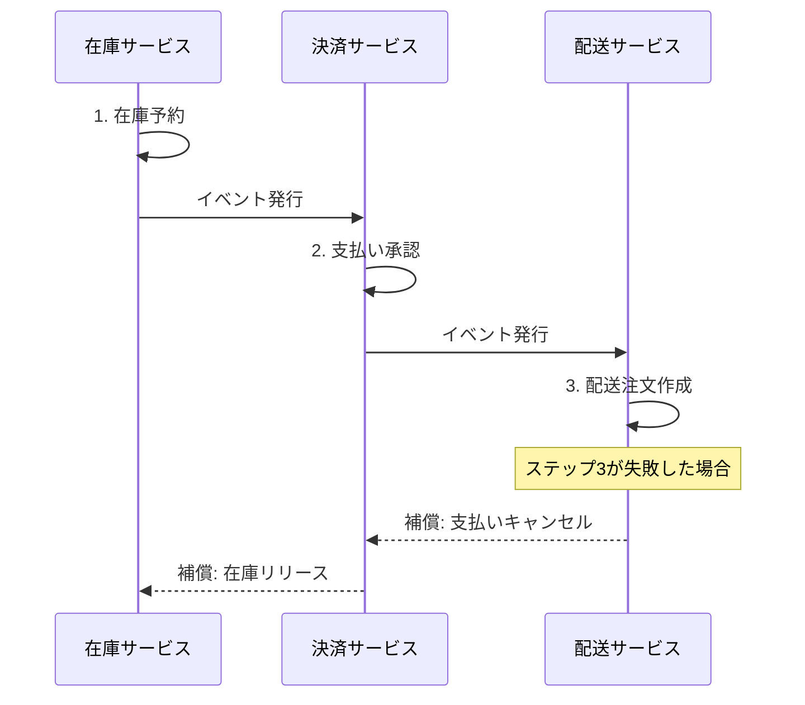
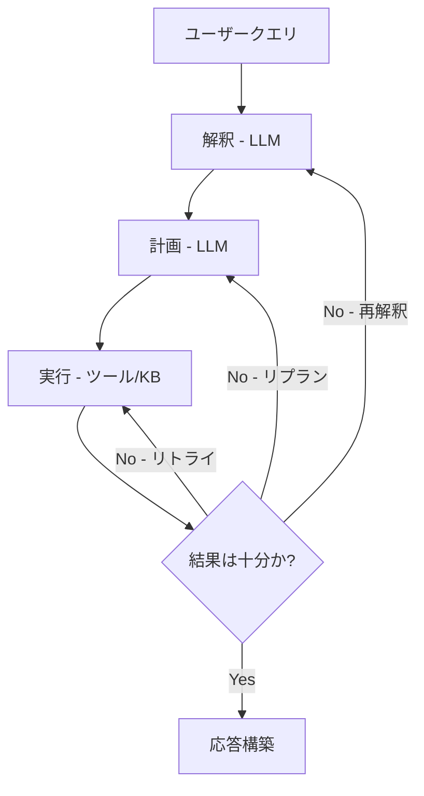
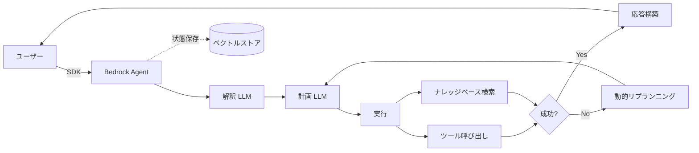

## ブログ概要

本記事は [AWS Prescriptive Guidance: Agentic AI Design Patterns](https://docs.aws.amazon.com/prescriptive-guidance/latest/agentic-ai-patterns/prompt-chaining-saga-patterns.html) の解説記事です。

AWS Prescriptive Guidanceは、分散システムのトランザクション管理で確立されたSagaパターンを、LLMのプロンプトチェーニングに再解釈する設計パターンを提示している。このパターンでは、プロンプトチェーンの各ステップを「アトミックタスク」として扱い、イベント駆動のSagaとして管理することで、ワークフローを分散的・回復可能・意味的に協調可能な構造へと変換する。

AWSはこのアプローチを「トランザクショナル推論（transactional reasoning）」と呼んでおり、Sagaパターンの認知的等価物として位置づけている。従来のデータベーストランザクションのロールバックに相当する操作を、LLMの反省的シーケンスと適応的リプランニングによって実現する点が特徴である。

この記事は [Zenn記事: LangGraph×Sagaパターンで実装するAIワークフローの補償トランザクション設計](https://zenn.dev/0h_n0/articles/2456f07d38fc2e) の深掘りです。Zenn記事ではLangGraphによるPython実装を扱っていますが、本記事ではAWS Prescriptive Guidanceが提示する設計原則と、Amazon Bedrock・Step Functionsによるマネージドサービスでの実装アプローチを掘り下げます。

## 情報源

- **種別**: AWS Prescriptive Guidance（設計パターンガイド）
- **URL**: [https://docs.aws.amazon.com/prescriptive-guidance/latest/agentic-ai-patterns/prompt-chaining-saga-patterns.html](https://docs.aws.amazon.com/prescriptive-guidance/latest/agentic-ai-patterns/prompt-chaining-saga-patterns.html)
- **組織**: Amazon Web Services / Prescriptive Guidance
- **ドキュメント**: Agentic AI Design Patterns

## 技術的背景

### Sagaパターンの原理

Sagaパターンは、1987年にHector Garcia-MolinaとKenneth Salemが提案した分散トランザクション管理手法である。従来のACIDトランザクションが単一データベース内での原子性を保証するのに対し、Sagaは複数のサービスにまたがる長期トランザクション（Long-Lived Transaction）を、一連のローカルトランザクションとそれぞれの補償トランザクション（compensating transaction）の組み合わせとして管理する。

AWSのCloud Design Patternsドキュメントでは、Sagaパターンには2つの実装アプローチがあると整理されている。

| アプローチ | 調整方式 | AWSサービス例 | 特徴 |
|-----------|---------|-------------|------|
| Orchestration | 中央コーディネーターが各ステップを制御 | Step Functions | ワークフロー全体の可視性が高い |
| Choreography | 各サービスがイベントを発行し次を起動 | SNS + SQS + EventBridge | サービス間の結合度が低い |

### エージェント型AIワークフローへの適用動機

マルチエージェントAIワークフローは、従来の分散システムと類似した課題を持つ。各エージェントは外部APIの呼び出し、モデル推論、ツール実行といった副作用を伴い、任意のステップで障害が発生しうる。

AWSは以下の観察に基づいてSagaパターンの適用を推奨している。

1. **漸進的進捗**: プロンプトチェーンの各ステップは、Sagaのローカルトランザクションに相当する
2. **分散決定ポイント**: 各エージェントが自律的に次のアクションを判断する
3. **障害回復**: 中間ステップの失敗時に、補償アクションまたはリプランニングで一貫性を維持する

### プロンプトチェーニングとSagaの構造的類似性

AWS Prescriptive Guidanceは、プロンプトチェーニングがSagaパターンと「構造と目的の両方で類似している」と述べている。以下にその対応関係を示す。

| Sagaパターンの概念 | プロンプトチェーニングの対応物 |
|-------------------|---------------------------|
| ローカルトランザクション | 個々のプロンプト-レスポンスステップ |
| 補償トランザクション | 前ステップへの復帰とリプランニング |
| イベント発行 | コンテキスト付きの中間結果の伝播 |
| コーディネーター | オーケストレーターエージェント |
| トランザクションログ | ベクトルストアによるステップ間状態保存 |

## 実装アーキテクチャ

### Saga Choreographyパターン

AWS Prescriptive Guidanceが示すSaga Choreographyパターンは、中央コーディネーターを持たない実装アプローチである。各サービスまたはコンポーネントがイベントを発行し、次のワークフローアクションをトリガーする。

AWSのドキュメントでは、以下の3ステップの例が示されている。



このパターンの核心は、ステップ3が失敗した場合にシステムが補償アクション（支払いキャンセル、在庫リリース）を逆順に実行して一貫性を維持する点にある。AWSは、このパターンが「イベント駆動アーキテクチャにおいて、サービスが疎結合であり、部分障害が存在する状況下でも状態を一貫して解決する必要がある場合に特に有効」と述べている。

AWSのマイクロサービスオーケストレーションに関する公式ブログでは、Saga Choreographyの実装にSNS + SQSの組み合わせが推奨されている。各マイクロサービスがSNSトピックに成功/失敗イベントを発行し、SQSキューがバッファリングする。EKS + SNSによるSaga実装例では、6つのポッド（Orders、Inventory、Orchestrator、Orders Rollback、Audit、Trail）が協調動作し、在庫不足時にはInventoryマイクロサービスが失敗メッセージをSNSに発行し、Orchestratorが補償キューにルーティングする設計が示されている。

### Agent Choreographyパターン

AWS Prescriptive GuidanceはSaga Choreographyの概念をエージェント型AIに拡張し、Agent Choreographyパターンを定義している。このパターンでは、LLMが以下の4段階で動作する。

1. **解釈（Interpretation）**: LLMが複雑なユーザークエリを解釈し、仮説を生成する
2. **計画（Planning）**: LLMがタスク解決の計画を策定する
3. **実行（Execution）**: ツール呼び出しやナレッジベース検索によるサブタスクの実行
4. **精製（Refinement）**: 結果が不十分な場合、リトライ・前ステップへの復帰・評価ループを適用する



中間結果が不十分（flawed）な場合の回復戦略として、AWSは3つの選択肢を提示している。

| 回復戦略 | Saga対応 | 適用場面 |
|---------|---------|---------|
| 異なるアプローチでリトライ | 同一ステップの再実行 | ツール呼び出しの一時的障害 |
| 前ステップへの復帰とリプラン | 補償トランザクション+再計画 | 計画自体の誤り |
| 評価ループ（evaluator-optimizer） | 検証+補償の組み合わせ | 出力品質の段階的改善 |

AWSは、プロンプトチェーニングがSagaパターンと同様に「部分的進捗とロールバック機構を許容する」が、その実現手段は「補償データベーストランザクションではなく、反復的精製とLLM主導の修正による」と明記している。

### AWS実装パターン: Amazon Bedrockエージェント

AWSのアーキテクチャ例では、Amazon Bedrockエージェントがオーケストレーションの中心を担う。



AWSのドキュメントによると、この実装の要点は以下の通りである。

1. ユーザーがSDKを通じてクエリを送信する
2. Amazon Bedrockエージェントが解釈→計画→実行→応答構築の推論を順次オーケストレーションする
3. ツールが失敗した場合やデータが不十分な場合、エージェントは動的にリプランニングするか、タスクを再表現（rephrase）する
4. メモリ（短期ベクトルストア）がステップ間の状態を保存する

この設計では、Sagaパターンにおける「トランザクションログ」の役割をベクトルストアが担い、各ステップの中間結果とコンテキストを永続化する。障害発生時にはこの保存された状態を参照して、最適な回復戦略を選択できる。

## Production Deployment Guide

### Step Functions + Bedrockによるオーケストレーション実装

本番環境でSaga×プロンプトチェーニングパターンを実装する場合、AWSのマイクロサービスオーケストレーションに関する公式ブログが示すように、Step Functionsによるオーケストレーションが推奨される。Step Functionsはステートマシンとしてオーケストレーションロジックを外部化し、コード変更なしにワークフローの修正を可能にする。

以下にTerraform + Step Functions + Bedrockを用いた実装例を示す。

#### Terraformによるインフラ定義

```hcl
# Step Functions ステートマシン定義
resource "aws_sfn_state_machine" "saga_agent_workflow" {
  name     = "saga-agent-workflow"
  role_arn = aws_iam_role.sfn_execution.arn

  definition = jsonencode({
    Comment = "Saga pattern for agentic AI workflow"
    StartAt = "InterpretQuery"
    States = {
      InterpretQuery = {
        Type     = "Task"
        Resource = "arn:aws:states:::bedrock:invokeModel"
        Parameters = {
          ModelId = "anthropic.claude-sonnet-4-20250514"
          Body = {
            "anthropic_version" = "bedrock-2023-05-31"
            "max_tokens"        = 2048
            "messages" = [{
              "role"    = "user"
              "content" = "States.Format('Interpret and extract intent: {}', $.userQuery)"
            }]
          }
        }
        ResultPath = "$.interpretation"
        Next       = "PlanExecution"
        Catch = [{
          ErrorEquals = ["States.ALL"]
          Next        = "HandleInterpretationFailure"
          ResultPath  = "$.error"
        }]
      }

      PlanExecution = {
        Type     = "Task"
        Resource = "arn:aws:states:::bedrock:invokeModel"
        Parameters = {
          ModelId = "anthropic.claude-sonnet-4-20250514"
          Body = {
            "anthropic_version" = "bedrock-2023-05-31"
            "max_tokens"        = 2048
            "messages" = [{
              "role"    = "user"
              "content" = "States.Format('Create execution plan: {}', $.interpretation)"
            }]
          }
        }
        ResultPath = "$.plan"
        Next       = "ExecuteSubtasks"
        Catch = [{
          ErrorEquals = ["States.ALL"]
          Next        = "CompensatePlan"
          ResultPath  = "$.error"
        }]
      }

      ExecuteSubtasks = {
        Type     = "Task"
        Resource = aws_lambda_function.execute_subtasks.arn
        ResultPath = "$.executionResult"
        Next       = "EvaluateResult"
        Retry = [{
          ErrorEquals     = ["ToolCallError"]
          IntervalSeconds = 2
          MaxAttempts     = 3
          BackoffRate     = 2.0
        }]
        Catch = [{
          ErrorEquals = ["States.ALL"]
          Next        = "CompensateExecution"
          ResultPath  = "$.error"
        }]
      }

      EvaluateResult = {
        Type    = "Choice"
        Choices = [
          {
            Variable     = "$.executionResult.quality"
            StringEquals = "satisfactory"
            Next         = "ConstructResponse"
          },
          {
            Variable         = "$.executionResult.retryCount"
            NumericLessThan  = 3
            Next             = "ReplanAndRetry"
          }
        ]
        Default = "ConstructResponse"
      }

      ReplanAndRetry = {
        Type     = "Task"
        Resource = "arn:aws:states:::bedrock:invokeModel"
        Parameters = {
          ModelId = "anthropic.claude-sonnet-4-20250514"
          Body = {
            "anthropic_version" = "bedrock-2023-05-31"
            "max_tokens"        = 2048
            "messages" = [{
              "role"    = "user"
              "content" = "States.Format('Replan based on failure: {}', $.executionResult.feedback)"
            }]
          }
        }
        ResultPath = "$.plan"
        Next       = "ExecuteSubtasks"
      }

      ConstructResponse = {
        Type     = "Task"
        Resource = aws_lambda_function.construct_response.arn
        End      = true
      }

      # 補償トランザクション
      HandleInterpretationFailure = {
        Type     = "Task"
        Resource = aws_lambda_function.log_and_notify.arn
        Parameters = {
          "stage"  = "interpretation"
          "error.$" = "$.error"
        }
        End = true
      }

      CompensatePlan = {
        Type     = "Task"
        Resource = aws_lambda_function.compensate.arn
        Parameters = {
          "stage"            = "planning"
          "interpretation.$" = "$.interpretation"
          "error.$"          = "$.error"
        }
        End = true
      }

      CompensateExecution = {
        Type     = "Task"
        Resource = aws_lambda_function.compensate.arn
        Parameters = {
          "stage"   = "execution"
          "plan.$"  = "$.plan"
          "error.$" = "$.error"
        }
        Next = "RollbackSideEffects"
      }

      RollbackSideEffects = {
        Type     = "Task"
        Resource = aws_lambda_function.rollback_side_effects.arn
        End      = true
      }
    }
  })
}
```

#### 補償トランザクションのLambda実装

```python
"""Saga補償トランザクションハンドラ."""
from __future__ import annotations

import json
import logging
from typing import Any

import boto3

logger = logging.getLogger(__name__)
logger.setLevel(logging.INFO)

dynamodb = boto3.resource("dynamodb")
table = dynamodb.Table("saga-workflow-state")


def compensate_handler(event: dict[str, Any], context: Any) -> dict[str, Any]:
    """ステージごとの補償アクションを実行する.

    Args:
        event: Step Functionsから渡されるイベント。
            stage: 障害が発生したステージ名。
            error: エラー詳細。
        context: Lambda実行コンテキスト。

    Returns:
        補償結果を含む辞書。
    """
    stage: str = event["stage"]
    error: dict[str, Any] = event.get("error", {})
    execution_id: str = event.get("executionId", "unknown")

    logger.info(json.dumps({
        "event": "compensation_started",
        "level": "INFO",
        "ts": context.get_remaining_time_in_millis(),
        "request_id": context.aws_request_id,
        "stage": stage,
        "execution_id": execution_id,
    }))

    compensators: dict[str, callable] = {
        "planning": _compensate_planning,
        "execution": _compensate_execution,
    }

    compensator = compensators.get(stage)
    if compensator is None:
        logger.warning(json.dumps({
            "event": "no_compensator_found",
            "level": "WARN",
            "stage": stage,
        }))
        return {"compensated": False, "reason": f"No compensator for stage: {stage}"}

    result = compensator(event, execution_id)

    # 補償結果を状態テーブルに記録
    table.put_item(Item={
        "execution_id": execution_id,
        "stage": stage,
        "status": "compensated",
        "error": json.dumps(error),
        "compensation_result": json.dumps(result),
    })

    return {"compensated": True, "stage": stage, "result": result}


def _compensate_planning(event: dict[str, Any], execution_id: str) -> dict[str, Any]:
    """計画ステージの補償: 解釈結果を保持しつつ計画をリセット."""
    logger.info(json.dumps({
        "event": "compensate_planning",
        "level": "INFO",
        "execution_id": execution_id,
    }))
    return {
        "action": "plan_reset",
        "interpretation_preserved": True,
        "message": "Planning stage compensated; interpretation retained for retry.",
    }


def _compensate_execution(event: dict[str, Any], execution_id: str) -> dict[str, Any]:
    """実行ステージの補償: ツール呼び出しの副作用をロールバック."""
    plan: dict[str, Any] = event.get("plan", {})
    executed_tools: list[str] = plan.get("executed_tools", [])

    rollback_results: list[dict[str, Any]] = []
    # 逆順にロールバック（Sagaの補償トランザクション原則）
    for tool in reversed(executed_tools):
        logger.info(json.dumps({
            "event": "rollback_tool",
            "level": "INFO",
            "tool": tool,
            "execution_id": execution_id,
        }))
        rollback_results.append({
            "tool": tool,
            "rolled_back": True,
        })

    return {
        "action": "execution_rollback",
        "tools_rolled_back": len(rollback_results),
        "details": rollback_results,
    }
```

#### IAMロールとポリシー

```hcl
# Step Functions実行ロール
resource "aws_iam_role" "sfn_execution" {
  name = "saga-sfn-execution-role"

  assume_role_policy = jsonencode({
    Version = "2012-10-17"
    Statement = [{
      Action = "sts:AssumeRole"
      Effect = "Allow"
      Principal = {
        Service = "states.amazonaws.com"
      }
    }]
  })
}

# Bedrock InvokeModel権限
resource "aws_iam_role_policy" "sfn_bedrock" {
  name = "sfn-bedrock-invoke"
  role = aws_iam_role.sfn_execution.id

  policy = jsonencode({
    Version = "2012-10-17"
    Statement = [{
      Effect = "Allow"
      Action = [
        "bedrock:InvokeModel",
        "bedrock:InvokeModelWithResponseStream"
      ]
      Resource = "arn:aws:bedrock:*::foundation-model/anthropic.*"
    }]
  })
}

# Lambda呼び出し権限
resource "aws_iam_role_policy" "sfn_lambda" {
  name = "sfn-lambda-invoke"
  role = aws_iam_role.sfn_execution.id

  policy = jsonencode({
    Version = "2012-10-17"
    Statement = [{
      Effect   = "Allow"
      Action   = "lambda:InvokeFunction"
      Resource = [
        aws_lambda_function.execute_subtasks.arn,
        aws_lambda_function.construct_response.arn,
        aws_lambda_function.compensate.arn,
        aws_lambda_function.rollback_side_effects.arn,
        aws_lambda_function.log_and_notify.arn,
      ]
    }]
  })
}

# DynamoDB状態テーブル
resource "aws_dynamodb_table" "saga_state" {
  name         = "saga-workflow-state"
  billing_mode = "PAY_PER_REQUEST"
  hash_key     = "execution_id"
  range_key    = "stage"

  attribute {
    name = "execution_id"
    type = "S"
  }

  attribute {
    name = "stage"
    type = "S"
  }

  ttl {
    attribute_name = "ttl"
    enabled        = true
  }

  point_in_time_recovery {
    enabled = true
  }
}
```

### イベント駆動Choreographyの実装

Choreographyパターンでは、各エージェントが自律的にイベントを発行し、後続のエージェントを起動する。AWSのEKS + SNSによる実装例を参考に、EventBridge + Lambda構成を示す。

```python
"""EventBridge駆動のSaga Choreographyエージェント."""
from __future__ import annotations

import json
import logging
from datetime import datetime, timezone
from typing import Any

import boto3

logger = logging.getLogger(__name__)
events_client = boto3.client("events")
EVENT_BUS_NAME = "saga-agent-bus"


def publish_saga_event(
    source: str,
    detail_type: str,
    detail: dict[str, Any],
    execution_id: str,
) -> dict[str, Any]:
    """Sagaイベントを発行する.

    Args:
        source: イベント発行元のエージェント識別子。
        detail_type: イベント種別（例: "InterpretationComplete"）。
        detail: イベントペイロード。
        execution_id: ワークフロー実行ID。

    Returns:
        EventBridge PutEvents レスポンス。
    """
    detail["execution_id"] = execution_id
    detail["timestamp"] = datetime.now(tz=timezone.utc).isoformat()

    response = events_client.put_events(
        Entries=[{
            "Source": f"saga.agent.{source}",
            "DetailType": detail_type,
            "Detail": json.dumps(detail),
            "EventBusName": EVENT_BUS_NAME,
        }],
    )

    logger.info(json.dumps({
        "event": "saga_event_published",
        "level": "INFO",
        "source": source,
        "detail_type": detail_type,
        "execution_id": execution_id,
    }))

    return response


def interpretation_agent(event: dict[str, Any], context: Any) -> dict[str, Any]:
    """解釈エージェント: クエリを解析し計画エージェントへイベント発行."""
    execution_id = event.get("execution_id", context.aws_request_id)
    query = event["detail"]["query"]

    bedrock = boto3.client("bedrock-runtime")
    response = bedrock.invoke_model(
        modelId="anthropic.claude-sonnet-4-20250514",
        body=json.dumps({
            "anthropic_version": "bedrock-2023-05-31",
            "max_tokens": 2048,
            "messages": [{"role": "user", "content": f"Interpret: {query}"}],
        }),
    )
    interpretation = json.loads(response["body"].read())

    # 成功イベントを発行 -> 計画エージェントがトリガーされる
    publish_saga_event(
        source="interpreter",
        detail_type="InterpretationComplete",
        detail={"interpretation": interpretation, "original_query": query},
        execution_id=execution_id,
    )

    return {"status": "success", "execution_id": execution_id}
```

## パフォーマンス最適化

### ステップ間状態管理の最適化

AWSのドキュメントでは、メモリ（短期ベクトルストア）によるステップ間状態保存が推奨されている。本番環境では、状態保存の方式がワークフロー全体のレイテンシに直接影響するため、以下の最適化が重要である。

| 状態保存方式 | レイテンシ | コスト | 適用場面 |
|------------|----------|------|---------|
| Step Functions組み込みペイロード | < 1ms | 遷移単価に含まれる | 256KB以下の中間結果 |
| DynamoDB | 1-5ms | オンデマンド課金 | 構造化された状態データ |
| S3 | 10-50ms | ストレージ+リクエスト課金 | 大規模なコンテキスト |
| OpenSearch Serverless（ベクトル） | 5-20ms | OCU単位課金 | セマンティック検索が必要な状態 |

Step Functionsのペイロード上限は256KBであるため、LLMの中間出力がこの上限を超える場合はDynamoDBまたはS3へのオフロードが必要となる。AWSのマイクロサービスオーケストレーションブログでは、SQSのメッセージ保持期間を300秒に設定し、キューの滞留を防ぐ設計が推奨されている。

### 補償トランザクションの設計原則

AWSのEKS + SNS実装例から導出される補償トランザクションの設計原則は以下の通りである。

1. **冪等性**: 補償アクションは複数回実行されても同一の結果を返す設計にする。AWSのブログではRDS MySQLへのDELETE操作を補償トランザクションとして使用しており、存在しないレコードのDELETEが安全に失敗する設計となっている

2. **逆順実行**: Sagaパターンの原則に従い、補償アクションは実行順の逆順で適用する。3ステップ（在庫予約→支払い承認→配送注文）の場合、配送失敗時は支払いキャンセル→在庫リリースの順で実行する

3. **トレーサビリティ**: AWSのEKS実装例では、X-Amzn-Trace-Idヘッダーを全マイクロサービスで伝播し、補償操作を含むSagaのライフサイクル全体の可視性を確保している

4. **Dead Letter Queue**: SQSベースの実装では、maxReceiveCountを超えたメッセージをDead Letter Queue（DLQ）にルーティングし、CloudWatch Alarmsで監視する設計が推奨されている

### リトライ戦略

エージェント型AIワークフローでは、LLM呼び出しの一時的障害（レート制限、タイムアウト）が頻発する。Step Functionsの組み込みRetryポリシーにより、指数バックオフ付きリトライを宣言的に定義できる。

```json
{
  "Retry": [{
    "ErrorEquals": ["ThrottlingException", "ServiceUnavailableException"],
    "IntervalSeconds": 2,
    "MaxAttempts": 5,
    "BackoffRate": 2.0,
    "JitterStrategy": "FULL"
  }]
}
```

AWSのマイクロサービスオーケストレーションブログでは、この指数バックオフリトライに加えて、SQSのVisibilityTimeOutによるメッセージの再処理制御が推奨されている。VisibilityTimeOutにより、処理中のメッセージは明示的な削除まで他のコンシューマから見えなくなり、重複処理を防止する。

## 運用での学び

### Orchestration vs. Choreographyの選択基準

AWSの公式ブログでは、Step Functionsによるオーケストレーションがワークフロー制御の明示性という点でChoreographyより優位とされている。特にエージェント型AIワークフローでは、以下の理由でOrchestrationが推奨される場面が多い。

1. **ワークフローの可視化**: Step Functionsのビジュアルエディタにより、Sagaの各ステップと補償パスを視覚的に確認できる
2. **デバッグ容易性**: 各ステートの入出力がCloudWatch Logsに自動記録され、障害箇所の特定が容易
3. **変更容易性**: ステートマシン定義の修正のみでワークフローの実行順序を変更できる（各Lambdaのコード修更不要）

一方、AWSはChoreographyがサービス間の結合度を低く保つ点で有利であることも認めている。大規模な組織で複数チームが独立してエージェントを開発する場合は、EventBridgeによるChoreographyが適する。

### エージェントワークフローにおけるSagaの限界

AWSのドキュメントが示すように、プロンプトチェーニングにおける「補償」は、データベーストランザクションのロールバックとは本質的に異なる。LLMの推論は非決定的であるため、同一入力に対して同一出力が保証されない。これは以下の実務上の課題を生む。

- **完全なロールバックは不可能**: 外部APIへの副作用（メール送信、課金処理など）は、LLMの再推論では取り消せない
- **補償コストの予測困難**: LLMトークン消費量はリプランニングの回数に比例して増加し、事前の見積もりが困難
- **評価ループの収束保証なし**: evaluator-optimizerパターンでは、品質基準の達成に必要なイテレーション数が不定

これらの制約に対し、AWSはStep Functionsの組み込み機能（最大リトライ回数、タイムアウト、Catch句による代替パス）を活用して、ワークフローの有界性（bounded execution）を確保することを推奨している。

### 監視とアラーティング

EKS + SNS実装例に基づく運用監視の推奨構成は以下の通りである。

| 監視項目 | AWSサービス | 閾値例 |
|---------|-----------|-------|
| SQS DLQメッセージ数 | CloudWatch Alarms | > 0 で即時アラート |
| Step Functions失敗率 | CloudWatch Metrics | > 5% で警告 |
| Bedrock推論レイテンシ | CloudWatch Metrics | p99 > 30秒で警告 |
| 補償トランザクション実行数 | カスタムメトリクス | 1時間あたり > 10 で調査 |
| DynamoDB状態テーブルWCU | CloudWatch Metrics | スロットリング発生でアラート |

## 学術研究との関連

### Sagaパターンの学術的起源

Sagaパターンは1987年のACM SIGMOD論文「Sagas」（Garcia-Molina & Salem）で提案された。原論文では、長期トランザクションを短いサブトランザクションに分割し、各サブトランザクションに対応する補償トランザクションを定義することで、ロック保持時間を短縮しつつ一貫性を維持する手法が示された。AWSのパターンガイドはこの概念を忠実に継承しつつ、マイクロサービスおよびエージェント型AIの文脈に適用している。

### トランザクショナル推論の位置づけ

AWS Prescriptive Guidanceが提案する「トランザクショナル推論（transactional reasoning）」は、Sagaの認知的等価物として位置づけられている。この概念は、LLMの推論プロセスを分散トランザクションのアナロジーで捉える試みであり、以下の学術的系譜に接続する。

- **Chain-of-Thought推論（Wei et al., 2022）**: 推論の逐次分解という点でSagaのステップ分割と類似
- **ReAct（Yao et al., 2023）**: 推論と行動の交互実行は、Sagaのローカルトランザクション+イベント発行に対応
- **Reflexion（Shinn et al., 2023）**: 自己反省による修正は、Sagaの補償トランザクションの認知的実装

AWSのアプローチは、これらの学術研究で個別に扱われてきた概念を、Sagaパターンという統一的なフレームワークで整理した点に意義がある。

### マイクロサービスにおけるSagaの発展

Chris Richardsonの「Microservices Patterns」（2018）では、SagaをOrchestrationとChoreographyに分類する現代的な整理が行われた。AWSのCloud Design PatternsとPrescriptive Guidanceはこの分類を踏襲し、AWSサービスへのマッピングを提供している。

## まとめ

AWS Prescriptive Guidanceが提示するSaga×プロンプトチェーニングパターンの要点は以下の3点に集約される。

1. **Sagaパターンは分散サービス呼び出しを補償ロジックで管理する**。プロンプトチェーニングは反省的シーケンスと適応的リプランニングで推論タスクを管理する。両者は漸進的進捗、分散決定ポイント、障害回復を共通の設計原理として持つ

2. **AWS環境での実装は、Step Functions（Orchestration）またはEventBridge + SNS/SQS（Choreography）が中心**となる。Amazon Bedrockエージェントは推論のオーケストレーションを担い、ツール障害時の動的リプランニングとベクトルストアによる状態保存を提供する

3. **トランザクショナル推論はSagaの認知的等価物**として、LLMの非決定的な推論プロセスに分散トランザクションの規律を持ち込む。ただし完全なロールバックは不可能であり、Step Functionsの有界実行機能で実行の収束を保証する設計が必要である

## 参考文献

1. AWS Prescriptive Guidance. "[Prompt chaining saga patterns - Agentic AI Design Patterns](https://docs.aws.amazon.com/prescriptive-guidance/latest/agentic-ai-patterns/prompt-chaining-saga-patterns.html)". Amazon Web Services.
2. AWS Prescriptive Guidance. "[Saga patterns - Cloud design patterns](https://docs.aws.amazon.com/prescriptive-guidance/latest/cloud-design-patterns/saga.html)". Amazon Web Services.
3. AWS Compute Blog. "[Application integration patterns for microservices: Orchestration and coordination](https://aws.amazon.com/blogs/compute/application-integration-patterns-for-microservices-orchestration-and-coordination/)". Amazon Web Services.
4. AWS Containers Blog. "[Implementing the Saga Orchestration Pattern with Amazon EKS and Amazon SNS](https://aws.amazon.com/blogs/containers/implementing-the-saga-orchestration-pattern-with-amazon-eks-and-amazon-sns/)". Amazon Web Services.
5. Garcia-Molina, H., & Salem, K. (1987). "Sagas". ACM SIGMOD Record, 16(3), 249-259.
6. Richardson, C. (2018). "Microservices Patterns". Manning Publications.
7. Wei, J., et al. (2022). "Chain-of-Thought Prompting Elicits Reasoning in Large Language Models". NeurIPS 2022.
8. Yao, S., et al. (2023). "ReAct: Synergizing Reasoning and Acting in Language Models". ICLR 2023.
9. Shinn, N., et al. (2023). "Reflexion: Language Agents with Verbal Reinforcement Learning". NeurIPS 2023.
