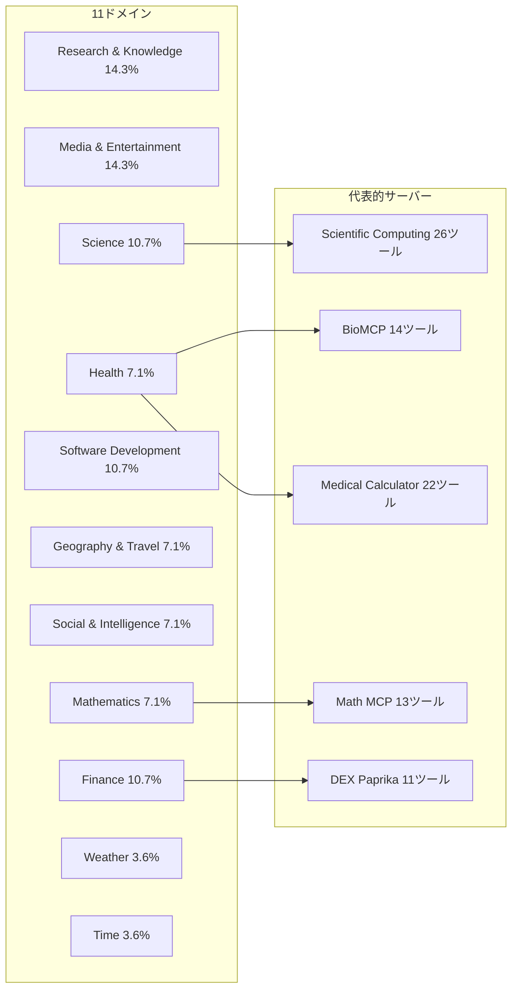

## 論文概要（Abstract）

MCP-Benchは、Model Context Protocol（MCP）に基づく28のライブMCPサーバー・250ツールを用いて、LLMエージェントの実世界マルチステップタスク遂行能力を評価するベンチマークである。金融・旅行・科学計算・学術検索など11ドメインにまたがる104のタスクを通じて、ツール選択・軌跡計画・タスク完了の3軸で20の先端モデルを評価した結果、スキーマ理解は収束しつつある一方、計画能力とクロスドメイン連携に依然として課題が残ることが明らかになった。

本記事は [https://arxiv.org/abs/2508.20453](https://arxiv.org/abs/2508.20453) の解説記事です。

関連するZenn記事: [AIエージェントのツール定義設計原則：スキーマ品質で成功率を変える7つの実践手法](https://zenn.dev/0h_n0/articles/3decfdf91e40bf)

## 情報源

- **arXiv ID**: 2508.20453
- **URL**: [arXiv:2508.20453](https://arxiv.org/abs/2508.20453)
- **著者**: Zhenting Wang, Qi Chang, Hemani Patel, Shachank Biju, Cheng-En Wu et al.（Center for Advanced AI, Accenture / UC Berkeley）
- **発表年**: 2025年8月
- **採択**: NeurIPS 2025 Workshop on Scaling Environments for Agents
- **分野**: Computation and Language (cs.CL)
- **コード**: [https://github.com/Accenture/mcp-bench](https://github.com/Accenture/mcp-bench)

## 背景と動機（Background & Motivation）

LLMエージェントが外部ツールを呼び出してタスクを遂行する能力は急速に重要性を増しているが、既存ベンチマークには以下の限界がある。

**ToolBench**（Qin et al., 2024）は3451ツールと大規模だが、ツール間の依存関係が設計されておらず、浅いワークフローしか評価できない。**BFCL v3**（Patil et al., 2025）は8ドメイン・24ツールと小規模で、明示的なツール名指定を前提としている。**tau-Bench**（Yao et al., 2025）は2ドメイン・28ツールに限定される。MCPエコシステムに対応した**MCP-RADER**（Gao et al., 2025）や**MCPEval**（Liu et al., 2025）も登場しているが、情報のグラウンディング評価、曖昧な指示からのツール検索、クロスドメインワークフローといった実世界で求められる複合能力を網羅的に評価できるベンチマークは存在しなかった。

MCPの普及により、エージェントは標準プロトコルを通じて多数のサーバーに接続し、複数ツールを組み合わせてタスクを遂行する時代に入っている。MCP-Benchはこの現実に対応し、「曖昧な指示からの適切なツール選択」「マルチホップ実行計画」「中間出力に基づく回答のグラウンディング」「クロスドメイン連携」を統合的に評価する初のベンチマークとして提案された。

## 主要な貢献（Key Contributions）

- **大規模・実世界ベンチマーク構築**: 28のライブMCPサーバー・250ツール・11ドメインにまたがる104タスクを構築。サーバー内のツール依存チェーンとサーバー間連携の両方を評価対象とした
- **構造化タスク合成パイプライン**: 依存チェーン発見、自動品質フィルタリング、タスク記述のファジング（曖昧化）の3段階でタスクを生成する再現可能なパイプラインを設計
- **多面的評価フレームワーク**: ルールベースの実行チェック（4指標）とLLM-as-Judgeによるルーブリック評価（6指標）を組み合わせた堅牢な評価手法を提案
- **20モデルの大規模実証研究**: スキーマ理解は収束しつつある一方、計画能力・効率性・クロスドメイン連携に大きな差があることを実証的に明らかにした

## 技術的詳細（Technical Details）

### ベンチマーク設計思想

MCP-BenchはPOMDP（部分観測マルコフ決定過程）の拡張として形式化されている。

$$
\mathcal{M} = (\mathcal{S}, \mathcal{A}, \mathcal{O}, T, R, \mathcal{U}, \Sigma)
$$

ここで、
- $\mathcal{S}$: グローバル状態空間（全MCPサーバーの状態を包含）
- $\mathcal{A} = \mathcal{A}_{\text{planning}} \cup \mathcal{A}_{\text{tools}}$: 行動空間（計画行動とツール呼び出しの和集合）
- $\mathcal{O} = \mathcal{O}_{\text{tools}} \cup \mathcal{O}_{\text{state}}$: 観測空間（ツール実行結果とグローバル状態観測）
- $T$: 状態遷移関数
- $R: \mathcal{S} \to [0, 1]$: 報酬関数
- $\mathcal{U}$: タスク指示空間
- $\Sigma = \{\sigma_1, \ldots, \sigma_n\}$: MCPサーバー集合

エージェントは最大$T_{\max} = 20$ラウンドの反復ループで動作する。各ラウンドでエージェントは計画を立て、ツールを呼び出し、観測結果に基づいて次の行動を決定する。

### 28サーバー・250ツールの構成

11の機能ドメインにまたがる28のサーバーが選定されている。



各サーバーは相互補完的なツール群を提供する。例えばScientific Computingサーバーは26ツールを持ち、線形代数・統計・微分方程式など科学計算の各領域をカバーする。BioMCPは臨床試験検索・遺伝子情報取得など生命科学ドメインのツール群を提供する。

### タスク設計（Task Construction Pipeline）

タスク合成は3段階のパイプラインで行われる。

**Stage 1: 依存チェーン発見**。サーバー内およびサーバー間のツールの入出力結合を分析し、自然な依存チェーンを発見する。線形ワークフロー、並列実行グループ、ハイブリッド構成の3パターンを抽出する。

**Stage 2: 自動品質フィルタリング**。生成されたタスクを2軸で評価する。Solvability（解決可能性、閾値9.0/10）とPractical Utility（実用的有用性、閾値5.0/10）の両方を満たすタスクのみを採用する。

**Stage 3: タスク記述のファジング**。明示的なツール名や実行ステップを除去し、自然言語に変換する。科学計算など数値精度が求められるドメインでは具体的なパラメータ値を保持する。

最終的に104タスクが生成された。内訳は単一サーバータスク56件、2サーバータスク30件、3サーバータスク18件である。各タスクには10のディストラクターサーバー（100以上の追加ツール）が付加され、ツール検索能力を厳密にテストする。

### 評価フレームワーク

評価は**ルールベース**と**LLM-as-Judge**の2層構成で行われる。

#### ルールベース評価（4指標）

ツール呼び出しの軌跡$E = \{e_1, \ldots, e_m\}$に対し、以下を計算する。

1. **Tool Name Validity Rate** $R_{\text{valid}}$: 選択されたツールが利用可能なツール集合$\mathcal{T}_{\text{available}}$に存在するかを検証する

$$
R_{\text{valid}} = \frac{|\{e \in E : \text{tool}(e) \in \mathcal{T}_{\text{available}}\}|}{|E|}
$$

2. **Schema Compliance Rate** $C_{\text{schema}}$: 有効なツール呼び出しのうち、パラメータがスキーマに準拠しているかを検証する

$$
C_{\text{schema}} = \frac{|\{e \in E : \text{valid\_tool}(e) \wedge \text{valid\_schema}(e)\}|}{|\{e \in E : \text{valid\_tool}(e)\}|}
$$

3. **Execution Success Rate** $R_{\text{success}}$: ツール呼び出しが実行時エラーなく完了した割合

$$
R_{\text{success}} = \frac{|\{e \in E : \text{success}(e)\}|}{|E|}
$$

#### LLM-as-Judge評価（6指標・3軸）

o4-miniをジャッジモデルとして、ルーブリックベースで1-10のスコアを付与し[0, 1]に正規化する。

- **Task Completion Quality**: Task Fulfillment（タスク達成度）+ Information Grounding（中間出力に基づく回答の根拠付け）+ Response Relevance
- **Tool Usage Quality**: Tool Appropriateness（ツール選択の適切さ）+ Parameter Accuracy（パラメータ精度）
- **Planning Effectiveness**: Dependency Awareness（依存関係認識）+ Parallelism & Efficiency（並列実行と効率性）

評価バイアスを低減するため、著者らはプロンプトシャッフリングを導入している。各タスクに対し5回のルーブリック順序シャッフルを行い、スコアを平均化する。論文Table 7によると、この手法により変動係数が16.8%から15.1%に改善し、人間の評価との一致度が1.24から1.43（2点満点）に向上したと報告されている。

### ツール選択のFuzzy Instruction Handling

MCP-Benchの特徴的な設計として、タスク記述から明示的なツール名を除去する「ファジング」がある。例えば「arXivでTransformerに関する最新論文を検索し、その被引用数をSemantic Scholarで確認せよ」という指示を「Transformerに関する最新の研究動向と影響度を調べよ」のように変換する。エージェントは利用可能なツールのスキーマのみを手がかりに、適切なツールを自ら発見・選択しなければならない。

## 実験結果（Results）

### 20モデルの性能比較

著者らは20の先端LLMを評価している（論文Table 3より）。以下に主要モデルの結果を示す。

| モデル | Tool Name Valid | Schema Comply | Exec Success | Task Fulfill | Info Ground | Tool Approp | Param Acc | Dep Aware | Parallel Eff | **Overall** |
|--------|:-:|:-:|:-:|:-:|:-:|:-:|:-:|:-:|:-:|:-:|
| gpt-5 | 100.0% | 99.3% | 99.1% | 0.677 | 0.828 | 0.767 | 0.749 | 0.649 | 0.339 | **0.749** |
| o3 | 99.3% | 99.9% | 97.1% | 0.641 | 0.706 | 0.724 | 0.726 | 0.592 | 0.359 | **0.715** |
| gemini-2.5-pro | 99.4% | 99.6% | 96.9% | 0.562 | 0.725 | 0.717 | 0.670 | 0.541 | 0.329 | **0.690** |
| claude-sonnet-4 | 100.0% | 99.8% | 98.8% | 0.554 | 0.676 | 0.689 | 0.671 | 0.541 | 0.328 | **0.681** |
| qwen3-235b | 99.1% | 99.3% | 94.8% | 0.549 | 0.625 | 0.688 | 0.712 | 0.542 | 0.355 | **0.678** |
| gpt-4o | 98.9% | 98.3% | 92.8% | 0.394 | 0.542 | 0.627 | 0.587 | 0.405 | 0.272 | **0.595** |
| llama-3-3-70b | 99.5% | 93.8% | 91.6% | 0.349 | 0.493 | 0.583 | 0.525 | 0.355 | 0.262 | **0.558** |
| gpt-4o-mini | 97.5% | 98.1% | 93.9% | 0.374 | 0.500 | 0.555 | 0.544 | 0.352 | 0.201 | **0.557** |
| mistral-small | 95.7% | 96.1% | 87.2% | 0.373 | 0.445 | 0.537 | 0.446 | 0.349 | 0.232 | **0.510** |
| llama-3-1-8b | 96.1% | 89.4% | 90.9% | 0.261 | 0.295 | 0.352 | 0.310 | 0.221 | 0.141 | **0.428** |

### 主要な知見

**1. スキーマ理解は収束傾向にある。** Tool Name Validity RateとSchema Compliance Rateは、中規模モデルでも95%以上を達成している。著者らは、基本的な実行忠実度はもはやボトルネックではないと報告している。

**2. 計画能力が決定的な差別化要因である。** 最も大きな性能差が現れるのはPlanning Effectiveness軸である。Dependency Awarenessではgpt-5が0.649、llama-3-1-8bが0.221と約3倍の差がある。Parallelism & Efficiencyは全モデルで0.35以下と低く、並列実行計画は未解決課題であることが示唆される。

**3. マルチサーバー設定での安定性に格差がある。** 論文Table 4, 5より、gpt-5は単一サーバー（0.749）からマルチサーバー（0.750）へ移行しても性能が維持される一方、nova-micro-v1は0.520から0.471へ低下する。フロンティアモデルのロバスト性が際立つ。

**4. 効率性の差が顕著である。** 論文Table 6より、タスクあたりの平均ツール呼び出し回数はqwen3-235bが16.4回、o3が28.3回で高スコアを達成するのに対し、llama-3-1-8bは155.6回を要しながら最低スコアにとどまる。効率的な計画がコストと品質の両面で重要であることを示している。

### 失敗パターンの分類

著者らの分析から、以下の失敗パターンが特定されている。

- **ツール幻覚（Tool Hallucination）**: 存在しないツールを呼び出す。小規模モデルで特に顕著（llama-3-2-90bのTool Name Valid Rate: 85.0%に対しSchema Compliance: 85.0%）
- **パラメータ型エラー**: スキーマが要求する型と異なるパラメータを渡す。SchemaCompliance Rateの低さとして観測される
- **情報グラウンディング不足**: 中間ツール出力を最終回答に適切に反映できない。小規模モデルではInformation Groundingが0.295（llama-3-1-8b）と低い
- **冗長実行**: 同一ツールの不必要な繰り返し呼び出し。llama-3-1-8bの平均17.3ラウンド・155.6コールに顕著
- **クロスドメイン連携失敗**: 異なるドメインのサーバー間でデータを受け渡す際のエラー。3サーバータスクで特に顕著

## Production Deployment Guide

MCP-Benchが評価するようなマルチツールエージェントを本番環境に展開する際の、AWS上での実装パターンを示す。

### AWS実装パターン（コスト最適化重視）

MCP-Benchの知見を踏まえ、MCPサーバー群を統合したエージェント基盤のトラフィック量別推奨構成を示す。

| 構成 | トラフィック | コンピュート | LLM推論 | 状態管理 | 月額目安 |
|------|-------------|-------------|---------|---------|---------|
| **Small** | ~100 req/日 | Lambda (512MB, 300s timeout) | Bedrock (Claude Sonnet) | DynamoDB On-Demand | $50-150 |
| **Medium** | ~1,000 req/日 | ECS Fargate (2vCPU, 4GB) | Bedrock + Prompt Caching | ElastiCache Redis | $300-800 |
| **Large** | 10,000+ req/日 | EKS + Karpenter (Spot優先) | Bedrock Batch API + 複数モデルルーティング | Aurora Serverless v2 | $2,000-5,000 |

**コスト試算の注意事項**: 上記は2026年7月時点のAWS ap-northeast-1（東京）リージョン料金に基づく概算値。実際のコストはトラフィックパターン、ツール呼び出し回数（MCP-Benchの結果ではモデルにより16-156回/タスクと大きな差がある）、リージョンにより変動する。最新料金はAWS料金計算ツールで確認を推奨。

**コスト削減テクニック**:
- Spot Instances活用でEKSワーカーノードを最大90%削減
- Reserved Instances（1年コミット）でベースライン負荷を最大72%削減
- Bedrock Batch API使用で非同期処理を50%削減
- Prompt Caching有効化でMCPスキーマ情報の重複送信を30-90%削減

### Terraformインフラコード

#### Small構成（Serverless）: Lambda + Bedrock + DynamoDB

```hcl
# MCP Agent - Small構成 (Serverless)
# 2026-07時点のTerraformモジュールバージョン

terraform {
  required_version = ">= 1.9"
  required_providers {
    aws = {
      source  = "hashicorp/aws"
      version = "~> 5.60"
    }
  }
}

provider "aws" {
  region = "ap-northeast-1"
}

# VPC不使用（コスト削減: NAT Gateway $45/月を回避）

# IAMロール（最小権限）
resource "aws_iam_role" "mcp_agent_lambda" {
  name = "mcp-agent-lambda-role"
  assume_role_policy = jsonencode({
    Version = "2012-10-17"
    Statement = [{
      Action = "sts:AssumeRole"
      Effect = "Allow"
      Principal = { Service = "lambda.amazonaws.com" }
    }]
  })
}

resource "aws_iam_role_policy" "mcp_agent_policy" {
  name = "mcp-agent-policy"
  role = aws_iam_role.mcp_agent_lambda.id
  policy = jsonencode({
    Version = "2012-10-17"
    Statement = [
      {
        Effect   = "Allow"
        Action   = ["bedrock:InvokeModel", "bedrock:InvokeModelWithResponseStream"]
        Resource = "arn:aws:bedrock:ap-northeast-1::foundation-model/anthropic.claude-sonnet-*"
      },
      {
        Effect   = "Allow"
        Action   = ["dynamodb:GetItem", "dynamodb:PutItem", "dynamodb:Query", "dynamodb:UpdateItem"]
        Resource = aws_dynamodb_table.agent_state.arn
      },
      {
        Effect   = "Allow"
        Action   = ["logs:CreateLogGroup", "logs:CreateLogStream", "logs:PutLogEvents"]
        Resource = "arn:aws:logs:ap-northeast-1:*:*"
      }
    ]
  })
}

# Lambda関数
resource "aws_lambda_function" "mcp_agent" {
  function_name = "mcp-agent"
  runtime       = "python3.12"
  handler       = "handler.lambda_handler"
  role          = aws_iam_role.mcp_agent_lambda.arn
  timeout       = 300  # MCPマルチステップ実行に対応
  memory_size   = 512  # ツールスキーマ解析に必要

  environment {
    variables = {
      DYNAMODB_TABLE   = aws_dynamodb_table.agent_state.name
      MAX_ROUNDS       = "20"  # MCP-Benchと同じ上限
      MODEL_ID         = "anthropic.claude-sonnet-4-20250514"
    }
  }

  filename         = "lambda.zip"
  source_code_hash = filebase64sha256("lambda.zip")
}

# DynamoDB（On-Demand: 低トラフィックでコスト最適）
resource "aws_dynamodb_table" "agent_state" {
  name         = "mcp-agent-state"
  billing_mode = "PAY_PER_REQUEST"
  hash_key     = "session_id"
  range_key    = "round_number"

  attribute {
    name = "session_id"
    type = "S"
  }
  attribute {
    name = "round_number"
    type = "N"
  }

  server_side_encryption {
    enabled = true  # KMS暗号化
  }

  point_in_time_recovery {
    enabled = true
  }
}

# CloudWatchアラーム（コスト監視）
resource "aws_cloudwatch_metric_alarm" "lambda_duration" {
  alarm_name          = "mcp-agent-duration-high"
  comparison_operator = "GreaterThanThreshold"
  evaluation_periods  = 3
  metric_name         = "Duration"
  namespace           = "AWS/Lambda"
  period              = 300
  statistic           = "Average"
  threshold           = 240000  # 240秒（300秒タイムアウトの80%）
  alarm_description   = "MCPエージェントの実行時間が閾値を超過"

  dimensions = {
    FunctionName = aws_lambda_function.mcp_agent.function_name
  }
}
```

#### Large構成（Container）: EKS + Karpenter + Spot Instances

```hcl
# MCP Agent - Large構成 (Container)

module "eks" {
  source  = "terraform-aws-modules/eks/aws"
  version = "~> 20.24"

  cluster_name    = "mcp-agent-cluster"
  cluster_version = "1.31"

  vpc_id     = module.vpc.vpc_id
  subnet_ids = module.vpc.private_subnets

  # コントロールプレーンのみ管理、ノードはKarpenterで自動管理
  cluster_endpoint_public_access = false

  enable_irsa = true  # IAM Roles for Service Accounts
}

# Karpenter Provisioner（Spot優先で最大90%コスト削減）
resource "kubectl_manifest" "karpenter_nodepool" {
  yaml_body = yamlencode({
    apiVersion = "karpenter.sh/v1"
    kind       = "NodePool"
    metadata   = { name = "mcp-agent-pool" }
    spec = {
      template = {
        spec = {
          requirements = [
            { key = "karpenter.sh/capacity-type", operator = "In", values = ["spot", "on-demand"] },
            { key = "node.kubernetes.io/instance-type", operator = "In",
              values = ["m7i.xlarge", "m7i.2xlarge", "m6i.xlarge", "m6i.2xlarge"] },
          ]
          nodeClassRef = { name = "default" }
        }
      }
      limits   = { cpu = "64", memory = "256Gi" }
      disruption = {
        consolidationPolicy = "WhenEmptyOrUnderutilized"
        consolidateAfter    = "30s"
      }
    }
  })
}

# Secrets Manager（Bedrock設定・APIキー管理）
resource "aws_secretsmanager_secret" "mcp_config" {
  name                    = "mcp-agent/config"
  recovery_window_in_days = 7
}

# AWS Budgets（月額アラート）
resource "aws_budgets_budget" "mcp_agent" {
  name         = "mcp-agent-monthly"
  budget_type  = "COST"
  limit_amount = "5000"
  limit_unit   = "USD"
  time_unit    = "MONTHLY"

  notification {
    comparison_operator       = "GREATER_THAN"
    threshold                 = 80
    threshold_type            = "PERCENTAGE"
    notification_type         = "ACTUAL"
    subscriber_email_addresses = ["ops-team@example.com"]
  }
}
```

### 運用・監視設定

#### CloudWatch Logs Insights クエリ

```
# コスト異常検知: 1時間あたりのBedrock トークン使用量スパイク
fields @timestamp, @message
| filter @message like /bedrock_invoke/
| stats sum(input_tokens) as total_input, sum(output_tokens) as total_output by bin(1h)
| filter total_input > 500000 or total_output > 100000
| sort @timestamp desc

# レイテンシ分析: MCPツール呼び出しのP95/P99
fields @timestamp, tool_name, duration_ms
| filter event = "mcp_tool_call"
| stats percentile(duration_ms, 95) as p95, percentile(duration_ms, 99) as p99 by tool_name
| sort p99 desc
```

#### CloudWatchアラーム設定

```python
import boto3
from typing import Any

def create_bedrock_token_alarm(
    cloudwatch: Any,
    alarm_name: str = "bedrock-token-spike",
    threshold: float = 100000.0,
) -> dict[str, Any]:
    """Bedrockトークン使用量のスパイクを検知するアラームを作成する。

    Args:
        cloudwatch: boto3 CloudWatchクライアント
        alarm_name: アラーム名
        threshold: 5分間のトークン使用量閾値

    Returns:
        CloudWatch put_metric_alarm のレスポンス
    """
    return cloudwatch.put_metric_alarm(
        AlarmName=alarm_name,
        MetricName="InputTokenCount",
        Namespace="AWS/Bedrock",
        Statistic="Sum",
        Period=300,
        EvaluationPeriods=2,
        Threshold=threshold,
        ComparisonOperator="GreaterThanThreshold",
        AlarmActions=["arn:aws:sns:ap-northeast-1:ACCOUNT:ops-alerts"],
    )
```

#### X-Rayトレーシング設定

```python
from aws_xray_sdk.core import xray_recorder, patch_all
from typing import Any

# boto3自動計装
patch_all()

@xray_recorder.capture("mcp_tool_execution")
def execute_mcp_tool(
    server_name: str,
    tool_name: str,
    parameters: dict[str, Any],
) -> dict[str, Any]:
    """MCPツールを実行し、X-Rayでトレーシングする。

    Args:
        server_name: MCPサーバー名
        tool_name: ツール名
        parameters: ツールパラメータ

    Returns:
        ツール実行結果
    """
    subsegment = xray_recorder.current_subsegment()
    if subsegment:
        subsegment.put_annotation("mcp_server", server_name)
        subsegment.put_annotation("tool_name", tool_name)
        subsegment.put_metadata("parameters", parameters, "mcp")

    # ツール実行ロジック（省略）
    result: dict[str, Any] = {"status": "success"}
    return result
```

#### Cost Explorer自動レポート

```python
import boto3
from datetime import datetime, timedelta
from typing import Any

def get_daily_cost_report(
    ce_client: Any,
    target_date: datetime | None = None,
    threshold_usd: float = 100.0,
) -> dict[str, Any]:
    """日次コストレポートを取得し、閾値超過時にアラートを返す。

    Args:
        ce_client: boto3 Cost Explorerクライアント
        target_date: 対象日（Noneの場合は前日）
        threshold_usd: アラート閾値（USD/日）

    Returns:
        コストレポート（サービス別内訳とアラート情報）
    """
    if target_date is None:
        target_date = datetime.utcnow() - timedelta(days=1)

    start = target_date.strftime("%Y-%m-%d")
    end = (target_date + timedelta(days=1)).strftime("%Y-%m-%d")

    response = ce_client.get_cost_and_usage(
        TimePeriod={"Start": start, "End": end},
        Granularity="DAILY",
        Metrics=["UnblendedCost"],
        GroupBy=[{"Type": "DIMENSION", "Key": "SERVICE"}],
        Filter={
            "Tags": {
                "Key": "Project",
                "Values": ["mcp-agent"],
            }
        },
    )

    total_cost = sum(
        float(g["Metrics"]["UnblendedCost"]["Amount"])
        for result in response["ResultsByTime"]
        for g in result["Groups"]
    )

    return {
        "date": start,
        "total_cost_usd": round(total_cost, 2),
        "alert": total_cost > threshold_usd,
        "services": [
            {
                "service": g["Keys"][0],
                "cost_usd": float(g["Metrics"]["UnblendedCost"]["Amount"]),
            }
            for result in response["ResultsByTime"]
            for g in result["Groups"]
        ],
    }
```

### コスト最適化チェックリスト

**アーキテクチャ選択**:
- [ ] トラフィック量に基づく構成選択（~100 req/日: Serverless、~1,000: Hybrid、10,000+: Container）
- [ ] MCPサーバー接続パターンに基づくネットワーク設計（外部API呼び出し頻度を考慮）

**リソース最適化**:
- [ ] EC2/EKSノード: Spot Instances優先（最大90%削減）
- [ ] ベースライン負荷: Reserved Instances 1年コミット（最大72%削減）
- [ ] Savings Plans: Compute Savings Plans検討
- [ ] Lambda: メモリサイズ最適化（Power Tuningツール使用）
- [ ] ECS/EKS: Karpenterによるアイドル時自動スケールダウン

**LLMコスト削減**:
- [ ] Bedrock Batch API: 非同期処理可能なタスクに適用（50%削減）
- [ ] Prompt Caching: MCPスキーマ情報（250ツール分）のキャッシュ有効化（30-90%削減）
- [ ] モデル選択ロジック: 単純タスクにはgpt-4o-mini相当、複雑タスクにはgpt-5相当を動的ルーティング
- [ ] トークン数制限: MAX_ROUNDS制約で暴走防止（MCP-Benchの結果に基づき20ラウンド上限推奨）
- [ ] ツール呼び出し回数監視: 効率的なモデルは16-30回/タスク、非効率モデルは150回超

**監視・アラート**:
- [ ] AWS Budgets: 月額上限設定（80%到達で通知）
- [ ] CloudWatchアラーム: Bedrockトークンスパイク検知
- [ ] Cost Anomaly Detection: 自動異常検知有効化
- [ ] 日次コストレポート: SNS通知設定

**リソース管理**:
- [ ] 未使用リソース: 月次棚卸し（未使用Lambda、空きEBS等）
- [ ] タグ戦略: Project/Environment/Ownerタグ必須
- [ ] ライフサイクルポリシー: S3/ECRの古いオブジェクト・イメージ自動削除
- [ ] 開発環境: 夜間・休日の自動停止設定
- [ ] DynamoDB: TTL設定でセッション状態の自動削除

## 実運用への応用（Practical Applications）

MCP-Benchの知見は、MCPベースのエージェントシステム構築に直接的な示唆を与える。

**ツールスキーマ設計の重要性**。Zenn記事「[AIエージェントのツール定義設計原則](https://zenn.dev/0h_n0/articles/3decfdf91e40bf)」で論じたスキーマ品質が成功率に直結することが、MCP-Benchのデータからも裏付けられる。Schema Compliance Rateが95%を超えるモデルでも、Task Fulfillmentには大きな差がある。スキーマが正しく解釈されるだけでは不十分であり、ツール間の依存関係を自然に推論できるようなスキーマ設計が求められる。

**モデル選択とコストのトレードオフ**。MCP-Benchの結果は、効率的なモデル（qwen3-235b: 16.4コール/タスク）と非効率なモデル（llama-3-1-8b: 155.6コール/タスク）の間に約10倍のコスト差が生じ得ることを示している。タスク複雑度に応じたモデルルーティングが実運用では不可欠である。

**ディストラクター耐性の確保**。実環境では接続するMCPサーバーが増えるほど無関係なツールも増加する。MCP-Benchが10のディストラクターサーバーを付加する設計は、本番環境でのツール選択精度を事前評価する手法として参考になる。

**計画能力の限界を前提とした設計**。全モデルでParallelism & Efficiencyが0.36以下という結果は、現時点のLLMが並列実行計画を苦手としていることを示す。実運用では、エージェントフレームワーク側で並列実行のオーケストレーションを支援する設計が有効と考えられる。

## 関連研究（Related Work）

- **ToolBench**（Qin et al., 2024）: 49カテゴリ・3451ツールの大規模ツール使用ベンチマーク。ツール数は多いがMCPエコシステム非対応で、ツール間依存関係の評価やクロスドメインワークフローの検証が設計されていない
- **BFCL v3**（Patil et al., 2025）: 8ドメイン・24ツールでFunction Callingの正確性を評価。明示的なツール名指定を前提としており、曖昧な指示からのツール検索能力を測定できない
- **C^3-Bench**（Yu et al., 2025）: ツール間依存関係の推論に特化したベンチマーク。MCP-Benchと相補的な位置づけ
- **MCPWorld**（Yan et al., 2025）: API・GUI・ハイブリッドのコンピュータ使用を統合評価。MCP-Benchがツール呼び出しに特化するのに対し、より広範なインタフェースをカバー
- **AgentBench**（Liu et al., 2023）: Webブラウジング・コード実行・DB操作など8環境でのエージェント評価。MCP-Benchはツール使用に特化し、より深い評価軸を提供

## まとめと今後の展望

MCP-Benchは、MCPエコシステムにおけるLLMエージェントのツール使用能力を多面的に評価する初の包括的ベンチマークである。20モデルの実証研究から、スキーマ理解は収束しつつある一方、計画能力・並列実行効率・クロスドメイン連携に依然として大きな課題が残ることが明らかになった。

実務への示唆として、ツールスキーマの品質設計、タスク複雑度に応じたモデルルーティング、エージェントフレームワーク側での計画支援が重要である。今後は、ライブMCPサーバーの動的な変更への適応能力や、より長い実行ホライズンでの評価が研究課題として挙げられる。

なお、本ベンチマークにはいくつかの制約がある。104タスクという規模は網羅性に限界があり、LLM-as-Judgeの評価バイアスもプロンプトシャッフリングで軽減しているものの完全には排除できない。また、ライブMCPサーバーへの依存は再現性に影響を与える可能性がある。

## 参考文献

- **arXiv**: [https://arxiv.org/abs/2508.20453](https://arxiv.org/abs/2508.20453)
- **Code**: [https://github.com/Accenture/mcp-bench](https://github.com/Accenture/mcp-bench)
- **Leaderboard**: [HuggingFace Spaces mcpbench/mcp-bench](https://huggingface.co/spaces/mcpbench/mcp-bench)
- **Related Zenn article**: [https://zenn.dev/0h_n0/articles/3decfdf91e40bf](https://zenn.dev/0h_n0/articles/3decfdf91e40bf)
