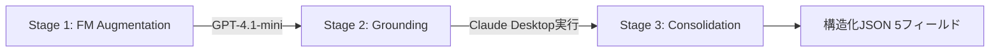

本記事は [arXiv:2602.14878](https://arxiv.org/abs/2602.14878) の解説記事です。

## 論文概要（Abstract）

Model Context Protocol（MCP）はFMベースのエージェントが外部システムと対話する際の標準仕様を定義するプロトコルである。著者らは103のMCPサーバに含まれる856ツールの記述品質を体系的に調査し、6つの品質コンポーネントに基づくスコアリングルーブリックを設計した。スコア3未満を「smell（品質欠陥）」と定義した結果、97.1%のツール記述にsmellが存在することを報告している。augmentationはタスク成功率を中央値5.85pp向上させる一方、実行ステップ数が67.46%増加し16.67%のケースで性能低下するトレードオフを明らかにした。

この記事は [Zenn記事: AIエージェントのツール定義設計原則：スキーマ品質で成功率を変える7つの実践手法](https://zenn.dev/0h_n0/articles/3decfdf91e40bf) の深掘りです。

## 情報源

- **arXiv ID**: [2602.14878](https://arxiv.org/abs/2602.14878)
- **著者**: M.M. Hasan, H. Li, G.K. Rajbahadur, B. Adams, A.E. Hassan
- **発表年**: 2026年（v1: 2月、v3: 5月）
- **分野**: cs.SE, cs.ET
- **再現パッケージ**: [GitHub](https://github.com/SAILResearch/mcp-tool-description-augmentation)

## 背景と動機（Background & Motivation）

MCPはAnthropicが2024年に公開した標準プロトコルであり、LLMベースのエージェントが外部ツールを統一的なインタフェースで呼び出す仕組みを提供する。エージェントがツールを正しく選択し適切な引数を渡すには、ツール記述の品質が決定的に重要である。

しかし、MCPのツール記述は開発者が自由形式の自然言語で記述するため品質にばらつきが生じやすい。ソフトウェア工学ではコードの「smell」検出手法が確立されているが、MCPツール記述に対する体系的品質評価は行われていなかった。著者らは記述品質がタスク成功率に与える影響を定量的に評価し、改善手法のトレードオフを検証している。

## 主要な貢献（Key Contributions）

1. **Smellの体系化**: 6つの品質コンポーネントと5段階スコアリングルーブリックによるsmellの形式的定義
2. **大規模実証分析**: 103 MCPサーバ・856ツールの分析で97.1%にsmellが存在することを定量的に実証
3. **Augmentation手法**: 3段階プロセスを設計し、MCP-Universe（231タスク）上で3モデルによる効果検証
4. **アブレーション分析**: Examples削除が有意な性能低下を引き起こさないことを発見、コンパクト記述の有効性を実証

## 技術的詳細（Technical Details）

### 6つのSmellカテゴリと5段階スコアリング基準

著者らは文献調査から、ツール記述の品質を構成する6つのコンポーネントを特定し、各コンポーネントに対してLikert 5段階のスコアリングルーブリックを設計している。スコアが3未満の場合にsmellとして検出される。

| Smellカテゴリ | コンポーネント | Score 5（理想） | Score 3（最低限） | Score 1（欠陥） |
|---|---|---|---|---|
| **Unclear Purpose** | Purpose（目的） | 正確な動作記述と使用文脈 | 基本的な機能記述あり | 目的が不明・機能不明瞭 |
| **Missing Usage Guidelines** | Guidelines（使用指針） | 起動条件・操作手順が詳細 | 基本的な使用法あり | 使用指針なし |
| **Unstated Limitations** | Limitations（制約） | 既知制約・エッジケース明記 | 主要制約の記載あり | 制約記述なし |
| **Opaque Parameters** | Parameter Explanation（引数説明） | 全引数の型・制約・例示 | 基本的な引数説明あり | 引数説明なし |
| **Underspecified or Incomplete** | Length & Completeness（長さ・完全性） | 十分な詳細度で網羅的 | 最低限の情報量 | 極端に短い・不完全 |
| **Exemplar Issues** | Examples（使用例） | 成功・失敗例の具体的提示 | 基本的な使用例あり | 例示なし |

### データセット構成

| 区分 | サーバ数 | ツール数 | 備考 |
|---|---|---|---|
| 公式サーバ | 23 | - | GitHub, Airbnb, PayPal, Microsoft, Anthropic等 |
| コミュニティサーバ | 80 | - | オープンソース・個人開発 |
| **合計** | **103** | **856** | |
| MCP-Universe対象 | 18 | 202 | ベンチマーク評価用 |
| 残りコーパス | 85 | 654 | 品質比較用 |

Mann-Whitney U検定による比較でMCP-Universeと残りのコーパスの品質差は小さく（Cliff's $\delta$ = -0.15, -0.14、論文Table 3より）、ベンチマーク上の評価がエコシステム全体を概ね代表すると著者らは主張している。

### Augmentation手法の3段階プロセス



**Stage 1: FM-based Augmentation** -- GPT-4.1-miniを用いて既存記述から5コンポーネント（Purpose, Guidelines, Limitations, Parameter Explanation, Length & Completeness）を強化する。

**Stage 2: Examples & Limitations Grounding** -- Claude Desktopで実際のMCPサーバに接続し、ツールごとに2-3タスクを生成・実行する。成功トレースからExamplesを、失敗トレースからLimitationsの実地検証結果を抽出する。

**Stage 3: Consolidation** -- Stage 1と2の出力を統合し、5フィールド（Purpose, Guidelines, Limitations, Parameter Explanation, Examples）の構造化JSONを生成する。

### LLM-as-Jury方式の品質判定手法

著者らは、ツール記述の品質評価にLLM-as-Jury方式を採用している。3つの独立したFM（GPT-4.1-mini、Claude-Haiku-3.5、Qwen3-30B-A3B）が各コンポーネントを5段階で評価し、その平均スコアを最終スコアとする。

評価者間信頼性はIntraclass Correlation Coefficient（ICC(2,1)）で測定されている（論文Table 1より）。

| コンポーネント | ICC(2,1) | 信頼性水準 |
|---|---|---|
| Purpose | 0.82 | Good |
| Guidelines | 0.85 | Good |
| Limitations | 0.84 | Good |
| Parameter Explanation | 0.90 | Excellent |
| Length & Completeness | 0.76 | Good |
| Examples | 0.62 | Moderate |

Cicchetti（1994）の基準で5/6コンポーネントがGood以上、Examples（0.62）のみModerateである。著者らはモデル固有のスタイル選好が影響していると分析している。手動検証として90ツール（10.5%サンプル）に対するWeighted Cohen's Kappaでも全コンポーネント0.70以上を確認している（論文Table 2より）。

## 実験結果（Results）

### RQ1: Smell分布 -- 97.1%のツール記述にsmellが存在

856ツールの分析結果、97.1%のツール記述に少なくとも1つのsmellが含まれていることが判明した。コンポーネント別の prevalence は以下の通りである（論文Section 4.1より）。

| Smellカテゴリ | Prevalence | 中央スコア | 備考 |
|---|---|---|---|
| **Unclear Purpose** | 56% | 2.00 | 最頻出。半数以上が目的不明瞭 |
| **Missing Usage Guidelines** | 高 | 1.00 | 大半のツールで使用指針なし |
| **Unstated Limitations** | 高 | 1.00 | 制約記述はほぼ皆無 |
| **Opaque Parameters** | 高 | 1.00 | 引数説明の欠如が深刻 |
| **Underspecified or Incomplete** | 高 | 1.33-1.67 | コミュニティサーバで顕著 |
| **Exemplar Issues** | 高 | 1.00 | 使用例はほぼ未提供 |

公式サーバとコミュニティサーバの両方でsmellが広く存在し、開発者の経験に関係なく高品質な記述を書く困難さを示唆している。

### RQ2: Full Augmentationの効果

MCP-Universeベンチマーク（231タスク、202ツール、18サーバ、6ドメイン）上で3モデル（GPT-4.1、Qwen3-Coder-480B-A35B、GLM-4.5-355B-A32B）を用いた評価結果を以下に示す。

| 指標 | 改善値（中央値） | 方向 | 解釈 |
|---|---|---|---|
| **Success Rate (SR)** | +5.85 pp | 向上 | タスク完全成功率の改善 |
| **Average Evaluator (AE)** | +15.12% | 向上 | 部分的ゴール達成度の改善 |
| **Average Steps (AS)** | +67.46% | 増加 | 実行コストの大幅増 |
| **Regression Cases** | 16.67% | - | 性能低下が発生するケース |

著者らは、SR/AEの向上はツール選択精度と引数正確性の改善に起因し、AS増加はaugmented記述によるコンテキスト消費増加とFMの冗長な推論傾向が原因と分析している。16.67%のregression発生は、ドメイン特性やツール間依存関係などの実行コンテキストが影響していると指摘している。

### RQ3: アブレーション結果 -- Examplesの削除は統計的に有意な性能低下を引き起こさない

著者らは以下の知見を報告している。

1. **Examples削除の影響なし**: 全ドメイン-モデルの組み合わせで統計的に有意な性能低下なし
2. **Parameter Explanation**: ランタイムで入力スキーマが利用可能な場合、除去の影響は限定的
3. **Purpose, Guidelines, Limitations**: 多くのシナリオで一貫して価値ありと判定
4. **コンパクトバリアント**: フルバージョンと統計的に同等の性能を達成しつつトークンオーバーヘッドを削減

コア3コンポーネント（Purpose + Guidelines + Limitations）に集中するコンパクトな記述が実用的であることを示唆している。

### Pareto曲線による精度-コストトレードオフ

著者らはSRとASの2軸でPareto最適フロンティアを分析している。コンパクトバリアント（Purpose + Guidelines + Limitations）はSRをほぼ維持しつつASを削減するPareto効率的な点に位置し、コンテキストウィンドウ制約が厳しい環境で有利であると報告している。

## Production Deployment Guide

MCPツール記述のaugmentationパイプラインをAWS上に構築する場合の実装パターンを示す。

### AWS実装パターン（コスト最適化重視）

| 構成 | 想定規模 | サービス構成 | 月額コスト試算 |
|---|---|---|---|
| **Small** | ~100ツール/日 | Lambda + Bedrock (Claude Haiku) + DynamoDB | $50-150 |
| **Medium** | ~1,000ツール/日 | ECS Fargate + Bedrock (Claude Sonnet) + Aurora Serverless | $300-800 |
| **Large** | 10,000+ツール/日 | EKS + Karpenter + Bedrock Batch API + ElastiCache | $2,000-5,000 |

*2026年7月時点のAWS東京リージョン料金に基づく概算値。実際のコストはトラフィックパターンにより変動する。*

**コスト削減テクニック**: Bedrock Batch API（50%削減）、Prompt Caching（30-90%削減）、Spot Instances（最大90%削減）、Reserved Instances 1年コミット（最大72%削減）

### Terraformインフラコード

**Small構成（Serverless）: Lambda + Bedrock + DynamoDB**

```hcl
# Small Configuration: Lambda + Bedrock + DynamoDB

resource "aws_iam_role" "augmentation_lambda" {
  name = "mcp-augmentation-lambda-role"
  assume_role_policy = jsonencode({
    Version = "2012-10-17"
    Statement = [{ Action = "sts:AssumeRole", Effect = "Allow",
      Principal = { Service = "lambda.amazonaws.com" } }]
  })
}

resource "aws_iam_role_policy" "lambda_bedrock" {
  name = "bedrock-invoke"
  role = aws_iam_role.augmentation_lambda.id
  policy = jsonencode({
    Version = "2012-10-17"
    Statement = [
      { Effect = "Allow", Action = ["bedrock:InvokeModel"], Resource = "*" },
      { Effect = "Allow", Action = ["dynamodb:PutItem", "dynamodb:GetItem", "dynamodb:Query"],
        Resource = aws_dynamodb_table.tool_descriptions.arn },
    ]
  })
}

resource "aws_dynamodb_table" "tool_descriptions" {
  name         = "mcp-tool-descriptions"
  billing_mode = "PAY_PER_REQUEST"  # On-Demandでコスト最適化
  hash_key     = "server_name"
  range_key    = "tool_name"
  attribute { name = "server_name"; type = "S" }
  attribute { name = "tool_name";   type = "S" }
  server_side_encryption { enabled = true }  # KMS暗号化
}

resource "aws_lambda_function" "augment_tool" {
  function_name = "mcp-tool-augmentation"
  runtime       = "python3.13"
  handler       = "handler.lambda_handler"
  role          = aws_iam_role.augmentation_lambda.arn
  timeout       = 300       # Bedrock呼び出しに十分な時間
  memory_size   = 512       # Power Tuningで最適化推奨
  filename      = "lambda.zip"
  tracing_config { mode = "Active" }  # X-Ray有効化
  environment {
    variables = {
      DYNAMODB_TABLE = aws_dynamodb_table.tool_descriptions.name
      BEDROCK_MODEL  = "anthropic.claude-3-5-haiku-20241022-v1:0"
    }
  }
}
```

**Large構成（Container）: EKS + Karpenter + Spot Instances**

```hcl
# Large Configuration: EKS + Karpenter + Spot Instances

module "eks" {
  source  = "terraform-aws-modules/eks/aws"
  version = "~> 20.31"
  cluster_name    = "mcp-augmentation-cluster"
  cluster_version = "1.32"
  vpc_id     = module.vpc.vpc_id
  subnet_ids = module.vpc.private_subnets
  cluster_endpoint_public_access = false  # プライベートのみ
}

# Karpenter NodePool (Spot優先で最大90%コスト削減)
resource "kubectl_manifest" "karpenter_nodepool" {
  yaml_body = yamlencode({
    apiVersion = "karpenter.sh/v1"
    kind       = "NodePool"
    metadata   = { name = "augmentation-workers" }
    spec = {
      template = { spec = { requirements = [
        { key = "karpenter.sh/capacity-type", operator = "In",
          values = ["spot", "on-demand"] },
        { key = "node.kubernetes.io/instance-type", operator = "In",
          values = ["m7i.xlarge", "m6i.xlarge", "c7i.xlarge"] }
      ] } }
      limits     = { cpu = "64", memory = "256Gi" }
      disruption = { consolidationPolicy = "WhenEmptyOrUnderutilized",
                     consolidateAfter = "30s" }
    }
  })
}

resource "aws_budgets_budget" "monthly" {
  name = "mcp-augmentation-monthly"
  budget_type = "COST"; limit_amount = "5000"; limit_unit = "USD"
  time_unit = "MONTHLY"
  notification {
    comparison_operator = "GREATER_THAN"; threshold = 80
    threshold_type = "PERCENTAGE"; notification_type = "ACTUAL"
    subscriber_email_addresses = ["ops-team@example.com"]
  }
}
```

### 運用・監視設定

**CloudWatch Logs Insights クエリ（コスト異常検知）**:

```
fields @timestamp, @message
| filter @message like /InvokeModel/
| stats sum(inputTokens) as totalInput, sum(outputTokens) as totalOutput by bin(1h)
| filter totalInput > 500000
| sort @timestamp desc
```

**CloudWatch アラーム + X-Ray トレーシング（Python）**:

```python
import boto3
from aws_xray_sdk.core import xray_recorder, patch_all

patch_all()  # boto3自動計装

def create_augmentation_alarms(sns_topic_arn: str) -> None:
    """Augmentationパイプライン用のCloudWatchアラームを作成する。

    Args:
        sns_topic_arn: 通知先のSNS Topic ARN
    """
    cw = boto3.client("cloudwatch", region_name="ap-northeast-1")
    cw.put_metric_alarm(
        AlarmName="mcp-augmentation-bedrock-token-spike",
        MetricName="InputTokenCount", Namespace="AWS/Bedrock",
        Statistic="Sum", Period=3600, EvaluationPeriods=2,
        Threshold=500_000, ComparisonOperator="GreaterThanThreshold",
        AlarmActions=[sns_topic_arn],
    )

@xray_recorder.capture("augment_tool_description")
def augment_tool(server_name: str, tool_name: str, description: str) -> dict:
    """単一ツール記述のaugmentationを実行する。

    Args:
        server_name: MCPサーバ名
        tool_name: ツール名
        description: 元のツール記述

    Returns:
        augmented descriptionの各コンポーネントを含む辞書
    """
    subsegment = xray_recorder.current_subsegment()
    subsegment.put_annotation("server", server_name)
    subsegment.put_metadata("original_length", len(description))
    # ... augmentation logic ...
    return result
```

**Cost Explorer 自動レポート（Python）**:

```python
import boto3
from datetime import date, timedelta

def daily_cost_report(sns_topic_arn: str, threshold_usd: float = 100.0) -> dict:
    """日次コストレポートを取得し、閾値超過時にSNS通知する。

    Args:
        sns_topic_arn: 通知先SNS Topic ARN
        threshold_usd: コスト閾値（USD）

    Returns:
        サービス別コストの辞書
    """
    ce = boto3.client("ce", region_name="us-east-1")
    today = date.today()
    result = ce.get_cost_and_usage(
        TimePeriod={"Start": str(today - timedelta(days=1)), "End": str(today)},
        Granularity="DAILY", Metrics=["UnblendedCost"],
        Filter={"Tags": {"Key": "Project", "Values": ["mcp-augmentation"]}},
        GroupBy=[{"Type": "DIMENSION", "Key": "SERVICE"}],
    )
    costs = {g["Keys"][0]: float(g["Metrics"]["UnblendedCost"]["Amount"])
             for r in result["ResultsByTime"] for g in r["Groups"]}
    total = sum(costs.values())
    if total > threshold_usd:
        boto3.client("sns").publish(
            TopicArn=sns_topic_arn,
            Subject=f"MCP Augmentation Cost Alert: ${total:.2f}/day",
            Message=f"Daily cost ${total:.2f} exceeds ${threshold_usd}.",
        )
    return costs
```

### コスト最適化チェックリスト

**アーキテクチャ選択**: トラフィック量に応じた構成選択（Serverless / Hybrid / Container）、バッチ処理可能なワークロードはBedrock Batch API利用、smell検出はオフピーク実行

**リソース最適化**: Spot Instances優先（最大90%削減）、Reserved Instances 1年コミット（最大72%削減）、Savings Plans検討、Lambda Power Tuning、Karpenterアイドル時スケールダウン、NAT GatewayをVPCエンドポイントで代替

**LLMコスト削減**: Bedrock Batch API（50%削減）、Prompt Caching（30-90%削減）、モデル選択ロジック（初回Haiku→再検証Sonnet）、トークン数制限、アブレーション結果適用（Examples除去）

**監視・アラート**: AWS Budgets（80%到達通知）、CloudWatchアラーム、Cost Anomaly Detection、日次コストレポート、X-Rayトレーシング

**リソース管理**: 未使用リソース削除、タグ戦略（Project/Environment/Owner）、S3ライフサイクルポリシー、開発環境夜間停止、DynamoDB TTL設定

## 実運用への応用（Practical Applications）

**1. コアコンポーネント優先**: Purpose + Guidelines + Limitationsの3コンポーネントに注力することで、フルaugmentationと同等の効果を少ないトークンで達成できる。

**2. 品質ゲート自動化**: LLM-as-JuryスコアリングをCI/CDに組み込み、smell検出を自動化する。ICC 0.76以上の5コンポーネントは自動評価が信頼できる。

**3. Regression対策**: 16.67%で性能低下が発生するため、A/Bテストや段階的ロールアウトによるregression検出が必要である。

**4. コスト管理**: フルaugmentation実行に200-300Mトークン（$75-600 USD/モデル）を要する点を踏まえ、ツール単位の費用対効果評価が重要である。

## 関連研究（Related Work）

- **コードsmell検出**: Mantyla et al.（2003）、Yamashita & Moonen（2012）のコードsmell分類法をツール記述に拡張。FM-based検出のiSmell（Wu et al., 2024b）は存在するがMCPツール記述対象は本研究が初
- **プロンプト最適化**: DSPy（Khattab et al., 2023）、MIPROv2（Opsahl-Ong et al., 2024）はLLMプロンプト自動最適化だがツール記述に特化していない
- **MCPベンチマーク**: MCP-Universe（Luo et al., 2025）を本研究の評価基盤として使用。LiveMCPBench（Mo et al., 2025）、MCPToolBench++（Fan et al., 2025）は記述品質評価に焦点を当てていない
- **MCP品質分析**: Hasan et al.（2025b）のMCPサーバコードsmell分析を、本研究はツール記述（自然言語）に拡張

## まとめと今後の展望

本論文はMCPツール記述のsmellを体系的に定義・検出し、97.1%にsmellが存在することを示した。augmentationはSR +5.85pp/AE +15.12%の改善をもたらすが、AS +67.46%のコスト増と16.67%のregressionを伴うトレードオフが存在する。アブレーション結果からPurpose + Guidelines + Limitationsの3コンポーネントに集中したコンパクト記述が実用的な最適解として示唆されている。今後はドメイン固有のaugmentation最適化、CI/CD統合、FMアーキテクチャ間の汎化性検証が課題である。

## 参考文献

- **arXiv**: [https://arxiv.org/abs/2602.14878](https://arxiv.org/abs/2602.14878)
- **Code**: [https://github.com/SAILResearch/mcp-tool-description-augmentation](https://github.com/SAILResearch/mcp-tool-description-augmentation)
- **MCP-Universe Benchmark**: Luo et al. (2025)
- **Related Zenn article**: [https://zenn.dev/0h_n0/articles/3decfdf91e40bf](https://zenn.dev/0h_n0/articles/3decfdf91e40bf)
