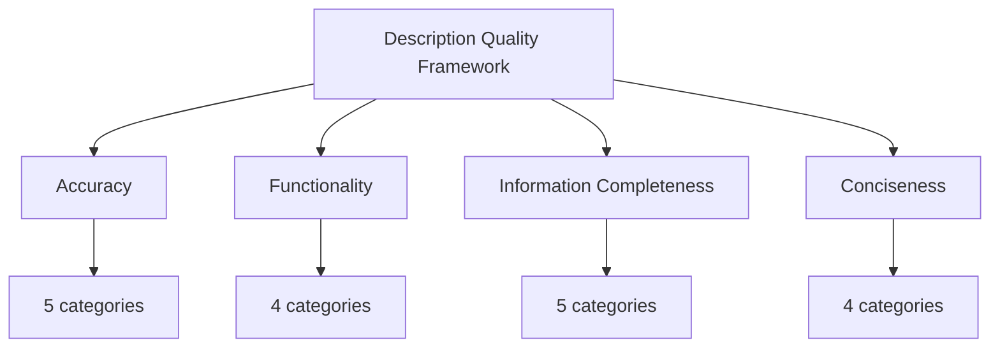
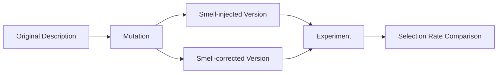

本記事は [arXiv:2602.18914](https://arxiv.org/abs/2602.18914) の解説記事です。

## 論文概要（Abstract）

Model Context Protocol（MCP）サーバーの記述品質を体系的に評価する初の大規模実証研究である。著者らは 10,831 の MCP サーバーを 5 つのプラットフォームから収集し、4 次元 18 カテゴリからなる品質評価フレームワーク（Smell カタログ）を策定した。Mutation-based な実験により、標準準拠の記述を持つツールが競合シナリオで 72% の選択確率を獲得し、ベースライン（20%）に対して 260% の向上を達成することを実証している。特に Functionality 次元が最大 +11.6% の選択確率向上に寄与し、「code-first, description-last」というアンチパターンが品質低下の根本原因であると著者らは指摘している。

この記事は [Zenn記事: AIエージェントのツール定義設計原則：スキーマ品質で成功率を変える7つの実践手法](https://zenn.dev/0h_n0/articles/3decfdf91e40bf) の深掘りです。

## 情報源

- **arXiv ID**: 2602.18914
- **URL**: [https://arxiv.org/abs/2602.18914](https://arxiv.org/abs/2602.18914)
- **著者**: Peiran Wang, Ying Li, Yuqiang Sun, Chengwei Liu, Yang Liu, Yuan Tian
- **投稿日**: 2026年2月21日
- **分野**: cs.SE（Software Engineering）

## 背景と動機（Background & Motivation）

MCP（Model Context Protocol）は、AI エージェントが外部ツールやサービスと対話するための標準プロトコルとして急速に普及している。2024 年後半の仕様公開以降、GitHub をはじめとする複数のプラットフォームで MCP サーバーの数は指数関数的に増加し、本論文の調査時点で 10,000 を超えるサーバーが公開されている。

しかし、この急成長にはツール記述の品質問題が伴っている。MCP サーバーのツール記述（tool description）は、LLM がどのツールをいつ呼び出すかを判断する際の唯一の手がかりとなる。記述が不正確、不完全、または冗長であれば、LLM は誤ったツール選択を行い、エージェントの実行全体が失敗する。

著者らはこの問題の根本原因として「code-first, description-last」アンチパターンを特定している。開発者はツールの機能実装を優先し、記述はリリース直前に最低限の内容で追加する傾向がある。その結果、実際の動作と記述の間に乖離が生じ、パラメータの型情報や副作用の文書化が欠落するケースが広範に見られると報告している。

## 主要な貢献（Key Contributions）

1. **Smell カタログの策定**: MCP サーバー記述の品質を Accuracy・Functionality・Information Completeness・Conciseness の 4 次元 18 カテゴリで体系化した初の分類体系を確立した
2. **大規模実証分析**: 5 プラットフォームから収集した 10,831 の MCP サーバーに対して Smell の分布を定量的に分析し、73% のサーバーで重複ツール名（Repeated Tool Names）が検出されるなど、品質問題の深刻さを実証した
3. **Mutation-based 影響度実験**: 各品質次元がツール選択確率に与える影響を統制実験で定量化し、Functionality が +11.6%、Accuracy が +8.8% の寄与を持つことを明らかにした
4. **クエリ複雑度別の分析**: 10 段階のクエリ複雑度を定義し、複雑度に応じて支配的な品質次元が変化することを示した

## 技術的詳細（Technical Details）

### 4 次元品質フレームワーク

著者らが策定した品質フレームワークは、ツール記述の品質を以下の 4 つの次元で評価する。



**Accuracy（正確性）**: ツール記述が実際の動作を正確に反映しているかを評価する。記述と実装の不一致は LLM の誤判断を直接引き起こすため、最も重大な品質問題となる。

**Functionality（機能性）**: ツールの機能がどの程度明確に記述されているかを評価する。特にツール名の重複や機能説明の曖昧さが、LLM によるツール選択の混乱を招く。

**Information Completeness（情報完全性）**: パラメータの型、戻り値、副作用など、ツール利用に必要な情報が網羅的に記述されているかを評価する。

**Conciseness（簡潔性）**: 記述が冗長でなく、関連する情報のみを含んでいるかを評価する。不必要な修飾語や技術用語の乱用が LLM の文脈窓を圧迫する。

### 18 Smell カテゴリの完全な分類

以下に、著者らが特定した 18 の Smell カテゴリと検出数の一覧を示す。

#### Accuracy（正確性）: 5 カテゴリ

| カテゴリ | 説明 | 検出数 |
|---------|------|--------|
| Inconsistent Behavior | 記述と実際の動作が不一致 | - |
| Unclear Boundaries | ツールの適用範囲が曖昧 | - |
| Non-existent Behaviors | 存在しない動作の記述 | - |
| Undeclared Behaviors | 記述されていない動作の存在 | - |
| Wrong Parameter Meanings | パラメータの意味が誤り | - |

著者らは Accuracy 次元全体で **3,449 件**の Smell インスタンスを検出したと報告している。

#### Functionality（機能性）: 4 カテゴリ

| カテゴリ | 説明 | 検出数 |
|---------|------|--------|
| Repeated Tool Names | ツール名の重複 | 7,894 |
| Repeated Functional Descriptions | 機能説明の重複 | 154 |
| Confusing Functional Descriptions | 機能説明の曖昧さ | 3,572 |
| Missing Trigger Conditions | トリガー条件の欠落 | 2,972 |

Repeated Tool Names が **7,894 件**（全サーバーの 73%）と突出して多い。これは MCP サーバー開発者が汎用的なツール名（`search`、`get`、`create` 等）を安易に使用していることを示している。

#### Information Completeness（情報完全性）: 5 カテゴリ

| カテゴリ | 説明 | 検出数 |
|---------|------|--------|
| Missing Parameter Descriptions | パラメータ説明の欠落 | 1,285 |
| Missing Parameter Type Info | パラメータ型情報の欠落 | 14 |
| Missing Return Value Descriptions | 戻り値説明の欠落 | 3,093 |
| Missing Side Effect Documentation | 副作用文書化の欠落 | 773 |
| (その他) | - | - |

Missing Return Value Descriptions が **3,093 件**と最多であり、ツールの出力仕様が十分に文書化されていない実態が浮き彫りになっている。

#### Conciseness（簡潔性）: 4 カテゴリ

| カテゴリ | 説明 | 検出数 |
|---------|------|--------|
| Clutter with Irrelevant Details | 無関係な詳細の混入 | 2,904 |
| Overuse of Technical Terms | 技術用語の乱用 | 467 |
| Useless Qualifiers | 不要な修飾語 | 324 |
| (その他) | - | - |

### データセット構成

著者らは 5 つのプラットフォームから MCP サーバーを収集している。

| プラットフォーム | 収集対象 |
|----------------|---------|
| GitHub | ソースコードリポジトリ |
| MCP.so | MCP サーバーレジストリ |
| Glama | MCP マーケットプレイス |
| PulseMCP | MCP モニタリングプラットフォーム |
| Smithery | MCP サーバーホスティング |

合計 **10,831 サーバー**を収集し、言語分布は以下の通りである。

| 言語 | サーバー数 |
|------|----------|
| Python | 3,221 |
| TypeScript | 2,908 |
| TS/JS 混合 | 1,556 |
| その他 | 3,146 |

Python と TypeScript が主要な実装言語であり、両者で全体の約 71% を占めている。

### Mutation-based 実験手法の設計

著者らは各品質次元の影響度を測定するため、Mutation-based な統制実験を設計している。



実験設計の要点は以下の通りである。

1. **サーバータイプ**: 10 種類の MCP サーバー（ファイル操作、データベース、API 連携等）を選定
2. **クエリ生成**: 各サーバーに対して 100 クエリを生成（合計 1,000 クエリ）
3. **複雑度**: 10 段階の複雑度レベル（L1-L10）を定義
4. **Mutation**: 各品質次元に対して Smell を注入した劣化版と、Smell を修正した改善版を作成
5. **評価**: LLM に元のツールと Mutation 版のツールを提示し、選択確率を比較

### クエリ複雑度 10 段階の定義

著者らはクエリの複雑度を L1（最小）から L10（完全）の 10 段階で定義している。

| レベル範囲 | 分類 | 特徴 |
|-----------|------|------|
| L1-L3 | Minimal | 単一ツールの単純な呼び出し。ツール名から推測可能 |
| L4-L7 | Moderate | 複数パラメータの指定や条件分岐を含む |
| L8-L10 | Complete | 複数ツールの連携、副作用の考慮、エラーハンドリングを含む |

この段階的定義により、記述品質の影響がクエリの複雑さに応じてどう変化するかを分析可能にしている。

## 実験結果（Experimental Results）

### 次元別影響度

著者らは各品質次元がツール選択確率に与える影響を以下のように報告している。

| 品質次元 | 選択確率向上 | 統計的有意性 |
|---------|------------|------------|
| Functionality | **+11.6%** | p < 0.001 |
| Accuracy | **+8.8%** | p < 0.001 |
| Information Completeness | **+5.9%** | p < 0.01 |
| Conciseness | **+1.5%** | p < 0.05 |

Functionality が最大の寄与を示しており、ツールの機能を明確に記述することが LLM のツール選択において最も重要であることを示唆している。一方、Conciseness の寄与は最小であるが、統計的に有意な影響を持つことが確認されている。

### クエリ複雑度別の分析

品質次元の影響はクエリの複雑度によって変化する。

| 複雑度 | 支配的次元 | 向上幅 | 解釈 |
|-------|-----------|--------|------|
| Minimal (L1-L3) | Functionality | **+14.2%** | 単純なクエリではツール機能の明確さが決定的 |
| Moderate (L4-L7) | Functionality (+11.1%) = Accuracy (+10.1%) | 同等 | パラメータの正確性が重要になる |
| Complete (L8-L10) | Completeness | **+8.3%** | 副作用や戻り値の記述が連携時に不可欠 |

Minimal クエリでは Functionality が +14.2% と突出しているが、Complete クエリでは Completeness が +8.3% まで増加し、複雑なタスクほど情報の網羅性が重要になることが示されている。

### 競合シナリオでの選択確率

5 つの同機能ツールを LLM に提示する競合シナリオでは、ランダム選択のベースライン（20%）に対して、標準準拠の記述を持つツールは **72% の選択確率**を獲得している。これはベースラインに対して **260% の向上**に相当する。

著者らはこの結果について、記述品質がツール選択において圧倒的な差別化要因となることを示していると主張している。

### ドメイン別の結果

10 種類のサーバータイプ別の分析では、標準準拠記述の選択確率は **65-81% の範囲**で変動している。ドメインによらず一貫して高い選択確率を示しており、品質フレームワークの汎用性が確認されている。

## Production Deployment Guide

MCP サーバーの記述品質を組織的に管理するためのデプロイメント構成を以下に示す。論文の知見を運用に落とし込み、CI/CD パイプラインに品質チェックを組み込むアーキテクチャを設計する。

### AWS 構成表

MCP 記述品質の自動評価・改善パイプラインを AWS 上に構築する構成を 3 段階で示す。

| 構成 | コンポーネント | リソース | 月額概算 | 用途 |
|------|-------------|---------|---------|------|
| **Small** | Smell Detector | Lambda (ARM64, 512MB) | $5-15 | CI/CD 連携の Smell 検出 |
| | Description Store | DynamoDB (on-demand) | $3-10 | Smell 検出結果の永続化 |
| | Notification | SNS + SQS | $1-3 | アラート配信 |
| **Medium** | Smell Detector | ECS Fargate (1vCPU, 2GB) | $30-60 | バッチ Smell 分析 |
| | LLM Evaluator | Bedrock (Claude Sonnet) | $50-150 | Mutation-based 品質評価 |
| | Dashboard | Grafana on ECS | $20-40 | 品質メトリクス可視化 |
| | Description Store | DynamoDB + S3 | $10-30 | 履歴・差分の保存 |
| **Large** | Smell Detector | ECS (2vCPU, 4GB) x 3 | $100-200 | 高スループット分析 |
| | LLM Evaluator | Bedrock (Claude Opus) | $200-500 | 高精度 Mutation 評価 |
| | Auto-Fixer | ECS + Bedrock | $100-300 | 自動記述改善 |
| | Quality Gateway | API Gateway + Lambda | $20-50 | MCP レジストリ統合 |
| | Observability | CloudWatch + X-Ray | $30-80 | 全体監視 |

### Terraform 構成

```hcl
# MCP Description Quality Pipeline
# Small 構成: Lambda + DynamoDB

locals {
  project = "mcp-quality"
  env     = var.environment
}

# Smell 検出結果の永続化
resource "aws_dynamodb_table" "smell_results" {
  name         = "${local.project}-smell-results-${local.env}"
  billing_mode = "PAY_PER_REQUEST"
  hash_key     = "server_id"
  range_key    = "detected_at"

  attribute {
    name = "server_id"
    type = "S"
  }

  attribute {
    name = "detected_at"
    type = "S"
  }

  attribute {
    name = "quality_score"
    type = "N"
  }

  global_secondary_index {
    name            = "quality-score-index"
    hash_key        = "quality_score"
    range_key       = "detected_at"
    projection_type = "ALL"
  }

  point_in_time_recovery {
    enabled = true
  }

  tags = {
    Project     = local.project
    Environment = local.env
  }
}

# Smell 検出 Lambda
resource "aws_lambda_function" "smell_detector" {
  function_name = "${local.project}-smell-detector-${local.env}"
  runtime       = "python3.12"
  handler       = "handler.detect_smells"
  architectures = ["arm64"]
  memory_size   = 512
  timeout       = 300

  filename         = data.archive_file.smell_detector.output_path
  source_code_hash = data.archive_file.smell_detector.output_base64sha256

  role = aws_iam_role.smell_detector.arn

  environment {
    variables = {
      DYNAMODB_TABLE = aws_dynamodb_table.smell_results.name
      SNS_TOPIC_ARN  = aws_sns_topic.quality_alerts.arn
      LOG_LEVEL      = "INFO"
    }
  }

  tracing_config {
    mode = "Active"
  }
}

# CI/CD Webhook トリガー
resource "aws_lambda_function_url" "smell_detector" {
  function_name      = aws_lambda_function.smell_detector.function_name
  authorization_type = "AWS_IAM"
}

# 品質アラート
resource "aws_sns_topic" "quality_alerts" {
  name = "${local.project}-quality-alerts-${local.env}"
}

resource "aws_sns_topic_subscription" "slack_webhook" {
  topic_arn = aws_sns_topic.quality_alerts.arn
  protocol  = "https"
  endpoint  = var.slack_webhook_url
}

# IAM Role
resource "aws_iam_role" "smell_detector" {
  name = "${local.project}-smell-detector-role-${local.env}"

  assume_role_policy = jsonencode({
    Version = "2012-10-17"
    Statement = [{
      Action = "sts:AssumeRole"
      Effect = "Allow"
      Principal = {
        Service = "lambda.amazonaws.com"
      }
    }]
  })
}

resource "aws_iam_role_policy" "smell_detector" {
  name = "${local.project}-smell-detector-policy"
  role = aws_iam_role.smell_detector.id

  policy = jsonencode({
    Version = "2012-10-17"
    Statement = [
      {
        Effect = "Allow"
        Action = [
          "dynamodb:PutItem",
          "dynamodb:Query",
          "dynamodb:GetItem"
        ]
        Resource = [
          aws_dynamodb_table.smell_results.arn,
          "${aws_dynamodb_table.smell_results.arn}/index/*"
        ]
      },
      {
        Effect   = "Allow"
        Action   = ["sns:Publish"]
        Resource = [aws_sns_topic.quality_alerts.arn]
      },
      {
        Effect = "Allow"
        Action = [
          "logs:CreateLogGroup",
          "logs:CreateLogStream",
          "logs:PutLogEvents"
        ]
        Resource = ["arn:aws:logs:*:*:*"]
      },
      {
        Effect   = "Allow"
        Action   = ["xray:PutTraceSegments", "xray:PutTelemetryRecords"]
        Resource = ["*"]
      }
    ]
  })
}
```

### Smell 検出の実装例

論文の 18 カテゴリに基づく Smell 検出ロジックの実装例を示す。

```python
"""MCP Description Smell Detector.

論文 arXiv:2602.18914 の 4 次元 18 カテゴリに基づく
ツール記述品質の自動評価モジュール。
"""

from __future__ import annotations

import re
from dataclasses import dataclass, field
from enum import Enum
from typing import Any


class QualityDimension(Enum):
    """品質次元の定義。"""

    ACCURACY = "accuracy"
    FUNCTIONALITY = "functionality"
    COMPLETENESS = "completeness"
    CONCISENESS = "conciseness"


class SmellCategory(Enum):
    """18 Smell カテゴリの定義。"""

    # Accuracy
    INCONSISTENT_BEHAVIOR = "inconsistent_behavior"
    UNCLEAR_BOUNDARIES = "unclear_boundaries"
    NON_EXISTENT_BEHAVIORS = "non_existent_behaviors"
    UNDECLARED_BEHAVIORS = "undeclared_behaviors"
    WRONG_PARAMETER_MEANINGS = "wrong_parameter_meanings"

    # Functionality
    REPEATED_TOOL_NAMES = "repeated_tool_names"
    REPEATED_FUNCTIONAL_DESCRIPTIONS = "repeated_functional_descriptions"
    CONFUSING_FUNCTIONAL_DESCRIPTIONS = "confusing_functional_descriptions"
    MISSING_TRIGGER_CONDITIONS = "missing_trigger_conditions"

    # Information Completeness
    MISSING_PARAMETER_DESCRIPTIONS = "missing_parameter_descriptions"
    MISSING_PARAMETER_TYPE_INFO = "missing_parameter_type_info"
    MISSING_RETURN_VALUE_DESCRIPTIONS = "missing_return_value_descriptions"
    MISSING_SIDE_EFFECT_DOCUMENTATION = "missing_side_effect_documentation"

    # Conciseness
    CLUTTER_WITH_IRRELEVANT_DETAILS = "clutter_with_irrelevant_details"
    OVERUSE_OF_TECHNICAL_TERMS = "overuse_of_technical_terms"
    USELESS_QUALIFIERS = "useless_qualifiers"


DIMENSION_MAP: dict[SmellCategory, QualityDimension] = {
    SmellCategory.INCONSISTENT_BEHAVIOR: QualityDimension.ACCURACY,
    SmellCategory.UNCLEAR_BOUNDARIES: QualityDimension.ACCURACY,
    SmellCategory.NON_EXISTENT_BEHAVIORS: QualityDimension.ACCURACY,
    SmellCategory.UNDECLARED_BEHAVIORS: QualityDimension.ACCURACY,
    SmellCategory.WRONG_PARAMETER_MEANINGS: QualityDimension.ACCURACY,
    SmellCategory.REPEATED_TOOL_NAMES: QualityDimension.FUNCTIONALITY,
    SmellCategory.REPEATED_FUNCTIONAL_DESCRIPTIONS: QualityDimension.FUNCTIONALITY,
    SmellCategory.CONFUSING_FUNCTIONAL_DESCRIPTIONS: QualityDimension.FUNCTIONALITY,
    SmellCategory.MISSING_TRIGGER_CONDITIONS: QualityDimension.FUNCTIONALITY,
    SmellCategory.MISSING_PARAMETER_DESCRIPTIONS: QualityDimension.COMPLETENESS,
    SmellCategory.MISSING_PARAMETER_TYPE_INFO: QualityDimension.COMPLETENESS,
    SmellCategory.MISSING_RETURN_VALUE_DESCRIPTIONS: QualityDimension.COMPLETENESS,
    SmellCategory.MISSING_SIDE_EFFECT_DOCUMENTATION: QualityDimension.COMPLETENESS,
    SmellCategory.CLUTTER_WITH_IRRELEVANT_DETAILS: QualityDimension.CONCISENESS,
    SmellCategory.OVERUSE_OF_TECHNICAL_TERMS: QualityDimension.CONCISENESS,
    SmellCategory.USELESS_QUALIFIERS: QualityDimension.CONCISENESS,
}


@dataclass(frozen=True)
class SmellInstance:
    """検出された Smell のインスタンス。"""

    category: SmellCategory
    dimension: QualityDimension
    tool_name: str
    field_path: str
    description: str
    severity: str  # "critical" | "warning" | "info"


@dataclass
class ToolDefinition:
    """MCP ツール定義。"""

    name: str
    description: str
    parameters: dict[str, Any] = field(default_factory=dict)
    returns: dict[str, Any] | None = None


@dataclass
class QualityReport:
    """品質評価レポート。"""

    server_id: str
    tools: list[ToolDefinition]
    smells: list[SmellInstance] = field(default_factory=list)

    @property
    def score(self) -> float:
        """0-100 の品質スコアを算出。

        各 Smell の severity に応じた減点方式。
        critical: -10, warning: -5, info: -2
        """
        penalties: dict[str, int] = {
            "critical": 10,
            "warning": 5,
            "info": 2,
        }
        total_penalty = sum(
            penalties.get(s.severity, 0) for s in self.smells
        )
        return max(0.0, 100.0 - total_penalty)

    @property
    def dimension_counts(self) -> dict[QualityDimension, int]:
        """次元別の Smell 数。"""
        counts: dict[QualityDimension, int] = {
            d: 0 for d in QualityDimension
        }
        for smell in self.smells:
            counts[smell.dimension] += 1
        return counts


# --- Useless Qualifiers パターン ---
USELESS_QUALIFIERS: list[str] = [
    "very",
    "really",
    "extremely",
    "basically",
    "simply",
    "just",
    "actually",
    "literally",
    "obviously",
    "clearly",
]

QUALIFIER_PATTERN: re.Pattern[str] = re.compile(
    r"\b(" + "|".join(USELESS_QUALIFIERS) + r")\b",
    re.IGNORECASE,
)


def detect_functionality_smells(
    tools: list[ToolDefinition],
) -> list[SmellInstance]:
    """Functionality 次元の Smell を検出する。

    Args:
        tools: 検査対象のツール定義リスト

    Returns:
        検出された SmellInstance のリスト
    """
    smells: list[SmellInstance] = []

    # Repeated Tool Names の検出
    name_counts: dict[str, list[str]] = {}
    for tool in tools:
        base_name = tool.name.lower().split("_")[-1]
        name_counts.setdefault(base_name, []).append(tool.name)

    for base_name, tool_names in name_counts.items():
        if len(tool_names) > 1:
            for name in tool_names:
                smells.append(
                    SmellInstance(
                        category=SmellCategory.REPEATED_TOOL_NAMES,
                        dimension=QualityDimension.FUNCTIONALITY,
                        tool_name=name,
                        field_path="name",
                        description=(
                            f"Tool name shares base '{base_name}' "
                            f"with {len(tool_names) - 1} other tool(s)"
                        ),
                        severity="warning",
                    )
                )

    # Missing Trigger Conditions の検出
    trigger_keywords = [
        "when",
        "if",
        "use this",
        "call this",
        "invoke",
        "trigger",
    ]
    for tool in tools:
        has_trigger = any(
            kw in tool.description.lower() for kw in trigger_keywords
        )
        if not has_trigger and len(tool.description) > 0:
            smells.append(
                SmellInstance(
                    category=SmellCategory.MISSING_TRIGGER_CONDITIONS,
                    dimension=QualityDimension.FUNCTIONALITY,
                    tool_name=tool.name,
                    field_path="description",
                    description="No trigger condition specified",
                    severity="warning",
                )
            )

    return smells


def detect_completeness_smells(
    tools: list[ToolDefinition],
) -> list[SmellInstance]:
    """Information Completeness 次元の Smell を検出する。

    Args:
        tools: 検査対象のツール定義リスト

    Returns:
        検出された SmellInstance のリスト
    """
    smells: list[SmellInstance] = []

    for tool in tools:
        # Missing Parameter Descriptions
        for param_name, param_def in tool.parameters.items():
            if isinstance(param_def, dict) and not param_def.get(
                "description"
            ):
                smells.append(
                    SmellInstance(
                        category=SmellCategory.MISSING_PARAMETER_DESCRIPTIONS,
                        dimension=QualityDimension.COMPLETENESS,
                        tool_name=tool.name,
                        field_path=f"parameters.{param_name}.description",
                        description=f"Parameter '{param_name}' lacks description",
                        severity="critical",
                    )
                )

            # Missing Parameter Type Info
            if isinstance(param_def, dict) and not param_def.get("type"):
                smells.append(
                    SmellInstance(
                        category=SmellCategory.MISSING_PARAMETER_TYPE_INFO,
                        dimension=QualityDimension.COMPLETENESS,
                        tool_name=tool.name,
                        field_path=f"parameters.{param_name}.type",
                        description=f"Parameter '{param_name}' lacks type info",
                        severity="critical",
                    )
                )

        # Missing Return Value Descriptions
        if tool.returns is None:
            smells.append(
                SmellInstance(
                    category=SmellCategory.MISSING_RETURN_VALUE_DESCRIPTIONS,
                    dimension=QualityDimension.COMPLETENESS,
                    tool_name=tool.name,
                    field_path="returns",
                    description="No return value description",
                    severity="warning",
                )
            )

    return smells


def detect_conciseness_smells(
    tools: list[ToolDefinition],
) -> list[SmellInstance]:
    """Conciseness 次元の Smell を検出する。

    Args:
        tools: 検査対象のツール定義リスト

    Returns:
        検出された SmellInstance のリスト
    """
    smells: list[SmellInstance] = []

    for tool in tools:
        # Useless Qualifiers の検出
        matches = QUALIFIER_PATTERN.findall(tool.description)
        if matches:
            smells.append(
                SmellInstance(
                    category=SmellCategory.USELESS_QUALIFIERS,
                    dimension=QualityDimension.CONCISENESS,
                    tool_name=tool.name,
                    field_path="description",
                    description=(
                        f"Contains useless qualifiers: {', '.join(matches)}"
                    ),
                    severity="info",
                )
            )

        # Clutter with Irrelevant Details の検出（文字数ベースのヒューリスティック）
        if len(tool.description) > 500:
            smells.append(
                SmellInstance(
                    category=SmellCategory.CLUTTER_WITH_IRRELEVANT_DETAILS,
                    dimension=QualityDimension.CONCISENESS,
                    tool_name=tool.name,
                    field_path="description",
                    description=(
                        f"Description is {len(tool.description)} chars "
                        f"(recommended: < 500)"
                    ),
                    severity="info",
                )
            )

    return smells


def evaluate_mcp_server(
    server_id: str,
    tools: list[ToolDefinition],
) -> QualityReport:
    """MCP サーバーの記述品質を評価する。

    Args:
        server_id: サーバー識別子
        tools: ツール定義のリスト

    Returns:
        品質評価レポート
    """
    all_smells: list[SmellInstance] = []
    all_smells.extend(detect_functionality_smells(tools))
    all_smells.extend(detect_completeness_smells(tools))
    all_smells.extend(detect_conciseness_smells(tools))

    return QualityReport(
        server_id=server_id,
        tools=tools,
        smells=all_smells,
    )
```

### 監視設定

MCP 記述品質パイプラインの運用メトリクスを監視する。

```yaml
# prometheus-rules.yaml
groups:
  - name: mcp_quality
    rules:
      # サーバー品質スコアの平均
      - record: mcp:quality_score:avg
        expr: |
          avg(mcp_quality_score)

      # Critical Smell 検出アラート
      - alert: CriticalSmellDetected
        expr: |
          increase(mcp_smell_detected_total{severity="critical"}[1h]) > 0
        for: 0m
        labels:
          severity: warning
        annotations:
          summary: "Critical smell detected in MCP server {{ $labels.server_id }}"
          description: >
            {{ $labels.smell_category }} detected in tool {{ $labels.tool_name }}.

      # 品質スコア低下アラート
      - alert: QualityScoreDegraded
        expr: |
          mcp_quality_score < 60
        for: 5m
        labels:
          severity: critical
        annotations:
          summary: "MCP server quality score below 60"

      # Smell 検出率の監視
      - alert: HighSmellRate
        expr: |
          sum(rate(mcp_smell_detected_total[1h])) by (dimension) /
          sum(rate(mcp_tools_evaluated_total[1h])) > 0.5
        for: 10m
        labels:
          severity: warning
        annotations:
          summary: "Over 50% of evaluated tools have smells in {{ $labels.dimension }}"
```

### コスト最適化チェックリスト

- [ ] **Lambda ARM64**: Graviton プロセッサで x86 比 20% のコスト削減。Smell 検出のような CPU バウンド処理に適する
- [ ] **DynamoDB On-Demand**: 初期はオンデマンドで開始し、トラフィックパターンが安定後にプロビジョンドに切り替え
- [ ] **Bedrock バッチ推論**: Mutation-based 評価を即時実行ではなくバッチで処理し、Bedrock のバッチ推論割引（最大 50%）を活用
- [ ] **S3 Intelligent-Tiering**: 過去の品質レポートを S3 に保存し、アクセス頻度に応じた自動階層化
- [ ] **Lambda 同時実行制限**: Bedrock API のスロットリングを防ぐため、Lambda の同時実行数を制限（Reserved Concurrency）
- [ ] **CloudWatch Logs 保持期間**: 品質チェックログの保持期間を 30 日に設定し、長期保存は S3 にエクスポート
- [ ] **リージョン選択**: Bedrock の Claude モデル対応リージョン（us-east-1, us-west-2, ap-northeast-1）からレイテンシの低いリージョンを選択

## 実運用への応用（Practical Applications）

### MCP 記述改善の実践的ガイドライン

論文の知見に基づき、MCP サーバー開発者が記述品質を改善するための実践的なガイドラインを以下に整理する。

**1. ツール名の差別化（Functionality 対策）**

著者らの分析では 73% のサーバーで Repeated Tool Names が検出されている。汎用的な `search`、`get`、`create` のような名前ではなく、ドメイン固有の動詞とオブジェクトを組み合わせた命名（例: `query_customer_orders`、`fetch_inventory_level`）を推奨する。

**2. トリガー条件の明記（Functionality 対策）**

「このツールを使うべき状況」を記述に含める。論文では Missing Trigger Conditions が 2,972 件検出されており、LLM がどのツールを選択すべきか判断できないケースが多い。「Use this tool when the user asks about...」のような条件を明示する。

**3. パラメータと戻り値の完全な記述（Completeness 対策）**

- 全パラメータに description と type を付与する
- 戻り値の構造を JSON Schema で記述する
- 副作用（データ変更、外部 API 呼び出し等）を明記する

**4. 簡潔で焦点を絞った記述（Conciseness 対策）**

ツール記述は 500 文字以内に収め、不要な修飾語（very、extremely 等）を排除する。技術用語はユーザー向けの記述では避け、実装詳細ではなく機能を説明する。

**5. CI/CD への品質チェック統合**

MCP サーバーのリリース前に Smell 検出を自動実行し、critical レベルの Smell が存在する場合はリリースをブロックする。これにより「code-first, description-last」アンチパターンを構造的に防止できる。

## 関連研究（Related Work）

- **Gorilla: Large Language Model Connected with Massive APIs** (Patil et al., 2023): LLM が大規模な API カタログから適切な API を選択する手法を提案。API ドキュメントの品質が選択精度に直接影響することを示しており、本論文の MCP 記述品質の重要性を支持する先行研究である
- **ToolBench: An Open Platform for Large Language Model Tool Learning** ([arXiv:2602.14878](https://arxiv.org/abs/2602.14878)): ツール学習のベンチマークプラットフォームを構築し、ツール記述の品質がモデルの性能に影響することを実証。本論文はこれを MCP 固有の文脈に発展させたものと位置づけられる
- **API-Bank: A Comprehensive Benchmark for Tool-Augmented LLMs** (Li et al., 2023): ツール拡張 LLM のベンチマークを構築。ツール記述の品質評価は含まれていないが、ツール選択タスクの評価方法論は本論文の実験設計に影響を与えている

## まとめ

本論文は MCP サーバーの記述品質を 4 次元 18 カテゴリで体系化し、10,831 サーバーの大規模分析により品質問題の実態を定量的に明らかにした。特に Functionality 次元が選択確率に +11.6% の寄与を持ち、標準準拠の記述が競合シナリオで 72%（ベースライン比 260%）の選択確率を達成することは、MCP エコシステムにおける記述品質の戦略的重要性を示している。クエリ複雑度に応じて支配的な品質次元が変化する知見は、ツール記述の最適化において文脈依存のアプローチが必要であることを示唆している。「code-first, description-last」アンチパターンの構造的排除に向けて、CI/CD への品質チェック統合が実運用上の重要な一歩となるだろう。

## 参考文献

- [From Docs to Descriptions: Smell-Aware Evaluation of MCP Server Descriptions](https://arxiv.org/abs/2602.18914) - Peiran Wang, Ying Li, Yuqiang Sun et al., 2026
- [Gorilla: Large Language Model Connected with Massive APIs](https://arxiv.org/abs/2305.15334) - Shishir G. Patil et al., 2023
- [ToolBench: An Open Platform for Large Language Model Tool Learning](https://arxiv.org/abs/2602.14878) - 2026
- [API-Bank: A Comprehensive Benchmark for Tool-Augmented LLMs](https://arxiv.org/abs/2304.08244) - Minghao Li et al., 2023
- [Zenn記事: AIエージェントのツール定義設計原則：スキーマ品質で成功率を変える7つの実践手法](https://zenn.dev/0h_n0/articles/3decfdf91e40bf)
