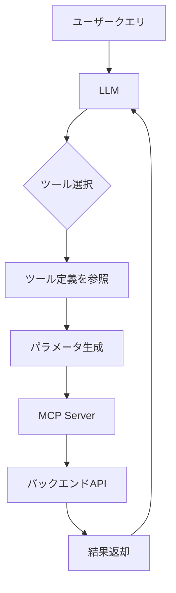
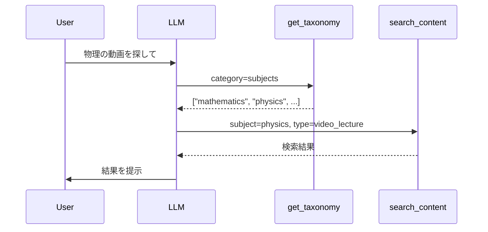

## ブログ概要

AWSのDaniel Wells氏（Senior Solutions Architect）とRaian Osman氏（Technical Account Manager）が、Model Context Protocol（MCP）のツール設計における実践的なアプローチとトレードオフを体系的に整理したブログ記事を公開した。教育コンテンツ検索APIを題材に、V1（Raw Passthrough）からV6（Agent-as-Tool）まで6段階の進化パターンを示し、各段階でのコンテキストエンジニアリング上の得失を具体的なスキーマ例とともに解説している。

本記事は [https://aws.amazon.com/blogs/machine-learning/mcp-tool-design-practical-approaches-and-tradeoffs/](https://aws.amazon.com/blogs/machine-learning/mcp-tool-design-practical-approaches-and-tradeoffs/) の解説記事です。

関連するZenn記事: [AIエージェントのツール定義設計原則：スキーマ品質で成功率を変える7つの実践手法](https://zenn.dev/0h_n0/articles/3decfdf91e40bf)

## 情報源

- **種別**: 企業テックブログ（AWS Machine Learning Blog）
- **URL**: [MCP tool design: Practical approaches and tradeoffs](https://aws.amazon.com/blogs/machine-learning/mcp-tool-design-practical-approaches-and-tradeoffs/)
- **組織**: Amazon Web Services (AWS)
- **著者**: Daniel Wells（Senior Solutions Architect）、Raian Osman（Technical Account Manager）
- **発表日**: 2026年7月9日

## 技術的背景

### MCPとツール設計の重要性

Model Context Protocol（MCP）は、LLMとツール間の通信を標準化するプロトコルである。エージェントがツールを呼び出す際、LLMはツール定義（名前・説明・パラメータスキーマ）だけを頼りに適切な引数を生成する。したがって、ツール定義の品質がエージェント全体の成功率を直接左右する。

Wells氏とOsman氏は、ツール設計の課題を次のように整理している。LLMは人間と異なり、APIドキュメントを読んで試行錯誤することはできない。ツール定義に含まれる情報だけが「世界のすべて」であり、パラメータの命名・型制約・説明文の品質がそのまま推論精度に直結する。

### Context Engineeringの概念

Wells氏とOsman氏は、ツール設計を**Context Engineering**（コンテキストエンジニアリング）の枠組みで捉えることを提案している。Context Engineeringとは、LLMが「何を」「いつ」見るかを意図的に設計する手法である。ツール定義はLLMのコンテキストウィンドウに常駐するため、その内容と量がタスク遂行能力に大きく影響する。



この図が示すように、ツール定義はLLMの意思決定の唯一の手がかりとなる。定義が貧弱なら誤ったパラメータを生成し、過剰に詳細ならコンテキストウィンドウを圧迫する。

## 実装アーキテクチャ：6段階の進化パターン

Wells氏とOsman氏は、教育コンテンツ検索APIを題材に、ツール設計の6段階の進化を示している。以下、各バージョンの特徴・問題点・改善点を解説する。

### V1: Raw Passthrough（アンチパターン）

V1は、バックエンドAPIのパラメータをそのままMCPツール定義として公開する方式である。Wells氏とOsman氏はこれを明確に**アンチパターン**と位置づけている。

```json
{
  "name": "search_content",
  "description": "Search for educational content",
  "parameters": {
    "type": "object",
    "properties": {
      "discipline": {"type": "string"},
      "content_type": {"type": "string"},
      "difficulty_level": {"type": "string"},
      "format": {"type": "string"},
      "audience": {"type": "string"},
      "language": {"type": "string"},
      "duration_min": {"type": "integer"},
      "duration_max": {"type": "integer"},
      "rating_min": {"type": "number"},
      "sort_by": {"type": "string"},
      "sort_order": {"type": "string"},
      "page": {"type": "integer"},
      "page_size": {"type": "integer"},
      "include_metadata": {"type": "boolean"}
    }
  }
}
```

**問題点**:
- **14個ものパラメータ**がすべてフラットに並ぶ
- `discipline`のような内部名称がそのまま露出しており、LLMが適切な値を推測できない
- 有効な値の一覧がないため、`"math"`と`"mathematics"`のどちらが正しいかが不明
- パラメータの型が`string`のみで、取りうる値の制約がない

### V2: Rich Descriptions（精度向上・定義肥大化）

V2では、各パラメータに詳細な説明文を追加して精度を改善する。

```json
{
  "name": "search_content",
  "description": "Search for educational content across subjects and formats. Supports synonym mapping: 'math'='mathematics', 'cs'='computer_science'. Fuzzy filters: difficulty_level, audience (partial match). Strict filters: discipline, content_type (exact match required).",
  "parameters": {
    "type": "object",
    "properties": {
      "discipline": {
        "type": "string",
        "description": "Subject area. Valid values: mathematics, computer_science, physics, biology, chemistry, engineering, literature, history. Synonyms: math→mathematics, cs→computer_science, bio→biology, chem→chemistry, eng→engineering, lit→literature, hist→history"
      },
      "content_type": {
        "type": "string",
        "description": "Content format. Valid values: video_lecture, interactive_exercise, textbook_chapter, practice_exam, lab_simulation, study_guide"
      },
      "difficulty_level": {
        "type": "string",
        "description": "Difficulty. Valid values: beginner, intermediate, advanced, expert. Fuzzy matching enabled."
      }
    }
  }
}
```

**改善点**:
- シノニムマッピング（`math` → `mathematics`）により、LLMの自然言語理解を補助
- Fuzzy filter / Strict filterの区別を明示
- 有効な値の一覧を提供

**問題点**:
- **ツール定義のサイズが大幅に肥大化**する
- 説明文がコンテキストウィンドウを圧迫し、他のツール定義や会話履歴に使える領域を減少させる

### V3: Schema and Defaults（構造最適化）

V3では、パラメータ名の変更・Literal型によるEnum定義・デフォルト値の設定を行う。Wells氏とOsman氏は、これにより「V2より小さい定義サイズでV2以上の精度」を実現できると述べている。

```json
{
  "name": "search_content",
  "description": "Search educational content by subject and type",
  "parameters": {
    "type": "object",
    "properties": {
      "subject": {
        "type": "string",
        "enum": ["mathematics", "computer_science", "physics", "biology", "chemistry", "engineering", "literature", "history"]
      },
      "type": {
        "type": "string",
        "enum": ["video_lecture", "interactive_exercise", "textbook_chapter", "practice_exam", "lab_simulation", "study_guide"],
        "default": "video_lecture"
      },
      "difficulty": {
        "type": "string",
        "enum": ["beginner", "intermediate", "advanced", "expert"],
        "default": "intermediate"
      },
      "query": {
        "type": "string",
        "description": "Free text search within results"
      }
    },
    "required": ["subject"]
  }
}
```

**主な改善**:
- `discipline` → `subject`：ドメイン理解に合致した命名への変更
- `enum`による有効値の明示：LLMが無効な値を生成する余地を排除
- `default`値の設定：必須入力の最小化
- パラメータ数の削減：14個 → 4個の主要パラメータ

### V4: Lazy Loading with Restructuring（オンデマンドコンテキスト）

V4は、Wells氏とOsman氏が**最も注目すべき進化**として位置づけるパターンである。検索機能とタクソノミ（分類体系）取得機能を分離し、必要なときだけコンテキストをロードする。

```json
[
  {
    "name": "get_taxonomy",
    "description": "Get available subjects, types, and difficulty levels. Call this first to discover valid filter values.",
    "parameters": {
      "type": "object",
      "properties": {
        "category": {
          "type": "string",
          "enum": ["subjects", "types", "difficulty_levels", "all"],
          "default": "all"
        }
      }
    }
  },
  {
    "name": "search_content",
    "description": "Search educational content. Use get_taxonomy first to discover valid values.",
    "parameters": {
      "type": "object",
      "properties": {
        "subject": {"type": "string"},
        "type": {"type": "string"},
        "difficulty": {"type": "string"},
        "query": {"type": "string"}
      },
      "required": ["subject"]
    }
  }
]
```

**設計思想**:



Wells氏とOsman氏は、Anthropicの調査を引用し、このLazy Loadingパターンによって**トークン消費を85%削減**できると報告している。ツール定義自体は最小限に保ち、有効値の情報は実行時に動的に取得する。

**トレードオフ**:
- ツール呼び出しが2回（最低）必要になるため、レイテンシが増加
- LLMが`get_taxonomy`を先に呼ぶ判断を正しく行う必要がある

### V5: Server-Side LLM Introspection（モデル非依存一貫性）

V5では、MCPサーバー側にLLM（ブログではAmazon Nova 2 Liteを使用）を配置し、ユーザーの自然言語クエリを構造化フィルタに変換する。

```json
{
  "name": "introspect_query",
  "description": "Analyze a natural language query and recommend search filters. Returns suggested subject, type, difficulty, and search terms.",
  "parameters": {
    "type": "object",
    "properties": {
      "question": {
        "type": "string",
        "description": "The user's natural language question about educational content"
      }
    },
    "required": ["question"]
  }
}
```

```python
from typing import TypedDict

class IntrospectionResult(TypedDict):
    """introspect_queryの返却型"""
    suggested_subject: str
    suggested_type: str
    suggested_difficulty: str
    search_terms: list[str]
    confidence: float

async def introspect_query(question: str) -> IntrospectionResult:
    """自然言語クエリをフィルタ推奨値に変換する。
    
    サーバー側でAmazon Nova 2 Liteを使用し、
    クライアントLLMのモデルに依存しない一貫した変換を実現する。
    """
    # MCPサーバー内部でLLM呼び出し
    response = await bedrock.invoke_model(
        modelId="amazon.nova-lite-v2:0",
        body={
            "messages": [
                {
                    "role": "user",
                    "content": f"Analyze this educational query and extract filters: {question}"
                }
            ]
        }
    )
    return parse_introspection(response)
```

**利点**:
- **モデル非依存の一貫性**: クライアント側のLLM（Claude, GPT, Gemini等）が変わっても、フィルタ変換の品質が一定
- パラメータ設計の複雑さをサーバー側に隠蔽
- クライアントLLMは1つのシンプルなツールだけを認識すればよい

**トレードオフ**:
- MCPサーバー内部でLLM推論が発生するため、レイテンシとコストが増加
- サーバー側LLMの管理・監視が必要

### V6: Agent-as-Tool（完全制御・最高コスト）

V6は、MCPツールの背後にエージェント全体を配置する最も高度なパターンである。Wells氏とOsman氏は、AWS Strands Agentsを使用した実装例を紹介している。

```json
{
  "name": "agentic_search_content",
  "description": "Search for educational content using natural language. Handles all query interpretation, filtering, and result ranking internally.",
  "parameters": {
    "type": "object",
    "properties": {
      "question": {
        "type": "string",
        "description": "Natural language question about educational content"
      }
    },
    "required": ["question"]
  }
}
```

```python
from strands import Agent
from strands.models import BedrockModel
from typing import Any

class AgenticSearchTool:
    """MCPツールの背後にStrands Agentを配置するパターン。
    
    クライアントLLMからは単一のツールに見えるが、
    内部では独立したエージェントが推論・検索・ランキングを行う。
    """

    def __init__(self) -> None:
        self.model = BedrockModel(model_id="amazon.nova-pro-v2:0")
        self.agent = Agent(
            model=self.model,
            tools=[self._search_api, self._get_taxonomy, self._rank_results],
            system_prompt="You are an educational content search specialist."
        )

    async def agentic_search_content(self, question: str) -> dict[str, Any]:
        """自然言語クエリを受け取り、エージェントが推論して結果を返す。"""
        result = await self.agent.run(question)
        return result
```

**利点**:
- クライアントLLMが見るツールは1つだけ（`question: str`のみ）
- 検索ロジック・ランキング・リトライ戦略をサーバー側で完全制御
- クライアント側の変更なしに検索品質を改善可能

**トレードオフ**:
- **インフラコストが最も高い**: 1リクエストあたり複数回のLLM推論が発生
- デバッグの複雑性が増加（エージェントの推論過程の可視化が必要）
- エージェント自体の信頼性が全体の信頼性を制約

### 6段階の比較表

| バージョン | パラメータ数 | 定義サイズ | 精度 | レイテンシ | インフラコスト | 主な特徴 |
|-----------|-----------|----------|------|----------|-------------|---------|
| V1 Raw Passthrough | 14 | 小 | 低 | 低 | 低 | アンチパターン |
| V2 Rich Descriptions | 14 | **大** | 中 | 低 | 低 | 説明文肥大化 |
| V3 Schema + Defaults | 4 | 中 | 高 | 低 | 低 | **構造最適化** |
| V4 Lazy Loading | 2+2 | **最小** | 高 | 中 | 低 | 85%トークン削減 |
| V5 Server-Side Introspection | 1 | 小 | 高 | 中 | 中 | モデル非依存 |
| V6 Agent-as-Tool | 1 | 最小 | 最高 | **高** | **高** | 完全制御 |

## Production Deployment Guide

### AWS実装パターン（コスト最適化重視）

MCPサーバーのデプロイにおいて、Wells氏とOsman氏が示した6段階のパターンに対応するAWS構成を以下に整理する。

**トラフィック量別の推奨構成**:

| 構成 | 対象 | 月額概算 | サービス構成 | 推奨バージョン |
|------|------|---------|-------------|--------------|
| Small | ~100 req/日 | $50-150 | Lambda + API Gateway + Bedrock | V3-V4 |
| Medium | ~1,000 req/日 | $300-800 | ECS Fargate + ALB + Bedrock + ElastiCache | V4-V5 |
| Large | 10,000+ req/日 | $2,000-5,000 | EKS + Spot + Bedrock Batch + ElastiCache Cluster | V5-V6 |

**Small構成（V3-V4向け）**: Lambda関数がMCPサーバーとして動作し、API Gatewayを介してクライアントLLMと通信する。V4のLazy Loadingパターンでは、タクソノミ情報をDynamoDBにキャッシュすることでLambdaのコールドスタート影響を最小化する。

**Medium構成（V4-V5向け）**: V5のServer-Side Introspectionでは、MCPサーバー内部でBedrock推論を行うため、ECS Fargateによる常駐プロセスが適切である。ElastiCacheにタクソノミとIntrospection結果をキャッシュし、同一クエリパターンへの再推論を回避する。

**Large構成（V5-V6向け）**: V6のAgent-as-Toolでは、1リクエストあたり複数回のLLM推論が発生するため、EKS上でSpot Instancesを活用したコスト最適化が重要になる。Bedrock Batch APIの利用で推論コストを最大50%削減できる。

**コスト削減テクニック**:
- Spot Instances活用で最大90%削減（V6のエージェントワーカー）
- Bedrock Prompt Cachingで30-90%削減（V5のIntrospectionプロンプト）
- ElastiCacheによるレスポンスキャッシュで重複推論を回避
- V4のLazy Loading自体が85%のトークン削減効果を持つ

> **注意**: 上記コスト試算は記事執筆時点のAWS ap-northeast-1（東京）リージョン料金に基づく概算値。実際のコストはトラフィックパターン、リージョン、バースト使用量により変動する。最新料金はAWS料金計算ツールで確認を推奨。

### Terraformインフラコード

**Small構成（Serverless: Lambda + API Gateway）**:

```hcl
# MCP Server - Small構成（V3-V4向け）

resource "aws_lambda_function" "mcp_server" {
  function_name = "mcp-tool-server"
  runtime       = "python3.12"
  handler       = "handler.lambda_handler"
  memory_size   = 512
  timeout       = 30

  filename         = data.archive_file.lambda_zip.output_path
  source_code_hash = data.archive_file.lambda_zip.output_base64sha256
  role             = aws_iam_role.mcp_lambda_role.arn

  environment {
    variables = {
      TAXONOMY_TABLE = aws_dynamodb_table.taxonomy.name
      BEDROCK_REGION = var.aws_region
    }
  }
}

resource "aws_iam_role" "mcp_lambda_role" {
  name = "mcp-lambda-role"

  assume_role_policy = jsonencode({
    Version = "2012-10-17"
    Statement = [{
      Action    = "sts:AssumeRole"
      Effect    = "Allow"
      Principal = { Service = "lambda.amazonaws.com" }
    }]
  })
}

resource "aws_iam_role_policy" "bedrock_invoke" {
  name = "bedrock-invoke"
  role = aws_iam_role.mcp_lambda_role.id

  policy = jsonencode({
    Version = "2012-10-17"
    Statement = [{
      Effect   = "Allow"
      Action   = ["bedrock:InvokeModel"]
      Resource = "arn:aws:bedrock:${var.aws_region}::foundation-model/*"
    }]
  })
}

resource "aws_dynamodb_table" "taxonomy" {
  name         = "mcp-taxonomy-cache"
  billing_mode = "PAY_PER_REQUEST"
  hash_key     = "category"

  attribute {
    name = "category"
    type = "S"
  }

  ttl {
    attribute_name = "ttl"
    enabled        = true
  }
}

resource "aws_apigatewayv2_api" "mcp_api" {
  name          = "mcp-server-api"
  protocol_type = "HTTP"
}
```

**Large構成（Container: EKS + Spot）**:

```hcl
# MCP Server - Large構成（V5-V6向け）

module "eks" {
  source          = "terraform-aws-modules/eks/aws"
  version         = "~> 20.0"
  cluster_name    = "mcp-agent-cluster"
  cluster_version = "1.31"

  vpc_id     = module.vpc.vpc_id
  subnet_ids = module.vpc.private_subnets

  eks_managed_node_groups = {
    mcp_workers = {
      instance_types = ["m6i.xlarge", "m6i.2xlarge"]
      capacity_type  = "SPOT"
      min_size       = 2
      max_size       = 20
      desired_size   = 3
    }
  }
}

resource "aws_elasticache_replication_group" "introspection_cache" {
  replication_group_id = "mcp-introspection-cache"
  description          = "Cache for V5 introspection and V4 taxonomy results"
  engine               = "redis"
  node_type            = "cache.r6g.large"
  num_cache_clusters   = 2
  automatic_failover_enabled = true

  at_rest_encryption_enabled = true
  transit_encryption_enabled = true
}

resource "aws_cloudwatch_metric_alarm" "bedrock_token_usage" {
  alarm_name          = "mcp-bedrock-token-high"
  comparison_operator = "GreaterThanThreshold"
  evaluation_periods  = 2
  metric_name         = "InputTokenCount"
  namespace           = "AWS/Bedrock"
  period              = 300
  statistic           = "Sum"
  threshold           = 1000000
  alarm_description   = "Bedrock token usage exceeds budget threshold"
  alarm_actions       = [aws_sns_topic.alerts.arn]
}
```

### 運用・監視設定

**CloudWatch Logs Insights クエリ**（MCPツール呼び出しの分析）:

```sql
-- V1-V6バージョン別のツール呼び出し成功率
fields @timestamp, tool_name, tool_version, status, duration_ms
| filter ispresent(tool_name)
| stats count(*) as total,
        sum(case when status = 'success' then 1 else 0 end) as success,
        avg(duration_ms) as avg_latency
  by tool_version
| sort tool_version asc

-- Bedrock推論のトークン消費量（V5/V6向け）
fields @timestamp, model_id, input_tokens, output_tokens
| filter ispresent(model_id)
| stats sum(input_tokens) as total_input,
        sum(output_tokens) as total_output,
        sum(input_tokens + output_tokens) as total_tokens
  by bin(1h) as hour
| sort hour desc
```

**X-Ray トレーシング設定**:

```python
from aws_xray_sdk.core import xray_recorder
from aws_xray_sdk.core import patch_all

patch_all()  # boto3自動計装

@xray_recorder.capture("mcp_tool_invocation")
async def handle_tool_call(
    tool_name: str,
    params: dict[str, Any]
) -> dict[str, Any]:
    """MCPツール呼び出しをX-Rayでトレースする。"""
    subsegment = xray_recorder.current_subsegment()
    subsegment.put_annotation("tool_name", tool_name)
    subsegment.put_annotation("tool_version", get_tool_version(tool_name))
    subsegment.put_metadata("params", params)

    result = await dispatch_tool(tool_name, params)

    subsegment.put_metadata("result_size", len(str(result)))
    return result
```

### コスト最適化チェックリスト

**アーキテクチャ選択**:
- [ ] トラフィック量に基づく構成選択（Small/Medium/Large）
- [ ] V1-V6のどのパターンが要件に合致するか検証済み
- [ ] V4のLazy Loadingでトークン削減が十分か確認

**リソース最適化**:
- [ ] Spot Instances優先設定（V6のエージェントワーカー）
- [ ] ElastiCacheによるタクソノミ/Introspection結果キャッシュ
- [ ] Lambda Power Tuning実施（Small構成）
- [ ] 夜間・低トラフィック時のスケールダウン設定

**LLMコスト削減**:
- [ ] Bedrock Prompt Caching有効化（V5のシステムプロンプト）
- [ ] Bedrock Batch API検討（非同期処理可能な場合）
- [ ] Amazon Nova 2 Liteなど軽量モデルの選択（V5のIntrospection用）
- [ ] レスポンストークン制限の設定

**監視・アラート**:
- [ ] AWS Budgets設定（月次上限）
- [ ] CloudWatch Alarms（Bedrockトークン使用量）
- [ ] Cost Anomaly Detection有効化
- [ ] ツールバージョン別の成功率ダッシュボード

## パフォーマンス最適化

### パラメータ数の制約

Wells氏とOsman氏は、AWS Prescriptive Guidanceを引用し、**MCPツールのパラメータ数は8個以下に抑えるべき**と述べている。V1の14パラメータからV3の4パラメータへの削減は、この指針に沿ったものである。

パラメータ削減の効果:
- LLMが正しい引数を生成する確率が向上
- ツール定義のトークン数が減少
- ユーザーが必須入力を理解しやすくなる

### パラメータ命名の最適化

Wells氏とOsman氏が特に強調しているのが、**パラメータ名をドメイン理解に合致させる**ことの重要性である。

| 内部名（V1） | 改善名（V3） | 理由 |
|-------------|-------------|------|
| `discipline` | `subject` | 教育ドメインでより自然な用語 |
| `difficulty_level` | `difficulty` | 冗長なsuffixの除去 |
| `content_type` | `type` | 文脈から明らかな場合の簡略化 |

### レスポンストークンの最適化

Wells氏とOsman氏は、Anthropicの研究を引用し、レスポンスから不要なフィールドを除外することで**トークン消費を約2/3削減**できると述べている。

```python
from typing import TypedDict

class ContentSearchResult(TypedDict):
    """最適化されたレスポンス型。
    
    全フィールドを返すのではなく、LLMの判断に必要な
    最小限のフィールドのみを返す。
    """
    title: str
    subject: str
    difficulty: str
    relevance_score: float
    summary: str  # 全文ではなく要約のみ

def optimize_response(
    raw_results: list[dict[str, Any]],
    max_results: int = 5
) -> list[ContentSearchResult]:
    """レスポンスを最適化してトークン消費を削減する。
    
    Anthropicの研究によると、選択的な詳細返却により
    レスポンストークンを約2/3削減可能。
    """
    return [
        ContentSearchResult(
            title=r["title"],
            subject=r["subject"],
            difficulty=r["difficulty"],
            relevance_score=r["relevance_score"],
            summary=r["description"][:200]
        )
        for r in sorted(
            raw_results,
            key=lambda x: x["relevance_score"],
            reverse=True
        )[:max_results]
    ]
```

## 運用での学び

### エラーメッセージ設計

Wells氏とOsman氏は、ツールのエラーメッセージが**次の試行を導く**べきだと述べている。単にエラーを返すのではなく、LLMが自己修正できる情報を含めることが重要である。

```python
def validate_and_search(
    subject: str,
    difficulty: str | None = None
) -> dict[str, Any]:
    """バリデーション付き検索。エラーメッセージで次の行動を誘導する。"""
    valid_subjects = [
        "mathematics", "computer_science", "physics",
        "biology", "chemistry", "engineering",
        "literature", "history"
    ]

    if subject not in valid_subjects:
        # 悪い例: "Invalid subject"
        # 良い例: 有効値を提示して次の試行を導く
        return {
            "error": f"Invalid subject '{subject}'.",
            "valid_values": valid_subjects,
            "hint": f"Did you mean '{find_closest_match(subject, valid_subjects)}'?"
        }

    return execute_search(subject, difficulty)
```

### コンテキストウィンドウ管理

Wells氏とOsman氏は、ツール設計をContext Engineeringの文脈で捉えることの重要性を繰り返し強調している。ツール定義はコンテキストウィンドウに常駐するため、10個のツールがそれぞれ大きな説明文を持てば、会話履歴やシステムプロンプトに使える領域が大幅に制限される。

V4のLazy Loadingパターンが特に有効なのは、ツール定義自体を最小に保ちつつ、実行時に必要な情報だけを動的に取得するためである。Wells氏とOsman氏は、これを**「必要なときに、必要な情報だけをコンテキストに投入する」**原則と説明している。

## 学術研究との関連

### arXiv:2602.14878との接続

Qu et al.による"Tool Learning with Large Language Models: A Survey"（arXiv:2602.14878）は、LLMのツール利用に関する包括的なサーベイである。同論文では、ツール定義の品質がLLMのツール選択・引数生成の精度に直接影響することを体系的に分析している。

Wells氏とOsman氏のブログは、この学術知見を**実運用のMCPツール設計に落とし込んだ実践ガイド**として位置づけられる。特に以下の対応関係がある。

| 学術研究の知見 | AWSブログでの実践 |
|-------------|-----------------|
| ツール記述の詳細度と精度の相関 | V2（Rich Descriptions）での精度向上実証 |
| コンテキスト長制約の影響 | V4（Lazy Loading）での85%トークン削減 |
| 多段階推論の信頼性 | V6（Agent-as-Tool）での完全制御パターン |
| パラメータスキーマの最適化 | V3のEnum型・デフォルト値による構造最適化 |

### Context Engineeringの体系化

Wells氏とOsman氏が提唱するContext Engineeringの概念は、単にツール設計にとどまらず、プロンプトエンジニアリング全体の次の段階を示唆している。LLMのコンテキストウィンドウという有限リソースを、ツール定義・会話履歴・システムプロンプト・検索結果の間でどう配分するかという問題は、今後のエージェント設計においてますます重要になる。

## まとめ

Wells氏とOsman氏のブログは、MCPツール設計を6段階の進化パターンとして体系化し、各段階でのContext Engineering上のトレードオフを明確にした点で実践的価値が高い。

**主要な知見**:
- **V1（Raw Passthrough）は明確なアンチパターン**であり、パラメータ名・型・説明文すべてを意図的に設計すべき
- **V3（Schema + Defaults）がコストパフォーマンスの最適解**: Enum型とデフォルト値だけでV2以上の精度を実現
- **V4（Lazy Loading）が最大のトークン効率改善**を達成: Anthropic調査による85%削減
- **V5-V6は精度と引き換えにコストが増加**: モデル非依存性や完全制御が必要な場合にのみ選択
- **パラメータ数は8個以下**に抑え、**ドメイン理解に合致した命名**を行う
- **エラーメッセージは次の試行を導く**設計にする

実務では、まずV3で十分な精度が得られるかを検証し、コンテキストウィンドウの制約が顕在化した場合にV4へ、クライアントLLMの多様性が問題になった場合にV5へと段階的に移行することをWells氏とOsman氏は推奨している。

## 参考文献

- **Blog URL**: [MCP tool design: Practical approaches and tradeoffs - AWS Machine Learning Blog](https://aws.amazon.com/blogs/machine-learning/mcp-tool-design-practical-approaches-and-tradeoffs/)
- **Related Zenn article**: [AIエージェントのツール定義設計原則：スキーマ品質で成功率を変える7つの実践手法](https://zenn.dev/0h_n0/articles/3decfdf91e40bf)
- **AWS Prescriptive Guidance**: [MCP Tool Design Best Practices](https://docs.aws.amazon.com/prescriptive-guidance/)
- **Anthropic**: [Model Context Protocol Documentation](https://modelcontextprotocol.io/)
- **arXiv:2602.14878**: Qu et al., "Tool Learning with Large Language Models: A Survey"
- **AWS Strands Agents**: [Strands Agents SDK](https://github.com/strands-agents/sdk-python)
- **Amazon Bedrock**: [Amazon Bedrock - AWS](https://aws.amazon.com/bedrock/)
