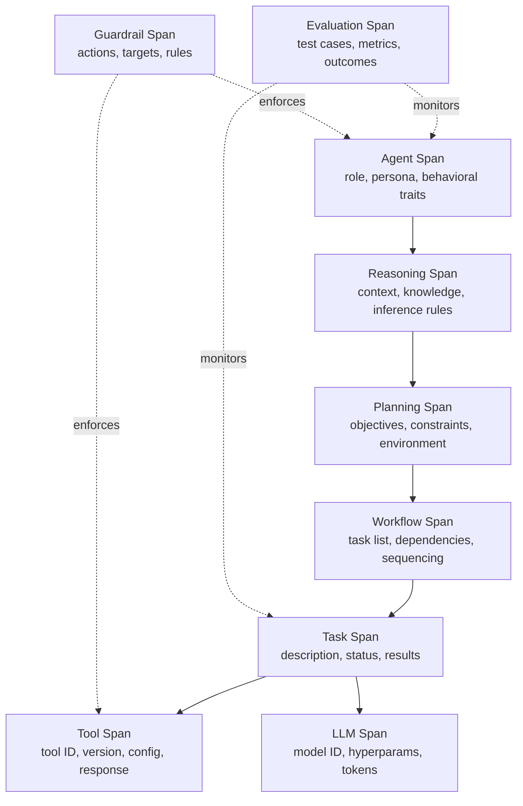
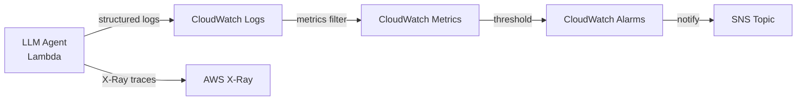
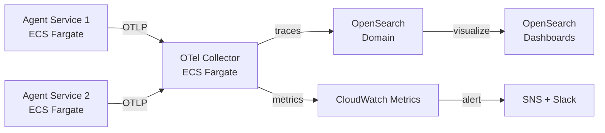
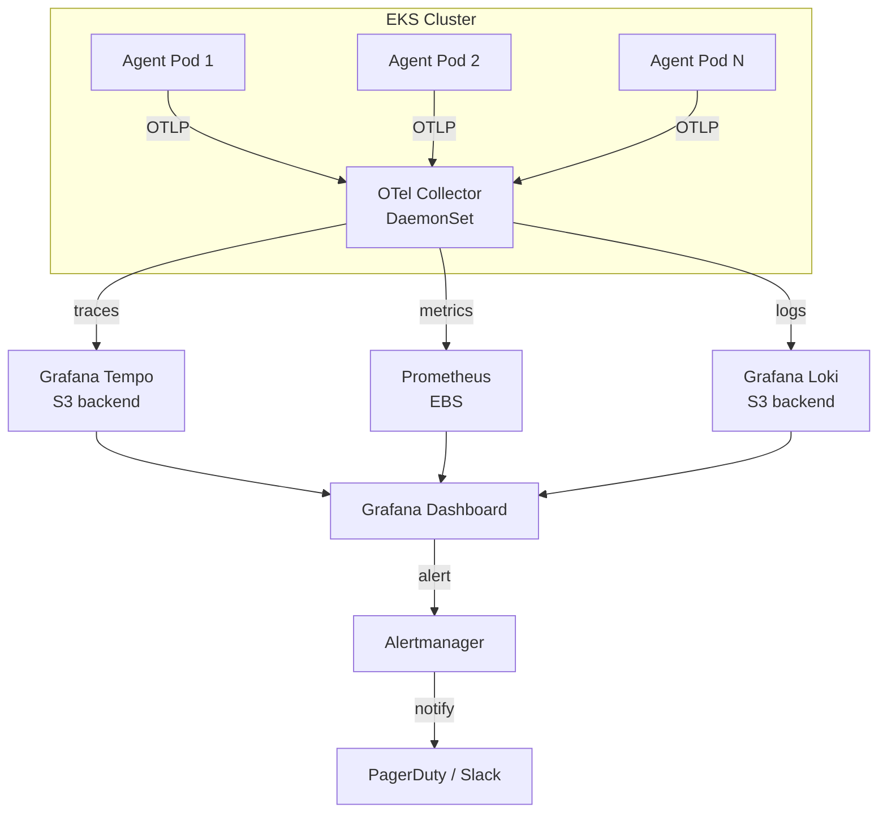

## 論文概要（Abstract）

本論文は、LLMエージェントの自律的かつ非決定論的な動作がもたらすAI安全性の課題に対処するため、AgentOpsの包括的なタクソノミー（分類体系）を提案している。著者らは、エージェントのライフサイクル全体にわたってトレースすべきアーティファクトと関連データを体系的に分類し、監視・ロギング・分析インフラの構築に向けた実践的な設計ガイドラインを提供している。17の既存ツールに対するシステマティックマッピングにより、現行ツールの対応状況と課題を明らかにしている。

本記事は [https://arxiv.org/abs/2411.05285](https://arxiv.org/abs/2411.05285) の解説記事です。

関連するZenn記事: [LangfuseとOpenTelemetryで実装するLLMアプリの本番監視](https://zenn.dev/0h_n0/articles/93ea7afbeb3a96)

## 情報源

- **arXiv ID**: 2411.05285
- **URL**: [arXiv:2411.05285](https://arxiv.org/abs/2411.05285)
- **著者**: Liming Dong, Qinghua Lu, Liming Zhu（CSIRO's Data61, オーストラリア）
- **発表年**: 2024年11月（v2: 2024年11月30日改訂）
- **分野**: Artificial Intelligence (cs.AI), Software Engineering (cs.SE)
- **ライセンス**: CC BY-NC-ND 4.0

## 背景と動機（Background & Motivation）

LLMエージェントは、基盤モデルの推論能力を活用して外部ツールとの対話やマルチステップの計画実行を自律的に行うシステムとして急速に普及している。しかし、従来のDevOpsやMLOpsの監視手法は、エージェント固有の課題に十分対応できていない。

著者らは、エージェントが従来のソフトウェアやMLモデルと本質的に異なる5つの特性を指摘している。

1. **複雑なアーティファクト構成**: 設計時アーティファクト（コンテキストエンジン、ツール定義）と実行時アーティファクト（ゴール、プラン、ワークフロー）が複合的に絡み合う
2. **自律性**: 外部サービスやAPIとの予測困難な対話を独立して実行する
3. **非決定論的動作**: LLMの確率的な性質により、同一入力でも異なる出力が生成される
4. **継続的進化**: 学習やフィードバックによりエージェントの挙動が時間とともに変化する
5. **共有責任**: エージェント所有者、LLMプロバイダー、ツールベンダーなど複数のステークホルダーが責任を分担する

既存のオブザーバビリティツール（LangfuseやPortKeyなど）はLLM呼び出しレベルの監視には対応しているものの、推論・計画・ワークフロー実行といったエージェント固有のレイヤーを包括的にカバーするフレームワークは存在しなかった。この空白を埋めるために、著者らはAgentOpsタクソノミーを提案している。

## 主要な貢献（Key Contributions）

- **AgentOpsタクソノミーの開発**: エージェントのライフサイクル全体をカバーする10種類のSpan（トレース単位）からなる包括的な分類体系を構築
- **システマティックマッピング**: 17の既存AgentOpsツールを体系的に分析し、7つの機能カテゴリ（カスタマイゼーション、プロンプト管理、評価、フィードバック収集、モニタリング、トレーシング、ガードレール）に分類
- **実践的設計ガイドライン**: 監視・ロギング・分析インフラ構築のための参照テンプレートとして、各Spanの必須属性とデータモデルを定義
- **ギャップ分析**: 既存ツールがエージェントレベルのトレースに対して不十分であることを実証的に明らかにし、今後の開発指針を提示

## 技術的詳細（Technical Details）

### AgentOpsタクソノミーの全体構造

著者らが提案するタクソノミーは、エージェントの実行を階層的なSpan（トレース単位）の連鎖として捉える。各SpanはOpenTelemetryのSpan概念を拡張し、エージェント固有のメタデータを付加したものである。



### 10種類のSpan定義

著者らが定義する各Spanには、共通メタデータ（名前、開始タイムスタンプ、持続時間、入出力、エラー情報、親SpanID、関連リンク）に加え、以下の固有属性が設けられている。

#### Agent Span

エージェント全体の実行コンテキストを表す最上位Spanである。

- **Role**: エージェントに割り当てられた役割（例: コードレビューア、リサーチアシスタント）
- **Persona**: 意思決定に影響する性格特性やプロンプト設定
- **Behavioral Characteristics**: 対話パターンやエスカレーション基準

#### Reasoning Span

エージェントの認知プロセスを記録するSpanである。Chain-of-Thought推論やReActパターンにおける思考過程をトレースする。

- **Contextual Information**: 推論に使用されたコンテキスト情報
- **Retrieved Knowledge**: RAGなどで取得された外部知識
- **Inference Rules**: 適用された推論ルールと論理的境界
- **Generated Thoughts**: 生成された中間的な思考と結論

#### Planning Span

戦略策定プロセスを記録する。

- **Specific Objectives**: 達成すべき目標
- **Operational Constraints**: 時間、リソース、ルールなどの制約条件
- **Environmental Context**: 環境コンテキスト
- **Historical Plans**: 過去の計画の参照情報

#### Workflow Span

タスク実行のオーケストレーションを管理する。

- **Task Lists & Sequencing**: タスクの一覧と実行順序
- **Task Dependencies**: タスク間の依存関係
- **Execution History**: 過去の実行履歴

#### Task Span / Tool Span / LLM Span

個別のタスク実行、外部ツール呼び出し、LLM推論呼び出しをそれぞれ記録する。Tool Spanにはツールのバージョン情報や設定パラメータ（タイムアウト、入力フォーマット）が含まれ、LLM Spanにはモデル識別子、ハイパーパラメータ（temperature、max_tokens）、トークン使用量が記録される。

#### Evaluation Span / Guardrail Span

品質保証と安全性担保のための横断的Spanである。Evaluation Spanはテストケース・メトリクス・テスト結果を記録し、Guardrail Spanはブロック・バリデーション・フィルタリングなどの安全性アクションとその対象アーティファクトを記録する。

### 7つの機能カテゴリ

著者らは17の既存ツールを分析し、AgentOpsの機能を以下の7カテゴリに整理している。

| カテゴリ | 説明 | 代表的ツール |
|---|---|---|
| Customization | マーケットプレイスによるツール拡張、ベクトルDB接続、カスタムモデル統合 | Dify, AGIFlow |
| Prompt Management | バージョン管理、プレイグラウンド、インジェクション検出 | Langfuse, PortKey |
| Evaluation | 最終応答評価、単一ステップ評価、軌跡（Trajectory）分析 | Arize, AgentOps |
| Feedback Collection | 明示的フィードバック（評価・コメント）と暗黙的フィードバック（行動メトリクス） | Langfuse |
| Monitoring | ダッシュボード分析、コスト追跡、パフォーマンスメトリクス | PortKey, Dify |
| Tracing | エージェントSpan全体のトレース（チェーン、検索、LLM呼び出し、ツール呼び出し） | AgentOps, AgentNeo |
| Guardrails | ルールベースの制約、フォールバック・エスカレーションメカニズム | Dify |

著者らの分析によると、既存ツールの多くはLLM Spanレベルのトレースに留まっており、Reasoning SpanやPlanning Spanといったエージェント固有の高レベルSpanのトレースは十分にサポートされていない。

## 実装のポイント（Implementation Notes）

著者らのタクソノミーを実装に落とし込む際の重要なポイントを整理する。

### Span階層の設計

OpenTelemetryの分散トレーシングフレームワークをベースに、エージェント固有のSpan型を定義する。各Spanには`span_type`属性を付与し、親子関係を`parent_span_id`で管理する。

```python
from dataclasses import dataclass, field
from enum import Enum
from typing import Any


class SpanType(Enum):
    """AgentOpsタクソノミーに基づくSpan種別."""

    AGENT = "agent"
    REASONING = "reasoning"
    PLANNING = "planning"
    WORKFLOW = "workflow"
    TASK = "task"
    TOOL = "tool"
    LLM = "llm"
    EVALUATION = "evaluation"
    GUARDRAIL = "guardrail"


@dataclass
class AgentSpanAttributes:
    """Agent Spanの固有属性.

    エージェントの役割・ペルソナ・動作特性を記録する。
    """

    role: str
    persona: str
    behavioral_traits: dict[str, Any] = field(default_factory=dict)
    session_id: str = ""


@dataclass
class ReasoningSpanAttributes:
    """Reasoning Spanの固有属性.

    推論プロセスで使用されたコンテキスト・知識・ルールを記録する。
    """

    context: list[str] = field(default_factory=list)
    retrieved_knowledge: list[dict[str, Any]] = field(default_factory=list)
    inference_rules: list[str] = field(default_factory=list)
    generated_thoughts: list[str] = field(default_factory=list)
```

### トレースの粒度設計

著者らのタクソノミーに従うと、全Spanを網羅的に記録するとデータ量が膨大になる。実運用では以下の戦略が有効である。

- **開発・デバッグ時**: 全Spanを詳細にトレース（Reasoning Span内の中間思考を含む）
- **ステージング**: Evaluation SpanとGuardrail Spanを重点的にトレース
- **本番**: Agent Span、Task Span、Tool Span、LLM Spanを中心にトレースし、Reasoning Spanはサンプリングまたはエラー時のみ記録

## Production Deployment Guide

AgentOpsタクソノミーに基づくオブザーバビリティ基盤をAWS上に構築するための実装パターンを、規模別に3段階で示す。

### 構成比較表

| 項目 | Small | Medium | Large |
|---|---|---|---|
| コンピュート | Lambda | ECS Fargate | EKS (Kubernetes) |
| トレース収集 | CloudWatch Logs | OpenSearch + Collector | Jaeger + Tempo |
| メトリクス | CloudWatch Metrics | CloudWatch + Prometheus | Prometheus + Thanos |
| ダッシュボード | CloudWatch Dashboard | OpenSearch Dashboards | Grafana |
| アラート | CloudWatch Alarms | SNS + OpenSearch Alerts | Alertmanager + PagerDuty |
| 月間コスト目安 | $50-150 | $500-1,500 | $3,000-10,000+ |
| 適用規模 | エージェント1-3体、日次100リクエスト以下 | エージェント5-20体、日次1,000-10,000リクエスト | エージェント50体以上、日次100,000リクエスト以上 |

### Small構成: Lambda + CloudWatch

基本的なエージェントログ収集と監視を実現する最小構成である。AgentOpsタクソノミーのSpanデータを構造化ログとしてCloudWatch Logsに出力し、CloudWatch Metrics Filterでキーメトリクスを抽出する。



#### Terraformコード（Small構成）

```hcl
# --- Small構成: Lambda + CloudWatch によるAgentOpsオブザーバビリティ ---

resource "aws_lambda_function" "agent_runner" {
  function_name = "agentops-agent-runner"
  runtime       = "python3.12"
  handler       = "handler.lambda_handler"
  timeout       = 300
  memory_size   = 512

  filename         = data.archive_file.lambda_zip.output_path
  source_code_hash = data.archive_file.lambda_zip.output_base64sha256
  role             = aws_iam_role.lambda_exec.arn

  tracing_config {
    mode = "Active"  # X-Rayトレーシング有効化
  }

  environment {
    variables = {
      LOG_LEVEL          = "INFO"
      AGENTOPS_LOG_GROUP = aws_cloudwatch_log_group.agent_spans.name
      POWERTOOLS_SERVICE_NAME = "agentops"
    }
  }
}

# AgentOps Span用ログ・グループ（保持期間90日）
resource "aws_cloudwatch_log_group" "agent_spans" {
  name              = "/agentops/spans"
  retention_in_days = 90
}

# --- Metrics Filter: Span種別ごとのレイテンシ・エラー率を抽出 ---

resource "aws_cloudwatch_log_metric_filter" "llm_span_latency" {
  name           = "agentops-llm-span-latency"
  log_group_name = aws_cloudwatch_log_group.agent_spans.name
  pattern        = "{ $.span_type = \"llm\" && $.duration_ms > 0 }"

  metric_transformation {
    name          = "LLMSpanLatency"
    namespace     = "AgentOps"
    value         = "$.duration_ms"
    default_value = "0"
  }
}

resource "aws_cloudwatch_log_metric_filter" "guardrail_trigger" {
  name           = "agentops-guardrail-triggers"
  log_group_name = aws_cloudwatch_log_group.agent_spans.name
  pattern        = "{ $.span_type = \"guardrail\" && $.action = \"block\" }"

  metric_transformation {
    name          = "GuardrailBlockCount"
    namespace     = "AgentOps"
    value         = "1"
    default_value = "0"
  }
}

# --- アラーム: エージェントエラー率が閾値を超えた場合に通知 ---

resource "aws_cloudwatch_metric_alarm" "agent_error_rate" {
  alarm_name          = "agentops-agent-error-rate-high"
  comparison_operator = "GreaterThanThreshold"
  evaluation_periods  = 2
  metric_name         = "Errors"
  namespace           = "AWS/Lambda"
  period              = 300
  statistic           = "Sum"
  threshold           = 5
  alarm_description   = "Agent Lambda errors exceed threshold"
  alarm_actions       = [aws_sns_topic.agentops_alerts.arn]

  dimensions = {
    FunctionName = aws_lambda_function.agent_runner.function_name
  }
}

resource "aws_sns_topic" "agentops_alerts" {
  name = "agentops-alerts"
}
```

#### 構造化ログ出力の実装例

```python
import json
import time
from typing import Any

from aws_lambda_powertools import Logger, Tracer
from aws_lambda_powertools.utilities.typing import LambdaContext

logger = Logger(service="agentops")
tracer = Tracer(service="agentops")


def emit_span_log(
    span_type: str,
    span_name: str,
    duration_ms: float,
    attributes: dict[str, Any],
    parent_span_id: str | None = None,
    error: dict[str, str] | None = None,
) -> None:
    """AgentOpsタクソノミーに基づく構造化Spanログを出力する.

    Args:
        span_type: Span種別（agent, reasoning, planning, task, tool, llm等）
        span_name: Span名
        duration_ms: 実行時間（ミリ秒）
        attributes: Span固有の属性辞書
        parent_span_id: 親SpanのID（ルートSpanの場合はNone）
        error: エラー情報（type, message, stackを含む辞書）
    """
    log_entry: dict[str, Any] = {
        "event": "span_completed",
        "span_type": span_type,
        "span_name": span_name,
        "duration_ms": duration_ms,
        "ts": time.time(),
        "parent_span_id": parent_span_id,
        "attributes": attributes,
    }
    if error:
        log_entry["error"] = error
        logger.error(json.dumps(log_entry))
    else:
        logger.info(json.dumps(log_entry))


@tracer.capture_lambda_handler
def lambda_handler(event: dict[str, Any], context: LambdaContext) -> dict[str, Any]:
    """エージェント実行のエントリーポイント.

    Args:
        event: Lambda呼び出しイベント
        context: Lambda実行コンテキスト

    Returns:
        エージェント実行結果
    """
    start = time.monotonic()

    # Agent Span開始
    emit_span_log(
        span_type="agent",
        span_name="main_agent",
        duration_ms=0,
        attributes={
            "role": "research_assistant",
            "persona": "technical_analyst",
            "session_id": event.get("session_id", ""),
        },
    )

    # LLM Span（例: Bedrock呼び出し）
    llm_start = time.monotonic()
    # ... LLM呼び出し処理 ...
    llm_duration = (time.monotonic() - llm_start) * 1000

    emit_span_log(
        span_type="llm",
        span_name="bedrock_invoke",
        duration_ms=llm_duration,
        attributes={
            "model_id": "anthropic.claude-sonnet-4-20250514",
            "temperature": 0.7,
            "max_tokens": 4096,
            "input_tokens": 1500,
            "output_tokens": 800,
        },
        parent_span_id="main_agent",
    )

    total_duration = (time.monotonic() - start) * 1000
    return {"statusCode": 200, "duration_ms": total_duration}
```

### Medium構成: ECS Fargate + OpenSearch

構造化トレース分析とダッシュボード可視化を実現する中規模構成である。OpenTelemetry Collectorを経由してSpanデータをOpenSearchに集約し、OpenSearch Dashboardsで可視化する。



この構成では、各エージェントサービスにOpenTelemetry SDKを組み込み、AgentOpsタクソノミーのSpan型をカスタムSpan属性として送信する。OpenSearch上でSpan種別ごとのインデックスパターンを定義し、Reasoning SpanやPlanning Spanの内容をフルテキスト検索可能にする。

#### OpenTelemetryカスタムSpanの実装例

```python
from opentelemetry import trace
from opentelemetry.sdk.trace import TracerProvider
from opentelemetry.sdk.trace.export import BatchSpanProcessor
from opentelemetry.exporter.otlp.proto.grpc.trace_exporter import (
    OTLPSpanExporter,
)
from opentelemetry.sdk.resources import Resource
from typing import Any

# AgentOps用のリソース属性を設定
resource = Resource.create(
    {
        "service.name": "agentops-service",
        "agentops.version": "1.0.0",
    }
)

provider = TracerProvider(resource=resource)
exporter = OTLPSpanExporter(endpoint="http://otel-collector:4317")
provider.add_span_processor(BatchSpanProcessor(exporter))
trace.set_tracer_provider(provider)

tracer = trace.get_tracer("agentops.tracer")


def trace_reasoning_span(
    context_info: list[str],
    retrieved_knowledge: list[dict[str, Any]],
    inference_rules: list[str],
) -> str:
    """Reasoning Spanをトレースし、推論プロセスを記録する.

    Args:
        context_info: 推論に使用するコンテキスト情報のリスト
        retrieved_knowledge: RAG等で取得した外部知識のリスト
        inference_rules: 適用する推論ルールのリスト

    Returns:
        生成された推論結果（思考テキスト）
    """
    with tracer.start_as_current_span("reasoning") as span:
        span.set_attribute("agentops.span_type", "reasoning")
        span.set_attribute("agentops.context_count", len(context_info))
        span.set_attribute(
            "agentops.knowledge_sources",
            len(retrieved_knowledge),
        )
        span.set_attribute(
            "agentops.inference_rules",
            ",".join(inference_rules),
        )

        # 推論処理の実行
        thought = _execute_reasoning(
            context_info, retrieved_knowledge, inference_rules
        )

        span.set_attribute("agentops.thought_length", len(thought))
        span.set_status(trace.StatusCode.OK)
        return thought


def _execute_reasoning(
    context: list[str],
    knowledge: list[dict[str, Any]],
    rules: list[str],
) -> str:
    """推論処理の実行（実装は省略）."""
    raise NotImplementedError
```

### Large構成: EKS + Grafana / Jaeger

大規模分散トレーシング基盤を実現する構成である。数十体以上のエージェントが並行稼働し、日次10万リクエスト以上を処理する環境に適用する。



#### Terraformコード（Large構成 - Grafana Tempo）

```hcl
# --- Large構成: EKS + Grafana Tempo によるAgentOpsトレーシング基盤 ---

module "eks" {
  source  = "terraform-aws-modules/eks/aws"
  version = "~> 20.0"

  cluster_name    = "agentops-cluster"
  cluster_version = "1.30"

  vpc_id     = module.vpc.vpc_id
  subnet_ids = module.vpc.private_subnets

  eks_managed_node_groups = {
    # エージェント実行用ノードグループ
    agents = {
      instance_types = ["m6i.xlarge"]
      min_size       = 2
      max_size       = 20
      desired_size   = 3

      labels = {
        workload = "agent"
      }
    }

    # オブザーバビリティ基盤用ノードグループ
    observability = {
      instance_types = ["r6i.xlarge"]
      min_size       = 2
      max_size       = 5
      desired_size   = 2

      labels = {
        workload = "observability"
      }

      taints = [{
        key    = "dedicated"
        value  = "observability"
        effect = "NO_SCHEDULE"
      }]
    }
  }
}

# Grafana Tempo用S3バケット（トレースデータの長期保存）
resource "aws_s3_bucket" "tempo_traces" {
  bucket = "agentops-tempo-traces-${data.aws_caller_identity.current.account_id}"
}

resource "aws_s3_bucket_lifecycle_configuration" "tempo_lifecycle" {
  bucket = aws_s3_bucket.tempo_traces.id

  rule {
    id     = "archive-old-traces"
    status = "Enabled"

    transition {
      days          = 30
      storage_class = "STANDARD_IA"
    }

    transition {
      days          = 90
      storage_class = "GLACIER"
    }

    expiration {
      days = 365
    }
  }
}

# Grafana Loki用S3バケット（ログデータ保存）
resource "aws_s3_bucket" "loki_logs" {
  bucket = "agentops-loki-logs-${data.aws_caller_identity.current.account_id}"
}
```

#### Kubernetes マニフェスト（OTel Collector DaemonSet）

```yaml
# OpenTelemetry Collector DaemonSet - AgentOps Span収集
apiVersion: apps/v1
kind: DaemonSet
metadata:
  name: otel-collector
  namespace: agentops
spec:
  selector:
    matchLabels:
      app: otel-collector
  template:
    metadata:
      labels:
        app: otel-collector
    spec:
      tolerations:
        - key: "dedicated"
          operator: "Equal"
          value: "observability"
          effect: "NoSchedule"
      containers:
        - name: collector
          image: otel/opentelemetry-collector-contrib:0.115.0
          ports:
            - containerPort: 4317  # OTLP gRPC
            - containerPort: 4318  # OTLP HTTP
          volumeMounts:
            - name: config
              mountPath: /etc/otelcol
      volumes:
        - name: config
          configMap:
            name: otel-collector-config
---
apiVersion: v1
kind: ConfigMap
metadata:
  name: otel-collector-config
  namespace: agentops
data:
  config.yaml: |
    receivers:
      otlp:
        protocols:
          grpc:
            endpoint: 0.0.0.0:4317
          http:
            endpoint: 0.0.0.0:4318

    processors:
      batch:
        timeout: 5s
        send_batch_size: 1024
      # AgentOps Span種別に基づくルーティング用属性追加
      attributes:
        actions:
          - key: agentops.tier
            from_attribute: agentops.span_type
            action: insert

    exporters:
      otlp/tempo:
        endpoint: tempo.agentops.svc.cluster.local:4317
        tls:
          insecure: true
      prometheusremotewrite:
        endpoint: http://prometheus.agentops.svc.cluster.local:9090/api/v1/write
      loki:
        endpoint: http://loki.agentops.svc.cluster.local:3100/loki/api/v1/push

    service:
      pipelines:
        traces:
          receivers: [otlp]
          processors: [batch, attributes]
          exporters: [otlp/tempo]
        metrics:
          receivers: [otlp]
          processors: [batch]
          exporters: [prometheusremotewrite]
        logs:
          receivers: [otlp]
          processors: [batch]
          exporters: [loki]
```

### 運用・監視設定

#### 推奨メトリクス（AgentOpsタクソノミーに基づく）

AgentOpsタクソノミーの各Spanから抽出すべき主要メトリクスを以下に整理する。

| メトリクス | Span種別 | 説明 | アラート閾値（参考） |
|---|---|---|---|
| `agent.session.duration_ms` | Agent | セッション全体の処理時間 | p99 > 30s |
| `reasoning.thought_count` | Reasoning | 生成された中間思考の数 | > 20（無限ループ疑い） |
| `planning.replanning_count` | Planning | 再計画の発生回数 | > 3 |
| `task.failure_rate` | Task | タスク失敗率 | > 10% |
| `tool.latency_ms` | Tool | 外部ツール呼び出しレイテンシ | p95 > 5s |
| `tool.error_rate` | Tool | ツール呼び出しエラー率 | > 5% |
| `llm.token_usage` | LLM | トークン消費量 | 日次予算超過 |
| `llm.latency_ms` | LLM | LLM呼び出しレイテンシ | p95 > 10s |
| `guardrail.block_count` | Guardrail | ガードレールによるブロック回数 | 急増検知 |
| `eval.score` | Evaluation | 評価スコア | < 0.7 |

#### CloudWatch / X-Ray設定（Small構成向け）

```python
import boto3
from typing import Any

cloudwatch = boto3.client("cloudwatch")


def put_agentops_metrics(span_data: dict[str, Any]) -> None:
    """AgentOps SpanデータからCloudWatchカスタムメトリクスを送信する.

    Args:
        span_data: Spanデータ辞書（span_type, duration_ms等を含む）
    """
    metric_data: list[dict[str, Any]] = [
        {
            "MetricName": f"{span_data['span_type']}_duration_ms",
            "Value": span_data["duration_ms"],
            "Unit": "Milliseconds",
            "Dimensions": [
                {"Name": "SpanType", "Value": span_data["span_type"]},
                {"Name": "AgentRole", "Value": span_data.get("role", "unknown")},
            ],
        },
    ]

    # エラー時はエラーメトリクスも送信
    if span_data.get("error"):
        metric_data.append(
            {
                "MetricName": f"{span_data['span_type']}_errors",
                "Value": 1,
                "Unit": "Count",
                "Dimensions": [
                    {"Name": "SpanType", "Value": span_data["span_type"]},
                    {"Name": "ErrorType", "Value": span_data["error"]["type"]},
                ],
            }
        )

    cloudwatch.put_metric_data(Namespace="AgentOps", MetricData=metric_data)
```

### コスト最適化チェックリスト

AgentOpsオブザーバビリティ基盤のコスト最適化において確認すべき項目を示す。

- [ ] **ログ保持期間の設定**: 開発環境は7日、ステージングは30日、本番は90日を推奨。Glacierへの自動アーカイブを設定
- [ ] **サンプリング率の調整**: Reasoning Spanは本番で10-20%サンプリング、エラー時は100%記録（Tail-based sampling）
- [ ] **トークン使用量の予算アラート**: LLM Spanのトークン消費量に日次・月次予算アラートを設定
- [ ] **不要なSpan属性の除外**: Retrieved Knowledgeの全文はログに含めず、ソースIDと要約のみ記録
- [ ] **OpenSearch / Tempoのインデックスライフサイクル管理**: Hot-Warm-Cold-Deleteのティア設定
- [ ] **スポットインスタンスの活用**: EKSのエージェント実行ノードグループでスポットインスタンスを混在利用（オブザーバビリティ基盤はオンデマンド）
- [ ] **CloudWatchメトリクスの解像度**: 標準解像度（60秒）で十分な場合は高解像度（1秒）を避ける

## 実験結果（Systematic Mapping Results）

著者らは17のAgentOps関連ツールに対してシステマティックマッピングを実施し、以下の知見を報告している。

**ツール採用状況**: GitHubスター数による採用度では、Dify（51,600スター）が最も高く、Langfuse（6,500スター）、PortKey（6,300スター）が続く。ただし、著者らはDifyが主にLLMアプリケーション構築プラットフォームであり、純粋なAgentOpsツールとは位置づけが異なると指摘している。

**機能カバレッジの偏り**: 分析対象ツールの大半はLLM Spanレベルのトレースとプロンプト管理に注力しており、エージェント固有のReasoning Span、Planning Span、Workflow Spanのトレースをネイティブにサポートするツールは限定的であった。AgentOpsとAgentNeoがエージェント中心のトレースを志向しているものの、タクソノミーが定義する全Spanの包括的なサポートには至っていないと著者らは報告している。

**評価手法の分類**: 著者らは評価を3次元に分類している。(1) 最終応答の品質評価、(2) 単一ステップの正確性評価、(3) ツール呼び出し軌跡全体の分析。既存ツールの多くは(1)のみをサポートしており、(3)の軌跡分析をサポートするツールはごく少数であると報告されている。

## 実運用への応用（Practical Applications）

AgentOpsタクソノミーは、以下の実運用シナリオに適用可能である。

**デバッグと根本原因分析**: エージェントが期待通りに動作しない場合、Reasoning Span → Planning Span → Task Spanの実行トレースをたどることで、推論の誤り、計画の不備、ツール呼び出しの失敗のいずれが原因かを特定できる。OpenTelemetryベースの分散トレーシングと組み合わせることで、マイクロサービスレベルのトレースとエージェントレベルのトレースを統合した障害分析が可能になる。

**コスト管理**: LLM SpanのトークンメトリクスとTool Spanの呼び出し回数を集約することで、エージェントごとの運用コストをリアルタイムに把握できる。Reasoning Spanの思考回数やPlanning Spanの再計画回数が異常に多い場合、コスト増加の予兆として早期に検知できる。

**安全性コンプライアンス**: Guardrail Spanにより、エージェントがいつ・なぜブロックされたかの監査証跡を確保できる。規制産業（金融、医療など）では、このトレースデータが監査対応の証拠として機能する。

**A/Bテストとエージェント改善**: Evaluation Spanのメトリクスを活用し、異なるプロンプト戦略やツール構成のパフォーマンスを比較評価できる。

## 関連研究（Related Work）

AgentOpsの概念は、DevOps、MLOps、LLMOpsの延長線上に位置づけられる。DevOpsがソフトウェア開発・運用の統合を実現し、MLOpsがモデルのライフサイクル管理を体系化したのに対し、LLMOpsはプロンプト管理や基盤モデルの運用に特化した。AgentOpsは、これらの上に自律的なエージェントの推論・計画・実行プロセスのオブザーバビリティレイヤーを追加するパラダイムとして位置づけられている。

関連するフレームワークとして、LangSmith、Weights & Biases、MLflow等が存在するが、著者らはこれらがLLMレベルの監視に留まり、エージェントの認知プロセス（推論・計画）のトレースには対応していないと指摘している。

## まとめと今後の展望

著者らは、LLMエージェントのオブザーバビリティを実現するための体系的なフレームワークとしてAgentOpsタクソノミーを提案した。10種類のSpan定義と7つの機能カテゴリにより、エージェントのライフサイクル全体を構造的に捉えるための参照モデルを提供している。

著者ら自身が認めている限界として、急速に発展するツールエコシステムのすべてをカバーできていない点、および実運用環境での大規模検証が今後の課題として残されている点が挙げられる。

今後の展望として、(1) タクソノミーの標準化（OpenTelemetryのSemantic Conventionsへの統合など）、(2) マルチエージェントシステムにおけるエージェント間トレースの拡張、(3) リアルタイム異常検知との統合、が重要な研究方向として考えられる。

## 参考文献

1. Dong, L., Lu, Q., & Zhu, L. (2024). AgentOps: Enabling Observability of LLM Agents. arXiv:2411.05285. [https://arxiv.org/abs/2411.05285](https://arxiv.org/abs/2411.05285)
2. OpenTelemetry Project. Observability framework. [https://opentelemetry.io/](https://opentelemetry.io/)
3. Langfuse. Open source LLM engineering platform. [https://langfuse.com/](https://langfuse.com/)
4. AgentOps. Agent observability toolkit. [https://www.agentops.ai/](https://www.agentops.ai/)
5. Dify. Open source LLM app development platform. [https://dify.ai/](https://dify.ai/)
