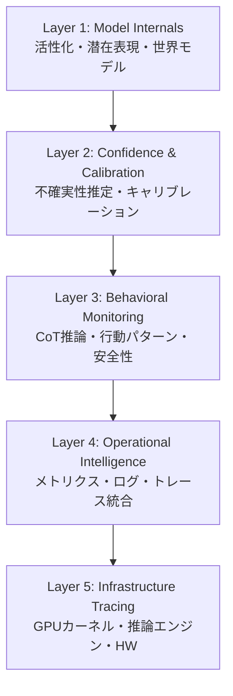
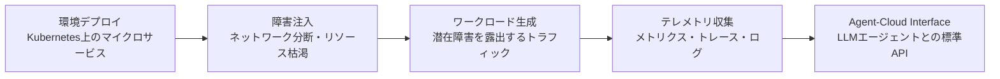
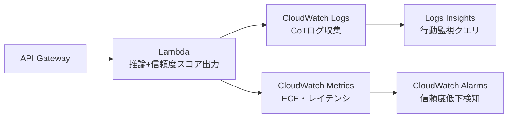

本記事は [arXiv:2604.26152](https://arxiv.org/abs/2604.26152) の解説記事です。

## 論文概要（Abstract）

本番環境のLLMシステムでは、モデル内部の活性化パターンからGPUカーネルの実行プロファイルまで、全スタックを横断する監視が求められる。著者はこの課題に対し、2025--2026年に発表された5つの研究を統合した多層オブザーバビリティフレームワークを提示している。5つのレイヤーとして (1) モデル内部状態、(2) 信頼度キャリブレーション、(3) 行動監視（Chain-of-Thought）、(4) オペレーショナルインテリジェンス、(5) インフラストラクチャトレーシングを定義し、各レイヤーの技術的詳細と未解決課題を分析している。

この記事は [Zenn記事: LangfuseとOpenTelemetryで実装するLLMアプリの本番監視](https://zenn.dev/0h_n0/articles/93ea7afbeb3a96) の深掘りです。

## 情報源

- **arXiv ID**: [2604.26152](https://arxiv.org/abs/2604.26152)
- **著者**: Twinkll Sisodia（Red Hat）
- **発表年**: 2026年4月
- **分野**: cs.SE（ソフトウェア工学）
- **論文規模**: 10ページ、2図、3テーブル

## 背景と動機（Background & Motivation）

LLMの本番デプロイメントが拡大する中、従来のソフトウェアシステム向け監視手法では不十分な状況が生じている。LLMはステートレスなAPIとは異なり、モデルの内部状態・推論の信頼度・推論過程の透明性・インフラの健全性といった複数の抽象レイヤーを同時に監視する必要がある。

著者は、既存の監視アプローチがそれぞれ個別のレイヤーにしか対応していない点を課題として指摘している。例えば、信頼度キャリブレーションの研究はモデル出力の不確実性推定に注力する一方、GPUカーネルレベルのパフォーマンス異常とは接続されていない。この「レイヤー間の断絶」が本番LLMシステムのオブザーバビリティにおける根本的課題であると著者は分析している。

## 主要な貢献（Key Contributions）

1. **5層オブザーバビリティ分類体系**: LLM監視を5つの抽象レイヤーに分類し、各レイヤーの責務・アクセス要件・主要メトリクスを整理
2. **5研究の統合分析**: MIT CSAIL、UC Berkeley、OpenAI、Microsoft Research、TRUFFLDの5つの最新研究を横断的に比較分析
3. **クロスレイヤー統合の課題整理**: 4つの未解決課題（クロスレイヤー信号相関、統一評価ベンチマーク、リアルタイム適応監視、コスト最適化）を特定
4. **将来研究の方向性提示**: 垂直統合フレームワーク、オブザーバビリティ対応訓練、エージェント型ワークフロー、連合監視の4方向を提案

## 技術的詳細（Technical Details）

### 5層オブザーバビリティ分類体系

著者が提示する5層フレームワークの全体像を以下に示す。



### Layer 1: モデル内部状態監視 — UC Berkeley Propositional Probes

UC Berkeleyの研究チームは、LLMの内部活性化から論理命題を抽出する3段階パイプラインを提案している。

**3段階パイプライン:**

1. **Domain Probes**: トークン位置を意味カテゴリ（人名、地名、職業等）に分類する線形プローブ
2. **Hessian-Based Binding**: ヘッセ行列を用いて意味的類似性の部分空間を特定し、エンティティ間の関係を推定
3. **Compositional Lookup**: デコードされたコンポーネントから完全な命題を組み立てる

著者は、この手法がプロンプトインジェクション・バックドア攻撃・性別バイアスの条件下でモデル出力よりも忠実な結果を返すと報告している。Jaccard指標はプロンプティングベースラインの10%以内であり、単純なテンプレートで訓練したプローブが複雑な物語やスペイン語翻訳にも汎化することが示されている。

**オブザーバビリティへの影響**: ホワイトボックスアクセスを必要とするため最もアーキテクチャ結合度が高いが、出力に表出しない「隠された真実」を検出できる点で、ハルシネーションや敵対的操作の検出に有効である。

### Layer 2: 信頼度キャリブレーション — MIT CSAIL RLCR

MIT CSAILの研究チームは、標準的な強化学習にBrierスコアのキャリブレーションペナルティを組み込んだRLCR（Reinforcement Learning Calibrated Rewards）を提案している。報酬関数は以下のように定義される。

$$
R_{\text{RLCR}}(y, q, y^*) = \mathbb{1}_{y \equiv y^*} - (q - \mathbb{1}_{y \equiv y^*})^2
$$

ここで、
- $y$: モデルの出力
- $q$: 言語化された信頼度スコア（0--1）
- $y^*$: 正解
- $\mathbb{1}_{y \equiv y^*}$: 正解との一致を示す指示関数

第1項は正確性への報酬、第2項はBrierスコアによるキャリブレーションペナルティである。この2つの目的を同時最適化することで、モデルは精度とキャリブレーションの両方を向上させる。

**主要な結果**（著者の報告による）:
- HotpotQA: Expected Calibration Error（ECE）が0.37から0.03に低減
- 数学的推論: ECEが0.26から0.10に低減
- 標準的なRLVRは分布外データでキャリブレーションを悪化させるが、RLCRは改善する

**オブザーバビリティへの影響**: 適切にキャリブレーションされた信頼度スコアは、ブラックボックス出力をアクション可能なシグナルに変換する。低信頼度の出力に対して人間レビュー、モデルエスカレーション、応答拒否といったルーティング判断が可能になる。

### Layer 3: 行動監視 — OpenAI Chain-of-Thought Monitorability

OpenAIの研究チームは、Chain-of-Thought（CoT）推論の監視可能性を13の評価ケースにわたり体系的に評価している。評価は3つのアーキタイプに分類される。

| 評価アーキタイプ | 対象 | 手法 |
|---|---|---|
| **介入評価** | 環境摂動への応答 | 制御された摂動の検出可能性評価 |
| **プロセス評価** | 推論過程の妥当性 | 推論チェーンの解法パスの検証 |
| **出力属性評価** | 出力特性の検出 | テストケースハッキング等の検出 |

著者は以下の5つの主要な知見を報告している。

1. **より長いCoTは監視可能性が高い**: 推論ステップが多いほど不正行動の検出が容易
2. **CoT監視はアクションのみの監視を大幅に上回る**: 推論過程の観察が監視精度を向上
3. **フロンティアスケールでのRL最適化は監視可能性を維持**: 大規模モデルでも監視性が劣化しない
4. **「監視可能性税」の存在**: より小さいモデルをより高い推論努力で実行することで、能力を維持しつつ監視可能性を向上可能
5. **フォローアップ質問が検出可能性を向上**: 追加のCoTを生成させることで検出精度が向上

### Layer 4: オペレーショナルインテリジェンス — Microsoft Research AIOpsLab

Microsoft Research、UC Berkeley、UIUCの共同研究チームは、LLMエージェントがクラウドインシデントの完全なライフサイクル（検出・診断・緩和・解決）を管理する能力を評価する標準化フレームワークAIOpsLabを提案している。



AIOpsLabは以下のコンポーネントで構成される:

- **環境デプロイ**: Kubernetes上にリアルなサービスメッシュを持つマイクロサービスアプリケーションをデプロイ
- **障害注入**: ネットワーク分断、リソース枯渇、設定ミスを制御的に導入
- **ワークロード生成**: 潜在障害を露出するシミュレートされたトラフィック
- **テレメトリエクスポート**: 全コンポーネントからメトリクス・トレース・ログを収集
- **Agent-Cloud Interface（ACI）**: LLMエージェントとの対話用標準化API

**オブザーバビリティへの影響**: オブザーバビリティを受動的監視から能動的調査に転換する。自律エージェントがテレメトリ空間を体系的に探索し、仮説を形成し、診断アクションを実行する新しいパラダイムを提示している。

### Layer 5: インフラストラクチャトレーシング — TRUFFLD

TRUFFLDは、LLM推論パイプラインに対する非侵入型のクロスレイヤーオブザーバビリティシステムである。

**データ収集の2つの視点**:

- **垂直方向（ノード内）**: 推論エンジンからCUDAカーネルまでのスタック実行をキャプチャ
- **水平方向（ノード間）**: テンソル並列・パイプライン並列における分散推論の通信パターンを追跡

コールチェーンマージアルゴリズムにより、イベントを統一時間軸上で整列させ、構造的・時間的セマンティクスを保持したリクエスト単位のツリーを再構成する。

**異常検知パイプライン**:

$$
\text{Anomaly Score} = f_{\text{GMM}}(\mathbf{x}) \cdot g_{\text{LLM}}(\text{call-chain tree})
$$

1. **Gaussian Mixture Model（GMM）**: マルチモーダルな正常挙動をモデル化し、実行ステップごとにキャリブレーションされた数値信頼度を出力
2. **LLM推論**: コールチェーンツリーに対する構造・文脈認識型の推論により、ステップレベルの判定とオペレータレベルの局所化を実行

**主要な結果**（著者の報告による）:
- マルチノードGPUクラスタ（Qwen3-8B推論）でほぼ完全なステップレベル異常検知を達成
- ベースラインを上回るオペレータレベルの局所化性能
- バイナリ修正不要の低デプロイメントオーバーヘッド

### クロスレイヤー比較分析

著者は5つのアプローチを以下のように比較分析している（論文Table 2ベース）。

| アプローチ | レイヤー | アクセス種別 | 主要メトリクス |
|---|---|---|---|
| Propositional Probes | 1（内部状態） | ホワイトボックス活性化 | Jaccard指標 |
| RLCR | 2（信頼度） | 訓練時修正 | ECE: 0.37→0.03 |
| CoT Monitor | 3（行動） | ブラックボックスCoTテキスト | g-mean2（TPR×TNR） |
| AIOpsLab | 4（運用） | テレメトリAPI | 診断精度 |
| TRUFFLD | 5（インフラ） | 非侵入型eBPF/CUPTI | ステップレベルF1 |

## 実装のポイント（Implementation）

本論文はサーベイ論文であるため直接的な実装コードは含まれないが、各レイヤーの技術を実際のシステムに統合する際の実装上の考慮点を以下に整理する。

**忠実度とアクセシビリティのトレードオフ**: Layer 1のホワイトボックスアプローチは最も高い忠実度を提供するが、モデルアーキテクチャとの密結合が必要である。Layer 3の行動監視はアーキテクチャ非依存だがモデルの「協力」に依存する。Layer 2の信頼度キャリブレーションは訓練時修正により中間的な立ち位置を取る。

**統合ギャップへの対処**: 著者が最大の未解決課題として指摘しているのは、レイヤー間の信号相関が存在しない点である。例えば、信頼度低下（Layer 2）がGPUメモリ圧迫（Layer 5）に起因するのか、入力の本質的な困難さに起因するのかを判別するには、レイヤー横断的な分析が必要となる。

```python
from dataclasses import dataclass
from enum import IntEnum


class ObservabilityLayer(IntEnum):
    """5層オブザーバビリティフレームワークのレイヤー定義"""

    MODEL_INTERNALS = 1
    CONFIDENCE_CALIBRATION = 2
    BEHAVIORAL_MONITORING = 3
    OPERATIONAL_INTELLIGENCE = 4
    INFRASTRUCTURE_TRACING = 5


@dataclass(frozen=True)
class LayerSignal:
    """各レイヤーからの監視シグナル

    Attributes:
        layer: シグナルの発生レイヤー
        metric_name: メトリクス名
        value: メトリクス値
        timestamp_ms: ミリ秒タイムスタンプ
        request_id: リクエスト識別子
    """

    layer: ObservabilityLayer
    metric_name: str
    value: float
    timestamp_ms: int
    request_id: str
```

## Production Deployment Guide

本論文は5層オブザーバビリティフレームワークを提示しており、LLMシステムの多層監視を実装する際のAWS構成パターンを以下に示す。

### AWS実装パターン（コスト最適化重視）

**トラフィック量別の推奨構成**:

| 構成 | トラフィック | 主要サービス | 対応レイヤー | 月額概算 |
|---|---|---|---|---|
| Small | ~100 req/日 | Lambda + CloudWatch | L2, L3 | $50-150 |
| Medium | ~1,000 req/日 | ECS Fargate + Managed Grafana | L2, L3, L4 | $400-900 |
| Large | 10,000+ req/日 | EKS + Prometheus + Grafana | L1-L5全層 | $2,500-6,000 |

> **注意**: 記事生成時点（2026年7月）のAWS ap-northeast-1（東京）リージョン料金に基づく概算値です。実際のコストはトラフィックパターン、リージョン、バースト使用量により変動します。最新料金はAWS料金計算ツールで確認を推奨します。

**Small構成（~100 req/日）**: Lambda + CloudWatch



- Layer 2対応: Lambda内で信頼度スコアを構造化ログとして出力し、CloudWatch Metricsでキャリブレーション推移を追跡
- Layer 3対応: CoT推論ログをCloudWatch Logsに格納し、Logs Insightsで異常パターンを検索
- 月額内訳: Lambda $5-15 / API Gateway $5-10 / CloudWatch $20-50 / Bedrock $20-75

**Medium構成（~1,000 req/日）**: ECS Fargate + Managed Grafana

- Layer 2対応: サイドカーコンテナで信頼度メトリクスを収集しPrometheus形式でエクスポート
- Layer 3対応: FireLens経由でCoTログをOpenSearch Serverlessに送信、行動パターン分析
- Layer 4対応: Amazon Managed Grafanaで多層ダッシュボードを構築、AIOpsLab型のインシデント対応ワークフローをStep Functionsで実装
- 月額内訳: ECS Fargate $100-250 / Managed Grafana $9 / OpenSearch Serverless $100-250 / Bedrock $100-300 / その他 $91-91

**Large構成（10,000+ req/日）**: EKS + Prometheus + Grafana

- Layer 1対応: GPU搭載ノードでモデル活性化データを収集しPrometheus PushGatewayに送信
- Layer 2-3対応: OpenTelemetry Collector DaemonSetで信頼度・CoTシグナルを統合収集
- Layer 4対応: Amazon Managed Service for Prometheus + Grafanaで全メトリクスを統合可視化、AlertManagerでインシデント対応自動化
- Layer 5対応: NVIDIA DCGM ExporterでGPUカーネルメトリクスを収集、eBPFベースのカスタムプローブで推論エンジンプロファイリング
- 月額内訳: EKS $73 / EC2 GPU Spot $800-2,000 / Managed Prometheus $200-500 / Managed Grafana $9 / S3/EBS $100-300 / その他 $318-1,118

**コスト削減テクニック**:
- GPU Spot Instances活用で推論ノードコスト最大90%削減
- Reserved Instances（1年コミット）で最大72%削減
- Karpenterによる自動スケーリングでアイドル時コストゼロ化
- Prometheus Remote Write + S3 Tieringでメトリクスストレージ最大80%削減

### Terraformインフラコード

**Small構成（Serverless）**: Lambda + CloudWatch

```hcl
# --- Small構成: LLMオブザーバビリティ（Layer 2-3） ---
# 信頼度スコア監視 + CoTログ分析

terraform {
  required_version = ">= 1.9"
  required_providers {
    aws = { source = "hashicorp/aws", version = "~> 5.60" }
  }
}

provider "aws" {
  region = "ap-northeast-1"
}

# IAMロール（最小権限）
resource "aws_iam_role" "llm_observability_lambda" {
  name = "llm-observability-lambda-role"
  assume_role_policy = jsonencode({
    Version = "2012-10-17"
    Statement = [{
      Action = "sts:AssumeRole"
      Effect = "Allow"
      Principal = { Service = "lambda.amazonaws.com" }
    }]
  })
}

resource "aws_iam_role_policy" "lambda_policy" {
  name = "llm-observability-policy"
  role = aws_iam_role.llm_observability_lambda.id
  policy = jsonencode({
    Version = "2012-10-17"
    Statement = [
      {
        Effect = "Allow"
        Action = [
          "logs:CreateLogGroup",
          "logs:CreateLogStream",
          "logs:PutLogEvents"
        ]
        Resource = "arn:aws:logs:ap-northeast-1:*:*"
      },
      {
        Effect = "Allow"
        Action = [
          "cloudwatch:PutMetricData"
        ]
        Resource = "*"
        Condition = {
          StringEquals = { "cloudwatch:namespace" = "LLMObservability" }
        }
      },
      {
        Effect   = "Allow"
        Action   = ["bedrock:InvokeModel"]
        Resource = "arn:aws:bedrock:ap-northeast-1::foundation-model/*"
      }
    ]
  })
}

# Lambda関数（信頼度スコア出力 + CoTログ記録）
resource "aws_lambda_function" "llm_inference" {
  function_name = "llm-inference-with-observability"
  runtime       = "python3.12"
  handler       = "handler.lambda_handler"
  role          = aws_iam_role.llm_observability_lambda.arn
  timeout       = 120 # LLM推論は時間がかかる
  memory_size   = 1024

  # コスト最適化: ARM64でx86比20%安価
  architectures = ["arm64"]

  environment {
    variables = {
      CONFIDENCE_THRESHOLD = "0.7"  # Layer 2: ECE閾値
      COT_LOG_ENABLED      = "true" # Layer 3: CoTログ有効化
      METRIC_NAMESPACE     = "LLMObservability"
    }
  }

  filename         = "lambda_package.zip"
  source_code_hash = filebase64sha256("lambda_package.zip")
}

# CloudWatchアラーム: 信頼度スコア低下検知（Layer 2）
resource "aws_cloudwatch_metric_alarm" "low_confidence" {
  alarm_name          = "llm-low-confidence-rate"
  comparison_operator = "GreaterThanThreshold"
  evaluation_periods  = 3
  metric_name         = "LowConfidenceRate"
  namespace           = "LLMObservability"
  period              = 300
  statistic           = "Average"
  threshold           = 0.3 # 30%以上が低信頼度なら警告
  alarm_description   = "Layer 2: 信頼度キャリブレーション異常"
  alarm_actions       = [aws_sns_topic.alerts.arn]
}

# CloudWatchアラーム: CoT異常パターン検知（Layer 3）
resource "aws_cloudwatch_metric_alarm" "cot_anomaly" {
  alarm_name          = "llm-cot-anomaly-detected"
  comparison_operator = "GreaterThanThreshold"
  evaluation_periods  = 2
  metric_name         = "CoTAnomalyCount"
  namespace           = "LLMObservability"
  period              = 600
  statistic           = "Sum"
  threshold           = 10
  alarm_description   = "Layer 3: CoT推論の異常パターン検知"
  alarm_actions       = [aws_sns_topic.alerts.arn]
}

resource "aws_sns_topic" "alerts" {
  name = "llm-observability-alerts"
}
```

**Large構成（Container）**: EKS + Prometheus + Grafana（全5層統合）

```hcl
# --- Large構成: 全5層統合LLMオブザーバビリティ ---

# EKSクラスタ
module "eks" {
  source  = "terraform-aws-modules/eks/aws"
  version = "~> 20.24"

  cluster_name    = "llm-observability-cluster"
  cluster_version = "1.31"

  vpc_id     = module.vpc.vpc_id
  subnet_ids = module.vpc.private_subnets

  # コスト最適化: パブリックアクセス無効化
  cluster_endpoint_public_access = false

  eks_managed_node_groups = {
    # GPU推論ノード（Layer 1, 5対応）
    gpu_inference = {
      instance_types = ["g5.xlarge"]
      capacity_type  = "SPOT" # 最大90%コスト削減
      min_size       = 0
      max_size       = 10
      desired_size   = 2

      labels = {
        "workload-type"      = "gpu-inference"
        "observability-layer" = "L1-L5"
      }

      taints = [{
        key    = "nvidia.com/gpu"
        value  = "true"
        effect = "NO_SCHEDULE"
      }]
    }

    # 監視ノード（Prometheus/Grafana）
    monitoring = {
      instance_types = ["m7i.large"]
      capacity_type  = "ON_DEMAND" # 監視は安定性優先
      min_size       = 2
      max_size       = 4
      desired_size   = 2

      labels = {
        "workload-type" = "monitoring"
      }
    }
  }
}

# Karpenter Provisioner（Spot優先、自動スケーリング）
resource "kubectl_manifest" "karpenter_nodepool" {
  yaml_body = yamlencode({
    apiVersion = "karpenter.sh/v1"
    kind       = "NodePool"
    metadata   = { name = "gpu-inference" }
    spec = {
      template = {
        spec = {
          requirements = [
            { key = "karpenter.sh/capacity-type", operator = "In", values = ["spot", "on-demand"] },
            { key = "node.kubernetes.io/instance-type", operator = "In", values = ["g5.xlarge", "g5.2xlarge", "g6.xlarge"] }
          ]
          nodeClassRef = { name = "default" }
        }
      }
      limits   = { cpu = "100", "nvidia.com/gpu" = "20" }
      disruption = {
        consolidationPolicy = "WhenEmptyOrUnderutilized"
        consolidateAfter    = "30s"
      }
    }
  })
}

# Amazon Managed Service for Prometheus
resource "aws_prometheus_workspace" "llm_metrics" {
  alias = "llm-observability"

  logging_configuration {
    log_group_arn = "${aws_cloudwatch_log_group.prometheus.arn}:*"
  }
}

# Amazon Managed Grafana
resource "aws_grafana_workspace" "dashboards" {
  name                     = "llm-observability-dashboards"
  account_access_type      = "CURRENT_ACCOUNT"
  authentication_providers = ["AWS_SSO"]
  permission_type          = "SERVICE_MANAGED"
  role_arn                 = aws_iam_role.grafana.arn

  data_sources = ["PROMETHEUS", "CLOUDWATCH", "XRAY"]
}

# AWS Budgets: コスト上限アラート
resource "aws_budgets_budget" "monthly_limit" {
  name         = "llm-observability-monthly"
  budget_type  = "COST"
  limit_amount = "6000"
  limit_unit   = "USD"
  time_unit    = "MONTHLY"

  notification {
    comparison_operator       = "GREATER_THAN"
    threshold                 = 80
    threshold_type            = "PERCENTAGE"
    notification_type         = "ACTUAL"
    subscriber_email_addresses = ["ops-team@example.com"]
  }
}

resource "aws_cloudwatch_log_group" "prometheus" {
  name              = "/aws/prometheus/llm-observability"
  retention_in_days = 30
}
```

### 運用・監視設定

**CloudWatch Logs Insights: 5層統合分析クエリ**

```
# Layer 2-3統合: 信頼度低下時のCoTパターン分析
fields @timestamp, request_id, confidence_score, cot_step_count, layer
| filter layer in ["L2_confidence", "L3_behavioral"]
| filter confidence_score < 0.5
| stats count() as low_conf_count,
        avg(cot_step_count) as avg_cot_steps,
        percentile(confidence_score, 50) as p50_confidence
  by bin(1h) as time_bin
| sort time_bin desc
| limit 24
```

**CloudWatchアラーム設定（Python）**:

```python
import boto3


def create_cross_layer_alarms(
    cw_client: boto3.client,
    sns_topic_arn: str,
) -> list[str]:
    """5層オブザーバビリティ用CloudWatchアラームを作成

    Args:
        cw_client: CloudWatch クライアント
        sns_topic_arn: 通知先SNSトピックARN

    Returns:
        作成されたアラーム名のリスト
    """
    alarms = [
        {
            "AlarmName": "L2-ECE-Degradation",
            "MetricName": "ExpectedCalibrationError",
            "Namespace": "LLMObservability",
            "Threshold": 0.15,  # RLCR論文基準: ECE > 0.15で警告
            "ComparisonOperator": "GreaterThanThreshold",
            "EvaluationPeriods": 3,
            "Period": 300,
            "Statistic": "Average",
            "AlarmDescription": "Layer 2: キャリブレーション劣化検知",
        },
        {
            "AlarmName": "L5-GPU-Kernel-Latency-Spike",
            "MetricName": "GPUKernelP99Latency",
            "Namespace": "LLMObservability",
            "Threshold": 100,  # 100ms超過で警告
            "ComparisonOperator": "GreaterThanThreshold",
            "EvaluationPeriods": 2,
            "Period": 60,
            "Statistic": "p99",
            "AlarmDescription": "Layer 5: GPUカーネルレイテンシ異常",
        },
    ]

    created: list[str] = []
    for alarm_config in alarms:
        alarm_config["AlarmActions"] = [sns_topic_arn]
        cw_client.put_metric_alarm(**alarm_config)
        created.append(alarm_config["AlarmName"])

    return created
```

**X-Ray トレーシング設定（Layer 4-5統合）**:

```python
from aws_xray_sdk.core import xray_recorder, patch_all


def configure_llm_tracing() -> None:
    """LLM推論パイプライン用X-Rayトレーシングを設定

    Layer 4（運用テレメトリ）とLayer 5（インフラトレーシング）の
    シグナルをX-Rayセグメントに統合記録する。
    """
    patch_all()  # boto3, requests等を自動計装

    xray_recorder.configure(
        service="llm-inference-pipeline",
        sampling=True,
        context_missing="LOG_ERROR",
    )


def trace_inference_request(
    request_id: str,
    model_id: str,
    confidence_score: float,
    cot_steps: int,
    gpu_kernel_latency_ms: float,
) -> None:
    """推論リクエストのクロスレイヤーメトリクスを記録

    Args:
        request_id: リクエスト識別子
        model_id: 使用モデルID
        confidence_score: Layer 2信頼度スコア
        cot_steps: Layer 3 CoTステップ数
        gpu_kernel_latency_ms: Layer 5 GPUカーネルレイテンシ
    """
    segment = xray_recorder.current_segment()
    segment.put_annotation("request_id", request_id)
    segment.put_annotation("model_id", model_id)

    # クロスレイヤーメトリクスをメタデータに記録
    segment.put_metadata("observability", {
        "L2_confidence_score": confidence_score,
        "L3_cot_step_count": cot_steps,
        "L5_gpu_kernel_latency_ms": gpu_kernel_latency_ms,
        "cross_layer_correlation": {
            "low_confidence_with_gpu_pressure":
                confidence_score < 0.5 and gpu_kernel_latency_ms > 50,
        },
    })
```

**Cost Explorer自動レポート（Python）**:

```python
from datetime import datetime, timedelta

import boto3


def generate_daily_cost_report(
    ce_client: boto3.client,
    sns_client: boto3.client,
    sns_topic_arn: str,
    cost_threshold_usd: float = 100.0,
) -> dict:
    """日次コストレポートを生成し閾値超過時にSNS通知

    Args:
        ce_client: Cost Explorer クライアント
        sns_client: SNS クライアント
        sns_topic_arn: 通知先SNSトピックARN
        cost_threshold_usd: 日次コスト閾値（USD）

    Returns:
        サービス別コスト情報の辞書
    """
    today = datetime.utcnow().date()
    yesterday = today - timedelta(days=1)

    response = ce_client.get_cost_and_usage(
        TimePeriod={
            "Start": yesterday.isoformat(),
            "End": today.isoformat(),
        },
        Granularity="DAILY",
        Metrics=["UnblendedCost"],
        GroupBy=[{"Type": "DIMENSION", "Key": "SERVICE"}],
    )

    costs: dict[str, float] = {}
    total = 0.0
    for group in response["ResultsByTime"][0]["Groups"]:
        service = group["Keys"][0]
        amount = float(group["Metrics"]["UnblendedCost"]["Amount"])
        costs[service] = amount
        total += amount

    if total > cost_threshold_usd:
        sns_client.publish(
            TopicArn=sns_topic_arn,
            Subject=f"LLM Observability Cost Alert: ${total:.2f}/day",
            Message=f"日次コストが閾値${cost_threshold_usd}を超過: ${total:.2f}",
        )

    return costs
```

### コスト最適化チェックリスト

**アーキテクチャ選択**:
- [ ] トラフィック100 req/日以下 → Small（Serverless）構成を選択
- [ ] トラフィック1,000 req/日前後 → Medium（Hybrid）構成を選択
- [ ] トラフィック10,000 req/日以上 → Large（Container）構成を選択

**リソース最適化**:
- [ ] GPU推論ノード: Spot Instances優先（最大90%削減）
- [ ] 監視ノード: Reserved Instances 1年コミット（最大72%削減）
- [ ] Savings Plans: コンピューティング全体に適用検討
- [ ] Lambda: ARM64アーキテクチャで20%コスト削減
- [ ] ECS/EKS: Karpenterでアイドル時自動スケールダウン
- [ ] Lambda: Power Tuningでメモリサイズ最適化

**LLMコスト削減**:
- [ ] Bedrock Batch API: 非リアルタイム処理で50%削減
- [ ] Prompt Caching: 繰り返しコンテキストで30-90%削減
- [ ] モデル選択ロジック: 信頼度スコアに基づく軽量/重量モデル切替
- [ ] トークン数制限: CoTログの最大長を制限

**監視・アラート**:
- [ ] AWS Budgets: 月次予算上限設定
- [ ] CloudWatch Alarms: 各レイヤーのメトリクス異常検知
- [ ] Cost Anomaly Detection: MLベースの異常コスト検知
- [ ] 日次コストレポート: Cost Explorer API + SNS通知

**リソース管理**:
- [ ] 未使用リソース: 定期的な棚卸しと削除
- [ ] タグ戦略: `observability-layer`, `cost-center`タグ必須
- [ ] S3ライフサイクル: メトリクスデータの自動Tier移行
- [ ] CloudWatch Logs: 保持期間を30日に設定
- [ ] 開発環境: 夜間・週末の自動停止

## 実験結果（Results）

本論文はサーベイ論文であり著者自身の実験は含まれないが、5つの研究の実験結果を横断的に比較分析している。

**忠実度-アクセシビリティトレードオフ**: Layer 1のPropositional Probesはホワイトボックスアクセスを必要とし最高の忠実度を実現する一方、アーキテクチャ変更のたびにプローブの再訓練が必要となる。Layer 3のCoT監視はアーキテクチャ非依存だが、モデルが推論過程を外部化する「協力」に依存する。著者はLayer 2のRLCRが訓練時修正により両者の中間的な位置づけを提供すると分析している。

**評価の一貫性問題**: 5つの研究はそれぞれ異なるメトリクス・データセット・プロトコルを使用しており、直接比較が困難である。AIOpsLabはオペレーショナルエージェントの比較評価を標準化しているが、モデルレベル監視（Layer 1-3）には同等の共通評価フレームワークが存在しないと著者は指摘している。

**RLCRのキャリブレーション改善**: RLCRはHotpotQAでECEを0.37から0.03に低減しており、著者はこれを「ブラックボックス出力をアクション可能なシグナルに変換する」効果として評価している。標準的なRLVRが分布外データでキャリブレーションを悪化させる（過信する）のに対し、RLCRは分布外でもキャリブレーションを維持する点が重要であると著者は報告している。

## 実運用への応用（Practical Applications）

本論文の5層フレームワークは、Zenn記事で解説されているLangfuse + OpenTelemetryによるLLM監視と直接的に関連する。LangfuseはLayer 3（行動監視）とLayer 4（オペレーショナルインテリジェンス）に対応し、OpenTelemetryはLayer 4-5の範囲をカバーする。

**段階的導入戦略**: 著者のフレームワークに基づくと、まずLayer 2（信頼度キャリブレーション）とLayer 3（CoT監視）から導入し、運用知見の蓄積に応じてLayer 4-5を追加するアプローチが現実的である。全5層を一度に導入するのではなく、各レイヤーの投資対効果を測定しながら段階的に拡張することで、コストと複雑性を管理できる。

**クロスレイヤー相関の実務価値**: 例えば、信頼度スコアの低下（Layer 2）とGPUカーネルレイテンシの上昇（Layer 5）が同時に発生した場合、メモリ圧迫による推論品質劣化を早期に検出できる。この種のクロスレイヤー相関は、著者が指摘する「未解決課題」ではあるが、実務上は構造化ログの共通request_idによる結合で簡易的に実現可能である。

## 関連研究（Related Work）

- **Langfuse**: オープンソースのLLMオブザーバビリティプラットフォーム。本論文のLayer 3-4に相当する機能を提供し、トレース・プロンプト管理・評価を統合する
- **OpenTelemetry**: ベンダー中立のテレメトリ収集フレームワーク。本論文のLayer 4-5のデータ収集基盤として位置づけられる
- **Arize Phoenix**: LLMアプリケーション向けオブザーバビリティツール。埋め込み空間の可視化やドリフト検知機能を提供し、Layer 1-2の一部をカバーする

## まとめと今後の展望

著者は、2026年時点のAIオブザーバビリティ研究が個別レイヤーでは高い成熟度に達している一方、レイヤー間統合が根本的な未解決課題であると結論づけている。将来の研究方向として、(1) 全5層のシグナルをリアルタイムに相関する垂直統合フレームワーク、(2) 精度・キャリブレーション・CoT監視可能性を同時最適化するオブザーバビリティ対応訓練、(3) AIOpsLabとTRUFFLDを統合したスタック全体の自律診断エージェント、(4) 複数モデル（ルーター・ランカー・ジェネレータ）間の情報フローを追跡する連合監視アーキテクチャの4方向を提示している。

## 参考文献

- **arXiv**: [https://arxiv.org/abs/2604.26152](https://arxiv.org/abs/2604.26152)
- **Related Zenn article**: [https://zenn.dev/0h_n0/articles/93ea7afbeb3a96](https://zenn.dev/0h_n0/articles/93ea7afbeb3a96)
