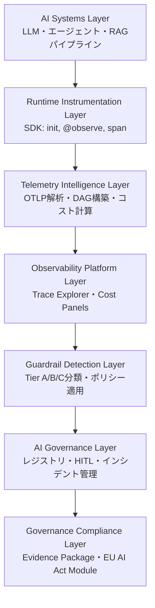
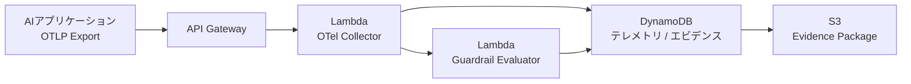
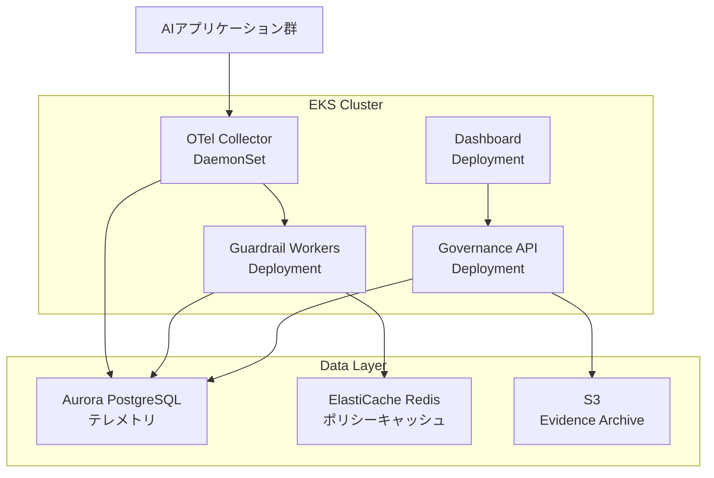

## 論文概要（Abstract）

Tracciaは、OpenTelemetryインフラストラクチャ上に構築されたマルチレベルAIガバナンススタックである。テレメトリデータ、セマンティックガードレール評価、実行リネージュを改ざん耐性のあるトレースレジャーに統合し、SHA-256コンテンツハッシュを用いたコンプライアンスエビデンスパッケージを自動生成する。著者らは、既存のLLM評価プラットフォームやMLOpsワークフロー監視ツールではアライメントドリフトやシャドウAIデプロイメントといったリスクに対処できないと指摘し、EU AI Act（Article 12, 14, 19, 26(6), 50）への適合を実現する7層アーキテクチャを提案している。

本記事は [https://arxiv.org/abs/2607.14309](https://arxiv.org/abs/2607.14309) の解説記事です。

関連するZenn記事: [LangfuseとOpenTelemetryで実装するLLMアプリの本番監視](https://zenn.dev/0h_n0/articles/93ea7afbeb3a96)

## 情報源

- **arXiv ID**: 2607.14309
- **URL**: [arXiv:2607.14309](https://arxiv.org/abs/2607.14309)
- **著者**: Nutan Kumar Naik, Aditya Kumar Saroj, Vijay Prasad Poudel, Saurav Samantray, Abhishek Patel（Algen.AI, Bengaluru）
- **発表年**: 2026年7月
- **分野**: Artificial Intelligence (cs.AI), Computers and Society (cs.CY)
- **ページ数**: 26ページ、2図、3表

## 背景と動機（Background & Motivation）

LLMと自律エージェントの急速な発展により、従来のソフトウェア品質保証手法（静的解析、単体テスト、有界ベンチマーク）では非決定論的なエージェントシステムのガバナンスが困難になっている。著者らは、この問題を「オブザーバビリティとガバナンスの本質的な違い」として整理している。すなわち、オブザーバビリティは記述的（descriptive）であるのに対し、ガバナンスは規範的（prescriptive）であるという点である。

EU AI Actをはじめとする規制フレームワークが法的拘束力を持つようになる中、既存ツールは3つのカテゴリに分断されている。

1. **評価プラットフォーム**（Arize AI/Phoenix、Langfuse、LangSmith）: セマンティック行動評価やガードレールに強いが、暗号学的保証やリアルタイム推論モニタリングが欠如
2. **MLOpsトラッカー**（MLflow、W&B、CometML）: パイプラインレベルのガバナンスを提供するが、推論時のリアルタイム状態変化が不可視
3. **クラウドネイティブオブザーバビリティ**（Datadog、New Relic、Honeycomb）: 物理テレメトリに詳しいが、計算リソース使用量の増加が正常なデータ取得なのかジェイルブレイクなのかを判別するセマンティック洞察が欠如

著者らは「分断されたマルチベンダーツールチェーンによる法的要件の実装は、不可避な『ラストマイル問題』を生む」と主張し、これらを統合するプラットフォームの必要性を論じている。

## 主要な貢献（Key Contributions）

- **AIガバナンスの4層分類体系**: モデルレベル、パイプラインレベル、ランタイムレベル、コンプライアンスレベルの階層的ガバナンス分類を提案
- **7層ガバナンスアーキテクチャ**: OpenTelemetry上に構築された、AIシステム層からガバナンスコンプライアンス層までの垂直パイプラインを設計
- **3層ガードレール分類**: 明示的アノテーション（Tier A）、プロバイダシグナル（Tier B）、ヒューリスティック検出（Tier C）による段階的検出メカニズム
- **暗号学的エビデンスチェーン**: SHA-256ハッシュによる入出力バインディングで改ざん耐性のあるコンプライアンス記録を生成
- **EU AI Act自動マッピング**: テレメトリから規制要件（Article 12, 14, 19, 26(6), 50, 72-73）への自動対応付け
- **8プラットフォームとの体系的比較**: Langfuse、LangSmith、Arize AI等との機能比較を通じたガバナンスギャップの実証

## 技術的詳細（Technical Details）

### 7層アーキテクチャ

著者らが提案するTracciaは、実行イベントをコンプライアンスアーティファクトに変換する7層の垂直パイプラインで構成される。



### ランタイム計装レイヤー（Layer 2）

SDKは以下の主要関数を提供する。

- `init()`: APIキー、エージェントID、コンプライアンスフレームワーク、PII秘匿設定でブートストラップ
- `@observe()`: 関数デコレータによる自動スパン生成とパラメータログ
- `span()`: 手動スパン作成（高カーディナリティタグ付け対応）
- `max_span_depth = 10`: 再帰的メモリ枯渇防止

W3C Trace Contextにより、ネットワーク境界を越えた親子スパン関係が維持される。`init(redact_pii=True)`を設定すると、OTLP JSONエクスポート前に正規表現ベースのPIIパターンマッチングが実行される。

### テレメトリインテリジェンスレイヤー（Layer 3）

バックエンド処理として以下を実行する。

1. スパン属性の解析と実行DAG（有向非巡回グラフ）の構築
2. LLMベンダー間でのトークン使用量・レイテンシ統計の抽出・正規化
3. ローカル価格エンジン（2,500以上のモデル価格設定に対応）によるリアルタイムコスト計算
4. システムメトリクスを含むセマンティック実行グラフの生成

### 3層ガードレール分類（Layer 5）

| Tier | 検出方法 | 信頼度 | 例 |
|------|----------|--------|-----|
| A | `guardrail_span()`または`@observe(as_type='guardrail')`による明示的アノテーション | 高 | 開発者定義のPIIスキャナー |
| B | プロバイダ固有シグナル | 中 | OpenAIの`finish_reason='content_filter'` |
| C | ヒューリスティックキーワードマッチング | 低 | ツールエラーメッセージのパターン検出 |

著者らが特に強調しているのが**Missing Guardrail Evaluator**である。これはエージェントの能力（`calls_llm`、`uses_tools`等）を推論し、対応するガードレールが存在しないスパンを`guardrail.summary`属性で警告する仕組みである。

適用モードは3段階で構成される。
- `log_only`: フラグ付けのみ（実行は継続）
- `warn`: ソフトブロック（通知あり）
- `block`: ハードブロック（実行停止）

### コンプライアンスレイヤー（Layer 7）

最終レイヤーでは、ポリシー設定、実行履歴、インシデントレポートを統合したJSON形式のエビデンスパッケージを生成する。各パッケージにはSHA-256整合性ハッシュが付与され、改ざん検知が可能となる。

EU AI Actモジュールでは、`eu_ai_act_article_mapping`メタデータにより、エビデンスと以下の条項が自動的に紐付けられる。

| EU AI Act条項 | 対応するTracciaの機能 |
|---------------|----------------------|
| Article 12, 19, 26(6) | ログ要件 → テレメトリ記録 |
| Article 14 | 人間による監視 → HITL承認キュー |
| Article 27 | 基本権影響評価 → FRIA 7ステップウィザード |
| Article 50 | 透明性義務 → 透明性マーカー |
| Articles 72-73 | インシデント報告 → インシデント管理 |

## 実装のポイント（Implementation Highlights）

論文では、AIローン審査アシスタントの具体例を通じて4フェーズの実装パターンが示されている。

**Phase 1 - 計装**: `init()`によるエージェント登録、リスクティア宣言、パイプライン有効化

```python
from traccia import init

init(
    api_key="<API_KEY>",
    agent_id="loan-approval-assistant",
    compliance={"frameworks": ["eu_ai_act"], "risk_tier": "high"},
    redact_pii=True,
    enable_console_exporter=True,
)
```

**Phase 2 - ガードレール適用**: プロンプトインジェクション検出とPIIスキャン

```python
from traccia import observe, guardrail_span, redact_string

@observe(
    as_type="guardrail",
    attributes={
        "guardrail.category": "prompt_injection",
        "guardrail.enforcement_mode": "block",
    },
)
def check_prompt_injection(user_input: str) -> bool:
    """プロンプトインジェクションを検出しブロックする."""
    # 検出ロジック
    ...

with guardrail_span(
    "pii_scanner", category="pii", enforcement_mode="warn"
):
    sanitized = redact_string(raw_input)
    # [REDACTED_EMAIL] 等に置換
```

**Phase 3 - 推論と強化**: 自動計装されたOpenAIクライアントによるモデル呼び出し

```python
from traccia import enrich_governance_attributes

gov_attrs = enrich_governance_attributes(
    event_type="inference",
    model_id="gpt-4o",
    input_text=prompt,
    output_text=decision,
    session_id="session-loan-2026",
    eu_risk_tier="high",
)
# SHA-256による入出力の暗号学的バインディングが自動付与
```

**Phase 4 - ガバナンスハブ**: 人間レビュー（Article 14対応）、インシデント管理（Article 72-73対応）、FRIA（Article 27対応）の処理

## Production Deployment Guide

Tracciaのようなガバナンスパイプラインをプロダクション環境に導入する際の、AWS上での実装パターンを構成規模別に整理する。OTel Collector経由でテレメトリを収集し、ガードレール評価・コンプライアンスエビデンス生成まで一貫して実行するアーキテクチャを対象とする。

### 構成比較

| 項目 | Small | Medium | Large |
|------|-------|--------|-------|
| **コンピュート** | Lambda | ECS Fargate | EKS + Karpenter |
| **テレメトリ収集** | OTel Collector (Lambda) | OTel Collector (Sidecar) | OTel Collector DaemonSet |
| **ストレージ** | DynamoDB | DynamoDB + ElastiCache | Aurora PostgreSQL + ElastiCache |
| **ガードレール評価** | Lambda (同期) | ECS Fargate タスク | 専用ノードプール |
| **エビデンス保存** | S3 + DynamoDB | S3 + DynamoDB | S3 + Aurora + Athena |
| **月額概算** | $200-500 | $1,500-3,000 | $5,000-15,000 |
| **想定規模** | ~10万スパン/日 | ~500万スパン/日 | ~1億スパン/日 |
| **ユースケース** | PoC・小規模チーム | 部門単位のAIガバナンス | エンタープライズ全体 |

### Small構成: Lambda + DynamoDB

OTel CollectorをLambdaで実行し、テレメトリ収集からガードレール評価、エビデンス生成までサーバーレスで完結する。月間コストを抑えつつ、EU AI Act準拠のエビデンスパッケージ生成を実現する。



```hcl
# --- Small構成: Lambda + DynamoDB ---

terraform {
  required_version = ">= 1.5"
  required_providers {
    aws = { source = "hashicorp/aws", version = "~> 5.0" }
  }
}

provider "aws" {
  region = "ap-northeast-1"
}

# DynamoDB: テレメトリ + エビデンス保存
resource "aws_dynamodb_table" "traces" {
  name         = "traccia-traces"
  billing_mode = "PAY_PER_REQUEST"
  hash_key     = "trace_id"
  range_key    = "span_id"

  attribute {
    name = "trace_id"
    type = "S"
  }
  attribute {
    name = "span_id"
    type = "S"
  }

  ttl {
    attribute_name = "ttl"
    enabled        = true
  }

  point_in_time_recovery {
    enabled = true
  }

  tags = {
    Service = "traccia-governance"
  }
}

resource "aws_dynamodb_table" "evidence_packages" {
  name         = "traccia-evidence"
  billing_mode = "PAY_PER_REQUEST"
  hash_key     = "package_id"
  range_key    = "created_at"

  attribute {
    name = "package_id"
    type = "S"
  }
  attribute {
    name = "created_at"
    type = "S"
  }

  tags = {
    Service = "traccia-governance"
  }
}

# S3: Evidence Package アーカイブ
resource "aws_s3_bucket" "evidence" {
  bucket = "traccia-evidence-packages"

  tags = {
    Service = "traccia-governance"
  }
}

resource "aws_s3_bucket_versioning" "evidence" {
  bucket = aws_s3_bucket.evidence.id
  versioning_configuration {
    status = "Enabled"
  }
}

resource "aws_s3_bucket_server_side_encryption_configuration" "evidence" {
  bucket = aws_s3_bucket.evidence.id
  rule {
    apply_server_side_encryption_by_default {
      sse_algorithm = "aws:kms"
    }
  }
}

# Lambda: OTel Collector
resource "aws_lambda_function" "otel_collector" {
  function_name = "traccia-otel-collector"
  runtime       = "python3.12"
  handler       = "collector.handler"
  timeout       = 30
  memory_size   = 512

  filename         = "lambda/collector.zip"
  source_code_hash = filebase64sha256("lambda/collector.zip")
  role             = aws_iam_role.lambda_exec.arn

  environment {
    variables = {
      DYNAMODB_TRACES_TABLE   = aws_dynamodb_table.traces.name
      DYNAMODB_EVIDENCE_TABLE = aws_dynamodb_table.evidence_packages.name
      EVIDENCE_BUCKET         = aws_s3_bucket.evidence.id
      GUARDRAIL_FUNCTION      = aws_lambda_function.guardrail_evaluator.arn
    }
  }

  tags = {
    Service = "traccia-governance"
  }
}

# Lambda: Guardrail Evaluator
resource "aws_lambda_function" "guardrail_evaluator" {
  function_name = "traccia-guardrail-evaluator"
  runtime       = "python3.12"
  handler       = "guardrail.handler"
  timeout       = 60
  memory_size   = 1024

  filename         = "lambda/guardrail.zip"
  source_code_hash = filebase64sha256("lambda/guardrail.zip")
  role             = aws_iam_role.lambda_exec.arn

  environment {
    variables = {
      DYNAMODB_TRACES_TABLE = aws_dynamodb_table.traces.name
      ENFORCEMENT_MODE      = "warn"
    }
  }

  tags = {
    Service = "traccia-governance"
  }
}

# API Gateway: OTLP受信エンドポイント
resource "aws_apigatewayv2_api" "otlp" {
  name          = "traccia-otlp-receiver"
  protocol_type = "HTTP"
}

resource "aws_apigatewayv2_integration" "collector" {
  api_id                 = aws_apigatewayv2_api.otlp.id
  integration_type       = "AWS_PROXY"
  integration_uri        = aws_lambda_function.otel_collector.invoke_arn
  payload_format_version = "2.0"
}

resource "aws_apigatewayv2_route" "traces" {
  api_id    = aws_apigatewayv2_api.otlp.id
  route_key = "POST /v1/traces"
  target    = "integrations/${aws_apigatewayv2_integration.collector.id}"
}

resource "aws_apigatewayv2_stage" "default" {
  api_id      = aws_apigatewayv2_api.otlp.id
  name        = "$default"
  auto_deploy = true
}

# IAM Role
resource "aws_iam_role" "lambda_exec" {
  name = "traccia-lambda-exec"

  assume_role_policy = jsonencode({
    Version = "2012-10-17"
    Statement = [{
      Action = "sts:AssumeRole"
      Effect = "Allow"
      Principal = { Service = "lambda.amazonaws.com" }
    }]
  })
}

resource "aws_iam_role_policy" "lambda_policy" {
  name = "traccia-lambda-policy"
  role = aws_iam_role.lambda_exec.id

  policy = jsonencode({
    Version = "2012-10-17"
    Statement = [
      {
        Effect = "Allow"
        Action = [
          "dynamodb:PutItem",
          "dynamodb:GetItem",
          "dynamodb:Query",
          "dynamodb:BatchWriteItem",
        ]
        Resource = [
          aws_dynamodb_table.traces.arn,
          aws_dynamodb_table.evidence_packages.arn,
        ]
      },
      {
        Effect   = "Allow"
        Action   = ["s3:PutObject", "s3:GetObject"]
        Resource = "${aws_s3_bucket.evidence.arn}/*"
      },
      {
        Effect   = "Allow"
        Action   = ["lambda:InvokeFunction"]
        Resource = aws_lambda_function.guardrail_evaluator.arn
      },
      {
        Effect   = "Allow"
        Action   = ["logs:CreateLogGroup", "logs:CreateLogStream", "logs:PutLogEvents"]
        Resource = "arn:aws:logs:*:*:*"
      },
    ]
  })
}

output "otlp_endpoint" {
  value       = "${aws_apigatewayv2_api.otlp.api_endpoint}/v1/traces"
  description = "OTLP HTTP endpoint for Traccia telemetry"
}
```

### Large構成: EKS + Karpenter

エンタープライズ規模では、EKSクラスタ上にOTel Collector DaemonSet、ガードレール評価ワーカー、ガバナンスダッシュボードを展開する。Karpenterによるオートスケーリングでスパン量の変動に対応する。



```hcl
# --- Large構成: EKS + Karpenter ---

module "eks" {
  source  = "terraform-aws-modules/eks/aws"
  version = "~> 20.0"

  cluster_name    = "traccia-governance"
  cluster_version = "1.31"

  vpc_id     = module.vpc.vpc_id
  subnet_ids = module.vpc.private_subnets

  cluster_addons = {
    coredns    = { most_recent = true }
    kube-proxy = { most_recent = true }
    vpc-cni    = { most_recent = true }
  }

  eks_managed_node_groups = {
    system = {
      instance_types = ["m7i.large"]
      min_size       = 2
      max_size       = 4
      desired_size   = 2
      labels = {
        workload = "system"
      }
    }
  }

  tags = {
    Service     = "traccia-governance"
    Environment = "production"
  }
}

# Karpenter: ガードレール評価用オートスケーリング
resource "helm_release" "karpenter" {
  name       = "karpenter"
  repository = "oci://public.ecr.aws/karpenter"
  chart      = "karpenter"
  version    = "1.1.0"
  namespace  = "kube-system"

  set {
    name  = "settings.clusterName"
    value = module.eks.cluster_name
  }
  set {
    name  = "settings.clusterEndpoint"
    value = module.eks.cluster_endpoint
  }
}

# Aurora PostgreSQL: 大規模テレメトリ保存
module "aurora" {
  source  = "terraform-aws-modules/rds-aurora/aws"
  version = "~> 9.0"

  name           = "traccia-telemetry"
  engine         = "aurora-postgresql"
  engine_version = "16.4"
  instance_class = "db.r7g.large"
  instances      = { 1 = {}, 2 = {} }

  vpc_id  = module.vpc.vpc_id
  subnets = module.vpc.database_subnets

  storage_encrypted = true
  apply_immediately = true

  monitoring_interval = 60

  tags = {
    Service = "traccia-governance"
  }
}

# ElastiCache Redis: ポリシーキャッシュ + リアルタイム集計
module "elasticache" {
  source  = "terraform-aws-modules/elasticache/aws"
  version = "~> 1.0"

  cluster_id      = "traccia-policy-cache"
  engine          = "redis"
  engine_version  = "7.1"
  node_type       = "cache.r7g.large"
  num_cache_nodes = 2

  subnet_ids = module.vpc.elasticache_subnets

  tags = {
    Service = "traccia-governance"
  }
}

# S3: Evidence Package（長期保存 + Athena分析用）
resource "aws_s3_bucket" "evidence_archive" {
  bucket = "traccia-evidence-archive-prod"

  tags = {
    Service = "traccia-governance"
  }
}

resource "aws_s3_bucket_lifecycle_configuration" "evidence_lifecycle" {
  bucket = aws_s3_bucket.evidence_archive.id

  rule {
    id     = "archive-old-evidence"
    status = "Enabled"

    transition {
      days          = 90
      storage_class = "GLACIER_IR"
    }
    transition {
      days          = 365
      storage_class = "DEEP_ARCHIVE"
    }
  }
}

# Athena: コンプライアンス分析クエリ
resource "aws_glue_catalog_database" "traccia" {
  name = "traccia_compliance"
}

resource "aws_glue_catalog_table" "evidence" {
  name          = "evidence_packages"
  database_name = aws_glue_catalog_database.traccia.name

  table_type = "EXTERNAL_TABLE"

  parameters = {
    "classification" = "json"
  }

  storage_descriptor {
    location      = "s3://${aws_s3_bucket.evidence_archive.id}/evidence/"
    input_format  = "org.apache.hadoop.mapred.TextInputFormat"
    output_format = "org.apache.hadoop.hive.ql.io.HiveIgnoreKeyTextOutputFormat"

    ser_de_info {
      serialization_library = "org.openx.data.jsonserde.JsonSerDe"
    }

    columns {
      name = "package_id"
      type = "string"
    }
    columns {
      name = "agent_id"
      type = "string"
    }
    columns {
      name = "risk_tier"
      type = "string"
    }
    columns {
      name = "sha256_hash"
      type = "string"
    }
    columns {
      name = "eu_ai_act_articles"
      type = "array<string>"
    }
    columns {
      name = "created_at"
      type = "timestamp"
    }
  }
}
```

### 運用・監視設定

ガバナンスプラットフォーム自体の監視には、以下のCloudWatchメトリクスとアラームを設定する。

```hcl
# CloudWatch: ガバナンスパイプライン監視
resource "aws_cloudwatch_metric_alarm" "guardrail_latency" {
  alarm_name          = "traccia-guardrail-p99-latency"
  comparison_operator = "GreaterThanThreshold"
  evaluation_periods  = 3
  metric_name         = "GuardrailEvaluationDuration"
  namespace           = "Traccia/Governance"
  period              = 300
  statistic           = "p99"
  threshold           = 5000
  alarm_description   = "Guardrail evaluation p99 latency > 5s"
  alarm_actions       = [aws_sns_topic.alerts.arn]
}

resource "aws_cloudwatch_metric_alarm" "evidence_generation_errors" {
  alarm_name          = "traccia-evidence-gen-errors"
  comparison_operator = "GreaterThanThreshold"
  evaluation_periods  = 2
  metric_name         = "EvidenceGenerationErrors"
  namespace           = "Traccia/Governance"
  period              = 300
  statistic           = "Sum"
  threshold           = 5
  alarm_description   = "Evidence package generation errors > 5 in 10min"
  alarm_actions       = [aws_sns_topic.alerts.arn]
}

resource "aws_cloudwatch_metric_alarm" "missing_guardrails" {
  alarm_name          = "traccia-missing-guardrails"
  comparison_operator = "GreaterThanThreshold"
  evaluation_periods  = 1
  metric_name         = "MissingGuardrailDetections"
  namespace           = "Traccia/Governance"
  period              = 3600
  statistic           = "Sum"
  threshold           = 50
  alarm_description   = "Missing guardrail detections > 50/hour"
  alarm_actions       = [aws_sns_topic.alerts.arn]
}

resource "aws_sns_topic" "alerts" {
  name = "traccia-governance-alerts"
}
```

### コスト最適化チェックリスト

| カテゴリ | 最適化施策 | 削減効果目安 |
|----------|-----------|-------------|
| テレメトリ保存 | DynamoDB TTLで90日超のスパンを自動削除 | 30-40% |
| エビデンス保存 | S3 Lifecycle（90日→Glacier IR、365日→Deep Archive） | 50-70% |
| ガードレール評価 | ElastiCacheでポリシー定義をキャッシュ（TTL 5min） | 20-30% |
| Lambda | ARM64（Graviton）ランタイムを使用 | 20% |
| EKS | Karpenter SpotインスタンスでTier C評価ノードを構成 | 60-70% |
| ネットワーク | VPCエンドポイント（DynamoDB, S3, CloudWatch） | NAT Gateway費用削減 |
| 監査ログ | CloudWatch Logsの保持期間を30日に設定 | 40-50% |

## 実験結果（Evaluation Results）

論文Table 2およびTable 3において、著者らは8つの代表的プラットフォームとの体系的比較を報告している。

**テレメトリアーキテクチャ**（論文Table 2より）: Tracciaは純粋なOTLP標準に基づいており、ベンダーロックインがない。エンドポイント変更のみでバックエンドを切り替えられるのに対し、LangSmithやBraintrustはプロプライエタリプロトコルでロックイン度が高いと報告されている。Datadog（ddtrace）は「Very High」のロックインと分類されている。

**ランタイムガードレール検証**: 著者らは、ネイティブなランタイムガードレール検証と検出を提供するのはTracciaのみであると主張している。既存プラットフォームは出力プロパティ（毒性、幻覚、忠実性）の評価に留まり、安全ラッパーの存在確認は行わないとされている。

**規制コンプライアンス対応**（論文Table 3より）: EU AI Actモジュール、テレメトリからのエビデンス生成、FRIA（基本権影響評価）サポート、ガバナンスハブの4軸すべてで対応しているのはTracciaのみと報告されている。Credo AIとHolistic AIは自己申告ベースのポリシーパックやフレームワークマッピングを提供するが、テレメトリからのエビデンス自動生成は行わないとされている。

**コスト追跡**: Tracciaは2,500以上のモデル価格設定に基づく遡及的コスト再計算エンジンを備え、プロンプトキャッシング、バッチ価格、動的プロバイダ価格変動に対応すると報告されている。

## 実運用への応用（Practical Applications）

著者らの論文から示唆される主な実運用シナリオを整理する。

**金融サービス**: ローン審査AIのように高リスクティアに分類されるシステムでは、推論の入出力にSHA-256ハッシュを付与し、HITL承認キューを通じて人間のレビューを記録することで、EU AI Act Article 14（人間による監視）への対応が可能となる。

**シャドウAI検出**: エンタープライズ環境では、OTel計装を全AIアプリケーションに適用することで、IT部門が把握していない非承認AIシステムの使用を可視化できる。Missing Guardrail Evaluatorにより、ガードレールなしで動作するエージェントを自動検出する仕組みが構築可能である。

**マルチエージェントシステム**: W3C Trace Contextによる親子スパン追跡は、複数エージェントが協調する複雑なワークフローにおいて、各エージェントの判断経路を一元的にトレースする基盤となる。`max_span_depth = 10`の制限により、再帰的エージェントループによるメモリ枯渇も防止される。

**既存ツールとの共存**: 著者らは、Tracciaが既存の評価プラットフォーム（Langfuse、LangSmith等）やMLOpsツール（MLflow、W&B等）を置き換えるものではなく、「ランタイムガバナンスインフラストラクチャ」という新しいカテゴリとして補完する位置付けであると主張している。

## 関連研究（Related Work）

AI観測可能性の分野では、OpenTelemetryベースのLLMトレーシングとしてLangfuse、LangSmith、Arize AI/Phoenixが広く利用されている。ガバナンスの観点では、Credo AIがポリシーパックベースのGRCダッシュボードを、Holistic AIがオフライン監査ベースのAIインベントリを提供している。Tracciaはこれらと異なり、「実行パス上で動作するランタイムガバナンスインフラストラクチャ」として位置付けられ、テレメトリからの自動エビデンス生成を特徴とする。規制面では、EU AI ActのほかNIST AI RMF、ISO 42001:2023、ISO 23894が主要フレームワークとして参照されている。

## まとめと今後の展望

Tracciaは、OpenTelemetry上に構築された7層ガバナンスアーキテクチャにより、「実行そのものからランタイムガバナンスを抽出する」というアプローチを提案している。SHA-256による暗号学的エビデンスチェーン、3層ガードレール分類、EU AI Act自動マッピングを統合し、コンプライアンスをドキュメントベースからエビデンスベースへ転換する試みである。

著者らは現時点の制限として、現在は「観測・警告」モードのみで実行時ブロッキングは将来版で検討されること、EU AI Actに焦点を絞っておりHIPAA・SOC 2・ISO 42001への拡張は計画段階であること、評価機能やヒューマンアノテーションパイプラインは開発ロードマップ上にあることを明示している。

LLMオブザーバビリティの実装に関心がある読者は、関連Zenn記事「[LangfuseとOpenTelemetryで実装するLLMアプリの本番監視](https://zenn.dev/0h_n0/articles/93ea7afbeb3a96)」も参照されたい。

## 参考文献

1. N. K. Naik, A. K. Saroj, V. P. Poudel, S. Samantray, A. Patel, "Traccia: An OpenTelemetry-Based Governance Platform for AI Systems," arXiv:2607.14309, Jul. 2026.
2. European Parliament, "Regulation (EU) 2024/1689 - AI Act," Official Journal of the European Union, 2024.
3. NIST, "Artificial Intelligence Risk Management Framework (AI RMF 1.0)," 2023.
4. ISO/IEC 42001:2023, "Artificial Intelligence - Management System," 2023.
5. OpenTelemetry Project, "OpenTelemetry Specification," [https://opentelemetry.io/docs/specs/](https://opentelemetry.io/docs/specs/).
