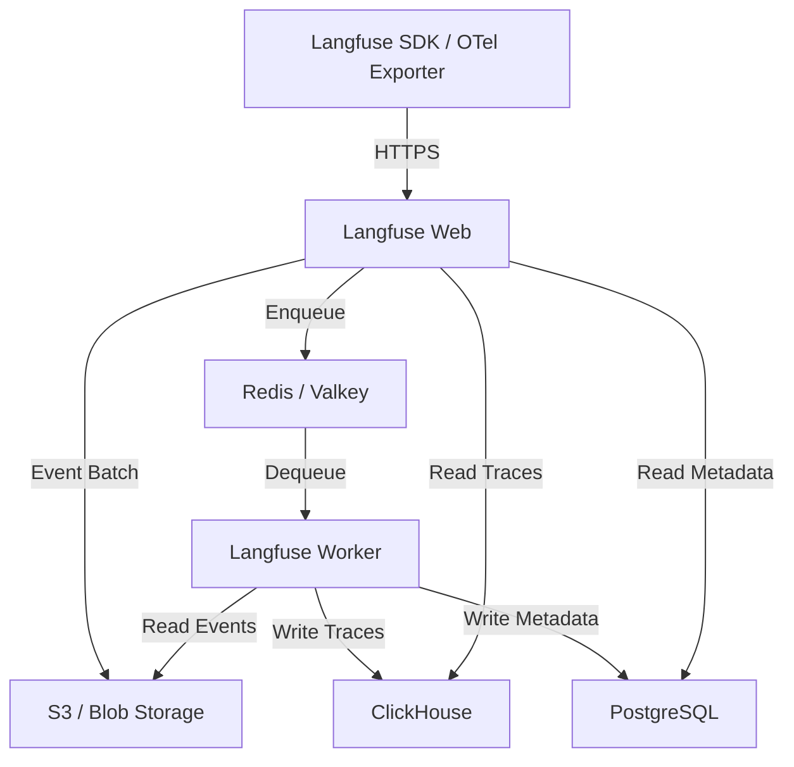

## ブログ概要

本記事は [https://clickhouse.com/blog/clickhouse-acquires-langfuse-open-source-llm-observability](https://clickhouse.com/blog/clickhouse-acquires-langfuse-open-source-llm-observability) の解説記事です。

2026年1月、列指向分析データベースClickHouseがオープンソースLLMオブザーバビリティプラットフォームLangfuseの買収を発表した。ClickHouseはこの買収を「Agentic Data Stack」構想の一環と位置づけている。Langfuseはクラウド・セルフホスト両方のデプロイにおいて既にClickHouseをバックエンドとして採用しており、技術的に密接な関係にあった。買収後もLangfuseはMITライセンスを維持し、オープンソースコミュニティとの関係を継続するとClickHouseは述べている。

この記事は [Zenn記事: LangfuseとOpenTelemetryで実装するLLMアプリの本番監視](https://zenn.dev/0h_n0/articles/93ea7afbeb3a96) の深掘りです。

## 情報源

- **種別**: 企業テックブログ（ClickHouse公式ブログ）
- **URL**: [ClickHouse welcomes Langfuse: The future of open-source LLM observability](https://clickhouse.com/blog/clickhouse-acquires-langfuse-open-source-llm-observability)
- **組織**: ClickHouse, Inc.
- **発表日**: 2026年1月16日

## 技術的背景

### LLMオブザーバビリティの需要増大

LLMアプリケーションの本番運用では、従来のAPMでは捉えきれない固有の課題がある。プロンプトの品質評価、レスポンスのハルシネーション検出、トークン消費量に基づくコスト追跡、レイテンシ分析など、LLM特有のメトリクスを継続的に収集・分析する必要がある。Merck社のChief Data & AI Officer Walid Mehanna氏は「生成AIがエンタープライズで信頼を得るには、内部で何が起きているかを可視化する必要がある。Langfuseによって、すべてのプロンプト・レスポンス・コスト・レイテンシをリアルタイムに追跡でき、ブラックボックスモデルを監査可能で最適化可能な資産に変えられる」と述べている。

### ClickHouseの列指向分析DBとしての強み

ClickHouseは列指向ストレージと圧縮アルゴリズムにより、大量の構造化イベントデータに対する分析クエリで高いスループットを実現する。LLMオブザーバビリティのワークロードは「高ボリュームの書き込み」と「高速な分析クエリ」の両方を必要とするため、行指向RDBMSでは性能面で限界がある。ClickHouseの列圧縮はトレースデータ（タイムスタンプ、モデル名、トークン数など同質のカラムが繰り返される）と相性が良く、ストレージ効率とクエリ速度の両面で優位性を持つ。

### Langfuseのオープンソースポジション

ClickHouseのブログによると、LangfuseはGitHub Stars 20,000以上、月間SDK 2,310万インストール、Docker 600万プルの実績を持つ。Fortune 50企業19社、Fortune 500企業63社がLangfuseを利用しており、具体的にはIntuit、Twilio、7-Eleven、Merck、Khan Academy等が挙げられている。MITライセンスの下で公開されており、買収後もこのライセンスを維持するとClickHouseは明言している。

## 実装アーキテクチャ

### Langfuse v3のClickHouseバックエンド

Langfuseのセルフホスト環境は以下のコンポーネントで構成される（[Langfuse公式ドキュメント](https://langfuse.com/docs/deployment/self-host)に基づく）。



- **Langfuse Web**: UIとAPIを提供するアプリケーションコンテナ。SDKやOTelエクスポーターからのイベントを受信する
- **Langfuse Worker**: 非同期でイベントを処理するワーカープロセス。Redisキューからジョブを取得し、S3からイベントを読み出してClickHouseに書き込む
- **ClickHouse**: トレース、オブザベーション（LLM呼び出しの個別記録）、スコア（品質評価）を格納するOLAPデータベース。高ボリュームの書き込みと分析クエリを担当する
- **PostgreSQL**: プロジェクト設定、ユーザー、プロンプト管理などトランザクショナルなメタデータを格納する
- **Redis / Valkey**: キューイングとキャッシュに使用。イベントの非同期処理を実現する
- **S3 / Blob Storage**: 受信イベントの永続化、マルチモーダル入力、エクスポートデータを保持する。データベースが一時的に利用不可でもイベントを失わない耐障害性を提供する

この設計の要点は、SDKからのイベントをまずS3に永続化し、Redisキュー経由でWorkerが非同期にClickHouseへ書き込む「キュー型インジェスション」パターンを採用している点である。これにより、トラフィックスパイク時にもデータベースがボトルネックにならず、S3にバッファされたイベントからリカバリが可能になる。

### OpenTelemetry統合

Langfuseは `/api/public/otel` エンドポイントでOTLP（OpenTelemetry Protocol）over HTTPをサポートしている（v3.22.0以降のセルフホストで利用可能）。JSONとProtobuf両方のプロトコルに対応する。

OpenTelemetryのスパン属性は、Langfuseのデータモデルに以下のようにマッピングされる。

**トレースレベルのマッピング**:

| OTel属性 | Langfuseフィールド |
|----------|------------------|
| `langfuse.trace.name` / ルートスパン名 | `name` |
| `langfuse.user.id` / `user.id` | `userId` |
| `langfuse.session.id` / `session.id` | `sessionId` |
| `langfuse.trace.tags` | `tags` |

**オブザベーションレベルのマッピング**:

| OTel属性 | Langfuseフィールド |
|----------|------------------|
| `gen_ai.request.model` | `model` |
| `gen_ai.usage.*` | `usage`（トークン数） |
| `gen_ai.prompt` / `input.value` | `input` |
| `gen_ai.completion` / `output.value` | `output` |
| `gen_ai.usage.cost` | `cost` |

`langfuse.*` 名前空間の属性が優先され、次にOpenTelemetry GenAIセマンティック規約（`gen_ai.*`）、OpenInference規約（`input.value` / `output.value`）の順でフォールバックする。マッピングされないOTel属性は `metadata.attributes` に格納される。

OpenTelemetry Collector経由の送信設定では、`otlphttp/langfuse` エクスポーターにエンドポイントとBasic認証ヘッダー、`x-langfuse-ingestion-version: "4"` ヘッダーを指定する。`filterprocessor` で `gen_ai.system` 属性を持つスパンのみをLangfuseに転送することで、LLM関連スパンだけを選択的に収集できる。

### セルフホスト vs クラウドの選択基準

Langfuseのデプロイには大きく2つの選択肢がある。

**Langfuse Cloud**（マネージド）:
- リージョン: EU（デフォルト）、US、日本、HIPAA対応
- インフラ管理不要、SLA保証あり
- ClickHouseのスケーリング・バックアップはLangfuse側が管理

**セルフホスト**:
- Docker Compose（開発・検証用）、Kubernetes + Helm（本番用）、Terraform（AWS / Azure / GCP）
- データ主権・コンプライアンス要件がある場合に適する
- ClickHouseクラスタの運用・スケーリングは自組織で管理
- 全コンポーネントのタイムゾーンをUTCに統一する必要がある（ClickHouseとPostgreSQLの時刻不整合を防ぐため）

データ主権要件がなければクラウド版の方が運用負荷は低い。VPC内にプロンプト・レスポンスデータを留めたい場合はセルフホストが適する。

## Production Deployment Guide

Langfuseセルフホスト環境をAWSにデプロイする際の実装パターンを、トラフィック規模別に解説する。

### AWS実装パターン（Langfuseセルフホスト構成）

| 構成 | トラフィック | 主要サービス | 月額概算 |
|------|------------|-------------|---------|
| Small | ~1,000 traces/日 | EC2 t3.large + ClickHouse single-node | $150-300 |
| Medium | ~10,000 traces/日 | ECS Fargate + ClickHouse 3-node cluster | $800-1,500 |
| Large | 100,000+ traces/日 | EKS + ClickHouse Cloud | $3,000-8,000 |

> **注意**: コスト試算は2026年7月時点のAWS ap-northeast-1（東京）リージョン料金に基づく概算値です。実際のコストはトラフィックパターン、データ保持期間、クエリ頻度により変動します。最新料金は[AWS料金計算ツール](https://calculator.aws/)で確認してください。

**Small構成（~1,000 traces/日）**:

EC2 t3.large（2 vCPU, 8 GiB RAM）1台にLangfuse Web、Worker、ClickHouse、PostgreSQL、Redisを同居させる構成。Docker Composeで管理する。S3はイベントバッファとして利用する。開発チームや小規模PoC向け。

- EC2 t3.large: ~$61/月（オンデマンド）、Reserved 1年で~$38/月
- EBS gp3 100GB: ~$8/月
- S3: ~$5/月（100GB以下）
- RDS PostgreSQL db.t3.micro: ~$15/月（RDS使用時）
- 合計: $150-300/月

**Medium構成（~10,000 traces/日）**:

ECS FargateでLangfuse WebとWorkerをコンテナ化し、ClickHouseは3ノードクラスタをEC2上に構築する。PostgreSQLはRDS、RedisはElastiCacheを利用してマネージドにする。

- ECS Fargate（Web 0.5vCPU/1GB x 2, Worker 0.5vCPU/1GB x 2）: ~$120/月
- EC2 r6g.large x 3（ClickHouseクラスタ）: ~$300/月（Spot利用で~$120/月）
- RDS PostgreSQL db.t3.small: ~$30/月
- ElastiCache t3.small: ~$25/月
- ALB: ~$25/月
- S3 + データ転送: ~$20/月
- 合計: $800-1,500/月

**Large構成（100,000+ traces/日）**:

EKSでLangfuse Web/Workerをオーケストレーションし、ClickHouseはClickHouse Cloudのマネージドサービスを利用する。ClickHouseクラスタの運用負荷を排除しつつ、水平スケーリングに対応する。

- EKS コントロールプレーン: ~$73/月
- EC2ノード（m6g.xlarge x 3、Karpenter管理）: ~$350/月（Spot併用で~$140/月）
- ClickHouse Cloud: $1,500-5,000/月（使用量依存）
- RDS PostgreSQL db.r6g.large: ~$200/月
- ElastiCache r6g.large: ~$150/月
- ALB + WAF: ~$50/月
- 合計: $3,000-8,000/月

### Terraformインフラコード

**Small構成（EC2 + Docker Compose）** -- 主要リソースの抜粋:

```hcl
# langfuse-small/main.tf
# Langfuse Small構成: EC2 single-node with Docker Compose
# 対象: ~1,000 traces/日、開発・PoC環境

terraform {
  required_version = ">= 1.9"
  required_providers {
    aws = { source = "hashicorp/aws", version = "~> 5.60" }
  }
}

provider "aws" { region = "ap-northeast-1" }

# --- VPC基盤（NAT Gateway不使用でコスト削減） ---
resource "aws_vpc" "langfuse" {
  cidr_block           = "10.0.0.0/16"
  enable_dns_support   = true
  enable_dns_hostnames = true
  tags = { Name = "langfuse-small", Project = "langfuse" }
}

# --- S3バケット（イベントバッファ、KMS暗号化） ---
resource "aws_s3_bucket" "langfuse_events" {
  bucket = "langfuse-events-${data.aws_caller_identity.current.account_id}"
  tags   = { Project = "langfuse" }
}

resource "aws_s3_bucket_server_side_encryption_configuration" "langfuse" {
  bucket = aws_s3_bucket.langfuse_events.id
  rule {
    apply_server_side_encryption_by_default { sse_algorithm = "aws:kms" }
  }
}

# --- EC2インスタンス ---
resource "aws_instance" "langfuse" {
  ami                    = data.aws_ami.al2023.id
  instance_type          = "t3.large" # 2 vCPU, 8 GiB RAM
  subnet_id              = aws_subnet.public.id
  vpc_security_group_ids = [aws_security_group.langfuse.id]
  iam_instance_profile   = aws_iam_instance_profile.langfuse.name

  root_block_device {
    volume_type = "gp3"
    volume_size = 100   # ClickHouseデータ用
    encrypted   = true
  }
  tags = { Name = "langfuse-server", Project = "langfuse" }
}

# --- IAMロール（最小権限: S3のみ） ---
resource "aws_iam_role_policy" "langfuse_s3" {
  name = "langfuse-s3-access"
  role = aws_iam_role.langfuse.id
  policy = jsonencode({
    Version = "2012-10-17"
    Statement = [{
      Effect   = "Allow"
      Action   = ["s3:GetObject", "s3:PutObject", "s3:ListBucket"]
      Resource = [
        aws_s3_bucket.langfuse_events.arn,
        "${aws_s3_bucket.langfuse_events.arn}/*"
      ]
    }]
  })
}
```

**Large構成（EKS + ClickHouse Cloud）** -- 主要リソースの抜粋:

```hcl
# langfuse-large/main.tf -- 100,000+ traces/日、本番環境

module "eks" {
  source  = "terraform-aws-modules/eks/aws"
  version = "~> 20.24"

  cluster_name    = "langfuse-prod"
  cluster_version = "1.31"
  vpc_id          = module.vpc.vpc_id
  subnet_ids      = module.vpc.private_subnets

  eks_managed_node_groups = {
    system = {
      instance_types = ["m6g.large"]
      min_size = 2; max_size = 4; desired_size = 2
      labels = { role = "system" }
    }
  }
  tags = { Project = "langfuse", Environment = "production" }
}

# --- Secrets Manager（ClickHouse Cloud接続情報） ---
resource "aws_secretsmanager_secret" "clickhouse" {
  name        = "langfuse/clickhouse-cloud"
  description = "ClickHouse Cloud connection credentials"
}

# --- AWS Budgets（月額$5,000超過でアラート） ---
resource "aws_budgets_budget" "langfuse" {
  name         = "langfuse-monthly"
  budget_type  = "COST"
  limit_amount = "5000"
  limit_unit   = "USD"
  time_unit    = "MONTHLY"

  notification {
    comparison_operator        = "GREATER_THAN"
    threshold                  = 80
    threshold_type             = "PERCENTAGE"
    notification_type          = "ACTUAL"
    subscriber_email_addresses = ["ops-team@example.com"]
  }
}
```

### 運用・監視設定

**CloudWatch Logs Insights クエリ**:

```sql
-- Langfuse Worker処理レイテンシ分析（P95, P99）
fields @timestamp, @message
| filter @message like /processing_time/
| stats
    avg(processing_time_ms) as avg_ms,
    percentile(processing_time_ms, 95) as p95_ms,
    percentile(processing_time_ms, 99) as p99_ms,
    count(*) as total
  by bin(1h)
| sort @timestamp desc

-- ClickHouseへの書き込みエラー検知
fields @timestamp, @message
| filter @message like /clickhouse/ and @message like /error/
| stats count(*) as error_count by bin(5m)
| sort @timestamp desc
```

**CloudWatch アラーム設定（Python）**:

```python
import boto3


def create_langfuse_alarms(instance_id: str, sns_topic_arn: str) -> None:
    """Langfuse監視用CloudWatchアラームを作成する。

    Args:
        instance_id: EC2インスタンスID（Small構成の場合）
        sns_topic_arn: 通知先SNSトピックARN
    """
    client = boto3.client("cloudwatch", region_name="ap-northeast-1")

    # ディスク使用率アラーム（ClickHouseデータ増大検知）
    client.put_metric_alarm(
        AlarmName="langfuse-disk-usage-high",
        MetricName="disk_used_percent",
        Namespace="CWAgent",
        Statistic="Maximum",
        Period=300,
        EvaluationPeriods=2,
        Threshold=85.0,
        ComparisonOperator="GreaterThanThreshold",
        AlarmActions=[sns_topic_arn],
        Dimensions=[{"Name": "InstanceId", "Value": instance_id}],
    )
```

**Cost Explorer自動レポート**: `boto3.client("ce")` の `get_cost_and_usage` APIで `Project=langfuse` タグフィルタの日次コストを集計し、閾値超過時にSNS通知する。

### コスト最適化チェックリスト

**アーキテクチャ選択**:
- [ ] トレース量が1,000/日以下ならSmall構成（EC2単体）で開始
- [ ] 10,000/日を超えたらMedium構成（ECS + ClickHouseクラスタ）に移行
- [ ] 100,000/日以上ならLarge構成（EKS + ClickHouse Cloud）を検討
- [ ] ClickHouse Cloudの従量課金とセルフホストの固定費を比較して判断

**リソース最適化**:
- [ ] EC2: ClickHouseノードはSpot Instances優先（最大90%削減、ただしレプリカ構成必須）
- [ ] Reserved Instances: 安定稼働のベースノードは1年コミットで最大40%削減
- [ ] Savings Plans: Fargate/Lambda利用分にCompute Savings Plans適用
- [ ] ECS: Langfuse Worker のタスク数をキュー深度に基づくAuto Scalingで調整
- [ ] EBS: gp3ボリュームでIOPS/スループットを個別指定しコスト最適化

**データ管理コスト削減**:
- [ ] ClickHouseのTTL設定でトレースデータの自動パージ（例: 90日保持）
- [ ] S3 Intelligent-Tieringでイベントバッファの保存コスト最適化
- [ ] S3ライフサイクルポリシーで古いイベントデータをGlacierへ移行
- [ ] ClickHouseのデータ圧縮コーデック（LZ4/ZSTD）を適切に選択

**監視・アラート**:
- [ ] AWS Budgets設定（月額予算の80%/100%でアラート）
- [ ] CloudWatch アラーム（CPU、メモリ、ディスク使用率）
- [ ] Cost Anomaly Detection有効化
- [ ] 日次コストレポート（Cost Explorer API + SNS通知）
- [ ] ClickHouseクエリログで重いクエリを検出し最適化

**リソース管理**:
- [ ] 未使用EC2/EBSボリュームの定期削除
- [ ] タグ戦略（Project, Environment, Owner）を全リソースに適用
- [ ] 開発環境は夜間・週末停止（AWS Instance Scheduler）

## パフォーマンス最適化

ClickHouseの列指向ストレージは、LLMオブザーバビリティデータの分析クエリに対して以下の特性を持つ。

**書き込み性能**: Langfuseのキュー型インジェスションにより、Workerがバッチ単位でClickHouseに書き込む。ClickHouseのMergeTreeエンジンはバッチinsertに最適化されており、1回のinsertで数千〜数万行を効率的に書き込める。行指向DBのように1行ずつinsertする必要がないため、高スループットを維持できる。

**クエリ性能**: 列指向ストレージでは、クエリが参照するカラムのみをディスクから読み出す。例えば「過去24時間のモデル別トークン消費量」を集計する場合、`model`と`usage_total_tokens`カラムだけを読めばよい。トレース全体のJSON（プロンプト・レスポンス含む）を読む必要がないため、分析クエリの応答時間が短い。

**圧縮効率**: トレースデータは同一カラムに類似値が連続する（例: `model`カラムに`gpt-4o`が大量に並ぶ）ため、列指向の辞書エンコーディングやLZ4圧縮が効果的に機能し、ストレージ使用量を抑制できる。

## 運用での学び

ClickHouseのブログによると、ClickHouse社内でもLangfuseを使って内部データウェアハウスAIエージェント「DWAINE」を監視しており、「個々のインタラクションのトレース、ハルシネーション検出などの品質メトリクスによるスコアリング、時系列でのトレンド分析」を実施していると述べている。

Khan Academy のStaff Software Engineer Walt Wells氏は「Langfuseにより、開発者が非常に高速なフィードバックを得られるようになった。機能を構築・デプロイする際に、それらの体験がどのように進んでいるかを素早く確認できる。LangfuseはAI実装を開発者が理解する方法の基盤となっている」と述べている。

セルフホスト環境での運用上の注意点として、Langfuseの公式ドキュメントは全インフラコンポーネント（ClickHouseとPostgreSQL）のタイムゾーンをUTCに統一することを必須としている。タイムゾーン不整合はクエリ結果の時刻ずれを引き起こすため、デプロイ時に確認が必要である。

## 学術研究との関連

LLMオブザーバビリティは、LLMOps（Large Language Model Operations）の一分野として研究が進んでいる。ClickHouseが提唱する「Agentic Data Stack」は、AIエージェントが自律的にデータパイプラインを操作・最適化する構想であり、データ専門家・開発者・ビジネスユーザーの3つのペルソナを対象としている。オブザーバビリティはこの構想における「エージェントのパフォーマンス可視化」と「デバッグ・最適化ツール」の基盤として位置づけられている。

## まとめと実践への示唆

ClickHouseによるLangfuse買収は、LLMオブザーバビリティの需要増大と、列指向分析DBがそのワークロードに適している事実を背景にしている。セルフホスト環境では、ClickHouse + PostgreSQL + Redis + S3のキュー型インジェスションアーキテクチャが耐障害性とスケーラビリティを両立する。OpenTelemetry統合により、既存の分散トレーシング基盤にLLMオブザーバビリティを統合できる。実践においては、トラフィック規模に応じたAWS構成の選択と、ClickHouseのTTL・圧縮設定によるコスト最適化が重要な判断ポイントとなる。

## 参考文献

- **Blog URL**: [ClickHouse welcomes Langfuse: The future of open-source LLM observability](https://clickhouse.com/blog/clickhouse-acquires-langfuse-open-source-llm-observability)
- **Langfuse Self-Hosting Guide**: [https://langfuse.com/docs/deployment/self-host](https://langfuse.com/docs/deployment/self-host)
- **Langfuse OpenTelemetry Integration**: [https://langfuse.com/docs/integrations/opentelemetry](https://langfuse.com/docs/integrations/opentelemetry)
- **Langfuse GitHub**: [https://github.com/langfuse/langfuse](https://github.com/langfuse/langfuse)
- **ClickHouse Documentation**: [https://clickhouse.com/docs](https://clickhouse.com/docs)
- **Related Zenn article**: [LangfuseとOpenTelemetryで実装するLLMアプリの本番監視](https://zenn.dev/0h_n0/articles/93ea7afbeb3a96)
